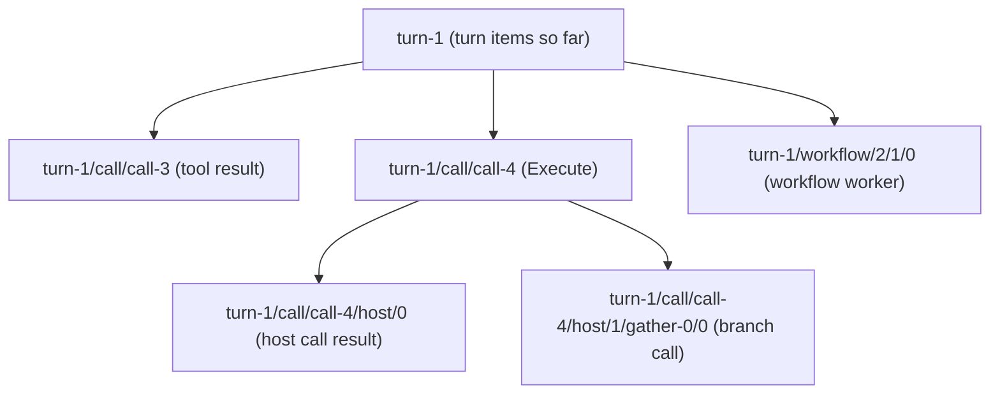

# Step journal

## What it is

A step journal is a durable record of every step a piece of work has finished: each model reply, each tool result, each subagent turn, each call a Code Mode script made. When the process stops in the middle, the next process runs the same work again from the start, but every step that already has a recording returns that recording instead of running. The work "fast-forwards" through what it already did and continues live from the first step with no recording.

This is the record-and-replay idea behind durable-execution systems. It needs two things: a stable key for each step that comes out the same on every run, and a rule for a step that started but has no recorded result.

## Why here, instead of snapshots

RocketClaw used to save one snapshot per root turn and run a special startup phase that rebuilt turns from it. Snapshots covered only the root turn, were written per tool batch, and left subagents, Code Mode scripts and workflows unresumable. A journal covers every level with one mechanism, because nested work just uses longer keys under its parent:

Resume then needs no separate code path: the bridge runs the stored request again through the normal turn code, and the journal answers.

## Example from this change

Two calls run in parallel when a shutdown arrives. Both finish and are recorded, and the turn stops before its next model request.

| Call | Journal after shutdown | On resume |
|---|---|---|
| `bash` | started marker + result | returns the recorded result; does not run |
| `webfetch` | started marker + result | returns the recorded result; does not run |
| any call cut off by a crash or a forced exit | started marker only | the model is told the call was interrupted |

Calls that pause through their own steps (`task`, Execute, and resumable tools such as `ask_user_question` and `rocketclaw_dynamic_workflow`) are not waited on as a whole. They stop between their own steps, re-run on a started marker, and their nested steps replay.

## When not to use it

- When the work is not deterministic enough to reproduce the same step keys. A Code Mode `race` whose winner differs on replay runs that branch live; a script that branches on time or randomness can diverge.
- When steps are cheap and side-effect free. Re-running is simpler than recording.
- When a step's effect and its recording cannot be ordered safely. Anything posted to an outside system before its recording is written can be posted twice after a crash in between; such steps need an idempotency marker written before the side effect.
