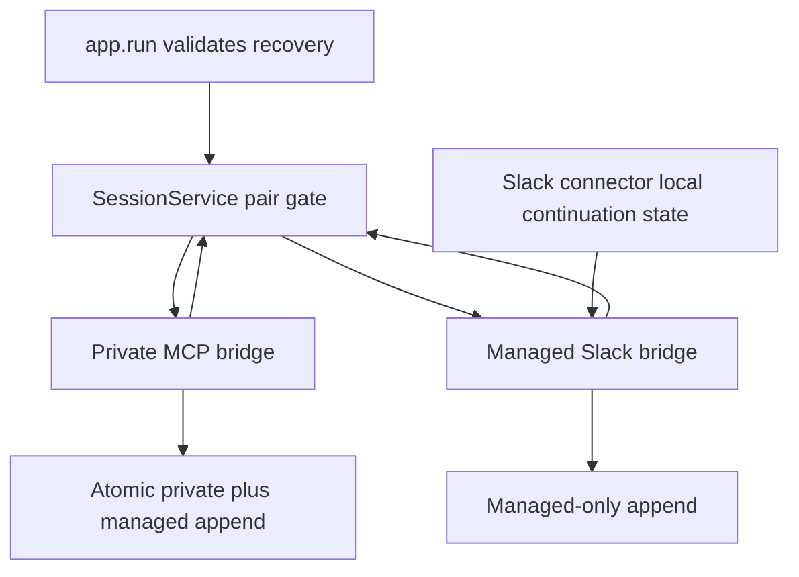

# MCP and Social Mode Production Simplification - Plan

## Goal Capsule

- **Objective:** Remove every independently justified production concept and line from the current MCP and Social Mode implementation while preserving every approved runtime, persistence, migration, recovery, cancellation, API, and Slack behavior. A 120-Go-CLOC reduction is the stretch target.
- **Authority:** Accepted RocketClaw ADRs remain stronger than this refactor plan. Any behavior change stops at the ADR gate.
- **Execution profile:** Characterize behavior first, simplify one subsystem at a time, and verify each subtraction before moving to the next.
- **Stop conditions:** Stop if a proposed deletion changes provider input, history ownership, queue order, restart behavior, Slack payloads, schema behavior, or managed-only stop semantics. If all named safe candidates are exhausted below 120 production CLOC, report the shortfall and stop rather than widening deletion scope.
- **Tail ownership:** The implementation run owns focused tests, `go test ./...`, `make lint`, `make test`, CLOC measurement, and final diff review.

---

## Product Contract

### Summary

This plan simplifies the entire current production diff, not only the pair gate. It removes redundant state, duplicate configuration shapes, repeated database scanning, and Slack-only carrier concepts while preserving the approved two-session product behavior and installed version-7 data.

### Problem Frame

The current change adds 582 production CLOC and 757 raw net production lines. Persistence accounts for 449 raw net lines, followed by bridge coordination at 130 and Slack rendering at 97. The implementation is behaviorally verified, but one product feature now spans a custom reservation state machine, persistence and scheduling in the same service, repeated binding scans, duplicated bridge configuration, and multiple Slack chunk/cleanup carriers.

The simplification must reduce concepts rather than rearrange them. File moves, renames, same-size abstractions, compatibility frameworks, and promised future deletion do not count.

### Requirements

**Behavior preservation**

- R1. New External MCP conversations retain separate private MCP and managed Slack sessions on one Slack thread, with a sticky private agent and independently switchable managed agent.
- R2. A completed MCP `SessionEntry` and its metadata are committed atomically to private and managed histories, with compaction and compaction-summary items excluded only from the managed projection.
- R3. MCP and managed turns retain their separate FIFO order and never overlap; first-turn and startup-recovery ownership remain ahead of later paired work.
- R4. Managed stop controls cancel active, queued, or pair-waiting managed work and never interrupt private MCP work.
- R5. Startup recovery retains session ownership, relay ordering, checkpoint preservation on shutdown, permanent-failure release, and post-recovery managed-agent restoration.
- R6. Installed version-7 rows retain a null private ID, one-session execution, untouched history and metadata, sticky MCP agent reporting, channel binding, schedules, goals, restart notices, pruning, and cleanup.
- R7. MCP tool input and output schemas, attachment behavior, metadata behavior, and result rendering remain byte-for-byte compatible where exact output is already tested.
- R8. Slack request identity, plain request bodies, Markdown response bodies, continuation ordering, root-only request attachments, placeholder ordering, file-only response labels, and compensation cleanup remain unchanged.

**Subtraction and structure**

- R9. The refactor targets removal of 120 production Go CLOC from the current 13,901-CLOC branch baseline and adds no new framework, package, generic scheduler, lifecycle engine, logging, counters, or instrumentation. Behavior preservation remains the stronger requirement.
- R10. The refactor introduces no new exported API unless an existing exported concept can be removed in the same unit for a net reduction in public surface.
- R11. Tests that exist only for deleted internals are removed or rewritten as boundary-level behavioral tests; aggregate coverage must remain at or above the captured 81.3% branch baseline.
- R12. `SessionService` keeps transactional persistence and the minimum shared pair-lifetime coordination needed by both bridges, removes eager startup reservation scanning, and retains bounded gate eviction unless a simpler race-safe lifecycle is proven.

### Key Flows

- F1. **New MCP turn:** Validate the request, resolve the private session, wait for paired ownership, execute with the sticky private agent, atomically save private and managed entries, then release paired work.
- F2. **Managed Slack turn:** Resolve the managed session, wait behind private or recovery ownership, execute with the persisted managed agent, save only managed history, and remain cancelable by managed stop controls.
- F3. **Startup recovery:** Validate recoverable checkpoints, reserve only selected paired recoveries before startup work can begin, recover in the owning session, release abandoned recovery, and restore the persisted managed agent before later managed turns.
- F4. **Installed version-7 conversation:** Keep the existing shared session and history, use the persisted MCP agent for MCP calls, and do not enable dual-history mirroring.
- F5. **Slack transport:** Post request root and continuations before placeholders, carry cleanup state locally, preserve exact MCP identity Blocks, and keep ordinary Slack messages unlabeled.

### Acceptance Examples

- AE1. Given an `MCP1 -> Slack1 -> MCP2` sequence, `MCP2` does not see `Slack1`, while a later managed turn sees `MCP1`, `Slack1`, and `MCP2` in order.
- AE2. Given private MCP work holding the pair, a managed turn waits; a managed stop cancels that waiter without canceling private work.
- AE3. Given a recoverable private checkpoint and ready managed scheduled work, recovery completes and mirrors before the managed work begins.
- AE4. Given a migrated version-7 binding, a follow-up MCP call uses the existing shared history and reported persisted agent without creating a private session.
- AE5. Given an oversized MCP request, Slack receives the root and all continuation messages before thinking and answer placeholders, and later compensation deletes every message created for the failed relay.

### Scope Boundaries

- No ADR meaning changes.
- No MCP schema, authentication, conversation ownership, attachment limit, or error-contract changes.
- No schema version 9 and no conversion of version-7 one-session rows into paired sessions.
- No RocketCode provider, replay format, compaction format, tool visibility, prompt framing, permission, skill, or workspace changes.
- No generic connector refactor and no changes to ordinary Slack, cron, goal-loop, scheduled-message, or question behavior.
- No new observability, retries, defensive validation, or shutdown phase.

### Dependencies

- The current accepted ADR wording and exact existing behavioral tests are the source of truth.
- The installed-base migration starts from schema version 7.
- Current baseline: 13,901 RocketClaw production Go CLOC.

---

## Planning Contract

### Key Technical Decisions

- KTD1. **Keep bounded gate eviction.** Preserve reference-based idle eviction unless implementation proves a smaller race-safe lifecycle that also deletes failed, removed, and pruned pair IDs. Remove eager startup scanning and duplicate recovery bookkeeping without making `turnGates` monotonic.
- KTD2. **Reserve recovery after validation.** Remove eager `reserveIncompleteExternalMCPTurns`. `recoverStartupActiveTurns` selects valid rows; `app.run` reserves the selected paired owners before scheduled messages, goals, or connectors can start.
- KTD3. **Preserve recovery-agent snapshot semantics.** Keep `AgentAfterRecovery` unless it can be represented with fewer lines without adding a fallible post-recovery query or changing concurrent switch behavior. Remove the app-local bridge config mirror independently.
- KTD4. **Use one DAO scanner for External MCP bindings.** Public-ID lookup, conversation-ID lookup, and pruning enumeration share one nullable-private-ID scanner.
- KTD5. **Keep mirroring at the storage boundary.** `appendExternalMCPEntry` and `externalMCPManagedEntry` remain the atomic projection point. Do not replace them with callbacks, repair jobs, triggers, or application-level copying.
- KTD6. **Use the real bridge config type.** Remove the app-local `bridgeConfig` mirror and pass `harnessbridge.Config` through the factory; app wiring adds callbacks and `SessionService` to that value.
- KTD7. **Use two-stage Slack cleanup ownership.** Keep continuation timestamps in a function-local slice until all continuations and placeholders succeed. Then transfer them to connector-owned pending reply state for later app-level compensation. Remove `CleanupMessageTS` from generic `SlackReplyTarget` only when this transfer is both behaviorally covered and a net simplification; otherwise retain the current carrier.
- KTD8. **Reuse Slack splitting primitives.** Use `primarytext.SplitSlackText`, `slices.Chunk`, and existing response posting/deletion patterns. Do not add a generic chunking layer.

### High-Level Technical Design

The simplification keeps the existing package boundaries. It reduces state transitions inside those boundaries instead of introducing a new coordinator package. `SessionService` remains the shared lifetime owner because both bridges already receive it and because moving coordination to app callbacks would add an injected behavior dependency and widen the bridge API.

### Execution Direction

Characterize public behavior before deleting internals. Replace implementation-coupled assertions with provider-input, persisted-history, queue-order, and Slack-request assertions before removing fields or helpers. Each implementation unit must finish green before the next unit begins.

### Sequencing

1. Freeze cross-session and legacy behavior at package boundaries.
2. Simplify pair reservation and recovery lifecycle.
3. Remove duplicated bridge configuration and post-recovery state.
4. Consolidate DAO scanning, pruning, and metadata plumbing.
5. Simplify Slack relay and cleanup carriers.
6. Inline migration dispatch, remove internal-only tests, and measure final production CLOC.

### System-Wide Impact

- **Action parity:** Private MCP turns retain MCP tool restrictions; qualifying managed Slack turns retain Slack-human tools and agent switching.
- **Context parity:** Session IDs, prompt provenance, metadata, compaction privacy, and one-way history remain unchanged.
- **Execution parity:** Pair ownership, atomic commit points, managed-only cancellation, and recovery priority remain externally identical.
- **Legacy parity:** Version-7 one-session rows remain a separate compatibility path and never enter dual-history assumptions.

### Risks and Mitigations

- **Risk:** Removing eager recovery reservations lets paired startup work overtake recovery. **Mitigation:** Reserve every validated selected recovery in `app.run` before starting pending messages or goals; prove with deterministic channels.
- **Risk:** Simplifying recovery-agent restoration changes whether a concurrent switch wins. **Mitigation:** Preserve the current startup snapshot semantics and `AgentAfterRecovery` unless an ADR explicitly changes that race.
- **Risk:** Simplifying gate eviction leaks pair entries or deletes a gate with waiters. **Mitigation:** Retain `refs` until an alternative proves bounded growth across repeated turns, failed registrations, removals, and pruning.
- **Risk:** Localizing continuation cleanup loses timestamps before pending state exists. **Mitigation:** Use local rollback ownership before placeholders succeed, then transfer to pending state; test middle-continuation failure, both placeholder failures, and later compensation.
- **Risk:** Test deletion hides semantic drift. **Mitigation:** Behavioral replacements land before production deletion and assert provider requests, database histories, Slack API forms, and queue order.

### Sources

- `internal/rocketclaw/harnessbridge/store.go:120-139` - current persistence and pair-gate ownership.
- `internal/rocketclaw/harnessbridge/store.go:1061-1233` - atomic mirroring, gate lifecycle, recovery reservation, and metadata lookup.
- `internal/rocketclaw/harnessbridge/bridge.go:520-618` - queue, pair acquisition, cancellation, and recovery completion.
- `internal/rocketclaw/app/thread_bridges.go:490-547` - binding-to-bridge reconstruction.
- `internal/rocketclaw/slackconnector/connector.go:599-703` - request root, continuation, attachment, placeholder, and rollback flow.
- `internal/rocketclaw/slackconnector/connector.go:990-1033` - MCP Block grouping and truncation.
- `internal/rocketclaw/harnessbridge/store_migration.go:151-213` - schema-version dispatch and version-7 table conversion.
- Historical change `ae0f604b5a5c` - successful subtraction of obsolete seeding, response-checkpoint, and summarization concepts; do not restore them.

---

## Implementation Units

### U1. Inventory behavioral coverage and fill only proven gaps

- **Goal:** Map existing boundary tests to R1-R8, identify exact gaps, and avoid a separate wave of duplicate characterization scaffolding.
- **Requirements:** R1-R8, R11
- **Files:** `internal/rocketclaw/app/app_test.go`, `internal/rocketclaw/app/thread_bridges_test.go`, `internal/rocketclaw/app/startup_recovery_test.go`, `internal/rocketclaw/externalmcp/server_test.go`, `internal/rocketclaw/harnessbridge/bridge_test.go`, `internal/rocketclaw/harnessbridge/store_test.go`, `internal/rocketclaw/harnessbridge/store_channel_test.go`, `internal/rocketclaw/slackconnector/connector_test.go`
- **Approach:** Produce a requirement-to-existing-test inventory. Each later unit adds or changes only the minimum missing test immediately before its production deletion. Replace exact internal-shape assertions only when their owning unit removes that shape.
- **Patterns:** Real `SessionService`, real bridge loops, `testing/synctest`, exact provider replay assertions, exact Slack request-form assertions.
- **Test scenarios:** Confirm coverage exists for AE1-AE5; add explicit gaps for active managed stop, queued managed clearing, pair-waiter cancellation while private continues, permanent recovery enqueue failure release, hidden later relay during recovery, and the five-path agent/context/tool matrix.
- **Verification:** Focused tests for `app`, `harnessbridge`, and `slackconnector` pass before production edits.

### U2. Simplify pair recovery reservation lifecycle

- **Goal:** Remove eager startup scanning and abandoned-recovery bookkeeping while preserving bounded gate eviction, exclusion, priority, and cancellation.
- **Requirements:** R3-R5, R9-R12
- **Files:** `internal/rocketclaw/harnessbridge/store.go`, `internal/rocketclaw/app/app.go`, `internal/rocketclaw/app/startup_recovery.go`, corresponding tests
- **Approach:** Remove `reserveIncompleteExternalMCPTurns`; validate recovery first, reserve selected paired owners before startup work, and keep permanent enqueue-failure release. Retain reference-based idle eviction unless a smaller alternative also removes gates after failed registration, removal, and pruning without racing waiters.
- **Dependencies:** U1
- **Test scenarios:** Two bridges never execute together; active managed stop, queued managed clearing, and pair-waiter cancellation all preserve private work; first MCP turn remains first; valid recovery outranks sibling work; permanent recovery enqueue failure releases ownership; corrupt/duplicate rows do not leave reservations; shutdown preserves checkpoint ownership; repeated register/remove cycles return gate-map size to baseline.
- **Verification:** `go test -race ./internal/rocketclaw/app ./internal/rocketclaw/harnessbridge`; no growth across repeated turns or transient pair creation/removal.

### U3. Remove duplicated bridge configuration

- **Goal:** Delete the app-local config mirror while preserving current recovery-agent snapshot semantics and agent selection for every path.
- **Requirements:** R1, R4-R6, R9-R11
- **Files:** `internal/rocketclaw/app/app.go`, `internal/rocketclaw/app/thread_bridges.go`, `internal/rocketclaw/harnessbridge/bridge.go`, corresponding tests
- **Approach:** Pass `harnessbridge.Config` through the factory and let app wiring add callbacks and `SessionService`. Keep `AgentAfterRecovery` unless an equally infallible, smaller representation preserves the startup snapshot when a concurrent Slack switch occurs during recovery.
- **Dependencies:** U1, U2
- **Test scenarios:** New private agent stays sticky; managed switch does not alter private; managed recovery uses checkpoint agent then the startup restoration snapshot; a switch during recovery retains current behavior; legacy version-7 MCP call reports and uses persisted MCP agent; private/recovery paths retain exact tools, prompt provenance, metadata, compaction visibility, and session IDs.
- **Verification:** Focused app and harnessbridge tests pass; searches show app-local `bridgeConfig` removed and no new fallible post-recovery read added.

### U4. Consolidate binding persistence, pruning, and metadata plumbing

- **Goal:** Reduce repeated SQL/null handling and pair-aware lifecycle branching without moving mirroring out of the store.
- **Requirements:** R2, R5-R7, R9-R12
- **Files:** `internal/rocketclaw/harnessbridge/store.go`, `internal/rocketclaw/harnessbridge/store_dao.go`, `internal/rocketclaw/harnessbridge/store_test.go`
- **Approach:** Introduce one private row scanner reused by binding reads and enumeration; centralize conversation-ID lookup in `stateDAO`; collapse pruning around managed freshness plus optional private freshness; remove impossible states and temporary metadata variables; retain the atomic mirror transaction unchanged in meaning.
- **Dependencies:** U1
- **Test scenarios:** Public and reverse lookup for paired and legacy rows; nullable private IDs; a table-driven pruning truth table covering all four paired private/managed stale/fresh combinations plus the legacy managed-only case; atomic deletion of binding, histories, active rows, and thread state; atomic rollback; initial and transient metadata; malformed projection rollback.
- **Verification:** `go test -race ./internal/rocketclaw/harnessbridge`; SQL schema and migration tests pass unchanged in meaning.

### U5. Simplify Slack relay, Blocks, chunking, and cleanup state

- **Goal:** Remove duplicate relay methods, generic cleanup fields, and join-then-resplit work while preserving exact Slack API behavior.
- **Requirements:** R7-R11
- **Files:** `internal/rocketclaw/events/types.go`, `internal/rocketclaw/slackconnector/connector.go`, `internal/rocketclaw/app/app.go`, corresponding tests
- **Approach:** Use one relay method with optional `threadTS`; empty `threadTS` resolves the configured channel name and non-empty `threadTS` uses the persisted channel ID unchanged. Retain `ExternalMCPRelay`. Keep local continuation IDs for pre-placeholder rollback, transfer them to pending reply state after placeholders succeed, group pre-split chunks with `slices.Chunk`, build Blocks directly from groups, and keep ordinary response paths untouched.
- **Dependencies:** U1
- **Test scenarios:** Root channel-name resolution and follow-up channel-ID preservation; 50-Block grouping; all continuation messages precede placeholders; root-only attachments; failure on a middle continuation; thinking-placeholder and answer-placeholder failure after continuations; later compensation after successful return removes root, continuations, and placeholders; response Markdown; file-only labels; ordinary Slack remains unlabeled.
- **Verification:** `go test -race ./internal/rocketclaw/slackconnector ./internal/rocketclaw/app`; exact form assertions pass.

### U6. Inline migration dispatch and complete subtraction pass

- **Goal:** Remove remaining one-use wrappers, obsolete internal tests, and dead concepts; prove a substantial production reduction.
- **Requirements:** R6, R9-R12
- **Files:** `internal/rocketclaw/harnessbridge/store_migration.go`, `internal/rocketclaw/harnessbridge/store_channel_test.go`, all files touched by U2-U5
- **Approach:** Inline the version gate into `migrateSessionDB`; keep the table-swap worker because fresh/legacy paths share it; remove tests dedicated only to deleted internals after behavioral replacements are green; inspect the entire diff for one-use helpers, defensive branches, and duplicate state.
- **Dependencies:** U2-U5
- **Test scenarios:** Real version-7 database upgrades with null private ID, unchanged mixed history and metadata, idempotent reopen, future-version rejection, new paired row creation after upgrade.
- **Verification:** Report the exact production CLOC delta against 13,901 and compare it with the 120-CLOC target. If safe named candidates are exhausted above 13,781, stop and report rather than deleting unplanned code. `jj diff --git` contains no resurrected seed/checkpoint/summarization concepts.

---

## Verification Contract

| Check | Applies to | Done signal |
|---|---|---|
| `gofmt` on touched Go files | U1-U6 | No formatting diff remains |
| `go test ./internal/rocketclaw/app` | U1-U3, U5 | App routing and recovery tests pass |
| `go test ./internal/rocketclaw/externalmcp` | U1, U5 | MCP schema and result contract pass |
| `go test ./internal/rocketclaw/harnessbridge` | U1-U4, U6 | Persistence, mirroring, migration, recovery, and cancellation pass |
| `go test ./internal/rocketclaw/slackconnector` | U1, U5 | Exact Slack request and cleanup tests pass |
| `go test -race ./internal/rocketclaw/app ./internal/rocketclaw/harnessbridge ./internal/rocketclaw/slackconnector` | U2-U5 | No race or deadlock failures |
| `go test ./...` | U6 | Repository-wide tests pass |
| `make lint` | U6 | Zero lint issues without suppressions |
| `make test` | U6 | Race, coverage, and component test gates pass |
| Aggregate coverage comparison | R11, U6 | Final coverage is at least the captured 81.3% branch baseline, independent of the repository stable-threshold shortcut |
| `make cloc` after U2-U5 and U6 | R9, U2-U6 | Intermediate deltas expose weak candidates early; final result reports progress toward 13,781 without widening scope |
| `gopls check` on touched production files | U6 | No diagnostics |
| `jj diff --git` standards pass | U6 | No behavior drift, dead wrappers, defensive guards, accidental exports, or unrelated changes |

---

## Definition of Done

- Every R1-R8 behavioral invariant is protected by boundary-level tests and remains unchanged.
- Every named deletion candidate in the production-file ownership ledger is either removed or retained with a concrete behavior-preservation reason in the final report. The executor must not widen scope to compensate for a CLOC shortfall.
- `reserveIncompleteExternalMCPTurns`, app-local `bridgeConfig`, duplicate external relay methods, and one-use migration dispatch are removed. `sessionTurnGate.refs`, `AgentAfterRecovery`, and generic `SlackReplyTarget.CleanupMessageTS` remain unless their owning units prove a smaller race-safe and failure-safe replacement before deletion.
- No new package, generic coordinator, scheduler, lifecycle framework, exported helper, metric, log stream, retry path, or compatibility layer replaces the deleted concepts.
- Private MCP, managed Slack, private recovery, managed recovery, and version-7 one-session paths preserve their distinct agents, tools, context, history, and cancellation behavior.
- MCP mirroring remains atomic and one-way; compaction privacy and metadata ordering remain exact.
- Slack root, continuation, attachment, placeholder, response, and cleanup payloads remain exact.
- All Verification Contract checks pass.
- Abandoned experimental code and tests for deleted internal shapes are removed from the working copy.
- README and ADR meaning remain unchanged; the existing feature documentation remains accurate.

---

## Appendix

### Production File Ownership Ledger

| Production file | Owning unit | Named simplification candidates | Preservation proof | Estimated net CLOC |
|---|---|---|---|---:|
| `internal/rocketclaw/app/app.go` | U2, U3, U5 | reserve selected recoveries in one pass; pass real bridge config; use consolidated relay method | recovery ordering, duplicate-ID creation, relay activation tests | 10-20 |
| `internal/rocketclaw/app/startup_recovery.go` | U2 | remove reservation-release interface and abandoned map after reserve-after-validation | corrupt, duplicate, shutdown, permanent handoff tests | 15-25 |
| `internal/rocketclaw/app/thread_bridges.go` | U3 | remove app-local `bridgeConfig`; reduce duplicated binding lookup where live bridge already exists | five-path agent/context matrix and legacy follow-up | 15-25 |
| `internal/rocketclaw/events/types.go` | U5 | remove generic cleanup timestamps only after two-stage Slack ownership is proven | continuation and later-compensation Slack tests | 0-5 |
| `internal/rocketclaw/externalmcp/server.go` | Audit only | no planned production deletion; guard against opportunistic schema edits | exact input/output schema tests | 0 |
| `internal/rocketclaw/harnessbridge/bridge.go` | U2-U4 | remove eager reservation interactions, temporary metadata plumbing, and duplicated config forwarding; retain recovery snapshot semantics | provider input, recovery, cancellation, tool visibility, metadata tests | 20-35 |
| `internal/rocketclaw/harnessbridge/store.go` | U2, U4 | remove eager reservation scan; consolidate binding scans and pruning; retain bounded gate eviction and atomic mirroring | race tests, pruning truth table, rollback, gate lifecycle tests | 40-65 |
| `internal/rocketclaw/harnessbridge/store_dao.go` | U4 | one shared nullable binding scanner | public/reverse/enumeration lookup tests | 0-10 |
| `internal/rocketclaw/harnessbridge/store_migration.go` | U6 | inline one-use version dispatch | version-7 migration and reopen tests | 8-15 |
| `internal/rocketclaw/harnessbridge/store_schema.go` | Audit only | no planned production deletion; preserve schema v8 exactly | fresh-schema and version-7 migration tests | 0 |
| `internal/rocketclaw/slackconnector/connector.go` | U5 | consolidate relay methods; use `slices.Chunk`; remove join-then-resplit; local-to-pending cleanup ownership | exact Slack forms and every failure window | 20-35 |

The estimates overlap where one deleted carrier removes plumbing in multiple files. They are planning confidence ranges, not per-unit quotas. The named candidates comfortably exceed the 120-CLOC stretch target before any unplanned deletion.
