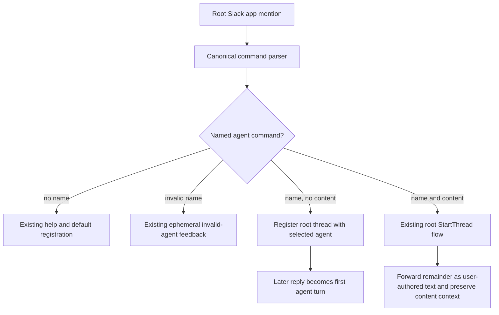

# Slack Root Agent Command Plan

## Goal Capsule

- **Objective:** Make an authorized root Slack mention with `$agent <name> [message]` select the named configured agent, optionally submit the remainder as its first prompt, and preserve the ready-thread form when no message is supplied.
- **Authority:** The requested root-message behavior is authoritative. Existing managed-thread agent switching, command normalization, help fallback, thread identity, and Slack message metadata remain unchanged unless this plan states otherwise.
- **Execution profile:** Extend the existing root app-mention dispatch and prove both registration-only and first-prompt paths with focused behavioral tests before running repository-wide verification.
- **Stop conditions:** Stop if the change requires a new router interface, a second command parser, a different thread identity, default-agent fallback for an explicit name, or changes to managed-thread `$agent` switching.
- **Tail ownership:** The implementation run owns focused tests, full tests, lint, `make test`, and final diff review.

---

## Product Contract

### Summary

RocketClaw currently treats every root `$agent` command as unsupported command help. That loses the selected agent and any message following the agent name. Root mentions must support the same configured-agent names as managed threads while retaining the existing no-turn behavior for a command that only establishes a ready thread.

### Problem Frame

The canonical Slack parser already returns `agent` and its full argument string, and managed-thread dispatch already switches agents. The root app-mention branch has no `agent` case, so `$agent name message` falls into the default help-and-register path with the channel's first agent. `$agent name` therefore cannot create a ready thread owned by the requested agent.

### Requirements

#### Root agent selection

- R1. After the bot mention is removed, `$agent <configured-agent-token>` registers the root timestamp as a managed thread owned by the exact named configured agent without submitting an agent turn.
- R2. `$agent <configured-agent> <message>` starts the managed thread at the root timestamp with the exact named agent and uses only the trimmed remainder as the user-authored first prompt.
- R3. The inline-message path preserves the existing root start flow, including placeholders, reaction behavior, Slack reply target metadata, attachments, and forwarded previews.
- R4. A root command with an explicit agent name that is not in the channel's configured agent list posts the existing invalid-agent ephemeral feedback and does not fall back, register, start, post help, or create a turn.

#### Command and thread compatibility

- R5. Bare `$agent`, bare `$`, unknown commands, and other existing help-producing root inputs retain their permanent help and first-configured-agent registration behavior.
- R6. Managed-thread `$agent` switching and selector behavior remain unchanged, including the existing invalid-agent feedback and requester restriction.
- R7. Dollar command spacing, case-insensitive command names, emoji and Slack colon aliases, Unicode whitespace boundaries, single-token configured agent names, and internal whitespace in the forwarded message retain their existing semantics.
- R8. A root command that has no textual remainder but does contain attachments or forwarded previews continues through the existing content-bearing thread-start path rather than silently discarding that content.
- R10. A ready-thread registration error logs and returns without fallback or other Slack side effects, while an already-registered root thread is an idempotent no-op that does not overwrite its persisted agent.

#### Documentation

- R9. The RocketClaw Slack command documentation describes root named-agent selection, the ready-thread form, and the optional inline first message without claiming that root agent commands are unavailable.

### Actors

- A1. An authorized user sending a root app mention in a configured Slack channel.
- A2. RocketClaw's Slack connector and managed thread router.

### Key Flows

- F1. **Ready named-agent thread:** The connector canonicalizes the root command, validates the named agent, registers the root timestamp with that agent, and returns. The command is not added to agent history; the next ordinary reply is the first turn.
- F2. **Named-agent first turn:** The connector canonicalizes the root command, separates the first agent token from the remainder, validates the agent, preserves the existing root content and placeholder flow, and starts the thread with the remainder as user-authored text plus any existing attachment or forwarded context.
- F3. **Invalid named agent:** The connector reports the existing ephemeral configuration error and exits before help, registration, placeholders, reactions, or thread start.
- F4. **Existing command paths:** Bare agent selection/help and managed-thread agent controls continue through their current dispatch paths.

### Acceptance Examples

- AE1. Given an authorized root mention containing `$agent planner`, RocketClaw records a thread at the mention timestamp with single-token agent `planner`, creates no agent history or turn, and a later ordinary reply is accepted as the first turn.
- AE2. Given one accepted authorized root mention containing `$agent planner inspect the failing test`, RocketClaw invokes the existing root start operation once at the mention timestamp with agent `planner`, and the user-authored first prompt is exactly `inspect the failing test` without the command prefix.
- AE3. Given `$ agent planner\tinspect the failing test`, `$AgEnT planner inspect the failing test`, `🎛 planner inspect the failing test`, or `:control_knobs: planner inspect the failing test`, the same selected-agent and prompt contract applies.
- AE4. Given `$agent unknown inspect`, RocketClaw posts the existing invalid-agent ephemeral feedback and performs no help post, registration, placeholder creation, reaction, or agent start.
- AE5. Given bare `$agent`, `$`, an unknown command, or `$stop later` at the root, existing permanent help behavior and default-agent registration remain unchanged.
- AE6. Given a managed-thread `$agent planner`, RocketClaw still switches the persisted agent without treating the command as a new prompt.
- AE7. Given a registration error or an already-registered root thread, RocketClaw returns without help, fallback, placeholders, reactions, or a new agent turn; an existing registration retains its persisted agent.

### Scope Boundaries

- No new Slack command parser, selector surface, router interface, persistence field, or cross-connector syntax is introduced; the existing `$agent` argument is split into a configured agent token and an optional root prompt remainder.
- No changes to MCP, CLI, workflow, cron, or agent-tool surfaces are included.
- No changes to managed-thread command dispatch, ordinary root mentions, goal handling, cron handling, or Slack attachment/forwarding semantics are included beyond the named-agent root branch.
- No new visible acknowledgement is added for the ready-thread form; the root Slack message itself remains the visible command and registration is the only server-side action required.
- Slack retry deduplication and edited-event policy are inherited from the existing root app-mention behavior and are not added to this change. The inline contract is for one accepted event; registration-only retries remain safe through the existing `created=false` result, while `StartThread` replay behavior is unchanged.
- Malformed Slack event envelopes such as missing timestamps remain outside this command-contract change; no new defensive validation is introduced.
- Root named-agent syntax accepts the existing configured agent names that are single non-whitespace tokens; whitespace-containing names are not part of this command form.

### Dependencies

- `parseCanonicalSlackCommand` and `slackDollarCommand` remain the canonical normalization and lexical parsing path.
- `threadRouter.RegisterThread` persists a thread without submitting content, while `threadRouter.StartThread` persists and submits the first inbound message.
- The channel's ordered configured `Agents` list is the validation and default-agent source.

### System-Wide Impact

The change makes one existing Slack command surface agent-aware at thread creation time. The ready form persists the selected agent and starts the existing managed bridge without a session entry; the inline form additionally submits the first inbound message. It does not add a second persisted agent state or change the MCP, CLI, workflow, cron, scheduled, or tool agent contracts.

Agent-surface disposition: Slack root named-agent selection is **Now**; managed Slack switching and selector behavior are unchanged parity baselines; MCP's fixed private first-agent behavior and non-Slack agent-selection surfaces are **unchanged/deferred**; changing thread ownership through an agent tool is **Never/human-only** for this change. Existing configured-channel and authorized-user checks remain before agent validation, so an unauthorized sender receives no configured-agent disclosure or router side effect.

---

## Planning Contract

### Key Technical Decisions

- KTD1. **Extend root dispatch in place.** Add the named-agent branch to `handleAppMentionEvent` rather than changing canonical parsing, introducing a root-only parser, or altering the router interface.
- KTD2. **Split at the first Unicode whitespace boundary.** Treat the first argument token as the configured agent name and trim only the boundary around the remainder. Preserve all internal whitespace in the remainder and keep agent names case-sensitive after command-name normalization.
- KTD3. **Use the existing lifecycle operations.** Use `RegisterThread` for a text-free command with no attachments or forwarded previews. Let the existing root start path call `StartThread` for a non-empty remainder or other meaningful content, so placeholders, reactions, metadata, attachments, and forwarding remain centralized.
- KTD4. **Validate before side effects.** Check the explicit name against `socialModeAgents(channel)` and reuse the existing invalid-agent ephemeral message. Do not call the help fallback or silently substitute the channel's first agent when the explicit name is invalid. Validation remains after the existing authorization and channel checks.
- KTD5. **Preserve unrelated command paths.** Leave the managed-thread `agent` case, bare-root help fallback, and existing goal, cron, and workflow cases structurally unchanged.
- KTD6. **Update current command documentation.** Reconcile the exact Slack contract in the cheatsheet and dollar-command design spec, and update the high-level README sentence so it distinguishes ordinary root turns from named-agent ready threads. Treat the dated `internal/rocketclaw/docs/plans/2026-07-24-slack-dollar-commands.md` as historical implementation choreography, not a current command contract, and leave it unchanged.
- KTD7. **Inherit existing retry semantics.** Do not add event IDs, durable deduplication, or edited-event handling. Treat `RegisterThread`'s existing-thread result as a no-op and preserve `StartThread`'s current replay behavior for repeated accepted events.

### Assumptions

- A named root `$agent` command with no textual remainder, files, or forwarded previews intentionally produces no help or acknowledgement. This follows the request that the thread start ready for continued conversation.
- A message remainder beginning with another dollar command is forwarded literally as the first prompt; root dispatch does not recursively parse the remainder.
- A whitespace-only remainder is equivalent to no remainder for registration-only behavior.
- Existing generated attachment and forwarded-preview context remains part of the inbound message even when the user-authored remainder is empty; only the bot mention and `$agent <name>` control prefix are removed from user-authored prompt text.
- The Slack connector stub verifies dispatch side effects, while `TestThreadBridgeManagerRegistersThreadWithoutSubmitting` remains the app-layer proof for persisted ownership, zero initial entries, and later-first-reply behavior.

### Deferred Questions

- Whether a ready-thread registration failure should gain a new Slack-visible error is deferred. This fix preserves the existing log-and-return behavior because successful registration is silent and no failure-message contract was requested.

### High-Level Technical Design

The connector remains the only changed production component. The app router already owns the persistence distinction between registration-only and first-turn start, so the change should select the correct existing operation rather than add state or duplicate lifecycle logic.

### Sequencing

1. Add focused root named-agent regression coverage and update the existing help fixture so bare `$agent` remains the help case.
2. Implement the root `agent` dispatch with configured-agent validation, first-token splitting, registration-only handling, and prompt remainder forwarding.
3. Reconcile the user-facing cheatsheet, Slack dollar-command design spec, and high-level README wording.
4. Run focused tests, formatting and language diagnostics, then the full repository verification contract.

### Research Inputs

- `internal/rocketclaw/slackconnector/connector.go` shows the root help fallback at `handleAppMentionEvent`, managed-thread `$agent` dispatch, canonical parser behavior, and the existing workflow first-token split pattern.
- `internal/rocketclaw/slackconnector/connector_test.go` provides root-start Slack fixtures, command canonicalization tests, the help regression, and router stub snapshots for starts, replies, and registrations.
- `internal/rocketclaw/app/thread_bridges.go` and `internal/rocketclaw/app/thread_bridges_test.go` establish that `RegisterThread` persists the agent without session entries and that a later reply is the first submission.
- `internal/rocketclaw/docs/specs/2026-07-24-slack-dollar-commands-design.md` and `cmd/rocketclaw/CHEATSHEET.md` are the current command-contract references that still encode the old root restriction.

---

## Implementation Units

### U1. Route Named Agents From Root Mentions

- **Goal:** Make root `$agent` commands select the explicit configured agent and choose registration-only versus first-turn start without disturbing existing command paths.
- **Requirements:** R1-R8, R10.
- **Dependencies:** None; this unit uses the existing canonical parser and thread-router operations.
- **Files:** Modify `internal/rocketclaw/slackconnector/connector.go`; modify `internal/rocketclaw/slackconnector/connector_test.go`; verify the existing contract in `internal/rocketclaw/app/thread_bridges_test.go`.
- **Approach:** Add a root-only `agent` dispatch case that validates the first argument token before side effects, returns immediately after registration for a truly empty command, and otherwise rewrites only the user-authored prompt source before entering the existing root start flow. Registration errors log and return; `created=false` returns without falling through.
- **Patterns:** Extend the `parseCanonicalSlackCommand` switch in `handleAppMentionEvent`. Use `strings.IndexFunc` with `unicode.IsSpace` for the first-token boundary, `slices.Contains` for configured-agent validation, `RegisterThread` for a truly content-free ready thread, and the existing `StartThread` path for prompts and content-bearing events.
- **Execution note:** Characterize the no-submit and first-submit contracts before changing the root dispatch so a passing test proves the requested behavior rather than only parser output.
- **Test Scenarios:**
  - A configured named agent with no remainder records one registration at the root timestamp with that agent and produces no help, start, reply, placeholder, reaction, or agent history.
  - A configured named agent with a normal remainder starts for one accepted event with the root timestamp, selected agent, exact trimmed user-authored remainder, existing allowed-agent metadata, and no command prefix.
  - Spaced dollar syntax, mixed-case command names, emoji aliases, colon aliases, tabs, repeated internal whitespace, a mixed-case configured agent token, and a remainder beginning with another command preserve the stated parser and forwarding rules; a configured name containing whitespace remains outside this syntax.
  - An explicit unknown agent posts only the existing ephemeral error and causes no other side effect.
  - A registration error and an already-registered root thread return without additional side effects or default-agent fallback; the existing persisted agent remains unchanged for the already-registered case.
  - Root named-agent input with image-only content, text-file content, forwarded previews, or combinations of content and no text remainder is not discarded; it follows the existing content-bearing start path, while the control prefix is absent from generated inbound text.
  - An unauthorized root sender is rejected by the existing allowlist gate before explicit-agent validation or any Slack/router side effect.
  - The existing app bridge test continues to prove that registration persists the selected agent with zero initial entries and that a later reply is its first submission.
  - Bare `$agent` remains in the existing help/default-registration table, and managed-thread `$agent` switching remains covered by the existing test suite.
- **Verification:** Run the focused Slack connector tests for canonical parsing, dollar parsing, root app mentions, and managed-thread command behavior before the full contract.

### U2. Reconcile Slack Command Documentation

- **Goal:** Make durable Slack documentation describe the new root named-agent forms and their distinction from managed-thread switching and command help.
- **Requirements:** R9.
- **Dependencies:** U1 establishes the final behavior terms before documentation is revised.
- **Files:** Modify `cmd/rocketclaw/CHEATSHEET.md`; modify `internal/rocketclaw/docs/specs/2026-07-24-slack-dollar-commands-design.md`; modify `README.md`.
- **Approach:** Replace the old root-agent restriction with the two named-agent forms, retain the bare-command help exception, and keep the high-level README wording accurate without documenting implementation details.
- **Patterns:** Keep the existing dollar-command terminology and distinguish ordinary root mentions, root named-agent ready threads, root named-agent first prompts, and managed-thread `$agent` switching. Do not add a second syntax or document a cross-surface grammar. The dated prior implementation plan remains a historical record and is excluded from the current-contract stale-claim audit.
- **Test Scenarios:** Perform a direct stale-claim audit of the touched current-contract documents. The behavioral contract remains protected by U1 tests; no new documentation test harness is introduced.
- **Verification:** Search the touched current-contract documents for stale claims that root agent commands always produce help or require an existing managed thread, then run every command in the Verification Contract table.

---

## Verification Contract

| Check | Command | Done signal |
| --- | --- | --- |
| Focused Slack behavior | `go test ./internal/rocketclaw/slackconnector -run 'Test(CanonicalSlackCommand|SlackDollarCommand|HandleAppMentionEvent.*|HandleMessageEvent.*Agent)' -count=1` | Named root cases pass and existing help/managed-switch cases remain green. |
| Language diagnostics | `go run golang.org/x/tools/gopls@latest check internal/rocketclaw/slackconnector/connector.go internal/rocketclaw/slackconnector/connector_test.go` | No diagnostics for touched Go files. |
| Formatting | `gofmt -w internal/rocketclaw/slackconnector/connector.go internal/rocketclaw/slackconnector/connector_test.go` | Touched Go files are formatted. |
| Full tests | `go test ./...` | All packages pass. |
| Lint | `make lint` | Repository lint passes without suppressions. |
| Test gate | `make test` | Repository test, race, coverage, and metric gates pass. |
| Diff review | `jj diff --git` | Diff is limited to the root routing fix, focused tests, and the stated documentation. |

---

## Definition of Done

- R1-R10 and AE1-AE7 are covered by implementation or existing behavioral tests.
- Explicit root agent names never fall through to default-agent help registration or silently select the first configured agent.
- The no-message form creates a ready persisted thread with no initial agent entry, and a later reply remains its first turn.
- The message form invokes the existing root start operation once for one accepted event and forwards only the user-authored message remainder with existing Slack metadata and content handling.
- The plan makes no at-most-once claim for repeated inline Slack deliveries; existing replay behavior remains unchanged.
- Bare root help, managed-thread switching, canonical aliases, and ordinary root mentions retain their prior behavior.
- Documentation no longer claims that root named-agent commands are unsupported or help-only.
- No new parser, interface, persistence field, dependency, defensive guard, or unrelated refactor remains in the diff.
- All verification contract checks pass, and abandoned experimental code or fixtures are removed before completion.
