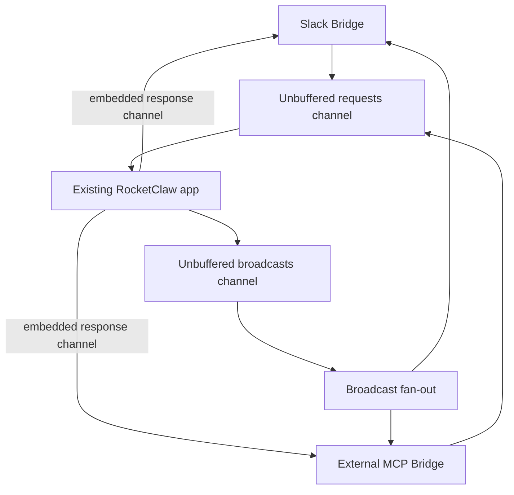

# Two-Channel Clockwork - Plan

## Goal Capsule

- **Objective:** Put the existing RocketClaw application behind one requests channel and one broadcasts channel, then make Slack and the existing External MCP endpoint use those channels without changing RocketClaw behavior.
- **Authority:** The agreed two-channel architecture and current RocketClaw behavior are authoritative.
- **Stop conditions:** Stop if the refactor requires changing conversation behavior, persistence, recovery, conversation IDs, scheduling, the External MCP API, Slack presentation, or the source CLOC budget.
- **Execution profile:** Characterize current behavior, add the two channels, move one existing hookup at a time, and delete each replaced hookup.

---

## Product Contract

### Summary

Bridges send requests to RocketClaw through one unbuffered requests channel.
Each request contains the response channel for that request.
RocketClaw sends live broadcasts through one broadcasts channel to all connected Bridges except a sender named by the Broadcast.

### Requirements

**Requests**

- R1. RocketClaw has one unbuffered requests channel shared by all Bridges.
- R2. Every Request identifies its sender Bridge, carries the existing operation and inputs, and carries its own response channel.
- R3. The response channel carries the same progress, interaction, result, and error information that the originating interface receives today.
- R4. Sending a Request changes only how an existing operation reaches RocketClaw; the existing operation and all state behind it remain unchanged.

**Broadcasts**

- R5. RocketClaw has one unbuffered broadcasts channel.
- R6. A Broadcast with a sender goes to the other connected Bridge: Slack-originated Broadcasts go to External MCP, and External-MCP-originated Broadcasts go to Slack.
- R7. A Broadcast without a sender, including a scheduled cron result, goes to both connected Bridges.
- R8. Every Bridge receives Broadcasts in the order RocketClaw sends them and may handle or drop each Broadcast.
- R9. Each delivered Broadcast contains an acknowledgement channel through which the Bridge reports handled, dropped, or failed.
- R10. One Bridge or one Broadcast does not hold up another Bridge or an unrelated Broadcast.
- R11. Broadcasts are live-only; a disconnected Bridge misses them and receives only later Broadcasts after reconnecting.

**Bridges**

- R12. A Bridge is a trusted RocketClaw component and handles authentication and user access for its own interface.
- R13. Slack operates as an in-memory Bridge.
- R14. The existing External MCP endpoint operates as a network Bridge.

**Compatibility**

- R15. Existing Slack prompts, replies, commands, progress, final answers, attachments, questions, child threads, follow-up buffering, reactions, and cleanup behave exactly as they do now.
- R16. Existing scheduled cron behavior remains unchanged: distinct jobs may report concurrently, a silent job remains silent, and one failed report does not stop other jobs.
- R17. Existing External MCP behavior and its Slack relay remain unchanged.
- R18. Existing workflows, goals, scheduling, persistence, recovery, restart, reload, and shutdown behavior remain unchanged.
- R19. Connector communication in the served runtime uses the requests channel, the broadcasts channel, or a response or acknowledgement channel carried inside their messages; direct connector callbacks are removed.

### Key Flows

- F1. **Bridge request**
  - A Bridge creates a response channel.
  - It sends one Request containing its Bridge ID, the existing operation, and that response channel.
  - RocketClaw calls the existing application method for that operation.
  - The Bridge consumes the operation's existing progress and final result from its response channel.
  - **Covers:** R1-R4.

- F2. **Request-caused broadcast**
  - Existing output goes to the sender on the Request's response channel.
  - RocketClaw also sends the output as a Broadcast naming the sender.
  - The broadcaster copies it to every other connected Bridge.
  - **Covers:** R5-R10.

- F3. **Clockwork broadcast**
  - Existing internal work, such as a visible scheduled cron result, sends a Broadcast without a sender.
  - The broadcaster copies it to the connected Slack and External MCP Bridges.
  - Each Bridge handles or drops its copy and acknowledges the outcome.
  - **Covers:** R7-R11, R16.

- F4. **Slack Bridge**
  - Slack keeps its existing event handling and Slack API behavior.
  - Where it currently calls the app directly, it sends a Request instead.
  - Where RocketClaw currently calls Slack directly, it sends a response or Broadcast instead.
  - **Covers:** R13, R15, R19.

### Acceptance Examples

- AE1. **Covers R1-R6.** Slack sends a prompt Request, receives its result on that Request's response channel, and does not receive the sender-excluded Broadcast copy; External MCP receives that Broadcast and may drop it.
- AE2. **Covers R5-R11.** Thirty visible scheduled cron results are sent without a sender; Slack and External MCP receive all 30, and a slow or failed handling of one result does not stop the other results or Bridge.
- AE3. **Covers R8-R9.** A Bridge receives Broadcasts in send order and acknowledges each as handled, dropped, or failed.
- AE4. **Covers R11.** A disconnected Bridge misses a cron result and does not receive it after reconnecting.
- AE5. **Covers R15.** A Slack follow-up received during an active turn is buffered and promoted after final response cleanup exactly as it is today, including after root-event redelivery.
- AE6. **Covers R16.** A silent scheduled cronjob creates no Broadcast, while distinct visible jobs can report concurrently.
- AE7. **Covers R14, R17.** External MCP returns the same response and creates the same Slack relay and paired conversation behavior as today, but its connector communication crosses the two channel boundary.
- AE8. **Covers R18.** Existing persistence and recovery tests pass without schema or behavior changes.
- AE9. **Covers R19.** A repository search finds no served-runtime direct hookup from Slack, cron, questions, child-thread creation, or External MCP relay into another connector.

### Scope Boundaries

- This plan changes connector wiring only.
- Do not change persistence, database schemas, recovery, conversation IDs, per-conversation queues, no-overlap behavior, goals, workflows, scheduling, or provider replay.
- Do not change Slack formatting, Slack API call order, command behavior, buffering, attachments, questions, reactions, or cleanup.
- Do not change the public External MCP request or response contract.
- Do not add another interface. This plan covers only Slack and the existing External MCP endpoint.
- Do not add durable Broadcast storage, replay, retries, or a new internal wire protocol.
- Do not change Slack configuration requirements in this work.

---

## Planning Contract

Product Contract unchanged.

### Key Technical Decisions

- KTD1. **Keep the existing RocketClaw app as the clockwork.** The new channel loop calls the same `threadBridgeManager`, `cronjob.Manager`, question, child-thread, and External MCP operations that exist now. It does not reimplement them.
- KTD2. **Put shared messages in `events` and coordination in `app`.** `events` owns the Request, Response, Broadcast, Bridge ID, and acknowledgement values. `app` owns the request receiver, Bridge registration, and broadcast fan-out.
- KTD3. **Use the response channel embedded in each Request.** Turn progress and final output for the sender travel on that Request's response channel. Existing non-turn operations return their current result and error on the same channel.
- KTD4. **Fan out Broadcasts outside the application logic.** One receiver reads the broadcasts channel, snapshots connected Bridges, excludes the sender, and hands one copy to each remaining Bridge. It does not wait for all acknowledgements before reading the next Broadcast.
- KTD5. **Preserve current ordering instead of inventing a new global rule.** Messages belonging to one existing turn keep their current sequence. Distinct scheduled cron results remain independent and may overlap as they do now.
- KTD6. **Keep Bridge-specific behavior at the Bridge.** Slack continues to own Slack targets, Blocks, placeholders, questions, attachments, commands, and follow-up stacks. The app receives only the data needed to call its existing methods.
- KTD7. **Delete each old hookup when its channel path lands.** The final runtime must not keep both the direct callback and channel path for the same behavior.
- KTD8. **Stay under the existing source CLOC budget by replacement, not layering.** Do not edit `GO_SOURCE_CLOC_BUDGET`. Run the CLOC check after each production unit and simplify if source approaches the limit.

### High-Level Technical Design

The existing app remains behind the channels. The fan-out excludes a named sender and copies no-sender Broadcasts to Slack and External MCP.

### Existing Path Mapping

| Current path | New path | Existing owner kept unchanged |
| --- | --- | --- |
| Slack root mention and thread reply call `PrimaryTextRouter` | Slack sends a Request; app dispatches to the same `threadBridgeManager` method | Slack admission and `threadBridgeManager` behavior |
| `harnessbridge.Bridge` publishes progress and final output to `events.Bus` | Output goes to the origin response channel and to the broadcasts channel with the origin Bridge ID | Conversation execution and output construction |
| Scheduled cron calls `SendTextChannel` | Scheduled cron sends a no-sender Broadcast | Cron execution and Slack cron rendering |
| Slack posts and resolves native questions through app callbacks | Question travels on the active Request's response channel; answer returns as a Request | Existing question broker behavior and Slack UI |
| Child-thread tool calls the Slack root callback | Child-thread request travels on the active response channel; result returns as a Request | Existing child-thread creation method |
| External MCP calls its app handler and direct Slack relay callback | MCP sends a Request; Slack relay travels as a sender-excluded Broadcast with an embedded reply channel | Existing MCP handler, pairing, and Slack relay behavior |

### Implementation Constraints

- Do not move business logic out of its current package unless required to break a compile-time dependency.
- Do not add new persistence state, schema fields, recovery rules, or conversation identity types.
- Keep request and Broadcast payloads small and connector-neutral; Slack-specific fields stay in Slack-owned state.
- Deep-copy mutable attachment and message data when a Broadcast is copied to more than one Bridge.
- Do not use nil to mean a missing Bridge or disabled behavior; register only real Bridges and use explicit inert implementations in tests.
- Pass contexts per operation and do not store contexts in structs.
- Do not use `sync/atomic`.
- Remove old callbacks, interfaces, and bus code as their replacements land.

### Sequencing

1. U1 adds and tests the two channel contracts without changing production routing.
2. U2 converts normal Slack requests and conversation output in one vertical cutover.
3. U3 converts questions and child-thread interactions.
4. U4 converts scheduled cron and External MCP relay hookups.
5. U5 removes all obsolete paths, reconciles docs, and runs the complete verification contract.

---

## Implementation Units

### U1. Add the Two Channel Contracts

- **Goal:** Introduce the requests channel, broadcasts channel, Bridge registration, sender exclusion, fan-out, and acknowledgements behind focused tests.
- **Requirements:** R1-R14.
- **Files:** Add `internal/rocketclaw/events/clockwork.go`; add `internal/rocketclaw/events/clockwork_test.go`; add `internal/rocketclaw/app/clockwork.go`; add `internal/rocketclaw/app/clockwork_test.go`.
- **Approach:** Define a Request with sender ID, operation data, and response channel. Define a Broadcast with optional sender, existing output data, and a per-delivery acknowledgement channel. Add an app-owned loop that receives Requests and a fan-out loop that receives Broadcasts. Use test Bridges to prove the contract before moving Slack.
- **Test scenarios:**
  - A Request send blocks until the app receiver accepts it.
  - Two Requests receive responses only on their own response channels.
  - A sender-tagged Broadcast reaches all Bridges except the sender.
  - A no-sender Broadcast reaches all connected Bridges.
  - A Bridge acknowledges handled, dropped, and failed.
  - A blocked Bridge does not prevent another Bridge or unrelated Broadcast from proceeding.
  - A disconnected and reconnected Bridge receives only later Broadcasts.
  - Broadcast copies do not share mutable attachment bytes or slices.
- **Verification:** Focused `events` and `app` tests pass under the race detector, and source CLOC remains below the existing limit.

### U2. Route Normal Slack Turns Through the Channels

- **Goal:** Make Slack submit normal turns through the requests channel and consume current progress/final output from the response and broadcasts channels.
- **Requirements:** R1-R15, R19.
- **Dependencies:** U1.
- **Files:** Modify `internal/rocketclaw/slackconnector/connector.go`; modify `internal/rocketclaw/slackconnector/connector_test.go`; modify `internal/rocketclaw/app/app.go`; modify `internal/rocketclaw/app/app_test.go`; modify `internal/rocketclaw/app/thread_bridges.go`; modify `internal/rocketclaw/app/thread_bridges_test.go`; modify `internal/rocketclaw/harnessbridge/bridge.go`; modify `internal/rocketclaw/harnessbridge/bridge_test.go`; modify `internal/rocketclaw/events/types.go`; delete `internal/rocketclaw/harnessbridge/primary_text_router.go` when its final call site is gone.
- **Approach:** Adapt Slack's existing start/reply/agent/workflow/goal/stop operations into Request operations that call the same app methods. Replace ordinary conversation publication with response-channel delivery to Slack plus sender-tagged Broadcast publication to External MCP. Keep all existing Slack state and rendering code in place.
- **Test scenarios:**
  - Root mentions and thread replies call the same app operations through Requests.
  - Agent switches, workflows, goals, and stop commands retain their current results and errors.
  - Slack receives progress and final output once through the Request response channel.
  - Another connected Bridge receives the same output as a Broadcast, while Slack is excluded.
  - Placeholders, streaming/task cards, chunking, attachments, reactions, and final cleanup match current Slack tests.
  - Follow-ups stay buffered in Slack and are promoted after final cleanup in arrival order.
  - Root redelivery preserves buffered follow-ups.
- **Verification:** Existing Slack, app, and conversation tests pass under the race detector without relaxed assertions.

### U3. Route Questions and Child Threads Through the Channels

- **Goal:** Remove direct connector callbacks for interactive questions and child-thread creation while keeping their current behavior.
- **Requirements:** R1-R4, R12-R15, R19.
- **Dependencies:** U2.
- **Files:** Modify `internal/rocketclaw/app/ask_user_question.go`; modify `internal/rocketclaw/app/ask_user_question_test.go`; modify `internal/rocketclaw/app/thread_bridges.go`; modify `internal/rocketclaw/app/thread_bridges_test.go`; modify `internal/rocketclaw/harnessbridge/bridge.go`; modify `internal/rocketclaw/harnessbridge/bridge_test.go`; modify `internal/rocketclaw/slackconnector/connector.go`; modify `internal/rocketclaw/slackconnector/connector_test.go`.
- **Approach:** Send the existing question and child-thread request values to the originating Slack Bridge on the active response channel. Return the existing answer or child-thread result as a Request. The app then resumes the same existing broker/tool method.
- **Test scenarios:**
  - Single-choice, multi-choice, custom-answer, cancellation, and delete-before-return question behavior stays unchanged.
  - A late or duplicate answer does not resume a tool twice.
  - Child-thread agent validation, Slack root creation, URL return, conversation creation, and literal first prompt stay unchanged.
  - A question answer can return while the parent turn waits without deadlocking behind that turn.
- **Verification:** Existing question, child-thread, Slack UI, and harness tool tests pass under the race detector.

### U4. Route Cron and External MCP Through Broadcasts and Requests

- **Goal:** Remove the remaining cron-to-Slack and External-MCP-to-Slack direct hookups without changing cron or MCP behavior.
- **Requirements:** R1-R19.
- **Dependencies:** U2-U3.
- **Files:** Modify `internal/rocketclaw/cronjob/manager.go`; modify `internal/rocketclaw/cronjob/manager_test.go`; modify `internal/rocketclaw/slackconnector/connector.go`; modify `internal/rocketclaw/slackconnector/connector_test.go`; modify `internal/rocketclaw/app/app.go`; modify `internal/rocketclaw/app/app_test.go`; modify `internal/rocketclaw/externalmcp/server.go`; modify `internal/rocketclaw/externalmcp/server_test.go`.
- **Approach:** Replace scheduled cron's `SendTextChannel` call with one no-sender Broadcast that Slack handles by calling its existing cron rendering method. Replace External MCP's direct app/Slack relay hookup with a Request to the same existing app handler; send its Slack relay as a sender-excluded Broadcast carrying the reply channel needed by the existing handler. Do not alter scheduling, MCP pairing, persistence, or compensation logic.
- **Test scenarios:**
  - Silent scheduled cron emits no Broadcast.
  - Thirty visible distinct cron jobs can be delivered concurrently, and each Bridge receives all 30.
  - Same-file no-overlap and no-backlog behavior remains unchanged.
  - Slack cron root, replies, attachments, registration, and partial-failure cleanup remain unchanged.
  - Existing External MCP schema, authentication, sticky agent/channel, Slack relay, paired histories, response attachments, and failure cleanup tests remain unchanged.
  - External MCP receives its direct response and is excluded from its own relay/response Broadcasts.
- **Verification:** Existing cron, External MCP, Slack relay, and app integration tests pass under the race detector.

### U5. Remove Replaced Wiring and Verify the Whole Runtime

- **Goal:** Leave only the two channels and embedded response/acknowledgement channels as connector communication paths.
- **Requirements:** R15-R19.
- **Dependencies:** U1-U4.
- **Files:** Delete `internal/rocketclaw/events/bus.go`; delete `internal/rocketclaw/events/bus_test.go`; remove `outboundLoop` from `internal/rocketclaw/app/app.go`; remove `OutputTargetSlack` and obsolete delivery state from `internal/rocketclaw/events/types.go`; remove `SendTextChannel`, direct relay callbacks, and obsolete test stubs; modify `README.md` only where it describes the runtime wiring; update affected tests.
- **Approach:** Search for every old bus, output target, router, question callback, cron callback, and MCP relay callback. Delete each path after its channel replacement is covered. Keep all business logic and persisted data unchanged.
- **Test scenarios:**
  - No served-runtime connector path bypasses the two channels.
  - No output is delivered twice.
  - Existing full Slack, cron, External MCP, workflow, goal, persistence, and recovery suites remain green.
  - The source CLOC budget is unchanged and passes.
- **Verification:** Run every command in the Verification Contract and inspect `jj diff --git` for unrelated or dual-path code.

---

## Verification Contract

| Check | Command | Done signal |
| --- | --- | --- |
| Channel contract | `go test -race -count=1 ./internal/rocketclaw/events ./internal/rocketclaw/app` | Request isolation, sender exclusion, no-sender fan-out, acknowledgements, slow-Bridge independence, and reconnect behavior pass. |
| Slack behavior | `go test -race -count=1 ./internal/rocketclaw/slackconnector ./internal/rocketclaw/app ./internal/rocketclaw/harnessbridge` | Existing Slack and conversation behavior remains green without relaxed assertions. |
| Cron and MCP behavior | `go test -race -count=1 ./internal/rocketclaw/cronjob ./internal/rocketclaw/externalmcp ./internal/rocketclaw/slackconnector ./internal/rocketclaw/app` | Existing scheduling, concurrent cron delivery, MCP protocol, relay, and cleanup behavior remains green. |
| Formatting | Run `gofmt` on all touched Go files. | Touched Go files are formatted. |
| Language diagnostics | Run `gopls check` on all touched Go files. | No diagnostics remain. |
| Full tests | `go test ./...` | All packages pass. |
| Lint | `make lint` | Repository lint passes without new suppressions. |
| Source budget | `make check-cloc-budget` | RocketClaw remains below the unchanged source CLOC limit. |
| Full repository gate | `make test` | Generation, lint, race coverage, coverage stability, CLOC, and all component tests pass. |
| Final review | `jj diff --git` and `jj st` | The diff contains only the two-channel refactor, focused tests, and necessary documentation. |

---

## Definition of Done

- One unbuffered requests channel and one unbuffered broadcasts channel exist.
- Every Request carries its own response channel.
- Sender-tagged Broadcasts exclude the sender and go to the other Bridge; no-sender Broadcasts go to Slack and External MCP.
- Every Bridge can handle or drop a Broadcast and acknowledge handled, dropped, or failed.
- One slow Bridge or Broadcast does not block another Bridge or unrelated Broadcast.
- Slack uses the channel boundary and preserves all existing behavior.
- Scheduled cron uses no-sender Broadcasts and preserves current silence, concurrency, ordering, and cleanup.
- External MCP uses the channel boundary and preserves its public contract and current Slack behavior.
- Questions and child-thread creation use the channel boundary and preserve current behavior.
- No persistence, schema, recovery, conversation ID, scheduling, goal, workflow, provider replay, or public API behavior changes.
- The old bus, output target, router, and direct connector callbacks are removed.
- There is no old/new dual delivery path and no duplicate output.
- `go test ./...`, `make lint`, `make check-cloc-budget`, and `make test` pass.
- `GO_SOURCE_CLOC_BUDGET` is unchanged, no new linter suppression exists, and abandoned code is removed.
