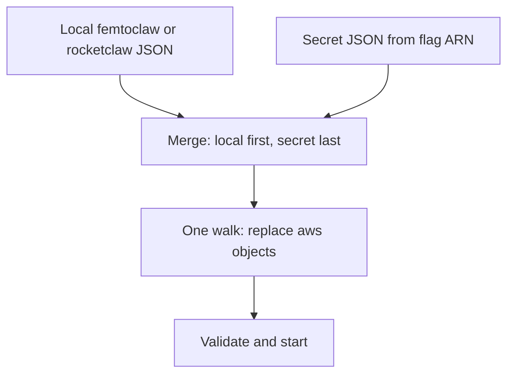

# Rocketclaw Secrets Manager - Plan

## Goal Capsule

- **Objective:** Start rocketclaw from an AWS Secrets Manager ARN so the operator can delete the download wrapper, while a local config file can still add structure and pull extra secret fields.
- **Product authority:** Product Contract below is source of WHAT. Planning Contract is HOW.
- **Product Contract preservation:** Product Contract unchanged from the reviewed requirements-only version.
- **Open blockers:** None.
- **Stop conditions:** AE1–AE9 have tests. `make lint` and `make test` pass. Do not persist or log resolved secret values.

---

## Product Contract

### Summary

`--aws-secrets-manager-arn` loads a secret JSON on every command that already reads `femtoclaw.json` / `rocketclaw.json`. Merge starts with the local file. The flag secret is the last merge, so it wins. After all merges, rocketclaw walks the result once and replaces every `{"aws":{"arn":"...","key":"..."}}` with the fetched string. That walk also runs when the flag is omitted.

### Problem Frame

The operator already keeps a complete `femtoclaw.json` in Secrets Manager and downloads it with a wrapper before start. Tokens also sit as plaintext in the local file. The wrapper is the thing to kill. A leftover local token must not beat the vault. Putting `{{ }}` inside JSON strings is a bad fit because quotes have to be escaped.

### Key Decisions

- KD1. **Two doors** — flag merge plus in-file `aws` objects. (session-settled: user-directed — chosen over placeholders-only and flag-plus-extra-ARNs-only: the wrapper downloads a whole file and still needs a second secret) Governs R2, R6.
- KD2. **Secret is the last merge** — local file first; flag secret last. (session-settled: user-directed — chosen over local-wins: leftover local credentials must not beat the vault) Governs R4, R5.
- KD3. **Same flag on every loader** — `doctor` / `exec` / friends see what `run` sees. (session-settled: user-directed — chosen over run-only: otherwise behavior diverges) Governs R1.
- KD4. **String beats a local aws object** — if the last merge set a string on a field, that field is not fetched. (session-settled: user-directed — chosen over running both: secret wins) Governs R5.
- KD5. **String or aws object, not templates** — a field is a string or `{"aws":{"arn":"...","key":"..."}}`. (session-settled: user-directed — chosen over `{{ aws_secrets_manager }}`: JSON quote escaping) Governs R6.

### Actors

- A1. **Operator** — starts rocketclaw, owns the local file and the wrapper to delete.
- A2. **Rocketclaw CLI** — loads config for `run`, `doctor`, `exec`, and the other commands that already read the local file.
- A3. **AWS Secrets Manager** — holds the last-merge JSON and any extra secret named by an `aws` object.

### Requirements

**Flag and load**

- R1. Every command that already loads the local config file accepts `--aws-secrets-manager-arn`.
- R2. When the flag is set, rocketclaw loads that secret's JSON as the last merge so the operator can start without the download wrapper.
- R3. Local file choice stays as today: `femtoclaw.json` if present, else `rocketclaw.json`. A local file is still required.

**Merge**

- R4. Merge starts with the local file. The flag secret is applied last. Scalars and lists in a later document replace. Objects merge; later shared keys win. Keys that exist only in an earlier document remain. Keys that exist only in a later document are added.
- R5. If the last merge set a string on a field, a local `aws` object on that field is not fetched.

**Inline fetch**

- R6. After all merges, rocketclaw walks the result once and replaces every `{"aws":{"arn":"...","key":"..."}}` with the string at that key in that secret. The ARN may be a second secret, not only the flag ARN. This walk also runs when the flag is omitted.

**Fail-closed**

- R7. A missing secret, missing key, or denied fetch fails the command. The error names the ARN and key, not the secret value.
- R8. Resolved values stay in the process. On-disk writers keep the file the operator wrote, `aws` objects included.
- R9. A rotated secret is picked up on the next process start, not while running.
- R10. Logs and command output must not include resolved secret values. They may name the ARN and key, or say a credential is present or missing.

### Key Flows

- F1. Kill the wrapper
  - **Trigger:** A1 runs a rocketclaw command with `--aws-secrets-manager-arn`.
  - **Actors:** A1, A2, A3
  - **Steps:** A2 fetches the secret JSON, merges it last per R4, walks `aws` objects once per R6, validates, starts.
  - **Outcome:** Process runs with vault values. No download script.
  - **Covered by:** R1, R2, R4, R6

- F2. Same field in both places
  - **Trigger:** Local file has an `aws` object on a field the secret also sets as a string.
  - **Actors:** A2, A3
  - **Steps:** Last merge keeps the secret string. That `aws` object is not fetched.
  - **Outcome:** Result is the secret string.
  - **Covered by:** R5

- F3. Second secret
  - **Trigger:** After merge, a field is still `{"aws":{"arn":"arn:other","key":"token"}}`.
  - **Actors:** A2, A3
  - **Steps:** A2 fetches that ARN and key, writes the string into the field.
  - **Outcome:** Field is filled or the command fails per R7.
  - **Covered by:** R6, R7

- F4. Ops command matches run
  - **Trigger:** A1 runs `doctor` or `exec` with the same flag used for `run`.
  - **Actors:** A1, A2
  - **Steps:** That command loads through the same merge and walk.
  - **Outcome:** It sees the same resolved config `run` would see.
  - **Covered by:** R1

- F5. No flag, local aws objects still fetch
  - **Trigger:** A1 runs a command with no `--aws-secrets-manager-arn`. The local file has an `aws` object.
  - **Actors:** A1, A2, A3
  - **Steps:** Skip the flag merge. Walk `aws` objects once per R6.
  - **Outcome:** Those fields become fetched strings, or the command fails per R7.
  - **Covered by:** R6, R7

### Acceptance Examples

- AE1. Secret token beats leftover local token
  - **Covers R4.**
  - **Given:** Secret has `slack.bot_token` A. Local file has `slack.bot_token` B.
  - **When:** A1 starts with the flag.
  - **Then:** The process uses A.

- AE2. Local-only MCP server remains
  - **Covers R4.**
  - **Given:** Local file defines `mcp_servers.acme`. Secret has tokens and no `mcp_servers`.
  - **When:** A1 starts with the flag.
  - **Then:** `mcp_servers.acme` is still present and tokens come from the secret.

- AE3. Secret-only keys are added
  - **Covers R4.**
  - **Given:** Local file has no `slack.bot_token`. Secret has `slack.bot_token` A.
  - **When:** A1 starts with the flag.
  - **Then:** The process uses A.

- AE4. String from the secret skips a local aws object
  - **Covers R5.**
  - **Given:** Secret sets `slack.bot_token` to a string. Local file sets the same field to an `aws` object.
  - **When:** A1 starts with the flag.
  - **Then:** The process uses the secret string. That `aws` object is not fetched.

- AE5. Aws object that arrived from the secret still fetches
  - **Covers R6.**
  - **Given:** After merge, an MCP header is `{"aws":{"arn":"arn:other","key":"token"}}`.
  - **When:** A1 starts with the flag.
  - **Then:** That header becomes the value at `token` in `arn:other`.

- AE6. Missing key fails closed
  - **Covers R7.**
  - **Given:** An `aws` object names a key that is not in that secret.
  - **When:** A1 starts.
  - **Then:** The command fails. The error names the ARN and key, not the secret body.

- AE7. Doctor matches run
  - **Covers R1.**
  - **Given:** The same ARN is passed to `run` and to `doctor`.
  - **When:** Both commands load config.
  - **Then:** Both resolve the same merge and walk.

- AE8. No flag still fetches local aws objects
  - **Covers R6.**
  - **Given:** No `--aws-secrets-manager-arn`. Local file has `GITHUB_TOKEN` as `{"aws":{"arn":"arn:other","key":"token"}}`.
  - **When:** A1 starts.
  - **Then:** That field becomes the value at `token` in `arn:other`.

- AE9. Lists replace; objects merge
  - **Covers R4.**
  - **Given:** Local file has three Slack channels and `mcp_servers.acme` with a URL. Secret has one Slack channel and `mcp_servers.acme` with only a token.
  - **When:** A1 starts with the flag.
  - **Then:** Slack channels are the one from the secret. `mcp_servers.acme` keeps the local URL and takes the secret token.

### Success Criteria

- SC1. A1 can delete the download wrapper and start with the flag plus the local file they already keep.
- SC2. A leftover local credential never wins over a value the secret set.

### Scope Boundaries

- No live reload when the secret rotates. Restart, same as a file edit.
- No extra AWS knobs on the CLI (`--region`, version stage, merge strategy).
- No writing resolved secrets back onto the local file.
- No ARN-only boot without a local file. Local file remains required per R3.
- No `text/template` interpolation in the JSON file.

### Dependencies / Assumptions

- A1 already has AWS credentials that can `GetSecretValue` on the named ARN.
- The secret body is JSON that looks like rocketclaw config, or a JSON object whose fields merge into that config.
- IAM for a customer-managed key also allows decrypt, same as today's wrapper.

### Outstanding Questions

- Q1. **Deferred to Planning:** How rocketclaw fetches `GetSecretValue` (library vs the `aws` CLI the GWS skill already uses).
- Q2. **Deferred to Planning:** Exact key-path rules for keys that contain dots.

### Sources / Research

- `docs/ideation/2026-08-12-rocketclaw-secrets-manager-ideation.html` — prior direction set; this plan supersedes the old local-wins merge card.
- `internal/rocketclaw/config/config.go` — single-file load then `Validate()`.
- `cmd/rocketclaw/main.go` — `femtoclaw.json` then `rocketclaw.json`.
- `cmd/rocketclaw/serve.go` and `cmd/rocketclaw/doctor.go` — two load desks today.
- `internal/gws/skills/main-configure-gws/SKILL.md` — existing `get-secret-value` wrapper pattern.

---

## Planning Contract

### Key Technical Decisions

- KTD1. **AWS SDK for Go v2 for GetSecretValue** — (session-settled: user-directed — chosen over exec of the `aws` CLI: always use the SDK) Governs R2, R6, R7.
- KTD2. **Merge as raw JSON, then unmarshal `Config`** — `BotToken` and MCP env/headers are Go strings, so `{"aws":{...}}` cannot land in the typed struct. Merge and the aws-object walk run on `map[string]any` first. Then unmarshal. Then `Validate`.
- KTD3. **Inject a real fetcher** — tests pass an explicit fake. Production passes the SDK client. Do not use nil to mean “off.”
- KTD4. **Peel `--aws-secrets-manager-arn` off args before every Load** — do not wait for a per-command FlagSet. `oai list`, `lint`, and `fc` have none. One shared peel so every loader sees the flag.

### Technical Design

Load becomes: read local bytes → decode to a map → if the flag is set, fetch that ARN, decode the `SecretString`, merge last (scalars and lists replace; objects merge) → walk the map once and replace every `{"aws":{"arn","key"}}` with the string at that key → marshal → existing `loadConfigData` / `Validate`. Each need is a fresh `GetSecretValue`. Do not keep `SecretString` in a cache.

The walk runs even when the flag is omitted. A failed fetch fails Load and names ARN and key, not the secret body. On-disk writers keep the original local file. They do not write a merged tree.

### Assumptions

- Default AWS credential chain is enough. No new `--region` flag. Region comes from the ARN.
- `key` is a path inside the secret JSON, not a path in rocketclaw config (Q2 stays deferred).

### Sequencing

U1 fetcher → U2 merge and walk → U3 CLI flag → U4 leak tests on writers and logs.

---

## Implementation Units

### U1. Secrets Manager fetch

- **Goal:** One fetch API: ARN in, `SecretString` out. AWSCURRENT. Region from the ARN. No cache.
- **Files:** `internal/rocketclaw/config/secrets.go`, `internal/rocketclaw/config/secrets_test.go`, `go.mod`
- **Approach:** AWS SDK v2 Secrets Manager `GetSecretValue`. Parse region from a complete ARN. Flag merge decodes that document. Field refs extract `key` from a fetch of that field's ARN. Same ARN needed twice means two calls. Do not keep `SecretString` in memory after the call returns. Missing key or denied call returns a typed error that names ARN and key only.
- **Depends on:** none
- **Test scenarios:**
  - Fake fetcher returns the string at `token` for a known ARN.
  - Missing key fails and the error text does not contain the secret body.
  - Same ARN needed twice calls the client twice.
  - Incomplete name (not a full ARN) fails closed.

### U2. Merge then walk then Validate

- **Goal:** `Load` implements R4–R7 on raw JSON, then the existing typed validate path.
- **Files:** `internal/rocketclaw/config/config.go`, `internal/rocketclaw/config/config_test.go`, `internal/rocketclaw/config/merge.go`
- **Approach:** Add a Load option for the flag ARN and the injected fetcher. Do not unmarshal into `Config` until merge and walk finish. Reuse `validConfig` / `loadTestConfig` fixtures.
- **Depends on:** U1
- **Test scenarios:**
  - AE1 secret string beats local string.
  - AE2 local-only `mcp_servers.acme` remains.
  - AE3 secret-only `slack.bot_token` is added.
  - AE4 secret string skips a local aws object on the same field.
  - AE5 aws object that arrived from the secret still fetches.
  - AE6 missing key fails closed.
  - AE8 no flag still fetches a local aws object.
  - AE9 list replace; object merge keeps local URL and takes secret token.
  - Empty local `bot_token` does not beat a secret string.

### U3. Flag on every loader

- **Goal:** `--aws-secrets-manager-arn` works on every command that loads config.
- **Files:** `cmd/rocketclaw/main.go`, `cmd/rocketclaw/serve.go`, `cmd/rocketclaw/doctor.go`, `cmd/rocketclaw/exec.go`, `cmd/rocketclaw/oai.go`, `cmd/rocketclaw/fc.go`, `cmd/rocketclaw/lint.go`, `cmd/rocketclaw/agent_graph.go`, matching `*_test.go`
- **Approach:** Peel `--aws-secrets-manager-arn` from args before each command Loads, then pass the ARN into `Load`. Do not give `run` a private path. Do not require a FlagSet on `oai list`, `lint`, or `fc`.
- **Depends on:** U2
- **Test scenarios:**
  - AE7 `doctor` and `run` with the same ARN resolve the same config (fake fetcher).
  - Unknown flag still fails before Load (`TestRunDoctorRejectsBadFlagBeforeConfigLoad` pattern).
  - `exec` accepts the flag.
  - `oai list`, `lint`, and `fc` accept the flag.

### U4. Do not leak resolved values

- **Goal:** Logs, doctor/oai output, and on-disk writes never persist resolved secrets.
- **Files:** `cmd/rocketclaw/oai.go`, `cmd/rocketclaw/serve.go`, `cmd/rocketclaw/doctor.go`, existing tests that already assert present/missing
- **Approach:** Writers use only the original local file. Do not write a merged tree. Setup never Loads secrets, so leave `setup.go` alone. Serve/doctor keep path and present/missing. Do not marshal a resolved `Config` back to disk.
- **Depends on:** U2
- **Test scenarios:**
  - After Load with an aws object, an `oai` write still contains the aws object, not the fetched string.
  - Serve/doctor log or print text does not contain the fetched string.

---

## Verification Contract

| Command | When |
|---------|------|
| `go test ./internal/rocketclaw/config ./cmd/rocketclaw` | After each unit |
| `gofmt` on touched files | Before done |
| `make lint` | Before done |
| `make test` | Before done |

Do not raise `SOURCE_CLOC_BUDGET`. Keep the first-party add small.

---

## Definition of Done

- AE1–AE9 have tests and pass.
- Every loader accepts `--aws-secrets-manager-arn`.
- `go.mod` includes AWS SDK v2 Secrets Manager; there is no `aws` CLI exec path.
- No test or doctor/serve output contains a resolved secret fixture value.
- `make lint` and `make test` pass.

