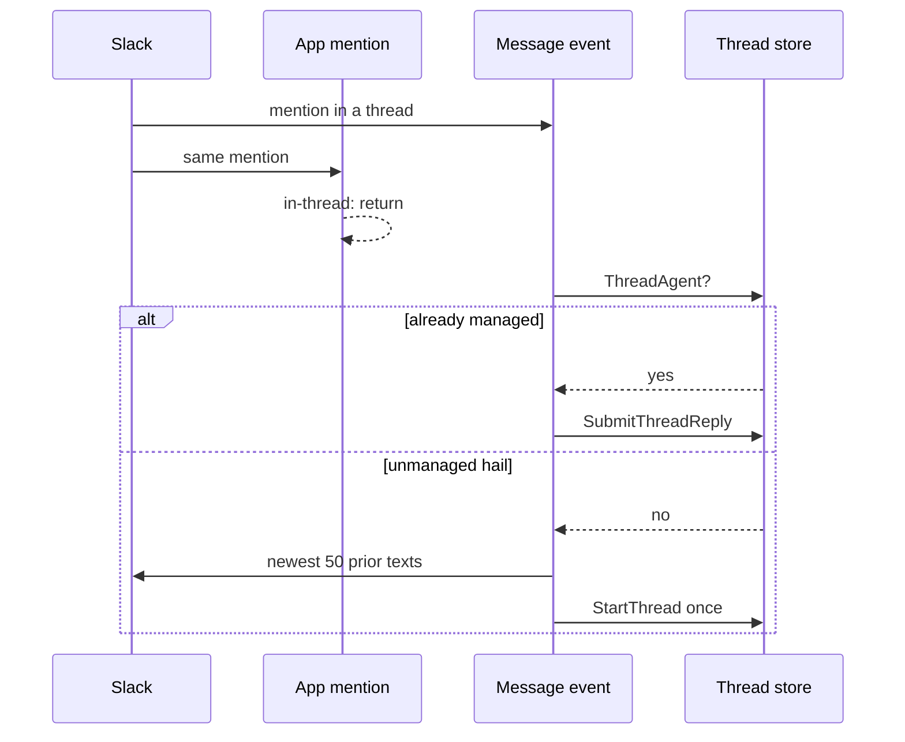

# Adhoc Callouts - Plan

## Goal Capsule

- **Objective:** Let an allowlisted person hail the bot in any conversation the bot already belongs to (except a 1:1 DM) and get a Managed Slack Thread, without adding that conversation as a room or restarting.
- **Product authority:** Product Contract below is source of WHAT. Planning Contract is HOW.
- **Product Contract preservation:** changed: KD2, R10 — 1:1 DMs stay out; group DMs hail when the bot is already a member (user-directed this session). Added R13, AE8 for bare `@bot` adopt. Added AE9 for group-DM hail.
- **Open blockers:** None.
- **Stop conditions:** AE1–AE9 have tests. `make lint` and `make test` pass. `TestHandleAppMentionEventIgnoresUnmappedChannel` still ignores when no `@` row exists.

---

## Product Contract

### Summary

An `@` row in the channel list is a hail fallback, not a Slack channel. Unmapped joined conversations use its agents and allowlist. A root hail starts a Managed Slack Thread. A hail in an unmanaged thread takes that thread over and includes prior messages up to a cap.

### Problem Frame

Today the bot only starts work in listed rooms. A mention anywhere else is dropped. The only way to answer it is to add a room and restart. That turns a one-off hail into a config change.

### Key Decisions

- KD1. **`@` is a room-shaped fallback** — (session-settled: user-directed — chosen over a separate adhoc policy and over "every unlisted channel inherits defaults": same agents and allowlist fields as a room) Governs R1, R2.
- KD2. **Any joined conversation except 1:1 DMs** — (session-settled: user-directed — chosen over DMs-all-out, public-only, and unconfigured-only; later: group DMs in when the bot is already a member) Governs R5, R6, R10, R11.
- KD3. **Mapped room wins** — (session-settled: user-directed — chosen over `@` winning in listed channels) Governs R3.
- KD4. **Convert unmanaged threads anywhere** — (session-settled: user-directed — chosen over unconfigured-only conversion) Governs R6.
- KD5. **History is in this work** — (session-settled: user-directed — chosen over hail-only with history later) Governs R7.
- KD6. **First agent on the winning row; `$agent` later** — (session-settled: user-directed — chosen over naming an agent in the hail) Governs R5, R12, R13.
- KD7. **Second hail is a reply** — (session-settled: user-approved — chosen over restart-on-rehail) Governs R9.

### Actors

- A1. **Allowlisted human** — hails the bot and continues the thread.
- A2. **RocketClaw bot** — starts or adopts the Managed Slack Thread and replies in it.
- A3. **Operator** — adds the `@` row so unmapped conversations can hail.

### Requirements

**Config**

- R1. The channel list may include one `@` row with the same agents and allowlist fields as a room.
- R2. A joined conversation with no room row uses the `@` row. With no `@` row, unmapped conversations stay ignored.
- R3. A listed room always uses that room's agents and allowlist, including when a hail adopts a thread there.

**Hail**

- R4. An authorized hail is an app mention by a user on the winning allowlist.
- R5. A hail with extra words on a root message in a joined conversation starts a Managed Slack Thread. The first agent on the winning row runs it.
- R6. A hail in an unmanaged thread in any joined conversation adopts that thread as a Managed Slack Thread. The first agent on the winning row runs it.
- R7. Adoption includes prior messages in that thread up to a cap.

**Continuity**

- R8. After start or adoption, later allowlisted replies continue the thread without another mention.
- R9. A hail in an already-managed thread is a reply, not a restart.
- R10. 1:1 DMs never start or adopt via hail. Group DMs do when the bot is already a member.
- R11. The bot does not join a conversation to make hail work.
- R12. `$agent` can switch the thread's agent after start or adoption, as it does on a configured room.
- R13. A bare app mention with no extra words adopts an unmanaged thread. A bare root mention still does nothing.

```mermaid
flowchart TB
  hail[Authorized app mention]
  hail --> managed{Already a managed thread?}
  managed -->|yes| reply[Continue as a reply]
  managed -->|no| dm{1:1 DM?}
  dm -->|yes| ignore[Ignore]
  dm -->|no| mapped{Conversation has a room row?}
  mapped -->|yes| room[Use that room's agents and allowlist]
  mapped -->|no| atrow{@ row present?}
  atrow -->|no| ignore
  atrow -->|yes| fallback[Use @ agents and allowlist]
  room --> where{Root or unmanaged thread?}
  fallback --> where
  where -->|root with extra words| start[Start managed thread]
  where -->|bare root| ignore
  where -->|unmanaged thread| adopt[Adopt thread with capped history]
```

### Key Flows

- F1. Root hail in an unmapped joined conversation
  - **Trigger:** A1 mentions the bot with extra words on a root message in a conversation with no room row.
  - **Actors:** A1, A2
  - **Steps:** Winning row is `@`. Allowlist check passes. A2 starts a Managed Slack Thread on that root. First `@` agent runs. A2 replies in the new thread.
  - **Covered by:** R2, R4, R5, R8
- F2. Thread hail in an unmanaged thread
  - **Trigger:** A1 mentions the bot inside an unmanaged thread in any joined conversation.
  - **Actors:** A1, A2
  - **Steps:** Winning row is the room if listed, else `@`. Allowlist check passes. A2 adopts the thread, includes prior messages up to the cap, and replies in that thread.
  - **Covered by:** R3, R4, R6, R7, R13
- F3. Continue after hail
  - **Trigger:** A1 replies in the thread with no mention.
  - **Actors:** A1, A2
  - **Steps:** The thread is already managed. A2 treats the reply as the next turn.
  - **Covered by:** R8
- F4. Hail in an already-managed thread
  - **Trigger:** A1 mentions the bot again in a managed thread.
  - **Actors:** A1, A2
  - **Steps:** A2 treats it as a reply. The thread is not restarted.
  - **Covered by:** R9

### Acceptance Examples

- AE1. Unmapped root hail
  - **Covers R2, R4, R5.**
  - **Given:** `@` is configured. `#random` is joined and not listed. A1 is on the `@` allowlist.
  - **When:** A1 mentions the bot with extra words on a root message in `#random`.
  - **Then:** A2 starts a Managed Slack Thread there and replies with the first `@` agent.
- AE2. No `@` row
  - **Covers R2.**
  - **Given:** No `@` row. `#random` is joined and not listed.
  - **When:** A1 mentions the bot in `#random`.
  - **Then:** Nothing starts.
- AE3. Thread takeover in a listed room
  - **Covers R3, R6, R7.**
  - **Given:** `#triage` is a listed room. An unmanaged thread already has several messages.
  - **When:** A user on `#triage`'s allowlist mentions the bot in that thread.
  - **Then:** That thread becomes managed under `#triage`'s first agent. Prior messages are included up to the cap. `@` is not used.
- AE4. Unallowlisted hail
  - **Covers R4.**
  - **Given:** A joined unmapped conversation and a configured `@` row.
  - **When:** A user not on the `@` allowlist mentions the bot.
  - **Then:** Nothing starts.
- AE5. 1:1 DM hail
  - **Covers R10.**
  - **Given:** A1 is on the `@` allowlist.
  - **When:** A1 mentions the bot in a 1:1 DM.
  - **Then:** Nothing starts.
- AE6. Second hail
  - **Covers R9.**
  - **Given:** A managed thread is already running.
  - **When:** A1 mentions the bot in that thread.
  - **Then:** The mention is a reply. The thread is not restarted.
- AE7. Continue without mention
  - **Covers R8.**
  - **Given:** A thread was just adopted or started by hail.
  - **When:** A1 posts a follow-up with no mention.
  - **Then:** A2 continues that Managed Slack Thread.
- AE8. Bare `@bot` adopts
  - **Covers R13, R6, R7.**
  - **Given:** An unmanaged thread in a joined unmapped conversation. `@` is configured. A1 is allowlisted.
  - **When:** A1 posts a bare `@bot` in that thread.
  - **Then:** A2 adopts the thread. First-turn context is the newest 50 prior text messages already in that thread, not including the hail. The thread starter is included if it falls in that window. A bare root `@bot` still does nothing.
- AE9. Group DM hail
  - **Covers R10, R2, R5.**
  - **Given:** A group DM the bot already belongs to. `@` is configured. A1 is on the `@` allowlist.
  - **When:** A1 mentions the bot with extra words on a root message.
  - **Then:** A2 starts a Managed Slack Thread and replies with the first `@` agent.

### Success Criteria

- An allowlisted person can hail in a joined unmapped conversation without adding a room or restarting.
- A hail in an unmanaged thread becomes a Managed Slack Thread the people already in that thread can keep using.

### Scope Boundaries

- 1:1 DMs
- Auto-join
- A separate adhoc policy block
- Naming a specific agent in the hail text
- Restarting a managed thread by hailing again
- Making an unmapped conversation into a standing listed room

### Dependencies / Assumptions

- The bot is already a member of the conversation.
- Listed rooms keep today's root-mention start behavior.
- "Social mode" in conversation means today's configured-room hail-to-thread behavior, not a removed config field.

### Sources / Research

- `CONCEPTS.md` — Managed Slack Thread, Root Slack Mention, Adhoc Callout, `@` Channel Entry.
- `README.md` — thread-local conversations in configured channels; the bot never auto-joins.
- `docs/solutions/logic-errors/slack-root-app-mention-redelivery-cleared-buffered-follow-ups.md` — `beginSlackStack` is create-if-absent only.
- Grounding dossier: `.tmp/rocketclaw/ce-brainstorm/adhoc-callouts/grounding.md`

---

## Planning Contract

### Key Technical Decisions

- KTD1. **Keep `@` as `@`** — do not prefix it with `#`. After a room-name miss, fall back to that row. Governs R1, R2.
- KTD2. **One event adopts** — (session-settled: user-approved — chosen over opening both Slack events: Slack sends message and app_mention for the same `@`) App mention stays root-only. Message event adopts when the thread is not managed yet and the message is a hail. Never `StartThread` when the thread already exists. Governs R6, R9, R13.
- KTD3. **Last 50 messages on the hail turn** — (session-settled: user-directed — chosen over last 20 and over byte-cap-only) Pack the newest 50 prior text messages already in that thread. Exclude the hail. Include the thread starter if it falls in that window. Drop older messages with no notice. Also stop if packed text hits the existing inbound size cap. Other humans' text is included. Files and forwards stay off unless they are on the hail itself. Fetch failure adopts on hail text only. Governs R7.
- KTD4. **Transcript, not fake prior turns** — (session-settled: user-approved — chosen over a new seed-turns API) Pack the cap into the first inbound. Reuse `StartThread`. Governs R7.
- KTD5. **Root dollar commands inherit except `$agent`** — (session-settled: user-approved — chosen over suppressing all dollar commands and over letting `$agent` pick on first hail) `$goal` / `$cron` / help work on an unmapped root hail. An unmapped root `$agent` still starts a Managed Slack Thread with the first winning-row agent and does not switch agent. After start or adopt, `$agent` uses the winning row's agents. Governs R5, R12.
- KTD6. **`@` is not a postable room** — keep it out of cron valid-channel lists and MCP `session_prompt` channel checks.

### Technical Design

Normalize leaves `@` unprefixed. Channel lookup still matches `#` plus Slack name first. On miss, if an `@` row exists, that row wins. 1:1 IMs (`D` prefix) return before lookup. Group DMs are not IMs.



Do not reuse the public-only forward helper for adoption. Reuse its replies pagination. `beginSlackStack` stays create-if-absent.

### Assumptions

- Slack group DM channel IDs are not `D`-prefixed. 1:1 stays `D`.
- `GetConversationInfo` failure still means not a member. No join.

### Sequencing

U1 config sentinel → U2 hail routing and history → U3 docs.

---

## Implementation Units

### U1. `@` stays a sentinel

- **Goal:** Config can hold one `@` row. It is not turned into `#@`. It is not treated as a Slack channel name.
- **Requirements:** R1, R2. KTD1, KTD6.
- **Files:** `internal/rocketclaw/config/config.go`, `internal/rocketclaw/config/config_test.go`, `internal/rocketclaw/config/channel_contract_test.go`, `internal/rocketclaw/app/app.go`
- **Approach:** Special-case `@` in channel normalize so it stays `@`. Still require agents and allowlist. Reject a second `@` row. Filter `@` out of cron valid channels and MCP configured-channel checks.
- **Depends on:** none
- **Test scenarios:**
  - `"@"` stays `"@"`.
  - `"#@"` is not how a valid `@` row is stored.
  - `@` with empty agents or empty allowlist fails validate.
  - Two `@` rows fail validate.
  - Cron / MCP channel lists do not contain `@`.

### U2. Hail, adopt, history

- **Goal:** Unmapped joined conversations hail through `@`. Unmanaged threads adopt with last-50 context. One visible answer per hail.
- **Requirements:** R2–R13. AE1–AE9. KTD2–KTD5.
- **Files:** `internal/rocketclaw/slackconnector/connector.go`, `internal/rocketclaw/slackconnector/connector_test.go`
- **Approach:** After a room-name miss, use the `@` row. Keep 1:1 IMs ignored. Allow group DMs. Root hail still starts on the app_mention event. In-thread hail adopts on the message path when `ThreadAgent` is false and the message is a mention, including bare `@bot`. Pack the newest 50 prior text messages already in that thread onto that first inbound. Exclude the hail. Include the thread starter if it falls in that window. The app_mention event stays root-only so the pair does not double-submit. Existing managed thread stays `SubmitThreadReply`. Do not reset stacks on adopt. Execution note: extend the existing mention-routing tests first; keep the no-`@` ignore case.
- **Depends on:** U1
- **Test scenarios:**
  - AE1 unmapped root hail with `@` starts with the first `@` agent.
  - AE2 no `@` row still ignores (`TestHandleAppMentionEventIgnoresUnmappedChannel`).
  - AE3 listed-room thread hail adopts with that room's first agent, not `@`.
  - AE4 unallowlisted hail ignores.
  - AE5 1:1 DM ignores even with `@`.
  - AE9 group DM hail with `@` starts or adopts.
  - AE6 second hail is one reply, no second `StartThread` (`TestThreadedSocialMentionHandledOnceAndStripped`).
  - AE7 no-mention follow-up continues after adopt.
  - AE8 bare `@bot` adopts; bare root `@bot` does not start.
  - History is the newest 50 prior texts, excludes the hail, includes the thread starter if it is in that window, and omits older ones.
  - History fetch failure still adopts on hail text.
  - `$agent` after adopt on an unmapped conversation uses `@` agents.
  - Unmapped root `$agent` starts with the first `@` agent and does not switch.
  - Root redelivery still does not wipe buffered follow-ups.

### U3. Docs and example

- **Goal:** Operators can add an `@` row and know hail works outside listed rooms.
- **Requirements:** R1, R2, R10, R11.
- **Files:** `README.md`, `cmd/rocketclaw/CHEATSHEET.md`, `internal/rocketclaw/rocketclaw.example.json`, `CONCEPTS.md`
- **Approach:** Say hail works in a joined public channel, private channel, or group DM when `@` is configured. The bot still never auto-joins. Keep 1:1 DMs out. Example may include one `@` row.
- **Depends on:** U2
- **Test scenarios:**
  - Example config still validates.
  - Example does not treat `@` as a `#` channel name.

---

## Verification Contract

- Prove AE1–AE9 in `internal/rocketclaw/slackconnector/connector_test.go` and `@` normalize in `internal/rocketclaw/config` tests.
- Keep `TestHandleAppMentionEventPreservesBufferedReplyAcrossRootRedelivery`.
- `gofmt` on touched files.
- `go test ./internal/rocketclaw/config ./internal/rocketclaw/slackconnector ./internal/rocketclaw/app`
- `go test ./...`
- `make lint`
- `make test`

---

## Definition of Done

- AE1–AE9 pass.
- No `@` still ignores unmapped conversations.
- 1:1 DMs stay dead. Group DMs hail when the bot is already a member.
- One hail produces one start or one reply.
- `@` is not a cron or MCP room.
- Abandoned attempt code is gone.
- README and cheatsheet match the shipped hail rule.

---

## Deferred / Open Questions

### From 2026-08-16 review

- **Abandoned-code done rule is empty** — Definition of Done (P2, coherence, confidence 75)

  Done cannot be checked: no unit or file list says what leftover attempt code is. Implementers will either skip the bullet or delete the wrong code.
