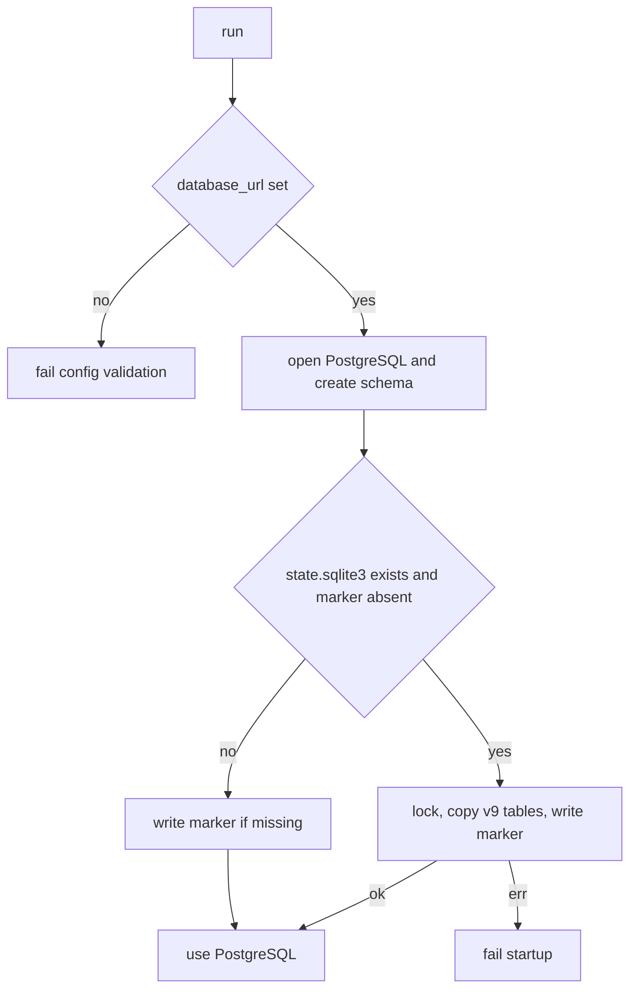

# RocketClaw PostgreSQL State Store - Plan

## Goal Capsule

- **Objective:** RocketClaw durable state lives in PostgreSQL. A leftover `state.sqlite3` is copied once at startup so existing workspaces keep their sessions. That copy step is written so it can be deleted later.
- **Product authority:** Product Contract below is source of WHAT. Planning Contract is HOW.
- **Product Contract preservation:** Product Contract authored in this bootstrap. No upstream brainstorm.
- **Open blockers:** None.
- **Stop conditions:** AE1–AE7 have tests. Store tests run against PostgreSQL. `make lint` and `make test` pass. `GO_SOURCE_CLOC_BUDGET` is unchanged. SQLite is not the production store.

---

## Product Contract

### Summary

`cmd/rocketable` does not exist. The durable store belongs to `cmd/rocketclaw`. Production opens PostgreSQL from `database_url` on the selected config file (`femtoclaw.json` if present, else `rocketclaw.json`). If leftover `state.sqlite3` exists and the store has no bootstrap marker, the first opener copies current schema-v9 tables into PostgreSQL and writes the marker. Later openers use PostgreSQL only. Quickweb keeps its own SQLite file.

### Problem Frame

RocketClaw persists sessions, routing, goals, cron, and restart state in `state.sqlite3`. The operator wants PostgreSQL as the store. Existing workspaces still have SQLite files. A permanent dual backend or a versioned historical migrator would stay forever. A one-shot copy can be deleted after every workspace has moved.

### Key Decisions

- KD1. **Target is RocketClaw.** The request named `cmd/rocketable`. The store lives in `cmd/rocketclaw` and `internal/rocketclaw/harnessbridge`. Governs R1.
- KD2. **PostgreSQL is the only production store.** SQLite remains only as the bootstrap source. Governs R2, R3.
- KD3. **One-shot v9 copy, then delete.** The first opener copies current SQLite tables when a leftover file exists and the bootstrap marker is absent. It does not migrate historical SQLite formats. Governs R4, R5.
- KD4. **Required `database_url`.** The DSN is required on the selected config file. Governs R6.
- KD5. **One DSN is one store.** Workspaces that share a DSN share all durable state. Isolation is a distinct DSN per workspace. Governs R7.
- KD6. **Quickbench reads the workspace DSN.** Capture drops the file-path `--db` flag. Governs R1.
- KD7. **`fc check` pings PostgreSQL.** It does not repair a file. Corruption recovery is an operator PostgreSQL concern. Governs R1.

### Requirements

**Store**

- R1. RocketClaw durable state for `run`, `fc`, and Quickbench capture uses the same PostgreSQL store.
- R2. A new workspace with no `state.sqlite3` initializes the current schema in PostgreSQL and runs.
- R3. After a successful copy, later startups open PostgreSQL only and do not write SQLite.

**Bootstrap**

- R4. If `state.sqlite3` exists and the bootstrap marker is absent, the first store opener copies every current v9 table, including `session_entries.id` values, writes the marker, then continues on PostgreSQL.
- R5. If the bootstrap marker is present, openers skip the copy and leave the leftover SQLite file in place as a frozen copy, not the live store.
- R6. Missing or empty `database_url` on the selected config file fails validation before the store opens.
- R7. Two workspaces with distinct DSNs do not see each other's rows. Two workspaces that share a DSN share the store.

### Actors

- A1. Operator running `rocketclaw run` / `fc` on a workspace.
- A2. Quickbench capture reading the same store.

### Key Flows

- F1. Fresh PostgreSQL workspace
  - **Trigger:** `run` with `database_url` and no `state.sqlite3`.
  - **Actors:** A1
  - **Steps:** Validate config. Open PostgreSQL. Create current schema. Serve traffic.
  - **Covered by:** R2, R6
- F2. First startup after the cutover
  - **Trigger:** `run` with `database_url` and a v9 `state.sqlite3`.
  - **Actors:** A1
  - **Steps:** Open PostgreSQL. See no bootstrap marker. Copy SQLite tables in one transaction. Write the marker. Reset the entry-id sequence when any entries were copied. Serve traffic from PostgreSQL.
  - **Covered by:** R4
- F3. Later startup
  - **Trigger:** `run` after F2.
  - **Actors:** A1
  - **Steps:** Open PostgreSQL. See the bootstrap marker. Skip copy. Do not open SQLite for writes.
  - **Covered by:** R3, R5
- F4. Observe and capture
  - **Trigger:** `fc observe` or Quickbench capture.
  - **Actors:** A1, A2
  - **Steps:** Open the configured PostgreSQL store. Read entries by conversation and `id > lastID`.
  - **Covered by:** R1

### Acceptance Examples

- AE1. Fresh workspace
  - **Covers:** R2, F1
  - **Given:** `database_url` points at an empty database and no `state.sqlite3` exists.
  - **When:** `run` starts.
  - **Then:** Schema exists in PostgreSQL and the daemon serves sessions.
- AE2. Copy once
  - **Covers:** R4, F2
  - **Given:** A v9 SQLite file has threads, entries, goals, and cron rows. PostgreSQL has no bootstrap marker.
  - **When:** `run` starts.
  - **Then:** Those rows exist in PostgreSQL with the same `session_entries.id` values. New appends get later ids.
- AE3. Skip when already copied
  - **Covers:** R5, F3
  - **Given:** The bootstrap marker is present and SQLite still exists.
  - **When:** `run` starts.
  - **Then:** SQLite is not copied again. Existing PostgreSQL rows are unchanged.
- AE4. Required DSN
  - **Covers:** R6
  - **Given:** `database_url` is missing from the selected config file.
  - **When:** Config validates.
  - **Then:** Validation fails and the store is not opened.
- AE5. Observe after copy
  - **Covers:** R1, F4
  - **Given:** Entries were copied from SQLite.
  - **When:** Observe starts at `lastID = 0`.
  - **Then:** Copied entries return in id order.
- AE6. Copy failure
  - **Covers:** R4
  - **Given:** SQLite exists and the copy transaction fails.
  - **When:** `run` starts.
  - **Then:** Startup fails. PostgreSQL has no partial store rows and no bootstrap marker.
- AE7. Distinct DSNs isolate workspaces
  - **Covers:** R7
  - **Given:** Two workspaces each have their own `database_url`.
  - **When:** Each writes a session.
  - **Then:** Neither store contains the other's rows.

### Success Criteria

- Production store code has no SQLite write path.
- Bootstrap is one deletable unit. Removing it leaves PostgreSQL-only startup.
- Existing store contract tests pass on PostgreSQL.
- Quickbench capture still reads RocketClaw sessions.
- Operators who want isolation use a distinct DSN per workspace.
- `fc check` reports connectivity and schema. It does not repair a file.

### Scope Boundaries

- In scope: RocketClaw state store, `run` / `fc`, Quickbench capture of that store, README and cheatsheet store docs. `fc check` becomes a PostgreSQL ping.
- Out of scope: Quickweb `quickweb.sqlite`. Provisioning PostgreSQL. Multi-tenant DSN namespacing. Historical SQLite formats older than v9.
- Deferred to follow-up: Delete the bootstrap file and drop `modernc.org/sqlite` from RocketClaw once every workspace has moved.

### Sources

- `internal/rocketclaw/harnessbridge/store.go`, `store_schema.go`, `store_dao.go`
- `README.md` current-schema contract: fresh runtimes initialize current schema. Startup does not migrate historical formats.
- `github.com/jackc/pgx/v5/stdlib`: `sql.Open("pgx", dsn)`, `$1` placeholders, no `LastInsertId`

---

## Planning Contract

### Assumptions

- The request's `cmd/rocketable` means RocketClaw.
- One `database_url` is one store. Two workspaces that share a DSN share rows.
- Bootstrap does not delete or rename `state.sqlite3`.
- The bootstrap marker is a one-row table written in the same transaction as schema init on a fresh open and as the copy. Copy runs only when leftover SQLite exists and the marker is absent.
- Store tests require `ROCKETCLAW_TEST_DATABASE_URL`. They isolate with a per-test schema.
- `fc check` file recovery goes away with SQLite. Check becomes a PostgreSQL connectivity and schema ping.

### Key Technical Decisions

- KTD1. **pgx through `database/sql`.** Keep `*sql.DB` and `stateStoreDB`. Do not introduce a second store type. Chosen over a native pgx pool rewrite: the DAO already sits on `database/sql`.
- KTD2. **Rewrite SQL in place.** Use `$n` placeholders, `GENERATED BY DEFAULT AS IDENTITY` for `session_entries.id`, `INSERT … RETURNING id`, `entry_timestamp::timestamptz` instead of `julianday`, `entry_json::jsonb->>'type'` instead of `json_extract`, and omit unlimited `LIMIT`. Chosen over a dual-dialect layer: CLOC cannot afford two backends.
- KTD3. **Delete SQLite maintenance on the production path.** Drop PRAGMA init, WAL checkpoint, incremental vacuum, `sqlite3 .recover`, and `SetMaxOpenConns(1)`. Postgres pooling replaces WAL serialization. Chosen over keeping no-op stubs: those lines are the CLOC recovery.
- KTD4. **Bootstrap is one file that only reads SQLite.** Production open never calls `sql.Open("sqlite")`. The copy runs in one transaction, inserts explicit ids, writes the marker, and `setval`s the identity sequence only when `max(id)` is not null. Fail closed unless SQLite `user_version` is 9. Chosen over a versioned migrator: current law is no historical format migration.
- KTD5. **Observe and `fc` take the DSN, not a file path.** Path-derived workspace/runtimeDir cannot find PostgreSQL. Chosen over encoding the DSN as a fake path.
- KTD6. **Stay under the existing source CLOC budget by replacement.** Do not edit `GO_SOURCE_CLOC_BUDGET`. Vendor pgx does not count. First-party dual-stack does.
- KTD7. **Serialize bootstrap with a PostgreSQL advisory lock on a dedicated connection.** The second opener waits through commit of copy-or-marker. It does not skip mid-copy.

### High-Level Technical Design

### Sequencing

U1 first. U2 needs a working PostgreSQL schema. U3 needs the new open/observe signatures. U4 can start characterization as soon as U1 has a test helper.

### System-Wide Impact

- `NewSessionServiceIn` and `ObserveSessionEntries` change shape. Every test helper that opens the store must pass a DSN, including `app`, `harnessbridge`, `cronjob`, `fc`, and Quickbench capture tests.
- `femtoclaw.json` uses the same `Config` type. The field is required there too.
- Quickbench `--db` is removed. Capture reads `database_url` from the selected workspace config.
- Skel keep `state.sqlite3` / `-wal` / `-shm` on the preserve list until the follow-up that deletes bootstrap. Reset must not destroy the copy source.

### Risks

- CLOC headroom is about 650 lines. Bootstrap plus dialect rewrite must delete WAL/vacuum/recover in the same change.
- Shared DSN across workspaces mixes stores. Document that. Do not add a workspace schema prefix in this plan.
- Bootstrap still needs the SQLite driver. Module-level `modernc.org/sqlite` stays until the follow-up deletion.
- A failed copy that is not transactional leaves a half-imported store that later startups skip. Keep the copy and marker in one transaction per AE6.
- Open, ping, and `fc check` errors must not include the raw DSN or password.

---

## Implementation Units

### U1. PostgreSQL store open and schema

- **Goal:** RocketClaw opens PostgreSQL from `database_url` and serves the current schema there.
- **Requirements:** R1, R2, R6
- **Dependencies:** none
- **Files:**
  - `internal/rocketclaw/config/config.go`
  - `internal/rocketclaw/config/config_test.go`
  - `internal/rocketclaw/harnessbridge/store.go`
  - `internal/rocketclaw/harnessbridge/store_schema.go`
  - `internal/rocketclaw/harnessbridge/store_dao.go`
  - `internal/rocketclaw/app/app.go`
  - `internal/rocketclaw/harnessbridge/store_test.go`
  - `go.mod`
- **Approach:**
  1. Add required `database_url` and validate it in `Config.Validate`.
  3. Change `NewSessionServiceIn` to take the DSN. Open with the pgx stdlib driver. Wrap open and ping errors so the DSN and password never appear in returned errors or logs.
  4. Replace `createSessionSchema` with PostgreSQL types per KTD2. Keep the same tables and uniqueness.
  5. Delete PRAGMA startup, WAL checkpoint, vacuum loop, and `MaxOpenConns(1)`.
  6. Keep the workspace file lock as a single-daemon mutex. Do not use it as the store.
- **Patterns to follow:** `Config.Validate` required-field errors. Existing `stateDAO` method split.
- **Test scenarios:**
  - Covers AE4. Missing `database_url` fails validation with a required-field error.
  - Covers AE1. Opening an empty DSN creates the tables and can append then load an entry.
  - `LastInsertId` is not used. Append returns the `RETURNING` id and a later append is greater.
  - Unlimited list/cron queries work with no `LIMIT -1`.
  - A failed open using a DSN with an embedded password does not include that password in the error string or logs.
- **Verification:** Config tests and one store round-trip pass against PostgreSQL. App startup no longer calls CheckpointWAL or Vacuum.
- **Execution note:** Keep the existing store contract tests compiling as the constructor changes. Prefer adapting helpers before rewriting assertions.

### U2. One-shot SQLite bootstrap

- **Goal:** A leftover v9 `state.sqlite3` is copied into an empty PostgreSQL store once.
- **Requirements:** R3, R4, R5. KTD4, KTD7
- **Dependencies:** U1
- **Files:**
  - `internal/rocketclaw/harnessbridge/store_bootstrap.go`
  - `internal/rocketclaw/harnessbridge/store_bootstrap_test.go`
  - `internal/rocketclaw/app/app.go`
- **Approach:**
  1. Put all SQLite-read code in `store_bootstrap.go` so a later delete removes the bootstrap copy.
   2. Run the copy from every store opener after PostgreSQL schema init and before any session traffic, including `run`, `fc`, observe, and Quickbench.
  3. Take `pg_advisory_lock` on a dedicated connection around the marker check and copy. The second opener waits through commit.
  4. Fail unless SQLite `user_version` is 9.
  5. Skip when the bootstrap marker is present.
  6. Copy every table in one transaction. Insert explicit `session_entries.id` values. Copy `external_mcp_sessions.private_conversation_id` as SQL NULL when the SQLite value is NULL. `setval` the identity sequence only when `max(id)` is not null. Write the marker in that same transaction.
  7. Leave the SQLite file in place. Do not write it.
- **Patterns to follow:** Current table list in `createSessionSchema`. No historical `user_version` upgrade path.
- **Test scenarios:**
  - Covers AE2. Seed SQLite with one row per table. After bootstrap, PostgreSQL matches ids and payloads.
  - Covers AE3. Preload the bootstrap marker. Bootstrap leaves PostgreSQL unchanged and does not import SQLite.
  - Covers AE6. Force a copy error. PostgreSQL has no store rows, no marker, and the opener returns the error.
  - No SQLite file: write the marker if missing and continue.
  - Two overlapping bootstraps: the second waits on the advisory lock, then sees the marker and does not copy again.
  - SQLite `user_version` is not 9: opener fails and writes no marker.
  - A table-only SQLite file with no `session_entries` still copies and does not call `setval` on a null max id.
- **Verification:** Bootstrap tests pass. Production store files do not import `modernc.org/sqlite`.

### U3. Path-shaped readers

- **Goal:** Observe, `fc`, and Quickbench talk to PostgreSQL.
- **Requirements:** R1
- **Dependencies:** U1
- **Files:**
  - `internal/rocketclaw/harnessbridge/store.go`
  - `cmd/rocketclaw/fc.go`
  - `cmd/rocketclaw/fc_test.go`
  - `internal/quickbench/cli.go`
  - `internal/quickbench/capture_test.go`
  - `internal/rocketclaw/skel/skel.go`
- **Approach:**
  1. Change `ObserveSessionEntries` and other path-derived helpers to take the DSN.
  2. Point `fc` list/observe/delete/check at the config DSN. Replace `fc check` recover with a ping plus schema existence check.
  3. Drop Quickbench `--db`. Capture reads `database_url` from the selected workspace config.
  4. Keep `state.sqlite3` / `-wal` / `-shm` on the skel preserve list until the follow-up that deletes bootstrap.
- **Patterns to follow:** Current observe `id > lastID` contract. Quickbench capture already uses `NewSessionServiceIn`.
- **Test scenarios:**
  - Observe after append returns the new row. A later observe with that id returns empty.
  - `fc check` against a reachable DSN reports healthy. An unreachable DSN reports unhealthy and does not shell out to `sqlite3`.
  - Quickbench capture reads entries that `run` wrote to PostgreSQL.
- **Verification:** `fc` and capture tests pass without a `state.sqlite3` file.

### U4. Store tests and operator docs

- **Goal:** The existing store contract runs on PostgreSQL. Operator docs describe the DSN and the temporary copy.
- **Requirements:** R1–R6
- **Dependencies:** U1, U2, U3
- **Files:**
  - `internal/rocketclaw/harnessbridge/store_test.go`
  - `internal/rocketclaw/harnessbridge/store_channel_test.go`
  - `cmd/rocketclaw/fc_test.go`
  - other `NewSessionService` call sites under `internal/rocketclaw` and `internal/quickbench`
  - `README.md`
  - `cmd/rocketclaw/CHEATSHEET.md`
  - `cmd/quickbench/README.md`
- **Approach:**
  1. Add a test helper that opens `ROCKETCLAW_TEST_DATABASE_URL`, creates a unique schema, sets `search_path`, and drops the schema on cleanup.
  2. Point every `NewSessionService` / `NewSessionServiceIn` test at that helper.
  3. Delete SQLite-only tests: `sqlite_schema`, PRAGMA inspection, `sqlite3 .recover`, file corruption, symlink-to-db-file.
  4. Keep behavioral tests: append/observe, prune, goals, cron, active turns, MCP bindings.
  5. Update README and cheatsheet: state lives in PostgreSQL selected by `database_url` on the active config file. Fresh schema is created there. Bootstrap copies leftover v9 `state.sqlite3` once and leaves that file as a frozen copy. Isolation is one DSN per workspace. `database_url` is the confidentiality boundary for transcripts and routing. `fc check` pings PostgreSQL and does not repair a file. Startup still does not migrate historical SQLite formats.
- **Patterns to follow:** `newTestSessionService` in `store_test.go`. Current README schema-marker wording, rewritten for PostgreSQL.
- **Test scenarios:**
  - Helper isolation: two tests writing the same conversation id do not see each other's rows.
  - Missing `ROCKETCLAW_TEST_DATABASE_URL` fails with a message that names the variable.
  - Channel/table-list tests use `information_schema` instead of `sqlite_schema`.
  - Covers AE5. After U2 copies a v9 SQLite file, Observe at `lastID = 0` returns those entries in id order.
  - Covers AE7. Two helpers on distinct DSNs do not see each other's rows.
- **Verification:** `make test` and `make lint` pass. README no longer says production state is SQLite. Source CLOC stays under 19000.

---

## Verification Contract

| Gate | Applies | Done signal |
|---|---|---|
| Store tests on PostgreSQL | U1–U4 | Existing contract plus AE1–AE7 pass against `ROCKETCLAW_TEST_DATABASE_URL` |
| `gofmt` on touched Go files | all | Files are formatted |
| `go test ./...` | all | Package tests pass |
| `make lint` | all | RocketClaw lint passes |
| `make test` | all | RocketClaw, RocketCode, and funneld tests pass |
| CLOC | all | `GO_SOURCE_CLOC_BUDGET` unchanged and under limit |

---

## Definition of Done

- R1–R7 and AE1–AE7 are covered by tests.
- Production session traffic uses PostgreSQL only.
- Bootstrap is confined to one file that can be deleted without changing the PostgreSQL open path.
- Quickweb is untouched.
- Abandoned dual-dialect or WAL stubs are not left in the diff.
- README impact was considered and the store docs are updated.
