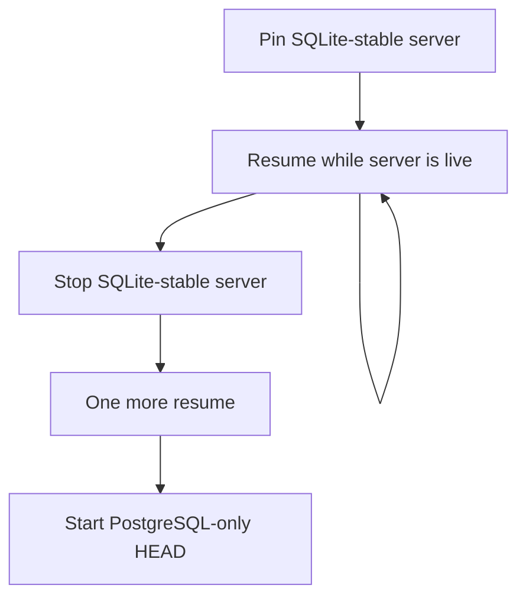
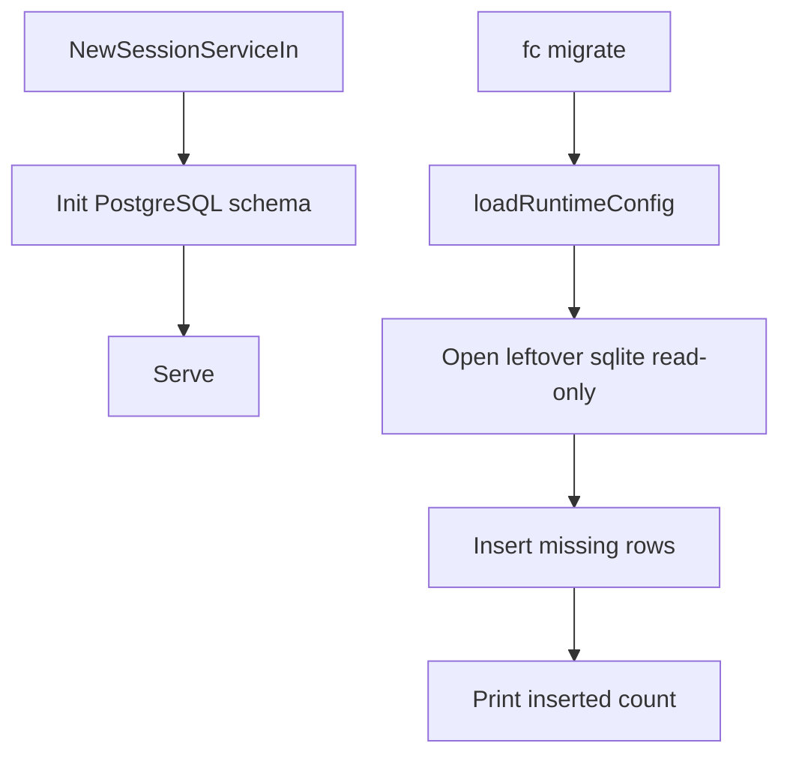

# RocketClaw SQLite Cutover - Plan

## Goal Capsule

- **Objective:** Move a large leftover store from SQLite to PostgreSQL with an operator migrator. RocketClaw itself starts on PostgreSQL only.
- **Product authority:** Product Contract below is source of WHAT. Planning Contract is HOW.
- **Product Contract preservation:** changed R5, R6, KD3, F2, AE5 — start-over is emptying the DSN outside the tool, not a migrator wipe.
- **Open blockers:** None.
- **Stop conditions:** AE1–AE5 have tests. Startup import is gone. `fc migrate` resumes. `make lint` and `make test` pass.

---

## Product Contract

### Summary

An operator runs a migrator from HEAD against a pinned SQLite-stable server. Each run copies missing lines from the live leftover store. After the operator stops that server and runs once more, HEAD starts on PostgreSQL and never reads SQLite.

### Problem Frame

The leftover store is hundreds of gigabytes. A copy at process start would block promote and make restarts expensive. The operator can pin the live server, run HEAD's migrator many times, then promote.

### Key Decisions

- KD1. **Operator cutover only.** Startup import is removed. Governs R1, R2.
  (session-settled: user-directed — chosen over keep-both or delete-later: every workspace moves with an explicit cutover)
- KD2. **Resume the live leftover file.** Each run copies only missing lines. Governs R4, R5.
  (session-settled: user-directed — chosen over frozen-copy-plus-catch-up or convert-after-stop: successive restarts must feed missing lines)
- KD3. **Resume is the only migrator action.** Start-over is emptying the PostgreSQL database outside the tool. Governs R5, R6.
  (session-settled: user-directed — chosen over an in-tool wipe: operator already owns the DSN)
- KD4. **The operator declares the last resume done.** The migrator does not prove the leftover file is idle or that totals match. Governs R7.
  (session-settled: user-directed — chosen over prove-idle or compare-counts)
- KD5. **HEAD RocketClaw is PostgreSQL-only.** Start does not inspect leftover SQLite. The migrator is the defensive path. Governs R1, R3.
  (session-settled: user-directed — chosen over fail-closed-on-leftover-sqlite or keep-serving-SQLite-until-marked)

<!-- ce-section: work-relationships -->
### How This Work Fits Together

This plan owns the operator cutover and the removal of startup import. It revises the copy-on-open rule in `docs/plans/2026-08-16-001-feat-rocketclaw-postgres-store-plan.md`.

- PostgreSQL as the State Store — **Depends on** that plan's store contract (`database_url`, one DSN is one store).
- Delete leftover-SQLite support from the runtime after every workspace has moved — **Can proceed independently** after this cutover exists. **Still to decide** when that deletion ships.

### Actors

- A1. Operator who pins SQLite-stable RocketClaw, runs the HEAD migrator, then promotes HEAD.
- A2. Pinned SQLite-stable RocketClaw, still writing the leftover store.
- A3. HEAD migrator.
- A4. HEAD RocketClaw, PostgreSQL-only.

### Requirements

**Runtime**

- R1. HEAD RocketClaw opens the State Store from the selected config `database_url` and does not import leftover SQLite.
- R2. Opening the State Store does not import leftover SQLite even when that file is present and the store is empty.

**Migrator**

- R3. The migrator requires the leftover SQLite file and the selected server config. It refuses to run if either is missing.
- R4. The migrator reads the live leftover store and copies only lines not already in the PostgreSQL store named by that config. Copied session entries keep their leftover `session_entries.id` values. Resume does not delete PostgreSQL rows that have disappeared from leftover SQLite. The running server removes those later.
- R5. A later run against the same store continues from R4. It does not clear existing PostgreSQL rows.
- R6. Start-over is emptying that DSN outside the migrator. The migrator has no wipe action.
- R7. After a successful resume, the operator may start HEAD. The migrator does not gate start and does not need to report that SQLite is idle.
- R8. The leftover file stays in place after every run. HEAD ignores it.

### Key Flows

- F1. Promote a large leftover store
  - **Trigger:** Operator is ready to move a pinned SQLite-stable workspace to HEAD.
  - **Actors:** A1, A2, A3, A4
  - **Steps:** Operator keeps A2 running. Operator runs A3 one or more times. Operator stops A2. Operator runs A3 once more. Operator starts A4.
  - **Outcome:** A4 serves from PostgreSQL. Leftover SQLite remains a file on disk.
  - **Covered by:** R1, R3, R4, R5, R7, R8

- F2. Abort and start over
  - **Trigger:** Operator does not trust the PostgreSQL store mid-cutover.
  - **Actors:** A1, A3
  - **Steps:** Operator empties the DSN outside the tool. Operator resumes again.
  - **Outcome:** The next resume treats the PostgreSQL store as empty of copied lines.
  - **Covered by:** R6, R5

### Acceptance Examples

- AE1. Resume while live
  - **Covers R4, R5.**
  - **Given:** A leftover store and a PostgreSQL store that already has an earlier resume.
  - **When:** The operator runs the migrator again while SQLite-stable RocketClaw is still writing.
  - **Then:** Only missing lines are copied. Earlier PostgreSQL rows stay.

- AE2. Missing leftover file
  - **Covers R3.**
  - **Given:** Selected config is present and the leftover SQLite file is not.
  - **When:** The operator runs the migrator.
  - **Then:** The run refuses. The PostgreSQL store is unchanged.

- AE3. Missing config
  - **Covers R3.**
  - **Given:** The leftover SQLite file is present and the selected server config is not.
  - **When:** The operator runs the migrator.
  - **Then:** The run refuses. The PostgreSQL store is unchanged.

- AE4. HEAD start ignores leftover SQLite
  - **Covers R1, R2, R8.**
  - **Given:** Leftover SQLite is present and PostgreSQL is empty.
  - **When:** The operator starts HEAD without running the migrator.
  - **Then:** HEAD starts on that empty PostgreSQL store and does not copy SQLite.

- AE5. Empty DSN then resume
  - **Covers R6, R5.**
  - **Given:** A PostgreSQL store with a partial copy.
  - **When:** The operator empties that DSN outside the tool and runs the migrator.
  - **Then:** The copy starts over from the leftover file.

### Scope Boundaries

- No SQLite serving from HEAD.
- No historical SQLite format upgrades.
- No idle-file or row-count proof before start.
- No in-tool wipe.
- Quickweb keeps its own SQLite file.

### Dependencies / Assumptions

- The leftover store is the current SQLite schema the pinned server writes. Older leftover formats are out of scope.
- The selected config is the same femtoclaw-first file HEAD RocketClaw uses, including `database_url`.
- The operator can run HEAD's migrator against a workspace whose server is still the pinned SQLite-stable binary.

### Sources / Research

- `docs/plans/2026-08-16-001-feat-rocketclaw-postgres-store-plan.md` — current copy-on-open contract this work revises.
- `CONCEPTS.md` — State Store and Bootstrap SQLite Import vocabulary to update when this ships.

---

## Planning Contract

### Key Technical Decisions

- KTD1. **`fc migrate` is the migrator.** Same config load as other `fc` commands. No `--wipe`. Governs R3, R6, R7.
- KTD2. **Missing means primary-key absence.** Insert with `ON CONFLICT DO NOTHING`. Keep leftover `session_entries.id`. After each run, `setval` to `MAX(id)` when any session entry exists. Governs R4, R5.
- KTD3. **Do not take the state-store flock.** Open leftover sqlite read-only. The live daemon holds `{runtimeDir}/state.sqlite3.lock`. Governs R4.
- KTD4. **Print how many rows this run inserted.** Do not gate start. Governs R7.
- KTD5. **Remove `importSQLiteIfNeeded` from `NewSessionServiceIn`.** Stop writing the bootstrap marker on open. Leave the `store_bootstrap` table in schema; do not use it as a done signal. Governs R1, R2.

### High-Level Technical Design

Reuse the table list and insert SQL in `internal/rocketclaw/harnessbridge/store_bootstrap.go`. Change those inserts to conflict-do-nothing. Call that path only from `fc migrate`.

### Assumptions

- A live SQLite-stable daemon allows a second read-only connection to `state.sqlite3` while it holds only the sibling lock file.
- Primary keys on the copied tables are stable identities for resume.

### Risks

- Live WAL writers can produce a torn snapshot mid-SELECT. The operator's last resume after stop is the intended consistency point.
- Insert-absent will not refresh mutated non-entry rows. The operator accepted that deleted leftover rows stay in PostgreSQL until the new server deletes them.

---

## Implementation Units

### U1. Stop importing on store open

- **Goal:** HEAD open paths never copy leftover SQLite. Covers R1, R2, AE4.
- **Files:** `internal/rocketclaw/harnessbridge/store.go`, `internal/rocketclaw/harnessbridge/store_bootstrap.go`, `internal/rocketclaw/harnessbridge/store_bootstrap_test.go`, `internal/rocketclaw/harnessbridge/store_pgxmock_test.go`
- **Approach:** Delete the `importSQLiteIfNeeded` call from `NewSessionServiceIn`. Delete `writeBootstrapMarker` from the missing-sqlite open path. Keep copy helpers for U2.
- **Test scenarios:**
  - Leftover v9 sqlite present, empty PostgreSQL: `NewSessionServiceIn` opens and does not copy rows.
  - Existing `TestBootstrapCopiesV9SQLiteOnce` / reject-non-v9 move to the migrator tests in U2.
- **Verification:** `go test` the harnessbridge package with `ROCKETCLAW_TEST_DATABASE_URL`.

### U2. Incremental leftover copy

- **Goal:** One function copies missing rows from leftover sqlite into the DSN. Covers R3, R4, R5, AE1.
- **Files:** `internal/rocketclaw/harnessbridge/store_bootstrap.go`, `internal/rocketclaw/harnessbridge/store_bootstrap_test.go`
- **Approach:** Open sqlite `mode=ro`. Fail unless `user_version` is 9. Fail if the file is missing. Insert each copied table with `ON CONFLICT DO NOTHING`. Keep explicit `session_entries.id`. `setval` after copy when `MAX(id)` is set. Do not take `AcquireStateStoreLock`. Return inserted row count.
- **Test scenarios:**
  - First run copies a v9 fixture including `session_entries.id = 7`; next append is `> 7`.
  - Second run inserts only new leftover rows; earlier PostgreSQL rows stay.
  - `user_version = 8` fails and writes nothing.
  - Missing sqlite file fails.
- **Verification:** same harnessbridge tests.

### U3. `fc migrate`

- **Goal:** Operator command that loads the selected config and runs U2. Covers R3, R6, R7, AE2, AE3, AE5.
- **Files:** `cmd/rocketclaw/fc.go`, `cmd/rocketclaw/fc_test.go`, `cmd/rocketclaw/main.go`, `cmd/rocketclaw/CHEATSHEET.md`
- **Approach:** Add `migrate` beside `list|observe|delete|check`. Reuse `loadRuntimeConfig`. No flock. Print inserted count. No wipe flag. Empty-DSN start-over is operator `DROP DATABASE` / recreate, then migrate again.
- **Test scenarios:**
  - Config + leftover file: migrate succeeds; second migrate inserts zero for the same rows.
  - Missing leftover file: refuse; PostgreSQL unchanged.
  - Missing config: refuse.
  - Help lists `fc migrate`.
- **Verification:** `go test` `cmd/rocketclaw` with `ROCKETCLAW_TEST_DATABASE_URL`.

### U4. Operator docs

- **Goal:** Vocabulary matches PostgreSQL-only start plus operator migrate.
- **Files:** `CONCEPTS.md`, `README.md`, `cmd/rocketclaw/CHEATSHEET.md`
- **Approach:** Replace Bootstrap SQLite Import with the operator migrator. State leftover sqlite is ignored by `run`.
- **Test scenarios:** none beyond doc review.
- **Verification:** read the three files.

---

## Verification Contract

| Check | Command |
| --- | --- |
| Package tests | `ROCKETCLAW_TEST_DATABASE_URL` set; `go test` `internal/rocketclaw/harnessbridge` and `cmd/rocketclaw` |
| Full suite | `make test` |
| Lint | `make lint` |

---

## Definition of Done

- AE1–AE5 covered by U1–U3 tests.
- `NewSessionServiceIn` does not import leftover sqlite.
- `fc migrate` is the only copy path.
- No wipe flag.
- `CONCEPTS.md` and `README.md` no longer describe copy-on-open.
- Abandoned helpers from the old one-shot import path are deleted or only used by migrate.
