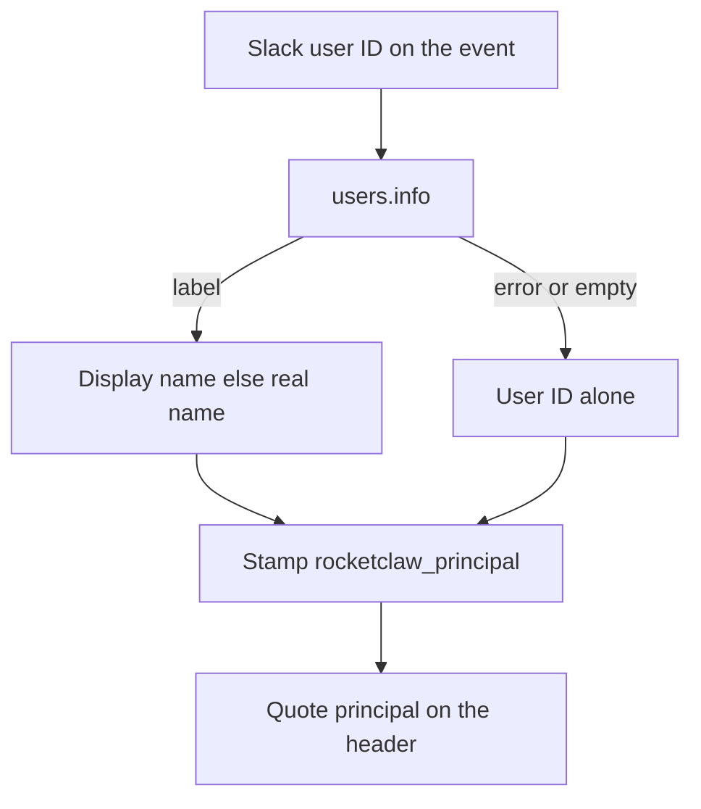

# Slack Principal Human Name - Plan

## Goal Capsule

- **Objective:** The model can address a Slack sender by the name Slack shows, and can tell two same-named people apart.
- **Means:** Slack supplies `Name (ID)` as principal. Clockwork quotes that field in the model header. (Quote principal Key Decision, KTD1, KTD2)
- **Product authority:** Product Contract below is source of WHAT. Planning Contract is HOW.
- **Product Contract preservation:** unchanged
- **Open blockers:** None.
- **Stop conditions:** AE1–AE4 have tests. `gofmt` on touched files. `go test` on touched packages. `make lint` and `make test` pass.

## Product Contract

### Summary

Slack human turns show the sender as a quoted `principal="Ulderico (U0ADDPB7P4K)"`.
Each connector still chooses the principal string.
Clockwork prints whatever it was given, quoted so spaces stay readable and the header stays one field.

### Problem Frame

Slack currently labels the sender with the Slack user ID, so the model sees `U0ADDPB7P4K` instead of `Ulderico`.
The header also smashes spaces and `=`/`[]` into a single token, so a human name would become `Ulderico_(U0ADDPB7P4K)` even after Slack started sending a real name.

### Key Decisions

- **Name plus Slack ID.** Governs R1.
  (session-settled: user-directed — chosen over name-only: keep identity when display names collide)
- **What Slack shows.** Governs R1.
  (session-settled: user-directed — chosen over real-name-only or display-name-only: match Slack's own label)
- **Connectors own the value.** Governs R5.
  (session-settled: user-directed — chosen over clockwork inventing names: Slack, External MCP, and others each define principal)
- **Quote principal, do not smash it.** Governs R3, R4.
  (session-settled: user-directed — chosen over underscore tokens: readable like additional instructions, still one field)
- **Lookup miss stays the ID.** Governs R2.
  (session-settled: user-approved — chosen over hiding principal: keep today's ID when Slack has no name)

### Actors

- A1. Slack human who sent the turn
- A2. Slack connector, which chooses the Slack principal string
- A3. Clockwork, which quotes principal and frames the model header
- A4. The model reading that header

### Requirements

**Slack value**

- R1. For a Slack human turn, principal is what Slack shows for that user, then the Slack user ID, in the form `Name (ID)`.
- R2. If Slack returns no visible label for the sender, principal is that Slack user ID alone. A lookup or permission failure is a miss only when no Slack-visible label is available.

**Header**

- R3. The model-visible header shows Slack's principal quoted, so the model can read `Ulderico (U0ADDPB7P4K)` as one field.
- R4. Clockwork quotes every principal it prints. It does not turn spaces into underscores or rewrite `=` / `[]`.

**Other sources**

- R5. Other connectors keep choosing their own principal strings. This work does not change those values.
- R6. Principal is model-visible provenance only. Authorization and routing keep using Slack user IDs.

### Key Flows

- F1. Named Slack sender
  - **Trigger:** A1 sends a Slack message and Slack can resolve their label.
  - **Actors:** A1, A2, A3, A4
  - **Steps:** A2 sets principal to `Name (ID)`. A3 quotes it on the header. A4 sees the readable name and the ID.
  - **Covered by:** R1, R3, R4
- F2. Unresolved Slack sender
  - **Trigger:** A1 sends a Slack message and Slack returns no visible label.
  - **Actors:** A1, A2, A3, A4
  - **Steps:** A2 sets principal to the Slack user ID. A3 quotes that ID. A4 still sees who the connector attributed.
  - **Covered by:** R2, R4

### Acceptance Examples

- AE1. Display name present
  - **Covers R1, R3.**
  - **Given:** Slack shows `Ulderico` for `U0ADDPB7P4K`.
  - **When:** That person sends a human Slack turn.
  - **Then:** The header includes `principal="Ulderico (U0ADDPB7P4K)"`.
- AE2. Display name empty, real name present
  - **Covers R1.**
  - **Given:** Slack has no display name and real name `Ulderico Cirello` for `U0ADDPB7P4K`.
  - **When:** That person sends a human Slack turn.
  - **Then:** The header includes `principal="Ulderico Cirello (U0ADDPB7P4K)"`.
- AE3. Name lookup fails
  - **Covers R2, R4.**
  - **Given:** Slack returns no visible label for `U0ADDPB7P4K`.
  - **When:** That person sends a human Slack turn.
  - **Then:** The header includes `principal="U0ADDPB7P4K"`.
- AE4. Other connector value unchanged
  - **Covers R5, R4.**
  - **Given:** External MCP supplies principal `Alice [ops]=lead`.
  - **When:** That human turn is framed.
  - **Then:** The header includes `principal="Alice [ops]=lead"`, not a smashed token.

### Scope Boundaries

- Do not change how other connectors choose their principal strings.
- Do not use principal text for authorization, allowlists, or routing.
- Do not put the human name only in the message body instead of principal.
- Do not resolve names of @mentioned users who are not the turn's principal.

### Dependencies / Assumptions

- The Slack connector uses the sender's Slack-visible label when Slack still shows one, including Slack Connect and guests. A lookup or permission failure is an ID-only miss only when no label is available.
- Quoting principal the same way additional instructions are quoted keeps spaces inside one field.

### Sources / Research

- Slack currently stamps the Slack user ID as principal.
- The header smash exists so unquoted `principal=` cannot introduce extra fields with spaces, `=`, `[`, or `]`.
- Additional instructions are already quoted, which is the pattern this work adopts for principal.

## Planning Contract

### Key Technical Decisions

- KTD1. **Quote principal with `strconv.Quote`.** Keep `provenanceToken` for origin and media only. Cites Quote principal. Governs R3, R4.
- KTD2. **Resolve Slack names in `slackPrincipal` via `GetUserInfoContext`.** Trim `Profile.DisplayName`, else `RealName`, else the user ID. Do not use `User.Name`. Cites What Slack shows. Governs R1, R2.
- KTD3. **No user-profile cache.** Resolve once per turn and reuse the string at every call site that currently calls `slackPrincipal` twice. Governs R1.
- KTD4. **Any `users.info` error or empty label is a miss.** Return the trimmed user ID. Do not disable the turn. Cites Lookup miss stays the ID. Governs R2.
- KTD5. **Leave allowlists and routing on `ev.User`.** Do not change External MCP principal assignment. Cites Connectors own the value. Governs R5, R6.

### High-Level Technical Design

Slack still owns the principal string. Clockwork only prints it.

### Assumptions

- Display name then real name is what Slack shows for default workspaces. A workspace that forces real names for everyone is not a second lookup.
- The Slack app may need `users:read`. Without it every turn follows R2 until the app is reinstalled.

### Risks

- Inbound handler tests that fail on unexpected HTTP paths will break unless those servers stub `/users.info`.
- Missing `users:read` makes named-sender a no-op. Quoted IDs still land.
- The existing Slack client retries three times, so a miss can pay three failed `users.info` calls.

### Sequencing

U1 then U2. Quoting can ship and be tested without Slack lookup.

## Implementation Units

### U1. Quote principal on the header

- **Goal:** Every principal in the model header is quoted and still one field.
- **Requirements:** R3, R4, R5. AE4, AE3 quoted form.
- **Files:** `internal/rocketclaw/harnessbridge/bridge.go`, `internal/rocketclaw/harnessbridge/bridge_test.go`
- **Approach:** In `provenanceHeader`, trim principal and append `principal=` plus `strconv.Quote`. Do not run principal through `provenanceToken`. Leave origin and media smashed. Update header exact-string tests, including `Alice [ops]=lead` becoming quoted rather than `Alice_(ops)-lead`.
- **Test scenarios:**
  - Slack principal `Alice` renders `principal="Alice"`.
  - External MCP principal `Alice [ops]=lead` renders `principal="Alice [ops]=lead"`.
  - Principal with a quote and backslash stays one field after `strconv.Quote`.
  - Empty principal omits the field.
  - Origin and media still smash as today.
- **Verification:** `gofmt` on the two files. `go test ./internal/rocketclaw/harnessbridge`.
- **Dependencies:** None.

### U2. Slack Name (ID) principal

- **Goal:** Slack human turns stamp `Name (ID)` when Slack still shows a label, else the user ID.
- **Requirements:** R1, R2, R6. AE1, AE2, AE3.
- **Files:** `internal/rocketclaw/slackconnector/connector.go`, `internal/rocketclaw/slackconnector/connector_test.go`, and inbound httptest stubs in that package plus `internal/rocketclaw/slackconnector/adhoc_callout_test.go` if those handlers reach `slackPrincipal`. Optional: `README.md` scope sentence.
- **Approach:** Give `slackPrincipal` a `context.Context`. Call `GetUserInfoContext`. Build `Name (ID)` from KTD2. On error or empty label, return the trimmed ID (KTD4). Resolve once and pass the string into buffer and inbound constructors. Do not add a cache. Do not touch `AllowedUserIDs` or `RecipientUserID`. Stub `/users.info` on inbound servers that reject unknown paths. Add a narrow `slackPrincipal` table test. Do not assert principal on every handler test.
- **Test scenarios:**
  - Display name `Ulderico` for `U0ADDPB7P4K` stamps `Ulderico (U0ADDPB7P4K)`.
  - Empty display name and real name `Ulderico Cirello` stamps `Ulderico Cirello (U0ADDPB7P4K)`.
  - `users.info` error stamps `U0ADDPB7P4K`.
  - Empty user ID stamps empty principal.
  - Allowlist and routing still compare the raw Slack user ID.
- **Verification:** `gofmt` on touched files. `go test ./internal/rocketclaw/slackconnector`.
- **Dependencies:** U1 for the quoted header form in end-to-end header assertions. Slack lookup itself does not depend on U1.

## Verification Contract

- `gofmt` on every touched Go file.
- `go test ./internal/rocketclaw/harnessbridge ./internal/rocketclaw/slackconnector`
- `make lint`
- `make test`

U1 proves AE3 quoted form and AE4. U2 proves AE1–AE3 values. Together they prove F1 and F2.

## Definition of Done

- AE1–AE4 pass.
- No new cache or mutex on `Connector`.
- Auth and External MCP principal assignment unchanged.
- Abandoned lookup experiments are not left in the diff.
- README mentions `users:read` next to the existing Slack scope sentence if that sentence is touched.
- Verification Contract commands pass.

## Documentation / Operational Notes

Named Slack principals need the bot scope `users:read`. Reinstall the Slack app after adding it. Without that scope the header still quotes the user ID.
