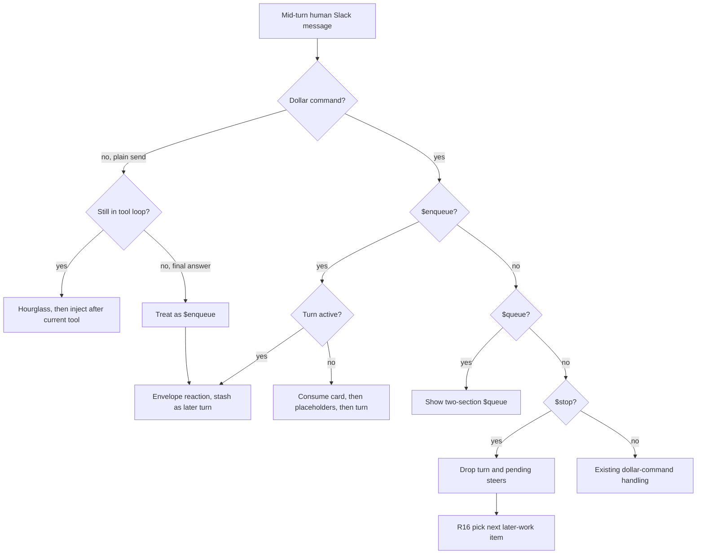
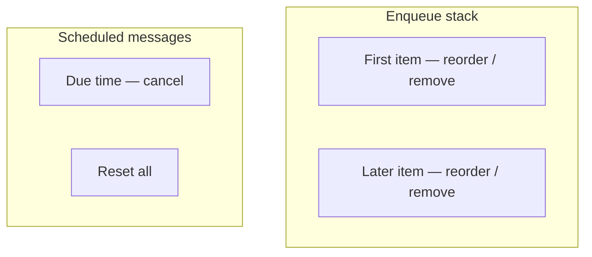
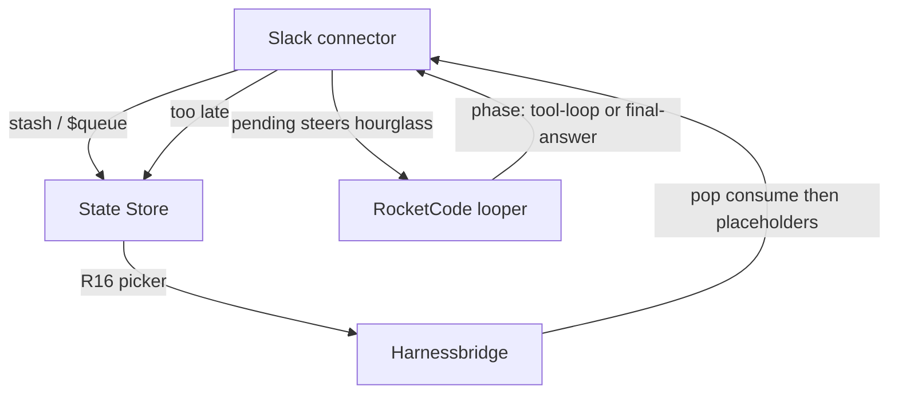
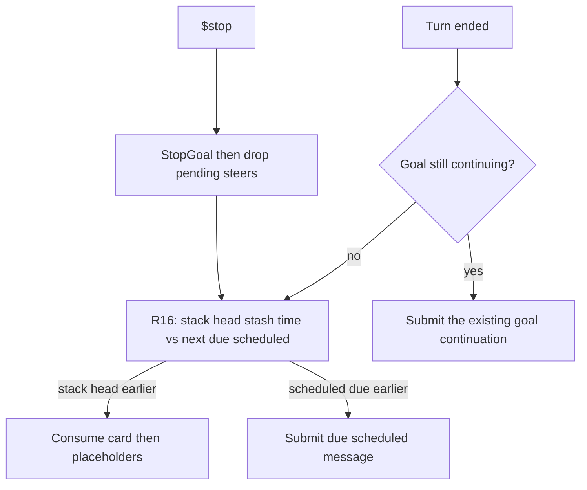

# Slack steer-or-enqueue - Plan

## Goal Capsule

- **Objective:** A person in a Managed Slack Thread can redirect a live turn while the agent is still in the tool loop, or line up later turns, without waiting for the current turn to finish and without those later turns being glued into one prompt.
- **Means:** Plain send steers the live turn. `$enqueue` / `$queue` own later work and scheduled-message management.
- **Product authority:** Product Contract below is source of WHAT. Planning Contract is HOW.
- **Product Contract preservation:** unchanged
- **Open blockers:** None.
- **Stop conditions:** AE1–AE12 have tests. `gofmt` on touched files. `go test` on touched packages. `make lint` and `make test` pass.

---

## Product Contract

### Summary

In a Managed Slack Thread, a mid-turn plain send steers the current turn after the current tool finishes if the agent is still in the tool loop.
If the agent is already writing the final answer, that send becomes an Enqueued Slack Message.
`$enqueue` stashes a later turn.
`$queue` lets anyone allowed in the thread manage that stack and cancel scheduled messages.

### Problem Frame

Today a mid-turn Slack message is a Buffered Follow-Up: hourglass, then after the turn ends it becomes the next turn.
Several of those messages are concatenated into one prompt.
There is no way to redirect work already in the tool loop, and no way to line up distinct later turns or see them next to scheduled prompts.

### Key Decisions

- **Replace Buffered Follow-Up.** Governs R1, R5, R6, R12.
  (session-settled: user-directed — chosen over keep-buffer or hybrid: throw out the current next-turn follow-up rule)
- **Too late to steer during the final answer.** Governs R5.
  (session-settled: user-directed — chosen over interrupting the answer or old hold-then-next-turn)
- **Every pending steer lands, in send order.** Governs R4.
  (session-settled: user-directed — chosen over last-wins or first-steers-rest-enqueue)
- **Hourglass marks a waiting steer.** Governs R3.
  (session-settled: user-directed — chosen over silent inject or a consume card on steer)
- **Idle `$enqueue` starts now.** Governs R8.
  (session-settled: user-directed — chosen over stashing on an idle thread or rejecting the command)
- **`$stop` skips this turn and continues later work with the same picker as a finished turn.** Governs R16, R17, R18.
  (session-settled: user-directed — chosen over hold-queue or clear-everything)
- **`$queue` is two sections; due times stay; run order is readiness arrival.** Governs R13, R15, R16.
  (session-settled: user-directed — chosen over one mixed list or view-only scheduled)
- **Enqueue stack survives restart.** Governs R9.
  (session-settled: user-directed — chosen over memory-only after the durability tradeoff)
- **Uninjected steers retry if the turn resumes.** Governs R19, R20.
  (session-settled: user-directed — chosen over converting them to queued turns or dropping them)
- **Anyone allowed in the thread can manage `$queue`.** Governs R14.
  (session-settled: user-directed — chosen over author-only or author-plus-thread-owner)
- **Full cut, not a smaller slice.** Governs R1 through R21.
  (session-settled: user-directed — chosen over shipping steer-only or enqueue-without-`$queue`)
- **✉️ while `$enqueue` waits; 📨 when it pops.** Governs R7, R10.
  (session-settled: user-directed — chosen over no enqueue receipt and over a mailbox/unread header)

### Actors

- A1. Human allowed to talk to the bot in a Managed Slack Thread.
- A2. The thread's agent, via RocketClaw.
- A3. A due scheduled message for that conversation.

### Requirements

**Steer**

- R1. A plain human message received while a turn is in progress and the agent is still in the tool loop is a Slack Steer: it is fed into that same turn after the current tool call completes.
- R2. A Slack Steer does not create thinking or answer placeholders.
- R3. A Slack Steer is marked with the hourglass reaction until it is injected or discarded. The hourglass is removed on injection, on `$stop` (R17), and when the interrupted turn cannot resume (R20). On `$stop` and on R20 discard, add the existing ❗ interruption reaction. Injected steers only lose the hourglass.
- R4. If several Slack Steers arrive before the next injection point, all of them are fed in, in send order.
- R5. If a plain human message arrives while the agent is already writing the final answer, it is too late to steer and becomes an Enqueued Slack Message per R6 through R12.

**Enqueue**

- R6. `$enqueue <message>` during an active turn stashes that message as a later turn for this thread and does not create thinking or answer placeholders.
- R7. A waiting `$enqueue` is marked with the envelope reaction (✉️) until it is popped or discarded. The envelope is removed on pop and when the item is removed via `$queue` (R14).
- R8. `$enqueue <message>` while no turn is in progress starts that turn immediately, using R10 and R11, even if the enqueue stack is already nonempty.
- R9. Enqueued Slack Messages persist across RocketClaw restarts. Uninjected Slack Steers persist across restart for as long as the interrupted turn can resume, and are dropped with that turn under R20 when it cannot.
- R10. When an Enqueued Slack Message is popped, RocketClaw first posts a Slack Blocks card whose header uses the incoming-envelope emoji (📨), then a divider, then the popped message text as the body.
- R11. Only after that consume card is posted does RocketClaw reserve the thinking and answer placeholders and start the turn.
- R12. Enqueued Slack Messages run as separate turns in queue order. They are not concatenated into one prompt.

**Queue surface**

- R13. `$queue` shows two sections — the enqueue stack and this conversation's scheduled messages — and does not start a turn or create placeholders. Each enqueue row shows its position and message text. Each scheduled row shows its message text and due time. Controls are bound to that row.
- R14. Anyone allowed to talk to the bot in the thread can reorder and remove enqueued items, and can cancel one scheduled message or reset all scheduled messages for the conversation.
- R15. The two `$queue` sections cannot be interleaved. Reorder applies only to the enqueue stack. Scheduled due times stay authoritative for when a scheduled item becomes ready.
- R16. After a turn ends, if a goal is still continuing, that continuation wins the next slot. Otherwise the next later-work item is the earlier of: the first item on the enqueue stack in current stack order, ready at that item's stash time; or the next scheduled message, ready at its due time. Reorder changes stack sequence only and does not change stash timestamps. The stack-versus-schedule picker runs when the goal is stopped or there is no goal.

**Lifecycle**

- R17. `$stop` discards the current turn and any uninjected Slack Steers, including a `$workflow` run and a goal-loop turn. A stopped goal still becomes stopped and a workflow run still ends. The enqueue stack remains. The next later-work item is chosen with the same R16 rule, including a due scheduled message when it became ready first. If that picker selects an Enqueued Slack Message, start it per R10 and R11. The queue is independent later work.
- R18. `$stop` does not clear scheduled messages.
- R19. If RocketClaw restarts and the interrupted turn resumes, uninjected Slack Steers are retried as steers at the next tool boundary.
- R20. If the interrupted turn cannot resume, uninjected Slack Steers are discarded, the goal is stopped, and the next later-work item is chosen with the same R16 rule as R17.
- R21. Dollar commands other than `$enqueue` and `$queue` keep being consumed before steer, enqueue, or ordinary prompt handling.

### Key Flows

- F1. Steer during the tool loop
  - **Trigger:** A1 sends a plain message while A2 is in an active turn still making tool calls.
  - **Actors:** A1, A2
  - **Steps:** Hourglass on the human message. After the current tool completes, inject every waiting Slack Steer in send order. Remove hourglasses. No new placeholders.
  - **Outcome:** The live turn continues with the new instruction.
  - **Covered by:** R1, R2, R3, R4, R21
- F2. Too late to steer
  - **Trigger:** A1 sends a plain message while A2 is writing the final answer.
  - **Actors:** A1, A2
  - **Steps:** The current turn finishes as-is. The message becomes an Enqueued Slack Message with ✉️.
  - **Outcome:** The next turn is a separate queued turn, not an amendment of the final answer.
  - **Covered by:** R5, R6, R7, R12
- F3. Enqueue, then consume
  - **Trigger:** A1 sends `$enqueue <message>` while a turn is active, then that turn ends with this item next per R16.
  - **Actors:** A1, A2
  - **Steps:** No thinking/answer placeholders at stash time. ✉️ until pop. On pop, post the 📨 Blocks card, then reserve thinking and answer placeholders, then start the turn.
  - **Outcome:** Later work is visible as its own turn.
  - **Covered by:** R6, R7, R10, R11, R12, R16
- F4. Idle `$enqueue`
  - **Trigger:** A1 sends `$enqueue <message>` with no active turn.
  - **Actors:** A1, A2
  - **Steps:** Consume card, then placeholders, then the turn, same as a pop.
  - **Outcome:** The thread does not sit idle on a stash.
  - **Covered by:** R8, R10, R11
- F5. `$queue`
  - **Trigger:** A1 sends `$queue`.
  - **Actors:** A1
  - **Steps:** Post two sections. A1 may reorder or remove enqueue items, and cancel or reset scheduled messages. No turn starts.
  - **Outcome:** The stack and schedules are visible and editable in-thread.
  - **Covered by:** R13, R14, R15
- F6. `$stop` into the next later-work item
  - **Trigger:** A1 sends `$stop` while a turn is active.
  - **Actors:** A1, A2, A3
  - **Steps:** Current turn and uninjected Slack Steers die. Scheduled messages stay. The next item is chosen with R16. If that item is an Enqueued Slack Message, start it per R10 and R11.
  - **Outcome:** `$stop` skips this turn and continues later work in the same order as a normal turn end.
  - **Covered by:** R16, R17, R18, R10, R11
- F7. Restart
  - **Trigger:** RocketClaw restarts with a waiting enqueue stack and, optionally, uninjected Slack Steers.
  - **Actors:** A2
   - **Steps:** Enqueued Slack Messages come back. If the turn resumes, pending Slack Steers inject at the next tool boundary. If it cannot resume, those steers die and the next later-work item is chosen with the same R16 rule as R17.
  - **Outcome:** Stashed later work is not lost. Live steers only survive with a resumed turn.
  - **Covered by:** R9, R19, R20

### Acceptance Examples

- AE1. Steer after the current tool
  - **Covers R1, R2, R3.**
  - **Given:** A turn is running a tool call.
  - **When:** A1 sends `don't touch the database`.
  - **Then:** The message gets hourglass, no thinking/answer cards are created, and after that tool completes the live turn receives the text.
- AE2. Several steers
  - **Covers R4.**
  - **Given:** A tool call is still running.
  - **When:** A1 sends `use the other file`, then `and skip tests`.
  - **Then:** Both texts are injected, in that order, at the next tool boundary.
- AE3. Final-answer send enqueues
  - **Covers R5, R7, R12.**
  - **Given:** A2 is writing the final answer, with no further tools.
  - **When:** A1 sends `also add a test`.
  - **Then:** The current answer finishes unchanged. The message gets ✉️ and later starts as its own turn.
- AE4. `$enqueue` does not reserve cards
  - **Covers R6, R7.**
  - **Given:** A turn is active.
  - **When:** A1 sends `$enqueue write the changelog`.
  - **Then:** No thinking or answer placeholders are created. The command message gets ✉️.
- AE5. Pop shows 📨 before placeholders
  - **Covers R10, R11.**
  - **Given:** `write the changelog` is the next Enqueued Slack Message.
  - **When:** The current turn ends.
  - **Then:** A Slack Blocks card with a 📨 header is posted, and only then are thinking and answer placeholders reserved.
- AE6. Idle `$enqueue` starts now
  - **Covers R8, R10, R11.**
  - **Given:** The thread has no active turn.
  - **When:** A1 sends `$enqueue write the changelog`.
  - **Then:** The 📨 card, then placeholders, then the turn, happen immediately.
- AE7. `$stop` continues later work
  - **Covers R16, R17, R18.**
  - **Given:** A turn is active. A1 enqueued `changelog` at 3:00. A scheduled message became due at 2:58.
  - **When:** A1 sends `$stop`.
  - **Then:** The live turn and pending Slack Steers die. The scheduled message starts. `changelog` stays on the stack.
- AE8. Due schedule vs earlier enqueue
  - **Covers R16.**
  - **Given:** A1 enqueued `A` at 12:00. A scheduled message becomes due at 12:05 while a turn is still running.
  - **When:** That turn ends.
  - **Then:** `A` runs next. The scheduled message waits.
- AE9. Restart keeps the stack
  - **Covers R9, R19, R20.**
  - **Given:** One Enqueued Slack Message exists and one Slack Steer is waiting.
  - **When:** RocketClaw restarts.
  - **Then:** The enqueued item is still there. If the turn resumes, the steer injects at the next tool boundary. If it cannot, the steer is gone and the enqueued item starts.
- AE10. Anyone can remove from `$queue`
  - **Covers R13, R14, R15.**
  - **Given:** Another allowed person enqueued an item.
  - **When:** A1 runs `$queue` and removes that item.
  - **Then:** The item is gone. Its envelope reaction is cleared. Scheduled rows stay in their own section and cannot be dragged into the stack.
- AE11. Cancel one scheduled message
  - **Covers R14.**
  - **Given:** `$queue` shows a scheduled message due later.
  - **When:** A1 cancels that row.
  - **Then:** The row disappears. That message does not run at its due time.
- AE12. Reset all scheduled messages
  - **Covers R14.**
  - **Given:** The conversation has two scheduled messages.
  - **When:** A1 resets scheduled messages from `$queue`.
  - **Then:** Both rows disappear. Neither runs. The enqueue stack is unchanged.

### Scope Boundaries

- Slack only. External MCP and other surfaces keep their current mid-turn behavior.
- `$queue` does not change a scheduled message's due time or message text.
- Goal-loop budget rules are unchanged except that a mid-turn plain send is a Slack Steer while the agent is still in the tool loop, and an Enqueued Slack Message once the final answer has started.
- `$stop` still ends a `$workflow` run and still marks a goal stopped. Later work then continues per R17.

### Dependencies / Assumptions

- Existing dollar-command parsing still runs before ordinary text. R21 depends on that.
- Scheduled messages already persist and already become ready at due time. `$queue` manages that existing set.
- Active-turn restart recovery already exists. R19 and R20 hang off whether that recovery actually resumes the turn.
- If a turn cannot resume after restart, uninjected Slack Steers die with it, same as `$stop`. Confirmed in synthesis.

### Outstanding Questions

None blocking. Bare `$enqueue` follows existing dollar-command missing-arg help. Empty `$queue` still posts the two-section card. Crash between consume card and turn start is covered by KTD8.

### Sources / Research

- `CONCEPTS.md` — Slack Steer, Enqueued Slack Message, Thread Queue.
- `internal/rocketclaw/docs/specs/2026-07-24-slack-dollar-commands-design.md` — commands are consumed before placeholders or ordinary submit.
- `cmd/rocketclaw/CHEATSHEET.md` — hourglass as the current mid-turn receipt; scheduled-message tools.
- `docs/solutions/logic-errors/slack-root-app-mention-redelivery-cleared-buffered-follow-ups.md` — create-if-absent stack sentinel; do not keep concat-on-promote.

---

## Planning Contract

### Key Technical Decisions

- KTD1. **Thread Queue and unclaimed scheduled work do not live on `requestCh`.** Draining that channel on interrupt would wipe later work. Governs R16, R17, R18.
- KTD2. **Split stores.** In-memory sentinel plus pending Slack Steers stay on the connector. Enqueued Slack Messages live in the State Store. Do not reuse one slice for both. Governs R9, R12.
- KTD3. **Inject after the current tool batch.** RocketCode exposes a real-or-inert drain hook after tool outputs land and before the next provider call. Hold a mid-turn plain send unclassified until that drain hook runs or the in-flight provider response lands. A send is a Slack Steer only when this turn still has a drain hook that will run. No further tools means too late. Parallel tools inject once after the batch. Governs R1, R5.
- KTD4. **A still-live goal continuation wins the next slot after a finished goal turn.** R16 runs when the goal is stopped or there is no goal. Governs R16, R17.
- KTD5. **`$queue` clicks use the same “allowed to talk in this thread” check as posting.** Not the agent-switch opener lock, and not social-channel-only. Governs R14.
- KTD6. **Reorder is up/down buttons on each enqueue row.** Omit Up on the first row and Down on the last. A single-item row shows Remove only. Governs R13.
- KTD7. **A Slack Steer is appended as user-role human text in send order.** Compaction steering is a different mechanism. Governs R1, R4.
- KTD8. **Do not delete a popped enqueue row until the turn has started.** A crash after the consume card reprints the card and starts once. Governs R9, R10, R11.

### High-Level Technical Design

`requestCh` stays the live-turn / recovery pipe. The picker `Submit`s only the winner.

### Assumptions

- `beginSlackStack` stays create-if-absent. Redelivery must not wipe pending steers.
- `$workflow` “busy” means a live turn, not a non-empty Thread Queue.
- Agent `rocketclaw_schedule_message` / `rocketclaw_reset_scheduled_messages` keep using the same scheduled rows `$queue` shows.
- Steer inject is human-only. No new agent tools this cut.

### Sequencing

U1 store is landed. U2 Slack split and commands → U3 inject hook → U4 picker, `$stop`, recovery.

---

## Implementation Units

### U1. Persist the Thread Queue

- **Goal:** Enqueued Slack Messages survive restart and `$stop`. Covers R9, R12, R14 cancel/reset of scheduled rows already in the store.
- **Status:** Landed. Reuse `SessionService.PutThreadQueueItem`, `ThreadQueueForConversation`, `DeleteThreadQueueItem`, and `ReorderThreadQueue`. Do not add another migration after `001_init.sql`.
- **Files:** `internal/rocketclaw/harnessbridge/migrations/002_thread_queue.sql`, `store.go`, `store_dao.go`, `store_test.go`.
- **Approach:** Conversation-local ordered rows already exist: id, conversation, text, principal, stash time, position, slack message timestamps for the envelope. Reorder updates position only. The stored principal is `slackPrincipal()` output and is written only onto inbound principal metadata when an Enqueued Slack Message is popped. `$queue` click authorization uses the clicker's Slack user id and the KTD5 posting allowlist, never this column.
- **Test scenarios:**
  - Happy: stash two items, restart process, both return in order. Already covered.
  - Edge: reorder then restart; order is the new stack, stash times unchanged. Already covered.
  - Error: prune conversation deletes its queue rows and leaves other conversations. Add only if still missing.
  - Integration: `$queue` cancel-one scheduled uses `DeleteScheduledMessage`; reset uses `ResetScheduledMessages`; enqueue stack unchanged.
- **Verification:** `go test` on `internal/rocketclaw/harnessbridge`.
- **Execution note:** Start implementation at U2. Call the existing SessionService APIs.

### U2. Split Slack mid-turn and add `$enqueue` / `$queue`

- **Goal:** Slack receipts and dollar commands follow R2, R3, R6–R8, R10–R11, R13–R15, R21. Inject after tools stays on U3. Turn-end pop stays on U4. Cites Replace Buffered Follow-Up, hourglass, envelope, full cut.
- **Files:** `internal/rocketclaw/slackconnector/connector.go`, `connector_test.go`, `cmd/rocketclaw/CHEATSHEET.md`, `internal/rocketclaw/docs/specs/2026-07-24-slack-dollar-commands-design.md`.
- **Approach:** Keep an active-turn sentinel plus pending steers in memory (hourglass). Stash `$enqueue` through U1 (envelope). Slack talks only to PrimaryTextRouter; extend that router with stash/list/reorder/delete queue methods. Do not call `createReplyPlaceholders` on steer or stash. Hold a mid-turn plain send unclassified until U3 can classify it. Idle `$enqueue` starts that message now even if the stack is nonempty (R8). Idle `$enqueue` and pop use ActivationHook: existing titled-message layout with a 📨 header, divider, then the popped message text as the body, then the existing placeholder pair. Omit a popped-not-started enqueue row from `$queue`. Remove ✉️ when the 📨 card posts. Keep the store row only so a crash can reprint that card and start once. `$queue` two sections, up/down/remove, scheduled cancel/reset, KTD6 controls. Render each enqueue and scheduled row body as Slack `plain_text`, truncated with the existing Slack text limit helpers, so stored text cannot fire mentions. `$queue` `block_actions` resolve the managed thread from the clicked message’s channel and thread timestamp, then allow the click only when the clicker’s Slack user id passes the same channel-row allowlist a reply in that thread uses. Handle those actions before any social-channel-only early return. Use distinct action IDs. Mutate only rows that belong to that conversation. Bind each action to that originating channel/thread and stable row id. A successful click `chat.update`s that same `$queue` message to the current two-section view. Do not post a second card. Unauthorized clicks stay ignored with no edit. A click whose target row is already gone is ignored the same way; if that click is on a still-posted `$queue` message, update it to the current two-section view. Always post both section headers. A vacant section keeps its header and a None row with no row controls. Both-vacant still posts that card. Reset all stays under Scheduled even when that section is None. Missing-arg help is only for `$enqueue` with no text. Unknown `$` still posts help; add the two commands to the table.
- **Test scenarios:**
  - Happy: steer receipt (hourglass, no thinking or answer placeholders), AE3 envelope and own-turn half, AE4, AE6, AE10–AE12.
  - Edge: in-memory pending-steer order; two identical texts remain distinct rows; `$workflow` while a queue exists but no live turn is allowed.
  - Error: unauthorized `$queue` click is ignored, including a Slack user who can see the card but fails the posting allowlist or is allowlisted only on a different channel row; `$enqueue` with no text follows existing missing-arg help.
  - Integration: redelivery of a root mention does not wipe pending steers or the durable queue. Delete concat `second\n\nthird` expectations.
- **Verification:** `go test` on `internal/rocketclaw/slackconnector`.
- **Execution note:** Keep `TestHandleAppMentionEventPreservesBufferedReplyAcrossRootRedelivery` as a redelivery test; change the asserted contract, not the “do not wipe” invariant.

### U3. Inject steers after the tool batch

- **Goal:** Slack can tell tool-loop vs final answer and feed waiting steers in. Covers R1–R5. Cites KTD3, KTD7.
- **Files:** `internal/rocketcode/looper.go`, `looper_test.go`, `internal/rocketclaw/harnessbridge/bridge.go`, `bridge_test.go`.
- **Approach:** Expose a queryable tool-loop vs final-answer phase. Bridge.runTurn installs the real drain hook on each looper. Hold a mid-turn plain send until the current drain hook runs or the in-flight provider response lands, then classify it as a Slack Steer or as an R5 Enqueued Slack Message. A send is a Slack Steer only when this turn still has a drain hook that will run. After each provider response, `hadToolCalls` stays tool-loop; `!hadToolCalls` flips to final-answer and converts remaining uninjected Slack Steers into Enqueued Slack Messages (envelope, U1 stash, drop hourglass) before the R16 picker runs. Slack registers a real hook; other callers pass inert. Do not reuse `CompactionSteering`.
- **Test scenarios:**
  - Happy: AE1 inject after tools; hourglass removed.
  - Edge: AE2 both texts, user-role, send order; parallel tools inject once after the batch.
  - Error: AE3 no-inject half: no tools means no inject and the final answer is unchanged.
  - Integration: goal-turn human steer stays budget-neutral.
- **Verification:** `go test` on `internal/rocketcode` and `internal/rocketclaw/harnessbridge`.

### U4. Later-work picker, `$stop`, and recovery

- **Goal:** Next work after turn end or `$stop` follows R16–R20 and KTD1, KTD4. Covers R16–R20.
- **Files:** `internal/rocketclaw/harnessbridge/bridge.go`, `bridge_test.go`, `internal/rocketclaw/app/thread_bridges.go`, `thread_bridges_test.go`, `internal/rocketclaw/slackconnector/connector.go`, `internal/rocketclaw/harnessbridge/store.go`, `store_dao.go`, `startup_recovery.go`.
- **Approach:** Replace `promoteSlackStack` concat. The existing turn-end path — the finishResponse successor that today calls `promoteSlackStack` — is the only R16 runner. After a turn ends: if a goal is still continuing, submit the existing goal continuation. Else run R16 against U1 stack head vs next due scheduled row, then `Submit` only the winner. `$stop`: drop pending steers, add the existing ❗ interruption reaction on each discarded Slack Steer, `StopGoal`, and interrupt the live turn without draining Thread Queue or unclaimed scheduled rows. `$stop` does not `Submit` later work itself. Keep the live pending-steer list on the connector. Persist a copy on the active-turn row whenever that list changes, as a dedicated pending-steers payload, not SourceMetadata. `ClearActiveTurn` deletes the copy with the turn. On active-turn recovery, load that copy onto the connector before the recovered turn can reach a tool boundary. Run the R20 StopGoal-then-R16 path from the existing cannot-resume ClearActiveTurn sites. The due timer only signals the bridge loop to pick; it must not `Submit` or claim. `ClaimScheduledMessage` runs only after R16 selects that scheduled row as the winner. Recurring DueAt advances only on that winning claim. If a goal is still continuing when a scheduled message becomes due, leave the due row in the store. Run stack-versus-schedule R16 only when the goal is stopped or there is no goal. If a turn is active, leave the row in the store for the next R16 pass. Claimed scheduled work never sits on `requestCh`. Delete a popped enqueue row only after that turn has started. Keep one-shot scheduled delete after that scheduled turn has started, matching KTD8.
- **Test scenarios:**
  - Happy: AE5, AE7, AE8, AE9 resume path.
  - Edge: finished goal turn with a waiting enqueue starts the goal continuation; `$stop` during a goal then starts R16 later work.
  - Error: AE9 cannot-resume follows `$stop` (StopGoal, then R16). `$stop` does not lose a due one-shot scheduled row.
  - Integration: `InterruptActiveTurn` still clears live/recovered `requestCh` work and does not delete U1 rows.
- **Verification:** `go test` on `internal/rocketclaw/harnessbridge`, `internal/rocketclaw/app`, `internal/rocketclaw/slackconnector`.

---

## Verification Contract

| Command | When |
|---|---|
| `gofmt` on touched files | Before claiming a unit done |
| `go test` on touched packages | After each unit |
| `make lint` | Before handoff |
| `make test` | Before handoff |

Do not raise `SOURCE_CLOC_BUDGET`. If first-party growth blows the budget, shrink production code in the same change.

---

## Definition of Done

- R1–R21 are covered by U1–U4 and AE1–AE12 have tests.
- Redelivery still cannot wipe in-flight steers or the Thread Queue.
- `$stop` does not drain the Thread Queue or unclaimed scheduled messages.
- `CHEATSHEET.md` and the dollar-command spec name `$enqueue` and `$queue`.
- `make lint` and `make test` pass.
- README impact considered: update only if the “human message enters RocketClaw” overview still describes concat-and-buffer.
