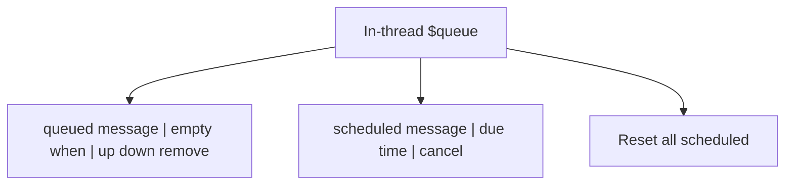
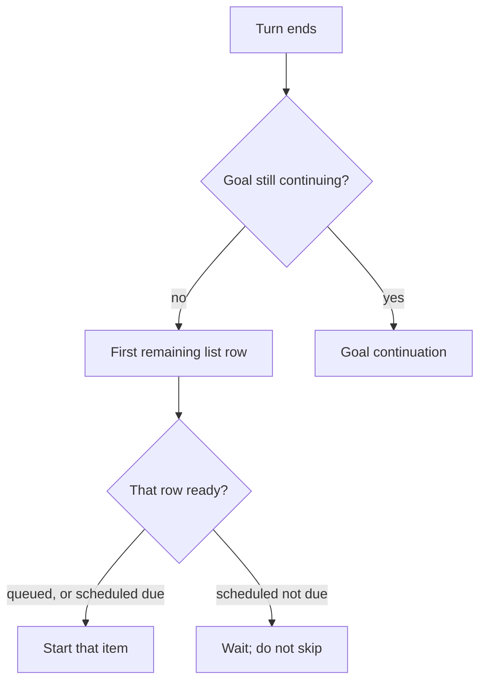
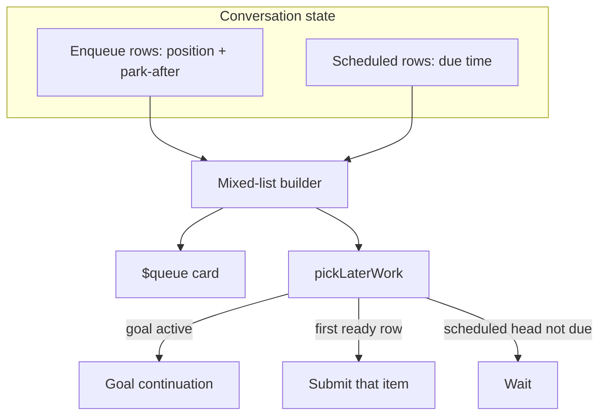

# Slack queue inspector - Plan

## Goal Capsule

- **Objective:** A person in a Managed Slack Thread can read later work as one sequence and change where a queued message sits relative to scheduled ones, without leaving Slack.
- **Means:** One durable mixed later-work list, one Slack card, one picker (KTD1, KTD2).
- **Product authority:** Product Contract below is source of WHAT. Planning Contract is HOW.
- **Product Contract preservation:** restructured, no scope change: R4, F3, F4, AE3, AE6 tightened for durable order, idle pick, and vacant None.
- **Open blockers:** None.
- **Stop conditions:** AE1–AE6 have tests. `gofmt` on touched files. `go test` on touched packages. `make lint` and `make test` pass.

---

## Product Contract

### Summary

`$queue` stays an in-thread Blocks message and becomes one table-like list of later work.
Each row is the message, a when cell, and glyph controls.
Moving a queued row before or after a scheduled row changes what runs next.

### Problem Frame

Today `$queue` posts two sections, Enqueue then Scheduled, with worded Up / Down / Remove / Cancel buttons.
The split hides the sequence.
Scheduled due times and enqueue stack order live in different places, so it is hard to see what happens next or to put a queued message after a scheduled one.

<!-- ce-section: work-relationships -->
### How This Work Fits Together

This plan owns the `$queue` inspector and the later-work picker when a queued row sits after a scheduled row.
It does not reopen steer, `$enqueue`, durability, or who may click.

- Slack steer-or-enqueue (`docs/plans/2026-08-24-1324-feat-slack-steer-or-enqueue-plan.md`): Depends on its steer, `$enqueue`, Thread Queue durability, and click allowlist. Revises its two-section `$queue` card and the stack-head-versus-due-time picker.

### Key Decisions

- **In-thread card, not a modal.** Governs R1.
  (session-settled: user-directed — chosen over a Slack modal: typed `$queue` has no trigger_id)
- **One list; when-cell shows type.** Governs R2, R3.
  (session-settled: user-directed — chosen over two type sections: the split hid the sequence)
- **Row plus controls, not Slack's table block.** Governs R2.
  (session-settled: user-directed — chosen over a real table: Slack table cells cannot hold buttons)
- **Glyph controls, not word labels.** Governs R5.
  (session-settled: user-directed — chosen over Up / Down / Remove / Cancel text)
- **Scheduled rows do not move and do not convert.** Governs R7.
  (session-settled: user-directed — chosen over converting a scheduled row by moving it)
- **Queued rows may park after a scheduled row, and that changes popping.** Governs R4, R9, R10.
  (session-settled: user-directed — chosen over keeping today's stack-head-versus-due-time picker)
- **Up/down in Slack, not drag-and-drop.** Governs R5.
  (session-settled: user-directed — chosen over native drag or a web page: Slack has no drag-and-drop)

### Actors

- A1. Human allowed to talk to the bot in a Managed Slack Thread.
- A2. The thread's agent, via RocketClaw.
- A3. A scheduled message for that conversation, including recurring.

### Requirements

**Surface**

- R1. `$queue` posts one in-thread Slack Blocks message and does not start a turn or create placeholders.
- R2. That message is one table-like list: each later-work row shows the message text, a when cell, and that row's controls. There are no Enqueue or Scheduled section headers.
- R3. A queued row's when cell is empty. A scheduled row's when cell is its due time.
- R4. The list starts as queued rows in stack order, then scheduled rows in due-time order. Move-up and move-down (R10) are what place a queued row between or after scheduled rows. The resulting list order is durable conversation state: a later `$queue`, a restart, and the picker all see the same sequence.
- R5. Row controls are Unicode glyphs or emojis, not words. A queued row has move-up, move-down, and remove. A scheduled row has cancel only. Omit move-up when that queued row is first in the mixed list. Omit move-down when it is last in the mixed list.
- R6. Anyone allowed to talk to the bot in the thread can use those controls, and can reset all scheduled messages for the conversation from a card-level control. A successful click updates that same `$queue` message.

**Scheduled pegs**

- R7. Scheduled rows keep due-time order relative to each other. `$queue` cannot move them, convert them into queued items, or change their due time or text. Recurring rows follow the same rule.

**Picker**

- R8. After a turn ends, a still-continuing goal still wins the next slot.
- R9. Otherwise the next later-work item is the first remaining list row that is ready. A queued row is ready in its list position. A scheduled row is ready at its due time. A not-yet-due scheduled row blocks every later row until that scheduled message runs or is cancelled.
- R10. Move-up and move-down on a queued row change only that item's list position, including parking it before or after a scheduled row. They do not change stash times. They do not move scheduled rows.

### Key Flows

- F1. Open `$queue`
  - **Trigger:** A1 sends `$queue`.
  - **Actors:** A1
  - **Steps:** Post the one-list card. No turn starts.
  - **Outcome:** A1 sees later work in run order.
  - **Covered by:** R1, R2, R3, R4
- F2. Park a queued row after a scheduled row
  - **Trigger:** A1 moves a queued row past a scheduled row.
  - **Actors:** A1, A3
  - **Steps:** Only that queued row changes position. Scheduled rows stay put. The same `$queue` message updates.
  - **Outcome:** That queued message now waits per R9.
  - **Covered by:** R5, R6, R7, R10
- F3. Pop later work
  - **Trigger:** A turn ends and no goal is continuing, or the thread is idle and cancel, reset, remove, or reorder changes the ready head.
  - **Actors:** A2, A3
  - **Steps:** Take the first remaining ready row. If the first remaining row is a not-yet-due scheduled message, wait.
  - **Outcome:** List order is what runs next.
  - **Covered by:** R8, R9
- F4. Cancel a blocking scheduled row
  - **Trigger:** A1 cancels the not-yet-due scheduled row that is first.
  - **Actors:** A1, A3
  - **Steps:** That scheduled message is gone. The following row becomes first. If the thread is idle, pick now.
  - **Outcome:** A queued row that was parked after it can start.
  - **Covered by:** R6, R7, R9

### Acceptance Examples

- AE1. One list, type on the line
  - **Covers R2, R3.**
  - **Given:** Queued "Ship README" and a scheduled "Ping legal" due 15:40 UTC.
  - **When:** A1 runs `$queue`.
  - **Then:** One list, no section headers. The queued when cell is empty. The scheduled when cell shows 15:40 UTC.
- AE2. Park after scheduled waits for that row
  - **Covers R9.**
  - **Given:** Queued "Ship README" sits after a scheduled row due 16:00. No goal is continuing.
  - **When:** The current turn ends at 15:00.
  - **Then:** Nothing starts until 16:00. The 16:00 message runs first, then "Ship README".
- AE3. Cancel unblocks the parked row
  - **Covers R7, R9.**
  - **Given:** Same as AE2. The thread is idle.
  - **When:** A1 cancels the 16:00 row before 16:00.
  - **Then:** "Ship README" starts now.
- AE4. Scheduled order is fixed
  - **Covers R7.**
  - **Given:** Scheduled rows due 16:00 and 17:00.
  - **When:** A1 opens `$queue`.
  - **Then:** 16:00 is above 17:00. Neither row has move controls.
- AE5. Recurring is cancel-only
  - **Covers R5, R7.**
  - **Given:** A recurring scheduled message.
  - **When:** A1 opens `$queue`.
  - **Then:** That row has cancel only.
- AE6. Empty card still posts
  - **Covers R1, R2.**
  - **Given:** No queued items and no scheduled messages.
  - **When:** A1 runs `$queue`.
  - **Then:** The one-list card still posts. One None row with no controls. Reset all remains.

### Scope Boundaries

- No Slack modal, slash command, or web page for `$queue`.
- No drag-and-drop.
- No converting a scheduled message into a queued item.
- No editing scheduled due times or message text from `$queue`.
- Steer, `$enqueue`, envelope reactions, and the consume card stay as in `docs/plans/2026-08-24-1324-feat-slack-steer-or-enqueue-plan.md`.

### Dependencies / Assumptions

- Slack cannot open a modal from a typed `$queue` message.
- Slack's table block cannot hold buttons.
- Goal continuation still precedes the later-work list (R8).
- Waiting at a not-yet-due scheduled head means wait for that row to run or be cancelled, not merely for the clock to reach its due time while skipping it.

### Sources / Research

- Current two-section `$queue` and picker: `docs/plans/2026-08-24-1324-feat-slack-steer-or-enqueue-plan.md`, `CONCEPTS.md`.
- Modal needs `trigger_id`: `docs/plans/2026-08-21-1331-slack-side-ask-plan.md`.
- Dollar-command help already uses a Slack table: `cmd/rocketclaw/CHEATSHEET.md`.
- Redelivery must not wipe later work: `docs/solutions/logic-errors/slack-root-app-mention-redelivery-cleared-buffered-follow-ups.md`.

---

## Planning Contract

### Key Technical Decisions

- KTD1. **Persist mixed order on enqueue rows: stack position plus park-after scheduled id (empty = before all scheduled).** Not a second later-work table. Governs R4, R10.
- KTD2. **One mixed-list builder in harnessbridge.** Slack card and `pickLaterWork` both read it. Slack must not re-sort scheduled on its own.
- KTD3. **`pickLaterWork` walks that list per R9.** After cancel, reset, remove, or reorder that can change the ready head, call pick so an idle thread unblocks (AE3).
- KTD4. **Row glyphs are `↑` `↓` `✕`.** Scheduled cancel is `✕`. Reset all stays the words `Reset all`. When cell is UTC: `15:04 UTC` when due is today UTC, else `2006-01-02 15:04 UTC`. Governs R3, R5.
- KTD5. **New `$enqueue` takes last position in the empty-park slot** (before all scheduled). Only R10 places a queued row after a peg. New scheduled rows insert by due time among pegs and do not reorder queued rows.
- KTD6. **Parking is after this occurrence.** After a recurring claim, clear park-after pointing at that id, then reinsert the peg by its new due time.

### Assumptions

- Idle `$enqueue` and a new human prompt still start now and punch through a wait.
- `Reset all` is destructive enough to stay words, not a glyph.
- Unknown park-after (cancelled peg) is treated as empty park.
- Slack tests' reorder stub must skip scheduled ids; production reorder does not delete omitted enqueue rows.

### High-Level Technical Design

### Implementation Constraints

- Stay inside `internal/rocketclaw` first-party CLOC budget. Rewrite `slackQueueCard` and `pickLaterWork` in place. No new package.
- Card stays two Blocks per row plus Reset all. Do not add a third block per row (Slack 50-block cap).
- Message text stays `plain_text` so stored text cannot fire mentions.
- Next SQL migration is `004_*.sql`. Embed stays `migrations/*.sql`.
- Do not drain Thread Queue or uninjected steers on redelivery.

### Sequencing

U1 then U2 then U3.

---

## Implementation Units

### U1. Persist mixed later-work order

- **Goal:** Conversation state can place a queued item after a scheduled peg and survive restart.
- **Requirements:** R4, R10.
- **Dependencies:** none
- **Files:**
  - `internal/rocketclaw/harnessbridge/migrations/004_thread_queue_park.sql` (create)
  - `internal/rocketclaw/harnessbridge/store.go`
  - `internal/rocketclaw/harnessbridge/store_dao.go`
  - `internal/rocketclaw/harnessbridge/store_test.go`
  - `internal/rocketclaw/app/thread_bridges.go`
  - `internal/rocketclaw/app/thread_bridges_test.go`
  - `internal/rocketclaw/events/clockwork.go`
  - `internal/rocketclaw/app/clockwork.go`
- **Approach:**
  1. Add park-after scheduled id on enqueue rows. Empty means before all scheduled.
  2. Build the mixed list: scheduled pegs in due-time order; enqueue rows in position order under each park slot.
  3. Reorder accepts the mixed visible id list and derives position plus park-after. Skip unknown scheduled ids. Do not delete omitted enqueue rows.
  4. Carry park-after on `ThreadQueueRecord` and the clockwork convert helpers. New stash: last empty-park position (KTD5).
- **Patterns to follow:** `002_thread_queue.sql`, `reorderThreadQueue`, `TestSessionServiceThreadQueuePersistsOrderAndSurvivesReorder`.
- **Test scenarios:**
  - Reorder parks queued id after a scheduled id. Restart still returns that order. `StashAt` unchanged.
  - Default list with no parks is enqueue stack then scheduled by due time.
  - Reorder that omits an enqueue id does not delete that row.
  - New stash lands at the end of the empty-park slot, before scheduled pegs.
- **Verification:** Store and manager tests pass. Mixed list order is the same after a simulated restart.

### U2. Walk the list and pick when idle unblocks

- **Goal:** The picker follows the mixed list. Cancel, reset, remove, or reorder on an idle thread starts the new ready head.
- **Requirements:** R8, R9. F3, F4. AE2, AE3.
- **Dependencies:** U1
- **Files:**
  - `internal/rocketclaw/harnessbridge/bridge.go`
  - `internal/rocketclaw/harnessbridge/bridge_test.go`
  - `internal/rocketclaw/app/thread_bridges.go`
- **Approach:**
  1. Replace stash-head versus earliest-due with a walk of U1's list (R9). Keep goal-active first (R8). Keep due-timer as signal-only. Claim only after the picker selects that scheduled row.
  2. After cancel, reset, remove, or reorder that can change the ready head, call `PickLaterWork` from the thread-bridge manager so Slack and `rocketclaw_reset_scheduled_messages` both unblock.
  3. On scheduled delete or reset, treat park-after that id as empty (unknown peg). After a recurring claim, apply KTD6.
- **Execution note:** Rewrite the stash-versus-due picker tests before changing `pickLaterWork`.
- **Patterns to follow:** existing `pickLaterWork`, `ClaimScheduledMessage`, `forgetStartedLaterWork`, `armScheduledMessage`.
- **Test scenarios:**
  - Covers AE2. Parked queued after a future scheduled head: turn end submits nothing.
  - Covers AE3. Idle cancel of that head submits the parked queued item.
  - Goal still active: no later-work submit.
  - Due timer while busy: no submit.
  - Recurring claim: parked-after that occurrence is no longer waiting on the next due.
  - Reset all on idle: first remaining queued item starts.
- **Verification:** Rewritten picker tests pass. AE2 wait and AE3 idle start are covered.

### U3. One-list `$queue` card and docs

- **Goal:** `$queue` shows the mixed list with glyph row controls. Move steps through scheduled pegs. Help copy matches.
- **Requirements:** R1–R7, R10. F1, F2. AE1, AE4, AE5, AE6.
- **Dependencies:** U1, U2
- **Files:**
  - `internal/rocketclaw/slackconnector/connector.go`
  - `internal/rocketclaw/slackconnector/connector_test.go`
  - `cmd/rocketclaw/CHEATSHEET.md`
  - `internal/rocketclaw/docs/specs/2026-07-24-slack-dollar-commands-design.md`
- **Approach:**
  1. Rewrite `slackQueueCard` as one list from the U1 builder. No section headers. When cell per KTD4. Row glyphs per KTD4. Vacant: one None row, Reset all stays.
  2. `moveQueueItem` walks the mixed list. Adjacent swap may park after or before a peg. Scheduled rows never swap.
  3. Keep action IDs and `slackQueueAction` binding. Keep allowlist, `chat.update`, omit popped-not-started rows.
  4. After a successful mutate, let U2 pick. Update the Slack reorder stub to skip scheduled ids.
  5. Update CHEATSHEET, dollar-command spec, and the in-product `$queue` help line.
- **Patterns to follow:** current `slackQueueCard`, `handleQueueInteractive`, `slackDollarCommandHelpTable`.
- **Test scenarios:**
  - Covers AE1. Two-item card: no Enqueue/Scheduled headers; queued when empty; scheduled when shows due.
  - Covers AE4 / AE5. Scheduled rows have `✕` only.
  - Covers AE6. Vacant card posts None plus Reset all. No row controls.
  - First mixed-list row has no `↑`. Last mixed-list row has no `↓`. A queued row above a scheduled peg still has `↓`.
  - Park move: Down on a queued row above a scheduled peg persists park-after that peg and `chat.update`s the same message.
  - Another allowed user can Remove. Unauthorized click does not mutate or update.
  - Stale row still refreshes the card. Do not assert the old Enqueue header.
- **Verification:** Slack connector `$queue` tests pass. Help table still has a `$queue` row. CHEATSHEET describes one list.

---

## Verification Contract

- Iterate with `go test` on `./internal/rocketclaw/slackconnector`, `./internal/rocketclaw/harnessbridge`, and `./internal/rocketclaw/app`.
- Before done: `gofmt` on touched files, `go test ./...`, `make lint`, `make test`.
- `make test` is generate, lint, coverage, and CLOC. Needs Postgres (`ROCKETCLAW_TEST_DATABASE_URL` or the RocketClaw Makefile docker).
- Do not raise `SOURCE_CLOC_BUDGET`.

---

## Definition of Done

- AE1–AE6 are covered by tests named in U1–U3.
- `$queue` no longer posts Enqueue/Scheduled headers.
- Park-after survives restart and drives `pickLaterWork`.
- Idle cancel of a blocking scheduled head starts the next ready queued row.
- CHEATSHEET and the dollar-command spec describe one list.
- Abandoned attempt code is gone from the diff.
- README was considered: no `$queue` mention there; no README change.
