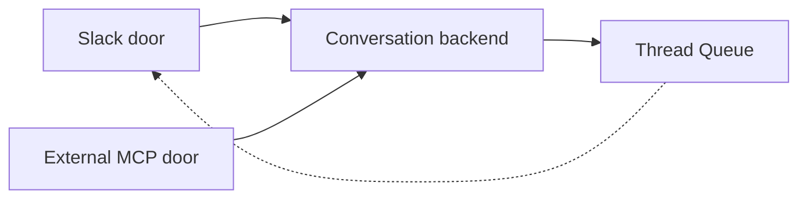
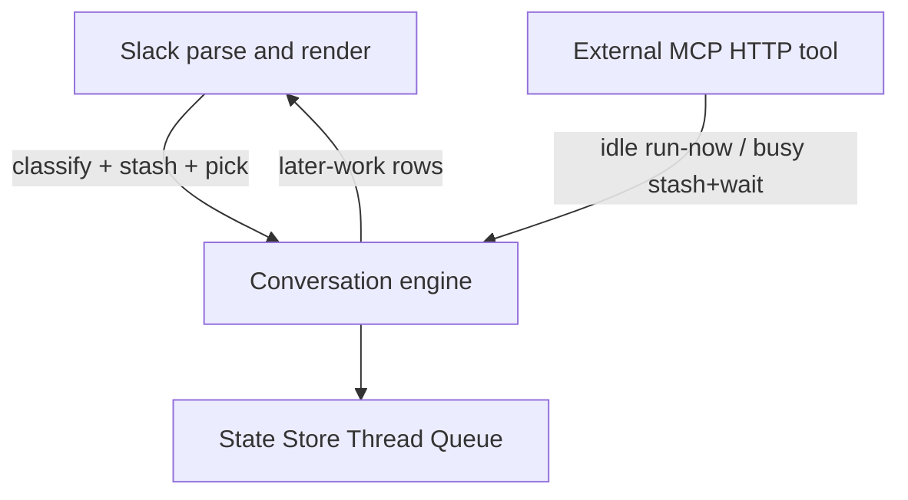
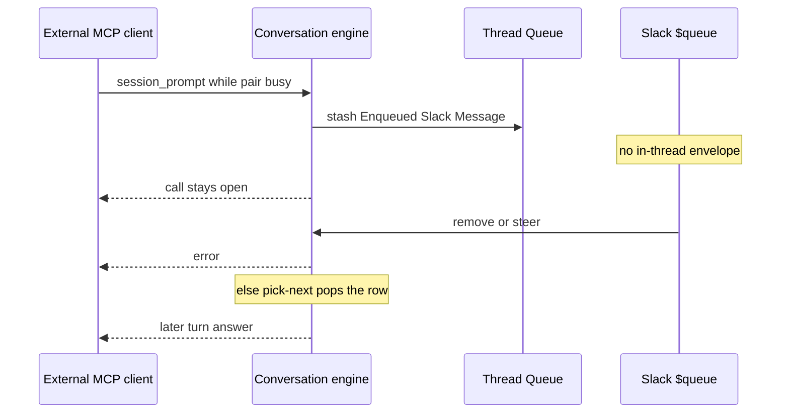

# RocketClaw One Door - Plan

## Goal Capsule

- **Objective:** A Managed Slack Thread has one later-work list reachable from Slack and External MCP. RocketClaw first-party source lines are at or below 19350.
- **Means:** Delete duplicate later-work doors and Slack policy copies; engine stays the package Slack already imports; surfaces rename last (KTD1, KTD2, KTD5).
- **Authority:** This Product Contract. CONCEPTS.md for Managed Slack Thread, Slack Steer, Enqueued Slack Message, and Thread Queue.
- **Stop conditions:** Stop if first-party source lines cannot land at or below 19350 without raising the line budget. Stop if `session_prompt` would stop running immediately when the paired thread is idle. Stop if Slack `$queue` ticket-row UX would be replaced.
- **Product Contract preservation:** changed KD7 — surface rename is in this round; R11 still wins if the cut would miss.

---

## Product Contract

### Summary

Slack and External MCP become thin doors into one conversation backend. Mid-turn External MCP prompts join that thread's Thread Queue. Slack `$queue` stays the human cockpit. Duplicate doors and policy copies go away so first-party lines land at or below 19350.

### Problem Frame

Clockwork, the conversation engine, and Slack each own a slice of later-work. Slack decides steer vs enqueue, draws `$queue`, and keeps in-memory steers. The engine stores the queue and picks next work. The bus forwards requests and skips the sender. External MCP uses a second submit path with no later-work. The line budget sits at 20350 with almost no room, so every Slack later-work change fights the cap instead of deleting copies.

### Key Decisions

- **One conversation engine, Slack and External MCP as doors.** (session-settled: user-directed — chosen over two internals or keep-names: one engine Slack already imports; `app` stays process wiring.) Governs R1, R12.
- **Backend owns steer vs enqueue. Slack unmarked mid-turn stays a steer. External MCP does not offer the choice; busy defaults to enqueue.** (session-settled: user-directed — chosen over MCP inferring steer or surfaces classifying forever.) Governs R3, R4, R6.
- **External MCP this round only enqueues when busy. No MCP later-work tools.** (session-settled: user-directed — chosen over MCP list/reorder/steer tools.) Governs R10.
- **Later-work policy leaves Slack now. Hide and ephemeral cards stay Slack render.** (session-settled: user-approved — chosen over leaving `$queue` clicks in Slack.) Governs R8, R9.
- **No line-budget bump. Land at or below 19350, then lower the cap to the landing count.** (session-settled: user-directed — chosen over +2000 temporary or a hard 19000.) Governs R11.
- **Busy External MCP rows live on the paired thread's Thread Queue.** (session-settled: user-approved — chosen over an MCP-only queue or rejecting the prompt.) Governs R7.
- **Rename surface packages this round as replacement.** (session-settled: user-directed — chosen over skip-until-after-cut: disk map this round; R11 still wins.) Governs R12.

### Actors

- A1. Human in a Managed Slack Thread
- A2. External MCP client on the paired session
- A3. Conversation backend (later-work policy, pick-next, turn run)

### Requirements

**Door**

- R1. Slack and External MCP reach the same conversation operations for a Managed Slack Thread.
- R2. Every operation names its real surface: Slack or External MCP.

**Later-work**

- R3. During an active turn, an unmarked Slack follow-up is a Slack Steer.
- R4. Slack `$enqueue` stashes an Enqueued Slack Message on that thread's Thread Queue.
- R5. When the paired thread is idle, External MCP `session_prompt` starts or continues the turn immediately.
- R6. External MCP `session_prompt` while that paired thread has an active turn stashes an Enqueued Slack Message on that thread's Thread Queue. That same call waits until the queued turn finishes and then returns that turn's answer. If Slack `$queue` removes or steers the row, the call returns an error, not an answer. The thread stays silent until `$queue` or pop.
- R7. That Thread Queue is conversation-local. Slack `$queue` shows MCP-originated rows with the same reorder, remove, steer, and scheduled cancel controls as Slack-originated rows.

**Surfaces**

- R8. Stash, mixed later-work order, reorder, remove, steer-from-queue, pick-next, and scheduled cancel/reset live in the backend. Surfaces do not keep a second policy copy.
- R9. Slack owns parse, Block Kit, reactions, placeholders, Hide, and ephemeral cards.
- R10. External MCP owns its tool/HTTP surface only. It does not grow list, reorder, cancel, or steer tools this round.

**Simplification**

- R11. First-party RocketClaw source lines end at or below 19350. The line budget is then lowered to the landing count. The budget is never raised.
- R12. Duplicate submit doors, duplicate later-work policy or record copies, and unused shims are deleted, not wrapped. Package rename is replacement only and is skipped if it would violate R11.

<!-- ce-section: work-relationships -->
### How This Work Fits Together

This plan owns one-door later-work and the line cut. Surrounding work below is the current understanding, not a roadmap.

- MCP later-work tools (list, reorder, cancel, steer UI)
  - Depends on this plan
- Cross-surface replica of distinct conversations
  - Can proceed independently of this plan
  - Still to decide
- Development MCP
  - Outside this work

### Key Flows

- F1. Slack steer
  - **Trigger:** A1 sends an unmarked reply during an active turn.
  - **Actors:** A1, A3
  - **Steps:** Backend treats it as a Slack Steer. Slack marks hourglass until injection.
  - **Outcome:** Same turn continues. Nothing is stashed.
  - **Covers:** R3, R8, R9
- F2. Slack enqueue
  - **Trigger:** A1 sends `$enqueue`.
  - **Actors:** A1, A3
  - **Steps:** Backend stashes an Enqueued Slack Message. Slack marks envelope.
  - **Outcome:** The row appears on that thread's Thread Queue.
  - **Covers:** R4, R7, R8
- F3. Idle External MCP
  - **Trigger:** A2 sends `session_prompt` while the paired thread is idle.
  - **Actors:** A2, A3
  - **Steps:** Backend starts or continues the turn now.
  - **Outcome:** No queue row.
  - **Covers:** R5
- F4. Busy External MCP
  - **Trigger:** A2 sends `session_prompt` while the paired thread has an active turn.
  - **Actors:** A2, A1, A3
  - **Steps:** Backend stashes an Enqueued Slack Message on that thread's Thread Queue. A2 is not offered steer vs enqueue. The thread stays silent. A2's call stays open.
  - **Outcome:** A1 can see the row in Slack `$queue`. When that row runs as a later turn, A2 receives that turn's answer. If A1 removes or steers the row, A2 receives an error.
  - **Covers:** R2, R6, R7, R10
- F5. Slack `$queue`
  - **Trigger:** A1 opens `$queue` on the thread.
  - **Actors:** A1, A3
  - **Steps:** Backend supplies later-work order. Slack renders the ticket list. Reopen dismisses the previous card. Hide closes it. Steer, reorder, remove, and scheduled cancel go to the backend.
  - **Outcome:** MCP-originated rows are indistinguishable in controls from Slack-originated queued rows.
  - **Covers:** R7, R8, R9

### Acceptance Examples

- AE1. **Covers R5, R6.** Given an idle paired thread, External MCP `session_prompt` runs now and returns that turn's answer. Given an active turn on that thread, the next `session_prompt` appears on Slack `$queue`, does not inject as a Slack Steer, posts no in-thread envelope, and the same call returns that later turn's answer. If A1 removes or steers the row first, the call returns an error.
- AE2. **Covers R7, R8.** Given that queued row, A1 can reorder, remove, or steer it from Slack `$queue` the same as a Slack `$enqueue` row.
- AE3. **Covers R3, R4.** Given an active turn, an unmarked Slack reply stays a Slack Steer. `$enqueue` still stashes.
- AE4. **Covers R9.** Hide removes the ephemeral card and does not change the Thread Queue.
- AE5. **Covers R11, R12.** After the work, RocketClaw first-party source lines are at or below 19350, the line budget equals that landing count, and the old second submit door is gone rather than wrapped.

### Success Criteria

- A cold reader can name one backend and two doors without a third later-work brain in Slack.
- `$queue` behavior A1 already has is preserved, including Hide, Steer, reopen-dismiss, and mixed later-work order.
- R11 is met on the same change that claims done. A rename that misses the line cut is not done.

### Scope Boundaries

**Deferred for later**

- External MCP tools to list, reorder, cancel, or steer
- Cross-surface replica of distinct conversations
- Copying stream recipients onto enqueue-pop thinking cards

**Outside this work**

- Raising the line budget
- Replacing Slack `$queue` ticket-row UX
- Development MCP
- Changing run-now when the paired thread is idle

### Dependencies / Assumptions

- External MCP sessions still pair to a Managed Slack Thread as they do today.
- Pending Slack Steers remain Slack-render state. They are not event-contract rows.
- `make lint --fix` is not a vehicle for this work.

### Outstanding Questions

None blocking. Planning resolved the origin's deferred items in KTD1–KTD5.

### Sources / Research

- docs/plans/2026-08-07-001-refactor-two-channel-clockwork-plan.md — two-channel bus already exists; this work does not re-litigate live broadcasts.
- docs/plans/2026-08-24-1324-feat-slack-steer-or-enqueue-plan.md — Slack-only steer vs enqueue; this work extends busy External MCP onto the Thread Queue.
- docs/plans/2026-08-26-1109-feat-slack-queue-inspector-plan.md — mixed later-work list and Slack ticket-row `$queue`.
- CONCEPTS.md — Managed Slack Thread, Slack Steer, Enqueued Slack Message, Thread Queue.
- README.md — new External MCP id creates a private MCP session and a managed Slack session on the same thread.
- docs/solutions/logic-errors/slack-thread-parent-message-redelivery-enqueued-second-turn.md — do not route MCP through Slack parent-swallow.
- docs/solutions/logic-errors/slack-root-app-mention-redelivery-cleared-buffered-follow-ups.md — `beginSlackStack` stays idempotent.

---

## Planning Contract

### Key Technical Decisions

- KTD1. **Engine stays under Slack in the import graph.** Slack already imports `harnessbridge`. Merging `app` (process wiring) into that package cycles. Conflict with the "one backend package" disk-map wish: the conversation engine is that package; `app` stays the process entry. Do not wrap a third package around both.
- KTD2. **Delete the later-work text Request shuttle.** `requestTextRouter`, `events.ThreadQueueRecord` converters, and `RequestTextSubmitExternalMCP` are a second door. Slack and MCP call the engine. Keep Broadcasts and the Slack originator `Inbound.Response` consumption loop for Start/Submit.
- KTD3. **R5/R6 occupancy is the paired managed thread.** Not MCP-session idle. Slack `c.stacks` remains steer storage (R9), not the classifier.
- KTD4. **MCP waiter is process-local.** Hold it in memory keyed by the queue item id. Pick-next delete is pop: the waiter outlives the durable row and completes with that later turn's answer. Only Slack `$queue` remove and steer-from-queue error it. Restart or client disconnect errors the original call; the row stays. Do not add a durable waiter column.
- KTD5. **Rename surfaces last, replacement only.** `slackconnector` → frontend Slack package, `externalmcp` → frontend MCP package, after the line cut already holds. If R11 would miss, skip the rename (R12).
- KTD6. **One `MixedLaterWork`.** Slack `$queue` renders the engine list. Delete Slack reorder-swap copies. Store pegs stay in the engine.

### High-Level Technical Design

Busy MCP must classify **before** the existing-session Slack relay. Idle/new-id still creates or uses the paired thread. `PickLaterWork` after either side's turn targets the **managed** conversation id. `submitEnqueuedItem` today builds a new inbound; the MCP waiter must complete that original call, not only the new inbound.

### Assumptions

- Transport death mid-wait: row stays; original call does not return the later answer.
- Duplicate rows on MCP retry without later-work tools are accepted this round.
- Envelope reaction on empty Slack ts stays a no-op for MCP-originated rows.

### Implementation Constraints

- `GO_SOURCE_CLOC_BUDGET` is 20350. Never raise it. Lower it to the landing count when R11 holds.
- Coverage floor 90%. `make lint` without `--fix` as the ship gate; do not leave unrelated `--fix` dirt.
- Unix-only. Do not add Windows paths.
- Injected behavior: `EnqueueActivation` and `SteerDrain` stay real or inert, never nil-as-disabled.
- Do not share Slack `handleMidTurnPlainSend` parent-swallow with MCP.

### Sequencing

U1 then U2 then U3 then U4 then U5. U5 runs only if `make check-cloc-budget` would already pass at 19350 without the rename.

### Research Summary

Paired External MCP and Slack are two bridges (`external_mcp:…` and `slack-thread:…`). Thread Queue is keyed by managed conversation id. Today's busy MCP waits on `lockTurnPair` after posting relay, not on the Thread Queue. Deleting the shuttle without deleting Slack policy copies will miss R11.

---

## Implementation Units

### U1. Delete the later-work text shuttle

- **Goal:** One submit path into the engine. No `RequestTextSubmitExternalMCP`. No later-work record converters.
- **Requirements:** R1, R2, R12
- **Files:** `internal/rocketclaw/app/clockwork.go`, `internal/rocketclaw/events/clockwork.go`, `internal/rocketclaw/app/thread_bridges.go`, `internal/rocketclaw/app/app.go`, `internal/rocketclaw/harnessbridge/primary_text_router.go`, `internal/rocketclaw/app/clockwork_test.go`
- **Approach:** Implement `PrimaryTextRouter` on the engine Slack already calls. Delete `requestTextRouter` later-work/submit methods, `threadQueueRecords` / `scheduledMessageRecords`, and the External MCP request kind. Keep Broadcast dispatch. Cite KTD2.
- **Test scenarios:**
  - Happy: Slack `$enqueue` still stashes; idle MCP `session_prompt` still runs now.
  - Edge: Broadcasts still exclude the sender.
  - Error: no remaining production call of `RequestTextSubmitExternalMCP`.
- **Verification:** `go test ./internal/rocketclaw/app ./internal/rocketclaw/harnessbridge ./internal/rocketclaw/slackconnector ./internal/rocketclaw/externalmcp`
- **Dependencies:** none

### U2. Pair occupancy and classify in the engine

- **Goal:** Backend decides steer vs enqueue from paired-thread occupancy.
- **Requirements:** R3, R4, R8
- **Files:** `internal/rocketclaw/harnessbridge/bridge.go`, `internal/rocketclaw/app/thread_bridges.go`, `internal/rocketclaw/slackconnector/connector.go`, matching `*_test.go`
- **Approach:** Export pair-busy on the managed thread. Slack unmarked mid-turn asks the engine; if busy, engine records a steer and Slack only hourglasses (`DrainSteers` stays Slack-render). `$enqueue` always stashes. Idle `$enqueue` still starts now via existing `SubmitWhenActive`. Cite KTD3 and R3/R4.
- **Test scenarios:**
  - Happy: unmarked Slack reply during a turn is a Slack Steer, not a queue row.
  - Edge: parent hail `ts == thread_ts` mid-turn is still swallowed, not enqueued.
  - Edge: `beginSlackStack` on redelivery does not wipe pending steers.
  - Error: classifying must not use MCP-session idle.
- **Verification:** keep `TestHandleMessageEventIgnoresThreadParentRedelivery` and `TestHandleAppMentionEventPreservesBufferedReplyAcrossRootRedelivery`; add occupancy classify tests.
- **Dependencies:** U1

### U3. Busy External MCP enqueue and waiter

- **Goal:** Busy `session_prompt` stashes on the managed Thread Queue, stays silent, waits for that later turn or errors on remove/steer.
- **Requirements:** R2, R5, R6, R7, R10
- **Files:** `internal/rocketclaw/app/app.go`, `internal/rocketclaw/harnessbridge/bridge.go`, `internal/rocketclaw/app/thread_bridges.go`, `internal/rocketclaw/harnessbridge/bridge_test.go`, `internal/rocketclaw/app/app_test.go`, `internal/rocketclaw/app/thread_bridges_test.go`
- **Approach:** Classify before existing-session relay. Stash against `ManagedConversationID`. Hold the MCP inbound waiter in memory keyed by queue item id so it outlives pick-next delete. On popped turn finish, complete that waiter with the later answer. On `$queue` remove or steer-from-queue, complete it with error. `PickLaterWork` after either bridge's turn uses the managed id. Cite KTD4 and R6.
- **Test scenarios:**
  - Happy: idle pair `session_prompt` runs now, no queue row, returns the answer.
  - Happy: busy pair `session_prompt` appears on `$queue`, no envelope, call stays open, returns the popped turn's answer.
  - Error: `$queue` remove or steer of that row returns error to A2, not an answer.
  - Error: process restart while waiting: row remains; original call does not return the later answer.
  - Edge: MCP tool list still has only `session_prompt`.
- **Verification:** `go test` on app, harnessbridge, externalmcp. Execution note: add contract tests before changing `submitExternalMCPInput`.
- **Dependencies:** U2

### U4. Slack `$queue` as renderer

- **Goal:** Slack no longer owns reorder/remove/steer-from-queue policy copies.
- **Requirements:** R7, R8, R9
- **Files:** `internal/rocketclaw/slackconnector/connector.go`, `internal/rocketclaw/slackconnector/connector_test.go`, `internal/rocketclaw/harnessbridge/later_work.go`, `internal/rocketclaw/harnessbridge/store_dao.go`
- **Approach:** Clicks call engine reorder/delete/steer-from-queue/scheduled cancel/reset. Card still uses `MixedLaterWork` for render. Hide, ephemeral ts, envelope, hourglass, consume card stay Slack. Cite KTD6 and R8/R9.
- **Test scenarios:**
  - Happy: Up/Down/Remove/Steer/Hide/Cancel/Reset still match today's ticket-row UX.
  - Happy: MCP-originated row has the same queued-row controls.
  - Edge: reopen `$queue` still deletes the previous ephemeral card.
  - Error: steer when idle remains a no-op for the row (item stays queued) unless the engine is busy.
- **Verification:** existing `$queue` tests plus MCP-originated row controls.
- **Dependencies:** U3

### U5. Rename surface packages

- **Goal:** Replacement disk map: one frontend package per surface.
- **Requirements:** R12, R11
- **Files:** `internal/rocketclaw/slackconnector/` → frontend Slack package, `internal/rocketclaw/externalmcp/` → frontend MCP package, all import sites under `internal/rocketclaw/` and `cmd/rocketclaw/`
- **Approach:** Move packages; delete old paths in the same change. No behavior change. Run only after U1–U4 already satisfy 19350 without this move. If the cut is not already there, skip this unit. Cite KTD5.
- **Test scenarios:**
  - Happy: existing Slack and External MCP tests pass from new import paths.
  - Edge: `go test ./...` has no references to the old package paths.
- **Verification:** `make check-cloc-budget` still ≤19350; `make test`
- **Dependencies:** U4
- **Test expectation:** none beyond import/path compile — rename-only after behavior units.

---

## Verification Contract

- `gofmt` on touched Go files
- `go test ./internal/rocketclaw/...`
- `make lint` in `internal/rocketclaw` without leaving `--fix` dirt
- `make test` in `internal/rocketclaw` (includes `check-cloc-budget`)
- After R11: set `GO_SOURCE_CLOC_BUDGET` to the landing count, never higher than 19350
- Coverage stays at `COVERAGE_STABLE_AT` 90.0

## Definition of Done

- AE1–AE5 hold in tests
- First-party RocketClaw CLOC ≤19350 and the Makefile cap equals the landing count
- `RequestTextSubmitExternalMCP` is gone
- Slack `$queue` ticket-row UX unchanged for humans
- Idle paired-thread `session_prompt` still runs now
- Parent-hail swallow and steer-stack idempotency tests still pass
- U5 either landed as replacement or was skipped because R11 was not yet held
- README: pairing sentence still true; no README change required unless a public MCP tool name changes (it must not)
