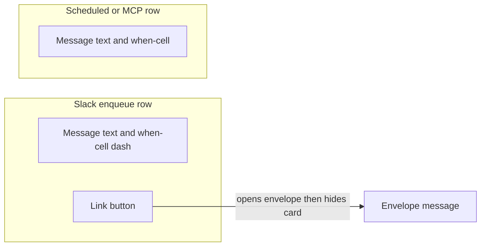
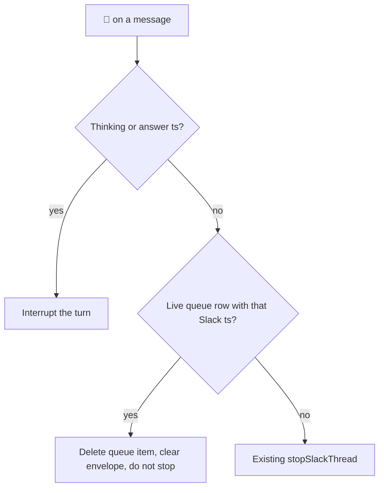

# Slack $queue jump index - Plan

## Goal Capsule

- **Objective:** A person in a Managed Slack Thread can see later work, jump to a Slack `$enqueue` in that thread, and drop that enqueue from later work, without using `$queue` as a reorder cockpit.
- **Means:** Ephemeral `$queue` as a jump index; envelope 🛑 to cancel; delete later-work reorder everywhere (KTD1, KTD2, KTD3).
- **Product authority:** Product Contract below. `CONCEPTS.md` for Managed Slack Thread, Slack Steer, Enqueued Slack Message, and Thread Queue.
- **Product Contract preservation:** changed R6 — hide-on-🛑 dropped (Slack cannot delete an ephemeral without a click `response_url`); changed R9 — identifier is the live tool `rocketclaw_reset_scheduled_messages`; R5 — Hide remains as dismiss-without-jump.
- **Open blockers:** None.
- **Stop conditions:** AE1–AE6 have tests. `gofmt` on touched files. `go test` on touched packages. `make lint` and `make test` pass. Do not raise `GO_SOURCE_CLOC_BUDGET`. Stop if mid-turn Slack Steer would be removed. Stop if `$queue` would leave the thread as a modal, split view, or App Home.

---

## Product Contract

### Summary

`$queue` becomes a simple ephemeral index of later work.
A Slack `$enqueue` row jumps to that envelope message and then hides the card.
Envelope 🛑 cancels that enqueue.
There is no reorder.

### Problem Frame

The current `$queue` card is a ticket-row cockpit with overflow Up / Down / Remove / Steer.
The thread keeps moving, so the ephemeral card scrolls away while someone is trying to manage later work.
Reorder in that card is the wrong job: people need to find the enqueued message and drop it, not park rows.

<!-- ce-section: work-relationships -->
### How This Work Fits Together

This plan owns the `$queue` surface as a jump index, envelope-🛑 cancel, and removal of later-work reorder.
Steer-versus-`$enqueue` in the thread stays as already shipped.

- Slack queue inspector (`docs/plans/2026-08-26-1109-feat-slack-queue-inspector-plan.md`): This plan supersedes its ticket-row cockpit, Up / Down parking, and card Remove / Steer / Cancel / Reset all. Mixed later-work order and the idle picker stay.
- RocketClaw one door (`docs/plans/2026-08-27-0905-refactor-rocketclaw-one-door-plan.md`): Shares Thread Queue and steer-versus-enqueue. Replaces that plan's stop condition that `$queue` ticket-row UX must not change.
- Stay-put dialog / modal / split view: Deferred. Can proceed independently of this plan.

### Key Decisions

- **Index, not cockpit.** Governs R5, R10.
  (session-settled: user-directed — chosen over keeping Up / Down / Steer / Remove on the card: `$queue` should jump, not reorder)
- **Link button jumps, then hides.** Governs R2, R3.
  (session-settled: user-directed — chosen over modal, split view, and restyled ticket rows: the button is jump-to-message)
- **🛑 splits by target.** Governs R6, R7.
  (session-settled: user-directed — chosen over 🛑 always meaning `$stop`: envelope 🛑 must not stop the turn)
- **No Slack cancel for scheduled or MCP.** Governs R4, R8.
  (session-settled: user-directed — chosen over 🛑 on those `$queue` rows: they have no envelope)
- **Reset-all scheduled stays as the tool.** Governs R9.
  (session-settled: user-directed — chosen over deleting `rocketclaw_reset_scheduled_messages`: Slack `$queue` Reset all goes; the tool remains)
- **Cull reorder in the engine, not only Slack.** Governs R10.
  (session-settled: user-directed — chosen over hiding Up / Down in Slack while leaving move/steer-from-queue alive)
- **Envelope 🛑 does not hide `$queue`.** Governs R6.
  (session-settled: user-directed — chosen over making `$queue` a durable in-thread message: a reaction has no click URL, and Slack will not `chat.delete` an ephemeral)

### Actors

- A1. Human allowed to talk to the bot in a Managed Slack Thread.
- A2. An Enqueued Slack Message with an envelope in that thread.
- A3. A scheduled message or External MCP stash on that conversation's Thread Queue.

### Requirements

**Surface**

- R1. `$queue` posts one ephemeral in-thread Slack Blocks list of later work and does not start a turn or create placeholders.
- R2. A Slack `$enqueue` row shows the message, a when-cell `—`, and a link button whose URL is that envelope message.
- R3. Clicking that jump button hides the `$queue` card and does not change later work.
- R4. A scheduled row shows the message and its due time, with no jump button. An External MCP row shows the message and a when-cell `—`, with no jump button.
- R5. The `$queue` card has no Up, Down, Remove, Steer, Cancel, or Reset all controls. Hide remains as dismiss-without-jump.

**Cancel**

- R6. Adding 🛑 to a queued envelope message removes that Enqueued Slack Message from later work, clears the envelope mark on that message, and does not stop the turn. It does not hide `$queue`.
- R7. Adding 🛑 to thinking or answer still stops the active turn.
- R8. Scheduled messages and External MCP stashes cannot be cancelled from Slack.
- R9. `rocketclaw_reset_scheduled_messages` remains the reset path for that conversation's scheduled messages.

**Reorder**

- R10. Later-work reorder is gone everywhere: no Up / Down, no parking a queued row from Slack, and no move or steer-from-queue capability left in the engine. Mid-turn Slack Steer (a human reply during an active turn) stays.

**Empty and reopen**

- R11. An empty list still shows `None` with when-cell `—`.
- R12. Opening `$queue` dismisses the previous card.

### Key Flows

- F1. **Open `$queue`.**
  **Trigger:** Human sends `$queue` in a Managed Slack Thread.
  **Covers R1, R4, R5, R12.**
  Previous card is dismissed.
  One ephemeral list of mixed later work appears, with no cockpit controls.
  Hide still closes it.

- F2. **Jump to a Slack enqueue.**
  **Trigger:** Human clicks the link button on a Slack `$enqueue` row.
  **Covers R2, R3.**
  Slack opens that envelope message.
  The `$queue` card hides.
  The enqueue stays on the Thread Queue.

- F3. **Cancel a Slack enqueue.**
  **Trigger:** Human adds 🛑 to the envelope message.
  **Covers R6.**
  That item leaves later work.
  The envelope mark on that message is gone.
  The `$queue` card is unchanged.
  The active turn is not stopped.

- F4. **Stop the turn.**
  **Trigger:** Human adds 🛑 to thinking or answer.
  **Covers R7.**
  The active turn stops.
  Thread Queue is unchanged.

### Visualizations

### Acceptance Examples

- AE1. **Jump hides, does not dequeue.**
  **Covers R2, R3.**
  Thread has one Slack `$enqueue`.
  Human opens `$queue` and clicks jump.
  Slack shows that envelope.
  The ephemeral card is gone.
  `$queue` again still lists that enqueue.

- AE2. **Envelope 🛑 drops the item only.**
  **Covers R6.**
  A turn is active and one Slack `$enqueue` has an envelope.
  Human adds 🛑 to the envelope.
  That enqueue is gone from later work.
  The envelope mark on that message is gone.
  The `$queue` card is unchanged.
  The turn is still active.

- AE3. **Thinking 🛑 still stops.**
  **Covers R7.**
  Human adds 🛑 to the thinking card.
  The turn stops.
  Queued items remain.

- AE4. **MCP and scheduled do not jump or cancel in Slack.**
  **Covers R4, R8.**
  `$queue` shows an MCP stash and a scheduled row.
  Neither row has a jump button or 🛑 control.
  Slack has no way to cancel those items.

- AE5. **No cockpit controls.**
  **Covers R5, R10.**
  `$queue` shows mixed later work.
  There is no Up, Down, Remove, Steer, Cancel, or Reset all.
  Hide remains.
  Later work cannot be reordered in the engine: no move and no steer-from-queue.

- AE6. **Empty list.**
  **Covers R11.**
  No later work.
  `$queue` shows `None` and `—`.

### Scope Boundaries

- Mid-turn Slack Steer and `$enqueue` stay.
- Mixed later-work order and the idle picker stay, except Slack can no longer change queued positions.
- Modal, split view, App Home, plan/task cards, and actions-only restyles are out.
- Stay-put dialog is deferred.
- No new agent or External MCP tools for list, jump, cancel-enqueue, move, or steer-from-queue.

### Dependencies / Assumptions

- Slack link buttons with a `url` still send an interaction, so hide-on-jump can run after the click.
- Slack permalinks to an envelope message scroll to that message in the client.
- External MCP stashes may have no Slack message ts.
- Existing parked queue positions, if any, are left until consumed; nothing in this work offers a new way to park.
- Envelope 🛑 follows the existing reaction path, including skipping D-channel IDs. `$queue` already does not run in DMs.

### Sources / Research

- Slack button `url` still delivers an interaction payload: https://docs.slack.dev/reference/block-kit/block-elements/button-element
- Ephemeral hide is `response_url` + `delete_original`, not `chat.delete`: https://docs.slack.dev/messaging/modifying-messages
- Thread Queue and Slack Steer vocabulary: `CONCEPTS.md`
- Prior `$queue` cockpit (superseded for this surface): `docs/plans/2026-08-26-1109-feat-slack-queue-inspector-plan.md`
- Hail parent redelivery must not become a queue row: `docs/solutions/logic-errors/slack-thread-parent-message-redelivery-enqueued-second-turn.md`

---

## Planning Contract

### Key Technical Decisions

- KTD1. **Jump is an archives permalink plus Hide's delete path.**
  Build `/archives/{channel}/p{ts}` with `thread_ts` the same way Slack unfurl already understands.
  Do not call `GetPermalinkContext` per row.
  Button has `action_id` and `url`, label `Jump`, no `agent_prompt`.
  Jump hide uses `delete_original` on the click `response_url`, same as Hide.
  Jump only when Slack channel and ts are both set.
  Governs R2, R3.
- KTD2. **Envelope 🛑 matches a live queue row after thinking/answer and before `$stop`.**
  Thinking or answer 🛑 still interrupts.
  Else a live Thread Queue item whose Slack channel and ts match is deleted and the envelope reaction is removed.
  A miss keeps today's `stopSlackThread`.
  Governs R6, R7.
- KTD3. **Delete move and steer-from-queue; keep mixed order and the picker.**
  Remove `MoveQueuedIDs`, `MoveThreadQueueItem`, `SteerThreadQueueItem`, `ReorderThreadQueue`, and Slack Cancel / Reset-all actions.
  Keep `MixedLaterWork`, `PickLaterWork`, `ParkAfter`, `DeleteThreadQueueItem`, `StashThreadQueueItem`, and `rocketclaw_reset_scheduled_messages`.
  Governs R10, R9.
- KTD4. **Hide stays on the card.**
  (session-settled: user-approved — chosen over dropping Hide: empty, scheduled, and MCP cards have no Jump)
  Governs R5.

### High-Level Technical Design

### Assumptions

- Reopen `$queue` still calls the existing stored-ts delete used today. Slack may not actually remove an ephemeral that way. Hide and Jump are the reliable dismissals.
- No new later-work tools. External MCP stays `session_prompt` only.

### Implementation Constraints

- Unix-like only. Do not raise `GO_SOURCE_CLOC_BUDGET` (Makefile cap 20350).
- Do not add defensive nil guards. Injected behavior stays real or inert.
- Do not add a one-line wrapper around the envelope 🛑 branch.
- Do not touch `handleMidTurnPlainSend` swallow of hail parent redelivery (`ts == thread_ts`).

### Sequencing

U1 then U2 then U3.
U2 does not call U1 APIs, but U3 deletes the Slack cockpit that U1 must already have replaced.

---

## Implementation Units

### U1. Slack `$queue` jump index card

**Goal:** `$queue` is an ephemeral jump index with Hide, not a cockpit.
**Requirements:** R1, R2, R3, R4, R5, R11, R12. AE1, AE4, AE5, AE6. KTD1, KTD4.
**Dependencies:** None.
**Files:**
- `internal/rocketclaw/slackconnector/connector.go`
- `internal/rocketclaw/slackconnector/connector_test.go`
- `cmd/rocketclaw/CHEATSHEET.md`
**Approach:**
1. Rebuild the mixed later-work card: Slack `$enqueue` rows get when-cell `—` and a Jump link button; scheduled rows get due time and no jump; MCP rows get `—` and no jump.
2. Drop Up, Down, Remove, Steer, Cancel, and Reset all from the card and from interactive handling.
3. Keep Hide. Treat Jump clicks like Hide (`delete_original`).
4. Keep reopen delete of the previous card. Empty list stays `None` / `—`.
5. Update CHEATSHEET `$queue` copy to jump index + Hide; no reorder.
**Patterns to follow:** `slackQueueCard`, `handleQueueCommand`, `handleQueueInteractive` Hide path, `MixedLaterWork`.
**Test scenarios:**
- Covers AE6. `$queue` with no later work posts `None` and `—` and does not start a turn.
- Covers AE1. A Slack `$enqueue` row has a Jump URL for that envelope; clicking Jump hides the card and leaves the item queued.
- Covers AE4. An MCP stash and a scheduled row list with when-cells and no Jump.
- Covers AE5. Mixed later work has no Up, Down, Remove, Steer, Cancel, or Reset all. Hide remains.
- Reopen `$queue` still attempts dismiss of the previous card.
- Jump is omitted when Slack ts is empty.
**Verification:** Queue tests in `connector_test.go` match AE1, AE4–AE6. CHEATSHEET no longer describes ticket-row controls.

### U2. Envelope 🛑 cancel without `$stop`

**Goal:** 🛑 on a live queued envelope drops that enqueue and does not stop the turn.
**Requirements:** R6, R7, R8. AE2, AE3. KTD2.
**Dependencies:** U1.
**Files:**
- `internal/rocketclaw/slackconnector/connector.go`
- `internal/rocketclaw/slackconnector/connector_test.go`
**Approach:**
1. In the existing 🛑 reaction handler, after thinking/answer interrupt and before `stopSlackThread`, match a live Thread Queue item on Slack channel + ts.
2. On match: delete that queue item, remove the envelope mark, return. Do not hide `$queue`. Do not interrupt.
3. Miss keeps today's stop. Scheduled and MCP cannot match.
**Patterns to follow:** `handleReactionAddedEvent` thinking/answer match; `DeleteThreadQueueItem`; envelope reaction add/remove used by enqueue today.
**Test scenarios:**
- Covers AE2. Active turn plus one enveloped `$enqueue`: envelope 🛑 removes the item and envelope mark, turn still active, `$queue` card not required to hide.
- Covers AE3. 🛑 on thinking still stops; queued items remain.
- 🛑 on a former envelope that is no longer a live queue row still stops the turn.
- MCP empty Slack ts cannot be cancelled by 🛑.
**Verification:** New envelope-reaction test sits next to existing thinking/answer 🛑 tests. Those existing stop tests still pass.

### U3. Cull later-work reorder

**Goal:** Move and steer-from-queue are gone from the engine. Mixed order and the idle picker stay.
**Requirements:** R9, R10. AE5. KTD3.
**Dependencies:** U1, U2.
**Files:**
- `internal/rocketclaw/harnessbridge/later_work.go`
- `internal/rocketclaw/harnessbridge/later_work_test.go`
- `internal/rocketclaw/harnessbridge/bridge.go`
- `internal/rocketclaw/app/thread_bridges.go`
- `internal/rocketclaw/app/thread_bridges_test.go`
- matching `PrimaryTextRouter` / inert / stub sites that currently expose Move, Steer, Reorder, Slack Reset-all
**Approach:**
1. Delete move, steer-from-queue, and reorder APIs and their tests.
2. Drop Slack Cancel / Reset-all router methods if nothing else calls them. Keep store reset for the tool.
3. Keep `ParkAfter` and mixed-order picking. Keep `rocketclaw_reset_scheduled_messages`.
4. Do not add a replacement agent primitive for move or steer-from-queue.
**Patterns to follow:** `MixedLaterWork`, `PickLaterWork`, `resetScheduledMessagesTool`.
**Test scenarios:**
- Covers AE5. No production or test helper can move queued IDs or steer a queue row into the turn from the queue API.
- `PickLaterWork` still returns mixed later-work order including a parked queued row behind a not-yet-due scheduled row.
- `rocketclaw_reset_scheduled_messages` still clears that conversation's scheduled messages.
- Custom tool list still has no queue move, steer, or delete.
**Verification:** Move/steer/reorder tests are gone or rewritten as absence. Picker and reset-tool tests still pass. First-party CLOC does not require raising the Makefile cap.

---

## Verification Contract

- `gofmt` on touched files.
- `go test` on `internal/rocketclaw/slackconnector`, `internal/rocketclaw/harnessbridge`, and `internal/rocketclaw/app`.
- `make lint` (0 issues) and `make test` from `internal/rocketclaw`.
- Do not edit `SOURCE_CLOC_BUDGET` / `GO_SOURCE_CLOC_BUDGET`.
- Keep `TestHandleMessageEventIgnoresThreadParentRedelivery`.

---

## Definition of Done

- AE1–AE6 are covered by tests named in U1–U3.
- `$queue` card keeps Hide. Slack `$enqueue` rows also have Jump. Scheduled/MCP rows have no jump and no Slack cancel.
- Envelope 🛑 drops a live enqueue without `$stop`. Thinking/answer 🛑 still `$stop`.
- No move or steer-from-queue remains in the engine.
- `rocketclaw_reset_scheduled_messages` still exists. Slack Reset all does not.
- CHEATSHEET and `CONCEPTS.md` Thread Queue match this contract.
- Abandoned-attempt code is not left in the diff.
- README impact considered; no README update unless `$queue` is documented there.

---

## System-Wide Impact

Slack can no longer Remove or Steer an MCP stash, so a waiting `session_prompt` is no longer failed from `$queue`.
It still completes on pop and still errors on disconnect or restart.
That is a one-door waiter copy update, not a new MCP tool.

---

## Risks

- If a client opens the Jump URL and never sends `block_actions`, the card stays. Reopen and Hide remain.
- `handleReactionAddedEvent` still skips D-channel IDs. Envelope 🛑 in DMs will not run; `$queue` already does not run there.
