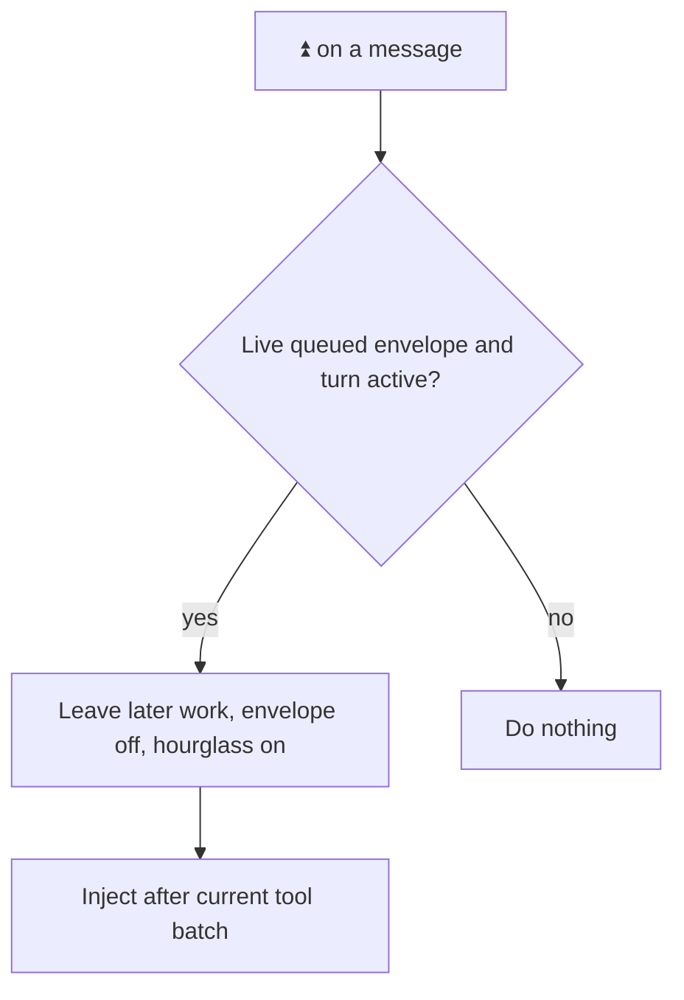
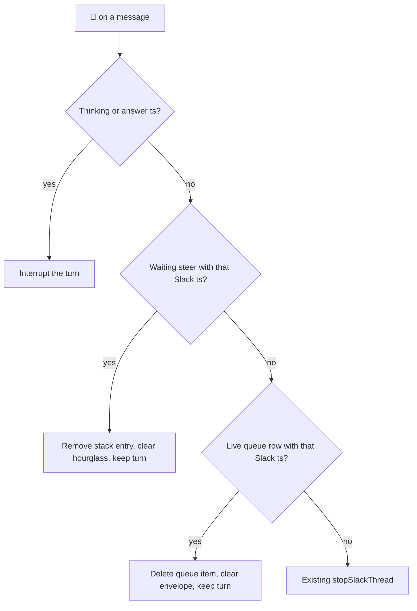

# Slack enqueue ⏫ to steer - Plan

## Goal Capsule

- **Objective:** A person in a Managed Slack Thread can pull a waiting `$enqueue` into the current turn, see pending Slack Steers, jump to them, and drop a steer that has not injected yet, without turning `$queue` back into a cockpit.
- **Means:** ⏫ on a live queued envelope converts it to a Slack Steer; `$queue` lists pending steers at the top with jump; 🛑 on a waiting hourglass message cancels that steer (KTD1, KTD2, KTD3).
- **Product authority:** Product Contract below. `CONCEPTS.md` for Managed Slack Thread, Slack Steer, Enqueued Slack Message, and Thread Queue.
- **Product Contract preservation:** unchanged.
- **Open blockers:** None.
- **Stop conditions:** AE1–AE6 have tests. `gofmt` on touched files. `go test` on touched packages. `make lint` and `make test` pass. Do not raise `GO_SOURCE_CLOC_BUDGET`. Stop if `$queue` would regain Up / Down / Remove / Steer. Stop if ⏫ would `$stop`. Stop if mid-turn unmarked Slack Steer would be removed.

---

## Product Contract

### Summary

During a turn, ⏫ on a queued envelope injects that `$enqueue` as a Slack Steer.
`$queue` lists pending steers at the top, then later work.
Jump opens the steer message.
🛑 on a waiting hourglass message drops that steer.

### Problem Frame

`$queue` is a jump index.
Steer was removed from the card, so there is no way to pull a waiting `$enqueue` into the current turn or to see and cancel a pending steer.

<!-- ce-section: work-relationships -->
### How This Work Fits Together

This plan owns ⏫ convert-to-steer, pending steers on `$queue`, and 🛑-cancel of a waiting steer.
Jump-index later work, envelope 🛑 cancel-enqueue, and mid-turn unmarked Slack Steer stay as shipped.

- Slack `$queue` jump index (`docs/plans/2026-08-28-1257-feat-slack-queue-jump-index-plan.md`): This plan extends `$queue` with pending-steer rows at the top. It does not restore Up / Down / Remove / Steer on the card.
- Slack steer-or-enqueue (`docs/plans/2026-08-24-1324-feat-slack-steer-or-enqueue-plan.md`): Unmarked mid-turn reply stays a Slack Steer. This plan adds convert-from-`$enqueue` via ⏫.

### Key Decisions

- **⏫ on a live envelope during a turn converts to a Slack Steer.** Governs R1, R2, R3.
  (session-settled: user-directed — chosen over restoring Steer on `$queue`: inject from the envelope message)
- **`$queue` lists pending steers at the top with jump.** Governs R4, R5.
  (session-settled: user-directed — chosen over later-work-only `$queue`)
- **🛑 on a waiting hourglass message drops that steer.** Governs R7.
  (session-settled: user-directed — chosen over 🛑 always meaning `$stop`)
- **Index, not cockpit.** Governs R6.
  (session-settled: user-directed — chosen over Up / Down / Steer / Remove on the card)
- **Envelope 🛑 still cancels enqueue only.** Governs R8, R9.
  (session-settled: user-directed — chosen over 🛑 always meaning `$stop`)
- **No quiet-bot ⏫ story.** Governs R3.
  (session-settled: user-directed — chosen over designing leftover-envelope-while-idle behavior)

### Actors

- A1. Human allowed to talk to the bot in a Managed Slack Thread.
- A2. A live Enqueued Slack Message with an envelope in that thread.
- A3. A pending Slack Steer with hourglass, not yet injected.

### Requirements

**Convert**

- R1. Adding ⏫ to a live queued envelope during an active turn removes that Enqueued Slack Message from later work and makes it a Slack Steer.
- R2. That convert clears the envelope mark, adds hourglass, injects after the current tool batch, does not stop the turn, and does not hide `$queue`.
- R3. ⏫ does nothing when there is no active turn, or when the message is not a live queued envelope.

**`$queue`**

- R4. `$queue` posts one ephemeral in-thread list: pending Slack Steers at the top, then later work, and does not start a turn.
- R5. A pending-steer row shows the text, a when-cell `—`, and a Jump link to that hourglass message. Clicking Jump hides the card and does not inject or drop the steer.
- R6. The `$queue` card has no Up, Down, Remove, Steer, Cancel, or Reset all. Hide remains.

**Cancel**

- R7. Adding 🛑 to a waiting hourglass message drops that Slack Steer, clears the hourglass, does not stop the turn, and does not hide `$queue`.
- R8. Adding 🛑 to thinking or answer still stops the active turn.
- R9. Adding 🛑 to a queued envelope still removes that Enqueued Slack Message, clears the envelope, and does not stop the turn.

**Keep**

- R10. Scheduled messages and External MCP stashes cannot be converted with ⏫ and cannot be cancelled from Slack.

### Key Flows

- F1. **Convert enqueue to steer.**
  **Trigger:** During an active turn, A1 adds ⏫ to A2.
  **Covers R1, R2.**
  The item leaves later work.
  Envelope is gone; hourglass is on.
  After the current tool batch, the text injects as a Slack Steer.
  The turn continues.

- F2. **Open `$queue`.**
  **Trigger:** A1 sends `$queue`.
  **Covers R4, R5, R6.**
  Pending steers list first, then later work.
  Hide still closes it.

- F3. **Jump to a pending steer.**
  **Trigger:** A1 clicks Jump on a steer row.
  **Covers R5.**
  Slack opens that hourglass message.
  The card hides.
  The steer stays pending.

- F4. **Cancel a pending steer.**
  **Trigger:** A1 adds 🛑 to A3 before injection.
  **Covers R7.**
  That steer is gone.
  Hourglass is gone.
  The turn continues.

### Visualizations

### Acceptance Examples

- AE1. **⏫ converts during a turn.**
  **Covers R1, R2.**
  A turn is active and one Slack `$enqueue` has an envelope.
  A1 adds ⏫ to that envelope.
  The item is gone from later work.
  Envelope is gone; hourglass is on.
  After the current tools finish, that text is in the turn.
  The turn is still active.

- AE2. **⏫ ignored when not a live envelope or no turn.**
  **Covers R3.**
  A1 adds ⏫ to thinking, or to an envelope when no turn is active.
  Queue and turn are unchanged.

- AE3. **`$queue` shows steers first.**
  **Covers R4, R5, R6.**
  One pending steer and one Slack `$enqueue`.
  `$queue` lists the steer above the enqueue.
  Steer row has Jump and no cockpit controls.
  Hide remains.

- AE4. **Jump to steer hides, does not inject.**
  **Covers R5.**
  A1 opens `$queue` and clicks Jump on a steer row.
  Slack shows that hourglass message.
  The card is gone.
  `$queue` again still lists that steer.

- AE5. **🛑 on waiting hourglass drops the steer only.**
  **Covers R7.**
  A turn is active and one steer has hourglass.
  A1 adds 🛑 to that message before injection.
  That steer is gone.
  Hourglass is gone.
  The turn is still active.

- AE6. **🛑 splits by target.**
  **Covers R8, R9.**
  🛑 on thinking stops the turn; queued items remain.
  🛑 on a queued envelope drops that enqueue; the turn continues.

### Scope Boundaries

- Mid-turn unmarked Slack Steer and `$enqueue` stay.
- Jump-index later work, Hide, and envelope 🛑 stay.
- No Up / Down / Remove / Steer on the `$queue` card.
- Scheduled and External MCP rows stay non-convertible and non-cancellable from Slack.
- Modal, split view, and App Home are out.

### Dependencies / Assumptions

- Slack ⏫ is `:fast_up_button:` / `:black_up_pointing_double_triangle:`.
- Pending steers already carry Slack channel and ts for jump.
- If ⏫ or 🛑 hits a message after that steer already injected, it is not a waiting steer.

### Sources / Research

- Thread Queue and Slack Steer: `CONCEPTS.md`
- Jump index (superseded for steer-on-card only): `docs/plans/2026-08-28-1257-feat-slack-queue-jump-index-plan.md`
- Grounding: `.tmp/ce-brainstorm/enqueue-steer-up/grounding.md`
- Stack vs later-work: `docs/solutions/logic-errors/slack-root-app-mention-redelivery-cleared-buffered-follow-ups.md`
- Parent hail redelivery: `docs/solutions/logic-errors/slack-thread-parent-message-redelivery-enqueued-second-turn.md`

---

## Planning Contract

### Key Technical Decisions

- KTD1. **Convert is delete-from-queue plus the existing steer buffer.**
  ⏫ reactions are `fast_up_button` and `black_up_pointing_double_triangle`.
  On a live Thread Queue row with Slack channel + ts, if that thread's steer stack is active: delete the queue item, then `bufferSlackStack` on that envelope message (hourglass).
  No match, or stack not active: return. Never `$stop` on ⏫.
  Do not restore `SteerThreadQueueItem`.
  Governs R1, R2, R3.
- KTD2. **🛑 checks thinking/answer, then waiting steer, then queued envelope, then `$stop`.**
  Thinking or answer still interrupts.
  Else a live stack entry whose Slack ts matches is removed; persist the remaining stack; keep the stack key even if empty; clear hourglass; return.
  Else a live queued envelope still deletes that enqueue.
  A miss keeps `stopSlackThread`.
  Governs R7, R8, R9.
- KTD3. **`$queue` reads the live steer stack, then mixed later work.**
  Steer rows first: text, `—`, Jump permalink (same archives shape as enqueue Jump), kind hourglass.
  Jump and Hide stay `delete_original`.
  Governs R4, R5, R6.
- KTD4. **Injection timing is existing DrainSteers.**
  After convert, the item waits on the stack like any other Slack Steer.
  Do not add a second inject path.
  Governs R2.

### High-Level Technical Design

### Assumptions

- Slack reaction names for ⏫ are `fast_up_button` and `black_up_pointing_double_triangle`.
- Convert of an External MCP row cannot match (empty Slack ts).

### Implementation Constraints

- Unix-like only. Do not raise `GO_SOURCE_CLOC_BUDGET`.
- Do not add defensive nil guards. Injected behavior stays real or inert.
- Do not add a one-line wrapper around the ⏫ or 🛑-steer branches.
- Do not touch `handleMidTurnPlainSend` swallow of hail parent redelivery (`ts == thread_ts`).
- Do not delete the steer stack key when dropping the last waiting steer.

### Sequencing

U1 then U2 then U3.
U2 can follow U1; U3 extends the 🛑 handler after U1's ⏫ branch exists.

---

## Implementation Units

### U1. ⏫ converts queued envelope to Slack Steer

**Goal:** During a turn, ⏫ on a live queued envelope injects that text as a Slack Steer.
**Requirements:** R1, R2, R3, R10. AE1, AE2. KTD1, KTD4.
**Dependencies:** None.
**Files:**
- `internal/rocketclaw/slackconnector/connector.go`
- `internal/rocketclaw/slackconnector/connector_test.go`
**Approach:**
1. Handle ⏫ reactions in the existing reaction path, separate from 🛑.
2. Match a live queue row on Slack channel + ts. If the thread stack is active: delete the queue item, buffer that message as a steer, return.
3. Otherwise return. Do not `$stop`. Do not hide `$queue`.
**Patterns to follow:** `handleReactionAddedEvent` envelope 🛑 match; `DeleteThreadQueueItem`; `bufferSlackStack`; `stashEnqueuedMessage`.
**Test scenarios:**
- Covers AE1. Active turn, one enveloped `$enqueue`: ⏫ removes the item, envelope gone, hourglass on, turn still active.
- Covers AE2. ⏫ on thinking does not stop and does not convert. ⏫ with no active stack leaves the queue item.
- MCP empty Slack ts is not converted.
**Verification:** New ⏫ tests sit next to envelope-🛑 tests. Existing 🛑 tests still pass.

### U2. `$queue` lists pending steers at the top

**Goal:** `$queue` shows waiting steers first, with Jump, then later work.
**Requirements:** R4, R5, R6. AE3, AE4. KTD3.
**Dependencies:** U1.
**Files:**
- `internal/rocketclaw/slackconnector/connector.go`
- `internal/rocketclaw/slackconnector/connector_test.go`
- `cmd/rocketclaw/CHEATSHEET.md`
**Approach:**
1. When building the card, take pending stack messages for that thread and render them above `MixedLaterWork`.
2. Steer row: when-cell `—`, Jump when channel and ts are set, no cockpit controls.
3. Jump clicks stay Hide's `delete_original` path.
4. Update CHEATSHEET: ⏫ convert; `$queue` lists pending steers; 🛑 on hourglass cancels a waiting steer.
**Patterns to follow:** `slackQueueCard`, enqueue Jump permalink, Hide.
**Test scenarios:**
- Covers AE3. One pending steer and one `$enqueue`: steer listed first, Jump present, no overflow / Up / Down / Remove / Steer.
- Covers AE4. Jump on a steer row hides the card and leaves the steer pending.
- Empty later work still `None` / `—`. Hide remains.
**Verification:** Queue tests assert steer-first order and Jump. CHEATSHEET names ⏫ and pending steers.

### U3. 🛑 on waiting hourglass drops that steer

**Goal:** 🛑 on a pending steer cancels injection and does not `$stop`.
**Requirements:** R7, R8, R9. AE5, AE6. KTD2.
**Dependencies:** U1.
**Files:**
- `internal/rocketclaw/slackconnector/connector.go`
- `internal/rocketclaw/slackconnector/connector_test.go`
**Approach:**
1. In the 🛑 handler, after thinking/answer interrupt and before envelope-enqueue delete, match a live stack entry on Slack ts.
2. On match: remove that entry, persist remaining steers, keep the stack key, clear hourglass, return.
3. Envelope 🛑 and thinking/answer 🛑 stay as shipped.
**Patterns to follow:** `handleReactionAddedEvent` envelope match; `persistPendingSteers`; hourglass add/remove used by `bufferSlackStack` / `DrainSteers`.
**Test scenarios:**
- Covers AE5. Active turn plus one hourglass steer: 🛑 removes the steer and hourglass, turn still active, stack key still active.
- Covers AE6. Thinking 🛑 still stops. Envelope 🛑 still drops the enqueue only.
- 🛑 on a former steer that is no longer on the stack still stops the turn.
**Verification:** New steer-cancel test sits next to envelope-🛑 tests. Those existing stop tests still pass.

---

## Verification Contract

- `gofmt` on touched files.
- `go test` on `internal/rocketclaw/slackconnector`.
- `make lint` (0 issues) and `make test` from `internal/rocketclaw`.
- Do not edit `SOURCE_CLOC_BUDGET` / `GO_SOURCE_CLOC_BUDGET`.
- Keep `TestHandleMessageEventIgnoresThreadParentRedelivery`.

---

## Definition of Done

- AE1–AE6 are covered by tests named in U1–U3.
- ⏫ on a live envelope during a turn converts to a Slack Steer. Miss and no-turn ⏫ are ignored.
- `$queue` lists pending steers above later work. Jump hides. Hide remains. No cockpit controls.
- 🛑 on a waiting hourglass drops that steer without `$stop`. Thinking/answer 🛑 still `$stop`. Envelope 🛑 still drops the enqueue only.
- CHEATSHEET and `CONCEPTS.md` match this contract.
- Abandoned-attempt code is not left in the diff.
- README impact considered; no README update unless `$queue` is documented there.

---

## System-Wide Impact

Deleting a queue row on ⏫ uses `DeleteThreadQueueItem`, which still errors a waiting External MCP `session_prompt` with "queue row removed".
Slack `$enqueue` convert is the in-scope path; MCP rows have no envelope and cannot match.

---

## Risks

- If Slack names ⏫ something other than `fast_up_button` / `black_up_pointing_double_triangle`, ⏫ will no-op until the alias is added.
- ⏫ during final-answer uses existing DrainSteers; it does not invent a late inject.
