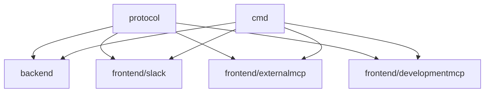
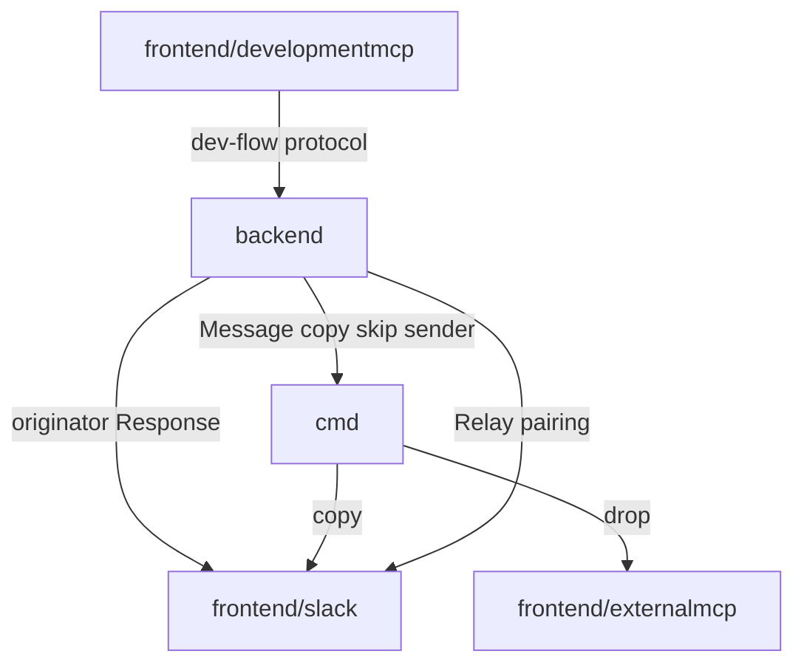
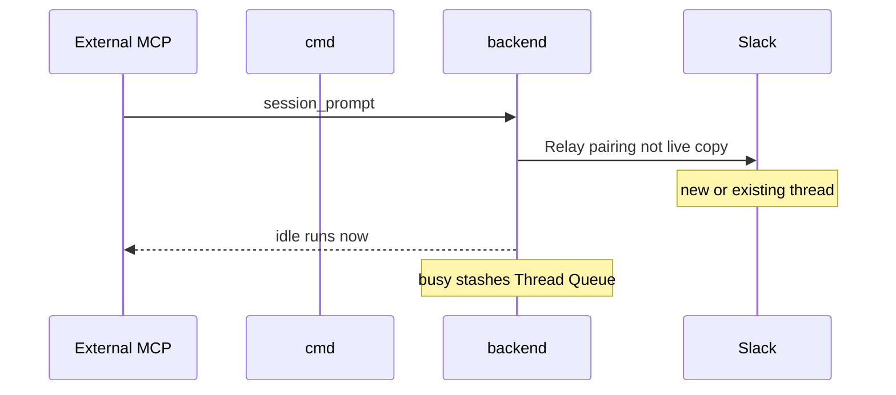

# Backend Frontend Protocol - Plan

## Goal Capsule

- **Objective:** A maintainer sees one backend and three frontends that share one protocol. Slack, External MCP, and Development MCP never import the backend. Live output still reaches the same surfaces it does today.
- **Means:** Invert imports, then merge, then rename (KTD1). Live traffic stays three paths: originator, skip-sender copy, and pairing (KTD2).
- **Authority:** This Product Contract. Later-work and `$queue` behavior stay as `docs/plans/2026-08-27-0905-refactor-rocketclaw-one-door-plan.md`. CONCEPTS.md for Managed Slack Thread, Thread Queue, Development MCP, Request-Carried Context, Overlay Clone, Reload, and Restart.
- **Stop conditions:** Stop if later-work or `$queue` behavior would change. Stop if a Development MCP turn would open a Slack thread or External MCP session.
- **Product Contract preservation:** unchanged
- **Execution profile:** Characterize originator vs copy vs pairing before moving the copy loop.

---

## Product Contract

### Summary

RocketClaw is one backend, three frontends, and one protocol. Frontends never import backend. `cmd` constructs both sides and copies live output. Each frontend handles the protocol messages it understands and drops the rest.

### Problem Frame

Clockwork and harnessbridge read as two backends. One-door kept them apart so Slack could import the engine. The assembler still imported Slack, so the backend appeared to depend on a frontend. Development MCP is a third surface with overlay, lint, and try-turn behavior that is not Slack conversation.

### Key Decisions

- **One backend package.** (session-settled: user-directed — chosen over keeping app and the engine as two backend-ish packages: a cold reader should see one engine.) Governs R1, R2.
- **Frontends never import backend. Backend never imports a frontend.** (session-settled: user-directed — chosen over frontends importing the engine API: `cmd` constructs both.) Governs R3, R4.
- **Protocol is the only shared language. Every frontend speaks it and drops messages it does not handle.** (session-settled: user-directed — chosen over a Development-MCP-only side API and over folding types into backend: unused messages are dropped, not a second language.) Governs R5, R6, R7, R8.
- **`cmd` copies live output. Fan-out does not live in the backend.** (session-settled: user-directed — chosen over injected subscribers inside the backend: clockwork is not a public name and not a backend multiplexer.) Governs R9, R10.
- **Cron, skills, and agent definitions live in the backend.** (session-settled: user-directed — chosen over leaving cron as a sibling package.) Governs R1.
- **Development MCP is `frontend/developmentmcp` this round.** (session-settled: user-directed — chosen over leaving it orthogonal: it is a frontend, including overlay/lint/try-turn/reload messages on protocol.) Governs R8, R11.
- **No 19350 line-cut mandate. Never raise the cap. Lower it if this shrinks.** (session-settled: user-directed — chosen over must-hit-19350: this round is the layout cut.) Governs R12.

### Actors

- A1. Maintainer adding or reading a frontend
- A2. Human in a Managed Slack Thread
- A3. External MCP client on a paired session
- A4. Coding agent on Development MCP
- A5. Process assembler (`cmd`)

### Requirements

**Layout**

- R1. RocketClaw has one backend. It owns conversation execution, later-work, cron, skills, agent definitions, overlay clones, try-turn execution, Reload, and Restart.
- R2. Slack, External MCP, and Development MCP live as `frontend/slack`, `frontend/externalmcp`, and `frontend/developmentmcp`.
- R3. No frontend package imports the backend. The backend does not import any frontend.
- R4. A5 constructs the backend and the frontends and hooks them up.

**Protocol**

- R5. `protocol` is the only shared language between frontends and backend. Frontends and backend import `protocol`. `events` is renamed to `protocol`.
- R6. Protocol is as small as the frontends need to work and hook up, and no smaller than every message kind those frontends handle.
- R7. A frontend that does not handle a protocol message drops it. Dropping is handling. Slack drops development-flow messages. Development MCP drops Thread Queue and `$queue` messages.
- R8. Overlay list/read, request-carried deltas, lint, try-turn, Reload, and Restart are protocol messages. Development MCP handles them. Slack and External MCP drop them.

**Live output**

- R9. A5 copies live output to frontends. The backend does not multiplex live output.
- R10. Who receives live output stays as today: Slack handles it. External MCP drops it. Development MCP is not on that copy. Originator output is not the copy.

**Compatibility**

- R11. Development MCP turns stay on Development MCP. They do not open a Slack thread or an External MCP session.
- R12. First-party RocketClaw source lines never exceed the current cap 20350. If the cut lands lower, the cap is lowered to the landing count.
- R13. Later-work, Slack Steer, Enqueued Slack Message, and `$queue` behavior stay as `docs/plans/2026-08-27-0905-refactor-rocketclaw-one-door-plan.md`.



<!-- ce-section: work-relationships -->
### How This Work Fits Together

This plan owns the backend / frontend / protocol cut. The broader cleanup is current understanding, not a roadmap.

- One-door later-work and `$queue`
  - Shares R13
  - This work does not re-open that behavior
- 19350 line-cut leftover from one-door
  - Can proceed independently of this plan
  - Still to decide
- MCP later-work tools
  - Depends on one-door
  - Can proceed independently of this plan

### Key Flows

- F1. Slack conversation
  - **Trigger:** A2 sends a prompt on a Managed Slack Thread.
  - **Actors:** A2, A5, backend, frontend/slack
  - **Steps:** Slack handles conversation protocol messages. It drops development-flow messages. Originator Response presents on Slack. Skip-sender copy does not re-post to the originator Slack thread.
  - **Outcome:** Same thread behavior as today.
  - **Covers:** R7, R10, R13
- F2. Busy External MCP
  - **Trigger:** A3 sends `session_prompt` while the paired thread has an active turn.
  - **Actors:** A3, A2, backend, frontend/externalmcp
  - **Steps:** Conversation protocol as today. External MCP drops live broadcasts. Development-flow messages are dropped.
  - **Outcome:** The prompt lands on that thread's Thread Queue. `$queue` still works for A2.
  - **Covers:** R7, R10, R13
- F3. Development MCP try
  - **Trigger:** A4 calls lint or run_turn with request-carried context.
  - **Actors:** A4, A5, backend, frontend/developmentmcp
  - **Steps:** Development MCP handles development-flow protocol messages. It drops Thread Queue and `$queue` messages. It is not on the live-output copy.
  - **Outcome:** The try stays on Development MCP. No Slack thread. No External MCP session.
  - **Covers:** R8, R10, R11
- F4. Hookup
  - **Trigger:** The process starts.
  - **Actors:** A5
  - **Steps:** A5 constructs backend and frontends. It copies live output per R9 and R10.
  - **Outcome:** No frontend imports backend. No backend imports a frontend.
  - **Covers:** R3, R4, R9

### Acceptance Examples

- AE1. **Covers R3, R5.** Given the cut, `frontend/slack`, `frontend/externalmcp`, and `frontend/developmentmcp` import `protocol` and do not import the backend. The backend does not import those frontend packages.
- AE2. **Covers R7, R10.** Given live output from a Slack-originated turn, Slack still presents it. External MCP still drops that live broadcast. Development MCP does not receive that copy.
- AE3. **Covers R8, R11.** Given a Development MCP `run_turn`, overlay/lint/try-turn protocol messages are handled there. Slack ignores them. No Slack thread is created. No External MCP session is created.
- AE4. **Covers R13.** Given an active Managed Slack Thread, an unmarked Slack reply stays a Slack Steer. `$enqueue` still stashes. Busy External MCP `session_prompt` still lands on that Thread Queue.
- AE5. **Covers R12.** After the cut, first-party RocketClaw lines are at or below 20350. If they landed lower, the cap equals that landing count.

### Success Criteria

- A1 can name one backend, three frontends, and protocol without a second engine-ish package.
- Import direction in AE1 is true on the same change that claims done.
- A2, A3, and A4 see no conversation-behavior change beyond the layout.

### Scope Boundaries

**Deferred for later**

- The 19350 line-cut leftover from one-door
- External MCP tools to list, reorder, cancel, or steer
- Putting Development MCP conversations on a Managed Slack Thread

**Outside this work**

- Raising the line budget
- Replacing Slack `$queue` ticket-row UX
- Changing idle paired-thread `session_prompt` run-now

### Deferred to Follow-Up Work

- Rewriting the workflow Starlark engine. This plan only splits DTOs so protocol does not import the engine.
- Moving `config` or `skel` package homes.

### Dependencies / Assumptions

- External MCP sessions still pair to a Managed Slack Thread as they do today.
- Pending Slack Steers remain Slack-render state.
- Busy External MCP waiter, silence, and error-on-remove stay as one-door R6.

### Sources / Research

- `docs/plans/2026-08-27-0905-refactor-rocketclaw-one-door-plan.md` — later-work authority; this work reopens its keep-two-packages KTD1.
- `docs/plans/2026-08-07-001-refactor-two-channel-clockwork-plan.md` — live broadcasts skip the sender; External MCP drops them.
- CONCEPTS.md — Managed Slack Thread, Thread Queue, Development MCP, Request-Carried Context.
- `internal/rocketclaw/Makefile` — `GO_SOURCE_CLOC_BUDGET` is 20350.
- `docs/solutions/logic-errors/development-mcp-try-paths-raced-with-live-reload.md` — overlay mutex and try-turn locks stay with backend execution.
- `docs/solutions/logic-errors/slack-thread-parent-message-redelivery-enqueued-second-turn.md` — parent-hail swallow stays in Slack.

---

## Planning Contract

### Key Technical Decisions

- KTD1. **Invert imports, then merge, then rename.** Merge of `app` + `harnessbridge` + `cronjob` is last among behavior units. Merging first cycles. Cite R3, R4.
- KTD2. **Live traffic stays three paths.** Originator Slack response is not the copy. Skip-sender copy of Message/Delivery is the copy. External MCP Relay/RelayCleanup is pairing, not live output. Development MCP is not on the copy. Cite R9, R10. (session-settled: user-directed — chosen over injected subscribers: cmd copies the stream.)
- KTD3. **Conversation operations Slack already calls live on protocol as interfaces and DTOs.** Do not turn later-work into a second request shuttle. Cite R5, R6, R13.
- KTD4. **Workflow DTOs live in protocol. The Starlark engine stays out of protocol.** Protocol must not import backend. Cite R5.
- KTD5. **Overlay mutex and same-id try-turn locks execute in the backend.** The Development MCP frontend only forwards protocol messages. Cite R1, R8, R11.
- KTD6. **Parent-hail swallow stays in Slack.** Do not put `ts == thread_ts` mid-turn swallow on protocol or share it with External MCP. Cite R13.
- KTD7. **`MixedLaterWork` and queue/scheduled row types move to protocol.** Slack still mixes for `$queue` render. Cite R6, R13.
- KTD8. **Rename last.** `events` → `protocol`, surfaces → `frontend/*`, engine packages → `backend`, only after U1–U4 already satisfy R3. Cite R2, R5.

### High-Level Technical Design





### Output Structure

```text
internal/rocketclaw/
  protocol/
  backend/
  frontend/
    slack/
    externalmcp/
    developmentmcp/
  config/
  workflow/
  skel/
cmd/rocketclaw/
```

`config`, `workflow` engine, and `skel` stay. Protocol holds workflow DTOs. `cmd/rocketclaw` is A5.

### Assumptions

- A5 is `cmd/rocketclaw` constructing both sides. It lifts construction and the skip-sender copy. Reload and overlay locks stay in backend execution. Do not lift all of `app.Run`.
- `internal/quickbench` is outside the RocketClaw CLOC cap and must still compile after the rename.
- Disabled External MCP or Development MCP means that frontend is not constructed. Copy targets only constructed frontends.
- Dual copy loops (clockwork in backend and a second copier in cmd) are forbidden. They blow R12.

### Implementation Constraints

- Unix-only.
- Do not raise `GO_SOURCE_CLOC_BUDGET`.
- Injected behavior stays real or inert, never nil-as-disabled.
- `make lint` without `--fix` dirt.
- Coverage floor stays `COVERAGE_STABLE_AT` 90.0.

### Sequencing

U1 then U2 then U3 then U4 then U5. U5 runs only if R3 already holds without the rename.

### Research Summary

Today `app` imports Slack; Slack imports `harnessbridge`. That is the cycle one-door KTD1 named. Slack is an engine client: `PrimaryTextRouter`, `MixedLaterWork`, queue types, goal parse, side ask. `events` imports `workflow`. Broadcasts carry originator responses, skip-sender copies, and MCP relays on one channel. External MCP already imports no engine. Development MCP `turn.go` / `lint.go` still do. Overlay mutex and keyed try-turn locks live beside the Development MCP server in `app` and must move with backend execution.

---

## Implementation Units

### U1. Protocol types without a backend import

- **Goal:** Frontends can compile against shared types and interfaces that do not import the engine.
- **Requirements:** R5, R6, R8
- **Dependencies:** none
- **Files:** `internal/rocketclaw/events/`, `internal/rocketclaw/workflow/`, `internal/rocketclaw/harnessbridge/primary_text_router.go`, `internal/rocketclaw/harnessbridge/later_work.go`, `internal/rocketclaw/events/types.go`, matching `*_test.go`
- **Approach:**
  1. Move workflow card DTOs used on inbound/outbound messages into `events`. Leave the Starlark engine in `workflow` (KTD4). Split inbound workflow invocation into protocol fields (`RunID`, `Name`, `Args`) without compiled `Definition`. Keep compiled definitions inside the workflow engine. Name `RunRequest` as split-not-moved; `AgentUpdate`, `PhaseUpdate`, and `Terminal` move as DTOs.
  2. Move Slack's engine-client types and interfaces into `events`: conversation router, later-work rows, `MixedLaterWork`, pending steers, goal request, side-ask request, activation hook, Slack thread id helpers, one-off cron client types (`OneOffCronjob`, `CronRunResult`, `OnDemandCronTarget`) and a progress DTO with only Thinking and Message callbacks (KTD3, KTD7). Do not put session store on protocol.
  3. Add development-flow protocol messages for overlay list/read, request-carried deltas, lint, try-turn, Reload, Restart (R8).
  4. Do not add a Development MCP live-copy identity. It is not on the copy (R10).
- **Patterns to follow:** `events` as the shared message package. `externalmcp` already depends only on callbacks plus `events`.
- **Test scenarios:**
  - Happy: `events` builds with workflow DTOs and does not import `app` or `harnessbridge`.
  - Happy: `MixedLaterWork` order is unchanged after the move.
  - Edge: workflow engine still renders the same card DTOs.
  - Error: `events` does not import `workflow` engine code.
- **Verification:** `events` and `workflow` tests pass. Slack still compiles against the moved types.

### U2. Frontends import protocol only

- **Goal:** Slack and Development MCP stop importing the engine, cron, overlay, and lint packages.
- **Requirements:** R3, R5, R7, R8, R11, R13
- **Dependencies:** U1
- **Files:** `internal/rocketclaw/slackconnector/connector.go`, `internal/rocketclaw/slackconnector/connector_test.go`, `internal/rocketclaw/developmentmcp/server.go`, `internal/rocketclaw/developmentmcp/turn.go`, `internal/rocketclaw/developmentmcp/lint.go`, matching tests
- **Approach:**
  1. Point Slack construction at protocol types and assembler-injected protocol interfaces. Delete production imports of `harnessbridge` and `cronjob` (KTD3, KTD7).
  2. Keep parent-hail swallow in Slack (KTD6).
  3. Keep `$queue` as renderer of protocol later-work rows. Do not move queue mutation into Slack (R13).
  4. Development MCP HTTP and tool names stay. Overlay/lint/try-turn/reload/restart execution is injected. Delete production imports of `harnessbridge`, `skel`, and `agentlint` from that frontend (KTD5).
  5. External MCP stays callback-only.
- **Execution note:** Add characterization that Slack `$queue`, steer, and busy External MCP stash still match today's tests before deleting the engine imports.
- **Patterns to follow:** `externalmcp` Start + callback. Slack already wraps some hosts behind local interfaces; those interfaces must name protocol types only.
- **Test scenarios:**
  - Happy: Covers AE4. Unmarked Slack reply during a turn is still a Slack Steer. `$enqueue` still stashes.
  - Happy: Covers AE4. Busy External MCP `session_prompt` still appears on the managed Thread Queue.
  - Happy: Covers AE3. Development MCP `run_turn` returns thinking and answer and does not create a Slack thread.
  - Edge: Mid-turn parent hail `ts == thread_ts` is still swallowed, not enqueued.
  - Edge: Overlay list/read/lint/try-turn still take the overlay lock for the whole call.
  - Error: Same-id Development MCP `run_turn` still serializes.
  - Integration: Slack `$queue` Up/Down/Remove/Steer/Hide still match today's ticket-row UX.
- **Verification:** Slack, Development MCP, and External MCP package tests pass. Production frontend files do not import `harnessbridge`, `cronjob`, `skel`, or `agentlint`.

### U3. Assembler copies live output

- **Goal:** `cmd` constructs both sides. The backend does not multiplex. The three paths stay distinct.
- **Requirements:** R3, R4, R9, R10, R11
- **Dependencies:** U2
- **Files:** `cmd/rocketclaw/serve.go`, `internal/rocketclaw/app/app.go`, `internal/rocketclaw/app/clockwork.go`, `internal/rocketclaw/app/clockwork_test.go`, `internal/rocketclaw/app/thread_bridges.go`
- **Approach:**
  1. Stop `app` importing frontend packages. Lift construction into `cmd/rocketclaw` (R4, KTD1). Do not lift overlay/reload mutex or pairing/busy-stash out of backend execution.
  2. Move the skip-sender copy loop with the assembler. Delete it from the backend. Do not leave two loops (KTD2, R12).
  3. Keep originator Response consumption on Slack. Do not copy originator traffic as live output (R10).
  4. Keep Relay/RelayCleanup as Slack pairing, not live copy (KTD2). The assembler skip-sender dispatcher still delivers pairing messages to Slack. Pairing and busy-stash stay in the backend. `cmd` only constructs HTTP for External MCP.
  5. External MCP is not on the copy (drop). Development MCP is not registered on the copy (R10).
  6. Overlay mutex and same-id try-turn locks live in backend execution, not in the frontend or as a mutex pointer into the frontend (KTD5).
- **Execution note:** Keep existing clockwork tests that prove skip-sender, ack, and slow-handler isolation. Point them at the assembler copy loop.
- **Patterns to follow:** Current `clockwork.dispatch` skip-sender and per-bridge queues. `dropBroadcastBridge` for External MCP. `prepareOriginator` for Slack originator output.
- **Test scenarios:**
  - Happy: Covers AE2. Slack-originated turn still presents on Slack once. External MCP drops that live broadcast. Development MCP does not receive it.
  - Happy: First External MCP `session_prompt` still creates or uses the paired Slack thread via Relay.
  - Edge: No-sender cron result still reaches Slack and is dropped by External MCP.
  - Edge: A slow copy target does not block another frontend.
  - Error: Copying must not post Slack originator output twice.
  - Integration: Child-thread and ask-user-question still ride the originator path, not the copy.
- **Verification:** Assembler and remaining `app` tests pass. Backend packages do not import frontend packages.

### U4. One backend package

- **Goal:** Conversation engine, later-work, cron, skills, overlay/try-turn, and process-private types live in one backend package.
- **Requirements:** R1, R3
- **Dependencies:** U3
- **Files:** `internal/rocketclaw/app/`, `internal/rocketclaw/harnessbridge/`, `internal/rocketclaw/cronjob/`, import sites under `cmd/rocketclaw/` and `internal/quickbench/`
- **Approach:**
  1. Fold `app` leftovers, `harnessbridge`, and `cronjob` into `internal/rocketclaw/backend` (KTD1).
  2. Clockwork is not a public name and not in this package (R9).
  3. Update `exec` / `fc` / quickbench import paths.
- **Patterns to follow:** One-door KTD1 is reversed only after U2–U3. Do not wrap a third package around backend and frontends.
- **Test scenarios:**
  - Happy: Busy External MCP stash and pick-next still use the managed conversation id.
  - Happy: Cron no-sender results still publish as today.
  - Edge: `go test` has no remaining production import of `harnessbridge` or `cronjob` as separate engine packages.
  - Error: Backend does not import `frontend/slack`, `frontend/externalmcp`, or `frontend/developmentmcp` (names may still be old until U5).
- **Verification:** RocketClaw and quickbench tests compile against the single backend package.

### U5. Rename protocol and frontends

- **Goal:** Disk names match the map. Import graph matches AE1. Cap lowered if the cut shrank.
- **Requirements:** R2, R5, R12
- **Dependencies:** U4
- **Files:** `internal/rocketclaw/events/` → `internal/rocketclaw/protocol/`, `internal/rocketclaw/slackconnector/` → `internal/rocketclaw/frontend/slack/`, `internal/rocketclaw/externalmcp/` → `internal/rocketclaw/frontend/externalmcp/`, `internal/rocketclaw/developmentmcp/` → `internal/rocketclaw/frontend/developmentmcp/`, `internal/rocketclaw/Makefile`, all import sites
- **Approach:**
  1. Move packages. Delete old paths in the same change (KTD8, R12).
  2. If `make check-cloc-budget` would fail at 20350, stop and delete wrappers. Do not raise the cap.
  3. If lines landed lower, set `GO_SOURCE_CLOC_BUDGET` to the landing count, never higher than 20350.
- **Test scenarios:**
  - Happy: Covers AE1. `go list` on the three frontend packages shows `protocol` and does not show `backend`.
  - Happy: Covers AE5. CLOC is at or below 20350. If lower, the Makefile cap equals the landing count.
  - Edge: `go test ./...` has no references to `slackconnector`, `externalmcp` as old paths, `harnessbridge`, or `events` as the protocol package.
  - Error: Tool names `session_prompt` and Development MCP tool names are unchanged.
- **Verification:** `make test` in `internal/rocketclaw`. Import graph matches AE1.

---

## Verification Contract

| Gate | Command / outcome |
| --- | --- |
| Format | `gofmt` on touched Go files |
| Package tests | `go test` of protocol, backend, frontend packages, and `cmd/rocketclaw` |
| Lint | `make lint` in `internal/rocketclaw` without `--fix` dirt |
| Full gate | `make test` in `internal/rocketclaw` (includes `check-cloc-budget`) |
| Import graph | `go list` on frontend packages: protocol yes, backend no |
| CLOC | Cap never above 20350. Lower to landing count if smaller |
| Coverage | `COVERAGE_STABLE_AT` 90.0 |

---

## Definition of Done

- AE1–AE5 hold in tests
- R13 later-work and `$queue` behavior unchanged
- Development MCP try does not open Slack or External MCP
- Slack-originated live output is not double-posted
- First External MCP `session_prompt` still pairs to Slack
- Parent-hail swallow and steer-stack idempotency tests still pass
- Overlay/try vs reload still share one mutex in the backend
- Abandoned dual-loop or wrapper code is gone from the diff
- README pairing sentence still true. No README change unless a public MCP tool name changes (it must not)

## System-Wide Impact

- `cmd/rocketclaw` `exec` and `fc` import the engine by name and must follow the backend path.
- `internal/quickbench` imports the engine and is outside this CLOC cap.
- Coverage vs `@-` can drop on a large move until tests move with code.

## Risks

- Merging before U2–U3 recreates the import cycle.
- Treating Relay as live copy breaks External MCP pairing.
- Copying originator Response as live output double-posts Slack.
- Leaving overlay mutex in the frontend recreates reload/try races.
- Extra protocol wrappers without deleting old paths blow R12.
