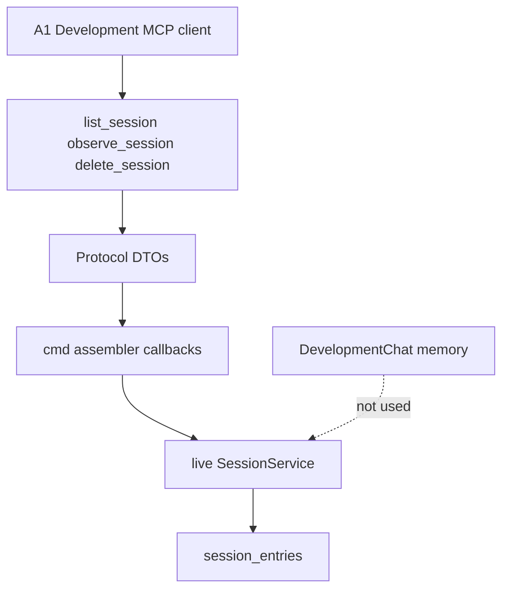

# Drop rocketclaw fc - Plan

## Goal Capsule

- **Objective:** A mismatched rocketclaw binary cannot inspect or delete stored conversations. Those operations run inside the deployed server, on the durable store, through the same frontend-backend protocol as other calls.
- **Means:** Protocol DTOs plus Development MCP tools for list, one-shot observe, and delete, then delete the CLI (KTD1, KTD6).
- **Authority:** Product Contract below is WHAT. Planning Contract is HOW. CONCEPTS.md for Development MCP, Frontend, Protocol, Backend, and State Store.
- **Open blockers:** None.
- **Product Contract preservation:** unchanged
- **Stop conditions:** AE1–AE6 have tests. `rocketclaw fc` is gone. Development MCP off still has no inspect/delete path. Do not expose these calls on Slack or External MCP. Do not hold overlay mutex across store calls. `make lint` and `make test` pass.
- **Execution profile:** Keep existing store list/delete/observe tests. Add MCP mapping tests for filters, snapshot observe, try-turn absence, and turns-only delete.
- **Tail ownership:** Implementer owns docs (README, CHEATSHEET, exec replay, CONCEPTS.md) with the code units.

---

## Product Contract

### Summary

Session list, one-shot observe, and delete become protocol calls, first usable through Development MCP, on the durable conversations `fc` hits today.
`rocketclaw fc` is removed so a mismatched binary cannot mutate that store.

### Problem Frame

`fc` is a second binary that talks to the store without going through the running server.
An operator can run a version that does not match the deployment and corrupt stored conversations.

### Requirements

**Protocol and surfaces**

- R1. List, one-shot observe, and delete of durable conversations are ordinary frontend-backend protocol calls, so a later RPC server can expose them without inventing a new kind of call.
- R2. This release exposes those calls only on Development MCP.
- R3. `rocketclaw fc` and its list, observe, and delete subcommands do not exist.

**Store and behavior**

- R4. The calls operate on the durable conversation store (Slack, exec, and External MCP sessions). They do not inspect or delete Development MCP try-turn chats.
- R5. Observe returns stored entries once. It does not follow.
- R6. Delete does what `fc delete` does today: remove that conversation's stored turns only.
- R7. List keeps the CLI's time window, limit, and last-message preview filters.

**Availability and docs**

- R8. When Development MCP is off, list, observe, and delete are unavailable. There is no CLI fallback.
- R9. Operator-facing text that tells people to use `rocketclaw fc` is updated to the Development MCP calls, including exec's replay sentence.

### Key Decisions

- **Protocol calls, not a leftover CLI** (session-settled: user-directed — chosen over keeping the CLI or deleting it with no replacement: a second binary can be the wrong version and corrupt the store; a later RPC needs ordinary protocol calls). Governs R1, R3.
- **Development MCP only this release** (session-settled: user-approved — chosen over exposing the same calls on Slack or External MCP now: confirmed in synthesis). Governs R2.
- **One-shot observe** (session-settled: user-directed — chosen over live follow and both: the call must look like every other protocol call). Governs R5.
- **Durable store, not try-turns** (session-settled: user-directed — chosen over Development MCP in-memory chats and both: that is the store a wrong CLI could corrupt). Governs R4.
- **Door-off gap accepted** (session-settled: user-directed — chosen over keeping a CLI fallback: Development MCP off means no inspect or delete). Governs R8.
- **Same delete as today** (session-settled: user-directed — chosen over a fuller conversation wipe: after the move, delete does what it did before). Governs R6.
- **List keeps CLI filters** (session-settled: user-approved — chosen over cutting time/limit/preview: confirmed with that synthesis call-out standing). Governs R7.

### Actors

- A1. Coding agent or operator connected to Development MCP.
- A2. The deployed RocketClaw server.

### Key Flows

- F1. List durable sessions
  - **Trigger:** A1 asks Development MCP to list sessions.
  - **Actors:** A1, A2
  - **Steps:** A2 returns conversation summaries from the durable store, applying R7 filters.
  - **Outcome:** A1 sees ids, turn counts, last updated, and last-message preview unless preview is omitted.
  - **Covered by:** R1, R2, R4, R7

- F2. Observe one conversation
  - **Trigger:** A1 asks Development MCP to observe a conversation id.
  - **Actors:** A1, A2
  - **Steps:** A2 returns that conversation's stored entries once.
  - **Outcome:** A1 has a snapshot. New turns after the call are not streamed.
  - **Covered by:** R1, R2, R4, R5

- F3. Delete one conversation's stored turns
  - **Trigger:** A1 asks Development MCP to delete a conversation id.
  - **Actors:** A1, A2
  - **Steps:** A2 removes that conversation's stored turns only.
  - **Outcome:** Those turns are gone. Thread, goal, and routing rows for that conversation remain.
  - **Covered by:** R1, R2, R4, R6

- F4. CLI is gone
  - **Trigger:** Someone runs `rocketclaw fc` or a former subcommand.
  - **Actors:** A1
  - **Steps:** The binary treats it as unknown. No store access occurs.
  - **Outcome:** A mismatched CLI cannot inspect or delete stored conversations.
  - **Covered by:** R3

### Acceptance Examples

- AE1. Door off
  - **Covers R8.**
  - **Given:** Development MCP is not enabled.
  - **When:** A caller wants to list, observe, or delete durable sessions.
  - **Then:** Those calls are unavailable. No CLI path remains.

- AE2. Observe is a snapshot
  - **Covers R5.**
  - **Given:** A durable conversation exists and may still receive turns.
  - **When:** A1 observes it.
  - **Then:** Stored entries return once. The call does not stay open for new turns.

- AE3. Delete matches today's `fc delete`
  - **Covers R6.**
  - **Given:** Two durable conversations have stored turns, and the target also has thread or goal rows.
  - **When:** A1 deletes the target.
  - **Then:** Only the target's stored turns are removed. The other conversation's turns remain. Thread and goal rows for the target remain.

- AE4. Try-turns are out
  - **Covers R4.**
  - **Given:** A Development MCP try-turn chat exists only in memory.
  - **When:** A1 lists or observes durable sessions.
  - **Then:** That try-turn does not appear. Observe of its id does not return try-turn turns.

- AE5. `fc` is unknown
  - **Covers R3.**
  - **Given:** The rocketclaw CLI is installed.
  - **When:** Someone runs `rocketclaw fc`, `rocketclaw fc list`, `rocketclaw fc observe`, or `rocketclaw fc delete`.
  - **Then:** The command is unknown. The store is untouched.

- AE6. List filters remain
  - **Covers R7.**
  - **Given:** Durable sessions exist inside and outside a time window.
  - **When:** A1 lists with a time window, a limit, or preview omitted.
  - **Then:** Results match today's `fc list` filters.

### Scope Boundaries

**Deferred for later**

- An RPC server that exposes these calls.
- Live follow on observe.
- Inspecting or deleting Development MCP try-turn chats.
- Exposing these calls on Slack or External MCP.
- Observe truncation or pagination.

**Outside this work**

- A general operator console on every frontend.
- Broadening delete to wipe thread, goal, or routing state.
- A dedicated unknown-command error path for leftover `fc` tokens.
- Holding overlay mutex across list, observe, or delete.

### Dependencies / Assumptions

- Development MCP stays off until enabled and keeps its own credential. These calls use that door, not a new auth path.
- Frontends do not import the backend. The calls cross on the existing protocol.
- Exec runs still persist to the durable store. Replay moves from `fc observe` to the Development MCP observe call (R9).

### Sources / Research

- `CONCEPTS.md` — Development MCP identity; frontends never import the backend.
- `cmd/rocketclaw/fc.go` — current list / observe / delete behavior, including `--follow`.
- `cmd/rocketclaw/exec.go` — exec replay currently names `rocketclaw fc observe`.
- `internal/rocketclaw/frontend/developmentmcp/server.go` — six overlay/try/reload tools today; no session inspect.
- `internal/rocketclaw/protocol/development.go` — no session list/observe/delete messages today.
- `docs/plans/2026-08-29-1444-refactor-backend-frontend-protocol-plan.md` — R3 frontend isolation; Development MCP already speaks protocol.
- `docs/plans/2026-08-22-1207-feat-rocketclaw-development-mcp-plan.md` — door off until enabled; six-call set this work expands.

---

## Planning Contract

### Key Technical Decisions

- KTD1. **Protocol DTOs plus assembler-injected callbacks. No dispatcher.** Types live next to other reusable protocol messages, not in `internal/rocketclaw/protocol/development.go`. Overlay/try types stay Development-MCP-only. List, observe, and delete are durable-store calls a later RPC can reuse. Slack and External MCP never register tools for them. (session-settled: user-directed — chosen over keeping the CLI or deleting it with no replacement: ordinary protocol calls, not a new bus). Governs R1.

- KTD2. **Three atomic tools named like the existing six.** Tools: `rocketclaw_development_list_session`, `rocketclaw_development_observe_session`, `rocketclaw_development_delete_session`. Protocol names: `ListSessions`, `ObserveSession`, `DeleteSession`. No `fc` in names. No overlay `context` on these tools. Structured JSON in and out. Governs R2.

- KTD3. **Use the live `SessionService`. Do not open a second store connection. Do not hold overlay mutex.** Extract list and delete onto the runtime session service. Observe already exists there. Keep the DSN helpers for tests and quickbench. List, observe, and delete are State Store ops, not overlay try-paths. (session-settled: user-directed — chosen over Development MCP in-memory chats and both: durable `session_entries` only). Governs R1, R4.

- KTD4. **List encoding matches today's CLI parse, not a new duration type on protocol.** Protocol carries `Since`/`Until` as times (zero unset), `Limit` as int, and a preview-off bool. MCP `since` is one string (Go duration or RFC3339). MCP `until` is RFC3339 only. MCP preview field is `include_message_preview`, omitted means true. Preview stripping is presentation after the store query. Unfiltered list order stays conversation id. Any bound (`since`, `until`, or `limit`) keeps today's last-updated descending order. (session-settled: user-approved — chosen over cutting time/limit/preview: the filter capability stays). Governs R7.

- KTD5. **Observe returns a JSON array of stored entry JSON.** No follow field. No row ids. Missing id and try-turn id both return an empty snapshot, not an error. Truncation stays deferred. (session-settled: user-directed — chosen over live follow and both: one request, one snapshot). Governs R5.

- KTD6. **Delete the `fc` case, help, and tests. Do not add an unknown-command path.** Leftover `fc` tokens follow today's unknown-arg fallthrough (serve when config exists). The store is not touched. Do not assert a dedicated unknown error. Call-out vs AE5 wording: AE5 says "the command is unknown"; R3 is met by the subcommand not existing and the store staying untouched. (session-settled: user-directed — chosen over keeping the CLI or deleting it with no replacement: no leftover inspect/delete binary). Governs R3.

### Assumptions

- This plan covers the full Product Contract. It does not narrow to list-only or keep any CLI subcommand.
- Tool descriptions are the agent contract: durable store only, snapshot observe, turns-only delete, no overlay context, door-off means the tools do not exist.
- Missing or `devmcp-*` delete returns deleted 0, not an error, matching today's CLI.
- `CONCEPTS.md` Development MCP entry gains the second job (durable session inspect/delete) without becoming External MCP.
- Exec replay names the observe tool and that Development MCP must be enabled.
- Delete of a live conversation can race an in-flight turn. Same as today's `fc delete`. Not fixed here.

### High-Level Technical Design

A1 talks to Development MCP tools. The frontend maps MCP JSON to protocol DTOs. `cmd` injects callbacks over the live session service. Try-turn memory store is not on this path.

| Call | MCP tool | Protocol | Result shape |
| --- | --- | --- | --- |
| List | `rocketclaw_development_list_session` | `ListSessions` | summaries: id, turns, last updated, optional previews |
| Observe | `rocketclaw_development_observe_session` | `ObserveSession` | JSON array of stored entry JSON |
| Delete | `rocketclaw_development_delete_session` | `DeleteSession` | deleted turn count |

Door off: Development MCP does not start. The three tools do not exist. No CLI fallback (R8).

### System-Wide Impact

- Development MCP Basic Auth can now read and erase production transcripts (Slack, exec, External MCP), not only try overlays. Same credential. No new confirm token (R6).
- Overlay/try tools and production-session tools share one tool list. Try-turn ids (`devmcp-*`) vs durable ids is the mix-up to document in tool text.
- Delete is the first Development MCP call that mutates other conversations' stored turns.
- Observe of a busy Slack thread can be large for a model window. Truncation is deferred. Tool description must warn.

### Risks

- Copy-pasting overlay mutex onto these callbacks would stall Reload and try-turns for the whole observe dump. KTD3 forbids that.
- Calling DSN list/delete helpers from the daemon would open a second store client. KTD3 forbids that.
- Agents will pass `run_turn` ids into observe/delete. Empty/zero is the contract, not NotFound.
- Leftover `fc` with config present starts serve (KTD6). Safety bar is store untouched.

### Sources / Research

- `internal/rocketclaw/backend/store.go` — `SessionSummary`, `SessionListOptions`, `ObserveEntries`, `DeleteSessionIn`, `ListSessionsInOptions`.
- `cmd/rocketclaw/mcp.go` — door off returns nil; assembler does not pass `rt.Sessions` into Development MCP today.
- `cmd/rocketclaw/assemble.go` — Development MCP is not on the clockwork copy loop.
- `docs/solutions/logic-errors/development-mcp-try-paths-raced-with-live-reload.md` — overlay mutex is for clone-touching doors only.
- `docs/solutions/best-practices/wrapcheck-cross-package-helper-error.md` — protocol is the shared lowest layer; wrap cross-package errors.

---

## Implementation Units

### U1. Protocol session types

- **Goal:** Durable list, observe, and delete are protocol messages a later RPC can reuse. Covers R1.
- **Requirements:** R1. Approach follows KTD1, KTD2, KTD4, KTD5.
- **Dependencies:** None.
- **Files:** `internal/rocketclaw/protocol/conversation.go` (new, or equivalent non-`development.go` file), existing protocol tests that forbid backend import.
- **Approach:**
  1. Add request/result types for list, observe, and delete next to reusable protocol messages, not in `development.go` (KTD1).
  2. List request: times, limit, preview-off bool (KTD4). Observe result: stored entry JSON, not a `rocketcode` type (KTD5). Delete result: turn count.
  3. Keep protocol free of backend and frontend imports.
- **Patterns to follow:** `internal/rocketclaw/protocol/development.go` field style (exported Go, no json tags). `internal/rocketclaw/protocol/deps_test.go` isolation.
- **Test scenarios:**
  - Protocol package still forbids backend import.
  - Types compile without a `rocketcode` import.
- **Verification:** Protocol tests pass. Session types are not in `development.go`.

### U2. Live session service list and delete

- **Goal:** The running server lists and deletes durable sessions on the same service that already observes. Covers R4, R6, R7 store behavior.
- **Requirements:** R4, R6, R7. Approach follows KTD3, KTD4.
- **Dependencies:** None.
- **Files:** `internal/rocketclaw/backend/store.go`, `internal/rocketclaw/backend/store_test.go`.
- **Approach:**
  1. Extract list and delete onto the live session service from the existing SQL (KTD3).
  2. Keep DSN helpers for tests and quickbench.
  3. Do not change delete SQL (turns only) or list filter SQL (KTD4).
- **Patterns to follow:** Existing `ObserveEntries` on the session service. Existing store tests for list filters and delete target-only.
- **Test scenarios:**
  - Existing list since/until/limit tests still pass through the service.
  - Covers AE3. Delete of one conversation removes only that conversation's `session_entries`. Thread and goal rows remain.
  - Delete of a missing id returns 0.
- **Verification:** `internal/rocketclaw/backend` tests pass. Daemon path no longer needs a second DSN open for list/delete.

### U3. Development MCP tools and assembler wiring

- **Goal:** A1 can list, observe, and delete durable sessions through Development MCP. Covers R1, R2, R4, R5, R6, R7, R8.
- **Requirements:** R1, R2, R4, R5, R6, R7, R8. Approach follows KTD1, KTD2, KTD3, KTD4, KTD5.
- **Dependencies:** U1, U2.
- **Files:** `internal/rocketclaw/frontend/developmentmcp/server.go`, `internal/rocketclaw/frontend/developmentmcp/server_test.go`, `cmd/rocketclaw/mcp.go`, `cmd/rocketclaw/assemble.go`, `cmd/rocketclaw/mcp_test.go`.
- **Execution note:** Prove MCP mapping with injected callbacks before deleting the CLI.
- **Approach:**
  1. Add three tools with KTD2 names. Inject real or unused callbacks. Do not use nil as disabled.
  2. Parse list filters in the frontend (KTD4). Map to protocol times. Do not put duration strings on protocol.
  3. Wire callbacks from the live session service in `startDevelopmentMCP`. Do not hold overlay mutex (KTD3).
  4. Tool descriptions: durable Slack/exec/External MCP only; not try-turns; observe is a snapshot and may be large; delete removes stored turns only, no confirm; these tools take no overlay context.
  5. Door off stays "server not started" (R8).
- **Patterns to follow:** Existing overlay/lint/run_turn tool registration and `callTool` HTTP tests. Unused callback funcs that error if called. `TestStartDevelopmentMCPDisabledDoesNotListen`.
- **Test scenarios:**
  - Covers AE1. Development MCP disabled: server not started; list/observe/delete tools absent.
  - Covers AE6. List with since duration, until RFC3339, limit, and preview omitted matches today's filter semantics.
  - Covers AE2. Observe of a durable id returns stored entries once. A second call is a new snapshot. No follow argument.
  - Covers AE4. A `devmcp-*` try-turn does not appear in list. Observe of that id returns empty. Delete of that id returns 0 and does not clear in-memory try-turn chat.
  - Covers AE3. Delete of a durable id removes only that conversation's stored turns.
  - Observe/delete of a missing id: empty snapshot / deleted 0, not an error.
  - Overlay tools still work. New tools reject overlay context.
  - List/observe/delete do not wait on overlay mutex.
- **Verification:** Development MCP and `cmd/rocketclaw` MCP tests pass. Frontends still do not import backend.

### U4. Delete the CLI and update operator text

- **Goal:** `rocketclaw fc` is gone. Operator text names the Development MCP tools. Covers R3, R9.
- **Requirements:** R3, R9. Approach follows KTD6.
- **Dependencies:** U3.
- **Files:** `cmd/rocketclaw/fc.go`, `cmd/rocketclaw/fc_test.go`, `cmd/rocketclaw/main.go`, `cmd/rocketclaw/main_test.go`, `cmd/rocketclaw/secrets_cli_test.go`, `cmd/rocketclaw/exec.go`, `cmd/rocketclaw/exec_test.go`, `cmd/rocketclaw/CHEATSHEET.md`, `README.md`, `CONCEPTS.md`.
- **Approach:**
  1. Delete `fc.go` and `fc_test.go`. Drop `case "fc"` and help lines (KTD6).
  2. Move any list-fixture helper still needed by exec tests into `exec_test.go`.
  3. Replace exec replay `rocketclaw fc observe` with the observe tool name and that Development MCP must be enabled (R9).
  4. Update CHEATSHEET tool list and drop CLI table rows. Update README session-inspection and Development MCP sentences.
  5. Refine the Development MCP entry in `CONCEPTS.md`: durable session inspect/delete is a second job of that door, not External MCP.
  6. Do not add an `fc`-unknown error or a test that leftover `fc` is rejected (KTD6).
  7. Leave historical specs and old plans as history.
- **Patterns to follow:** `docs/plans/2026-08-30-1117-refactor-rocketclaw-drop-sqlite-migrator-plan.md` — delete the command and its tests; do not add a rejection path.
- **Test scenarios:**
  - Covers AE5. After deletion, leftover `fc` tokens do not call list, observe, or delete. Store is untouched. Do not add a dedicated unknown-command assertion.
  - Top-level help and CHEATSHEET no longer list `fc`.
  - Exec help names the observe tool and that Development MCP must be enabled.
  - Secrets CLI tests no longer mention `fc`.
- **Verification:** `cmd/rocketclaw` tests pass. Operator-facing files no longer tell people to run `rocketclaw fc`.

---

## Verification Contract

| Check | Command |
| --- | --- |
| Protocol isolation | `go test` `./internal/rocketclaw/protocol` |
| Store | `ROCKETCLAW_TEST_DATABASE_URL` set; `go test` `./internal/rocketclaw/backend` |
| Development MCP | `go test` `./internal/rocketclaw/frontend/developmentmcp` |
| CLI / assembler | `go test` `./cmd/rocketclaw` |
| Format | `gofmt` on touched files |
| Full suite | `make test` |
| Lint | `make lint` |

Do not edit `SOURCE_CLOC_BUDGET`. Do not add Slack or External MCP tools for these calls.

---

## Definition of Done

- AE1–AE6 covered. R1–R9 true.
- Three Development MCP tools exist when the door is on, and are absent when it is off.
- `rocketclaw fc` is gone. Store is not reachable from leftover `fc` tokens.
- Frontends still do not import backend. Protocol still does not import backend.
- Overlay mutex is not held across list, observe, or delete.
- README, CHEATSHEET, exec help, and CONCEPTS.md no longer teach `rocketclaw fc`.
- Abandoned CLI files and tests are deleted. No unknown-command shim.
- `make lint` and `make test` pass.
