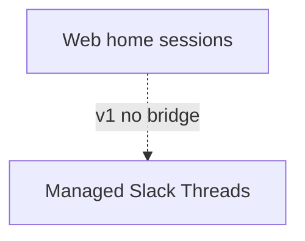
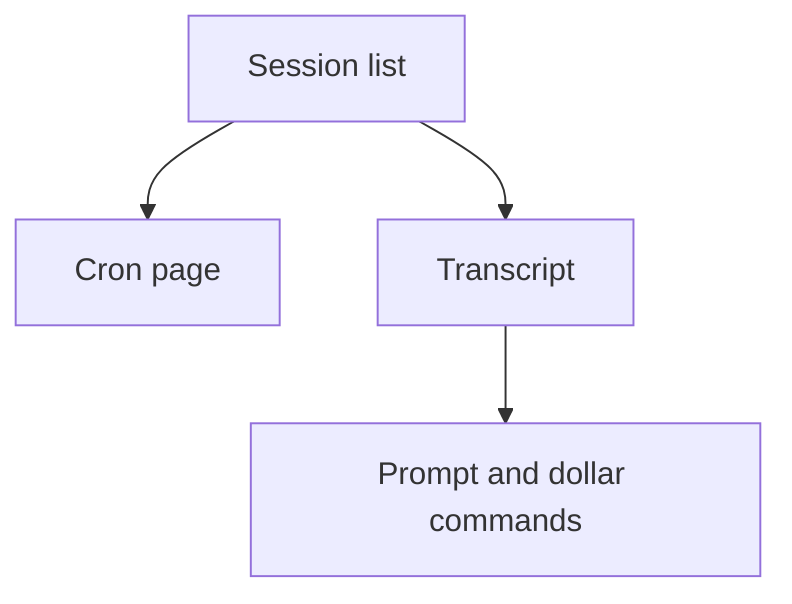
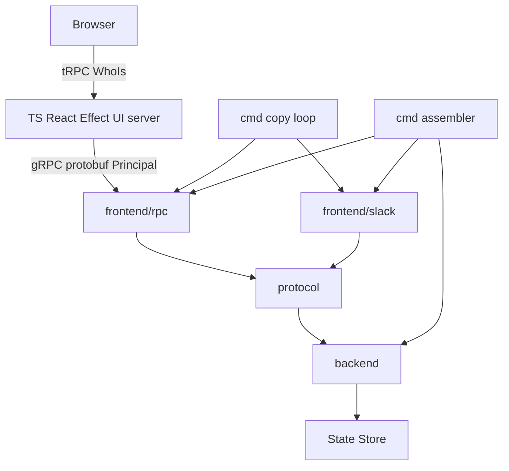

# RocketClaw Web Home - Plan

## Goal Capsule

- **Objective:** People on the tailnet run agents, shared sessions, and crons from a web home instead of Slack.
- **Means:** RocketClaw exposes a gRPC+protobuf web Frontend. A standalone EffectTS/tRPC/React server is the human UI, with its own 10000-line TS CLOC (KTD1, KTD7, KTD11).
- **Authority:** This Product Contract. `cmd/rocketclaw/CHEATSHEET.md` is the conversation-capability floor. CONCEPTS.md for Backend, Frontend, Protocol, Principal, Slack Steer, Enqueued Slack Message, Thread Queue, and State Store.
- **Stop conditions:** Stop if the work would run an XMPP or other chat server. Stop if v1 would bridge Slack and web sessions. Stop if queue, agent, goal, or stop become a button console. Stop if `internal/rocketclaw` `GO_SOURCE_CLOC_BUDGET` would be edited or first-party Go would exceed it. Stop if the TypeScript UI were stuffed into the Go CLOC. Stop if Slack config would be made optional.
- **Product Contract preservation:** unchanged
- **Execution profile:** Go RPC door stays tiny. UI lives in the TypeScript app. Measure Go CLOC after every Go unit. Measure TS CLOC in the web app's own budget.

---

## Product Contract

### Summary

A first-class web home for RocketClaw: tailnet users share sessions, type the same `$commands` they use in Slack, and see a Codex/OpenCode-like transcript. Cron gets a real page and lands in web sessions. Success is the principal driving agents and crons here instead of Slack.

### Problem Frame

Slack is the only multiplayer text surface. Conversation identity is a Slack thread. Cron jobs target Slack channels. Ordinary agent work requires Slack.

XMPP looked like a way not to invent a messaging server. This instance does not federate, the UI will be custom, and clustering is later. A second chat server would be the wrong product.

Codex Desktop and OpenCode 2 show a better transcript. They do not have steer, queue, goals, or cron. Those stay RocketClaw's product.

### Key Decisions

- **Web is the home.** (session-settled: user-directed — chosen over Slack remaining primary / web as sidecar: people must operate without Slack.) Governs R1, R2, R16.
- **No XMPP server.** (session-settled: user-directed — chosen over an XMPP sidecar: no federation, custom UX, HA later, do not reinvent a chat product.) Governs R1.
- **Protocol-native rooms, not a messaging server.** (session-settled: user-directed — chosen over running XMPP for presence/fan-out: steal the room model, keep identity in RocketClaw.) Governs R3, R4.
- **Shared sessions on day one.** (session-settled: user-directed — chosen over a personal-only workbench: Slack's multiplayer is part of the floor.) Governs R5, R6, R7.
- **Web-only v1.** (session-settled: user-directed — chosen over bridging Slack and web on the same session: simplest; Slack stays today's separate world.) Governs R16, R17.
- **Tailscale is identity.** (session-settled: user-directed — chosen over instance accounts, SSO, or Slack login: reachability is auth; IP maps to Tailscale WhoIs as Principal.) Governs R8, R9.
- **Whole tailnet is one team.** (session-settled: user-directed — chosen over link-invite or explicit share: anyone on the tailnet can list and join every web session.) Governs R6.
- **Slack conversation controls are the floor.** (session-settled: user-directed — chosen over a smaller v1: all Slack conversation capabilities, plus cron visualize/operate.) Governs R10, R11, R12, R13.
- **Typed `$commands`, better renderer.** (session-settled: user-directed — chosen over a button console or UI-only controls: Codex/OpenCode inform layout, not the feature set.) Governs R10, R14, R15.
- **Cron page is the one extra chrome.** (session-settled: user-directed — chosen over bare `$cron` as the only list, and over more panels: cron is the exception.) Governs R12, R13, R14.
- **Cron lands in web sessions.** (session-settled: user-directed — chosen over Slack-channel targets or dual targets in v1: ordinary cron must not require Slack.) Governs R12, R13.

<!-- ce-section: work-relationships -->
### How This Work Fits Together

This plan owns the web home. The broader map is current understanding, not a roadmap.

- Slack as today's product
  - Can proceed independently of this plan
  - Shares no v1 sessions with the web home (R16)
- Slack↔web bridge
  - Depends on this plan's surface-independent sessions (R3)
  - Still to decide
- Clustered live fan-out / HA
  - Can proceed independently of v1
  - Still to decide; not XMPP in this plan



### Actors

- A1. Principal operator on the tailnet who must be able to drive all ordinary work from the web
- A2. Another tailnet human in the same shared session
- A3. The session's agent
- A4. A human who stays on Slack in v1 and does not see web sessions

### Requirements

**Home and identity**

- R1. The web home is a first-class Frontend. It is not a Slack sidecar and not a chat-server product.
- R2. A1 can do ordinary agent work and cron work without Slack.
- R3. A web session has a durable identity that is not a Slack thread id.
- R4. Session membership, history, and turn occupancy live with RocketClaw, not in an external messaging server.

**Shared sessions**

- R5. Several humans can occupy one session at once, with one active turn, Slack Steer, and Enqueued Slack Message behavior preserved.
- R6. Anyone on the tailnet can list every web session and join it.
- R7. A2 joining an in-progress session sees the live transcript and can prompt, steer, enqueue, and stop under the same rules as Slack.
- R8. Reachability on the tailnet is authentication. There is no signup.
- R9. Principal is the Tailscale identity for the connecting IP.

**Conversation surface**

- R10. Every Slack text control in `cmd/rocketclaw/CHEATSHEET.md` works in a web session with the same dollar grammar: `$goal`, `$stop`, `$cron`, `$workflow`, `$agent`, `$enqueue`, `$queue`, plus help for bare `$` / unknown commands.
- R11. Side Ask has a web equivalent of the Slack modal: private one-question ask from a completed answer, not taking the session's active-turn slot.
- R12. A cron page lists jobs, status, last run, and next run, and can trigger a job. Typed `$cron` still works. Bare `$cron` in a session lists jobs that target that session.
- R13. Each cron job has a named web session target. Job output lands there, not in Slack.

**Chrome and renderer**

- R14. Navigation chrome is session list, new session, transcript, composer, and the cron page. Side Ask is a transcript-local dialog. Queue, agent, goal, and stop are not panels.
- R15. The transcript borrows Codex Desktop / OpenCode 2 layout patterns: session list, streaming transcript, tool cards. It does not adopt their feature set.
- R16. v1 web sessions are not visible on Slack. Slack Managed Slack Threads stay as today.
- R17. Slack-only social moves stay on Slack: hail in unmapped channels, take over an unmanaged thread, emoji as the control mechanism, External MCP pairing.



### Key Flows

- F1. Start and talk
  - **Trigger:** A1 opens the web home and starts a new session, optionally `$agent`.
  - **Actors:** A1, A3
  - **Steps:** Session appears in the tailnet list. A1 types a prompt or dollar command. Live thinking and answer stream in the transcript. One active turn at a time.
  - **Outcome:** Ordinary agent work without Slack.
  - **Covers:** R1, R2, R3, R10, R14

- F2. Shared session
  - **Trigger:** A2 opens a session A1 already has live.
  - **Actors:** A1, A2, A3
  - **Steps:** A2 sees the same transcript. A2 can steer or enqueue during A1's turn. `$queue` lists pending steers then later work. `$stop` ends the turn.
  - **Outcome:** Slack multiplayer without Slack.
  - **Covers:** R5, R6, R7, R10

- F3. Cron page
  - **Trigger:** A1 opens the cron page or types `$cron`.
  - **Actors:** A1, A3
  - **Steps:** The page lists jobs with status and schedule. A1 runs a job. Output posts into that job's named web session. Anyone on the tailnet can open that session.
  - **Outcome:** Cron without a Slack channel.
  - **Covers:** R12, R13, R6

- F4. Side Ask
  - **Trigger:** A1 asks a side question from a completed answer.
  - **Actors:** A1, A3
  - **Steps:** The ask is private to A1. It uses history up to that answer. It does not take the session's active-turn slot. Dismiss aborts only the ask.
  - **Outcome:** Slack Side Ask, on the web.
  - **Covers:** R11

### Acceptance Examples

- AE1. **Covers R2, R16.** Given only the web home, A1 starts a session, runs a turn, and runs a cron job. Slack is not required. A4 on Slack does not see that session.
- AE2. **Covers R5, R7, R10.** Given an active turn, A2's unmarked message is a Slack Steer. `$enqueue` stashes. `$queue` shows steers then later work. `$stop` ends the turn and does not require a reaction.
- AE3. **Covers R6, R8, R9.** Given two tailnet identities, both can list and join the same session. Principal on each prompt is that identity's Tailscale name. Someone off the tailnet cannot open the home.
- AE4. **Covers R12, R13.** Given a job targeted at web session `ops`, running it from the cron page or `$cron` posts into `ops`, not into a Slack channel.
- AE5. **Covers R14, R15.** Given the web home, A1 sees session list, transcript, composer, and a cron page. There is no queue/agent/goal/stop panel. `$queue` and `$agent` remain typed.

### Success Criteria

- A1's first week of ordinary work — agents, shared sessions, crons — runs through the web home instead of Slack.

### Scope Boundaries

**Deferred for later**

- Slack↔web bridge on the same session
- Multi-node HA / clustered live fan-out
- Who-is-here presence beyond the shared transcript
- Instance accounts or SSO
- Queue, agent, goal, or stop as visible panels

**Outside this product's identity**

- An XMPP or other chat server
- Federation with other companies
- A Codex/OpenCode clone that drops RocketClaw's Slack controls
- Replacing Slack's in-Slack behavior in v1

**Deferred to Follow-Up Work**

- Per-item cancel of a waiting steer or enqueue without emoji
- Inbound file upload in the composer
- Making Slack config optional

### Dependencies / Assumptions

- The instance is already on a tailnet. Browser connections to the UI server can be mapped to Tailscale WhoIs.
- Slack keeps working as today for A4. This plan does not take Slack down.
- Dollar command grammar stays as `cmd/rocketclaw/CHEATSHEET.md`.
- Named web session targets for cron are the analog of today's Slack channel targets on cron jobs.

### Outstanding Questions

**Deferred to Implementation**

- Exact LocalAPI WhoIs client wiring on the TypeScript listen address.
- Exact HTML/CSS for the transcript beyond session list, streaming markdown, collapsible thinking, and tool cards.
- Exact cron frontmatter key spelling once the loader is opened.

### Sources / Research

- `CONCEPTS.md` — Backend, Frontend, Protocol, Principal, Managed Slack Thread, Slack Steer, Thread Queue, State Store.
- `cmd/rocketclaw/CHEATSHEET.md` — Slack text controls (the v1 capability floor).
- `docs/plans/2026-08-29-1444-refactor-backend-frontend-protocol-plan.md` — one backend, frontends, Protocol; `cmd` copies live output.
- `internal/rocketclaw/protocol/conversation.go` — conversation ids are Slack-thread-shaped today.
- `internal/rocketclaw/protocol/clockwork.go` — `PublishOutbound` no-ops unless Slack/cron/response.
- `cmd/rocketclaw/assemble.go` and `cmd/rocketclaw/copy.go` — assembler and skip-sender copy.
- `internal/rocketclaw/backend/manager.go` — cron `channel` must be a configured Slack channel.
- `docs/solutions/architecture-patterns/durable-session-inspect-delete-on-development-mcp.md` — ObserveSession is snapshot-only.
- `docs/solutions/best-practices/slack-bare-cron-lists-channel-jobs.md` — bare `$cron` lists this room's jobs.
- Go CLOC ~19517 / 20350 (`internal/rocketclaw/Makefile`).

---

## Planning Contract

### Key Technical Decisions

- KTD1. **Go RPC Frontend, not an in-process UI.** Assembler registers `BridgeWeb` as `frontend/rpc`. It does not import backend. Slack stays required in config. The human UI is not this package. Cite R1, R16.
- KTD2. **`web-session:` conversation ids.** Do not reuse `slack-thread:`. Bind `threadBridgeManager` by id prefix with per-id output targets, steer drain, asker, and enqueue. Cite R3, R4.
- KTD3. **`OutputTargetWeb` plus BroadcastPublisher gate.** Live web transcript cannot ship without this. Slack `HandleBroadcast` drops web. Web RPC drops Slack/MCP/relay. Cite R7, R16.
- KTD4. **WhoIs the browser on the TypeScript server.** Fail closed. Principal is that WhoIs name, sent on every gRPC call. Go does not treat the gRPC peer as the human. Cite R8, R9.
- KTD5. **Cron frontmatter without `#` names a web session.** `#ops` stays Slack. One job, one target. Scheduled output **appends** to that session. Cite R12, R13.
  - Conflict call-out: existing `cron/*.md` files name Slack channels. Web-operated jobs must be rewritten to web session names. Slack-world jobs keep `#channel`. Not dual-target on one job.
- KTD6. **Lift dollar parse into Protocol.** Slack keeps reactions, ephemerals, Block Kit. The UI sends canonical `$command` text over RPC. Do not clone `handleMessageEvent`. Cite R10.
- KTD7. **Standalone EffectTS + tRPC + React UI server.** Own process, own Makefile, TS CLOC budget 10000 skipping generated and vendored lines. Do not embed the UI in Go. Do not count it toward `internal/rocketclaw` Go CLOC. Cite R14, R15.
- KTD8. **Web session list is `web-session:` only.** Unfiltered `ListSessions` would leak Slack threads. Cite R6, R16.
- KTD9. **`$queue`, help, and bare `$agent` are requester-only.** Not shared history. Bare `$agent` is a text list, not a picker. Cite R10, R14.
- KTD10. **Join = Observe snapshot then RPC subscribe to Broadcast.** Do not stretch ObserveSession into live follow. Cite R7.
- KTD11. **Two RPC hops.** Browser to UI server is tRPC. UI server to RocketClaw is gRPC+protobuf. One protobuf service for session list, join, prompt, dollar commands, cron, Side Ask, and live transcript. No ad-hoc JSON from the UI server to Go. Cite R1, R14.

### High-Level Technical Design



Occupancy: one active turn per `web-session:` id, same as a Managed Slack Thread. Steers inject into that turn. Enqueues live on Thread Queue keyed by that id.

### Assumptions

- WhoIs comes from Tailscale LocalAPI against the browser connection on the TypeScript server. WhoIs miss closes the door. The UI server forwards Principal on gRPC.
- All loaded agents are available on the web. Default agent is `main` if present, else the first configured.
- Cron session `ops` is the same object people chat in. First open or first cron fire creates it.
- `$cron daily` from any web session still runs that job; output goes to the job's named target, not necessarily the current session.
- `ask_user_question` is a transcript-local dialog for the originating human. Needed for ordinary agent work (R2).
- `rocketclaw_start_new_thread` from a web turn creates another web session and returns its home path.
- Web origin uses a markdown-friendly default reply style. Slack's Slack-plain-text instruction stays.
- Composer is text plus `$commands`. No inbound file upload in v1.
- The TypeScript UI listens on the tailnet for browsers. Go gRPC may listen locally for that UI process.
- Slack `$cron` for A4 keeps listing and running `#channel` jobs. The web page lists web-targeted jobs.
- `web/Makefile` TS CLOC budget is 10000. Skip generated and vendored lines. Do not take those lines from `internal/rocketclaw` Go CLOC.
- Protobuf sources are first-party. Generated gRPC stubs do not count toward either CLOC.

### Implementation Constraints

- `GO_SOURCE_CLOC_BUDGET` is 20350. Current source CLOC is about 19517. Hazard zone is 500 lines. Never edit the budget.
- Coverage floor stays 90%. `COVERPKG` includes `cmd/rocketclaw`.
- Frontends never import backend.
- Do not put TypeScript, React, or Effect sources under `internal/rocketclaw/`.
- Do not count generated protobuf/gRPC stubs or `node_modules` toward TS CLOC.

### Sequencing

U1 → U2 → U3. U4 (Go RPC) after U1. U5–U7 are RPC methods on that door. U9 is the TypeScript UI and can start against a fake RPC, then switch to U4. U8 last.

Measure Go CLOC after U1, U2, and U4. If the next Go unit cannot fit, delete first or stop. TypeScript CLOC is measured in the UI tree only.

---

## Implementation Units

### U1. Protocol web identity and broadcast gate

- **Goal:** Protocol can name a web session and publish live output to it.
- **Requirements:** R3, R7, R16
- **Dependencies:** none
- **Files:** `internal/rocketclaw/protocol/clockwork.go`, `internal/rocketclaw/protocol/conversation.go`, `internal/rocketclaw/protocol/types.go`, `internal/rocketclaw/protocol/clockwork_test.go`, `internal/rocketclaw/frontend/slack/connector.go` (parser move only if started here), `internal/rocketclaw/protocol/command.go` (new, if parse lifts here)
- **Approach:**
  1. Add `BridgeWeb`, `SourceWeb`, `OutputTargetWeb`.
  2. Add `WebSessionConversationID` / parse helper with prefix `web-session:`.
  3. Extend `PublishOutbound` so web-targeted messages are not no-ops.
  4. Lift `$command` parse (not Slack dispatch) into protocol if it fits this unit; otherwise U5.
- **Patterns to follow:** `SlackThreadConversationID`; External MCP's `dropBroadcastBridge` for drop semantics.
- **Test scenarios:**
  - Given a web-targeted outbound without Slack target, PublishOutbound delivers instead of MarkDelivered no-op.
  - Given `web-session:ops`, parse round-trips and rejects `slack-thread:` ids.
  - Given `$ goal ship`, parse yields command `goal` and args `ship`.
- **Verification:** Protocol tests pass. Slack still publishes Slack-targeted output.

### U2. Prefix-bound thread bridges

- **Goal:** Backend routes web conversation ids to web output/steer/asker hooks, not Slack.
- **Requirements:** R3, R4, R5, R16
- **Dependencies:** U1
- **Files:** `internal/rocketclaw/backend/thread_bridges.go`, `internal/rocketclaw/backend/app.go`, `internal/rocketclaw/frontend/slack/connector.go`, matching `*_test.go`
- **Approach:**
  1. Bind by conversation-id prefix, not a single Slack `primaryTextBinding`.
  2. Web ids get web output targets and web originator hooks. Slack ids stay Slack.
  3. Slack `HandleBroadcast` drops non-Slack (except existing MCP relay).
  4. `StartActiveGoals` and prune include `web-session:`.
  5. Pending steers / queue rows for web ids do not require Slack channel/ts.
- **Patterns to follow:** `thread_bridges.go` Slack binding; `DrainSteers` nil for non-Slack today — add the web path rather than returning nil.
- **Test scenarios:**
  - Covers AE1. Starting a `web-session:` turn does not call Slack SendResponse.
  - Slack-originated turn still posts to Slack.
  - `StartActiveGoals` resumes a `web-session:` id.
  - Prune keeps `web-session:` rows.
- **Verification:** Backend tests cover prefix routing. No Slack message for a web-only turn.

### U3. Cron named web session target

- **Goal:** A job can target a web session and append there.
- **Requirements:** R12, R13
- **Dependencies:** U1, U2
- **Files:** `internal/rocketclaw/backend/manager.go`, `internal/rocketclaw/backend/manager_test.go`, cron definition loader, `README.md` cron frontmatter notes
- **Approach:**
  1. Frontmatter without `#` is a web session name. `#ops` remains Slack and must be in `slack.channels`.
  2. One job, one target. Validation accepts either a configured Slack channel or a web session name.
  3. `executeJob` for web sets ConversationID `web-session:<name>` and `OutputTargetWeb`. Do not open a new Slack thread.
  4. `ListCronjobs` filters by that session name for bare `$cron` on web.
- **Patterns to follow:** `TestListCronjobsFiltersByChannel`; `docs/solutions/best-practices/slack-bare-cron-lists-channel-jobs.md`.
- **Test scenarios:**
  - Covers AE4. Job `channel: ops` (no hash) posts into `web-session:ops`, not Slack.
  - Job `channel: #ops` still requires configured Slack channel and posts Slack.
  - Bare list for session `ops` returns only jobs targeting `ops`.
  - Named run from another session still executes; output goes to the job target.
- **Verification:** Manager tests. Existing Slack cron tests still pass for `#` jobs.

### U4. Web RPC Frontend

- **Goal:** A Go RPC door on Protocol that the TypeScript UI can call.
- **Requirements:** R1, R6, R7, R8, R9, R16
- **Dependencies:** U1
- **Files:** `internal/rocketclaw/frontend/rpc/` (new), protobuf service definition next to it, `cmd/rocketclaw/assemble.go`, `cmd/rocketclaw/copy.go`, `cmd/rocketclaw/copy_test.go`
- **Approach:**
  1. gRPC+protobuf service. UI server is the client. Go may listen locally.
  2. Take Principal from gRPC metadata set by the UI server. Do not WhoIs the gRPC peer as the human.
  3. RPCs: list sessions (`web-session:` only), create session, join (snapshot then live), prompt.
  4. HandleBroadcast fans out to joined gRPC subscribers. Drop Slack/MCP/relay.
  5. No HTML/JS in this package. Generated stubs are not Go CLOC.
- **Execution note:** httptest with Principal in gRPC metadata. Prove list filter and live subscribe without the TS app.
- **Patterns to follow:** `frontend/externalmcp` construction; assembler `registerBridge`; Development MCP Observe snapshot (not live).
- **Test scenarios:**
  - Covers AE3. Missing Principal on gRPC is rejected.
  - Two WhoIs principals can list and join the same `web-session:` id.
  - List omits `slack-thread:` ids.
  - Covers AE1. Live progress Broadcast with OutputTargetWeb reaches a joined RPC subscriber.
- **Verification:** `go test` on `frontend/rpc` and `cmd/rocketclaw`. Go CLOC measured.

### U5. Typed dollar commands and steer

- **Goal:** Composer has Slack conversation controls without Slack chrome.
- **Requirements:** R5, R7, R10, R14
- **Dependencies:** U2, U4
- **Files:** `internal/rocketclaw/frontend/rpc/`, protocol command helper if not in U1, `internal/rocketclaw/frontend/slack/connector.go` (call shared parse), tests
- **Approach:**
  1. Dispatch `$goal`, `$stop`, `$cron`, `$workflow`, `$agent`, `$enqueue`, `$queue`, help through PrimaryTextRouter / cron runner.
  2. Unmarked send during a busy turn is a Slack Steer.
  3. `$queue` and help are requester-only.
  4. Bare `$agent` lists names as text. `$agent name` switches.
- **Patterns to follow:** Slack `handleMessageEvent` switch behavior, not its UI; `parseCanonicalSlackCommand` tests.
- **Test scenarios:**
  - Covers AE2. Mid-turn unmarked text is a steer; `$enqueue` stashes; `$stop` ends the turn.
  - `$queue` is not written into shared session history.
  - Unknown `$wat` returns help to the requester.
  - Idle unmarked text starts or continues a turn as a prompt.
- **Verification:** Web command tests plus Slack command tests still pass on shared parse.

### U6. Cron RPCs

- **Goal:** The UI can list and run web-targeted cron jobs over RPC.
- **Requirements:** R12, R13, R14
- **Dependencies:** U3, U4, U5
- **Files:** `internal/rocketclaw/frontend/rpc/` cron RPCs
- **Approach:** RPCs return stem, running vs idle, last run if known, next due. Trigger is the same as `$cron <job>`. Typed `$cron` remains. Slack `#` jobs are omitted.
- **Patterns to follow:** Slack bare `$cron` list semantics; do not invent a second run API.
- **Test scenarios:**
  - Covers AE4. Trigger posts into the named web session, not Slack.
  - Typed `$cron` still works after the RPCs exist.
  - Slack `#` jobs are not returned.
- **Verification:** RPC tests. U9 renders the page from these RPCs.

### U7. Side Ask and origin-owned questions

- **Goal:** Side Ask and `ask_user_question` work as transcript-local dialogs.
- **Requirements:** R2, R11, R14
- **Dependencies:** U4, U5
- **Files:** `internal/rocketclaw/frontend/rpc/`, `internal/rocketclaw/backend/side_ask.go` only if origin/principal must be generalized, tests
- **Approach:** Completed chat answers offer Side Ask. Dialog is private, history through that entry, no active-turn slot. `ask_user_question` uses the same dialog shape for the originating human. `cmd` injects the runner; frontend does not import backend.
- **Patterns to follow:** Slack Side Ask request shape; `backend.SideAskRunner` injection from assemble.
- **Test scenarios:**
  - Covers F4. Side Ask from a completed answer does not take the session turn.
  - Dismiss aborts only the ask.
  - Goal/cron cards do not offer Side Ask.
  - `ask_user_question` during a web turn presents a dialog to the originator.
- **Verification:** RPC dialog tests. Slack Side Ask tests unchanged.

### U8. Concepts and operator docs

- **Goal:** Vocabulary and cheatsheet name the web home.
- **Requirements:** R1, R10, R13
- **Dependencies:** U4, U9
- **Files:** `CONCEPTS.md`, `cmd/rocketclaw/CHEATSHEET.md`, cron frontmatter docs in `README.md`
- **Approach:** Add Web Home (the TypeScript UI process) and Web Session. Name the Go door as a Frontend. Cheatsheet notes the same dollar grammar on the web. Cron docs show `#channel` vs web session name.
- **Test expectation:** none -- documentation only.
- **Verification:** Terms match the running UI and RPC door. README impact considered and needed.

### U9. Standalone TypeScript UI server

- **Goal:** Humans use an EffectTS + tRPC + React web home. The UI server is the only gRPC client of RocketClaw.
- **Requirements:** R2, R6, R10, R12, R14, R15
- **Dependencies:** U4 for live integration; can begin against a fake RPC
- **Files:** `web/` (new EffectTS + tRPC + React app), `web/Makefile`
- **Approach:**
  1. Standalone server. Not served by `cmd/rocketclaw`.
  2. Browser talks tRPC to this server. This server talks gRPC+protobuf to RocketClaw.
  3. WhoIs the browser; fail closed; put Principal on every gRPC call.
  4. Session list, new session, streaming transcript, composer, cron page. No queue/agent/goal/stop panels.
  5. `web/Makefile` TS CLOC budget 10000, skip generated and vendored. Never edit `internal/rocketclaw` `GO_SOURCE_CLOC_BUDGET` to fund this app.
- **Patterns to follow:** Product chrome in R14/R15. Do not clone OpenCode/Codex feature set. Do not reuse `cmd/quickweb`.
- **Test scenarios:**
  - Covers AE5. UI shows session list, transcript, composer, cron page; no extra control panels.
  - Covers AE2. Typed unmarked send during a turn steers; `$enqueue` / `$stop` work from the composer.
  - Covers AE3. Two browsers with different WhoIs principals share one session transcript.
- **Verification:** UI tests in `web/`. First-party TS CLOC ≤ 10000 excluding generated and vendored. Go CLOC unchanged by this unit except protobuf/gRPC server code.

---

## Output Structure

```text
internal/rocketclaw/frontend/rpc/
  *.proto                      # first-party; generated stubs excluded from CLOC
  server.go
  server_test.go
web/                           # EffectTS + tRPC + React; TS CLOC 10000 excl. generated/vendored
cmd/rocketclaw/assemble.go     # register BridgeWeb
internal/rocketclaw/protocol/
  command.go                   # shared $command parse, if extracted
```

Implementer may adjust layout. Unit file lists stay authoritative.

---

## Verification Contract

- `make -C internal/rocketclaw cloc` after U1, U2, U4, and before claiming done. Go source CLOC must stay below 20350. Prefer staying out of the 500-line hazard zone.
- `make -C web cloc` before claiming U9 done. First-party TS ≤ 10000. Skip generated and vendored. Never pay for UI lines out of the Go budget.
- `make -C internal/rocketclaw test` (generate, lint, race tests, coverage vs `@-`, CLOC).
- `gofmt` on touched Go files.
- Targeted: `go test` on `internal/rocketclaw/protocol`, `internal/rocketclaw/backend`, `internal/rocketclaw/frontend/rpc`, `internal/rocketclaw/frontend/slack`, `cmd/rocketclaw`.

---

## Definition of Done

- AE1–AE5 hold on the web home.
- A1 can run a session and a cron job without Slack.
- A2 can join and steer.
- Slack behavior for A4 is unchanged.
- No XMPP, no Slack↔web session bridge, no button console for queue/agent/goal/stop.
- First-party Go CLOC under `internal/rocketclaw` budget. First-party TS CLOC under 10000 in `web/`, skipping generated and vendored. Abandoned-attempt code removed.
- CONCEPTS.md names Web Home (UI process) and Web Session. The Go door is a Frontend.

---

## Risk Analysis

- **Go CLOC.** ~833 lines remain for the RPC door and protocol work. Mitigation: KTD7, KTD11, measure after U1/U2/U4, delete before adding. UI lines do not count here.
- **TS CLOC.** Budget 10000 on `web/`, skip generated and vendored. Do not raid the Go budget.
- **Cron migration.** Existing jobs are Slack `#channel`. Mitigation: KTD5 conflict call-out; rewrite only jobs A1 will operate from the web.
- **WhoIs on localhost.** Mitigation: KTD4, never `127.0.0.1`.
- **ListSessions leak.** Mitigation: KTD8.

## Alternative Approaches Considered

- **XMPP sidecar.** Rejected in product. No protocol in tree. Extra clustered chat server.
- **Reuse PrimaryTextRouter as-is.** Would post web turns to Slack. Rejected (KTD2).
- **ObserveSession as live follow.** Snapshot-only by contract. Rejected (KTD10).
- **Clone Slack connector in Go.** Would blow Go CLOC. Rejected (KTD7).
- **Embed the UI in the Go Frontend.** Rejected. Standalone TS server (KTD7).
- **Effect RPC from UI to Go.** Rejected. UI server to RocketClaw is gRPC+protobuf (KTD11).
- **Browser gRPC directly to RocketClaw.** Rejected. Browsers use tRPC to the UI server; that server forwards Principal.
