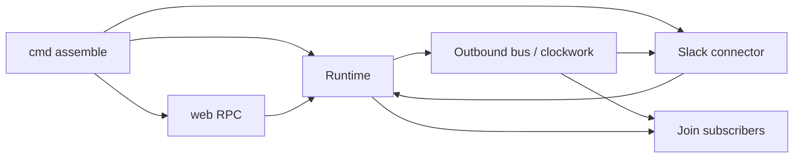

# Backend pointer frontends - Plan

## Goal Capsule

- **Objective:** A maintainer sees one backend object. Slack and web RPC are constructed with that pointer and call send, subscribe, and turn APIs on it. Auto-popped queue text still appears as live user balloons on Web Home Join without a refresh.
- **Means:** Delete `*func` assembly slots and tiny attach/echo interfaces. Pass `*backend.Runtime` into frontends. Backend owns steer drain, Join subscribers, and originator publish on the existing outbound bus (KTD1–KTD4).
- **Authority:** Product Contract below is WHAT. Planning Contract is HOW. CONCEPTS.md for Backend, Frontend, Web Home, Web Session, Protocol, Slack Steer, Enqueued Slack Message.
- **Open blockers:** None.
- **Product Contract preservation:** ce-plan-bootstrap
- **Stop conditions:** DrainWeb/drainSlack/startThreadRoot `*func` are gone. rpc.New is not a 12-callback assembler. Originator user lines still survive clockwork clone. `make lint` and `make test` pass.
- **Execution profile:** Update existing Join clone and AttachSlack tests first. Do not add a second live path.
- **Tail ownership:** Implementer updates CONCEPTS.md Frontend with the code units.

---

## Product Contract

### Summary

RocketClaw web Join and Slack stay sinks. The backend owns message lifecycle, steer buffers, and live Join fanout. Frontends are constructed with the backend pointer instead of cmd-assembled callbacks.

### Problem Frame

Auto-popped later work showed on refresh but not live because clockwork clone dropped `Originator`. That field is now copied. The remaining mess is how cmd pokes `DrainWeb *func`, copies Slack methods into more `*func` slots, and builds web RPC from a dozen closures. Tiny one-method interfaces make the wiring harder to see.

### Requirements

- R1. Web RPC and Slack are constructed with the backend pointer and call it for send, subscribe/unsubscribe, and turn submit.
- R2. Cmd does not fill `DrainWeb`, `drainSlack`, or `startThreadRoot` function pointers after construct.
- R3. Auto-popped and steered user text appears as Join `role=user` without a hard refresh. QUEUE stash is not a transcript line.
- R4. Originator publish stays web-targeted on the existing outbound bus. Slack consume card for Enqueued Slack Message stays Slack `ActivateEnqueue`.
- R5. Injected behavior is a real surface or an explicit inert implementation. Not nil, not a `*func` slot.
- R6. CONCEPTS.md Frontend no longer says frontends never import the backend.

### Key Decisions

- **Backend pointer, not callback assembly** (session-settled: user-directed — chosen over ultra-small WebFrontend/slackEcho/AttachWeb interfaces: those fragment wiring). Governs R1, R2.
- **No FanoutWeb or PublishUser callbacks** (session-settled: user-directed — chosen over extra Runtime `*func` fanout: surfaces are sinks). Governs R4.
- **Originator on OutboundMessage** (session-settled: user-directed — chosen over Join live-tailing session entries: one live path). Governs R3.
- **Interface DI means the backend object plus existing SlackFrontend** (session-settled: user-directed — chosen over DrainWeb `*func`: delete moving parts). Governs R5.

### Actors

- A1. Human on Web Home, including a Slack-thread session URL.
- A2. The deployed RocketClaw server.

### Key Flows

- F1. Live auto-pop user balloon
  - **Trigger:** A1 enqueues later work while a turn is busy; the turn ends and the item pops.
  - **Actors:** A1, A2
  - **Steps:** Backend accepts the inbound, publishes originator on the outbound bus, clockwork clones including Originator, Join subscribers receive `role=user`.
  - **Outcome:** The popped text is a user balloon without refresh.
  - **Covered by:** R3, R4

- F2. Web steer while busy
  - **Trigger:** A1 sends Enter while the turn is busy.
  - **Actors:** A1, A2
  - **Steps:** Backend buffers the steer. Slack echo of web text still posts into a Managed Slack Thread. Drain happens from backend state, not a cmd-assigned `*func`.
  - **Outcome:** Steer text reaches the turn and Join as a user line.
  - **Covered by:** R2, R3, R5

### Acceptance Examples

- AE1. Auto-pop live
  - **Covers R3.**
  - **Given:** Join is open on a Slack-thread session. A turn is busy. Three later-work rows exist.
  - **When:** The turn ends and the first row pops.
  - **Then:** That text appears as a user balloon without refresh.

- AE2. QUEUE is silent
  - **Covers R3.**
  - **Given:** Join is open and a turn is busy.
  - **When:** A1 sends QUEUE.
  - **Then:** No new transcript line. The queue panel updates.

- AE3. No DrainWeb slot
  - **Covers R2, R5.**
  - **Given:** Runtime is constructed.
  - **When:** A reader inspects Runtime and cmd assemble.
  - **Then:** There is no `DrainWeb *func`. Steers drain from backend-owned state.

### Scope Boundaries

**Deferred for later**

- Replacing remaining cmd closures that only map presentation (channel title cache) if they still need Slack ChannelName after the pointer pass.
- Clone-list hardening beyond Originator already being copied.
- Live deploy bounce of tmux `rocketclaw` (operator step after the code lands).

**Outside this work**

- Vite. Optimistic UI user lines. HTML5 drag. Raising CLOC budgets.
- Join live-tailing session entries as a second live path.
- FanoutWeb / PublishUser injected callbacks.
- Changing Slack consume-card behavior.

### Dependencies / Assumptions

- Clockwork still clones every broadcast. `CloneOutboundMessage` already copies `Originator`.
- Web Home stays a separate TypeScript process. It is not a Frontend.
- This work supersedes CONCEPTS.md "Frontends never import the backend" and the isolation KTD in `docs/plans/2026-08-29-1444-refactor-backend-frontend-protocol-plan.md` for Slack and web RPC constructors. Protocol remains the message language. External MCP and Development MCP are not rewritten in this pass.
- Conflict call-out: the 2026-08-29 "fan-out does not live in the backend" KTD is narrowed. Join subscriber fanout moves onto Runtime. Slack still receives copies through clockwork.

### Sources / Research

- `CONCEPTS.md` — Backend, Frontend, Web Home, Web Session, Protocol, Slack Steer.
- `internal/rocketclaw/backend/runtime.go` — SlackFrontend; DrainWeb `*func` (WIP may already be mid-delete).
- `internal/rocketclaw/backend/app.go` — drainWeb/drainSlack/startThreadRoot slots.
- `cmd/rocketclaw/assemble.go` — 12-callback `rpc.New` and DrainWeb poke.
- `internal/rocketclaw/frontend/rpc/server.go` — Join HandleBroadcast, steers map, echo func.
- `internal/rocketclaw/protocol/clockwork.go` — CloneOutboundMessage Originator copy.
- `docs/plans/2026-08-29-1444-refactor-backend-frontend-protocol-plan.md` — prior isolation KTDs this work supersedes for constructors.

---

## Planning Contract

### Key Technical Decisions

- KTD1. **`rpc.New(rt *backend.Runtime)` and `slackconnector.New` taking `*backend.Runtime`.** Cmd constructs Runtime, then Slack, `AttachSlack`, then web. Frontends import backend. (session-settled: user-directed — chosen over ultra-small attach/echo interfaces: one object, not a dozen funcs). Governs R1.

- KTD2. **Steer buffer lives on the backend (thread bridge manager), not rpc.Server.** Busy Prompt appends there. Drain reads there plus Slack `DrainSteers`. Delete Runtime.DrainWeb. Governs R2, R5.

- KTD3. **Join subscribers live on Runtime as outbound-message channels.** rpc.Join snapshots via Sessions then subscribes. rpc maps Originator to `role=user`. Backend does not import `frontend/rpc`. Clockwork still delivers broadcasts; Runtime is the web sink. Do not live-tail session entries. (session-settled: user-directed — chosen over Join live-tailing session entries: one live path). Governs R3, R4.

- KTD4. **Keep existing SlackFrontend on Runtime for Slack-only verbs** (SendResponse, ActivateEnqueue, DrainSteers, PostWebUserMessage, StartNewThreadRoot). Inert implementation when Slack is not attached. Do not add WebFrontend. Governs R5.

- KTD5. **Abandon in-progress tiny-interface WIP** (`WebFrontend`, `slackEcho`, `inertEcho`, `AttachWeb`). It is the rejected alternative. Governs R1.

- KTD6. **Update CONCEPTS.md Frontend** to say Slack and web RPC are constructed with the backend pointer. Protocol stays the shared message language. Governs R6.

### Assumptions

- Presentation mapping currently in assemble closures (inbox list, observeLine, cron web view, agent/skill lists) moves onto Runtime methods or rpc methods that call Runtime. Either is fine if cmd no longer closes over a dozen funcs.
- External MCP and Development MCP keep current constructors this pass.
- Reload/Restart/RefreshExternalMCPAgents func fields are out of scope unless they block the pointer pass.
- Inferred: clockwork still registers Slack and a web sink. The web sink may be Runtime itself so rpc does not need a separate HandleBroadcast type.

### High-Level Technical Design

Cmd constructs. Frontends call Runtime. Runtime publishes. Clockwork copies to Slack. Join subscribers are backend-owned.

### System-Wide Impact

Maintainers read one wiring path. A1 behavior is unchanged if originator clone already works. CONCEPTS.md readers see the isolation rule change.

---

## Implementation Units

### U1. Backend owns steers, Slack surface, and Join subscribers

- **Goal:** Runtime/thread manager hold inert-or-real SlackFrontend, steer buffer, and Join subscriber set. Delete DrainWeb/drainSlack/startThreadRoot `*func`.
- **Requirements:** R2, R5; KTD2, KTD4, KTD5
- **Files:** `internal/rocketclaw/backend/runtime.go`, `internal/rocketclaw/backend/thread_bridges.go`, `internal/rocketclaw/backend/app.go`, `internal/rocketclaw/backend/runtime_test.go`
- **Approach:** Discard WebFrontend/AttachWeb/slackEcho WIP. Factory SteerDrain and EnqueueActivation call manager methods. consumeOutput uses SlackFrontend methods.
- **Execution note:** Rewrite TestAttachSlackAndSubmitExternalMCP to the pointer API before deleting the old fields.
- **Test scenarios:**
  - Happy: AttachSlack then drainSteers on a Slack conversation returns Slack DrainSteers results.
  - Happy: PushSteer on a web-session id then drainSteers returns those texts and clears them.
  - Edge: Before AttachSlack, StartNewThreadRoot on inert Slack errors that the text root is unavailable.
  - Error: EnqueueActivation on a web-session id is a no-op.
- **Verification:** `go test ./internal/rocketclaw/backend/`
- **Done when:** Runtime has no DrainWeb field. Tests above pass.

### U2. Web RPC takes `*backend.Runtime`

- **Goal:** rpc.Server holds Runtime. New no longer takes a dozen funcs. Prompt/Join/queue/cron/agents call Runtime.
- **Requirements:** R1, R3, R4; KTD1, KTD3
- **Files:** `internal/rocketclaw/frontend/rpc/server.go`, `internal/rocketclaw/frontend/rpc/server_test.go`
- **Approach:** Join Observe snapshot stays Sessions. Live events come from Runtime subscribe. Originator still maps to `role=user`. QUEUE still does not append a transcript line. Echo is Runtime → Slack PostWebUserMessage.
- **Execution note:** Keep TestJoinStreamsSnapshotThenLiveWebBroadcast as the originator-clone contract; call Runtime fanout the same way clockwork will.
- **Test scenarios:**
  - Happy: cloned Originator broadcast is Join `role=user`.
  - Happy: empty text with ProgressText is thinking.
  - Edge: QUEUE prompt does not subscribe a user line.
  - Error: missing principal is unauthenticated.
- **Verification:** `go test ./internal/rocketclaw/frontend/rpc/`
- **Done when:** rpc.New takes Runtime. echo func field is gone.

### U3. Slack connector takes `*backend.Runtime`

- **Goal:** Slack New stores Runtime and uses its router, publisher, cron, and side-ask instead of parallel constructor args.
- **Requirements:** R1; KTD1
- **Files:** `internal/rocketclaw/frontend/slack/connector.go`, `internal/rocketclaw/frontend/slack/connector_test.go`
- **Approach:** Preserve PostWebUserMessage and DrainSteers behavior. Tests that construct Connector pass a Runtime with the same dependencies they already stub.
- **Test scenarios:**
  - Happy: PostWebUserMessage on a Slack-thread conversation still posts.
  - Edge: PostWebUserMessage on a web-session id still skips.
- **Verification:** `go test ./internal/rocketclaw/frontend/slack/ -count=1 -timeout 120s` focused on PostWebUserMessage if the full package is too slow; otherwise the package test.
- **Done when:** New takes Runtime. Behavior tests above still pass.

### U4. Assemble constructs only

- **Goal:** cmd creates Slack and web with Runtime, AttachSlack, registers clockwork, listens. No DrainWeb poke. No 12-callback rpc.New.
- **Requirements:** R1, R2; KTD1
- **Files:** `cmd/rocketclaw/assemble.go`, `cmd/rocketclaw/assemble_test.go`
- **Approach:** Move inbox/observe/cron/agent mapping out of assemble closures into U2 Runtime/rpc methods as needed so assemble stays construction.
- **Test scenarios:**
  - Happy: assemble still fails closed when Slack cannot start (existing TestAssembleFrontendsReportsSlackStartError).
  - Error: that test does not panic on missing DrainWeb.
- **Verification:** `go test ./cmd/rocketclaw/ -run TestAssembleFrontendsReportsSlackStartError`
- **Done when:** assemble.go has no `*rt.DrainWeb` and no twelve-argument rpc.New.

### U5. CONCEPTS Frontend sentence

- **Goal:** CONCEPTS.md Frontend matches R6.
- **Requirements:** R6; KTD6
- **Files:** `CONCEPTS.md`
- **Approach:** Replace "Frontends never import the backend" with: Slack and web RPC are constructed with the backend pointer; they speak Protocol on the bus; External MCP and Development MCP isolation is unchanged this pass if those packages still do not import backend.
- **Test expectation:** none -- documentation
- **Verification:** The Frontend section no longer forbids the import this work requires.
- **Done when:** CONCEPTS.md matches the shipped constructors.

---

## Verification Contract

- `gofmt` on touched Go files
- `go test ./internal/rocketclaw/backend/ ./internal/rocketclaw/frontend/rpc/ ./cmd/rocketclaw/`
- `go test ./...` if time-bounded package tests pass
- `make lint`
- `make test`
- Do not raise `SOURCE_CLOC_BUDGET`
- README: consider; update only if operator wiring is documented there (expected: no)

---

## Definition of Done

- Per-unit Done when rows above are observed.
- R1–R6 have a test, CONCEPTS sentence, or explicit none-reason.
- No DrainWeb `*func`. No 12-callback rpc.New. No WebFrontend/slackEcho.
- Originator clone Join test still green.
- `make lint` and `make test` pass.

---

## Appendix

Working copy may already contain a rejected tiny-interface start (`WebFrontend`, `AttachWeb`, `slackEcho`). U1 deletes it. Do not land that shape.
