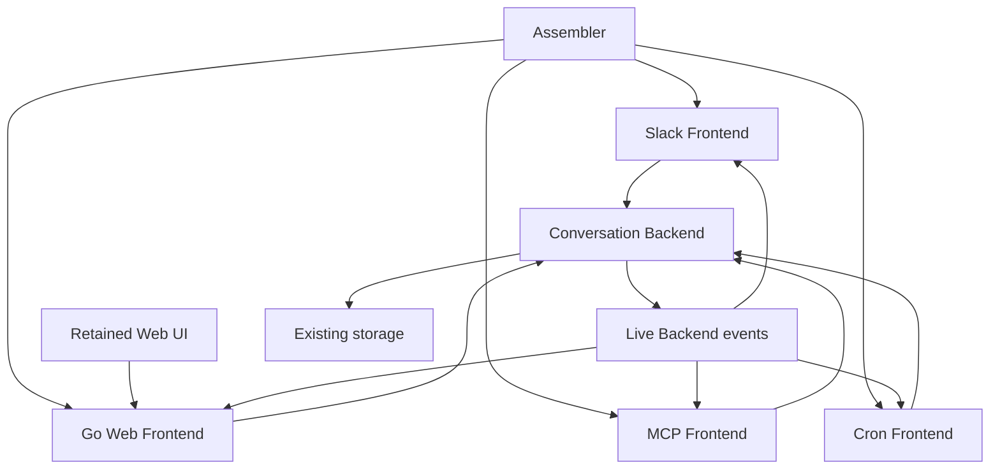

# Agnostic RocketClaw Backend

## Goal Capsule

- **Objective:** Ship the retained Web Home and let Slack, Web, MCP, and Cron use one conversation Backend without duplicating execution or delivery ownership.
- **Means:** Backend injected into Frontends; Frontends consume Backend events. The conversation operations and producer lifecycle below define the boundary.
- **Target:** `rocketclaw-backend-pointer-frontends`, https://github.com/Rocketable/platform/pull/42. Do not rebase this stack onto `main`.
- **Web baseline:** Salvage `jj diff -r voqvpqvm --git`. Use only the stable JJ change ID `voqvpqvm`. Preserve the approved UI except explicit removals. Architecture and product behavior outrank the retained protobuf; adapt wiring where needed, not the Backend to an unsuitable protocol. No UI rewrite or framework migration. (session-settled: user-directed.)
- **Authority:** Latest human decisions, then this consolidated contract. The log is evidence and lessons, not additional scope. Older plans and CONCEPTS are references only where consistent with this contract.
- **Execution:** Get the feature working first. Delete obsolete behavior and glue; reuse tests and add only necessary behavioral/gate coverage. Do not restore the discarded Backend wholesale.
- **Completion:** The single checklist and Definition of Done below. Execution progress and evidence live only in the existing `.tmp/LOGS_AND_INSIGHTS.md`.
- **Stop boundary:** No unapproved feature, migration, compatibility path, scope expansion, or metric relaxation. Ask about a concrete conflict rather than inventing a requirement.

Product Contract preservation: R1–R23 retained and reconciled with the settled decisions; R24 owns the approved removals. R16 now removes legacy shared-ID MCP support, explicitly chosen by the human during consolidation. F3 is retired with Side Ask. Existing AE1–AE12 and U1–U9 IDs are preserved; acceptance detail is consolidated into one checklist instead of duplicated per unit. The earlier 90% floor and temporary CLOC increase are superseded by unchanged repository gates.

---

## Product Contract

### Summary

One Backend owns conversation execution, ordering, persistence, and live events. Slack, Web, External MCP, and Cron compose its operations. Producer work runs privately, then Sync exposes it to the associated human conversation. Retain the approved Web UI and remove the unused surfaces in R15/R24.

### Problem Frame

The current source couples Runtime to Slack callbacks, keeps Cron in Backend, and splits delivery between originator responses and broadcast copying. The previous replacement accumulated competing owners and passed shallow checks while losing content, resetting agents, or running work on the wrong conversation. This plan replaces those paths, not layers another implementation over them.

### Actors and Vocabulary

- A1: maintainer; A2: Slack human; A3: Web human; A4: MCP client; A5: Cron Frontend; A6: process assembler.
- **X:** private producer conversation locked to one agent. **Y:** associated user-facing conversation. X and Y are distinct; sharing a conversation across Slack and Web means sharing Y, not merging X with Y.
- **Producer occupancy:** exclusive conversation ownership from admission through private execution and successful Sync. Human input and competing producer calls wait; interruption remains available.

### Requirements

**Backend and events**

- R1. Backend operations do not name Slack, Web, External MCP, or Cron. Frontends receive Backend as a dependency; Backend does not import Frontends or parse transport-specific conversation IDs.
- R2. Subscribe returns live events; each Frontend handles only applicable events. Frontends own rendering and interactions; no second originator response path delivers the same output.
- R3. Subscribe is not replay. Reconnection obtains recorded conversations/history separately and resumes live consumption without presenting history as new output.

**Conversations and configuration**

- R4. Frontends create and continue stable, opaque conversation IDs. Slack and Web operate on the same Y; producer Frontends operate on X and Sync into Y. Existing locator-bearing IDs stay unchanged.
- R5. CreateConversation records an explicit conversation before RunTurn; there is no separate public Mint. X keeps its locked agent. Store the selected agent, not a permitted-agent snapshot. Existing-conversation operations must not reset selection to a default.
  - Slack-created/associated Y uses its channel's current configured agents, including when opened in Web. Web-created conversations offer all loaded agent definitions at creation and switching. (session-settled: user-directed.)
  - Configuration JSON changes require restart. Asset reload does not reread configuration JSON. Existing human-, Cron-, and MCP-created threads remain switchable after reconfiguration without changing IDs/history.
- R6. ListConversations returns explicitly recorded conversations for Frontend rebinding. Frontend/assembler composition resolves current agent choices and presentation from existing configuration/records; selected-agent data is not an allowed-agent list. Backend listing does not discover private IDs from the MCP pair table.
- R7. SyncConversation copies caller-named source into an existing destination, without minting. It waits for unrelated active destination work, copies entries not already there, and preserves destination-only history. It must not wait on its own producer occupancy.

**Producers and turns**

- R8. MCP resolves or creates X/Y using `session_prompt`'s external conversation ID. Repeated IDs continue the same recorded pair and locked agent. Each message supplies internal `agent` and `slack_channel`; preserve existing required-input and channel-binding behavior. Scheduled Cron creates fresh X/Y; root `$cron` creates fresh X/Y using the invoking root's Slack thread; in-thread `$cron` creates fresh X and reuses existing Y.
- R9. Producer copying is X→Y only. Human Y history never copies into X. Producer output is rendered on Y only after Sync. `rocketclaw_schedule_message`, `rocketclaw_reset_scheduled_messages`, and `rocketclaw_i_want_human_partner_to_see_this` stay inert on X; their effects are fulfilled on Y through Sync.
- R10. Frontends interpret user-facing and Cron presentation from existing records. X is private; Y is user-facing; `created_by=cron` denotes Cron presentation. No tags column, tag backfill, or general tag-mutation feature.
- R11. RunTurn is the blocking work operation, with prompt, steer, enqueue, cancel, goal, and workflow kinds. It completes after the submitted work's processing and final handling, not merely acceptance or buffering. Observable output uses Backend events, not a request's private response stream.
  - During a human turn, an accepted steer joins that turn while input is open. Idle steer starts a turn; after input cutoff it runs next in Backend arrival order, even if final output is still being delivered. Frontends do not choose prompt versus steer using a busy check.
  - Enqueue completes after its turn runs; goal completes after terminal goal accounting/delivery, not its first iteration. Preserve workflow completion and silent output. Producer occupancy in R14 overrides human-turn steering admission.
- R12. Cron owns Markdown job loading, clock, and existing schedule state as a Frontend. Its file supplies X's agent and configured Slack destination; that destination supplies Y's agent choices, never a fallback to X's agent. Use R8 for invocation-specific creation and R14 for lifecycle.
- R13. A Frontend may interrupt work started by another Frontend. Cancel targets the active owner: during a producer operation, stop X rather than idle Y. Both MCP and Cron then Sync surviving work into Y before waiting work resumes. Cancellation is observable even with an empty final answer; do not change existing shell cancellation policy.
- R14. Backend owns same-conversation admission and arrival order. MCP `session_prompt` and scheduled/one-off Cron occupy their conversation across RunTurn(X) and Sync(X,Y). Human steers/enqueues and competing producer calls wait; none modifies, replaces, or overlaps active X.
  - After normal completion, run error, or interruption, always Sync surviving X work. Interruption does not cancel that required Sync. Only successful Sync releases waiting work. Preserve waiting message kinds, order, content, and principal. No automatic retry/recovery framework is requested. (session-settled: user-approved — one interruption rule for both producers.)

**Existing data and removals**

- R15. Delete Development MCP, including its configuration, serving, overlay try-turn/lint, and dedicated types/tests/docs. Reload and Restart remain existing permissioned model tools, not new public Backend management operations. Do not revive `fc`.
- R16. Existing paired MCP calls read `external_mcp_sessions` in the MCP Frontend path: retain X, Y, locked agent, binding, and history. No startup sweep, discovery feature, replacement IDs, pair backfill, or migration-on-read.
  - Remove the legacy branch that continues directly on Y when private X is absent, plus its dedicated tests. Such records are no longer supported for continuation. Do not invent X, delete their stored history, or add a replacement rejection contract. Current source/test support for shared IDs is intentionally removed. (session-settled: user-directed — chosen over retaining an exception to X/Y isolation.)
- R17. Existing human Slack threads retain their IDs/history and use current channel policy. No allowed-agent or presentation backfill.
- R18. Historical unregistered `cron:` / `one-off-cron:` entries are not newly discovered as conversations. Preserve ordinary pruning; no prefix-special migration.
- R19. Earlier empty-active-turn/no-Web-data observations are historical, not a cutover guarantee. Recheck actual active work before execution-time deployment; preserve existing queue/schedule/recovery behavior. Do not migrate discarded scratch Web sessions into production.
- R20. Development MCP removal needs no production data migration. Earlier configuration observations must not be treated as current service state.
- R21. Existing Cron-managed Slack conversations remain listed as Y. Prune eligible managed rows with no entries, but retain rows protected by live MCP pairs; preserve pair pruning when both sides are stale. Verify using existing state/logs, not new instrumentation. Historical row counts are not fixed acceptance totals.
- R22. Web lists, loads, and deletes `session_entries` by conversation ID. Entry deletion does not silently delete conversation/goal records; ordinary GC remains responsible. No replacement one-shot inspection CLI.
- R23. Go loads configured username–IP pairs, resolves browser IP, fails closed on a miss, and passes the username as principal. TypeScript does not read RocketClaw configuration or use Tailscale WhoIs. Queued/promoted work retains its original principal.
- R24. Delete `rocketclaw exec`, `rocketclaw doctor`, `rocketclaw setup` including `setup files`, and Side Ask on all surfaces. Remove dedicated implementations, call sites, controls, RPC/protocol definitions, tests, docs, and examples. No stubs, compatibility shims, or new unknown-field/rejection tests. Preserve shared configuration loading/assets and other retained behavior.

### Key Flows

- F1 (R8–R14, R16): MCP resolves the external ID to existing X/Y or creates a new pair, obtains producer occupancy, runs X, always Syncs X→Y, then completes the call and permits waiting work. Preserve MCP answer/attachment response behavior; do not collect an incomplete answer from a lossy subscription.
- F2 (R4–R6, R9, R11): Slack/Web humans continue Y with current policy and preserved source content. During producer occupancy they wait; otherwise ordinary steer rules apply. X is unchanged.
- F4 (R8, R12–R14): Cron chooses fresh/reused Y by invocation, creates fresh X, then uses the same producer lifecycle as MCP. No distinct Cron queue or interruption implementation.
- F5 (R13): Cross-surface stop targets current work, including producer X, and observes terminal handling.
- F6 (R3, R5, R6, R17–R21): Rebind from recorded conversations/history and current configuration after restart; restore retained work using existing persistence.
- F7 (R22): Web lists/loads/deletes stored entries without adding another operator interface.

### Scope Boundaries

Only R1–R24 and the single checklist below are active scope. Preserve the existing permissions and remaining CLI/UI controls exercised there. No new frameworks, locator redesign, arbitrary tag APIs, dependency-upgrade campaign, new auth system, workflow resumability, or unrelated RocketCode changes. The approved queue-kind column is the only schema change.

No blocking product question remains after removal of legacy shared-ID MCP support. Exact private names, event payload layout, and wire signatures are implementation choices constrained by the observable requirements, not permission to add behavior.

---

## Planning Contract

### Key Technical Decisions

- KTD1. Keep one consumer-facing Backend interface in `frontend`; cmd injects Runtime. Core operations are Subscribe, CreateConversation, RunTurn, SyncConversation, and ListConversations, with only the existing retained queue/agent/entry operations needed by the checklist. Backend does not depend on Frontends. (R1–R7, R11)
- KTD2. Use existing selected-agent/creator records. Frontend/assembler code resolves allowed choices, channel names, and presentation; do not derive policy from display titles or singleton agent lists. Only add `thread_queue.kind TEXT NOT NULL DEFAULT 'enqueue'`; choose its migration number from the current tree, not a discarded branch. (R5, R6, R10, R17; session-settled: user-directed.)
- KTD3. Sync preserves destination-only entries and transfers producer effects without executing them on X. Reuse existing entry/state storage; no second history store or text deduplication. (R7, R9)
- KTD4. X events are private; Y events after Sync drive user-facing delivery. Preserve progress/final meaning, empty terminal events, attachments, interactive questions, and completion handling using the existing event concepts. Live-only does not mean a successful blocking call may lose its own final answer. (R2, R3, R9, R11, R13)
- KTD5. Replace live MCP dual-write and originator-response delivery with the conversation/event flow. A completed MCP response may read the completed turn's stored output; it must preserve the public response contract and wait for Sync. No parallel private live response consumer. (R8, R11, F1)
- KTD6. Delete cmd's transcript copy loop and obsolete transport-shaped Runtime/router surface as their replacements land. Slack rendering, root creation, and interaction handling remain Slack-owned. Do not leave both delivery paths active. (R1, R2)
- KTD7. MCP Frontend owns pair lookup/write through existing store access. ListConversations does not join the pair table or require a local X-union discovery helper. For a known private X missing a managed row, explicit CreateConversation may record that same ID before RunTurn; this is ordinary admission, not a sweep/backfill. Do not recreate Y or reset its selected agent. (R5, R6, R8, R16)
- KTD8. Remove Development MCP and reuse its necessary entry read/delete storage behavior behind Go Web RPC, without restoring its door. (R15, R22)
- KTD9. Adjust existing prune predicates and their targeted tests, not a migration or audit subsystem. (R18, R21)
- KTD10. Keep repository budgets unchanged. The current `internal/rocketclaw/Makefile` source limit is 20350, not the old plan's 21100/22600. No temporary increase; delete approved dead surfaces first. Keep the existing coverage no-decrease gate, not a 90% target. (session-settled: user-directed — unchanged gates instead of expanding metric work.)
- KTD11. Transport-specific IDs remain opaque in Backend. Frontend/assembler resolution uses existing records/locators without introducing Backend Slack lookup operations. (R1, R4, R6)
- KTD12. Cmd supplies producer Frontends with Slack-owned root creation. Producers do not call a Backend Relay method. Reuse existing interfaces/implementations rather than injected function wrappers. (R1, R8)
- KTD13. Reuse the current conversation/pair admission and persistence concepts for one generic producer lifetime spanning RunTurn and Sync. Pass caller-known X/Y ownership through the composition; do not teach Backend how to look up MCP or Cron relationships. Human and competing-producer admission share that ownership. Cancel signals active X; Sync uses a lifetime not cancelled by that signal. No frontend busy-check race, lock-holder goroutine, extra selector, or self-waiting Sync. (R7, R11–R14)

### High-Level Technical Design



```mermaid
sequenceDiagram
    participant P as MCP or Cron Frontend
    participant B as Backend
    participant H as Human or competing producer
    P->>B: Begin ordered producer work for X and Y
    P->>B: RunTurn X
    H->>B: Submit work for occupied conversation
    Note over B: Hold waiting work in arrival order
    opt User interrupts
        H->>B: Cancel active owner
        B-->>P: X stopped
    end
    B-->>P: X finished, failed, or interrupted
    P->>B: Sync X into Y
    alt Sync succeeds
        B-->>H: Y events; waiting work becomes eligible
        B-->>P: Producer call completes
    else Sync fails
        B-->>P: Report failure
        Note over B: Do not release waiting work
    end
```

The diagram describes ownership, not additional public API names. Do not implement it as another queue framework. Existing `store.go` pair gates and `Bridge.loop` are reuse points, not proof that their present behavior satisfies R14.

### Hard Execution Boundary

Every change must satisfy a checklist item or fix a regression caused by this implementation. Discovery alone authorizes no feature, migration, abstraction, compatibility behavior, cleanup campaign, or audit. Record unrelated findings without fixing them; ask before necessary scope expansion.

Prefer deletion and the lowest owning layer. Do not hide duplicate execution/output with deduplication. Preserve schedules until actual turn start, recurring due-time semantics, queue fairness, original source content, and original principal. Do not create competing timer/Sync selectors.

Subsequent goal cycles resume the next unfinished item from current source and recorded evidence. They do not repeat plan consolidation, setup, history folding, or passing comparisons without a concrete reason. Use bounded independent subagents when useful, preferably blocking, with exclusive file ownership; integrate before global mutating checks. No alternative implementation engine mid-unit.

Use `jj`, stable change IDs, and `jj diff --git`; preserve human changes. All scratch artifacts stay under the primary repository's `.tmp/`. Do not lower or evade gates. Use mockery v3 through `go generate` with the matryer template if a new interface mock is necessary; no `stretchr/testify/mock`, hand-written substitutes, or test framework rewrite. Apply repository Go standards to changed code. Honor Musk's order: question requirements, delete, simplify, accelerate, automate—not reopen settled decisions.

### Sources and Current Starting Points

- Current source: `cmd/rocketclaw/{main,assemble,mcp,copy}.go`, `internal/rocketclaw/backend/{runtime,store,store_dao,thread_bridges,bridge,app,manager}.go`, `internal/rocketclaw/protocol`, and Slack/External MCP Frontends. Runtime currently exposes AttachSlack; Cron remains in Backend; the Go RPC Frontend is absent from this retained baseline.
- Retained UI/integration: `web/src`, `web/app`, `web/proto/web.proto`, `web/Makefile`, `web/package.json` at `voqvpqvm`. The current TypeScript WhoIs passes through IP; it is not Go-side authentication proof.
- Persistence: current migrations `001_init.sql` through `005_drop_store_bootstrap.sql`; `managed_conversations`, `external_mcp_sessions`, `active_turns`, `pending_steers`, queue/schedule state. Do not assume discarded migrations 006/007 exist.
- Vocabulary/control baseline: `CONCEPTS.md`, `cmd/rocketclaw/CHEATSHEET.md`. Their Side Ask, Development MCP, Cron location, and shared-MCP statements must change with the shipped code.
- Learnings: `docs/solutions/architecture-patterns/durable-session-inspect-delete-on-development-mcp.md` and Slack redelivery solutions. Apply only their still-retained behavior.
- `.tmp/LOGS_AND_INSIGHTS.md` holds fixture/evidence locations and the superseded-lesson index. `.tmp` here refers to the primary platform repository, not a second scratch directory inside its nested workspaces. External research is unnecessary for this consolidation.

---

## Implementation Units

Units retain their IDs but do not duplicate the acceptance checklist. Work order: U1/U9 deletions → U2 → U3 with U8 replacement/deletion alongside it → U4/U5 → U7 → U6 → finish U8 → delivery. Connected changes form integrated units, not endlessly delegated micro-fixes.

### U1. Delete Development MCP

- **Goal / requirements:** Remove its door and dedicated behavior; R15, KTD8.
- **Dependencies:** none.
- **Files:** `frontend/developmentmcp`, `backend/development_*`, `protocol/development.go` under `internal/rocketclaw`; config and cmd wiring; dedicated tests/docs.
- **Approach:** Delete the feature throughout. Keep storage functions needed by R22 and permissioned Reload/Restart tools.
- **Scenarios / verification:** AE7; no new removed-field rejection tests.

### U2. Existing conversations, queue kind, and GC

- **Goal / requirements:** Preserve existing records with the one approved migration; R5, R6, R16–R21, KTD2/KTD7/KTD9.
- **Dependencies:** none; coordinate deletions with U1/U9.
- **Files:** `internal/rocketclaw/backend/{store,store_dao,store_schema,store_test}.go`, migrations, existing recovery tests.
- **Approach:** Keep listing based on recorded conversations; MCP lookup stays at the producer boundary. Update queue-kind storage and existing prune predicates without extra tables, markers, discovery, or instrumentation.
- **Scenarios / verification:** AE9, AE10, W1; existing store tests cover default enqueue and reopen, pair protection, queue order/kind, and retention.

### U3. One Backend execution and event owner

- **Goal / requirements:** R1–R14, KTD1–KTD6/KTD11/KTD13.
- **Dependencies:** U2.
- **Files:** `internal/rocketclaw/backend/{runtime,bridge,thread_bridges,app}.go` and corresponding tests; `protocol` types; consumer interface in `frontend`.
- **Approach:** Own admission, producer lifetime, active/late steer decision, completion, and event fan-out in existing conversation machinery. Carry original acquired input data instead of reconstructing text-only messages. Remove replaced paths concurrently with U8.
- **Scenarios / verification:** AE1–AE4, AE6, AE8, AE12, T4, T6, T7, P7, W1, ARCH1, ARCH2. Reuse narrow existing regressions; do not recreate discarded scaffolding.

### U4. MCP composition

- **Goal / requirements:** R8, R9, R13, R14, R16; F1; KTD5/KTD7/KTD12/KTD13.
- **Dependencies:** U3; share Slack root wiring with U5.
- **Files:** `cmd/rocketclaw/{mcp,mcp_test}.go`, `internal/rocketclaw/frontend/externalmcp/{server,server_test}.go`, existing pair DAO call sites.
- **Approach:** Resolve/create the pair at the frontend, explicitly admit existing X if needed, execute the shared producer lifecycle, and return the complete public answer/attachments. Delete shared-ID fallback, local busy scheduling, and live dual-write paths.
- **Scenarios / verification:** AE1, AE5, AE6, AE9, P1, P7, REM1; reused IDs and requested-agent mismatch retain the recorded locked agent. Channel mismatch retains its existing error behavior.

### U5. Slack on Backend

- **Goal / requirements:** R1–R6, R9–R14, R17; F2/F5; KTD6/KTD11/KTD12.
- **Dependencies:** U3.
- **Files:** `internal/rocketclaw/frontend/slack/{connector,connector_test,adhoc_callout_test}.go`, existing action/source-content tests, cmd wiring.
- **Approach:** Use Backend execution and events; keep acquisition, rendering, authorization, and root/interaction handling in Slack. Preserve selected agents, content, routing, redelivery, and queue-control identities. Do not keep a competing Slack work queue.
- **Scenarios / verification:** S1–S5, AE2–AE6, AE12, T4, T6, T7. Existing message-menu controls cover interrupt, drop, and promote; Side Ask is removed in U9.

### U6. Salvage Web and connect Go RPC

- **Goal / requirements:** R1–R7, R11, R13, R14, R22, R23; KTD1/KTD4/KTD8/KTD11; preserve `voqvpqvm` UI.
- **Dependencies:** U1, U3, U7, U9.
- **Files:** Go Frontend in `internal/rocketclaw/frontend/rpc` with focused server/home tests; cmd/config wiring; retained `web/src`, `web/app`, proto and associated tests only where needed.
- **Approach:** Implement the agreed behavior behind the retained UI. Adapt both sides of the protocol only where necessary. Go resolves identity; all loaded definitions are available for Web-created sessions. Existing-session operations preserve selection/principal. Cron RPC uses the injected Cron Frontend. Entry operations reuse storage, not removed Development MCP serving.
- **Scenarios / verification:** AE2–AE6, AE8, AE11, AE12, T4, T6, T7, W3–W6; retained Web tests/build and desktop/mobile browser checks.

### U7. Cron Frontend

- **Goal / requirements:** R8–R14; F4; KTD12/KTD13.
- **Dependencies:** U3, U5.
- **Files:** move relevant `backend/manager.go`/Cron raw-run ownership to `internal/rocketclaw/frontend/cron` with focused tests; cmd assembly and Slack invocation.
- **Approach:** Move the clock/file loading, retain existing schedule tables and timing, and use the same ordered producer lifecycle as MCP. Existing Y is not recreated. No separate Cron backlog, extra worker wrapper, or early release.
- **Scenarios / verification:** AE1, AE5, AE6, P4, P5, P7, W1; small bounded jobs, not repeated HEARTBEAT runs.

### U8. Remove replaced glue

- **Goal / requirements:** R1–R3; KTD6/KTD10/KTD11.
- **Dependencies:** perform alongside U3–U7; final closure after U6.
- **Files:** `cmd/rocketclaw/copy.go` and dedicated tests; old public router/Runtime transport methods and replaced callback/response consumers in Backend/protocol.
- **Approach:** Delete superseded owners as replacements work. Preserve required interaction behavior through Frontends; do not erase behavior just because its old transport-shaped entry point is removed.
- **Scenarios / verification:** ARCH1/ARCH2 and affected existing behavioral cases; final unchanged gates. No budget increase or unrelated cleanup.

### U9. Remove unused CLI commands and Side Ask

- **Goal / requirements:** R24.
- **Dependencies:** none; perform alongside U1.
- **Files:** command implementations/dispatch/help in `cmd/rocketclaw`; Side Ask Backend, Slack/Web controls, RPC/proto wiring, dedicated tests/docs/examples.
- **Approach:** Delete rather than port these features. Preserve shared runtime/config/asset code. Limit retained UI changes to the removed controls and required wiring.
- **Scenarios / verification:** REM1 and surviving CLI/Web checks; do not rerun old exec, doctor, setup, or Side Ask comparisons.

---

## Verification Contract

**Cron filename decision (human-directed):** Skip the `:` → `_` replacement. Preserve the exact Cron job relative path in new run IDs; do not normalize job names or guess original names from previously normalized IDs. W6 history implementation must respect this decision. This does not authorize a migration, backfill, compatibility layer, or rewrite of existing records.

**Settle persistence authorization:** The human explicitly approved “Add the migration for settle.” This permits the minimal managed-conversation `settled` boolean migration and its Backend/RPC persistence wiring required by W6, as an exception to KTD2/U2's earlier migration limit. Settling preserves history, goals, selected agent, creator, and active execution; it is not deletion or cancellation. No broader schema change is authorized.

**Slack verification authorization (2026-09-05):** The human explicitly approved direct, read-only Slack API calls to inspect existing verification messages, including Blocks omitted by `rocketable-scli`. This supplements CLI readback; it does not authorize posting or editing through the API. Keep verification restricted to `hallymaschine-sudo` (`C0BHP0B2HQC`), keep credentials private, and store receipts under the repository's `.tmp/`. Continue using `ulderico-scli` for human gestures. This changes the permitted evidence-acquisition method, not the frozen acceptance scope.

### Single Closed Acceptance Checklist

This is the only acceptance inventory. Per-unit references point here; they do not add scenarios. Rows are checks, not a demand for a new test per row. Multiple rows may share a bounded fixture/run. Keep results and evidence in the existing log, not a second checklist document.

**Types:** Retained = preserve observed behavior; Changed = intentional agreed behavior/addition; Removal = absence, not compatibility testing; Architecture = source ownership/API check. Mixed rows name the relevant intentional change.

**Evidence:** Paired = valid main baseline then candidate gesture, with relevant output/logs/DB through completion. Local = existing or minimal targeted behavioral test using the production abstraction. Browser = retained UI exercised against Go, not RPC stubs alone. Source = concrete call-chain/absence inspection. Each row's named evidence is required; a passing mock-only request recorder does not prove lifecycle completion.

| ID | Type / covers | Concrete gesture and expected result | Evidence |
| --- | --- | --- | --- |
| AE1 | Changed; R7–R9 | Run producer X, Sync twice, reply on Y, then continue X. No X output appears on Y before Sync; copied entries/effects are not duplicated; Y-only history stays off X. | Paired for common behavior; Local ordered Sync/state check for intentional differences. |
| AE2 | Changed; R2, R11, R14 | Submit Slack and Web work to the same Y. Both finish in Backend order, with consistent user-facing events and no frontend busy race. | Paired Slack baseline; Browser/Local cross-surface lifecycle. |
| AE3 | Retained/Changed completion; R11 | Enqueue during an active turn and while idle. Preserve framing, activation, author and order; blocking request returns after its actual turn completes. | Paired; Local return-boundary check. |
| AE4 | Retained/Changed cross-surface; R13 | Stop via Slack command/reaction/message action and Web on a Slack-started turn. Correct work stops; terminal state is observed even with empty output. Existing detached shell behavior is unchanged. | Paired; Browser/Local terminal and return-boundary check. |
| AE5 | Retained; R5, R6, R8, R17 | Switch agent, send an ordinary reply, then change channel agents and restart. Repeat on existing human-, Cron-, and MCP-created Y. New choices work, removed choices are unavailable, and IDs/history/selected agent persist; X stays locked. | Paired; selected agent in execution logs and terminal DB, not just a switch card. |
| AE6 | Changed; R8, R11–R14 | For MCP and in-thread Cron, send steer, enqueue, and a competing same-conversation producer call during X. Observe normal finish, interruption after persisted partial work, and run error. None modifies X or starts before Sync; surviving work reaches Y and waiting work resumes in order. Failed Sync does not release waiting work. | Paired normal/interrupted bounded runs; Local run-error/Sync-failure and competing-call ordering. |
| AE7 | Removal; R15, R20 | Development MCP serving/config/try-turn surface is absent. Reload/Restart remain permissioned model tools. No fc is introduced. | Source; retained startup/tool checks. |
| AE8 | Retained/Changed events; R2, R3, R6 | Reconnect/restart a Frontend. Obtain stored history/conversations and consume new events without replaying old output as new or losing the attached call's final event. | Local event/history boundary; Browser reconnect. |
| AE9 | Retained; R5, R6, R16 | Continue a pre-existing paired external ID before/after restart. Resolve its original X/Y and locked agent, keep Y's history/selection, and avoid any pair replacement or discovery/backfill. Private IDs need not appear via Backend's pair-table join. | Paired; existing-store Local test and pair/entry identity checks. |
| AE10 | Retained/Changed GC; R18, R21 | List existing Cron Y, exclude unregistered historical Cron entries, prune eligible empty managed rows, retain pair-protected rows, and prune stale pairs/orphan history under existing retention rules. | Local real-store tests and before/after DB; existing prune logs where available. |
| AE11 | Changed; R22 | In Web, list/load/delete entries for a conversation. Correct entries disappear; unrelated entries and conversation/goal records are not silently deleted. | Browser plus RPC/store state. |
| AE12 | Changed/Retained active steer; R11, R14 | Steer while idle, during Bash/tool execution, and after final input cutoff. Start a turn, alter the same active turn, or run next respectively; preserve arrival order and wait for completion. Producer-held steers follow AE6. | Paired active Slack fixture; Browser/Local idle, late, routing and return-boundary checks. |
| C1 | Retained; R15, R19, R24 | No arguments/help and run with missing/invalid config retain output/exit meaning except removed command text. Valid configured startup connects retained frontends; shutdown ends cleanly. | Existing paired CLI evidence plus candidate/startup logs. |
| C3 | Retained after removals | Run lint and agent-graph for current/next assets in existing isolated fixtures; preserve meaningful output and exit status. No setup/files/doctor comparison remains. | Existing paired inspection evidence; candidate rerun only if relevant code changes. |
| C4 | Retained; R5, R23 | Preserve oai credential-command and secrets-configuration contracts in isolated config/auth fixtures. Configuration JSON needs restart; asset reload does not reread it. Do not alter live login state for a comparison. | Source/existing tests for untouched auth; paired applicable config/reload behavior. |
| S1 | Retained; R4, R5, R17 | Start authorized root conversation, adopt unmanaged thread with history, and continue managed Y. Preserve mapped/unmapped joined-channel and group-DM routing, mentions, and authorization; no new 1:1-DM feature. | Paired representative root/adoption/reply; existing Local authorization/routing cases. |
| S2 | Retained; R5, R11 | Send a text file, an image, and forwarded-thread content. Model-visible input retains acquired content, original source/principal, and outbound destination, including queued content. | Paired text-file fixture; Local image/forwarded and queue/recovery content checks. |
| S3 | Retained; R11, R14 | Redeliver root/thread input. Do not start a duplicate turn or erase waiting human messages. | Existing Local redelivery tests through real handoff. |
| S4 | Retained; R5 | Select initial agent by root command/selector, including a prompt remainder. Ordinary reply, goal/workflow and promoted work must not silently supply a default override. | Paired root selection and AE5; Local exact content/selection assertions. |
| S5 | Retained after removals | Bare/unknown command help and agent selection retain presentation/authorization without accidental model turns. Message actions interrupt/drop/promote according to live control; Side Ask is absent. | Paired/Local existing controls; raw Blocks or interaction result, not history-only inference. |
| T4 | Retained/Changed Web controls; R11, R14, R23 | List waiting work; drop a steer/enqueue; promote enqueue during a turn; reorder through existing Web control. Removed work never runs; promoted work runs once with original content/author. Slack jump/hide remains unchanged. | Local atomic claim/order checks; paired Slack actions and Browser Web controls. |
| T6 | Retained/Changed completion; R11, R13 | Run a bounded two-turn goal to its terminal budget/completion and interrupt another. Preserve check-script/accounting rules, silent handling, and exactly intended answer cards. Original request waits for terminal handling, not first iteration. | Paired two-turn fixture; Local completion/silent/check-script cases. |
| T7 | Retained; R11, R13 | Run a small saved workflow to final output and interruption, including existing interactive-question handling. Preserve progress, final/silent output, history and foreground occupancy. Restart does not invent resumable workflow progress. | Paired bounded workflow/interaction; Local silent/stop cases. |
| P1 | Retained/Changed blocking; R8, R14 | New then repeated session_prompt ID preserves required fields, attachment/input response, channel mismatch behavior, and original locked agent despite a different requested agent. Call returns only after Sync. | Paired MCP response/identity; Local required-input and channel-binding cases. |
| P4 | Changed; R8, R12 | Fire one small scheduled job twice and run root $cron. Scheduled fires have distinct X/Y; root invocation uses its root's Slack thread. Bare job listing and Web Cron list/run show/use the configured jobs. | Paired Cron fixtures; Browser list/run and terminal IDs. |
| P5 | Changed; R8, R9 | Run in-thread $cron twice. X changes each time; Y, its history, and selected agent remain. No Y→X copy. | Paired; explicit before/after IDs, history and agent checks. |
| P7 | Changed; R9 | On X request human-visible content, schedule A, reset A, then schedule B that becomes overdue. Nothing executes/delivers on X; after Sync, intended content appears on Y, A never runs and B runs once on Y. | Paired fixture with intentional main differences recorded; Local timer/Sync overlap and restart test. |
| W1 | Retained/Changed queue kind; R11, R14, R19 | Reopen with waiting work/schedules and recover existing active-turn/goal state. Preserve kind/order/content/principal; schedules stay stored until actual turn start; recurring due times and existing queue fairness remain. Old queue rows default to enqueue. | Local real-store/recovery/timing checks; paired bounded restart lifecycle. |
| W3 | Retained/Changed Web addition; R2–R6 | Open a Slack Y in Web and reconnect. Same ID/history/agent and new user-facing output, with no duplicate final delivery or private-X rendering. | Browser plus AE5/AE8 state/event evidence. |
| W4 | Changed; R23 | Configured browser IP resolves in Go to username; unknown IP fails closed. Prompt/queue/promotion retain original username. TypeScript never reads configuration. | Browser/RPC/DB principal checks; Source identity boundary. |
| W5 | Changed; R5 | Create Web conversation with nondefault agent, prompt, then switch. Offer all loaded agents and retain selection. Opening Slack Y uses its channel choices instead. | Browser; execution agent and stored selection. |
| W6 | Changed; UI baseline, R22 | Exercise retained session list/open/history, settle/unsettle, agent/skill/config views, Cron controls and entry inspection on desktop/mobile. Keep approved appearance except removed controls; no redesign. | Browser against real Go; retained Web tests/build; AE11/P4 cover data operations. |
| REM1 | Removal; R16, R24 | exec/doctor/setup including files, Side Ask, and legacy shared-ID MCP continuation are absent from dedicated implementation, callers, controls, protocol, docs/examples/tests. Shared retained code/data remains. No replacement stubs/rejection features. | Source and retained command/UI checks, not deleted-feature replay. |
| ARCH1 | Architecture; R1, R4, R6, R12 | Cmd injects Backend into Frontends; Backend does not import Frontends, parse transport IDs, or expose transport-named operations. Cron clock/load belongs to its Frontend. | Actual interfaces, constructors, imports and call chains; name grep alone is insufficient. |
| ARCH2 | Architecture; R2, R11, R14 | One Backend event/delivery owner and one same-conversation admission/later-work owner. Old router/copy/private response paths are deleted, not hidden behind wrappers. | Source ownership trace plus AE1–AE6, AE12, P7 lifecycle proof. |

### Evidence and Gate Rules

- Reuse valid main baselines/fixtures from the log. Verify the artifact and its applicability before closing a row. Old discarded-PR success is diagnostic history, not proof for the new implementation. Re-run a passing case only when relevant changes invalidate it.
- Deploy main then candidate for missing/invalidated paired evidence. Use small controlled jobs; do not interrupt an unfinished comparison to replace the binary. Capture exact conversation/message IDs, relevant raw Slack Blocks, execution logs, queued state, saved history, Sync, and terminal completion. Cards/reactions or empty active-row counts alone are insufficient.
- Use the existing `rocketable-scli` reader and `ulderico-scli` posting scripts in the sibling rocketclaw working directory; local paths and fixtures are indexed in the log. Never expose credentials or mutate live login/config for a fixture. Web-only additions are checked against this contract; do not repeatedly prove main lacks Web.
- Implement first, reuse tests, and add only necessary agreed behavioral/gate tests. Removal checks do not require new tests for removed behavior. No broad test scaffold or coverage project.
- Required final commands: `gofmt` on touched Go files, `go test ./...`, `make lint`, `make test`. Also run retained Web tests/build for Web changes. The Makefile's coverage no-decrease and source-size gates remain unchanged; 90% overall is not a target. Do not pass overrides to evade budgets.
- Use isolated Docker PostgreSQL and repository `.tmp` for temporary files. The existing verification fixture uses database `rocketclaw_test` on port 55435; revalidate availability before use. Set the test database URL for Go tests, and include GOPATH/bin for existing generator tools. Generation/vendor/lint can mutate files: integrate owners, run those serially, preserve linter edits, then build the candidate.
- Record each row's evidence/result and specific failure in the existing log. Each goal cycle names closed items, remaining count, next action, and justification for repetition. A new finding must map to a row or await scope approval. Do not introduce arbitrary command combinations after the checklist closes.

---

## Definition of Done

1. R1–R24 and U1–U9 are implemented; every row of the single checklist has sufficient current evidence. All intentional main differences are explained by this contract; no verified subset substitutes for the full scope.
2. Required Go/Web checks and unchanged coverage/source-size gates pass on the delivered tree. Preserve formatter/linter changes. Remove abandoned experiments and scratch-only live allowances without deleting human work.
3. Update README, command help, CHEATSHEET, and CONCEPTS only for shipped removals, Backend/Frontend ownership, producer lifecycle, Web identity, and entry inspection. No unrelated documentation campaign.
4. Publish exactly four commits on PR 42, in order: (1) OpenCode goal plugin; (2) architectural refactor and behavioral fixes, with no Web Interface mention in its message; (3) Go Web Interface; (4) TypeScript Web Interface. Verify contents and resulting tree, not only descriptions. Use JJ change IDs; no rebase onto main.
5. Push the bookmark and inspect the actual remote four-commit stack and CI results. Finish comparison-service shutdown and production handback, including any interrupted production work's existing recovery. Do not claim a service was restored from an old PID or a historical log.
6. Once these conditions hold, finish the goal. Do not reopen setup/planning, repeat unchanged comparisons, or invent further improvements. Setup consolidation is complete; later cycles execute the next unfinished item.
