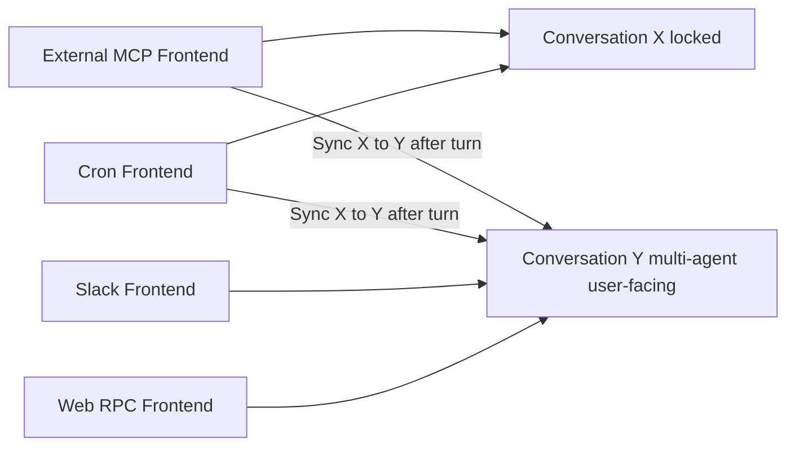
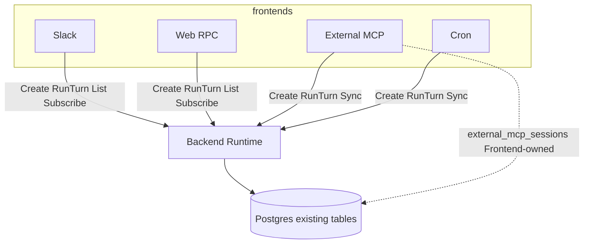
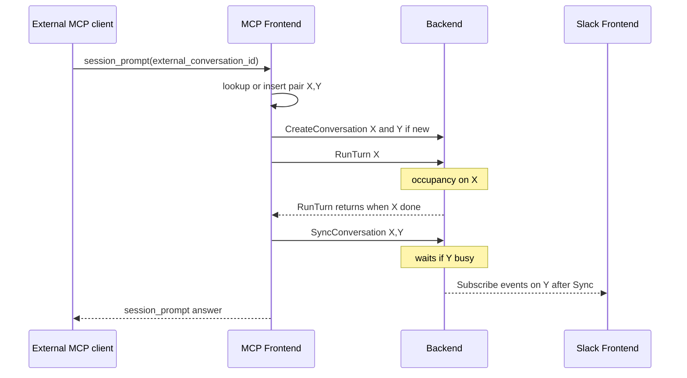

# Agnostic RocketClaw Backend

## Goal Capsule

- **Objective:** A maintainer can add or change a Frontend using one small Backend of conversation building blocks, without teaching the engine Slack, Web, External MCP, or Cron verbs.
- **Means:** One Backend: subscribe, create conversation, run turn, sync, list. Cron is a Frontend. Development MCP is deleted. Web RPC exposes session_entries list/load/delete. (KTD1, KTD8)
- **Authority:** This Product Contract. CONCEPTS.md except where this contract supersedes Cron-in-Backend, unmerged ids, and Development MCP.
- **Stop conditions:** Stop if a Backend method must name Slack, Web, External MCP, or Cron. Stop if Development MCP is reintroduced. Stop if the RocketClaw CLOC budget stays raised after U8.
- **Execution profile:** Characterization of prune and occupancy first, then replace the glue surface. Net-delete first-party lines.
- **Target bookmark:** `rocketclaw-backend-pointer-frontends` (PR https://github.com/Rocketable/platform/pull/42). Do not start from `main`. Do not `jj rebase -d main@origin` from empty `@`.
- Product Contract preservation: changed: R22, F7, AE11 — Web RPC list/load/delete of session_entries (user-directed at plan confirm). Key Decisions added for Sync-wait, after-Sync visibility, `$cron` new pair.

## Product Contract

### Summary

RocketClaw's Backend is agnostic conversation machinery.
Frontends mint ids, tag conversations, run turns, and copy history with sync.
Slack, Web, External MCP, and Cron compose those blocks.
Development MCP is deleted.
Web RPC exposes list, load, and delete of session_entries (what `fc` used to offer).

### Problem Frame

Today each Frontend taught the Backend its verbs, so the glue surface grew to dozens of methods and named Slack, Web, and MCP.
Live fan-out was split between cmd copy and Runtime Join subscribers.
External MCP kept a private id unmerged from the Slack thread.
Development MCP held inspect/delete of stored turns.

### Key Decisions

- **Subscribe lives on the Backend.** (session-settled: user-directed — chosen over cmd copy and over Subscribe wrapping Broadcasts: fan-out is the event bus.) Governs R2.
- **One shared conversation id across Frontends.** (session-settled: user-directed — chosen over unmerged external_mcp: vs slack-thread: ids: Slack/Web/MCP share the id.) Governs R4, R8.
- **Slack thread is UI only.** (session-settled: user-directed — chosen over slack-thread: as an alias: the conversation id is not a Slack id.) Governs R4.
- **External MCP mints locked X and multi-agent Y together.** Slack and Web operate only on Y. (session-settled: user-directed — chosen over Slack observing X: humans never RunTurn on X.) Governs R8, R9, F1, F2.
- **Cron uses the same X/Y pair.** (session-settled: user-directed — chosen over Cron RunTurning a single user-facing conversation.) Governs R8, R12, F4.
- **Each Cron fire mints a new X/Y pair.** (session-settled: user-directed — chosen over reusing a pair per job.) Governs R12.
- **`$cron` also mints a new pair.** (session-settled: user-directed — chosen over staying on the invoking thread.) Governs R12.
- **Producer copy is X→Y only.** (session-settled: user-directed — chosen over Y→X.) The SyncConversation primitive copies the caller-named direction. Producer Frontends only call Sync(X, Y). Side Ask calls Sync(source, S). Governs R7, R9.
- **Humans see producer output only after Sync.** (session-settled: user-directed — chosen over live X events mapped onto Y during the turn.) Governs F1, AE1.
- **Mint policy is the agent list.** (session-settled: user-directed — chosen over RunTurn/Sync minting as a side effect.) Governs R5.
- **Catch-up is ListConversations.** (session-settled: user-directed — chosen over Subscribe replay.) Governs R3, R6.
- **Cron is a Frontend.** (session-settled: user-directed — chosen over Cron-in-Backend.) Governs R12.
- **Frontends tag conversations.** Governs R10.
- **RunTurn is the only work verb.** Governs R11, R13.
- **RunTurn blocks until that request is fully handled.** Governs R11.
- **Any Frontend can cancel.** Governs R13.
- **Backend orders concurrent RunTurns.** Governs R14.
- **Side Ask is composition, not a method.** Governs F3.
- **Development MCP is deleted.** (session-settled: user-directed — chosen over overlay/reload on this Backend.) Governs R15.
- **Inspect/delete of session_entries moves to Web RPC.** (session-settled: user-directed — chosen over keeping Development MCP or reviving `fc`.) Governs R22.
- **Web users is username–IP pairs in config.** (session-settled: user-directed — chosen over Tailscale LocalAPI WhoIs.) Governs R23.
- **Migrate in place; do not invent Cron X↔Y links.** Governs R16, R17, R18.
- **MCP migration is interpret-only.** (session-settled: user-directed — chosen over a start gate, backfill, and schema marks.) Governs R16.

### Actors

- A1. Maintainer adding or changing a Frontend
- A2. Human on Slack
- A3. Human on Web Home
- A4. External MCP client
- A5. Cron Frontend
- A6. Process assembler (`cmd`)

### Requirements

**Bus**

- R1. The Backend does not name Slack, Web, External MCP, or Cron in its operations.
- R2. Subscribe(ctx) returns a live event stream. Each Frontend reads and drops what it does not handle. Missed events are not replayed.
- R3. Subscribe is not catch-up. Catch-up is R6.

**Conversations**

- R4. Conversation ids are generated and continued by Frontends. They are stable across Frontends. Any Frontend may read or RunTurn a conversation if it chooses.
- R5. CreateConversation(id, agents, tags) records the conversation. One agent means locked-single-agent. Several agents means multi-agent. The Backend honors that. RunTurn requires the id to exist. Tags at create include user-facing when Slack and Web should render.
- R6. ListConversations returns recorded conversations (id, agents, tags) so Frontends can rebind after restart.
- R7. SyncConversation(src, dst) copies src into dst. Dst must already exist. Sync does not mint. Copy is the direction the caller names.

**Producer pair**

- R8. External MCP and Cron are producer Frontends. Each CreateConversations locked X (one agent) and multi-agent Y, tags Y user-facing, RunTurns X, then SyncConversation(X, Y). Slack and Web operate only on Y. External MCP reuses that pair when the client repeats `external_conversation_id`. A Cron fire always mints a new pair. `$cron` also mints a new pair.
- R9. Human RunTurns on Y are never synced to X.

**Tags**

- R10. Frontends tag conversations. Slack and Web render conversations tagged user-facing. Cron-produced conversations are tagged so Slack and Web can show them with Cron presentation.

**Turns**

- R11. RunTurn(ctx, request) is blocking. Request kinds: prompt, steer, enqueue, cancel, goal, workflow. It returns when that request is fully handled (steer finished; enqueue popped and that turn finished; cancel finished; prompt/goal/workflow finished). Callers read all observable output from Subscribe, not from a response channel on the request.
- R12. Cron is a Frontend: it loads job files, runs the clock, and uses R8. Every fire CreateConversations a new X and a new Y, RunTurns X, SyncConversation(X, Y). User-facing Frontends only display Y.
- R13. A Frontend that did not start the turn cancels by RunTurn kind cancel on that conversation id. The blocked RunTurn then receives a cancelled event on Subscribe and completes.
- R14. Two RunTurns on the same conversation are ordered by the Backend. Frontends do not implement their own occupancy race.

**Removal**

- R15. Development MCP is removed from the product. Overlay lint/try-turn/reload/restart are not operations on this Backend. Reload and Restart remain model tools under existing permissioning.

**Migration (production store `rocketclaw_wallace`)**

- R16. External MCP migration is new reads of existing tables. No schema change, no backfill, no migrate-on-start. `private_conversation_id` is X (locked, one agent), `managed_conversation_id` is Y (user-facing). Keep those ids. `external_mcp_sessions` stays the External MCP Frontend pair table (`external_conversation_id` → X, Y). Slack applies live channel agents when it touches Y. Y may already have more entries than X; those stay on Y only, per R9.
- R17. Human Slack threads (not MCP-managed, not Cron) are Y-only. Same interpret-only rule as R16: no schema change, no backfill. List/RunTurn the existing `slack-thread:` id as user-facing Y. Slack applies live channel agents when it touches them.
- R18. Historical `cron:` / `one-off-cron:` `session_entries` are ignore-until-prune. They are not ListConversations. No prefix-special code. Existing GC deletes them. New Cron fires mint a new X+Y pair per R12.
- R21. The 4119 `created_by=cron` Slack threads stay in managed_conversations and ListConversations as Y. GC must keep the store consistent: drop managed_conversations that have no session_entries. Audit that those rows are actually culled.
- R19. There are no `web-session:` conversations to migrate. `active_turns` is empty at the inspected snapshot, so cutover does not drain a live turn.
- R20. Development MCP is already absent from production config. R15 does not require a data migration.

**Operator inspect**

- R22. Web RPC exposes list, load, and delete of `session_entries` for a conversation id (the work `fc` and Development MCP inspect tools used to do). Do not revive `cmd/rocketclaw` `fc` or DSN one-shot CLIs.
- R23. Web Home `users` is a map of username to IP in `femtoclaw.json` / `rocketclaw.json`. The browser IP must match a configured pair. Miss fails closed. Principal is that username. Not Tailscale LocalAPI.

### Key Flows

- F1. **External MCP turn**
  - A4 starts work. External MCP Frontend CreateConversations X (locked) and Y (multi-agent, user-facing).
  - It RunTurns X. On completion it SyncConversation(X, Y).
  - Subscribe notifies. A2 and A3 see Y after Sync, including copied X content. No live thinking on Y during X.
  - **Covers:** R5, R7, R8, R10, R11

- F2. **Human reply on Y**
  - A2 or A3 RunTurns Y (prompt or steer or enqueue).
  - X is unchanged.
  - **Covers:** R9, R11, R14

- F3. **Side Ask**
  - Frontend CreateConversations S (no user-facing tag), SyncConversation(source, S), RunTurns S, reads Subscribe.
  - Occupancy is on S, not on the source conversation.
  - **Covers:** R5, R7, R10, R11

- F4. **Cron**
  - A5 loads disk, fires the clock (or Slack `$cron`), CreateConversations locked X and multi-agent user-facing Y.
  - It RunTurns X. On completion it SyncConversation(X, Y).
  - Subscribe notifies. A2 and A3 see Y after Sync. They never RunTurn X.
  - **Covers:** R5, R7, R8, R10, R12

- F5. **Stop from another surface**
  - A3 cancels a turn A2 started: RunTurn kind cancel on that id.
  - **Covers:** R13

- F6. **Restart**
  - A Frontend ListConversations, then Subscribe for live events.
  - **Covers:** R2, R3, R6

- F7. **Inspect stored turns**
  - A3 lists, loads, or deletes `session_entries` for a conversation id over Web RPC.
  - **Covers:** R22

### Acceptance Examples

- AE1. **Covers R8, R9, R11.** An External MCP or Cron turn on X appears on Slack and Web as Y after Sync, not during X. A Slack reply RunTurns Y and does not appear in the next producer turn on X.
- AE2. **Covers R11, R14.** Slack and Web RunTurn the same Y at the same time. The Backend handles them in one order. Both Frontends see the same Subscribe sequence.
- AE3. **Covers R11.** `$enqueue` RunTurn returns only after that item is popped and its turn finishes.
- AE4. **Covers R13.** Web `$stop` cancels a Slack-started turn on Y.
- AE5. **Covers R5, R8.** Switching agent on Y stays on Y. It does not mint a third conversation. X stays one-agent.
- AE6. **Covers R8, R12, R10.** A due Cron job or `$cron` mints locked X and user-facing Y, RunTurns X, Syncs to Y. Slack and Web show Y after Sync.
- AE7. **Covers R15.** After this work, Development MCP is not a served Frontend. Overlay try-turn is gone with it.
- AE8. **Covers R2, R6.** A Frontend that restarts misses live events during downtime and recovers recorded conversations from ListConversations.
- AE9. **Covers R16.** After cutover, each of the 2256 External MCP pairs ListConversations as X (not user-facing) and Y (user-facing). Slack/Web RunTurn Y. External MCP RunTurn X.
- AE10. **Covers R18, R21.** Historical `cron:` session_entries never ListConversations. The 4119 Cron Slack threads do list as Y and GC deletes managed_conversations with no session_entries. New Cron fires use R8.
- AE11. **Covers R22.** Web RPC can list, load, and delete `session_entries` for a conversation id. `rocketclaw fc` is not revived.

### Scope Boundaries

- In scope: R1–R23, Cron as a Frontend including `$cron` as a new pair, deletion of Development MCP, Web RPC inspect/delete of session_entries, config `users`, interpret-only migration, superseding cmd-owned fan-out.
- Deferred to implementation: exact Subscribe event payload; whether tags can change after CreateConversation; Side Ask history cutoff vs full Sync.
- Deferred for later: overlay lint/try-turn as product; pulling locators out of conversation id strings.
- Outside this work: Vite; keeping the CLOC budget at 22600 after U8; merging X and Y into one id; reviving `fc`.

### Success Criteria

- A new user-facing Frontend can Subscribe, ListConversations, and RunTurn without a Slack- or MCP-named Backend method.
- External MCP, Slack, and Web share conversation ids per R8–R9.
- Cron is constructed as a Frontend, uses the same X/Y/Sync pair as External MCP, and the Backend has no cron verbs.
- Development MCP is gone from the served process.
- Web RPC lists, loads, and deletes session_entries.
- `$stop`, `$enqueue`, `$goal`, `$workflow`, and Side Ask are expressed with CreateConversation, SyncConversation, and RunTurn kinds.

### Assumptions

- Prompt is a RunTurn kind for an idle conversation.
- Cancel as a RunTurn kind is the Cancel(id) any Frontend needs.
- User-facing is a create tag Frontends set on Y, not “any managed_conversations row”. X and Side Ask S are recorded without that tag. `created_by=cron` is Cron presentation. Locked vs multi-agent is one vs several agents at create. No tags column.
- Slack may keep minting `slack-thread:{channel}:{ts}` as an opaque Frontend id. Backend does not parse it.

### Outstanding Questions

- Deferred to implementation: Subscribe event payload fields.
- Deferred to implementation: tag mutation after create.

<!-- ce-section: work-relationships -->
### How This Work Fits Together

This plan owns the agnostic Backend contract, Cron as a Frontend, deletion of Development MCP, and RPC inspect/delete.
The broader layout is current understanding, not a roadmap.

- Two-channel clockwork (`docs/plans/2026-08-07-001-refactor-two-channel-clockwork-plan.md`)
  - Shares live-only events
  - This work moves fan-out onto Backend Subscribe and drops originator response channels
- Backend / frontend / protocol (`docs/plans/2026-08-29-1444-refactor-backend-frontend-protocol-plan.md`)
  - This work supersedes “cmd copies live output” and “Cron lives in the Backend”
- Backend-pointer frontends (`docs/plans/2026-09-02-2242-refactor-rocketclaw-backend-pointer-frontends-plan.md`)
  - This work continues that stack on `rocketclaw-backend-pointer-frontends` (PR https://github.com/Rocketable/platform/pull/42).
  - Web RPC already imports backend. Slack must not. Cron may take `*Runtime` like RPC.
- Web Home (`docs/plans/2026-09-01-1510-feat-rocketclaw-web-home-plan.md`)
  - Depends on shared conversation ids (R4, R8) and R22 inspect RPCs
- Development MCP inspect/delete (`docs/solutions/architecture-patterns/durable-session-inspect-delete-on-development-mcp.md`)
  - Door deleted by R15. Inspect/delete land on Web RPC (R22), not `fc`

## Planning Contract

### Key Technical Decisions

- KTD1. **`frontend.Backend` is the consumer interface.** cmd passes `*backend.Runtime`. Backend does not import `frontend`. Operations: Subscribe, CreateConversation, RunTurn, SyncConversation, ListConversations, plus conversation later-work list/delete/reorder and current-agent read/switch (not Slack-named). (session-settled product surface on R1–R7, R11)
- KTD2. **Tags and multi-agent lists are interpret-only.** No ALTER, no tags column. CreateConversation upserts `managed_conversations` for every id including locked X. Slack/Web render only user-facing Y (`slack-thread:` / Cron presentation). Cron presentation ⇔ `created_by=cron`. Slack applies live channel agents when it touches Y. Governs R5, R10, R16.
- KTD3. **SyncConversation waits until dst is idle**, then copies. RunTurn X returns when that X turn is done (R11). The producer Frontend (session_prompt / Cron fire) stays blocked until Sync returns. Copy only entries not already on dst (do not re-append history; do not wipe Y-only rows). (session-settled: user-directed — chosen over error/retry.) Governs R7, R11.
- KTD4. **No live producer stream on Y.** Subscribe events for X are not rendered on Y during the turn. Humans see Y after Sync. (session-settled: user-directed — chosen over mapping X events to Y UI.) Governs F1, AE1.
- KTD5. **Replace `appendExternalMCPEntry` dual-write with Sync after RunTurn X.** Delete originator `InboundMessage.Response` as the product API. External MCP Frontend Subscribe+blocking RunTurn fills `session_prompt`.
- KTD6. **Delete cmd clockwork copy (`cmd/rocketclaw/copy.go`).** Transcript fan-out is Backend Subscribe. Slack-only RPCs (relay card, placeholders) stay in the Slack Frontend, driven by Subscribe/RunTurn, not Backend-named methods.
- KTD7. **`external_mcp_sessions` stays in Postgres.** External MCP Frontend (cmd/mcp path) owns reads/writes. Backend ListConversations does not join that table. MCP catch-up unions pair X locally. Store prune may still delete a pair row when both X and Y are stale. Runtime exported API must not name ExternalMCP.
- KTD8. **Delete Development MCP completely.** Move list/load/delete of `session_entries` onto Web RPC. Do not revive `fc`. Governs R15, R22.
- KTD9. **GC: delete `managed_conversations` with no `session_entries`.** Do not special-case Cron. Protect rows still referenced by a live External MCP pair. Audit cull. Governs R21.
- KTD10. **Temporary CLOC +1500, then restore.** (session-settled: user-directed — chosen over failing mid-sequence `check-cloc-budget`: raise `internal/rocketclaw/Makefile` `GO_SOURCE_CLOC_BUDGET` from 21100 to 22600 for U3–U7 dual surface; U8 must restore 21100.) Do not raise it again.
- KTD11. **Conversation ids are opaque to Backend.** Existing `slack-thread:` / `external_mcp:` strings stay. Slack Frontend may parse its own ids. Backend does not.
- KTD12. **Producer Y Slack roots are minted by Slack, injected at cmd.** MCP and Cron Frontends do not call Backend Relay. cmd gives them a Slack-owned thread-root helper. Deleting Runtime.RelayExternalMCP (U8) requires this helper to exist first (U4/U7).

### High-Level Technical Design

### Implementation Constraints

- Work on bookmark `rocketclaw-backend-pointer-frontends` (PR https://github.com/Rocketable/platform/pull/42), not `main`.
- Unix-only. `jj` only. Temp only `<repo>/.tmp/`.
- No `*func` injection on new Backend API. Small interfaces. mockery v3 in tests.
- Frontends other than Web RPC must not import `backend` unless this plan’s Cron/RPC pointer pattern already requires it. Slack stays protocol/interface-only.
- `make lint` and `make test` must pass. RocketClaw coverage floor 90%.
- Temporary `GO_SOURCE_CLOC_BUDGET` 22600 only until U8 restores 21100.
- Do not add migrations.
- Do not rebase this stack onto `main`. Keep work on `rocketclaw-backend-pointer-frontends` / PR 42.
- After U1–U9, reorganize the stack into exactly three commits, in order: (1) architectural refactor (Backend/Frontends, including this plan’s U-IDs), (2) Go Web Interface, (3) TypeScript Web Interface. The architectural commit is the base the existing PR 42 web work sits on.

### Sequencing

U1 (delete Development MCP) first for CLOC.
U2 store interpret + GC.
U3 Backend API.
U4 MCP Frontend (includes Slack thread-root helper).
U5 Slack humans.
U7 Cron Frontend (includes `$cron` and Web cron RPCs’ dependency).
U6 Web RPC + inspect (after U7).
U8 remove old glue (same change as leftover router/copy if CLOC requires overlapping U3).
U9 Side Ask composition.
Then rewrite history into the three landing commits in Implementation Constraints. Do not ship a taller stack.

### Sources and Research

- Origin: this file’s Product Contract (ce-brainstorm).
- Code: `internal/rocketclaw/protocol/clockwork.go`, `protocol/conversation.go`, `backend/runtime.go`, `backend/store.go` (`PruneStateBefore`, `appendExternalMCPEntry`), `backend/thread_bridges.go`, `backend/app.go`, `backend/manager.go`, `cmd/rocketclaw/assemble.go`, `cmd/rocketclaw/copy.go`, `cmd/rocketclaw/mcp.go`, `frontend/slack/connector.go`, `frontend/rpc/server.go`, `frontend/externalmcp/server.go`, `frontend/developmentmcp/`.
- Learnings: `docs/solutions/architecture-patterns/durable-session-inspect-delete-on-development-mcp.md` (do not revive `fc`); Slack redelivery and wrapcheck docs as Frontend-local constraints.
- External research: skipped. Local store/prune/clockwork patterns suffice.

## Implementation Units

### U1. Delete Development MCP

- **Goal:** Remove the served Development MCP door and overlay try-turn path.
- **Requirements:** R15, AE7
- **Dependencies:** none
- **Files:** `internal/rocketclaw/frontend/developmentmcp/` (delete), `internal/rocketclaw/backend/development_run.go`, `development_try.go` and tests (delete), `internal/rocketclaw/protocol/development.go`, `internal/rocketclaw/config/config.go`, `cmd/rocketclaw/mcp.go`, `cmd/rocketclaw/assemble.go`, `frontend/rpc` ConfigView MCP development flag, README Development MCP section
- **Approach:**
  1. Delete the package, try-turn/lint backend, protocol DTOs, config field, assembler start, doctor/README mentions.
  2. Keep Reload/Restart as model tools on the remaining Runtime.
  3. Raise `GO_SOURCE_CLOC_BUDGET` to 22600 in the same change as the first unit that would otherwise fail CLOC (U3 if needed). U8 restores 21100.
- **Patterns to follow:** R15; do not leave a stub door.
- **Test scenarios:**
  - Covers AE7. Process start with former `mcp_development` enabled in a fixture config does not listen a Development MCP HTTP server.
  - Overlay try-turn types and tools are gone from the binary.
  - Reload/Restart model tools still exist.

### U2. Interpret-only list and consistent GC

- **Goal:** ListConversations reads existing tables. GC drops `managed_conversations` with no `session_entries`.
- **Requirements:** R6, R16, R17, R18, R21, AE8, AE9, AE10
- **Dependencies:** none
- **Files:** `internal/rocketclaw/backend/store.go`, `store_dao.go`, `store_test.go`, `app.go` (prune stats/audit log)
- **Approach:**
  1. List = `managed_conversations` only. Do not join `external_mcp_sessions`. Do not list `cron:` / `one-off-cron:` session_entries that were never created as managed rows. MCP Frontend unions pair X on its own.
  2. Interpret: pair private = locked X; pair managed = user-facing Y; human slack-thread = Y; `created_by=cron` = Y with Cron presentation.
  3. Prune: delete managed rows with zero session_entries unless still referenced by an External MCP pair. Audit log count of such culls.
  4. Existing pair prune when both X and Y stale remains.
- **Execution note:** Characterization tests of current prune vs empty slack-thread timestamps before changing the predicate.
- **Patterns to follow:** `PruneStateBefore`; KTD2, KTD9.
- **Test scenarios:**
  - Covers AE9. Pair table rows list as X not user-facing and Y user-facing with existing ids.
  - Covers AE10. A `cron:` session_entries-only id is not listed. A `created_by=cron` managed row is listed.
  - Managed row with no session_entries and no pair is deleted by prune. Pair-protected empty Y is kept.
  - Historical `cron:` session_entries still prune via existing orphan path.

### U3. Backend conversation API

- **Goal:** Runtime implements Subscribe, CreateConversation, RunTurn, SyncConversation, ListConversations with occupancy and cancel.
- **Requirements:** R1–R7, R11, R13, R14. KTD1, KTD3
- **Dependencies:** U2
- **Files:** `internal/rocketclaw/backend/runtime.go`, `thread_bridges.go`, `bridge.go`, `app.go`, `runtime_test.go`, `thread_bridges_test.go`, `bridge_test.go`, new `internal/rocketclaw/frontend/backend.go` (interface only)
- **Approach:**
  1. Put `Backend` interface in package `frontend`. Runtime methods satisfy it. cmd wires `*Runtime`.
  2. CreateConversation records id, agents, tags (interpret-only storage per KTD2).
  3. RunTurn blocks until that kind completes. Same-id RunTurns serialize. Cancel is a kind.
  4. SyncConversation waits until dst idle, then copies session_entries src→dst.
  5. Subscribe is process-wide live events; Frontends drop what they do not handle. Not Join snapshot.
- **Patterns to follow:** `lockTurnPair` for occupancy; do not keep `PrimaryTextRouter` as the public surface.
- **Test scenarios:**
  - Create then RunTurn prompt succeeds. RunTurn on unknown id fails.
  - Covers AE2. Two RunTurns on one id complete in one order.
  - Covers AE3. Enqueue RunTurn returns only after pop and that turn finish.
  - Covers AE4. Cancel from a second caller ends the first RunTurn.
  - Sync on busy dst waits, then copies. Sync on missing dst fails.
  - Subscribe delivers after Sync, not a history replay.

### U4. External MCP Frontend composition

- **Goal:** `session_prompt` looks up or inserts the pair, RunTurns X, Syncs to Y, returns the answer. Public tool contract unchanged.
- **Requirements:** R8, R9, R16, F1, AE1, AE9. KTD4, KTD5, KTD7
- **Dependencies:** U3
- **Files:** `cmd/rocketclaw/mcp.go`, `mcp_test.go`, `internal/rocketclaw/frontend/externalmcp/server.go`, `backend/store.go` (stop dual-write; pair DAO used by MCP path)
- **Approach:**
  1. Move pair lookup/insert to the MCP Frontend path. Delete `appendExternalMCPEntry` as the live copy.
  2. Known `external_conversation_id` → RunTurn existing X, Sync X→Y (copy only entries not already on Y).
  3. Unknown → Slack-owned thread-root helper mints Y (`slack-thread:`), Create X locked and Y user-facing, insert pair, RunTurn X, Sync. cmd injects the helper (KTD12).
  4. Slack channel mismatch still errors. First agent on X stays fixed.
  5. Blocking answer is X’s completed turn text (ObserveEntries or the RunTurn wait), not live Subscribe (Subscribe may drop). session_prompt stays blocked until Sync returns.
- **Patterns to follow:** existing `startExternalMCPServer` handler; keep table columns.
- **Test scenarios:**
  - Covers AE1. After Sync, Y has X’s entries. A later Y prompt is not on X.
  - Reused `external_conversation_id` hits the same X and Y.
  - Wrong `slack_channel` on a known id errors.
  - `session_prompt` still requires `external_conversation_id`, `input`, `agent`, `slack_channel` and returns a blocking answer.

### U5. Slack Frontend on Y

- **Goal:** Slack Create/RunTurn/Subscribe only on user-facing Y. Thread UI is Slack-owned. No Backend Slack verbs.
- **Requirements:** R1, R8, R9, R10, R17, F2, F5, AE1, AE5. KTD4, KTD6, KTD11
- **Dependencies:** U3
- **Files:** `internal/rocketclaw/frontend/slack/connector.go`, `connector_test.go`, drop threadRouter-shaped calls in favor of Backend; Subscribe consumer for Slack outbound so U8 can delete copy.go
- **Approach:**
  1. Human prompts, steers, enqueue, cancel, goal, workflow, agent switch are RunTurn/Create on the `slack-thread:` id (Y).
  2. Keep Slack stack redelivery rules (do not wipe steers; swallow duplicate parent only while active).
  3. Do not import `backend`. Take `frontend.Backend`. `$cron` call site is U7.
  4. RunTurn(enqueue) may run off the Socket Mode goroutine so Slack does not freeze while AE3 waits.
- **Patterns to follow:** `docs/solutions/logic-errors/slack-root-app-mention-redelivery-cleared-buffered-follow-ups.md`, `slack-thread-parent-message-redelivery-enqueued-second-turn.md`
- **Test scenarios:**
  - Covers AE5. Agent switch stays on Y.
  - Human reply is RunTurn Y and does not write X.
  - Subscribe after Sync shows producer text on Y; nothing during X.
  - Redelivered root mention does not clear an in-flight steer stack.

### U6. Web RPC on Y plus inspect

- **Goal:** Web Home uses Backend for turns. RPC lists, loads, and deletes session_entries.
- **Requirements:** R8, R9, R13, R22, R23, F5, F7, AE4, AE11. KTD8
- **Dependencies:** U3, U1, U7
- **Files:** `internal/rocketclaw/frontend/rpc/server.go`, `home.go`, `server_test.go`, `home_test.go`, `proto/web.proto`, `internal/rocketclaw/config/config.go`, `web/src/whois.ts`, `web/src/whois.test.ts`
- **Approach:**
  1. Prompt/Join/queue/stop/goal/workflow/agent call Backend. Join snapshot is observe/list, then Subscribe.
  2. Add RPC methods for list/load/delete session_entries by conversation id. Principal required as today.
  3. Load `users` (username–IP pairs) from the same `femtoclaw.json` / `rocketclaw.json` RocketClaw uses. Lookup browser IP; miss fails closed; Principal is the username. Remove Tailscale LocalAPI/CLI WhoIs.
  4. Cron list/run RPCs call the Cron Frontend injected at assemble, not `Runtime.Cron`. Delete Development MCP flags from ConfigView.
  5. Do not revive `fc`.
- **Patterns to follow:** existing principal metadata; `docs/solutions/architecture-patterns/durable-session-inspect-delete-on-development-mcp.md` (delete is session_entries only).
- **Test scenarios:**
  - Covers AE4. Web cancel ends a Slack-started Y turn.
  - Covers AE11. List/load/delete session_entries by id. Delete does not wipe managed_conversations/goals (GC does).
  - Join after restart uses List/observe then Subscribe, not replay on Subscribe.
  - Covers R23. Configured IP maps to that username. Unknown IP is a miss.

### U7. Cron Frontend

- **Goal:** Move clock and disk load out of Backend. Every scheduled fire and `$cron` mints a new X+Y pair.
- **Requirements:** R8, R12, F4, AE6. KTD10
- **Dependencies:** U3, U5
- **Files:** new `internal/rocketclaw/frontend/cron/` (move from `backend/manager.go`, `raw_run.go` as needed), `backend/app.go`, `cmd/rocketclaw/assemble.go`, Slack `$cron` call site
- **Approach:**
  1. Assembler constructs Cron Frontend with Backend.
  2. Each fire: Create X locked (job agent), Create Y user-facing, RunTurn X, Sync X→Y.
  3. `cron_schedules` stays in Postgres as Cron Frontend state (like the pair table). No ALTER.
  4. `$cron` is the same mint-new-pair path, not occupancy on the invoking Y.
- **Patterns to follow:** current `executeJob` then replace RegisterCronThread+broadcast with Create+RunTurn+Sync.
- **Test scenarios:**
  - Covers AE6. Two fires produce two Y ids. Slack/Web see Y only after Sync.
  - `$cron` from a human Y does not RunTurn that Y for the job; it mints a new pair.
  - Backend has no Cron type or cron-named method.

### U8. Remove old glue

- **Goal:** Delete clockwork copy, PrimaryTextRouter as the public surface, and Slack-named Runtime methods.
- **Requirements:** R1, KTD6, KTD10
- **Dependencies:** U4, U5, U6, U7
- **Files:** `cmd/rocketclaw/copy.go`, `copy_test.go`, `protocol/conversation.go` PrimaryTextRouter, `backend/runtime.go` EchoWebUser/RelayExternalMCP/ChannelName/SubscribeJoin/SlackFrontend, `backend/app.go` Assemble SlackFrontend return
- **Approach:**
  1. Delete copy loop and bridge registration.
  2. Delete SlackFrontend interface and Broadcast.Interaction Slack RPCs that Backend used to emit.
  3. Collapse leftover router methods into unexported thread internals or delete.
- **Patterns to follow:** Stop condition R1 — grep Backend for Slack/Web/MCP/Cron names in exported methods.
- **Test scenarios:**
  - Grep/test: no exported Backend method name contains Slack, Web, ExternalMCP, Cron.
  - Assemble no longer returns SlackFrontend to Runtime.
  - After U8, `GO_SOURCE_CLOC_BUDGET` is 21100 again and the check passes.

### U9. Side Ask as composition

- **Goal:** Side Ask is Create S (not user-facing), Sync(source, S), RunTurn S.
- **Requirements:** F3
- **Dependencies:** U3, U5
- **Files:** `internal/rocketclaw/backend/side_ask.go`, `frontend/slack` side ask path, `frontend/rpc` SideAsk
- **Approach:**
  1. Replace SideAskRunner’s private loop with Backend composition.
  2. S is not user-facing. Occupancy is on S. Sync is full-copy in this unit. History cutoff stays deferred.
- **Test scenarios:**
  - Side Ask does not take Y’s active-turn slot.
  - Dismiss/cancel ends S only.

## Verification Contract

- `make lint`
- `make test`
- Package loops while landing: `go test ./internal/rocketclaw/backend ./internal/rocketclaw/protocol ./internal/rocketclaw/frontend/slack ./internal/rocketclaw/frontend/rpc ./internal/rocketclaw/frontend/externalmcp ./cmd/rocketclaw`
- After U1, do not test `frontend/developmentmcp`.
- Needs `ROCKETCLAW_TEST_DATABASE_URL` (Makefile docker Postgres).
- Coverage floor 90% (`COVERAGE_STABLE_AT`). CLOC check in `internal/rocketclaw` Makefile. Budget 22600 until U8 restores 21100.
- Production cutover: no migrate-on-start. Audit prune logs for empty managed_conversations culls.

## Definition of Done

- All U1–U9 complete. AE1–AE11 have a test or an explicit unit scenario.
- Development MCP is not served. `fc` is not revived. Web RPC inspects session_entries.
- Backend exported API has no Slack/Web/MCP/Cron names.
- `make lint` and `make test` pass. CLOC budget is 21100 again after U8.
- CONCEPTS.md matches shipped layout (already largely target-shaped). README Development MCP section removed; RPC inspect documented if README currently documents `fc` or Development MCP inspect.
