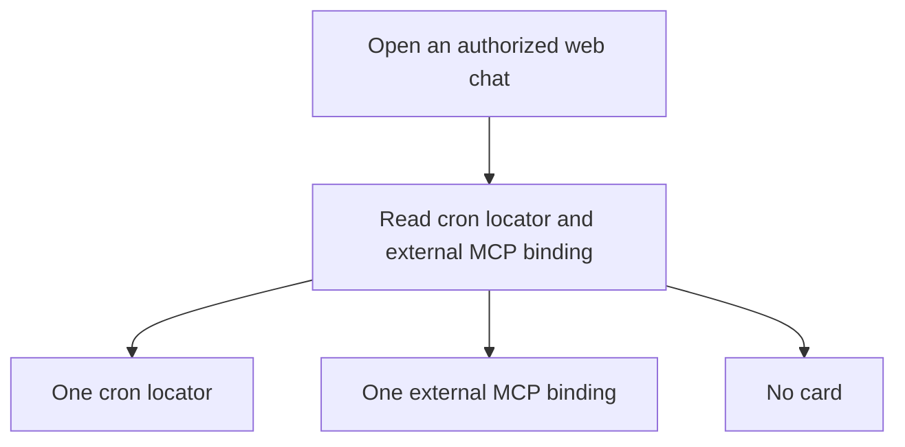

# Web Chat Origin Card - Plan

## Goal Capsule

- **Objective:** An operator who opens a web chat that began as a cron run or an external MCP call can name that origin without a database lookup or a hunt through the transcript.
- **Means:** A collapsed origin card as the first item in the web transcript (Key Decision: First-message card).
- **Product authority:** The Product Contract is the source of what to build. The Planning Contract is how.
- **Product Contract revision:** The user's first-message card replaces the pinned bar. A card appears only after a creating origin signal is on the openable chat; conflicting creating signals show no card (KTD2).
- **Open blockers:** None.
- **Execution profile:** code. Test the origin projection and the card before calling the work done.
- **Stop conditions:** U1 and U2 scenarios pass. `gofmt` on touched Go files. `go test ./internal/rocketclaw/frontend/rpc`, `bun test` in `internal/rocketclaw/web`, `make lint`, and `make test` pass.
- **Tail ownership:** LFG ships this change.

## Product Contract

### Summary

A web chat that began as a cron run or an external MCP call starts with a collapsed origin card. Show more reveals its details, like a tool-call disclosure. The card scrolls with the messages. Caller-supplied text stays plain text.

### Problem Frame

Opening one of these chats does not say what started it. The operator sometimes looks in the database. More often they browse until a clue turns up. That hunt is slow and still fails. Slack already marks the origin on the thread. The web chat does not.

### Key Decisions

- **Web only.** Slack already marks origin on the thread. (session-settled: user-directed — chosen over also changing Slack: Slack already uses header blocks for this.) Governs R1, R2.
- **Full run and call identity.** The expanded card names the run or starting call, including the starting agent and, for cron, the ran-at time. Governs R4, R5.
- **First-message card.** (session-settled: user-directed — replaces the earlier pinned-bar decision.) The card is the first transcript item and scrolls away with the messages. Governs R1, R2.
- **Collapsed details.** Both cron and external MCP cards start collapsed. Show more reveals the details; show less collapses them, like a tool-call disclosure. Governs R4, R6, R7.
- **Plain text.** Caller-supplied card values are hostile input. (session-settled: user-directed — chosen over rendering caller text as markup: metadata pairs and the external conversation id must not become HTML.) Governs R10.
- **Starting agent.** The card names the agent the chat began with. (session-settled: user-approved — confirmed with the scope: a later agent switch does not rename the card.) Governs R9.
- **Every openable web chat that began that way.** (session-settled: user-approved — confirmed with the scope: includes a Slack thread opened in the web UI, not only the chat opened from the cron page.) Governs R1, R2.

### Requirements

**Presence**

- R1. A web chat the operator can open that began as a cron run shows a collapsed origin card as the first transcript item, before all messages. It scrolls with the transcript and stays first after later replies. The card waits until that creating run's locator is on the chat.
- R2. A web chat the operator can open that began as an external MCP call shows the first-message origin card from R1.
- R3. A web chat that began as neither, or that has two creating origin signals, shows no origin card.

**Cron identity**

- R4. The collapsed cron card shows Cron, the stem, and the starting agent. Show more reveals the source path, the stem, whether the run was scheduled or a one-off, the specific run, the starting agent, and when it ran.

**External MCP identity**

- R5. The collapsed external MCP card shows External MCP, the external conversation id, and the starting agent. Expanded details show that id and agent, then the starting metadata pairs from the call that began the chat.
- R6. Starting pairs are hidden while collapsed. Expanded details show every starting pair in alphabetic order by key, or no pairs when none exist.
- R7. Every origin card offers show more and show less. Show more reveals the details; show less returns to the collapsed summary. Expanded content uses the transcript's scroll area.
- R8. Later metadata does not change the external conversation id or the starting pairs on the card.
- R9. A later agent switch does not change the agent on the card.
- R10. Every value in the origin card is shown as plain text and is never interpreted as markup.

### Key Flows

- F1. Open a cron-origin chat
  - **Trigger:** The operator opens a web chat that began as a cron run.
  - **Steps:** After the creating run's locator is on the chat, the first-message card follows R1. Show more reveals the run details per R4.
  - **Outcome:** The operator can name the run without leaving the chat.
  - **Covered by:** R1, R4
- F2. Open an external MCP chat
  - **Trigger:** The operator opens a web chat that began as an external MCP call.
  - **Steps:** The first-message card names the call per R5. Show more and show less reveal and hide its details per R6 and R7.
  - **Outcome:** The operator can name the starting call, and a long map does not cover the messages until they ask.
  - **Covered by:** R2, R5, R6, R7, R10

### Acceptance Examples

- AE1. Scheduled and one-off runs of the same stem
  - **Covers R1, R4.**
  - **Given:** Two web chats began as different runs of the same cron stem, one scheduled and one one-off.
  - **When:** The operator opens each chat.
  - **Then:** Each card starts collapsed with the stem and starting agent. Show more reveals the source path, stem, run kind, distinct run identity, starting agent, and ran-at time. The card is the first transcript item and scrolls away with the messages.
- AE2. Ordinary chat
  - **Covers R3.**
  - **Given:** A web chat began as a human web or Slack message, not as a cron run or an external MCP call.
  - **When:** The operator opens it.
  - **Then:** No origin card is shown.
- AE3. Metadata length
  - **Covers R5, R6, R7.**
  - **Given:** Four external MCP chats began with zero, one, two, and three starting pairs.
  - **When:** The operator opens each chat.
  - **Then:** Every card starts collapsed with the external conversation id and starting agent and offers show more. Expanded details show zero, one, two, or three pairs respectively, sorted by key.
- AE4. Show more and show less
  - **Covers R7.**
  - **Given:** An external MCP chat has three starting pairs.
  - **When:** The operator chooses show more, then show less.
  - **Then:** Show more reveals all three pairs inside the card. Show less hides the details and returns to the external conversation id and starting agent. The card scrolls with the messages in either state.
- AE5. Hostile text
  - **Covers R10.**
  - **Given:** A starting pair value and the external conversation id contain characters that would be markup if interpreted.
  - **When:** The operator opens the chat, including after show more.
  - **Then:** Those characters appear as text. They do not change the page.
- AE6. Later metadata and a later agent switch
  - **Covers R8, R9.**
  - **Given:** An external MCP chat already shows its starting card.
  - **When:** A later call adds metadata, and the selected agent changes.
  - **Then:** The id, the starting pairs, and the agent on the card stay as they were when the chat began.
- AE7. Slack thread opened in the web UI
  - **Covers R2, R3.**
  - **Given:** One Slack thread began as an external MCP call, and another began as a human mention.
  - **When:** The operator opens each thread in the web UI.
  - **Then:** Only the thread that began as an external MCP call shows the origin card.

### Scope Boundaries

- Slack origin header blocks stay as they are.
- The session list does not gain an origin marker.
- Chats the web UI cannot open do not gain this card.
- The origin is a first-message card, not a pinned bar or a page title. Full identity remains available through show more.

### Dependencies / Assumptions

- The starting metadata pairs are the pairs from the call that began the chat, in the caller's keys.
- Alphabetic order is one stable sort by key. The same keys always yield the same pair order.
- A cron run's specific run is distinguishable from every other run of that stem.

### Sources / Research

- Slack already frames a cron root as a header block of filename, agent, and ran-at, and an external MCP message as a header block of label, external conversation id, and agent. See `internal/rocketclaw/frontend/slack/connector.go` and `internal/rocketclaw/docs/specs/2026-07-23-cronjob-slack-presentation-design.md`.
- The web transcript has no origin header. A cron run can be opened as a synced web chat, and a delivered Slack thread can be opened in the web UI. Private cron producers and recorded private external MCP sessions are not openable web chats. See `internal/rocketclaw/web/README.md` and `internal/rocketclaw/frontend/rpc/README.md`.
- An external MCP call can carry a free-form metadata map. The first map is the thread's starting metadata. A later call can add keys without replacing that starting map.

## Planning Contract

### Key Technical Decisions

- KTD1. **History carries the origin.** The chat already loads history when it opens. The session list does not. Governs R1, R2, R3.
- KTD2. **A creating signal, or no card.** A cron locator counts only when that run created the openable chat: `CreatedBy` is cron, the chat id is `web:` plus that locator, or the chat is the web Run cron destination after its locator is synced. A later one-off synced onto an existing thread is not a beginning. An external MCP binding counts when that binding created the thread. Two creating signals, or none, show no card. If several creating cron locators exist, use the earliest. Governs R1, R2, R3.
- KTD3. **Starting agent comes from the creation record.** Cron uses the producer conversation's agent. External MCP uses the agent stored on the binding at registration. Neither uses the destination's current agent. Governs R4, R5, R9.
- KTD4. **Keep the caller's keys.** The stored environment projection rewrites keys. The card reads a record of the original pairs written with the starting call, and it drops injected keys. A past chat with only the rewritten form shows no pairs. Governs R5, R6, R8.
- KTD5. **Text nodes, not the transcript renderer.** Card values are React text children. They do not go through `TranscriptText` or HTML injection. Governs R10.

### High-Level Technical Design

The server projects that result on history for a chat the operator may open. The client renders it as the first item inside the message scroller. Native `details` and `summary` elements provide the collapsed disclosure without React expansion state.

### Assumptions

- Go string order is the alphabetic sort. The same keys always yield the same pair order.
- A missing starting agent is left blank. It is not filled from the current agent.
- A later one-off synced onto an existing thread is not a creating signal.
- `docs/solutions/` has no chat-origin learning to follow.

### Sequencing

U1 before U2. U2 consumes the history field U1 adds.

## Implementation Units

### U1. Project origin on history

- **Goal:** An authorized history read returns the origin for that chat, or nothing when the beginning is ordinary, missing, or conflicting.
- **Requirements:** R1, R2, R3, R4, R5, R8, R9
- **Dependencies:** none
- **Files:** `internal/rocketclaw/web/proto/web.proto`, generated files from `go generate ./internal/rocketclaw/frontend/rpc`, `internal/rocketclaw/frontend/rpc/server.go`, `internal/rocketclaw/frontend/rpc/server_test.go`, `internal/rocketclaw/frontend/rpc/README.md`, the starting-metadata write in `internal/rocketclaw/backend/bridge.go` and its test
- **Approach:**
  - Add an optional origin on `HistoryResponse`. Do not add it to `Session`.
   - Classify per KTD2. Parse locators with the rules already in `cronHistory`. Return every original starting pair in Go string order.
  - Fill cron fields from the creating locator plus the producer conversation agent, per KTD3. The specific run is the full locator.
  - Fill external MCP fields from the binding and the original starting pairs, per KTD3 and KTD4. Exclude injected keys such as `external_conversation_id`.
  - Keep today's history access: a cron producer read stays allowed, including a run with no delivered chat. A private external MCP session read stays denied.
- **Patterns to follow:** `cronHistory` in `internal/rocketclaw/frontend/rpc/server.go`, and the existing history authorization in that package.
- **Test scenarios:**
  - Covers AE1. A scheduled locator and a one-off locator for the same stem return different run ids, the parsed path, stem, kind, producer agent, and ran-at, with the pair list empty.
  - Covers AE2. A human Slack thread and a human web chat return no origin.
  - Covers AE7. A Slack thread bound to an external MCP session returns that external conversation id, the binding agent, and the original starting pairs. A human mention thread does not.
  - Covers AE6. A later metadata entry and a changed managed-conversation agent leave the returned id, pairs, and agent unchanged.
   - A chat with two creating signals returns no origin. A later one-off synced onto a human thread or an external MCP thread does not add a cron card or remove an external MCP card.
  - A `web:` chat whose source is not a cron locator returns no origin until a creating locator is synced.
  - A history read for a cron producer id still succeeds. A history read for a private external MCP id is still denied.
  - Caller key `ticket-id` is returned as `ticket-id`, not the rewritten environment key. Injected `external_conversation_id` is not a pair.
  - A starting record that has only the rewritten environment form returns no pairs.
- **Verification:** `go generate ./internal/rocketclaw/frontend/rpc` succeeds, and `go test ./internal/rocketclaw/frontend/rpc` passes.

### U2. Render the first-message card

- **Goal:** The open chat shows the history origin as a collapsed first-message card that scrolls with the messages, and ordinary chats stay unchanged.
- **Requirements:** R1, R2, R3, R4, R6, R7, R10
- **Dependencies:** U1
- **Files:** `internal/rocketclaw/web/src/types.ts`, `internal/rocketclaw/web/src/api.ts`, `internal/rocketclaw/web/src/ui.tsx`, `internal/rocketclaw/web/src/transcript-text.test.tsx` or a sibling test, `internal/rocketclaw/web/src/session-list.browser.test.ts`, `internal/rocketclaw/web/README.md`
- **Approach:**
   - Place the card in a `MessageScrollerItem` before the conversation turns. Do not add it to the session list or to titled pages.
   - Use a named `details` disclosure with a `summary`, initially collapsed, not a page `header` element.
  - Render every value as a text child, per KTD5.
   - Cron summarizes the stem and starting agent. External MCP summarizes the external conversation id and starting agent. Both offer show more and show less for the full details. Expanded pairs use the transcript's scroll area.
- **Patterns to follow:** text children in `internal/rocketclaw/web/src/ui.tsx`, and the static markup assertion in `internal/rocketclaw/web/src/transcript-text.test.tsx`.
- **Test scenarios:**
  - Covers AE5. A value `` and an external conversation id containing `<` appear as text in static markup and do not become elements.
   - Covers AE3, AE4. Zero, one, two, and three pairs all start collapsed and offer show more. Expansion shows every pair in order; collapse hides the details. Verify the card is first and scrolls away in both states.
   - Covers AE2. An ordinary chat renders no origin card.
  - The existing chat check that counts visible page headers stays green for an ordinary chat.
- **Verification:** `bun test` in `internal/rocketclaw/web` passes.

## Verification Contract

- `go generate ./internal/rocketclaw/frontend/rpc` with `protoc` and `protoc-gen-go` on `PATH`, as `internal/rocketclaw/frontend/rpc/README.md` describes.
- `go test ./internal/rocketclaw/frontend/rpc`
- `bun test` in `internal/rocketclaw/web`
- `gofmt` on touched Go files
- `make lint`
- `make test`

## Definition of Done

- U1 and U2 verification commands pass.
- AE1 through AE7 are covered by the scenarios above.
- Slack header blocks and the session list are unchanged.
- Abandoned experiments are not left in the diff.
- `internal/rocketclaw/web/README.md` says an origin chat starts with this collapsed card and an ordinary chat does not.
