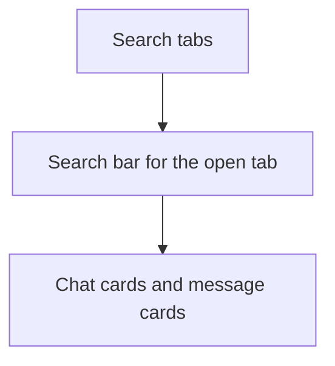
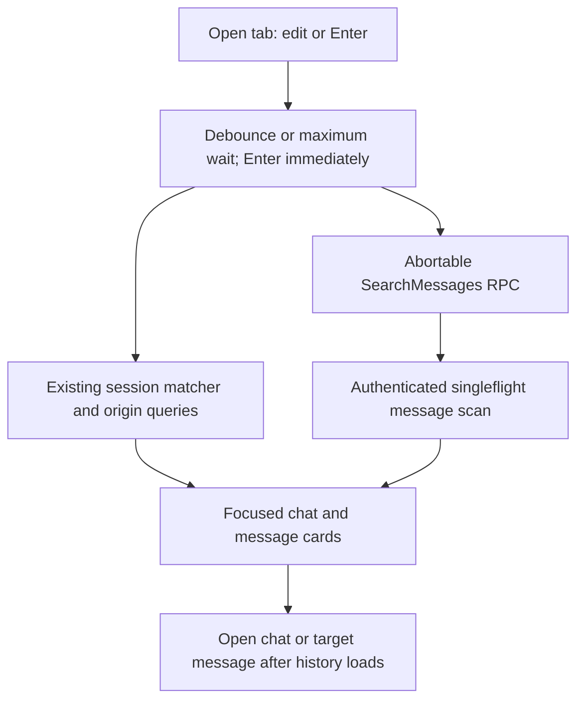
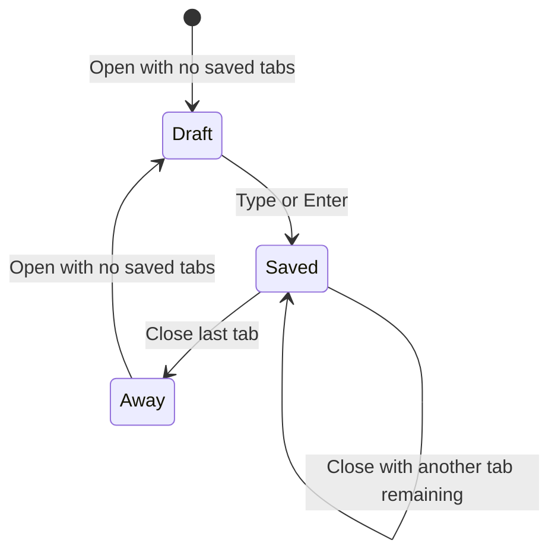

# Web Search Page - Plan

## Goal Capsule

- **Objective:** A person using the web UI can keep, edit, and reopen searches for chats and messages in this browser, and open a matching chat or message without losing those searches.
- **Means:** A search page opened from the bottom Search button and from Session: Search. Searches stay in this browser. (KTD1)
- **Product authority:** Product Contract below owns behavior; Planning Contract owns the implementation.
- **Product Contract preservation:** Changed: R20 restores the user's stated requirement for a focused representation of the match on each card; R1–R19 and their IDs retain their meaning.
- **Execution:** Code in the RocketClaw web UI and its message-search RPC; the LFG run finishes and ships it.
- **Stop conditions:** The browser behaviors and shared-query cancellation are covered by runnable tests; required Go, web, and repository checks pass before shipping.

---

## Product Contract

### Summary

A search page holds the searches a person is editing. The bottom Search button and Session: Search open it. A card is a chat or a message in a chat. Choosing a message opens that chat at the message.

### Problem Frame

The magnifying glass and Cmd/Ctrl+P open a dialog that clears every time. Finding a chat or a message means typing until a result appears, in that one sitting. A search does not stay, and it cannot sit beside a different search.

### Requirements

**Opening**

- R1. The bottom Search button opens the search page.
- R2. Session: Search in the command palette opens the search page.
- R3. Cmd/Ctrl+P still opens the existing session-search dialog, and that dialog still clears its text on each open.

**Searches and cards**

- R4. The page holds saved searches as tabs.
- R5. The person can open another tab for a different search.
- R6. Each search can be edited until a card is the one they want.
- R7. A search shows chat cards for the same matches as today's session search, and message cards for the same message-text matches as today's message search.
- R8. Choosing a chat card opens that chat.
- R9. Choosing a message card opens that chat at that message.
- R10. Opening a card does not remove saved searches.
- R11. Cards update as the person types, after a short wait, and a deadline forces submission if they are still typing.
- R12. Enter in the search bar reloads that search immediately.
- R20. A chat or message card shows a focused representation of what matched, including enough surrounding text to identify the result.

**Keeping searches**

- R13. Closing a search removes it from this browser.
- R14. Closing a search that is not the last leaves the page open on a remaining search.
- R15. Closing the last search leaves the page and returns to the last message they saw anywhere, or to the new-message screen if they have not seen one.
- R16. Opening the page when nothing is saved starts one empty search, kept in this browser once the person types in it or presses Enter.
- R17. Saved searches stay in this browser without a permission prompt and do not follow the person to another computer.

**Shared searches**

- R18. A newer search cancels only that person's previous in-flight search, and another person's search keeps going.
- R19. When two people run the same search at the same time, the server hits the database once, using singleflight.



Page regions for R4 through R9.

### Key Decisions

- **Saved searches are editable tabs.** (session-settled: user-directed — chosen over result-kind tabs and moving today's dialog onto the page: each tab is a search you keep editing.) Governs R4, R5, R6.
- **A card opens the match.** (session-settled: user-directed — chosen over opening the chat without jumping to the message, and over staying on the page: a message card opens that chat at the message.) Governs R8, R9.
- **The bottom button opens the page, and the shortcut keeps the dialog.** (session-settled: user-directed — chosen over both opening the page, and over the button keeping the dialog: the palette also opens the page.) Governs R1, R2, R3.
- **The command is Session: Search.** (session-settled: user-directed — chosen over Page: Search: they wanted that label even though other pages use Page:.) Governs R2.
- **Enter reloads the search.** (session-settled: user-directed — chosen over a separate refresh control and over results that only update on their own: Enter in the bar reloads.) Governs R12.
- **Cards update as you type and on Enter.** (session-settled: user-directed — chosen over Enter-only updates: typing updates after a wait, and Enter reloads.) Governs R11, R12.
- **A newer search cancels only yours, and identical searches from two people hit the database once.** (session-settled: user-directed — chosen over collapsing only your own in-flight calls, and over stopping the shared search for everyone: the wait is in the browser, cancel is per person, and singleflight covers two people on the same search.) Governs R11, R18, R19.
- **Closing includes the last search and leaves the page.** (session-settled: user-directed — chosen over keeping one blank search on the page, and over not allowing close: the last close returns to the last message seen anywhere, or the new-message screen.) Governs R13, R14, R15.
- **The return target is the last message seen anywhere.** (session-settled: user-directed — chosen over only a card's message, and over the chat you left before search.) Governs R15.
- **The next open with nothing saved starts one empty search.** (session-settled: user-directed — chosen over a page with no search.) Governs R16.

### Actors

- A1. The person using the web UI.
- A2. Another person running the same search at the same time.

### Key Flows

- F1. Open a search and edit it
  - **Trigger:** A1 uses the bottom Search button or Session: Search.
  - **Actors:** A1
  - **Steps:** The page opens on saved searches, or one empty search if none are saved (R16). A1 edits the open search. Cards update per R11. Enter reloads per R12.
  - **Outcome:** A1 can keep editing until a card is the one they want (R6).
  - **Covered by:** R1, R2, R4, R6, R11, R12, R16
- F2. Open a card
  - **Trigger:** A1 chooses a chat card or a message card.
  - **Actors:** A1
  - **Steps:** A chat card opens that chat (R8). A message card opens that chat at that message (R9). Saved searches remain (R10).
  - **Outcome:** A1 is in the matching chat, and the searches are still in this browser.
  - **Covered by:** R8, R9, R10
- F3. Close a search
  - **Trigger:** A1 closes a search tab.
  - **Actors:** A1
  - **Steps:** The search is removed from this browser (R13). If another search remains, the page stays on one (R14). If it was the last, the page closes and A1 returns to the last message they saw anywhere, or to the new-message screen if they have not seen one (R15).
  - **Outcome:** A closed search does not come back. The last close leaves the page.
  - **Covered by:** R13, R14, R15
- F4. Two people, one search, then a new one
  - **Trigger:** A1 and A2 run the same search. A1 then types a different search.
  - **Actors:** A1, A2
  - **Steps:** The shared search hits the database once (R19). A1's new search cancels only A1's previous search. A2's search keeps going (R18).
  - **Outcome:** A2 is not dropped because A1 changed their search.
  - **Covered by:** R18, R19

### Acceptance Examples

- AE1. Enter does not wait for the typing pause
  - **Covers R11, R12.**
  - **Given:** A1 is editing a search and the typing wait has not elapsed.
  - **When:** A1 presses Enter in the search bar.
  - **Then:** That search reloads immediately.
- AE2. A deadline submits while typing continues
  - **Covers R11.**
  - **Given:** A1 is still typing and the deadline arrives before they pause.
  - **When:** The deadline passes.
  - **Then:** The search submits anyway.
- AE3. A message card opens at the message
  - **Covers R9, R10.**
  - **Given:** A search has a message card.
  - **When:** A1 chooses that card.
  - **Then:** That chat opens at that message, and the search remains in this browser.
- AE4. Closing the last search
  - **Covers R15.**
  - **Given:** One search is open.
  - **When:** A1 closes it, and they have seen a message.
  - **Then:** The page closes and they return to the last message they saw anywhere.
  - **And:** If they have not seen a message, they return to the new-message screen.
- AE5. Opening Search with nothing saved
  - **Covers R16.**
  - **Given:** This browser has no saved searches.
  - **When:** A1 opens the search page.
  - **Then:** One empty search is ready to type.
  - **And:** That empty search is kept only after A1 types in it or presses Enter.
- AE6. One person changes a shared search
  - **Covers R18, R19.**
  - **Given:** A1 and A2 are running the same search.
  - **When:** A1 types a different search.
  - **Then:** A1's previous search stops for A1, A2's search keeps going, and the shared search hit the database once.

### Scope Boundaries

- No separate refresh control (R12).
- Searches do not follow the person to another computer, and they are not stored on the server (R17).
- The shortcut dialog is not redesigned (R3).
- Result cards do not rewrite the search text (R6).
- The command is not Page: Search (R2).

### Dependencies / Assumptions

- Today's session search and today's message search already exist. R7 uses those match rules rather than a new matcher.
- The new-message screen in R15 is Home, the fresh composer.
- Other ways of leaving the page, such as Escape, are not specified. They must not discard saved searches except through R13.

### Outstanding Questions

- Deferred to Planning: how long the typing wait is, and how long the deadline is, provided R11 and R12 both hold.
- Deferred to Planning: the order of chat cards and message cards in one search.
- Deferred to Planning: which browser store holds the searches, provided R17 holds.

### Sources / Research

- `internal/rocketclaw/web/README.md` describes the bottom Search button, Cmd/Ctrl+P, the dialog that clears, and the `Page:` / `Session:` command labels.
- `internal/rocketclaw/web/src/ui.tsx` opens that dialog from the Search button and from Cmd/Ctrl+P, and lists page commands as `Page: Settled` and the rest.
- `internal/rocketclaw/frontend/rpc/session_commands.go` searches recorded user and assistant message text and returns no matches for an empty query.
- `internal/rocketclaw/web/src/components/theme.tsx` and `internal/rocketclaw/web/src/session-list.ts` already keep choices in this browser without a permission prompt.

---

## Planning Contract

### Key Technical Decisions

- KTD1. **Keep editable tab identity in browser storage.** Use the existing small-preference storage pattern for search text, stable tab IDs, and the selected tab, keyed by the confirmed web identity. Keep the untouched starter draft out of storage until typing or Enter, and remove closed tabs rather than restoring them on the next visit. Implements R4–R6, R13–R17. (session-settled: user-directed — chosen over result-kind tabs and server-side saved searches: each tab is a separately editable search kept in this browser.)
- KTD2. **Reuse the two existing search contracts.** Match chat cards with the session palette's row, filter, origin, visibility, and pinned-order rules; match message text with the existing `SearchMessages` RPC rather than writing a second text matcher. Use the same chat filter constraints on a message card's parent chat, but apply only the remaining free text to message content. Implements R7, R20.
- KTD3. **Submit on pause, maximum wait, or Enter.** A short debounce (about 250 ms) resets on typing; a maximum wait (about 1 s from the first unsubmitted edit) does not. Enter immediately sends the current value even when the text has not changed; a newly submitted query aborts this page's previous request and older responses cannot replace newer cards. Implements R11, R12, R18. (session-settled: user-directed — chosen over Enter-only updates and a separate refresh control: cards update as typing continues and Enter explicitly reloads.)
- KTD4. **Separate a caller's wait from shared message-search work.** Authenticate every RPC before sharing. Use `golang.org/x/sync/singleflight` for equal normalized message queries while letting each caller independently stop waiting on its own context; the scan must not inherit cancellation from the first caller. Share only among callers with the same result visibility, and stop work once no caller remains. Implements R18, R19. (session-settled: user-directed — chosen over canceling the shared search for everyone: changing one person's query must not stop another person's matching search.)
- KTD5. **Carry message identity across page navigation.** Use the existing transcript turn lookup and scroller, not a guessed DOM anchor; retain the selected message identity until the target chat's history has loaded. Record the most recently *visible* transcript message as the browser-local return target, not the most recently updated session or last clicked search card. Implements R9, R15. (session-settled: user-directed — chosen over returning to the chat left before search or only the last clicked card: last-close returns to the last message seen anywhere.)

### High-Level Technical Design

The search page owns tab edits and submission timing. The session list supplies chat matches and origin data; `SearchMessages` supplies message matches. A result can be selected only for the currently submitted query. This is not a new server-side search index.



For equal in-flight message queries, the first caller starts shared work and the second joins it. If either caller submits a newer query, that caller's wait ends; the other still receives the shared result. A later call with the same text starts fresh work after the prior flight has completed.

```mermaid
sequenceDiagram
  participant A as Browser A
  participant S as Search RPC
  participant B as Browser B
  A->>S: Search text X
  B->>S: Search text X (joins flight)
  A->>S: Abort X; start Y
  S-->>B: X result from one scan
  S-->>A: Y result
```

An unopened empty starter is a draft. Editing it or pressing Enter turns it into a saved tab. Closing a saved tab removes its entry; closing the final tab leaves the page. A browser navigation away from the page does not close tabs.



### Assumptions

- Chat filters on the search page constrain message cards by their parent chat, while only free text is sent to the existing message-text matcher. This keeps both existing search contracts without inventing a new filter language.
- The last-seen target is the most recently visible transcript message for the confirmed web identity in this browser, including after opening a card; it is not inferred from a session's update timestamp. Keep that target browser-local so the return remains meaningful after reloading a saved search.
- A message-card jump should survive a reload of its destination chat; a route-carried message identity is appropriate if the current transient handoff target does not suffice.
- Chat cards are listed before message cards, preserving the existing session-list order within chat results and the RPC's order within message results. No relevance-rank service is added.
- Typing pause and maximum-wait durations are initial UI values to check in browser tests, not product-level performance targets.

### Risks and Scope

- The palette's selected `agent:` and `room:` pills live outside its query string; persist the search's effective filter state if those controls are reused. A string-only save would silently change the restored search.
- Cross-user result sharing is safe only while the same authorized callers see the same conversation set. Keep authentication before the flight and include visibility scope in the key if that boundary differs by principal.
- Search terms and last-seen targets may reveal private conversations. Do not load browser-saved state until identity is confirmed; a different identity in the same browser must not see it.
- A message ID must be resolved against the rendered turn after history loads; an assistant hit or filtered origin may not have a raw DOM anchor. Reuse turn-based scrolling and make the target visible when its origin was filtered out.
- Agent-invoked read-only search may be useful later, but agent CRUD for browser-local tabs is out of scope. No database schema, search index, additional permission prompt, or unrelated palette redesign belongs here.

---

## Implementation Units

### U1. Share concurrent message searches safely

- **Goal:** Collapse identical in-flight message scans without linking one person's cancellation to another's result.
- **Requirements:** R7, R18, R19; F4; AE6; KTD4.
- **Dependencies:** None.
- **Files:** `internal/rocketclaw/frontend/rpc/server.go`, `internal/rocketclaw/frontend/rpc/session_commands.go`, `internal/rocketclaw/frontend/rpc/server_test.go`.
- **Approach:** Keep the existing authentication, visibility, and match rules. Coordinate only nonblank, normalized message queries on the server; each request independently waits for or leaves the shared scan. Stop a flight when its final waiter leaves, without stopping any still-active waiter. Use the already installed `golang.org/x/sync/singleflight`. Avoid turning the request-scoped context into long-lived server state.
- **Patterns to follow:** The existing `searchMessages` handler, its integration tests, and Go's `context.WithoutCancel` / singleflight `DoChan` semantics where a detached shared scan is needed.
- **Test scenarios:**
  - Covers AE6. Two authorized callers searching equal text overlap: only one transcript scan runs, and both receive the same matching message IDs.
  - Covers AE6. One caller cancels after the second joins: the first returns canceled promptly; the second receives the result, and the shared scan still runs once.
  - Different queries do not share a result; blank input returns no matches and unauthorized callers never join a flight.
  - When every caller cancels, the abandoned scan stops; a later equal query can start new work.
- **Verification:** Existing case-insensitive, empty, visibility, and authentication tests still pass alongside the concurrency test.

### U2. Add saved search tabs and entry points

- **Goal:** Make the search page reachable and keep independently editable searches without replacing the shortcut dialog.
- **Requirements:** R1–R6, R10, R13, R14, R16, R17; F1, F3; AE5; KTD1.
- **Dependencies:** None.
- **Files:** `internal/rocketclaw/web/src/ui.tsx`, `internal/rocketclaw/web/src/navigation.tsx` if needed for route state, `internal/rocketclaw/web/src/session-list.browser.test.ts` or `internal/rocketclaw/web/src/session-commands.browser.test.ts`.
- **Approach:** Extend the current page routing and command-palette actions. Store search text, effective filters, selected tab, and tab identity in the browser under the confirmed owner; keep the first untouched empty search provisional. Reuse the existing page layout and accessible controls rather than adding a second navigation system. Tabs need keyboard selection and a predictable focus destination when closed.
- **Patterns to follow:** Existing `useRoute`/`TabPane`, `paletteRows`, and localStorage theme pattern.
- **Test scenarios:**
  - The bottom Search button and `Session: Search` open the page; Cmd/Ctrl+P still opens and clears the dialog, while Cmd/Ctrl+Shift+P still opens commands.
  - Covers AE5. A new browser has one empty starter; navigating away without typing and reopening still has only one provisional empty starter.
  - Two saved tabs with identical query text remain distinct; editing one does not change the other, and both survive reload along with the selected tab and filters.
  - Closing one of several tabs removes only that tab; navigating to another page without closing does not remove any saved search.
  - Changing web identity in the same browser hides the previous owner's saved searches and last-seen target; keyboard focus moves to a remaining tab after closing one.
- **Verification:** Browser route, keyboard, reload, and tab-identity checks pass at desktop and narrow viewport widths.

### U3. Show current, focused results on each search

- **Goal:** Give each saved search fresh chat and message cards that make the match recognizable.
- **Requirements:** R6–R8, R11, R12, R18, R20; F1, F2; AE1, AE2; KTD2, KTD3.
- **Dependencies:** U1, U2.
- **Files:** `internal/rocketclaw/web/src/ui.tsx`, `internal/rocketclaw/web/src/api.ts` if query ownership needs changing, `internal/rocketclaw/web/src/session-commands.browser.test.ts`, `internal/rocketclaw/web/src/session-list.browser.test.ts` if reusing its filter fixtures.
- **Approach:** Reuse the existing session matcher and origin-history queries for chat cards and the RPC for message cards. Schedule new submissions at the pause, maximum wait, or Enter; pass an abort signal to the previous request when a newer one starts. Show a short matching excerpt or matched session field with emphasis on the hit. Show an explicit pending state for the current query and a retryable error when its request fails, rather than treating stale cards as current. Keep a result tied to its submitted query so a stale response cannot replace newer cards.
- **Patterns to follow:** `matchesSession`, `sessionSearchTerms`, `paletteRows`, `originSearchText`, `queries.searchMessages`, and existing origin-loading/error affordances.
- **Test scenarios:**
  - A session matches its title, preview, origin metadata, and existing filters; the card shows which field matched and retains pinned-first order.
  - A recorded user or assistant message matches regardless of case; its card shows the hit in context, and a blank query does not run a message search.
  - Covers AE1. Enter reloads an unchanged or still-debouncing search immediately; no separate refresh button is present.
  - Covers AE2. Continuous typing exceeds the maximum wait and submits a query before typing stops; a later pause submits the final text.
  - A newer submission aborts the previous browser request; a late older response does not replace the newest card list.
- **Verification:** Browser tests observe request timing, matched-card content, ordering, empty results, and cancellation rather than merely non-empty output.

### U4. Open matches and return from the last tab

- **Goal:** Navigate from either card to the right chat position and leave Search at the last message actually seen when the final tab closes.
- **Requirements:** R8–R10, R13–R16; F2, F3; AE3, AE4; KTD5.
- **Dependencies:** U2, U3.
- **Files:** `internal/rocketclaw/web/src/ui.tsx`, `internal/rocketclaw/web/src/navigation.tsx` if route-carried identity is used, `internal/rocketclaw/web/src/session-commands.browser.test.ts`, `internal/rocketclaw/web/src/transcript.test.ts` if the turn lookup changes.
- **Approach:** Carry the selected message's identity to the existing transcript scroller, resolve it after history loads, and scroll to the rendered turn. Record the last visibly read message in browser-local state while reading transcripts. Closing the final saved tab uses that target or Home without deleting any other search.
- **Patterns to follow:** `TranscriptLog` target-turn lookup, `MessageScroller`, `historyLines`, and `sessionPath`.
- **Test scenarios:**
  - Covers AE3. Selecting a user and an assistant message card opens the right chat at each corresponding turn after history loads; reloading the chat preserves the target if route-carried.
  - Covers AE4. The last visible message in another chat, not the most recently updated chat or latest clicked card, is the destination after closing the only search.
  - Covers AE4. With no message ever viewed, closing the only search goes to the new-message screen; reopening Search creates one provisional empty tab.
  - Opening either kind of card leaves saved searches intact, including after a page reload and a return to Search.
- **Verification:** Browser tests check actual visible turn and route, plus saved-search persistence.

---

## Verification Contract

| Gate | Expected proof |
| --- | --- |
| `go test ./...` | Full Go suite, including the concurrent shared-search RPC test. |
| `make lint` | Go and repository lint gates; no linter suppressions. |
| `make test` | Repository test and coverage/CLOC budgets. |
| `bun run lint`, `bunx tsc --noEmit`, `bun test`, `bun run build` in `internal/rocketclaw/web` | Web lint, types, unit/browser test entry point, and built assets. |
| Browser tests with `ROCKETCLAW_PLAYWRIGHT_MODULE` and `ROCKETCLAW_CHROMIUM` set | The page, reload, timing, navigation, and mobile interactions actually ran rather than being skipped. |

The web README's sentence saying the magnifier and Cmd/Ctrl+P open the same dialog must change when the feature lands. Document the new page, tabs, card jumps, and retained shortcut behavior in `internal/rocketclaw/web/README.md`.

---

## Definition of Done

- U1–U4 pass their stated behavioral checks, including an aborting waiter that cannot cancel another person's shared search.
- Every R1–R20 requirement and relevant F/AE path is verifiable in the UI or RPC tests; the focused match display is not merely a non-empty card.
- Required Go and web checks pass with the browser tests enabled; coverage and CLOC budgets remain within their existing limits.
- The web README reflects the changed Search button. No discarded experiment, unrelated refactor, or unrequested server-side saved-search store remains in the diff.
