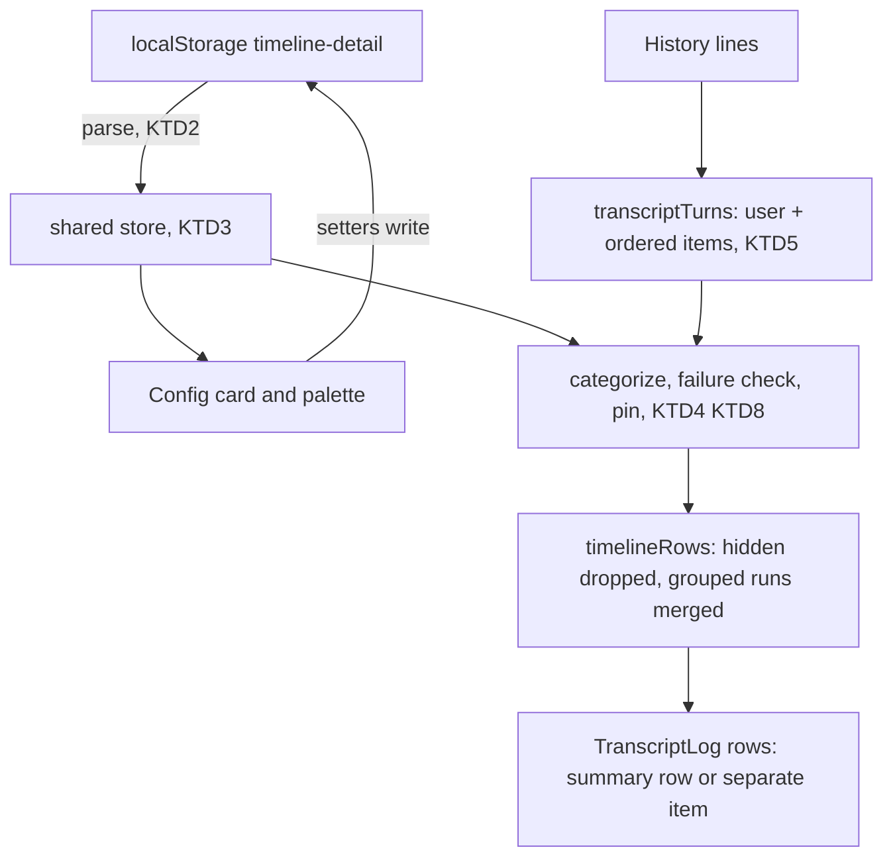
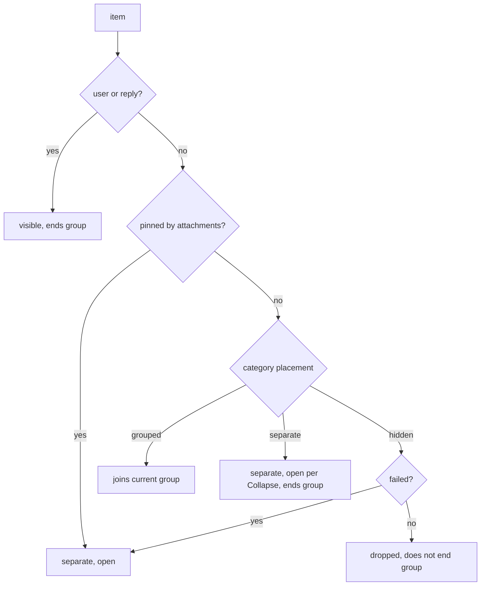

# Web Timeline Detail - Plan

## Goal Capsule

- **Objective:** Each person using the RocketClaw web app can choose how much agent activity a session timeline shows, from replies plus a "working" signal up to every tool call open. They can switch level quickly while a session runs.
- **Means:** A "Timeline detail" card on the Config page, copied from OpenCode v2, with a 5-stop slider and an Advanced table. Command-palette shortcuts set the level from anywhere.
- **Product authority:** This Product Contract, then the Planning Contract's KTDs on mechanism. Behavior follows the OpenCode v2 references in Sources except where a Key Decision or KTD below diverges.
- **Open blockers:** None. The work builds on the unmerged change `live-transcript-signals` (see Dependencies / Assumptions).
- **Execution profile:** Web-only change in `internal/rocketclaw/web`, plus the rebuilt embedded assets and docs. No Go, proto or schema change.
- **Stop conditions:** Stop and report if the web source count would reach the 5,250-line hazard threshold (`TS_CLOC_BUDGET` is 5500 and must not be raised), or if R19 cannot be met without a server change.
- **Finishing:** Implemented by `ce-work`, shipped by `lfg` as a pull request stacked on `live-transcript-signals`.

---

## Product Contract

### Summary

The Config page gains a "Timeline detail" card. A slider picks one of five levels: Messages only, Quiet, Compact, Detailed, Everything. An Advanced table tunes six activity categories: Execute, Thinking, Subagents, Skills, Notices, Other tools. The choice is saved in the browser, shapes running and finished turns the same way, and five command-palette commands change the level without opening Config.

### Problem Frame

Different people use the same RocketClaw web app, and they need different amounts of detail. Sometimes a person only wants to know that work is in progress. Other times they want to read every command, result and reasoning step.

Today the timeline offers one fixed view. Every turn puts all its activity in one open "Thinking" box, and every tool call inside it is open with its arguments and result. A person who only wants a status signal has to scroll past all of it. A person who wants detail has no way to adjust how it is presented.

### Key Decisions

- **Copy the full OpenCode v2 control, not a slider-only first step.** Governs R1-R8. (session-settled: user-directed — chosen over a slider-only first step: the user wants per-category fine tuning like OpenCode v2.)
- **Build on `live-transcript-signals`.** On that base, running turns already carry full tool detail, so one setting shapes running and finished turns alike. Governs R17. (session-settled: user-directed — chosen over finished-turns-only, new live-stream server work, or a split brainstorm: that change already provides structured live data.)
- **Save the setting per browser, like the theme.** Governs R14. (session-settled: user-directed — chosen over per-person-per-browser and per-person-on-server storage: simplest, and people sharing a browser accept sharing one setting.)
- **Compact is the starting level.** Governs R15. (session-settled: user-approved — chosen over Everything, which is closest to today, and Detailed: Compact matches "just tell me it's working", and it is OpenCode's default.)
- **Execute is one unit.** An `execute` call is never sorted by the reads, commands or edits inside it, so OpenCode's Shell and Edits rows become one Execute row. Governs R2. (session-settled: user-directed — chosen over sorting each call by its contents and over OpenCode's all-execute-is-Shell rule: in RocketClaw, read, grep, glob, bash and apply_patch all run inside Execute.)
- **Skills get their own row, separate from Other tools.** Governs R2. (session-settled: user-directed — chosen over a five-row table and a four-row table: skill loads are frequent and noisy.)
- **Remove the per-turn "Thinking" box.** The level alone decides what appears. Governs R11. (session-settled: user-approved — chosen over keeping the box around all activity: a wrapper would undercut Messages only and Everything.)
- **Config card plus command-palette shortcuts.** Governs R16. (session-settled: user-approved — chosen over Config only and over an always-visible control in the session: switching often should not require leaving the session.)
- **Delivered files never hide.** Found in planning: files the agent sends ride on a tool result, so hiding Other tools would hide them. Governs R20.
- **Turns keep time order.** Found in planning: today all activity is drawn before all replies, which would make "a reply ends the group" meaningless. Governs R21, R12.
- **Quiet hides Execute, edits included.** OpenCode's Quiet keeps edits grouped, but edits live inside Execute here. Governs R4. (session-settled: user-approved — raised as a call-out at scope confirmation and accepted.)

### Requirements

**Settings card**

- R1. Config shows a "Timeline detail" card, described as "Choose how much detail appears in the session timeline." It appears even while server config is loading or has failed, like the Appearance theme chooser.
- R2. The Advanced table has six rows, each with an eye toggle. Execute and Thinking also have Group and Collapse switches; Subagents, Skills, Notices and Other tools have Group only.
- R3. The slider has five stops, from left to right: Messages only, Quiet, Compact, Detailed, Everything. Below it, the current level's name and description are shown as "Name: description".
- R4. Each level sets every row as follows ("separate" means shown on its own, "open" means Collapse is off):

  | Level | Description | Execute | Thinking | Subagents | Skills | Notices | Other tools |
  |---|---|---|---|---|---|---|---|
  | Everything | Show all activity separately. Expand execute output and thinking. | separate, open | separate, open | separate | separate | separate | separate |
  | Detailed | Expand execute output. Show subagents separately and group other activity. | separate, open | grouped, collapsed | separate | grouped | grouped | grouped |
  | Compact | Group all activity with details collapsed. | grouped, collapsed | grouped, collapsed | grouped | grouped | grouped | grouped |
  | Quiet | Group subagents and skills. Hide other activity. | hidden | hidden | grouped | grouped | hidden | hidden |
  | Messages only | Hide all activity. | hidden | hidden | hidden | hidden | hidden | hidden |

- R5. Moving the slider replaces every row with that level's values.
- R6. When the rows match no level, the label reads "Custom: Uses advanced settings." The slider rests at the Compact stop, and the Advanced section starts expanded. A hidden row's Group and Collapse values are ignored when matching levels.
- R7. Hiding a row hides its Group and Collapse switches but keeps their values. Showing the row again restores the placement it had before being hidden, or grouped if none is known.
- R8. Every slider stop, toggle and switch is keyboard-operable and has an accessible name, for example "Execute visibility".

**Timeline behavior**

- R9. Categories: Execute is any `execute` call; Thinking is reasoning text; Subagents is any `task` call; Skills is any `skill` call with its loaded instructions; Notices are developer messages such as instructions, goal updates and restart notices; Other tools is every other tool call.
- R10. A hidden category's items do not appear, except as R19 and R20 require; R18 adds the in-progress signal. User messages and assistant replies always appear.
- R11. Turns no longer have a "Thinking" box; activity sits directly in the timeline between the user message and the reply.
- R12. Neighbouring grouped items merge into one summary row that starts closed and can be opened to show its items, whatever their category. A reply or a separately shown item ends the group.
- R13. Collapse sets only whether an Execute call or reasoning block starts open. The person can still open or close any item, and that choice survives live updates of the same turn.
- R14. The chosen level and row values are saved in this browser and restored on the next visit. A missing or unreadable saved value means Compact, and nothing is saved until the person makes a choice.
- R15. A browser that has never chosen shows Compact.
- R16. The command palette offers "Timeline: Messages only", "Timeline: Quiet", "Timeline: Compact", "Timeline: Detailed" and "Timeline: Everything". Each sets that level for this browser, replacing any Custom values.
- R17. A change from the card or the palette reshapes every open timeline immediately, including a turn that is still running, without a reload.

**Always visible**

- R18. While a turn is running, the timeline shows that work is in progress at every level, including Messages only.
- R19. A failed tool call appears at every level. When its category is hidden, it appears on its own and starts open.
- R20. A tool call that delivers files to the person appears on its own at every level, with its files visible.
- R21. Within a turn, activity and replies keep the order in which they happened.

### Acceptance Examples

- AE1. **Covers R14, R15.** **Given** a browser that has never visited Config, **when** a session opens, **then** activity shows as closed summary rows and Config's slider sits at Compact.
- AE2. **Covers R6, R7.** **Given** Compact, **when** the person turns off Collapse for Thinking, **then** the label reads "Custom: Uses advanced settings.", the slider sits at the Compact stop, and the Advanced section stays expanded on the next visit to Config.
- AE3. **Covers R16, R5.** **Given** a Custom setup, **when** the person runs "Timeline: Everything" from the palette, **then** every row takes the Everything values and the Custom values are gone.
- AE4. **Covers R18, R10.** **Given** Messages only, **when** a turn is running and has made five tool calls, **then** the timeline shows the user message and an in-progress signal, and no tool calls.
- AE5. **Covers R19.** **Given** Quiet, **when** an Execute call fails, **then** that call appears on its own, opened, while successful Execute calls stay hidden.
- AE6. **Covers R12.** **Given** Compact, **when** a turn runs reasoning, then three Execute calls, then a skill load, then a reply, **then** those five activity items appear as one closed summary row above the reply.
- AE7. **Covers R13, R17.** **Given** Compact during a running turn, **when** the person opens a summary row and then the turn produces another tool call, **then** the row stays open and gains the new call.
- AE8. **Covers R20.** **Given** Messages only, **when** the agent attaches a file to its reply, **then** the attach call appears on its own with the file downloadable.
- AE9. **Covers R21, R12.** **Given** Compact, **when** a turn runs a skill, sends an interim reply, then runs two Execute calls and a final reply, **then** the timeline shows a summary row, the interim reply, a second summary row, then the final reply.
- AE10. **Covers R19, R12.** **Given** Quiet, **when** a turn loads a skill, runs an Execute call that fails, then loads another skill, **then** the timeline shows a summary row, the failed call on its own, then a second summary row.

### Scope Boundaries

- No per-person or cross-device setting; two people sharing a browser share one setting.
- No Slack, terminal or cron-delivery verbosity setting; Slack keeps its compact progress.
- No per-session override of the level.
- No sorting of Execute calls into Shell or Edits by their contents.
- Cron run previews and search results keep today's rendering.
- No change to what the server stores or streams.

### Dependencies / Assumptions

- Depends on change `live-transcript-signals` (`vyqwwzuw`), which is unmerged and owned by the `live-transcript-detail` workspace. On it, the live stream sends only change signals and History includes the running turn's tool calls with names and call IDs. If that change moves or is reworked, R17 must be rechecked.
- Parallel tool results appear only after their whole batch finishes, a limit of that base change. The timeline inherits it.
- The web source budget is 5,500 lines with a hazard zone from 5,250; the stacked tree measures 4,481. The slider and switches are new; `internal/rocketclaw/web/src/components/ui/` has neither today.

### Sources / Research

- OpenCode v2 at commit `7440ff784408a8a095b58ef908de3fc6ee66ca66` (`anomalyco/opencode`, branch `v2`): `packages/app/src/settings/timeline-detail.tsx` (card, slider, Advanced table, eye toggle), `packages/session-ui/src/timeline/detail.ts` (levels, categories, Custom matching), `packages/session-ui/src/timeline/projection.ts` and `packages/session-ui/src/timeline/session-timeline-row.tsx` (hidden, grouped and separate rendering), `packages/session-ui/src/tools/tool-renderer.tsx` (summary row), `packages/app/src/runtime/i18n/en.ts` (strings), `packages/app/src/settings/model.tsx` (default Compact, browser storage).
- `internal/rocketclaw/web/src/ui.tsx`: `ConfigPage` (Appearance section), `TranscriptLog` (per-turn "Thinking" box and "Thinking…" placeholder), `TranscriptLine` (tool disclosures and "Collapse tool ↑"), `transcriptTurns`, `toolTitle`, the command-palette list, `useSessionStream`.
- `internal/rocketclaw/web/src/components/theme.tsx`: browser-saved preference precedent.
- `docs/plans/2026-09-22-feat-web-themes-plan.md`: precedent for a browser-saved choice on Config that renders before server config loads.
- `internal/rocketcode/tools.go`: `CodeModeOnlyHostTool` confines bash, read, glob, grep, apply_patch and webfetch to `execute`.
- `internal/rocketclaw/web/README.md`: transcript disclosure and Config descriptions that will need updating.

**Product Contract preservation:** changed: R6 clarified so a hidden row's Group value is ignored like its Collapse value, and R20 and R21 added. Planning found both behaviors necessary for R10 and R12 to hold; the user has not yet confirmed them (see Assumptions).

---

## Planning Contract

### Key Technical Decisions

- KTD1. **One new module owns the setting.** `src/timeline-detail.ts` holds the six categories, the five level tables, level matching, storage parsing, the shared store, categorization and row grouping. `ui.tsx` imports it. It can be tested directly, whereas `src/transcript.test.ts` lifts only top-level functions out of `ui.tsx` and would miss constant tables.
- KTD2. **Saved shape is rows only.** `localStorage` key `timeline-detail` holds `{ "version": 1, "rows": { … } }`, and the level is derived by matching (R6). A missing or invalid row takes Compact's value for that row, and unknown rows are ignored. Unparseable JSON or another version means Compact. Only the setters write, so first visits save nothing (R14). Each row stores `placement` and, for Execute and Thinking, `details`. A hidden row keeps its stored `details`. Its prior grouped-or-separate choice is not stored; R7's restore uses the Config card's in-memory record, or grouped.
- KTD3. **A shared external store, synced across tabs.** A module-level value with listeners is read through `useSyncExternalStore`, following `usePendingCron` (`src/ui.tsx`). The snapshot is a cached object replaced only on change. The store also subscribes to the window `storage` event so other tabs reshape (R17). Config and every transcript are mounted at once (`TabPane`, `WarmTabs`), so local state like `PaletteChooser`'s would go stale.
- KTD4. **Failure is read from in-band result text.** A call failed when its paired result starts with `tool call failed:`, `tool call denied:`, `tool call aborted` or `subagent task aborted` (`internal/rocketcode/looper.go`, `internal/rocketcode/replay.go`). `tool call rejected:` (repeat guard) is not a failure. Soft errors that tools return as success, and non-zero shell exits inside a successful `execute`, are not detected. Following OpenCode's `toolGroupType`, a failed call in a grouped category stays grouped, a failed call in a hidden category shows on its own and opened (R19), and a separate one shows as usual. This needs no proto change, matching Scope Boundaries.
- KTD5. **Turns keep time order.** `transcriptTurns` returns each turn as `{ user, items }`, where `items` keeps every non-user line in order with tool results and skill text still folded into their call (R21). The origin filter still runs first. Grouping runs over `items` after categorization.
- KTD6. **Disclosure state lives in the DOM, keyed by stable ids.** Items keep `line.id` as their React key; a summary row uses its first member's id. `open` is a prop derived from the level, so live deltas never re-apply it and a person's toggle survives (R13, AE7). A level change, or an item moving between grouped and separate (for example on failure), resets that item's open state. This is accepted; OpenCode keeps a per-session disclosure store, which would cost more lines.
- KTD7. **Primitives come from the existing design system.** Add shadcn Base Nova `slider` and `switch` (Base UI 1.8 ships both) under `src/components/ui/`. The eye toggle is a ghost icon `Button` with `aria-pressed`, like the origin filter `ButtonGroup`. Advanced is a native `
` like `OriginCard`. Styling goes through variants; `className` is for layout only (`shadcn/no-restyle`).
- KTD8. **Delivered files pin their call.** A tool call any of whose parts carries attachments renders on its own and opened at every level (R20). This reuses the separate-item path rather than adding an attachments row.
- KTD9. **Shared renderers keep today's defaults.** `TranscriptLine` gains an optional open state that defaults to today's open disclosures, so `CronRunPreview` and the pending-steer list are unchanged (Scope Boundaries). The handoff preview inside `Transcript` uses `TranscriptLog` and follows the level.
- KTD10. **The in-progress signal depends only on `busy`.** It shows "Working…" with `role="status"` whenever the session is busy, replacing the "Thinking…" placeholder and its newest-line-is-reasoning check (R18).
- KTD11. **Summary-row wording.** A row containing any tool call reads "Used N tool" or "Used N tools", where N counts tool calls. A row of reasoning only reads "Thought" or "Thoughts", and anything else reads "Updates". This follows OpenCode `packages/app/src/runtime/i18n/en.ts`. A single grouped item still gets a summary row.

### High-Level Technical Design

Rendering pipeline from saved setting to timeline rows:

Placement resolution for one item, applied before grouping:

Category of an item (R9): a `tool` line with `toolName` `execute` is Execute, `task` is Subagents, `skill` is Skills, and any other `toolName` is Other tools. A `thinking` line is Thinking, and a `developer` line not folded into a skill is Notices. An orphan tool result without a call counts as Other tools.

Separate items in Subagents, Skills, Notices and Other tools start closed. Execute and Thinking start open only when Collapse is off. Notices and reasoning gain a disclosure summary ("Instructions", "Thinking") so they can start closed.

### Assumptions

These were resolved with defaults because `lfg` runs without stopping for questions. The pull request must list them for the user to confirm or reverse.

- R20 and R21 are new requirements derived during planning (Product Contract preservation note above).
- KTD4's failure rule: `denied` and `aborted` count as failures, and `rejected` does not. Only calls whose script aborts count as failed. Failing shell commands, shell timeouts and file-not-found reads inside a successful `execute` are not detected, so under Quiet and Messages only they stay hidden.
- A failed call inside a grouped category stays inside the group, and the summary row does not flag it.
- From Custom, the slider cannot re-apply Compact by pressing its current stop; the palette or moving off and back does. The slider announces "Custom" through `aria-valuetext` while Custom.
- When the person shows a row that a level hid, it becomes grouped. Placement is remembered only for rows the person hid with the eye toggle, and only while the Config page stays mounted.
- A turn whose activity is all hidden stays in the turn rail so turn numbers stay stable. Its rail preview falls back to "Activity" instead of "Thinking".
- Scroll position is not anchored across a level change.
- `ask_user_question` is an ordinary Other tools call.

### Sequencing

U1 and U2 first and independent. U3 depends on U1. U4 depends on U1 and U3. U5 depends on U1 and U2. U6 last.

---

## Implementation Units

### U1. Timeline detail model and shared store

**Goal:** One module defines categories, levels, matching, storage and the shared store.

**Requirements:** R2, R3, R4, R5, R6, R14, R15, R16, R17. KTD1, KTD2, KTD3.

**Dependencies:** None.

**Files:**
- Create `internal/rocketclaw/web/src/timeline-detail.ts`
- Create `internal/rocketclaw/web/src/timeline-detail.test.ts`

**Approach:**
1. Category and placement types; the five levels in slider order with label, description and rows exactly as R4.
2. A matcher returning the level whose rows match, ignoring Group and Collapse on hidden rows (R6), or Custom.
3. Parse and serialize the KTD2 shape, with row-wise Compact fallback.
4. A store with a getter, `setTimelineRows`, `setTimelineLevel`, a React hook using `useSyncExternalStore`, and a `storage` listener for the same key.
5. Cite OpenCode `packages/session-ui/src/timeline/detail.ts` at commit `7440ff784408a8a095b58ef908de3fc6ee66ca66` in a comment above the level tables.

**Patterns to follow:** `usePendingCron` in `src/ui.tsx`; `parsePalette` in `src/components/theme.tsx`.

**Test scenarios:**
- Each of the five level tables matches itself by name; table-driven over R4.
- Compact with Thinking Collapse turned off matches Custom (covers AE2's label).
- Quiet with Execute's hidden Group or Collapse value changed still matches Quiet.
- Nothing stored reads as Compact and writes nothing.
- Unparseable JSON, a wrong version, and a non-object read as Compact.
- A stored value missing the Skills row takes Compact's Skills row; an unknown extra row is ignored; an invalid placement string takes Compact's value.
- `setTimelineLevel("everything")` writes the KTD2 shape and notifies subscribers once.
- A `storage` event for the key from another tab updates the snapshot; one for another key does not.
- The snapshot object is identical between reads when nothing changed.

**Verification:** The module's tests pass and the level table equals R4 cell for cell.

### U2. Slider and switch primitives

**Goal:** The card has accessible slider and switch components from the design system.

**Requirements:** R3, R8. KTD7.

**Dependencies:** None.

**Files:**
- Create `internal/rocketclaw/web/src/components/ui/slider.tsx`
- Create `internal/rocketclaw/web/src/components/ui/switch.tsx`

**Approach:** Generate the Base Nova registry versions with the shadcn CLI against the existing `components.json`, keep them unmodified apart from what lint requires, and confirm they pass `shadcn/no-restyle`.

**Patterns to follow:** Existing generated components in `src/components/ui/`, such as `select.tsx`.

**Test expectation:** none -- generated design-system primitives; behavior is covered through U5.

**Verification:** `make lint` passes with both files present.

### U3. Ordered turns and timeline rows

**Goal:** Turn lines keep time order, and each item gets a category, failure state and placement, then grouped runs merge into rows.

**Requirements:** R9, R10, R12, R19, R20, R21. KTD4, KTD5, KTD8, KTD11.

**Dependencies:** U1.

**Files:**
- Modify `internal/rocketclaw/web/src/ui.tsx` (`transcriptTurns`)
- Modify `internal/rocketclaw/web/src/timeline-detail.ts` (categorize, failure check, `timelineRows`, summary label)
- Modify `internal/rocketclaw/web/src/transcript.test.ts`
- Modify `internal/rocketclaw/web/src/timeline-detail.test.ts`

**Approach:**
1. Change `transcriptTurns` to emit `{ user, items }`. Keep folding of tool results and skill instructions, and keep the origin filter.
2. In `timeline-detail.ts`, add a function from ordered items plus rows to a row list. A row is a reply, a separate item with its starting open state, or a summary row with members and label. Apply the placement flowchart in High-Level Technical Design.
3. Keep `toolTitle` in `ui.tsx` for item labels.
4. Cite OpenCode `packages/session-ui/src/timeline/projection.ts` (`renderable`, `toolGroupType`, `groupContent`) in a comment.

**Patterns to follow:** The existing folding loop in `transcriptTurns`; the compiler-API extraction in `src/transcript.test.ts`.

**Test scenarios:**
- Covers AE9. A skill, interim reply, two executes and a final reply under Compact give: summary row, reply, summary row, reply.
- Covers AE6. Reasoning, three executes, a skill, then a reply under Compact give one summary row of five members labelled "Used 4 tools", then the reply.
- Covers AE10. Under Quiet, a skill, a failing execute and a skill give: summary row, the failed execute separate and open, summary row.
- Covers AE4. Under Messages only, five tool calls and reasoning produce no rows besides user and replies.
- Covers AE5. Under Quiet, a successful execute is dropped and an execute whose result starts with `tool call failed: execute:` is separate and open.
- Covers AE8. Under Messages only, a `rocketclaw_attach_files_to_response` call whose result carries an attachment is separate and open.
- A result starting with `tool call rejected:` is not a failure; one starting with `tool call denied:` is.
- A failed execute under Compact stays inside the summary row.
- Under Everything, Execute and Thinking are separate and open, and a Subagents `task` call is separate and closed.
- Under Detailed, a `task` call between two grouped items splits them into two summary rows.
- Labels: one reasoning line gives "Thought", two give "Thoughts", one developer notice gives "Updates", one tool gives "Used 1 tool".
- A summary row's key equals its first member's id, and is unchanged when a member is appended.
- The origin filter still drops lines, and a filtered-out reply no longer splits groups.
- Existing folding tests (tool results by call ID, skill instructions) still pass on the new `items` shape.

**Verification:** `bun test` passes for both test files and the old `{ user, traces, replies }` assertions are replaced, not left skipped.

### U4. Timeline rendering

**Goal:** The session timeline renders rows instead of the per-turn Thinking box, and always shows progress while busy.

**Requirements:** R10, R11, R12, R13, R17, R18, R19, R20. KTD6, KTD9, KTD10.

**Dependencies:** U1, U3.

**Files:**
- Modify `internal/rocketclaw/web/src/ui.tsx` (`TranscriptLog`, `TranscriptLine`, `Transcript`'s busy indicator)
- Modify `internal/rocketclaw/web/src/transcript.test.ts`

**Approach:**
1. `TranscriptLog` reads the store hook and maps each turn's rows.
2. A summary row is a closed `
` whose summary is the KTD11 label. Its body lists its members through `TranscriptLine`, each with its own starting open state.
3. `TranscriptLine` takes an optional open flag, defaulting to open, for tool, thinking and developer lines. Thinking and developer lines become disclosures only when that flag is passed.
4. Remove the per-turn "Thinking" `
`.
5. Replace the "Thinking…" placeholder with "Working…" in a `role="status"` element shown whenever `busy` (KTD10). Drop the newest-line check at its call site.
6. Change the rail and turn preview fallback from "Thinking" to "Activity". Use the turn's first item id for the turn key where `traces[0]` was used.

**Patterns to follow:** `OriginCard`'s native `
`; the existing tool disclosure and "Collapse tool ↑" button.

**Test scenarios:**
- The rendered tool line markup still contains "Collapse tool ↑" when open, through the existing component-extraction pattern (`src/message-footer.test.tsx`).
- `TranscriptLine` without an open flag renders a thinking line as today's plain robot row (cron previews unchanged).
- With an open flag of false, an execute line renders a `
` without the `open` attribute.

**Verification:** In a running local server, a Compact session shows closed summary rows and "Working…" while busy, and writing another level to the `timeline-detail` key reshapes the timeline after reload. Palette-driven reshaping is verified in U5 and U6.

### U5. Config card and palette commands

**Goal:** Config shows the Timeline detail card, and the palette offers the five level commands.

**Requirements:** R1, R2, R3, R5, R6, R7, R8, R16. KTD3, KTD7.

**Dependencies:** U1, U2.

**Files:**
- Create `internal/rocketclaw/web/src/timeline-detail-card.tsx`
- Modify `internal/rocketclaw/web/src/ui.tsx` (`ConfigPage`, the palette command list)
- Create `internal/rocketclaw/web/src/timeline-detail-card.test.tsx`

**Approach:**
1. The card sits in a "Timeline" `ConfigSection` immediately after Appearance in `ConfigPage`, outside the config-loading branches (R1).
2. The slider has five steps in R3 order, with `aria-valuetext` naming the level or "Custom". Below it is the "Name: description" line.
3. Advanced is a `
` that starts open when the rows are Custom. It contains a table with columns Group and Collapse and six rows. Each row has an eye `Button` (`aria-pressed`, `aria-label` "<Row> visibility", `Eye`/`EyeOff` icons), plus Switches labelled "<Row> group" and "<Row> collapse".
4. Hidden rows render placeholders instead of switches and remember the prior placement in component state (R7).
5. In the palette command list, map over levels to `{ key: "timeline-<id>", label: "Timeline: <Name>", run: setTimelineLevel }`, following the `Page:` rows.
6. Cite OpenCode `packages/app/src/settings/timeline-detail.tsx` in a comment.

**Patterns to follow:** `ConfigSection` and `ConfigRow`; the origin filter `ButtonGroup` with `aria-pressed`; `src/origin-card.test.tsx` static rendering.

**Test scenarios:**
- Rendering with Compact rows shows "Compact: Group all activity with details collapsed." and an Advanced `
` without `open`.
- Rendering with Custom rows shows "Custom: Uses advanced settings." and Advanced open.
- Execute and Thinking rows render group and collapse switches; Subagents, Skills, Notices and Other tools render group only.
- A hidden row renders no switches and its eye button has `aria-pressed="false"` and label "Execute visibility".
- Palette rows include exactly the five `Timeline:` labels in slider order.

**Verification:** The card renders on Config even while server config is loading or failed, and choosing a palette level updates the mounted card.

### U6. Browser coverage, README and embedded assets

**Goal:** Browser tests prove the end-to-end behavior, the READMEs describe it, and the embedded build is current.

**Requirements:** R1, R13, R14, R16, R17, R18, R19, R20. AE1, AE3, AE7.

**Dependencies:** U3, U4, U5.

**Files:**
- Modify `internal/rocketclaw/web/src/session-list.browser.test.ts`
- Modify `internal/rocketclaw/web/src/entry-transport.test.ts`
- Modify `internal/rocketclaw/web/README.md`
- Modify `internal/rocketclaw/frontend/rpc/README.md`
- Regenerate `internal/rocketclaw/internal/web/dist/`

**Approach:**
1. Rewrite tests that assumed the open per-turn Thinking box and open tools. Everything opens only Execute and Thinking items, so tests that inspect other tool disclosures, such as the "Send report" call in `entry-transport.test.ts` and the `bash` code-block call in `session-list.browser.test.ts`, open the item's summary first and then run their existing assertions. Add Compact-default coverage.
2. Update the web README transcript disclosure section, the palette list, and the Config description.
3. Update the RPC README's browser-check description.
4. Rebuild embedded assets with the web build.

**Patterns to follow:** Existing `session-list.browser.test.ts` palette steps (`getByRole("dialog", { name: "Run command" })`); `src/palette.test.ts` for reload persistence.

**Test scenarios:**
- Covers AE1. A fresh browser opens a session with tool calls: activity sits in closed summary rows, and `localStorage` has no `timeline-detail` key.
- Covers AE3. Running "Timeline: Everything" from the palette opens tool disclosures in the visible session without reload, and the key now holds the Everything rows.
- Covers AE7. During a live turn under Compact, an opened summary row stays open when the next tool call arrives.
- Messages only, while a turn is busy, shows "Working…" and no tool rows (AE4 end to end).
- A level chosen on Config survives a page reload.
- The orphan tool result with an image attachment stays visible under Messages only (the existing `:2169` case under R20).
- `entry-transport.test.ts`: under the Compact default the turn's activity is one closed summary row; opening it and then the "Send report" item reproduces the existing argument and result assertions.

**Verification:** Browser tests pass with `ROCKETCLAW_PLAYWRIGHT_MODULE` and `ROCKETCLAW_CHROMIUM` set, including the Go-driven `TestSessionEntries`.

---

## Verification Contract

| Gate | Command (from `internal/rocketclaw/web/` unless noted) | Applies to |
|---|---|---|
| Install | `bun install --frozen-lockfile` | Before any web command; this workspace has no `node_modules` |
| Web lint | `make lint` (oxlint with `shadcn/no-restyle`, `tsc --noEmit`, react-doctor) | All units |
| Web tests and budget | `make test` (`bun test` plus `check-cloc-budget`, `TS_CLOC_BUDGET` 5500, hazard 250) | All units |
| Browser tests | `bun test` with `ROCKETCLAW_PLAYWRIGHT_MODULE` and `ROCKETCLAW_CHROMIUM` set, after `bun run build` | U4, U6 |
| Go-driven transport test | `go test ./internal/rocketclaw/frontend/rpc` from the repo root with the Playwright environment set | U6 |
| Repo gates | `go test ./...`, `make lint`, `make test` from the repo root | Final, per `AGENTS.md` |
| Embedded assets | `bun run build`, then confirm `internal/rocketclaw/internal/web/dist/` changed and is committed | U6 |

Web source must stay below the 5,250-line hazard threshold. Stop and report rather than raise `TS_CLOC_BUDGET`.

## Definition of Done

- R1-R21 hold, and every AE has a passing test named in U3, U5 or U6.
- The per-turn "Thinking" box is gone, and cron previews and the pending-steer list render as before.
- All Verification Contract gates pass, the web source count is below 5,250, and no lint rule was disabled.
- The README sections in U6 describe the new behavior, and the embedded `dist` matches the source.
- The pull request lists every item under Assumptions for the user to confirm.
- No abandoned-attempt code, unused exports, or skipped tests remain in the diff.
