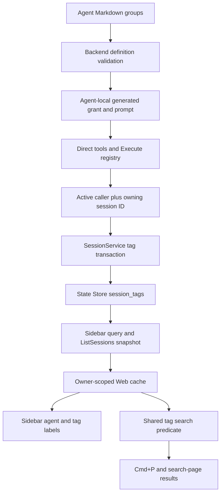
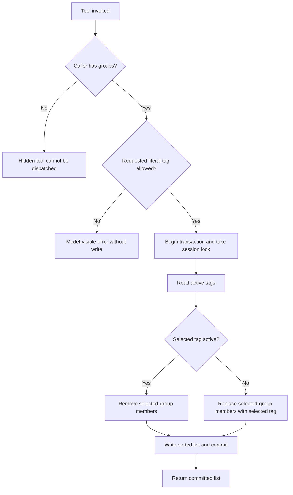
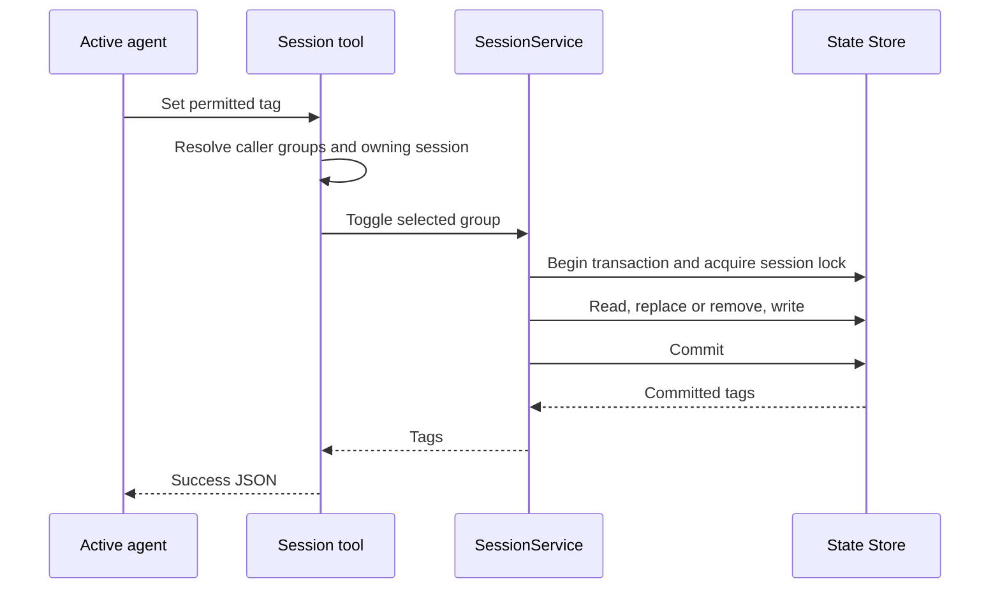
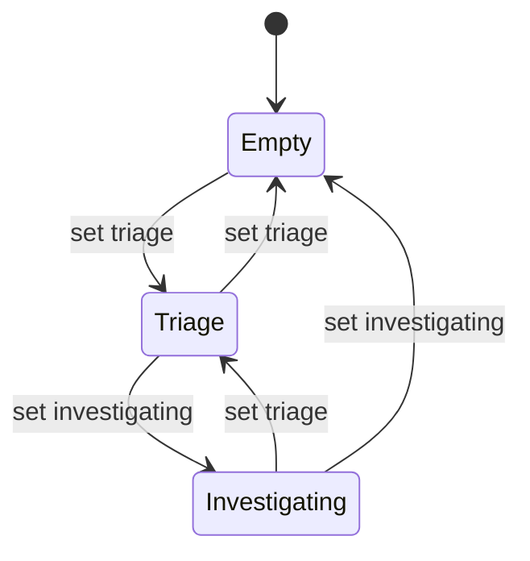
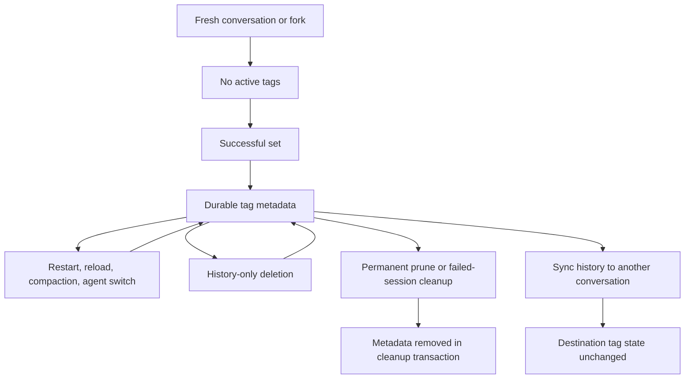

# Durable Session Tags - Plan

## Goal Capsule

- **Objective:** People can recognize and find RocketClaw conversations by tags that permitted agents maintain across restarts.
- **Means:** Agent-local authorization, session-owned metadata, and the existing Web session snapshots and search helpers (KTD1–KTD7).
- **Authority:** The user's exact tool names, configuration path, toggle behavior, and visibility requirements govern the Product Contract. Planning defaults are identified under Assumptions; they are not user-approved decisions. Requirements govern product behavior, technical decisions govern implementation within those requirements, and units override neither.
- **Execution profile:** Six dependency-ordered units across RocketClaw backend, RocketCode tool context, RPC, and Web. This document authorizes no implementation or shipping by itself.
- **Stop conditions:** Stop if caller identity requires runtime API changes beyond KTD3's narrow data accessor, if persistence requires a managed conversation row, or if a quality budget cannot be met without hiding code or raising its limit. Reconfirm scope rather than substituting tool names, the configuration path, or toggle semantics.
- **Completion owner:** A later implementer completes all units, runs the Verification Contract, and reports remaining blockers. Commit, push, and deployment require separate authority.

---

## Product Contract

### Summary

Add `rocketclaw_set_tag(tag)` and `rocketclaw_get_tags()` for the calling agent's owning RocketClaw session.
Agent Markdown defines allowed tag groups at `permission.rocketclaw.rocketclaw_set_tag`.
Web shows the active tags beside the agent name and accepts `tag:NAME` filters in Cmd+P and the search page.

### Problem Frame

Conversations currently expose names, agents, previews, and other sidebar metadata, but no durable agent-maintained classification.
People must infer a conversation's category from those fields or search its text.

### Requirements

**Agent configuration and authority**

- R1. Read allowed groups from `permission.rocketclaw.rocketclaw_set_tag`, expressed as a list of tag lists inside the existing `permission:` configuration. Preserve other permission rules and supported scalar forms.
- R2. Expose exactly `rocketclaw_set_tag(tag)` and `rocketclaw_get_tags()` when the active calling agent has configured tag groups.
- R3. Without configured groups, omit both tools from model declarations, Execute bindings/catalog, and generated prompt advertising, including under broad existing RocketClaw permissions.
- R4. Reject a tag outside the calling agent's allowed groups with a model-visible error and no metadata mutation.
- R5. Explain the available tag tools, allowed groups, within-group exclusivity, and toggle behavior beside the existing permission/tool messages in that agent's prompt.

**Session behavior**

- R6. Selecting an inactive permitted tag replaces any active tag in its group; selecting the active tag removes it, leaving other groups unchanged.
- R7. Store tags as durable session metadata, independent of transcript replay, summaries, process memory, and compaction.
- R8. Both tools operate only on the owning RocketClaw conversation; neither accepts an arbitrary session ID.
- R9. Concurrent successful tag calls preserve R6 without losing changes to other groups. Rejected calls and confirmed transaction rollbacks leave prior committed tags intact; unknown commit outcomes follow KTD5.

**Web behavior**

- R10. Display active tags beside the agent name in sidebar session rows, including active and settled rows, and reflect tag-only snapshot updates.
- R11. Cmd+P and the search page support `tag:NAME` using the same tag-filter semantics and combine it with existing filters and residual text search.
- R12. Preserve current Web authorization, session-discovery exclusions, ordering, snapshot ownership, and incomplete-search signals while adding tags.

**Delivery**

- R13. Cover permissions, tools, prompts, persistence, RPC, sidebar rendering, and both search surfaces with behavioral tests using existing fixtures.
- R14. Document the frontmatter example, tool behavior, and Web search syntax in the affected READMEs and config examples; leave existing agents' tag access disabled unless they opt in.

### Configuration Example

This is the agent Markdown shape, inside the existing `permission:` field, not a daemon setting:

```yaml
---
permission:
  rocketclaw:
    rocketclaw_set_tag:
      - [triage, investigating, resolved]
      - [customer, internal]
---
```

### Acceptance Examples

| Example | Starting state and action | Expected result | Covers |
|---|---|---|---|
| AE1 | No tags; set `triage`, then `customer` | Both tags remain active | R6, R8 |
| AE2 | `triage` and `customer`; set `investigating` | `investigating` replaces `triage`; `customer` remains | R6 |
| AE3 | `investigating` and `customer`; set `investigating` again | Only `customer` remains | R6 |
| AE4 | `customer`; request unconfigured `urgent` | Model sees an error; state stays `customer` | R4, R9 |
| AE5 | Root agent has groups; its child has none | Child sees neither tool or generated tag guidance | R2, R3, R5 |
| AE6 | Tags committed; reload runtime and reopen the State Store | Get returns the same tags; Web's next snapshot carries them | R7, R10 |
| AE7 | Only one of two sessions has `customer`; search `tag:customer` | Both search surfaces return only that session | R11, R12 |
| AE8 | Search `tag:customer outage`; transcript hits span both sessions | Only tagged sessions contribute hits; text search receives `outage` | R11, R12 |

### Scope Boundaries

- No manual Web tag editor, tag colors, taxonomy management page, autocomplete requirement, arbitrary-session tag mutation, or Slack tag command.
- No new tag event channel, transcript-derived tags, summary backfill, saved-search field, periodic reconciliation, tag copying during Sync, or mutation retry/idempotency framework.
- Private sessions may hold metadata without becoming visible in Web; R12 still controls discovery.
- No changes to implementation/review engine preferences, no implementation in this planning task, and no test execution to validate the design.

---

## Assumptions

These are inferred defaults for gaps in the request, not human-settled choices.

- A1. Tag identity is exact and case-sensitive. Names are literal strings, not permission wildcard patterns; do not trim, fold case, or Unicode-normalize them. Empty names, non-list shapes, empty inner groups, and names repeated anywhere within one agent's groups are configuration errors. An absent or empty outer list disables tagging.
- A2. The tag groups are the sole tag-tool grant. Other tool rules neither grant missing tag access nor require a second grant when groups exist. Existing explicit workflow worker tool limits still apply, and handoff generation stays tool-free. Invalid tag configuration follows runtime-definition validation and staged reload failure rather than silently enabling tools.
- A3. All permitted callers read the complete owning session's active tag list. A child uses its own groups but shares its parent's owning conversation ID, matching the current-session-ID tool.
- A4. Agent switches and configuration reloads retain stored tags. A set call applies the current caller's selected group, removing every stored member of that group before adding the selected inactive tag or leaving the group empty when toggling off. Tags outside that group remain, including names no longer configured. The exclusivity rule applies to the caller's group at mutation time; reload does not silently reconcile historical tags.
- A5. Fresh sessions and forks start untagged. Sync copies history, not tag metadata; private producer X and human-visible destination Y keep separate tag sets. History-only deletion retains the owning conversation's tags; permanent session pruning and failed creation cleanup remove them.
- A6. Both tool successes return text containing the same JSON object shape, `{"tags":[...]}`, with an empty list represented as `[]`. Arrays contain unique names in deterministic lexical order, independent of configuration order.
- A7. Tag filters are exact, case-sensitive membership tests with AND semantics for repeated filters. `tag:"NAME WITH SPACES"` uses a JSON-quoted string value, including JSON escaping; unquoted values end at whitespace. Unknown tags match nothing. Bare `tag:`, an unclosed quote, or an invalid quoted value remains residual text rather than becoming a broad empty filter.
- A8. A committed tag change becomes visible through the existing sidebar refresh cycle, not an immediate pushed event. The current cycle is two seconds, excluding request and render time; changing it is outside scope.

---

## Planning Contract

### Key Technical Decisions

- KTD1. **Read tags from the existing permission configuration.** RocketCode's permission parser leaves a list-valued `rocketclaw.rocketclaw_set_tag` entry for RocketClaw to decode as grouped configuration, not action rules. Validate R1/A1 in `loadRocketCodeDefinitionsIn` using one backend-local decoder at the dynamic `Agent.Frontmatter` boundary, shared by definition validation and tools. Existing scalar permission forms remain valid and do not enable tags. Sources: `internal/rocketcode/permission.go`, `internal/rocketcode/agents.go`, `internal/rocketclaw/backend/session_tools.go`, `internal/rocketclaw/backend/bridge.go`.
- KTD2. **Compile a private tag-tool permission category.** For every loaded agent, replace the runtime-only `rocketclaw_tags` bucket with explicit allow or deny rules derived from KTD1, using tool names as subjects rather than tag names. Exclude this generated bucket from generic `permissionPrompt`; do not put tag tools in the unconditional auto-allow list. In prepared singular `rocketclaw` rules, omit exact tag-tool subjects: A2 makes them irrelevant to authority, but generic prose would still advertise those tools. Preserve source frontmatter and unrelated rules. In persistent and cron runs, append R5 guidance to each permitted agent's `Prompt` beside the generated permission section. Workflow loading validates and compiles authority but defers guidance to the runner: after worker instructions replace the prompt, advertise only the tag operations available in that run. Before constructing a workflow runtime, intersect its generated tag rules with any explicit worker tool allowlist using call-local permission slices. `RestrictTools` alone removes direct declarations, not Execute's custom-tool hosts. A workflow worker name is a label, not another configured agent identity. This gives R2–R5/A2 one authority without leaking deny-rule names or widening worker limits. Sources: `internal/rocketcode/tools.go` (`toolVisible`, `assembleTools`), `internal/rocketcode/skills.go`, `internal/rocketcode/rocketcode.go` (`RestrictTools`), `internal/rocketclaw/backend/bridge.go`, `internal/rocketclaw/backend/raw_run.go`.
- KTD3. **Use the existing tool-call context to identify the caller.** Add only the narrow cross-package data accessor needed to obtain the active looper's existing `Agent` value from that context; consumers must not mutate its data. Decode its retained frontmatter with KTD1 at the tool boundary. Both direct calls and nested Execute calls already pass this context. Register both tools in `rocketcodeConfig` regardless of the root agent's groups. Pass the same session-bound `rocketcode.Tool` values through `newWorkflowAgentRunner`'s `CustomTools` from both `runWorkflow` and `runNestedWorkflow`; do not expose the other bridge tools to isolated workflows. The conversation ID remains the bridge's bare stored ID under R8/A3, not the worker's memory history or delegation ID. `GenerateHandoff` receives no custom tools or tag guidance. This avoids a second agent registry, injected callback, visibility hook, or root-agent authority closure. Sources: `internal/rocketcode/permission_gate.go`, `internal/rocketcode/looper.go` (`withToolCallContext` call site), `internal/rocketclaw/backend/session_tools.go`, `internal/rocketclaw/backend/raw_run.go`, `internal/rocketclaw/backend/dynamic_workflow_tool.go`, `internal/rocketclaw/backend/handoff.go`.
- KTD4. **Persist a session-keyed tag list.** Add `internal/rocketclaw/backend/migrations/019_session_tags.sql` with a `session_tags` table keyed by `conversation_id` and one non-null JSONB array column for active tag names. Do not add a foreign key to `managed_conversations`: private MCP/exec histories can exist without that row. Keep the representation a typed string slice and reuse existing JSON/database patterns. Read missing metadata as an empty list. The array need not persist group indexes, whose meaning changes with agent configuration. Sources: `internal/rocketclaw/backend/store.go`, `internal/rocketclaw/backend/store_schema_test.go`.
- KTD5. **Serialize the full read-modify-write in PostgreSQL.** Before reading or creating metadata, a set transaction takes `lockSessionHistory` for the owning conversation, then applies R6/A4, sorts the result, writes it, and commits before reporting success. This existing transaction-scoped advisory lock also covers private sessions and missing rows; row locking alone cannot protect the first insert. Do not add a process mutex, goroutine, timer, or automatic retry. On commit errors, report failure without asserting rollback: the server may have committed before the response was lost. A subsequent get reads current state, not proof of which call caused it. Extend permanent cleanup in the same transactions and lock order as history cleanup. `stalePrivateConversationIDs` must discover candidates from both history and tag rows, retaining its private-ID prefixes and reference exclusions. Use the latest history timestamp when present and the existing Unix-epoch private-session fallback when absent; history-only deletion must not leave undiscoverable tag rows. No tag timestamp is needed. Tags do not update history summaries, session activity, settlement, or snooze. Sources: `internal/rocketclaw/backend/store.go` (`stalePrivateConversationIDs`, `sessionLatestBefore`, `pruneExternalMCPSessions`), `internal/rocketclaw/backend/store_summaries.go`; [PostgreSQL explicit locking](https://www.postgresql.org/docs/current/explicit-locking.html#ADVISORY-LOCKS), [pgx v5.11.0 transaction behavior](https://github.com/jackc/pgx/blob/v5.11.0/tx.go).
- KTD6. **Extend the current snapshot, not the event protocol.** Add tags to `SidebarSession`, join tag metadata in the existing sidebar query, map it to additive protobuf `Session.tags` field 14, and carry it through HTTP and the Web `Session` type. No per-row database request or new protocol event is needed. Existing owner/protocol-scoped IndexedDB rows already store the complete session object. Keep tags optional in Web's type for older cached rows and treat only that absent data as an empty list. Sources: `internal/rocketclaw/backend/store.go`, `internal/rocketclaw/frontend/rpc/server.go`, `internal/rocketclaw/web/proto/web.proto`, `internal/rocketclaw/web/src/session-list.ts`.
- KTD7. **Keep one search parser and predicate.** Extend Web's existing `sessionSearchTerms` and `sessionMatchesSearch` with A7. Remove valid tag filters from residual `text`/`needle`; use the parsed tags in Cmd+P, search-page metadata results, and the visible-session set that filters transcript hits. Update the settled-list caller of the shared search input and the agent/room overlay selection logic so neither drops tag filters. Existing raw saved queries retain tag filters without a storage migration. Sources: `internal/rocketclaw/web/src/ui.tsx`.

### High-Level Technical Design

The diagrams describe the chosen boundaries and flows; exact private helper names and SQL expressions remain implementation details.

**Component relationships (KTD1–KTD7)**



**Mutation authorization decisions (KTD2–KTD5)**



**Mutation protocol (KTD3–KTD5)**



**Within-group state transitions (R6)**



The `customer`/`internal` group does not participate in these transitions (AE1–AE3).

**Metadata lifecycle (A4–A5, KTD4–KTD6)**



**Snapshot and search data flow (KTD6–KTD7)**

```text
stored tags -> eligible sidebar rows -> authorized snapshot -> owner-scoped Web rows
query -> shared parser -> literal tags + existing filters + residual text
Web rows + filters -> matching sessions -> Cmd+P and search-page metadata results
residual text -> transcript search -> hits intersected with matching session IDs
```

**Caller-permission combinations (R2–R5, A2, KTD2)**

This matrix applies to session-owned persistent and cron runs, independently for each root or child agent, and to session-owned workflow workers with unrestricted tool lists.

```text
caller tag groups   singular tool rules   direct declarations   Execute catalog   tag guidance
configured          allow                 present               present           present
configured          deny or absent        present               present           present
absent or empty     allow                 absent                absent            absent
absent or empty     deny or absent        absent                absent            absent
```

An explicit workflow worker list further limits tag operations in both direct and Execute paths; guidance describes only the remaining operations. An empty list exposes none. Handoff generation exposes no tools or tag guidance even when its source agent has groups (A2, KTD2–KTD3).

**Configuration and query surface (R1, A1, A7, KTD7)**

```text
tag groups := list of nonempty lists of unique nonempty literal strings
query := existing text and filters, with tag filters at token boundaries
tag filter := tag:UNQUOTED_NAME | tag:JSON_QUOTED_NAME
tag match := every parsed tag is an exact member of the session's active tags
residual text := original query with only valid tag filters removed
```

### System-Wide Impact

- **Agent runtime:** A child, guardrail, or reviewer receives only its own compiled authority and prompt. The bridge supplies session ownership; the active looper supplies caller identity. A root-only tool registration condition would violate AE5.
- **Prompt and execution parity:** Visibility must agree across model declarations, Execute catalog/bindings, invocation gating, and generated prompt text. Excluding a declaration alone is insufficient.
- **Workflow boundaries:** Top-level and nested workflow runners need the owning bridge's tag tools under KTD3. Their prompts and call-local permissions must survive instruction replacement and worker allowlists under KTD2, without changing the tool-free handoff contract.
- **State and recovery:** Metadata commits independently of replay checkpoints. Replaying stored tool output must not execute the toggle again; a genuinely new call toggles again. A crash between metadata commit and result checkpoint follows existing side-effect-tool behavior, with no new exactly-once promise. Commit-response uncertainty and historyless private-session discovery follow KTD5.
- **UI and caching:** `SessionRowContent` currently omits agent names for active rows through `channelOnly`. `SessionRow`'s custom memo comparator also omits tags. Both need local changes for R10; cache transport alone will not update the display.
- **Privacy and discovery:** Sidebar joins enrich eligible recorded conversations only. Tagging must not discover orphan/private histories or copy a producer's labels into a visible destination.
- **Search:** Search-page text hits are filtered after `SearchMessages` by visible session IDs. Tag-only queries need no transcript search; mixed queries keep the current residual-text search and filter results locally.

### Risks and Dependencies

| Risk or dependency | Treatment |
|---|---|
| Root groups accidentally authorize children | Exercise opposite root/child configurations through real model requests and Execute calls in U2/U3 |
| Generated deny rules advertise missing tools | Inspect complete prompts for both tool names and generated tag guidance in U2/U3 |
| Workflow instruction replacement loses guidance, or Execute bypasses worker limits | Intersect generated rules before runtime assembly and test restricted-then-unrestricted worker calls in U2/U3 |
| Lost updates on first insert or parallel toggles | Acquire the existing session lock before every read/write; use real separate State Store handles in U1 |
| Commit response lost after the server saves a toggle | Follow KTD5's error treatment; do not infer rollback or retry the non-idempotent operation |
| Permanent cleanup misses tag-only private rows, or history deletion removes tags | Extend candidate discovery under KTD5; audit each deletion path and cover A5 in U1 |
| Config regrouping changes interpretation of old tags | Apply A4 on the selected group only; test retention and later replacement without a background reconciler |
| Browser memoization or old cached rows hides fresh labels | Cover tag-only snapshots, absent tags, and owner changes in U5 |
| Migration/generated wire artifacts drift | Use the existing migration loader and RPC generator, including the protocol hash, in U1/U4 |
| Local test prerequisites are absent | Require a PostgreSQL test database, browser module/executable, and the commands in the Verification Contract; skipped tests do not prove acceptance |
| CLOC headroom is insufficient | Measure existing component budgets before implementation; reduce only feature-local overhead or report the conflict, never raise limits or move code to excluded paths |

### Documentation and Rollout

- Update `internal/rocketclaw/web/README.md` for labels, exact tag filtering, and quoted names; update `internal/rocketclaw/frontend/rpc/README.md` for the additive snapshot field and retained history-deletion metadata.
- Update the repository `README.md` where agent permissions and session tools are documented. Show R1 within the existing permission examples. Add an opt-in illustrative agent example without granting tags to every shipped agent.
- The migration starts with no tag rows and needs no backfill. Deployment must apply it through the normal State Store startup migrations before tag-enabled code reads the table.
- After migration 019 is recorded, a binary without it cannot start against the upgraded migration ledger. Retain the tag table and ledger; binary-only downgrade is not supported. Dropping metadata is data loss, not a rollback procedure.
- Defer exact private helper names, SQL encoding details, and fixture names to implementation. These choices must preserve the owning KTDs and do not block launch.

---

## Implementation Units

### U1. Persist atomic session tag metadata

- **Goal:** Provide durable reads and group-aware toggles without requiring managed conversation rows.
- **Requirements:** R6–R9, R12, R13; AE1–AE4, AE6; A4–A6.
- **Dependencies:** None.
- **Files:** Create `internal/rocketclaw/backend/migrations/019_session_tags.sql`; extend `internal/rocketclaw/backend/store.go`, `internal/rocketclaw/backend/store_test.go`, and `internal/rocketclaw/backend/store_schema_test.go`. Reuse the existing history lock under KTD5.
- **Approach:** Implement KTD4/KTD5 with private feature-local operations. Audit `DeleteSession`, `RemoveExternalMCPConversation`, `PruneStateBefore`, `stalePrivateConversationIDs`, and `deleteSessionEntries` for A5, including tag-only private candidates. Update the existing store tests' migration-count and old-schema upgrade assertions for the additive migration. Do not alter `SyncConversation` or fork-history copying to copy metadata.
- **Execution note:** Establish the narrow behavioral contract with the existing real PostgreSQL fixture before adding the store operations.
- **Test scenarios:**
  - Covers AE1–AE3. Apply `triage`, `customer`, `investigating`, then `investigating`; assert exact returned and stored lists after each call.
  - Covers AE4. Reject an unallowed name before any write; separately use a context canceled before the transaction begins to fail a store operation and verify the prior committed list through a healthy handle. Reuse the existing store tests' closed-database error pattern for error propagation without introducing an injected failure callback. Do not assert unchanged state after an ambiguous commit error (KTD5).
  - Covers AE6. Close/reopen the store and assert tags persist, including a private ID with history but no managed row.
  - Run concurrent first-insert toggles for two groups through separate handles; both tags survive. Two simultaneous toggles of the same tag leave it inactive, and two different tags in one group leave exactly one active.
  - After agent-group regrouping, touching a group clears all its old members and leaves unrelated and now-unconfigured names unchanged (A4).
  - Delete history, regenerate/invalidate summaries, and resume a conversation; metadata persists. Permanently prune or clean up a failed MCP session; its metadata is gone without deleting another conversation's tags. Include a private tag row whose history was deleted, a recent private history, and a historyless private row retained by an existing MCP or queue reference; only the eligible orphan is pruned under KTD5.
  - A new session/fork has no tags, and Sync leaves both source and destination metadata unchanged (A5).
- **Verification:** Real database checks prove restart durability, transaction atomicity, concurrent ordering, lifecycle retention/removal, and no change to activity/settlement/snooze from a tag call.

### U2. Compile per-agent tag authority and prompt guidance

- **Goal:** Make R1 the only source of tag-tool visibility and explain permitted behavior to each agent.
- **Requirements:** R1–R5, R13; AE5; A1–A3.
- **Dependencies:** None.
- **Files:** Extend `internal/rocketclaw/backend/bridge.go`, `internal/rocketclaw/backend/definitions_test.go`, `internal/rocketclaw/backend/raw_run.go`, `internal/rocketclaw/backend/raw_run_test.go`, `internal/rocketcode/skills.go`, and `internal/rocketcode/skills_test.go`; keep any private decoder in the existing backend session-tool file unless the block materially warrants a feature-local file.
- **Approach:** Apply KTD1/KTD2 at definition loading for every agent and every supported tool mode. Skip the generated bucket in RocketCode permission prose; preserve unrelated authored permission prose. A staged reload must validate the same shape before replacing live assets.
- **Test scenarios:**
  - Load the configuration example and assert two intact groups, compiled tool-name grants, and prompt text describing exclusivity and toggling.
  - Load absent and empty groups alongside coarse `permission.rocketclaw: allow`, then alongside exact legacy allow rules naming both tag tools; both tools remain denied and their names are absent from generated prompt prose.
  - Reject scalar groups, empty inner groups, empty names, and duplicate names with a definition-specific error. Literal `*`, `?`, and case-distinct names do not become wildcard grants.
  - Covers AE5. Opposite root/child group configurations produce opposite authority and guidance in persistent and cron modes.
  - A named workflow worker retains its base agent's groups after replacing instructions. Unrestricted, set-only, get-only, and empty worker lists produce matching guidance and tag authority; a restricted call does not alter later calls' prepared definitions.
  - Invalid staged tag configuration leaves live definitions unchanged; the existing singular permission examples and unrelated permission prose remain unchanged.
- **Verification:** Definition and prompt tests prove a single compiled authority, exact `permission.rocketclaw.rocketclaw_set_tag` parsing, actionable guidance, and no absent-tool advertising.

### U3. Bind tag tools to the active caller and owning session

- **Goal:** Let permitted agents mutate and inspect only their owning session with identical direct/Execute behavior.
- **Requirements:** R2–R9, R13; AE1–AE6; A3, A6.
- **Dependencies:** U1, U2.
- **Files:** Extend `internal/rocketclaw/backend/session_tools.go`, `internal/rocketclaw/backend/session_tools_test.go`, `internal/rocketclaw/backend/bridge.go`, `internal/rocketclaw/backend/raw_run.go`, `internal/rocketclaw/backend/raw_run_test.go`, `internal/rocketclaw/backend/dynamic_workflow_tool.go`, `internal/rocketclaw/backend/dynamic_workflow_tool_test.go`, `internal/rocketclaw/backend/handoff_test.go`, `internal/rocketcode/permission_gate.go`, and `internal/rocketcode/permission_gate_test.go`.
- **Approach:** Apply KTD2/KTD3 and return A6 through `TextToolResult`. `set` accepts only required string `tag`; `get` has no arguments. Validate model input and literal membership before the store call. Reuse the session-tool and workflow model-request fixtures rather than inventing a new tool harness.
- **Test scenarios:**
  - Direct declarations show the exact two names and schemas; Execute exposes the same tools and returns the same exact success JSON.
  - With no groups, including exact legacy allow rules for both names, actual model declarations, Execute catalog/bindings, generated prompt, and attempted guessed calls expose no usable tag tool or mutation.
  - Covers AE1–AE4. Drive set/get through model tool calls; errors for unauthorized tags and malformed arguments appear as tool failures and do not change metadata.
  - Covers AE5. Root-with-groups/child-without and root-without/child-with-groups both work as configured. A permitted child with different groups cannot use a root-only tag.
  - An authorized child updates the bridge's owning ID, not its delegation-history ID; neither tool accepts another session's ID.
  - Top-level and nested workflow agents update their owning bridge's tags through direct and Execute calls. Explicit worker lists exclude the same tag operations from both paths, and an empty list prevents mutation. A handoff request has no tools or generated tag advertising and leaves metadata unchanged.
  - A real bridge/store reopen returns persisted tags. Replaying a completed stored tool result does not invoke the toggle again; a new call does.
- **Verification:** Actual model requests and nested Execute calls prove visibility, prompt context, caller identity, error delivery, ownership, and durable results.

### U4. Carry tags through authorized session snapshots

- **Goal:** Supply Web with durable tags through the existing list transport.
- **Requirements:** R7, R10, R12, R13; AE6; A8.
- **Dependencies:** U1.
- **Files:** Extend `internal/rocketclaw/backend/store.go`, `internal/rocketclaw/backend/store_test.go`, `internal/rocketclaw/web/proto/web.proto`, `internal/rocketclaw/frontend/rpc/server.go`, `internal/rocketclaw/frontend/rpc/sidebar_test.go`, and `internal/rocketclaw/frontend/rpc/http_test.go`; regenerate `internal/rocketclaw/frontend/rpc/web.pb.go` and `internal/rocketclaw/frontend/rpc/protocol.gen.go`; update `internal/rocketclaw/web/src/types.ts` and `internal/rocketclaw/web/src/api.test.ts`.
- **Approach:** Implement KTD6 within the existing query and mapping. Preserve finite SSE envelopes, owner/completeness fields, field numbers, and row order. Only add transport data, not mutation RPCs.
- **Test scenarios:**
  - Real stored tags appear on active and settled list rows in deterministic order; missing metadata produces an empty list.
  - A tag-only mutation changes the next RPC/HTTP snapshot without changing preview, updated time, pin, settlement, or snooze.
  - Private MCP/Cron/orphan rows remain excluded even when tagged, and unauthorized Web clients gain no access.
  - Existing cancellation, partial enumeration, terminal completeness, and bytewise tie ordering remain intact with tags present.
  - The generated protocol hash and new field decode agree; an older response without tags remains usable by Web.
- **Verification:** Database-backed sidebar and real RPC/HTTP tests show an additive field without widening discovery or changing transport semantics.

### U5. Render tags and share tag-filter semantics

- **Goal:** Make tags visible and searchable on every requested Web surface.
- **Requirements:** R10–R13; AE7, AE8; A7, A8.
- **Dependencies:** U4.
- **Files:** Extend `internal/rocketclaw/web/src/ui.tsx`, `internal/rocketclaw/web/src/session-list.test.ts`, `internal/rocketclaw/web/src/session-list.browser.test.ts`, `internal/rocketclaw/web/src/search-page.browser.test.ts`, and `internal/rocketclaw/web/src/session-commands.browser.test.ts`.
- **Approach:** Apply KTD7. Show plain tag labels on the agent metadata line using the existing row content component, including active rows currently using `channelOnly`. Include tag-array contents in the existing memo comparison. Keep the current full-row cache and owner isolation without a second tag cache or IndexedDB schema bump. Preserve parsed tag filters when an agent/room choice rewrites the raw query.
- **Test scenarios:**
  - Active and settled rows show agent names and all tags side by side; empty/absent tags show no empty badge. Long names remain readable through the existing row layout/title affordances, and labels render as text, not markup.
  - Push two otherwise-identical snapshots with different tags; the mounted row and current search results update. Reload a saved owner-scoped snapshot and preserve tags; switch owner and do not retain another owner's tags.
  - Covers AE7. Cmd+P and search page agree on exact tag matches, unknown tags, empty tag sets, case differences, and tag-only queries.
  - Covers AE8. Mixed tag/text queries filter metadata and transcript hits independently; the transcript request receives only residual text and cannot leak an untagged hit.
  - Combine repeated tags with `is:pinned`, `is:forked`, agent and room selections; selection preserves tag filters and unrelated filters retain existing behavior.
  - Quoted multiword names and escaped quotes match literal tags; bare or malformed filters remain residual text under A7. A saved query containing tags still works after reload.
  - Partial/offline enumerations keep current loading/incomplete signals; tag-only filtering does not claim a complete empty result while session discovery is incomplete.
- **Verification:** Existing browser fixtures prove the mounted UI, both keyboard/search flows, live snapshots, escaping, owner-isolated caching, and transcript filtering—not source-string assertions alone.

### U6. Document and verify the complete feature

- **Goal:** Leave operators an accurate opt-in example and a fully checked cross-surface change.
- **Requirements:** R13, R14; all acceptance examples.
- **Dependencies:** U3, U5.
- **Files:** Update `README.md`, `internal/rocketclaw/frontend/rpc/README.md`, and `internal/rocketclaw/web/README.md`; place any new agent config example in the existing documented example location. Do not modify `.rocketclaw/config.yaml` model-routing preferences.
- **Approach:** Apply Documentation and Rollout, then complete the Verification Contract. Reuse U1–U5 checks as the end-to-end proof; do not add a parallel integration harness. Resolve findings in their owning files and remove abandoned feature-local code.
- **Test expectation:** No new tests for prose alone; U1–U5 supply the behavioral coverage. Check the documented frontmatter through the definition-loader fixture and search examples through U5.
- **Verification:** Documentation matches implemented defaults, all required checks actually run, skipped integration/browser tests are reported as incomplete, and source/coverage budgets pass without changing limits.

---

## Verification Contract

These checks belong to implementation, not this planning run.
Use Go 1.26.2 or newer, Bun at the repository version, PostgreSQL, the existing protobuf generator, and the tools required by the Makefiles.
All temporary files, test-process scratch, and any verification workspaces stay beneath the active repository's `.tmp/`; set temporary-directory environment values accordingly.

**Execution handoff is blocked by unverified prerequisites.** During planning, `ROCKETCLAW_TEST_DATABASE_URL`, `ROCKETCLAW_PLAYWRIGHT_MODULE`, and `ROCKETCLAW_CHROMIUM` were unset locally. `.github/workflows/test.yml` declares database and browser provisioning, but it has not been exercised for this plan. Configure the existing prerequisites and establish readiness before execution handoff; no tests run in this planning task.

| Check | Scope | Passing evidence |
|---|---|---|
| `gofmt` on touched Go files | U1–U4 | No remaining formatting differences |
| `go test ./...` from repository root | Whole Go workspace | All tests pass; required PostgreSQL cases run with `ROCKETCLAW_TEST_DATABASE_URL` |
| `make lint` from repository root | Existing component lint/build gates | No lint failures or unreviewed autofix drift |
| `make test` from repository root | Existing race, coverage, CLOC, and component gates | All required gates pass; no budget override |
| Web `make lint` and `make test` | `internal/rocketclaw/web` | Typecheck, lint, React checks, and Bun tests pass |
| Existing Web browser tests | U5's three browser-test files | Tests run with `ROCKETCLAW_PLAYWRIGHT_MODULE` and `ROCKETCLAW_CHROMIUM`, rather than skip |
| Repository `make check-cloc-budget` | RocketClaw, RocketCode, Web, and existing component gates | Production code remains below each unchanged component limit |
| Touched-diff standards pass | U1–U6 | Every changed line serves this feature; no accidental API growth, callbacks, nil dependency fallbacks, or unrelated cleanup |

The standard root `make test` delegates to component Makefiles; Web tests/lint must still be run explicitly.
The coverage gate requires nondecreasing coverage below its existing stable threshold, or at least that threshold once reached; use the Makefiles as the owner of exact budgets.
No command may suppress linters, override CLOC limits, or move first-party code into metric-excluded paths.
If a required command or environment cannot run, stop and report why rather than declare implementation complete.

For Go work, apply `AGENTS.md` to the actual touched hunks before editing, during edits, before tests, and after tool autofixes.
Use typed config/request/results, `err`-prefixed error locals, and modern `slices` operations where appropriate.
Reuse the database lock and synchronous store calls; do not introduce context fields, weak/cleanup caches, new timers, or production goroutines for tagging.
Use `go doc`/`gopls` to check touched APIs; avoid blanket modernization of unrelated files.
PostgreSQL I/O tests need real completion synchronization rather than wall-clock sleeps or a `synctest` bubble around network I/O.
Fixtures involving sandboxed agent files must create them through `*os.Root`, and any new interface mocks must use mockery v3.

---

## Definition of Done

- Every R-ID is implemented and covered by its units' observable checks; AE1–AE8 hold on the real runtime/transport/browser surfaces.
- Exact tool names and the `permission.rocketclaw.rocketclaw_set_tag` frontmatter path hold, per-agent direct/Execute/prompt authority agrees, and unauthorized calls never mutate metadata.
- Restart, concurrency, cleanup, fork/Sync defaults, tag-only display changes, and both search surfaces satisfy the declared assumptions without hidden reconciliation or copying.
- All Verification Contract commands run successfully, including database/browser tests, coverage, and unchanged CLOC budgets.
- README and config-example updates are accurate, generated protocol artifacts match their source, and no abandoned attempts, defensive scaffolding, or unrelated edits remain.

---

## Appendix

### Source Map

- Definition preparation and bridge ownership: `internal/rocketclaw/backend/bridge.go` (`loadRocketCodeDefinitionsIn`, `rocketcodeConfig`, `runWorkflow`), `internal/rocketclaw/backend/raw_run.go` (`newWorkflowAgentRunner`), `internal/rocketclaw/backend/dynamic_workflow_tool.go` (`runNestedWorkflow`), `internal/rocketclaw/backend/handoff.go` (`GenerateHandoff`).
- Session-tool schemas, result format patterns, and model-request fixtures: `internal/rocketclaw/backend/session_tools.go`, `internal/rocketclaw/backend/session_tools_test.go`.
- Frontmatter retention, per-agent assembly, prompt ordering, and nested permission context: `internal/rocketcode/agents.go`, `internal/rocketcode/tools.go`, `internal/rocketcode/skills.go`, `internal/rocketcode/permission_gate.go`.
- Durable lifecycle and the existing transaction lock: `internal/rocketclaw/backend/store.go`, `internal/rocketclaw/backend/store_summaries.go`, `internal/rocketclaw/backend/store_schema_test.go`.
- Session wire contract and generators: `internal/rocketclaw/web/proto/web.proto`, `internal/rocketclaw/frontend/rpc/server.go`.
- Repeated list snapshots, caching, shared search, and memoized rows: `internal/rocketclaw/web/src/ui.tsx`, `internal/rocketclaw/web/src/session-list.ts`.
- Verification owners: `Makefile`, `internal/rocketclaw/Makefile`, `internal/rocketcode/Makefile`, `internal/rocketclaw/web/Makefile`, and the existing browser-test environment checks.
- Domain vocabulary and repository constraints: `CONCEPTS.md`, `AGENTS.md`. No existing plan is a work source for this document.
