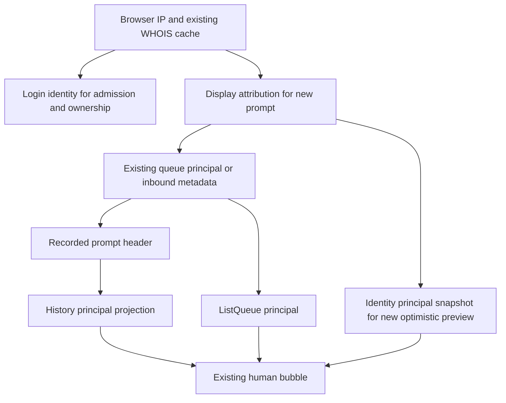

# Web Human Author Attribution - Plan

## Goal Capsule

- **Objective:** Readers can see who wrote each human message in Web chat without opening its details.
- **Means:** Separate login identity from message attribution, then carry the recorded author into the existing bubble (KTD1–KTD3).
- **Authority:** Product requirements govern behavior; technical decisions govern implementation within them; repository instructions remain binding.
- **Execution:** One small combined change, U1 → U2 → U3. This document authorizes planning only; implementation and shipping require the caller's authority.
- **Stop:** Report a conflict with a settled decision, an unavailable verification prerequisite, or a budget failure rather than broadening the work.

## Product Contract

### Summary

Use Tailscale display names in new Web prompt headers and show a compact author label above human message text.
Keep the complete bracket header in the existing info details.

### Problem Frame

Web currently attributes Tailscale messages with login names and hides human attribution behind the info control.
In a shared conversation, readers need to distinguish authors at a glance.

### Key Decisions

- **Tailscale is present on every RocketClaw host.** (session-settled: user-directed — chosen over optional non-Tailscale deployment design: these hosts already run Tailscale.) Governs R1, R2.
- **WHOIS identifies the submitting person.** (session-settled: user-directed — chosen over shared-computer identity design: these hosts are not shared.) Governs R1.
- **Display names and visible labels are required.** (session-settled: user-directed — chosen over login-name or info-only attribution: readers should recognize the human author immediately.) Governs R1, R3, R4.

### Requirements

**Identity and attribution**

- R1. New Web human-message principals use WHOIS `UserProfile.DisplayName`; an explicit `web_users` mapping takes precedence for that browser IP.
- R2. Preserve existing admission failures, authenticated login identity, conversation ownership, and the Config page's Tailscale login display.

**Message display**

- R3. Show the message's recorded principal as a small, always-visible plain-text label above its human text inside the existing bubble; preserve assistant attribution and do not invent guest/owner roles.
- R4. Saved history, live messages, queued/stashed items, and parked steers retain their own authors across viewers, reloads, and promotion.
- R5. Preserve the exact raw bracket header in info details; never infer historical authors from body text or the current viewer, and leave unattributed historical messages unattributed.

### Scope Boundaries

No WHOIS transport, authentication, proxy, or cache redesign; no new identity service, dependency, migration, backfill, or assistant relabeling.

## Planning Contract

### Key Technical Decisions

- KTD1. **Expose login and attribution separately from the existing resolver.** Extend its existing WHOIS decode/cache record with the display name, retaining the CLI call, IP normalization, five-minute successful cache, mutex, and failure behavior. Existing authorization/ownership callers continue using the login result; `prompt` uses the attribution result for queue principals and inbound principal metadata. Keep the authenticated login as the inbound sender/routing value. Per R1, R2. (session-settled: user-directed — chosen over login-name prompt attribution: implements the required human display name without changing access.)
- KTD2. **Project a principal through existing message transport shapes.** Add `principal` to `TranscriptEvent` and `QueueItem`. Decode only the stored header's top-level principal attribute in Go with `strconv.QuotedPrefix` and `strconv.Unquote`, following `backend/bridge.go`'s `provenanceHeader` grammar rather than searching inside quoted instruction text. Populate it after `transcriptEntry` rebuilds user events through `inputEvent`, so attachment projection cannot discard it. `ListQueue` copies the already-recorded queue principal. Per R4, R5.
- KTD3. **Use server-resolved attribution only for a new submission's optimistic preview.** Add `principal` alongside the unchanged `IdentityResponse.username`, carrying both in the existing identity query and keeping every owner/cache-key consumer on `username`. Snapshot the server-provided principal into new composer and handoff optimistic lines, including parked steers; never apply it to fetched history or queue items. Authoritative history/queue reconciliation replaces the preview by existing input IDs. If identity is refreshing or unavailable, omit the provisional label until recorded attribution arrives rather than guessing. Per R3–R5.

### Assumptions

WHOIS profiles can omit `DisplayName`: existing identity fixtures contain only `LoginName`, and upstream documents no mandatory display-name value.
For an absent or blank display name, retain the admitted login as attribution rather than adding an admission failure; explicit mappings retain their configured name.
This is the only display-name fallback, not an alternate deployment mode.

### High-Level Technical Design

Directional sketches; existing code owns the exact implementation.



```text
New send: server-resolved preview → recorded queue/history replaces preview by input ID.
Saved/live input: stored header → Go principal decode → transcript event → bubble label.
Bubble layout: author label / existing message text; raw header remains in info details.
```

## Implementation Units

### U1. Resolve display attribution without changing login identity

- **Goal / requirements:** Supply the correct principal at submission (R1, R2; KTD1).
- **Files:** `internal/rocketclaw/frontend/rpc/server.go`, `server_test.go`; inspect/update resolver callers in that package, including `transport.go`, `attachments.go`, and `session_commands.go` only as required by its return shape.
- **Approach:** Reuse existing identity/cache types and the prompt's queue/inbound metadata paths. Keep Config and admission/ownership callers on login identity. No new callback, goroutine, mutex, or exported helper.
- **Test scenarios:** Extend existing WHOIS/cache cases with login `alice@example.com` and display `Alice Smith`: admission, owner, and Config remain login-based, while steer/queue/stash record `Alice Smith`. A manual mapping records its configured name without requiring WHOIS for admission. Missing display retains login; tagged nodes, missing login, malformed output, and lookup failure preserve current rejection. Cache hits retain both names without another CLI call.
- **Verification:** Existing RPC identity/cache and prompt/queue regressions pass through the real CLI fixture and backend paths.

### U2. Carry authors into human bubbles

- **Goal / requirements:** Render each message's own author (R3–R5; KTD2, KTD3). Depends on U1.
- **Files:** `internal/rocketclaw/web/proto/web.proto`; generated `internal/rocketclaw/frontend/rpc/web.pb.go`; RPC `server.go`, `transport.go`, `server_test.go`; Web `src/types.ts`, `src/api.ts`, `src/ui.tsx`, `src/message-footer.test.tsx`, `src/transcript.test.ts`, `src/session-list.browser.test.ts`.
- **Approach:** Add only the three principal transport fields from KTD2/KTD3 and regenerate through the existing command. Preserve them through `historyLines`, `Line`, and `pendingInputs`. Render a muted, readable label inside `BubbleContent` before `TranscriptText`; add the same compact author above queue-row text without changing its controls. Long names wrap within the message at narrow widths; render text, not HTML. Cover both `sendComposer` and `HandoffDialog` optimistic creation.
- **Test scenarios:** Extend existing header projection cases for spaces, Unicode, quotes, backslashes, Go escapes, trailing `additional_instructions`, and principal-like text inside those instructions; a missing/malformed principal gives no label and leaves the raw header intact. Verify attachment-bearing human events retain it. With Alice viewing Bob's history/live input/queue/stash/parked steer, every recorded label stays Bob through promotion and reload. New optimistic input uses only its submission snapshot and becomes the recorded author when history arrives. Historical entries without metadata stay unlabeled; assistants and info details remain unchanged. Browser assertions check visibility without hover, placement inside the bubble, narrow-screen wrapping, and existing queue order/actions.
- **Verification:** RPC projection tests, existing Web unit tests, and the real-browser test pass with exact author/header assertions.

### U3. Correct documentation and run the gates

- **Goal / requirements:** Document the R1–R5 contract and verify the combined change. Depends on U2.
- **Files:** `README.md`, `internal/rocketclaw/web/README.md`, `internal/rocketclaw/frontend/rpc/README.md`.
- **Approach:** Correct the Web README's display-only WHOIS admission claim; explain manual-map precedence, login versus display-name attribution, the missing-name fallback, visible author labels, and retained info headers. Do not expand deployment guidance.
- **Test expectation:** None — documentation-only unit; behavioral coverage belongs to U1/U2.
- **Verification:** Run the Verification Contract and inspect the final diff against the original identity, routing, and queue invariants.

## Verification Contract

- Keep all scratch and tool temporary directories under this workspace's `.tmp/`; use `jj`, never `git`.
- Before, during, and after Go edits, apply `AGENTS.md`'s Go standards to the touched hunks: standard-library parsing, `err`-prefixed errors, existing mutex lifetime, request-scoped contexts, no defensive internal guards or delegating wrappers. Keep rooted attachment access unchanged; no iterators, cleanups, weak pointers, or timing machinery are needed here.
- From the repository root: `go generate ./internal/rocketclaw/frontend/rpc`, `gofmt` on touched Go files, `go test ./...`, `make lint`, and `make test`.
- From `internal/rocketclaw/web`: `bun run lint`, `bun run build`, `bun test`, then `bun test src/session-list.browser.test.ts` with documented `ROCKETCLAW_PLAYWRIGHT_MODULE` and `ROCKETCLAW_CHROMIUM` values. A skipped browser test is not a pass.
- Preserve current source-CLOC and coverage budgets; never edit `SOURCE_CLOC_BUDGET`, suppress linters, or exclude first-party code to pass them.

## Definition of Done

U1 preserves login identity while recording display attribution; U2 proves per-message authors across the named paths; U3 corrects the README claims.
All verification gates pass, all settled decisions remain intact, and the diff contains no unrelated cleanup or abandoned experiments.

## Appendix

- `internal/rocketclaw/backend/bridge.go`: `provenanceFromInbound` and `provenanceHeader` already separate prompt principal metadata from connector routing and quote the header value.
- `internal/rocketclaw/frontend/rpc/server.go`: `principal`, `tailscaleUsername`, `prompt`, `listQueue`, `historyEvent`, and `transcriptEntry` are the current identity/projection boundaries.
- [Tailscale UserProfile source](https://github.com/tailscale/tailscale/blob/main/tailcfg/tailcfg.go) defines separate `LoginName` and `DisplayName` fields.
- `internal/rocketclaw/web/README.md` and RPC `README.md` document the existing browser prerequisites and protobuf generation workflow.
