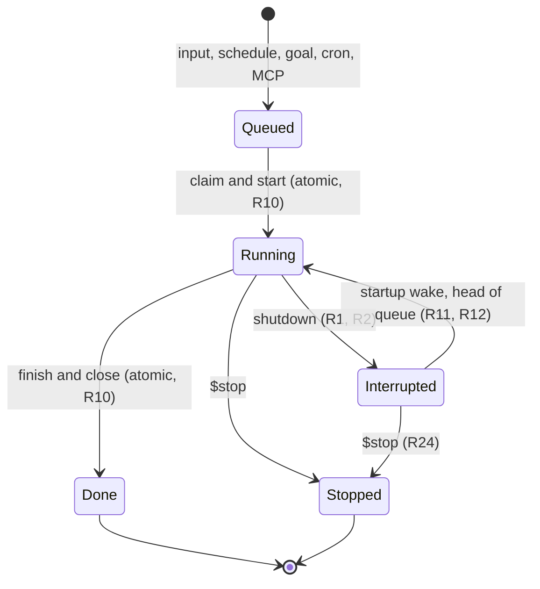
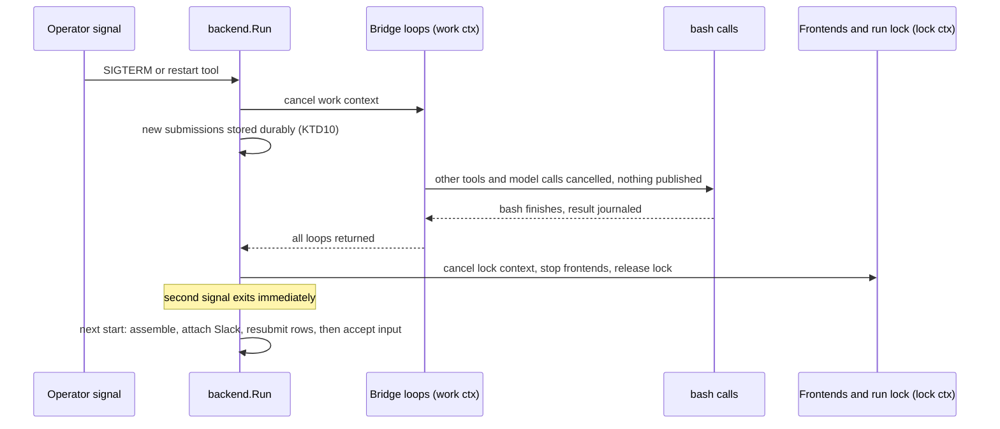
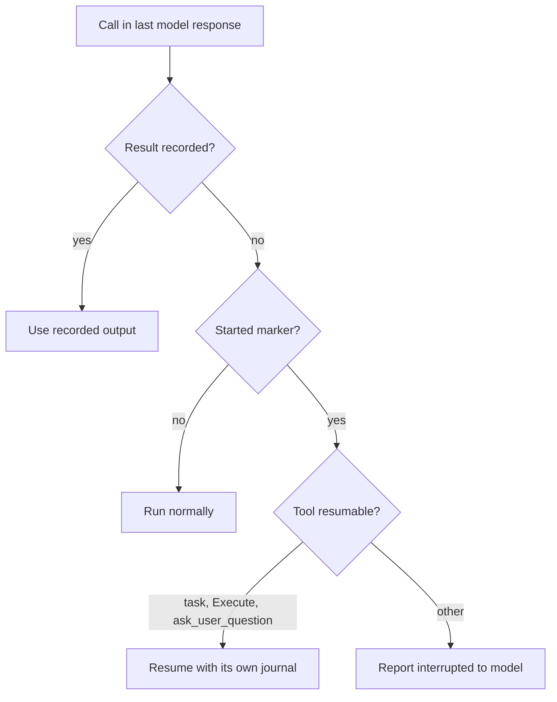
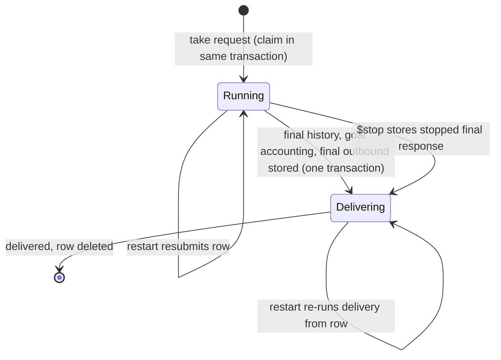

# Restart-Invisible Durable Conversation Work - Plan

## Goal Capsule

- **Objective:** An operator can restart or stop RocketClaw at any moment without a hung shutdown, a forced kill, or human rework: every piece of in-progress conversation work continues after the restart as if the restart had not happened.
- **Means:** One durable step journal per conversation (KTD1), the active-turn row as the durable queue head (KTD4), and a shutdown that cancels everything except running bash (KTD5). The startup recovery phase is removed.
- **Product authority:** Product Contract first, then Planning Contract KTDs on mechanism. Session-settled decisions are not reopened.
- **Execution profile:** Deep, cross-cutting rewrite across `internal/rocketcode`, `internal/rocketclaw`, and `cmd/rocketclaw`. Clean cutover release; no data migration.
- **Stop conditions:** Stop and report if a source CLOC budget would be exceeded after honest deletion, or if evidence shows a settled decision cannot work.
- **Who finishes:** `ce-work` implements units in dependency order; `lfg` reviews and opens the PR.
- **Open blockers:** None.

---

## Product Contract

### Summary

RocketClaw and RocketCode record every step of conversation work durably as it completes, and each conversation gets one durable queue whose head can be an interrupted turn.
Shutdown cancels all work at once except running bash commands, which finish first.
On start, every conversation with pending work wakes through the normal work path and continues from its last recorded step, so humans see no difference.

### Problem Frame

A configuration change needed a `systemctl restart`. Shutdown hung for several minutes and the binary had to be killed with SIGKILL. The work in flight was an External MCP-backed customer-support queue, and the kill caused human rework.

The hang has a structural cause. Shutdown stops frontends before it cancels turns, and two frontends wait without a deadline for whole turns to finish: the cron frontend waits for running cron jobs, whose turns ignore cancellation, and the External MCP server waits for in-flight `session_prompt` requests. Conversation workers run on a context that shutdown never cancels, so those turns are only cancelled after the frontends finish waiting for them. A second interrupt signal is swallowed, leaving SIGKILL as the only exit.

Recovery after a restart is a separate special-purpose phase on top of per-turn snapshots. It has gaps: a queued message is claimed before its turn's first snapshot, a finished turn's history is written before its snapshot is cleared, tool results are saved only per parallel batch, subagents, Code Mode scripts, and workflows keep no resumable state, pending human questions and Slack placeholders live only in memory, a resumed turn that fails posts nothing, and a recovered conversation loses `ask_user_question` until the next restart.

### Actors

- A1. Operator: restarts or stops RocketClaw through the service manager, a signal, or the `rocketclaw_restart` tool.
- A2. Slack and web humans: start turns, steer, answer questions, and read replies.
- A3. External MCP client: the customer-support queue integration. The user controls it and it never retries.
- A4. Unattended work sources: cron jobs, scheduled messages, and goal loops.
- A5. RocketCode agents: root turns, Task subagents, Code Mode scripts, and saved workflow runs with their workers.

### Key Decisions

- **One durable step log for all conversation work.** Resume replays the log at every level instead of keeping a separate snapshot per level, so the startup recovery machinery is deleted rather than extended. Governs R8, R9, R12, R14, R15, R16. (session-settled: user-directed — chosen over per-level snapshots and over model-led resume of scripts and workflows: it is the only option that keeps restarts invisible for scripts and workflows with one concept.)
- **Every interrupted turn resumes automatically.** Governs R13. (session-settled: user-directed — chosen over never resuming and over resuming only unattended turns: unattended cron, goal, and MCP work must keep moving.)
- **Resume from the last finished tool call.** Governs R9, R14. (session-settled: user-directed — chosen over per-batch saving and over rerunning the whole turn: finished side effects must not be repeated.)
- **Claim-and-start and finish-and-close are each one atomic step.** Governs R10. (session-settled: user-directed — chosen over fixing only the finish side and over leaving the crash windows: closes both lost-work and double-run gaps.)
- **Cancel at once, except running bash, which always finishes.** Governs R1, R2, R5, R6. (session-settled: user-directed — chosen over bash commands that outlive the process and over a bash timeout cap: the deployment's service-manager setup is unknown and the behavior must work on Ubuntu and macOS.)
- **Leave the service manager's stop timeout at its default.** Governs R6. (session-settled: user-directed — chosen over documenting or warning about a longer timeout.)
- **Subagents, Code Mode scripts, and workflows are in scope.** Governs R15, R16. (session-settled: user-directed — chosen over root turns only.)
- **Restarts are invisible to humans.** Governs R19, R20. (session-settled: user-directed — chosen over a subtle marker and over an explicit restart notice: a restart should make no observable difference.)
- **Fix the user-facing restart gaps.** Placeholders continue, failed resumes post a final message, pending questions survive, and `ask_user_question` stays available. Governs R20, R21, R22, R23. (session-settled: user-directed — chosen from a presented list of restart-visible problems.)
- **External MCP work finishes; the dropped reply is not recovered.** Governs R25. (session-settled: user-directed — chosen over reply delivery through stream resumption or a result-fetch tool: the client never retries, and finishing the work is what matters now.)
- **Clean cutover release.** Governs R26. (session-settled: user-directed — chosen over migrating in-progress state: the operator stops all work on the old version before starting the new one.)
- **The model learns about a restart only through interrupted calls.** A resumed turn whose steps were all recorded continues with no restart notice. Governs R18.

### Requirements

**Shutdown**

- R1. Shutdown and restart, whether from a signal or `rocketclaw_restart`, cancel all in-progress work immediately except running bash commands. This covers model calls, non-bash tools, subagents, Code Mode scripts, workflow workers, permission reviews, and waits for human answers.
- R2. RocketClaw never terminates a running bash command during shutdown. It waits for each one to finish normally, with no cap on bash timeouts, and records its real output and exit status.
- R3. No shutdown step waits for a whole turn, cron job, External MCP request, or outbound delivery. With no bash running, shutdown completes in seconds.
- R4. While shutdown waits for bash, RocketClaw logs each command it is waiting on with its conversation and elapsed time.
- R5. A second interrupt signal during shutdown exits immediately.
- R6. Shutdown behaves the same on Ubuntu and macOS and does not depend on service-manager configuration. A bash command killed by the service manager or by R5 counts as an interrupted call on resume.
- R7. Input accepted while shutdown is waiting is recorded in the conversation's durable queue and starts only after the restart.

**Durable step log**

- R8. Every step of conversation work is recorded durably when it completes: model replies, tool results, Task subagent steps, Code Mode host calls, workflow worker results, and questions posed to humans with their answers.
- R9. Each tool call's result is recorded the moment that call finishes, independent of other calls in the same parallel batch.
- R10. Taking an item from a conversation's queue and starting its turn is one atomic step, and finishing a turn and closing its in-progress state is one atomic step. A crash at any point neither loses nor double-runs work.

**Queue and resume**

- R11. Each conversation has one durable queue. An interrupted turn sits at its head and runs before any other queued, scheduled, goal, or live input for that conversation.
- R12. On startup, every conversation with pending work wakes through the same path as normal work. There is no separate recovery phase.
- R13. Every interrupted turn resumes automatically, whatever started it: Slack, web, cron, scheduled message, goal loop, or External MCP.
- R14. A resumed turn continues from its last recorded step. Completed steps are not re-executed.
- R15. An interrupted Task subagent resumes inside its resumed parent from its own last recorded step.
- R16. An interrupted Code Mode script or saved workflow run resumes by replaying with the recorded results of its completed host calls and workers, so their side effects are not repeated.
- R17. A bash command that finished during shutdown delivers its real output and exit status to the resumed turn.
- R18. When a resumed turn has calls with no recorded result, the model is told those calls were interrupted and their side effects may be partial.

**What humans see**

- R19. A restart produces no visible notice in Slack or web. Restarts appear only in logs.
- R20. A resumed turn continues in its existing in-progress Slack placeholder and web activity, and ends with the same final message it would have posted without the restart.
- R21. A resumed turn that fails or is stopped posts a final message, as any other turn does.
- R22. A question to a human that is pending at shutdown stays open after restart, and an answer to that same question continues the turn.
- R23. `ask_user_question` is available after a restart wherever it is available for ordinary turns.
- R24. `$stop` on a conversation whose interrupted turn is waiting to resume stops that turn, and it does not resume.

**External MCP**

- R25. External MCP work interrupted by a restart finishes after the restart, and its result is recorded in the conversation and delivered to the paired Slack thread as usual.

**Release**

- R26. The release is a clean cutover. Operators stop all work on the old version first, and the new version does not read or convert the old version's in-progress state.

### Key Flows

- F1. Restart during a turn
  - **Trigger:** The operator restarts RocketClaw while a turn runs a bash command and other tools in parallel.
  - **Actors:** A1, A2, A5
  - **Steps:** Non-bash work is cancelled at once. The bash command finishes and its result is recorded. The process exits. On start, the conversation wakes with the interrupted turn at its queue head. The turn replays its recorded steps, receives the bash result, and continues. It finishes in the existing placeholder.
  - **Covered by:** R1, R2, R8, R9, R11, R12, R14, R17, R20
- F2. Startup
  - **Trigger:** RocketClaw starts.
  - **Actors:** A4, A5
  - **Steps:** Every conversation with an interrupted turn, queued message, due scheduled message, or active goal wakes through the normal work path. Each runs its queue head first.
  - **Covered by:** R11, R12, R13
- F3. Script or workflow resume
  - **Trigger:** A Code Mode script or workflow run was mid-execution at shutdown.
  - **Actors:** A5
  - **Steps:** The script or workflow runs again from its start. Completed host calls and workers return their recorded results without executing. Execution continues live from the first step with no recorded result.
  - **Covered by:** R8, R16, R18

### Acceptance Examples

- AE1. **Covers R1, R2, R17, R20.** Given a Slack turn running a 3-minute bash command alongside a web fetch, when the operator runs `systemctl restart`, then the web fetch is cancelled at once, the bash command completes, and the process exits. After restart the turn continues with the bash command's real output, the web fetch is reported as interrupted, and the thread shows one placeholder and one final answer.
- AE2. **Covers R3, R13.** Given a cron turn in progress with no bash running, when RocketClaw receives SIGTERM, then it exits within seconds, and after restart the cron turn resumes and delivers its result once.
- AE3. **Covers R25.** Given an External MCP `session_prompt` in progress, when RocketClaw restarts, then the caller's connection drops, the work finishes after restart exactly once, and its result appears in the conversation history and the paired Slack thread.
- AE4. **Covers R14, R16.** Given a Code Mode script that completed two of three host calls, one of which wrote a file, when RocketClaw restarts, then the resumed script does not repeat either completed call.
- AE5. **Covers R10.** Given a queued message, when the process crashes after claiming it and before its turn records anything, then after restart the message runs exactly once.
- AE6. **Covers R10.** Given a turn that finished, when the process crashes immediately after, then after restart the turn does not run again.
- AE7. **Covers R22, R23.** Given a turn waiting on an `ask_user_question` answer, when RocketClaw restarts and the human then answers the original question, then the turn continues with that answer, and later turns in the conversation can still ask questions.
- AE8. **Covers R5, R6.** Given shutdown waiting on a long bash command, when the operator sends a second interrupt, then RocketClaw exits at once, and on resume the model sees that bash call as interrupted.
- AE9. **Covers R24.** Given an interrupted turn waiting to resume, when a human sends `$stop`, then the turn ends as stopped and does not run.

### Success Criteria

- Repeating the incident, a restart during an External MCP customer-support turn, completes without SIGKILL and without human rework.
- One resume path exists. The startup recovery phase and its special-case handling are gone from the codebase.

### Scope Boundaries

- Delivering the reply to an External MCP caller whose connection dropped, through stream resumption or a result-fetch tool.
- External MCP request deduplication. The client never retries.
- Migrating in-progress state from the current version.
- A cap on bash timeouts, and documenting or detecting service-manager stop timeouts.
- Bash commands that keep running after the RocketClaw process exits.
- Any restart notice or marker for humans.

### Dependencies / Assumptions

- Slack drops interactive answers clicked while RocketClaw is disconnected. Such an answer has to be given again after restart (R22).
- Replay assumes scripts and workflows reach the same calls in the same order. One that branches on time or randomness may take a different path after a restart, and this is accepted.
- The service manager's default stop timeout (systemd 90 seconds, launchd about 20 seconds) can kill a long bash command during shutdown. This is accepted and handled by R6.
- The External MCP client never retries a dropped `session_prompt`.

### Outstanding Questions

Planning resolved every question deferred to it:

- Divergent replay runs the step live. Matching uses tool name and argument hash (Assumptions, U4, U7).
- The step journal sits beside session history and is cleared when the turn finishes (KTD1, KTD4).
- Spills survive until the turn durably ends, and their state is rebuilt on resume (U2).
- In-memory input and steers become durable through KTD10.
- `rg` and prompt `!cmd` honor cancellation (U1).

### Sources / Research

- Shutdown order and frontend waits: `internal/rocketclaw/backend/app.go:302-316`, `internal/rocketclaw/frontend/cron/manager.go:161-187`, `cmd/rocketclaw/cron.go:53-74`, `internal/rocketclaw/frontend/externalmcp/server.go:118-120`, `cmd/rocketclaw/mcp.go:297-313`.
- Workers never see runtime cancellation: `internal/rocketclaw/backend/thread_bridges.go:756`, `internal/rocketclaw/backend/bridge.go:434-456`.
- Second signal swallowed: `cmd/rocketclaw/serve.go:42-43`.
- Bash ignores cancellation and has no timeout cap: `internal/rocketcode/shell.go:133-139`, `internal/rocketcode/shell.go:183`.
- Current recovery phase: `internal/rocketclaw/backend/startup_recovery.go`, `internal/rocketclaw/backend/app.go:233-264`, `internal/rocketclaw/backend/app.go:342-391`.
- Root-turn snapshots and replay: `internal/rocketcode/checkpoint.go`, `internal/rocketcode/active_turn.go`, `internal/rocketcode/replay.go`, `internal/rocketcode/looper.go:704-708`, `internal/rocketcode/looper.go:1089-1132`.
- Claim before snapshot: `internal/rocketclaw/backend/bridge.go:633`, `internal/rocketclaw/backend/bridge.go:705`.
- Unsaved subagent, script, and workflow state: `internal/rocketcode/tasks.go:266`, `internal/rocketcode/mcp_tools.go:750-765`, `internal/rocketclaw/backend/raw_run.go:103`, `docs/specs/2026-07-24-starlark-workflows-design.md:80`.
- In-memory questions, placeholders, and MCP waiters: `internal/rocketclaw/frontend/slack/connector.go:101`, `internal/rocketclaw/frontend/slack/connector.go:105`, `internal/rocketclaw/backend/store.go:1248-1263`.
- Recovered conversations lose `ask_user_question`, and failed resumes post nothing: `internal/rocketclaw/backend/app.go:274-276`, `internal/rocketclaw/backend/bridge.go:932-960`.
- Prior decisions this plan supersedes: the 2026-07-07 shutdown-cancellation contract in RocketClaw ADR history, `docs/plans/2026-09-20-startup-queue-recovery.md`, and `docs/solutions/logic-errors/saved-queue-never-started-after-restart.md`.

Product Contract preservation: restructured, no scope change. The Outstanding Questions deferred to planning were resolved in place.

---

## Planning Contract

### Key Technical Decisions

- KTD1. **A small step journal replaces `CheckpointSink`.** RocketCode depends on a `Journal` interface that loads and saves one JSON value per hierarchical step key. RocketClaw implements it on a per-conversation steps table, and an explicit inert journal serves standalone runs, permission reviews, guardrails, and handoff seeds. It instantiates the "one durable step log" Key Decision and governs R8, R9. (session-settled: user-directed — chosen over per-level snapshots and over model-led resume of scripts and workflows: it is the only option that keeps restarts invisible for scripts and workflows with one concept.)
- KTD2. **Turns resume as a state machine, and only scripts and workflows replay code.** A root or child RocketCode Turn restores its recorded items: the prompt, model responses, tool outputs, and drained steers. It then continues at the next step:
  - If the last recorded model response has calls, it dispatches the calls that have no recorded output.
  - If the last recorded model response has no calls and is not compaction-only, it drains steers and finishes with that response, without a model call, unless a steer arrives.
  - Otherwise it asks the model.

  No synthetic "continue" prompt is added. Code Mode scripts and workflow runs re-execute their Starlark code and receive recorded results. Governs R14, R15, R16.
- KTD3. **Each tool call records a started marker and a result.**
  - A call is recorded inside its own dispatch goroutine before the batch waits, through a context that ignores cancellation. Bash results that finish during shutdown therefore survive even when sibling calls are cancelled.
  - A call that ends because the runtime context was cancelled saves no result.
  - On resume, a call with no marker runs normally, and a call with a result returns it.
  - A call with a marker and no result resumes only when its tool can resume: `task`, Execute, and `ask_user_question`. Any other tool is reported to the model as interrupted. This is the only path that adds restart text to model context.

  Governs R9, R17, R18.
- KTD4. **The active-turn row is the queue head, owns the request, and carries delivery.**
  - **Creation.** The row is created when a bridge takes a request. For Thread Queue rows and scheduled messages it is created in the same transaction as the claim. It stores the full serialized inbound (KTD10) and a phase: running or delivering.
  - **Moving to delivering.** This happens once per bridge request, after any output-decision retries finish. Each retry journals under its own sub-key. One transaction appends the request's final history, does goal accounting, clears the turn's journal steps, and stores the final outbound on the row: text, attachments, attribution, goal completion, workflow terminal, and the reply-attachment state from KTD7.
  - **Delivery.** Delivery (publish, sync, cron posting) reads only from the row and then deletes it.
  - **`$stop`.** On a running or waiting row, `$stop` moves the row to delivering with a stopped final response.
  - **Ownership.** A row belongs to the conversation whose turn it is. For a private External MCP conversation it is resubmitted to its destination's worker.
  - **Order on startup.** Each bridge loop runs its conversation's non-terminal row before any dequeued request, so the row is the head by storage, not by FIFO luck. Rows are resubmitted after frontends are assembled and Slack is attached, and before connectors accept input.
  - **What it replaces.** `startup_recovery.go`, the startup holds, `RecoveringActiveTurn`, and `AgentAfterRecovery`.

  Governs R10, R11, R12, R13, R21, R24.
- KTD5. **Shutdown cancels a work context and keeps the lock context alive.**
  - Bridges run on a work context derived from the run-lock context.
  - Shutdown cancels only the work context. Once shutdown begins, the bridge manager starts no new bridges, and every new submission is stored durably at submit time per KTD10.
  - Shutdown waits for every bridge loop. Bash keeps its non-cancellable context, so loops return once bash finishes.
  - The lock context, its heartbeat, and the frontends stay alive until the loops return. Shutdown then cancels them and stops the frontends.
  - A turn cancelled by shutdown publishes nothing. It completes no waiters or steers, writes no workflow summary, and leaves its row running. Only `$stop` marks a turn or workflow interrupted.
  - The signal context is released after the first signal, so a second signal kills the process.

  Governs R1, R2, R3, R5, R7. (session-settled: user-directed — chosen over bash commands that outlive the process and over a bash timeout cap: the deployment's service-manager setup is unknown and the behavior must work on Ubuntu and macOS.)
- KTD6. **Completion actions travel with the stored inbound.** Sync destination, cronjob delivery, and goal action are fields of the serialized inbound. The backend runs them during delivery for live and resumed turns alike. Cron root posting moves from `cmd/rocketclaw/cron.go` into backend delivery behind `SlackFrontend`. Governs R13, R25.
- KTD7. **Slack re-attachment is driven by recorded steps and the row.**
  - The placeholder message timestamp, the consume-card post, and each pending question are recorded as steps. The question carries a deterministic ID derived from the turn key and call ID, plus its target message.
  - Delivery reads the reply-attachment state copied onto the row (KTD4).
  - On resume, the connector restores reply state for the turn ID and re-registers pending questions without posting them again.
  - Governs R20, R22.
- KTD8. **Source budgets are met by deletion, not by moving code.** `internal/rocketcode` has 192 lines left of 10,500.
  - Deletions there: `CheckpointSink` and its inert type, the checkpoint structs, `turnObservations.write` and its kinds, recovery-only parts of `replay.go`, `stopRecoveredProgress`, and the checkpoint plumbing in `looper.go`.
  - Line consumers there: U1 (cancellation in `rg` and prompt expansion), U2, U3, and U4.
  - U2 lands its deletions before U3 and U4 add code.
  - Workflow resume costs no `internal/rocketcode` lines because it wraps `workflow.AgentRunner` in RocketClaw.
  - `cmd/rocketclaw` plus `internal/rocketclaw` deletes the recovery code listed under U5.
- KTD9. **Clean-cutover schema.** One new migration, `020`, does the following. Existing in-flight rows are dropped rather than converted. Governs R26.
  - Reshapes the active-turn table: adds the serialized inbound, phase, and final outbound, keeps the output-trace column and its NOTIFY trigger for live web progress, and drops the snapshot-only columns.
  - Adds the steps table.
  - Adds a serialized-inbound column to the Thread Queue.
- KTD10. **Every accepted request is stored with its full serialized inbound.**
  - Requests that wait in the Thread Queue store the inbound on the row. This includes External MCP requests queued behind work and submissions made during shutdown. The row is hidden from `$queue` when it is not human-visible work. This replaces `PutMCPWaiter` and `TakeMCPWaiter`.
  - A steer that has been accepted but not yet injected is recorded as a step under its turn and removed when drained. A resumed turn drains it exactly once. This replaces the pending-steers column and the Slack restore and discard calls.
  - Governs R7, R11.
- KTD11. **One stable turn ID per request.** The bridge request's turn ID is the journal root key, the RocketCode turn ID, the transcript key, the spill directory, and the Slack reply key. RocketCode receives it on `PromptInput`, so a resumed request keeps every identity it had before the restart. Governs R14, R20.

### High-Level Technical Design

Shutdown and restart sequence (KTD5):

Per-call resume decision (KTD3):

Active-turn row lifecycle (KTD4):

Journal keys are hierarchical under the stable turn ID (KTD11). Every key has a matching lookup rule:

| Key | Holds | Lookup rule |
|---|---|---|
| `<turn>` | recorded turn items | restored on resume |
| `<turn>/retry/<n>` | output-decision retry turns | same as `<turn>` |
| `<turn>/call/<callID>` | marker or result | KTD3 |
| `<turn>/call/<callID>/task` | Task child turn | same as `<turn>` |
| `<turn>/call/<callID>/host/<thread path>/<n>` | Code Mode host or MCP call: marker or result plus tool name and argument hash | name or hash mismatch runs live |
| `<turn>/workflow/<phaseID>/<worker>` | workflow worker result, with its in-flight child turn under it | same as host calls |
| `<turn>/steer/<id>` | accepted, undrained steer | removed when drained |

### Invariants To Preserve

Earlier fixes established these. The rewrite keeps them and keeps their named tests.

- Picker order: a still-continuing goal wins the next slot, then `MixedLaterWork` order. A not-yet-due scheduled row blocks rows behind it, and held rows are never claimed (`docs/solutions/logic-errors/saved-queue-never-started-after-restart.md`, `docs/plans/2026-09-22-1517-feat-web-message-stashing-plan.md`).
- Only `Bridge.loop` selects later work. Startup and timers only wake it (`docs/plans/2026-09-20-startup-queue-recovery.md` KTD3).
- `$stop` discards the current turn and its uninjected steers, adding ❗, and stops the goal. It never drains the Thread Queue or schedules. 🛑 target precedence is unchanged (`docs/plans/2026-08-24-1324-feat-slack-steer-or-enqueue-plan.md`).
- Producer copying runs X→Y only. Interruption never cancels the required Sync, and only a successful Sync releases waiting work. Private history never sees managed turns. Calling the public `SyncConversation` from inside Y's worker deadlocks, so resumed producers use the direct `syncConversation` (`docs/plans/2026-09-03-1321-refactor-rocketclaw-agnostic-backend-plan.md`).
- Slack root and parent redelivery dedupe: `beginSlackStack` stays create-if-absent, and the active-only parent swallow stays. "Active" is also true when the conversation has a non-terminal active-turn row (`docs/solutions/logic-errors/slack-root-app-mention-redelivery-cleared-buffered-follow-ups.md`, `docs/solutions/logic-errors/slack-thread-parent-message-redelivery-enqueued-second-turn.md`).
- Per-message attribution (agent, display model, effort, origin) survives interruption and resume, and provider projection never writes back (`docs/plans/2026-09-24-2255-feat-web-message-attribution-plan.md`).
- External MCP, cron, and workflow workers still never get `ask_user_question`. Only the recovery-specific suppression is removed. This plan supersedes `docs/plans/2026-08-08-001-refactor-ask-user-question-bridge-callback-plan.md` KTD1 and KTD3 on recovery and question state.

### Risks

- **Restart loop.** A `rocketclaw_restart` call in flight at shutdown has no result. Reported as interrupted, it could make the model restart again. The tool's result is recorded before the work context is cancelled (U1, U2).
- **Spill loss.** Execute spills are removed only when the turn durably ends. On resume, read grants, `spillSeq`, and `spillPaths` are rebuilt from recorded Execute results, so new spills never overwrite referenced files (U2).
- **Lock lease.** The lock heartbeat runs on the lock context, which KTD5 keeps alive during the bash wait. A bash wait longer than the 20-second lease must not let a second process take over.
- **Delete-on-cancel UI.** Today, cancelling a pending question deletes its Slack UI, and finishing with empty thinking text deletes the thinking message. Shutdown cancellation and re-attached turns must do neither (U8).
- **External MCP cleanup.** A first-turn External MCP conversation whose prompt fails is deleted by `cleanupFailedExternalMCPConversation`. A shutdown-caused error after the request was stored durably must count as accepted (U1).
- **Cutover safety.** Startup rejects migrations unknown to the binary, so rolling back by swapping only the binary does not work. Rehearse the cutover on a copy of the deployed database and confirm no rows are in flight (U9; `docs/solutions/runtime-errors/deployment-binary-missing-live-migrations.md`).

### Assumptions

- Scripts and workflows reach the same calls in the same order within each branch when replayed. A step whose tool name or arguments differ from its recording runs live. A `race` winner that differs on replay runs live, and its loser's recorded result is ignored.
- A crash after a reply is posted and before its row is deleted re-posts that reply on restart. The duplicate delivery is accepted. No work and no goal accounting runs twice.
- Slack keeps question block-action payloads that carry the question ID valid across a reconnect.

### Sequencing

- U2 first: it lands the RocketCode deletions that pay for later code.
- U1 next, depending on U2 only for recording bash results.
- U3 and U4 after U2.
- U5 after U2.
- U6, U7, and U8 after U5.
- U9 last.

---

## Implementation Units

### U2. RocketCode step journal and turn resume

**Goal:** Replace `CheckpointSink` with the journal, record each call, and resume a turn from its recorded steps.

**Requirements:** R8, R9, R14, R17, R18; KTD1, KTD2, KTD3, KTD8, KTD11.

**Dependencies:** None.

**Files:** `internal/rocketcode/checkpoint.go` (replace), `internal/rocketcode/active_turn.go`, `internal/rocketcode/replay.go`, `internal/rocketcode/looper.go`, `internal/rocketcode/public_progress.go`, `internal/rocketcode/execute_spill.go`, `internal/rocketcode/rocketcode.go`, `internal/rocketcode/standalone.go`, `internal/rocketcode/permission_review.go`, `.mockery.yml`; tests in `internal/rocketcode/looper_test.go`, `internal/rocketcode/replay_test.go`, `internal/rocketcode/checkpoint_test.go`, `internal/rocketcode/execute_spill_test.go`, regenerated mocks.

**Approach:**
1. Define `Journal` and an inert journal.
2. Delete `turnObservations.write`, the checkpoint kinds, and the checkpoint structs. Keep public progress trace persistence as a separate narrow method on the same interface.
3. Take the turn ID from `PromptInput`.
4. Save the turn's items under its key after each model response and steer drain.
5. In each call's goroutine, save a marker before the call and its result after, using a context that ignores cancellation. Save no result when the runtime context cancelled the call.
6. On entry, restore the items and continue per KTD2 and KTD3.
7. Keep `abortedFunctionCallOutputs` for the interrupted case, and delete the always-on recovery message and `stopRecoveredProgress`.
8. Remove spills only when the turn finishes. Rebuild grants, `spillSeq`, and `spillPaths` from recorded Execute results.
9. Check `make cloc` in `internal/rocketcode`.

**Patterns to follow:** per-call goroutine in `dispatchToolCalls`, `withToolCallContext` for the call ID, and mockery v3 config in `.mockery.yml`.

**Test scenarios:**
- A turn interrupted after one of two parallel calls finished resumes without re-running the finished call.
- A bash call that finished while its sibling was cancelled keeps its recorded output, and on resume returns that output without running.
- A non-resumable call with only a started marker becomes an interrupted output, and the model sees the interruption note.
- A web fetch cancelled by shutdown saves no result and is reported interrupted, not as a raw cancellation error.
- A call never started runs normally on resume.
- A turn whose last recorded response is a final answer finishes on resume without a model call.
- A turn resumed with all steps recorded calls the model with no restart text.
- A steer drained before the interruption is not drained twice.
- After resume, a new oversized Execute output does not overwrite an earlier spill.
- The inert journal behaves exactly like today's non-checkpointed runs.

**Verification:** Looper tests prove step-level resume, and `internal/rocketcode` source CLOC drops or stays flat.

### U1. Fast shutdown

**Goal:** Shutdown cancels all work except bash, waits only for bridge loops while keeping the lock alive, and makes no visible output.

**Requirements:** R1, R2, R3, R4, R5, R6, R7; KTD5, KTD10.

**Dependencies:** U2, for recorded bash results.

**Files:** `internal/rocketclaw/backend/app.go`, `internal/rocketclaw/backend/store.go` (`holdRunLock`), `internal/rocketclaw/backend/thread_bridges.go`, `internal/rocketclaw/backend/bridge.go`, `internal/rocketclaw/backend/conversations.go`, `cmd/rocketclaw/serve.go`, `cmd/rocketclaw/mcp.go`, `cmd/rocketclaw/assemble.go`, `internal/rocketcode/filesystem.go`, `internal/rocketcode/prompts.go`; tests in `internal/rocketclaw/backend/app_test.go`, `internal/rocketclaw/backend/thread_bridges_test.go`, `internal/rocketclaw/backend/bridge_test.go`, `cmd/rocketclaw/mcp_test.go`, `cmd/rocketclaw/serve_test.go`, `internal/rocketcode/filesystem_test.go`.

**Approach:**
1. Split contexts per KTD5:
   - Bridges get a work context derived from the lock context.
   - Frontends keep the lock context.
   - The manager tracks loops with an errgroup, and its Stop cancels the work context and waits.
2. Reorder cleanup: stop bridges and wait, then cancel the lock context, then stop the frontends.
3. Distinguish shutdown cancellation from `$stop` in `handleInbound` and `runWorkflow`. On shutdown, skip publish, waiter completion, steer completion, workflow summary, and goal handling. `Bridge.Stop` no longer marks workflows interrupted.
4. After shutdown begins, store submissions durably per KTD10, refuse new bridges, and treat shutdown errors as accepted in the External MCP handler.
5. Give `SyncConversation` a `stopCh` case.
6. Log each running bash command while waiting, with its conversation and elapsed time.
7. Make `rg` and prompt `!cmd` expansion honor cancellation.
8. Release the signal context after the first signal.
9. Record the `rocketclaw_restart` result before it cancels the work context.

**Patterns to follow:** errgroup use in `internal/rocketcode/looper.go`, and synctest tests in `internal/rocketclaw/backend/runtime_test.go` (keep DB-backed tests outside synctest).

**Test scenarios:**
- Covers AE2. A turn blocked in a cancellable fake model call is cancelled, `Run` returns promptly, and nothing is published.
- Covers AE1. A fake bash that sleeps keeps running after cancel, and `Run` returns only after it finishes.
- During a bash wait longer than the lock lease, the lock heartbeat continues.
- A cron job mid-turn does not block cron manager Stop.
- An External MCP `session_prompt` on a new conversation that is in flight at shutdown keeps its conversation, binding, and row, and the HTTP server stops without waiting for the turn.
- A shutdown-cancelled turn posts no internal-error message, and a cancelled workflow writes no stopped summary.
- A Slack message submitted during the bash wait is stored durably and survives a second signal.
- Covers AE8. A second signal while waiting causes exit.
- `rg` respects cancellation.

**Verification:** No shutdown path waits on a turn except through bash, nothing visible is published, and the lock stays held until loops return.

### U3. Subagent resume

**Goal:** A Task subagent journals under its parent call and resumes inside the resumed parent.

**Requirements:** R15; KTD2, KTD3.

**Dependencies:** U2.

**Files:** `internal/rocketcode/tasks.go`; test `internal/rocketcode/tasks_test.go`.

**Approach:** Give the Task child the parent journal scoped to `<turn>/call/<callID>/task`. The distinct segment avoids the guardrail and permission-review keys that share `childKey + "/" + callID`. Guardrails and permission reviews keep the inert journal.

**Test scenarios:**
- A child with one finished tool call resumes after interruption and does not repeat that call.
- A child whose final answer was recorded, but whose parent call result was not, returns the answer without a model call.
- Nested delegation keys stay distinct, and the guardrail's history key is unaffected.

**Verification:** Task tests prove the child resumes, and Delegation History still records finished child turns.

### U4. Code Mode call replay

**Goal:** An interrupted Execute script replays with recorded results for both host-tool calls and MCP tool calls.

**Requirements:** R16, R18; KTD2, KTD3.

**Dependencies:** U2.

**Files:** `internal/rocketcode/mcp_tools.go`, `internal/rocketcode/codemode/codemode.go`, `internal/rocketcode/codemode/fanout.go`; tests `internal/rocketcode/mcp_tools_test.go`, `internal/rocketcode/codemode/codemode_test.go`, `internal/rocketcode/codemode/fanout_test.go`.

**Approach:**
1. Key each host or MCP call by its Starlark thread path and a counter within that thread.
2. Store the tool name and argument hash with the marker and the result.
3. Before a call, return the recorded result when name and hash match. Otherwise save a marker, run, and save the result.
4. A marker without a result returns an interrupted error to the script for a non-resumable tool, per KTD3.

**Test scenarios:**
- Covers AE4. A script that completed two of three calls, one of them a file write, replays without repeating either.
- A completed MCP tool call inside a script is not repeated on resume.
- A `gather` of two writing branches interrupted mid-way replays without repeating either completed write.
- A replay whose second call names a different tool runs that call live.
- A script whose call has only a marker gets an interrupted error from that call.

**Verification:** Execute tests prove no completed call repeats on resume.

### U5. Durable active-turn row and RocketClaw journal

**Goal:** RocketClaw stores every request durably, finishes and delivers from the row, and resumes every non-terminal row through the normal bridge path.

**Requirements:** R8, R10, R11, R12, R13, R21, R24, R26; KTD1, KTD4, KTD9, KTD10, KTD11.

**Dependencies:** U2.

**Files:**
- New: `internal/rocketclaw/backend/migrations/023_durable_work.sql`.
- Modified: `internal/rocketclaw/backend/store.go`, `internal/rocketclaw/backend/store_dao.go`, `internal/rocketclaw/backend/bridge.go`, `internal/rocketclaw/backend/thread_bridges.go`, `internal/rocketclaw/backend/app.go`, `internal/rocketclaw/backend/conversations.go`, `internal/rocketclaw/backend/transcript.go`, `internal/rocketclaw/backend/provider_replay.go`, `internal/rocketclaw/protocol/later_work.go`, `internal/rocketclaw/protocol/conversation.go`, `.mockery.yml`.
- Deleted: `internal/rocketclaw/backend/startup_recovery.go`, `internal/rocketclaw/backend/startup_recovery_test.go`, and the startup-recovery mocks.
- Tests: `internal/rocketclaw/backend/store_test.go`, `bridge_test.go`, `app_test.go`, `thread_bridges_test.go`, `transcript_test.go`.

**Approach:**
1. Add migration `020` (KTD9).
2. Implement the journal on the steps table, plus trace persistence on the row.
3. Create the row when a request is taken, inside the claim transaction for Thread Queue and scheduled items.
4. Store queued External MCP requests with their full inbound, and delete the in-memory waiters.
5. Move to delivering once per request (KTD4), then deliver from the row and delete it.
6. Have each bridge loop run its non-terminal row first. Resubmit rows after `Assemble` and `AttachSlack`, before connectors accept input. Skip the goal kick for those conversations.
7. Implement `$stop` on running or waiting rows per KTD4.
8. Rewrite the `active_turns` SQL in prune, delete, sidebar, delegations, and transcript for the new columns.
9. Expose "conversation has a non-terminal row" to the Slack connector's active check.
10. Delete `ApplyPendingRestartNotifications`, the restart-notice storage, the recovery replay notice, and the rest of the recovery code KTD4 lists, together with their tests.

**Patterns to follow:** transaction helpers `beginStateTx` and `stateDAO{db: tx}` in `internal/rocketclaw/backend/store_dao.go`, claim pattern `claimThreadQueueItem`, and the NOTIFY trigger in `migrations/019_transcript_changes.sql`.

**Test scenarios:**
- Covers AE5. A crash after the claim and before any step leaves a row that runs exactly once after restart.
- Covers AE6. A crash in the delivering phase re-delivers from the row: same text and attachments, no model call, and no second goal accounting.
- A row runs before a live message that arrives right after connectors start.
- A goal conversation with a resubmitted row gets exactly one continuation after the resumed turn.
- Covers AE9. `$stop` on a waiting resubmitted row posts one stopped final message and does not run the turn.
- A raw turn whose output-decision retry is interrupted resumes the retry and delivers once.
- A private External MCP turn resumes on its destination worker and syncs once.
- An External MCP request queued behind work survives a restart and still syncs to its paired thread.
- A Slack root redelivery after restart, while a row waits, does not start a second turn.
- After a resumed turn ends, later work keeps goal-first and `MixedLaterWork` order, and held rows stay unclaimed.
- A second restart after the resumed turn finishes replays nothing.
- The web transcript shows a running row's live trace and the stopped result after `$stop`.

**Verification:** No startup recovery code remains, and store and bridge tests prove atomic claim, finish, and delivery.

### U6. Completion actions for resumed turns

**Goal:** Cron delivery and External MCP sync run identically for live and resumed turns.

**Requirements:** R13, R25; KTD6.

**Dependencies:** U5.

**Files:** `cmd/rocketclaw/cron.go`, `internal/rocketclaw/backend/bridge.go`, `internal/rocketclaw/backend/runtime.go`, `internal/rocketclaw/backend/conversations.go`, `internal/rocketclaw/frontend/slack/connector.go`; tests `cmd/rocketclaw/cron_test.go`, `internal/rocketclaw/backend/bridge_test.go`, regenerated mocks.

**Approach:** Move cron root posting and conversation creation into backend delivery behind `SlackFrontend`. The cron runner only stores the request and waits while it is alive. Stored sync destinations drive the External MCP sync after a resumed turn.

**Test scenarios:**
- Covers AE2. A cron turn resumed after restart posts its root message once in the configured channel.
- Covers AE3. An interrupted External MCP turn finishes after restart, and its result appears once in the conversation and once in the paired Slack thread.
- A live cron run still posts exactly as before.

**Verification:** Cron and External MCP completion no longer depend on the goroutine that started the turn.

### U7. Workflow resume

**Goal:** A saved workflow run interrupted by restart resumes with recorded worker results.

**Requirements:** R16; KTD2, KTD8.

**Dependencies:** U5.

**Files:** `internal/rocketclaw/workflow/engine.go`, `internal/rocketclaw/backend/raw_run.go`, `internal/rocketclaw/backend/bridge.go`, `docs/specs/2026-07-24-starlark-workflows-design.md`; tests `internal/rocketclaw/workflow/engine_test.go`, `internal/rocketclaw/backend/raw_run_test.go`, `internal/rocketclaw/backend/bridge_test.go`.

**Approach:**
1. Keep the run ID equal to the stable turn ID.
2. Give fan-out callbacks a deterministic path that includes their parent.
3. Wrap the agent runner in RocketClaw so that each worker:
   - returns its recorded result when name and arguments match, or
   - otherwise runs with a journal scoped to its key, so an in-flight worker resumes per U2.
4. Update the spec's non-goals.

**Test scenarios:**
- A workflow with two completed phases and one interrupted worker resumes without re-running the completed workers.
- A parallel fan-out interrupted mid-way replays without repeating completed workers.
- The terminal summary is identical to an uninterrupted run with the same worker results.
- `$stop` during a resumed workflow still produces a stopped summary.

**Verification:** Workflow tests prove no completed worker repeats.

### U8. Slack and web re-attachment

**Goal:** Resumed turns keep their placeholder, steers, and pending questions, failed resumes post a final message, and `ask_user_question` stays available.

**Requirements:** R7, R19, R20, R21, R22, R23; KTD7, KTD10.

**Dependencies:** U5.

**Files:** `internal/rocketclaw/frontend/slack/connector.go`, `internal/rocketclaw/backend/runtime.go`, `internal/rocketclaw/backend/bridge.go`, `internal/rocketclaw/backend/app.go`, `internal/rocketclaw/protocol/types.go`; tests `internal/rocketclaw/frontend/slack/connector_test.go`, `internal/rocketclaw/backend/bridge_test.go`, regenerated mocks.

**Approach:**
1. Record the placeholder timestamp, the consume-card post, and question identity as steps.
2. Derive question IDs from the turn key and call ID.
3. Add connector operations that restore reply state for a turn ID and re-register a pending question without posting. Remove the pending-steer restore, discard, and sink.
4. Record accepted steers as steps and drain them on resume (KTD10).
5. Route resumed-turn failures through the normal final-response path.
6. Remove the recovery-only asker suppression.
7. Make re-attached turns restore their thinking text, or skip the empty-thinking delete.
8. Leave question UI in place on shutdown cancellation.

**Test scenarios:**
- Covers AE1. A resumed turn edits its original placeholder and posts one final answer, with no extra placeholder and no deleted progress card.
- Covers AE7. A pending question answered after restart continues the turn, and a later turn can still ask.
- A Slack steer accepted but not injected before restart is injected exactly once by the resumed turn.
- A resumed turn that fails posts the internal-error final message.
- A resumed turn's consume card is not posted twice.
- No outbound message mentions a restart.

**Verification:** Connector and bridge tests prove re-attachment, and no outbound message mentions a restart.

### U9. Documentation and vocabulary

**Goal:** The docs describe the new behavior and drop superseded claims.

**Requirements:** R6, R19, R26.

**Dependencies:** U1 through U8.

**Files:** `README.md`, `CONCEPTS.md`, `cmd/rocketclaw/CHEATSHEET.md`, `docs/specs/2026-07-24-starlark-workflows-design.md`, `docs/plans/2026-08-08-001-refactor-ask-user-question-bridge-callback-plan.md`.

**Approach:**
1. Update the restart and recovery claims in `README.md`.
2. Add a CONCEPTS entry for the step journal, and update the Enqueued Slack Message restart wording.
3. Note in the cheatsheet that workflows and questions survive restart.
4. State the clean-cutover release step: drain the old version, rehearse on a copy of the deployed database, and do not roll back by swapping only the binary.
5. Mark the superseded decisions.

**Test expectation:** none -- documentation only.

**Verification:** No doc contradicts R1–R26.

---

## Verification Contract

| Gate | Command | Applies to |
|---|---|---|
| Format | `gofmt` on touched Go files | All units |
| Unit and integration tests | `go test ./...` with `ROCKETCLAW_TEST_DATABASE_URL` set or Docker available | All units |
| Lint | `make lint` | All units |
| Full gate including coverage and CLOC budgets | `make test` | All units, before shipping |
| Mocks | `go generate ./cmd/rocketclaw` after interface changes | U2, U5, U6, U8 |
| CLOC check | `make cloc` in `internal/rocketcode` and `internal/rocketclaw` | U1 through U8 |

---

## Definition of Done

- Every unit's test scenarios exist and pass.
- `make test` passes, with coverage at or above baseline and both source CLOC budgets respected.
- `internal/rocketclaw/backend/startup_recovery.go`, `CheckpointSink`, `RecoveringActiveTurn`, `PutMCPWaiter`, and the pending-steers column no longer exist.
- No `//nolint` was added, and no Makefile budget was changed.
- Each of the Acceptance Examples AE1–AE9 maps to at least one passing test.
- Code from abandoned attempts and dead helpers are removed from the diff.
- README impact is handled by U9.
