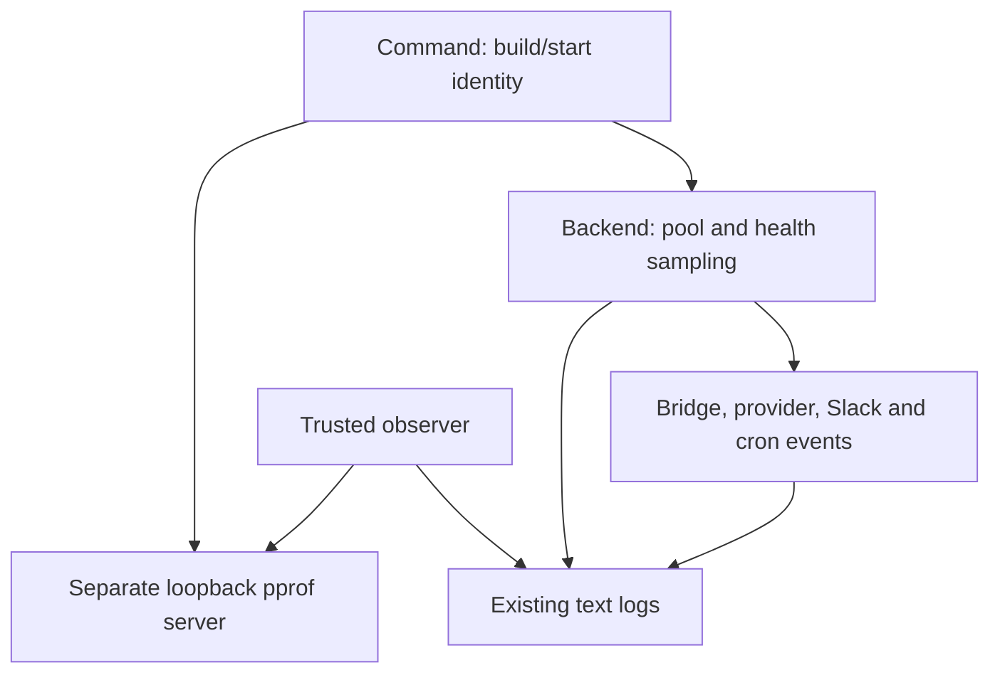

# RocketClaw observer signals - Plan

## Goal Capsule

- **Objective:** Let an observer spot deteriorating health, follow affected work, and explain a problem without guessing from warnings alone.
- **Means:** Periodic health logs, measured operation events, and private Go profiling access (KTD1–KTD3).
- **Authority:** The approved proposal supplies scope; the requirements below preserve it. Repository instructions govern implementation.
- **Execution:** Implement and verify locally when authorized. Review, shipping, deployment, and production access require separate authority.
- **Stop:** Report missing measurement boundaries, failed checks, or budget conflicts rather than inventing measurements or widening scope.

## Product Contract

### Summary

Add useful measurements to RocketClaw's existing text logs and provide a private diagnostic URL. Keep the observation-script update as a separate follow-up.

### Problem Frame

Warnings miss quiet deterioration. Existing timings do not always distinguish a provider attempt, generated output, intentional waiting, and successful delivery.

### Key Decisions

- **Logs and HTTP instead of saved diagnostics.** Governs R1, R2, R4, R6. (session-settled: user-approved — chosen over disk-backed evidence capture: RocketClaw must not write diagnostic files.)
- **Allow live profiling.** Governs R5, R9. (session-settled: user-approved — chosen over passive inspection only: short CPU profiles and traces can explain live problems despite temporary overhead.)

### Requirements

**Measurements**
- R1. Report Go heap usage, allocation rate, garbage-collection cost, goroutine count, scheduling delay, and database-pool usage/waits at INFO with sample interval and process-start identity.
- R2. Add consistent event fields for provider attempts, turns/tools, queues/steers, delivery, background completion, and build/start identity; measure durations in milliseconds at their actual boundaries.
- R3. Distinguish first response item, first assistant text, question waits, generation, acknowledgement, attachment failure, and intentional silence.

**Access and privacy**
- R4. Profiling is opt-in, loopback-only, and separate from the public Web interface.
- R5. Support memory/allocation and goroutine inspection plus on-demand short CPU profiles and execution traces.
- R6. Return diagnostics through HTTP without RocketClaw writing profiles, traces, or incident folders.
- R7. Log safe scalar measurements and existing identities, not prompts, bodies, arguments, credentials, results, or full request URLs.

**Behavior and observer**
- R8. Preserve ordering, steer framing, recovery, intentional waits/silence, routing, acknowledgements, and retries; retain existing OpenTelemetry support without another monitoring dependency or lifecycle ledger.
- R9. The companion observer must inspect routine reports, identify the running build, and explicitly permit live profiling while retaining its production-change and public-disclosure restrictions.

### Scope Boundaries

No automatic captures, flight recorder, always-on CPU/block/mutex profiling, queue repairs, new database queries, or general frontend-lifecycle refactor.

#### Deferred to Follow-Up Work

Update the observation script in the separate RocketClaw repository for R9. This platform implementation does not modify that repository or deploy anything.

## Planning Contract

### Key Technical Decisions

- KTD1. **Sample the existing pool in backend `Run`.** Start after `SessionService` opens, including time waiting for the workspace lock; explicitly cancel and join before pool close on every exit. Use the existing child-context/errgroup pattern in `internal/rocketclaw/backend/app.go`, not an exported pool accessor. Per R1, R6, R8.
  - Start with a one-minute interval and a baseline at pool-open time. Counter rates use actual monotonic elapsed time. Clone previous histogram counts because `runtime/metrics.Read` reuses storage; report approximate interval scheduling percentiles only when there are new observations. Label Go memory, GC CPU-seconds, and pool waits accurately: none means RSS, wall pause time, or SQL query duration.
- KTD2. **Measure at existing operation owners.** Extend provider middleware and underlying Codex request boundaries, bridge/checkpoint events, queue decisions, Slack delivery branches, and cron completion. No observer subscription or parallel-operation timing map. Per R2, R3, R7, R8.
  - Derive the passed logger with process-start identity; log revision/dirty-build information when available and Go version at startup. Log all provider attempts, including fast successes and retry number, without calling HTTP return time full generation time. Select safe error type/status fields rather than raw errors that can contain URLs or response bodies; preserve returned errors.
  - Codex authorization recovery and compaction in `internal/rocketclaw/oai/oauth.go` send requests below SDK middleware. Measure those physical attempts at their existing transport boundaries; distinguish SDK-envelope events so observers cannot double-count them as requests.
  - Existing tool/progress data lacks execution timestamps. Record existing operation IDs/states and explicitly named observation elapsed time, not fabricated tool duration or name-based parallel correlation. Keep RocketCode's API unchanged; stop for approval if exact tool execution timing proves necessary.
- KTD3. **Use `run --pprof` with fixed `127.0.0.1:6060`.** Own the listener directly in `cmd/rocketclaw/serve.go`, outside frontend assembly, so later startup failures cannot lose its cleanup. No saved-config field. Per R4–R6.
  - Expose all standard pprof endpoints, as directed by the user after implementation review. Use native recording/conflict/cancellation behavior, without new recording locks, retries, or caps.
- KTD4. **A diagnostic serving failure does not interrupt agent work.** Bind failure is a startup error; unexpected later Serve failure is logged immediately, with no retry or fallback. Close the server/listener and join serving on command exit, preserving backend errors and restart exit 255. (session-settled: user-approved — chosen over stopping healthy RocketClaw work: diagnostics are supplementary.)

### High-Level Technical Design

Directional sketches; existing owners remain responsible for work.



```mermaid
sequenceDiagram
  participant Run
  participant Pool
  participant Sampler
  Run->>Pool: Open existing service
  Run->>Sampler: Take baseline; start periodic work
  Sampler->>Pool: Read Stats while Run owns pool
  Run->>Sampler: Cancel and join on any exit
  Run->>Pool: Close
```

```mermaid
stateDiagram-v2
  [*] --> Disabled: no pprof flag
  [*] --> Binding: pprof flag
  Binding --> StartupError: bind fails
  Binding --> Serving: loopback bound
  Serving --> DiagnosticsEnded: serving fails; log only
  Serving --> Closed: command exits
  DiagnosticsEnded --> Closed: command exits
```



## Implementation Units

### U1. Health reports and running-build identity

- **Goal / requirements:** Make routine health and deployed-build evidence available (R1, R2, R6; KTD1, KTD2).
- **Files:** `cmd/rocketclaw/serve.go`, `internal/rocketclaw/backend/app.go`; small private sampling code/tests in `internal/rocketclaw/backend` if needed. Extend `cmd/rocketclaw/serve_test.go` and `internal/rocketclaw/backend/runtime_test.go` lifecycle coverage.
- **Approach:** Keep samples and baselines local to the single reporter; inherit process identity through the passed logger.
- **Tests / verification:** Assert one report after a minute, correct known counter/histogram deltas, no interval percentile for empty histograms, and clean cancellation. Use `testing/synctest` for cadence, separate from real DB/network tests. Cover startup failures and ensure the reporter ends before DB close. Verify absent revision is not presented as a known deployed commit.

### U2. Truthful work and delivery events

- **Goal / requirements:** Follow accepted work through its real outcome (R2, R3, R7, R8; KTD2). Depends on U1's identity fields.
- **Files:** `internal/rocketclaw/backend/model_resolver.go`, `bridge.go`, `runtime.go`, affected queue/steer owners; `internal/rocketclaw/oai/oauth.go`; `internal/rocketclaw/frontend/slack/connector.go`; `internal/rocketclaw/frontend/cron/manager.go`, and their existing tests.
- **Approach:** Extend events at actual transitions. Use queue age/due time and existing blocker decisions; do not scan queues just for logging. Slack owns text/attachment outcomes; cron uses its returned result to distinguish intentional silence. Record question-wait boundaries without logging question text.
- **Tests / verification:** Update `TestOpenAIClientLogsProviderRequestsOnError` to include fast success. Extend `TestModelResolverLogsProviderAndAPIModelWithoutCredentials` for retry-then-success, timing/status fields, and secret-bearing errors. Assert first-item versus text distinction, parallel operation IDs, queue admission versus persistence/start/removal, and text-success/attachment-failure versus silent/stopped/failed outcomes. Reuse the mutex-protected log buffer in `bridge_test.go`.
  - Extend `internal/rocketclaw/oai/oauth_test.go` authorization-recovery and compaction cases: every physical request has its own status/outcome/timing, while existing request order, retries, response conversion, and token behavior remain unchanged.
- **Behavior checks:** Preserve `TestRuntimePersistedEnqueueAndProducerArrivalOrder`, `TestRuntimeSteersWaitForTheirTurnDelivery`, `TestRuntimeHeldQueueManualRelease`, and `TestRunStartsPersistedQueueWithoutOtherWork`. Separately check steer prompt roles and parallel batch joins in `internal/rocketcode/looper_test.go`, Slack redelivery/routing in `connector_test.go` and `events_test.go`, and `TestSendResponseSilentCronDoesNotPost`.

### U3. Private profiling and usage documentation

- **Goal / requirements:** Provide private live inspection without saved diagnostics (R4–R7; KTD3, KTD4). Depends on U1's command identity.
- **Files:** `cmd/rocketclaw/serve.go`, `main.go`, private diagnostic-server code/tests in `cmd/rocketclaw` if needed; `serve_test.go`, `web_test.go`, `README.md`.
- **Approach:** Bind synchronously and defer independent cleanup around backend execution. Follow `web.go`'s serving pattern, not its frontend registration. Document the flag, field meanings, private forwarding, short serial captures, overhead, and private handling of downloaded data.
- **Tests / verification:** Check off-by-default, loopback address, occupied port, all standard endpoints, immediate stop, later backend startup failure, and restart result preservation. Verify the public Web handler returns neither profile data nor pprof index content, even if a SPA fallback returns success. Request short local CPU/trace captures, cancel a request, and confirm recording can start again. Do not run profiling tests in parallel because recording is process-wide.

## Verification Contract

- Before Go edits and again on the final diff, apply the repository's Go standards to touched hunks: private/local code, modern stdlib helpers, correct error names, no new nil behavior dependencies, wrappers, stored contexts, mutex/atomic machinery, or speculative guards. Use `go doc` and `gopls` for touched APIs.
- Run `gofmt` on changed Go files, targeted tests with `-race`, `go test ./...`, `make lint`, `make test`, and `make check-cloc-budget`. Preserve configured coverage and CLOC limits; inspect tool-made changes with `jj diff --git`.
- Compare a repeatable local workload before/after: sampler time/allocations, report bytes per minute, provider-success log volume, and CPU/trace overhead. Report costs rather than inventing alarm thresholds; seek approval if costs require cadence or scope changes.
- Check diagnostic code and local exercises create no diagnostic files. Distinguish existing state/workspace writes from diagnostics; keep all test/scratch/download artifacts under the repository's `.tmp/` and never embed production evidence in public tests or docs.

## Definition of Done

U1's reports, U2's truthful events, and U3's private HTTP access pass their checks with unchanged work behavior. README usage is updated, required verification and budgets pass, and abandoned implementation attempts are removed. Hand off the separate observer update with R9: inspect INFO health trends, use build/start identity instead of merge time, allow short serial live profiles, keep responses private in the observer repository's `.tmp/`, and do not change production. Deployment remains separate.

Sources: approved proposal above; `docs/solutions/logic-errors/saved-queue-never-started-after-restart.md`; `docs/solutions/logic-errors/slack-root-app-mention-redelivery-cleared-buffered-follow-ups.md`; [runtime metrics](https://pkg.go.dev/runtime/metrics), [DBStats](https://pkg.go.dev/database/sql#DBStats), [HTTP profiling](https://pkg.go.dev/net/http/pprof), and [testing time](https://go.dev/blog/testing-time).
