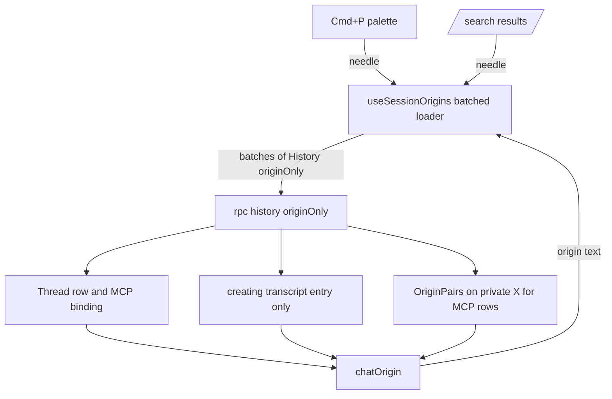
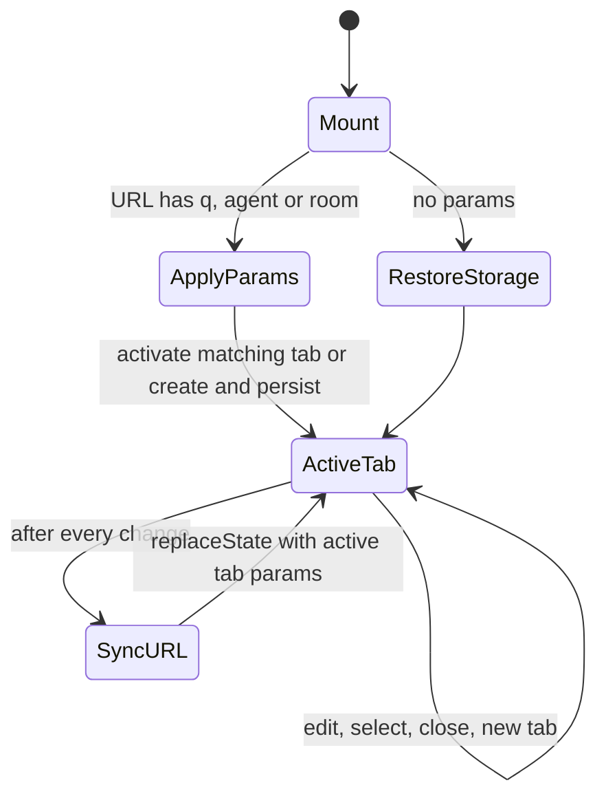

# Web Search, Links, and Tags Feedback - Plan

## Goal Capsule

- **Objective:** A RocketClaw operator can find any conversation from Web search without a false error and with faster Cmd+P origin matching, filter and order results the way they ask, share a search by URL, follow links in agent messages, and see the session tags agents set on Intercom cases.
- **Means:** Six targeted fixes across the Web client and RocketClaw backend, reusing existing search, origin, and tag mechanisms (KTD1–KTD8).
- **Authority:** Alex's feedback and screenshots (5 Oct 2026) define the product behavior. The tag-visibility reversal is user-approved (see Key Decisions). Every other gap-filling choice is an unconfirmed default listed under Assumptions. Requirements govern product behavior, technical decisions govern mechanism within them, and units override neither.
- **Execution profile:** Seven units. U1 and U6 are Go in `internal/rocketclaw`. U2–U5 and U7 are Web in `internal/rocketclaw/web`, with U2 first because it deletes code that the shared TS CLOC budget needs.
- **Stop conditions:** Stop and report if diagnosis (U1) shows the banner comes from a cause neither U1 nor U2 removes; if any web or Go CLOC budget would be exceeded without hiding code or raising the limit; or if retargeting tags requires changes outside `internal/rocketclaw/backend` beyond documentation.
- **Completion owner:** The LFG pipeline implements, reviews, and opens a PR. Merge and deployment remain with the user.

---

## Product Contract

### Summary

Fix the `/search` origin error and slow Cmd+P origin search, add `is:unsettled` and `sort:` search operators, make `/search` addressable by URL, render links and bold in transcript messages, and put agent-set session tags on the human-visible conversation.

### Problem Frame

Alex runs customer-support operations from RocketClaw Web and reported six problems with screenshots.
Every `/search` query, including a bare Intercom conversation ID, ends in "Searching…" plus the red "Some chat origins could not be searched." Cmd+P finds conversations, but slowly, and older ones surface last.
The `is:` suggestions offer only `pinned` and `forked`, so there is no way to restrict search to conversations still needing attention.
Typing `sort:` offers nothing and silently becomes free text, which also triggers the slow origin load.
The `/search` URL never changes, so a search cannot be bookmarked or shared.
Agent messages show `*bold*` and `[label](url)` literally, and links are not clickable.
The `alitu-cs-support` agent's red/yellow/green case tags never appear in the sidebar or in `tag:` search, because they are written to the private producer conversation that Web hides.

### Requirements

**Search reliability and speed**

- R1. A `/search` or Cmd+P query does not report "Some chat origins could not be searched." / "Could not search all chat origins." unless an origin lookup genuinely failed for that query.
- R2. The transcript read in each origin lookup is independent of transcript length, so older, longer conversations no longer slow Cmd+P origin matching.
- R3. Opening, typing in, or closing Cmd+P never stalls or cancels an origin load that `/search` is waiting on, and vice versa.

**Search operators**

- R4. `is:unsettled` restricts results to conversations that appear in the default sidebar (not settled, snoozed, or due for auto-settle) and is suggested after `is:`.
- R5. `sort:newest` and `sort:oldest` order results by last activity and are suggested after `sort:`.
- R6. An unfinished operator token being typed (`is:`, `is:uns`, `sort:`, `sort:ne`) is not treated as free text and triggers no origin or transcript search, matching today's rule for unfinished `agent:`/`room:`.

**Search deep links**

- R7. `/search` reflects the active tab's query, agent, and room in its URL, and opening such a URL shows that search.

**Transcript rendering**

- R8. Transcript message text renders Markdown links (`[label](url)`, `[label](<url>)`), Slack links (`<url|label>`, `<url>`), and bare `http(s)` URLs as clickable labels that open in a new tab.
- R9. Transcript message text renders `*bold*` and `**bold**` as bold.
- R10. Anything else stays literal and escaped, including code blocks, non-`http(s)` schemes, and Slack mentions such as `<@U123>` and `<!here>`.

**Session tags**

- R11. A tag that an agent sets during a private producer turn appears on the human-visible destination conversation's sidebar row and matches `tag:` search there.

### Key Decisions

- **Agent-set tags belong to the human-visible conversation, reversing session-tags assumption A5.** Governs R11. (session-settled: user-approved — chosen over keeping separate tag sets on private producer X and visible destination Y: the user judged invisible tags a bug after seeing the A5 rationale.)

### Scope Boundaries

- Slack's own rendering of Markdown links (the Slack connector sends text unchanged and Slack shows `[label](url)` raw) is out of scope; this plan fixes Web only.
- `is:settled` stays an accepted, non-filtering token as `internal/rocketclaw/web/README.md` documents.
- Scheduled cron runs and Web's late "open cron run" have no destination at tag time, so their tags stay on the private run.
- Inline code, italics, strikethrough, and HTML entity decoding outside link destinations are not rendered.
- The `SearchMessages` sequential transcript scan (marked by its ponytail comment) is unchanged.

#### Deferred to Follow-Up Work

- A message index for `SearchMessages`, which still bounds `/search` "Searching…" time on large instances.
- An index for `OriginPairs` on long-lived External MCP private histories if diagnosis shows it dominates (see Risks).
- Slack-side link conversion or a reply instruction that asks agents for Slack link syntax.

---

## Planning Contract

### Key Technical Decisions

- KTD1. **Origin derivation reads the thread row and the creating entry, not the whole transcript.** `chatOrigin`'s contract already says the creating (oldest) entry decides the origin. The origin-only path today decodes every entry because it passes no range, and `creatingCronLocator` scans every entry it is given for a cron source. Reading one entry makes the transcript part of each lookup independent of transcript length (R2) and removes the most likely per-row failure source (R1). `creatingCronLocator` checks only the creating entry (the first entry, which both History paths pass as the oldest), so the origin card and origin search agree.
- KTD2. **`/search` reuses the palette's batched origin loader, and no surface cancels a load another surface still observes.** `useSessionOrigins` already batches lookups and publishes partial results; `/search` has its own unbatched per-row `useQueries` fan-out that can fire hundreds of concurrent History calls against an unbounded Postgres pool and caches each failure with `retry:false`. Deleting that path unifies the two implementations and frees TS CLOC. Both surfaces pass `sidebar.rows`, so they build the same `["sessionOrigins", owner, protocol, ids]` key and share one fetch. The loader's disable-time `cancelQueries` on the `["sessionOrigins"]` prefix would therefore let the always-mounted palette abort `/search`'s load and leave it on "Searching…" (R3). Remove that manual cancel and rely on the abort signal React Query owns, which fires only when the shared query loses its last observer; the shared fetch keeps deduplicating work across surfaces.
- KTD3. **All search operators stay client-side in `sessionSearchTerms` / `sessionMatchesSearch`.** Filtering already runs over the sidebar snapshot; `SearchMessages` receives only the residual needle. `is:unsettled` is `!session.settled`, the exact predicate `SessionList` uses for the default sidebar. `sort:` adds an ordering field to the parsed terms. These functions must remain top-level `function` declarations because `session-list.test.ts` extracts them by name.
- KTD4. **`sort:` overrides the default ordering everywhere it is offered.** `sort:newest` and `sort:oldest` order by `updatedAt` with conversation ID as tiebreak, override pinned-first and `/search`'s message-hit grouping, place rows without `updatedAt` last, and the last `sort:` token wins. Without a `sort:` token, today's ordering is unchanged. Because `SessionSearch` is shared, every surface that offers the suggestion must honor it.
- KTD5. **Deep links use query parameters on the existing `/search` route: `q`, `agent`, `room`.** The Go SPA allow-list already serves `/search` with any query string, so no server change is needed. `agentFilter` and `roomFilter` are separate from the query text, so they travel as their own parameters. The URL is derived from the active tab after every tab change (edit, select, close, new tab) with `history.replaceState`, never `navigate`, so typing does not grow history.
- KTD6. **Opening a deep link reuses a matching tab and persists.** On mount, `SearchTabs` reads the parameters once; it activates an existing tab with equal (query, agent, room) or creates one, and treats that as an edit so the draft rule persists it. This makes Back from a session idempotent instead of adding a duplicate tab each time.
- KTD7. **Transcript inline formatting is a small private tokenizer in `transcript-text.tsx`, with no new dependency.** It renders React nodes (no `dangerouslySetInnerHTML`), runs only on prose parts after `fencedParts`, matches link forms before bold so `*` inside URLs is inert, and uses Slack's bold rule (non-space after the opening `*`, non-space before the closing `*`, no newline crossing) so globs, arithmetic, and `* ` bullets stay literal. Only `http:`/`https:` destinations become `<a target="_blank" rel="noopener noreferrer">`; `&amp;` is decoded inside link destinations because inbound Slack text keeps it. CommonMark libraries were rejected because they treat `*x*` as italic and add a dependency.
- KTD8. **Tag tools bind to the turn's sync destination when one is set, otherwise to the owning conversation.** This instantiates the Key Decision for R11. All writes then hit one `session_tags` row under the existing `toggleSessionTag` transaction, preserving within-group exclusivity and toggle-off. It is transport-agnostic (`SyncDestination` comes from the inbound message, not `external_mcp_sessions`), which honors the agnostic-backend plan. Copying tags during Sync was rejected because no merge rule preserves group exclusivity; merging at sidebar read time was rejected because it creates two sources of truth. `rocketclaw_current_session_id` keeps returning the owning private conversation.

### High-Level Technical Design

Origin search after U1 and U2. Both surfaces share one batched loader; each disables only its own query.

Deep-link state handling in `SearchTabs` (KTD5, KTD6).

### Assumptions

These are planning defaults chosen without user confirmation.

- "Fix sort-ability" means adding a `sort:` operator with `newest` and `oldest` (KTD4). Alex may instead have meant only that `/search` should stop grouping message hits ahead of recency; `sort:newest` provides that ordering on request without changing the default.
- The red banner is caused by the unbatched `/search` burst plus failures cached under `retry:false`, or by one row's full-transcript decode failing. U1 confirms this before relying on it.
- Unknown complete operator tokens (`is:foo`, `sort:bogus`) stay literal free text; only a trailing unfinished operator token is withheld (R6).
- `/search` keeps showing "Searching…" until all origins and transcript hits arrive, as today; it does not render progressively.
- On `/settled`, `is:unsettled` is accepted and yields "No matches" rather than being hidden.
- Tags already stored on private producer conversations are not copied, so existing Intercom cases show no tag until the agent sets one again. The user may still choose a one-time copy to their destinations.
- "Older ones surface last" is read as slow origin arrival; `sort:oldest` covers the list-order reading.
- One-off cron runs set `SyncDestination` to an existing conversation, so after U6 their tags land on that conversation. This follows from KTD8 and is accepted.
- `*text*` renders bold (Slack convention) because agents are instructed to reply in Slack-suitable text.
- An owner switch on `/search` may import the previous owner's URL parameters into the new owner's tabs once; this is accepted rather than adding special handling.

### Risks & Dependencies

- `OriginPairs` on long private External MCP histories filters by entry type with no partial index. If diagnosis or an `EXPLAIN` on a long X shows it dominates Intercom rows after U1, record it as follow-up rather than widening this plan.
- The TS CLOC budget (`internal/rocketclaw/web/Makefile`) is at 5115 of 5500, with the hazard zone from 5250. U2–U5 and U7 together must stay under the limit; U2's deletion lands first.
- The built Web bundle under `internal/rocketclaw/internal/web/dist` is tracked and must be rebuilt with the source changes.

---

## Implementation Units

### U1. Origin-only History reads only the creating entry

- **Goal:** Make each origin lookup cheap and length-independent, after confirming the banner's cause.
- **Requirements:** R1, R2; KTD1.
- **Dependencies:** None.
- **Files:** `internal/rocketclaw/frontend/rpc/server.go`, `internal/rocketclaw/frontend/rpc/server_test.go`, `internal/rocketclaw/frontend/rpc/origin_test.go`.
- **Approach:**
  1. Diagnose first: reproduce a failing origin lookup against a local deployment with many sidebar rows (or the running daemon's logs) and record the History status and message. Also time the origin load and `SearchMessages` separately for a realistic `/search` query. Record both in the PR description; if `SearchMessages` dominates, state that the deferred message index is what `/search` speed needs. If the banner's cause is something neither this unit nor U2 removes, stop per the Goal Capsule.
  2. In `history`'s origin-only branch, learn the oldest entry ID from the transcript page and read only that entry before calling `chatOrigin`, instead of observing the whole transcript.
  3. Change `creatingCronLocator` to check only the creating entry instead of scanning every entry (KTD1).
- **Execution note:** Capture the real failure before changing code; the acceptance signal is the banner absent on realistic data, not only a passing unit test.
- **Patterns to follow:** The existing `from > oldest` creating-entry read in `chatOrigin`; `TranscriptPage` and `ObserveTranscript` ranges in `internal/rocketclaw/backend/transcript.go`.
- **Test scenarios:**
  - Origin-only History on a cron-created conversation returns the cron origin.
  - Origin-only History on an External MCP destination returns the external ID and starting pairs.
  - Origin-only History on an empty web conversation returns an empty origin and no error (existing `empty-web` subtest keeps passing).
  - A web conversation with a later one-off cron entry reports no cron origin through both the regular History path and the origin-only path.
  - A cron-created Slack thread whose first entry is the synced cron entry still reports the cron origin.
  - An origin-only lookup on a conversation whose later entry fails to decode still succeeds.
- **Verification:** Origin-only History no longer decodes later transcript entries, the existing origin tests pass, and the diagnosed failure no longer reproduces.

### U2. `/search` shares the batched origin loader

- **Goal:** Remove `/search`'s unbatched origin fan-out and stop cross-surface cancellation.
- **Requirements:** R1, R3; KTD2.
- **Dependencies:** None (land before U3–U5 and U7 for CLOC).
- **Files:** `internal/rocketclaw/web/src/ui.tsx`, `internal/rocketclaw/web/src/search-page.browser.test.ts`, `internal/rocketclaw/web/src/session-list.browser.test.ts`.
- **Approach:**
  1. Replace the per-row `useQueries` origin block in `SearchResults` with `useSessionOrigins`, switching positional `origins[index]` use in `SearchResults`/`SearchMatches` to the loader's map, as `CommandPalette` does.
  2. Remove the loader's disable-time prefix cancellation (KTD2).
  3. Keep the existing status rules: "Searching…" while origins or transcript hits are pending, the error line only when a lookup in the current load failed.
- **Patterns to follow:** `CommandPalette`'s use of `useSessionOrigins` and `originSearchText`.
- **Test scenarios:**
  - On `/search`, a needle with many rows loads origins in batches (no more than one batch in flight) and shows matches when complete.
  - On `/search`, hold History responses, open and close Cmd+P, release them: results render and "Searching…" clears (R3).
  - In Cmd+P, hold History responses, navigate the `/search` query to a status-only token, release them: the palette load completes.
  - A History failure for one row shows the `/search` error line while other matches stay listed; a new needle that triggers a fresh load without failures clears the error.
- **Verification:** The old `/search` origin query block is gone, browser tests for both surfaces pass, and TS CLOC drops.

### U3. Search operators: `is:unsettled`, `sort:`, and unfinished tokens

- **Goal:** Add the two operators and stop unfinished operator tokens from becoming free text.
- **Requirements:** R4, R5, R6; KTD3, KTD4.
- **Dependencies:** U2.
- **Files:** `internal/rocketclaw/web/src/ui.tsx`, `internal/rocketclaw/web/src/session-list.test.ts`, `internal/rocketclaw/web/src/session-list.browser.test.ts`, `internal/rocketclaw/web/src/search-page.browser.test.ts`, `internal/rocketclaw/web/README.md`.
- **Approach:**
  1. In `sessionSearchTerms`, recognize `is:unsettled` and `sort:newest|oldest` as tokens, return the unsettled flag and the chosen order, and withhold a trailing unfinished `is:`/`sort:` token from the needle.
  2. In `sessionMatchesSearch`, apply the unsettled predicate; add the flag to `SessionList`'s "searching" check so `/settled` shows "No matches".
  3. Apply the order in the palette, `/search`, and any other surface that renders `SessionSearch` results (KTD4).
  4. Offer `unsettled` after `is:` and `newest`/`oldest` after `sort:` in `searchInput`.
  5. Update the README search section with both operators and the unfinished-token rule.
- **Patterns to follow:** The existing `is:pinned` / `is:forked` flags and the `agent:`/`room:` unfinished-suggestion rule.
- **Test scenarios:**
  - `is:unsettled` matches an unsettled row and excludes settled, snoozed, and auto-settle-due rows.
  - `is:unsettled tag:x outage` combines with tag and residual text, sending only `outage` as the needle.
  - `sort:oldest` orders rows by ascending `updatedAt`, ahead of pinned-first; `sort:newest` orders descending; rows without `updatedAt` come last; equal times order by ID.
  - `sort:oldest sort:newest` uses `newest`.
  - On `/search`, `sort:oldest` overrides message-hit grouping.
  - Trailing `is:`, `is:uns`, `sort:`, and `sort:ne` produce an empty needle; `is:foo` and `sort:bogus` stay in the needle.
  - Typing `is:` suggests `pinned`, `forked`, `unsettled`; typing `sort:` suggests `newest`, `oldest`.
  - Status tokens `is:`, `is:unsettled`, and `sort:newest` alone load no histories (extend the existing browser assertion).
- **Verification:** Table tests and browser tests pass, and the README describes the new operators.

### U4. Search deep links

- **Goal:** Make `/search` addressable by URL and keep the URL in sync with the active tab.
- **Requirements:** R7; KTD5, KTD6.
- **Dependencies:** U3 (shares `ui.tsx` search code).
- **Files:** `internal/rocketclaw/web/src/ui.tsx`, `internal/rocketclaw/web/src/search-page.browser.test.ts`, `internal/rocketclaw/web/README.md`.
- **Approach:**
  1. On `SearchTabs` mount, read `q`, `agent`, and `room` once; activate a tab with equal values or create one, and persist it.
  2. After every active-tab change (edit, select, close, new tab), replace the URL with the active tab's parameters, omitting empty ones.
  3. Document the parameters in the README, including that `agent:`/`room:` typed inside `q` are not filters.
- **Patterns to follow:** `useSearch` for reading `location.search`; the session page's `?message=` handling.
- **Test scenarios:**
  - Opening `/search?q=outage&agent=alitu-cs-support` with empty storage shows one tab with that query and agent filter, and it survives reload.
  - Opening the same URL with existing tabs that include a matching tab activates it without adding a tab.
  - Navigating from a result to a session and back does not add a duplicate tab.
  - Typing, switching tabs, closing the active tab, and adding a tab each update the URL to the active tab's parameters without adding history entries.
  - Existing tab, reload, and owner-switch tests pass with URL assertions updated for query strings.
- **Verification:** Browser tests pass and a copied `/search` URL reopens the same search.

### U5. Transcript links and bold

- **Goal:** Render links and bold in transcript prose.
- **Requirements:** R8, R9, R10; KTD7.
- **Dependencies:** U2 (CLOC ordering only).
- **Files:** `internal/rocketclaw/web/src/transcript-text.tsx`, `internal/rocketclaw/web/src/transcript-text.test.tsx`, `internal/rocketclaw/web/README.md`.
- **Approach:**
  1. Replace the prose branch of `TranscriptText` with nodes from a private inline tokenizer; leave `fencedParts` and `CodeBlock` unchanged.
  2. Handle link forms before bold, allow only `http(s)` destinations, and decode `&amp;` in destinations.
  3. Add a README line that transcript links open in a new tab.
- **Patterns to follow:** `fencedParts`' single-regex `matchAll` style.
- **Test scenarios:**
  - Alex's sentence `*Found the feature request:* [#835: Provide finer control over audio cleanup options](https://github.com/the-podcast-host/alitu-mono/issues/835). I read …` renders a `<strong>` and an anchor with that label, `target="_blank"`, and `rel="noopener noreferrer"`.
  - `[label](<https://example.com/a>)`, `<https://example.com|Example>`, `<https://example.com>`, and a bare `https://example.com/x` each render one anchor with the right label.
  - Trailing punctuation after a bare URL (`see https://x.com/a.` and `(https://x.com/a)`) stays outside the link.
  - `<https://x.com/?a=1&amp;b=2|x>` links to `?a=1&b=2`.
  - `[x](javascript:alert(1))`, `<@U123>`, `<#C1|general>`, and `<!here>` stay literal text.
  - `**bold**` renders bold; `**/*.ts`, `*.go`, `2 * 3 * 4`, and a `* item` line stay literal.
  - A partial `[label](https://gith` renders literally.
  - Existing tests for escaping, code blocks, and plain prose keep passing.
- **Verification:** Unit tests pass and the screenshot sentence renders as Alex requested.

### U6. Tags from producer turns land on the destination

- **Goal:** Make agent-set tags visible on the human-visible conversation.
- **Requirements:** R11; KTD8.
- **Dependencies:** None.
- **Files:** `internal/rocketclaw/backend/bridge.go`, `internal/rocketclaw/backend/dynamic_workflow_tool.go`, `internal/rocketclaw/backend/session_tools.go`, `internal/rocketclaw/backend/runtime_test.go`, `internal/rocketclaw/backend/session_tools_test.go`, `README.md`.
- **Approach:**
  1. Bind the tag tools to the inbound message's `SyncDestination` when set, otherwise the bridge's conversation, for direct turns and `runWorkflow`.
  2. For `runNestedWorkflow`, which has no inbound message, read the active reply's destination under the bridge lock, as `ScheduleMessage` does.
  3. Update the root README's session-tags section: tag tools act on the visible destination during producer turns, while `rocketclaw_current_session_id` still returns the private history ID.
- **Patterns to follow:** `ScheduleMessage` / `ResetScheduledMessages` reading `activeReply.SyncDestination`; `toggleSessionTag` as the only mutation path.
- **Test scenarios:**
  - A producer turn on X with destination Y whose model calls `rocketclaw_set_tag` leaves the tag on Y and none on X; after Sync, Y's sidebar row shows it (update `TestRuntimeProducerKeepsDestinationUntilSync`, which asserts separate sets today).
  - In a producer turn, setting `red` then `yellow` leaves only `yellow` on Y; setting `yellow` again removes it.
  - `rocketclaw_get_tags` in a producer turn returns Y's tags.
  - A non-producer turn still tags its own conversation (existing `TestSessionTagToolsBridge` keeps passing).
  - A nested workflow inside a producer turn tags Y.
  - Private X tags still never appear in `ListSessions` (existing RPC test keeps passing).
- **Verification:** Backend tests pass, and an External MCP case's tag appears on its visible conversation in the sidebar and `tag:` search.

### U7. Rebuild the Web bundle and verify budgets

- **Goal:** Ship the rebuilt tracked bundle and confirm quality gates.
- **Requirements:** R1–R10 (delivery).
- **Dependencies:** U2, U3, U4, U5.
- **Files:** `internal/rocketclaw/internal/web/dist/` (generated).
- **Approach:** Rebuild the tracked bundle from the final source and run the Verification Contract.
- **Test expectation:** none -- generated assets; behavior is covered by U2–U5.
- **Verification:** The bundle matches the source and every budget passes.

---

## Verification Contract

| Gate | Command (working directory) | Applies to |
|---|---|---|
| Web deps | `bun install --frozen-lockfile` (`internal/rocketclaw/web`) | U2–U5, U7 |
| Web unit tests and TS CLOC | `make test` (`internal/rocketclaw/web`) | U2–U5 |
| Web lint and types | `make lint` (`internal/rocketclaw/web`) | U2–U5 |
| Web browser tests | `bun test src/search-page.browser.test.ts src/session-list.browser.test.ts` with `ROCKETCLAW_PLAYWRIGHT_MODULE` and `ROCKETCLAW_CHROMIUM` set; a skip is not a pass | U2–U4 |
| Web bundle | `make -C internal/rocketclaw web-assets` (repo root) | U7 |
| Go format | `gofmt` on touched Go files | U1, U6 |
| Go tests | `go test ./...` (repo root, with `ROCKETCLAW_TEST_DATABASE_URL` or the Makefile's Docker Postgres) | U1, U6 |
| Repo lint | `make lint` (repo root) | all |
| Repo tests, coverage, and CLOC | `make test` and `make check-cloc-budget` (repo root) | all |

---

## Definition of Done

- R1–R11 hold, each proven by the unit tests named above.
- U1's diagnosis is recorded in the PR description, and the banner does not appear for a normal query on realistic data.
- `internal/rocketclaw/web/README.md` and the root `README.md` describe the changed behavior.
- The tracked Web bundle is rebuilt from the final source.
- No CLOC budget is raised, no linter is suppressed, and no code from abandoned attempts remains in the diff.

---

## Appendix

### Sources

- Alex's DM with screenshots, 5 Oct 2026 15:05–15:24 (search banner, `is:` suggestions, `sort:`, bare `/search` URL, raw links, tag analysis).
- `docs/plans/2026-10-02-1252-feat-session-tags-plan.md`: A5, R8, and A3, which this plan revises for producer turns.
- `docs/plans/2026-09-29-1053-feat-web-search-page-plan.md`: search tabs and reuse of origin queries.
- `docs/plans/2026-09-22-0910-feat-web-chat-origin-header-plan.md`: origin derivation.
- `docs/plans/2026-09-03-1321-refactor-rocketclaw-agnostic-backend-plan.md`: backend operations do not name transports.
