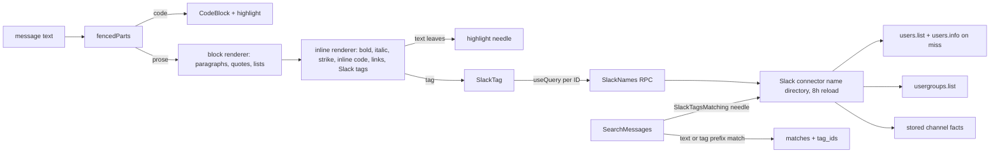

# Web Message Formatting and Slack Names - Plan

## Goal Capsule

- **Objective:** RocketClaw Web shows agent replies the way a Slack reader would see them. Code blocks, bold, italics, strikethrough, inline code, quotes, and lists are formatted, and Slack tags such as `<!subteam^S0BA868QQ90>` show real names such as `@cs-operators`. This applies on every surface that shows message text or a message-derived title. Searching for a name finds messages that tag it.
- **Means:** One shared formatter in `transcript-text.tsx` covers block and inline text, with optional search highlighting. A new Web RPC lets the Slack connector resolve Slack IDs to names, and message search also matches the IDs whose names contain the query.
- **Authority:** The operator's feedback (6 Oct 2026, screenshot of `/search?q=sort:newest tag:operator-needed&room=alitu-cs-claw`) and the user's answers recorded under Key Decisions.
- **Execution profile:** Six units. U1 and U2 are Go plus proto. U3–U5 are Web in `internal/rocketclaw/web`. U6 covers docs and the bundle.
- **Stop conditions:** Stop and report if the TS source CLOC would reach the failure limit (7500, hazard zone from 7250) or the RocketClaw Go source CLOC would reach 23500 (hazard zone from 23000). The user raised these budgets in this workspace on 6 Oct 2026. Report the measured numbers in the work summary. Also stop if name resolution needs Slack data beyond `users:read`, `usergroups:read`, and the stored channel facts.
- **Completion owner:** `ce-work` implements and verifies locally. Merge and deployment stay with the user.

---

## Product Contract

### Summary

Render Slack-style message text as formatted text across RocketClaw Web, turn Slack user, user-group, channel, and broadcast tags into readable names that the server resolves through the Slack connector, and let message search match those names.

### Problem Frame

Agents such as `alitu-cs-principal` write replies for Slack. They use `*bold*`, fenced code, inline code, `- ` bullets, and user-group mentions (`<!subteam^S0BA868QQ90>`).
`/search` shows that text raw. `MatchedExcerpt` (`internal/rocketclaw/web/src/ui.tsx`) prints the whole message as monospace `whitespace-pre-wrap` text, so fences, asterisks, and backticks appear literally.
The result heading and the sidebar, palette, and matrix row titles show the raw first line, for example `<!subteam^S0BA868QQ90> *Allen now says…*`.
The chat page (`TranscriptText`) already renders fenced code, bold, and links. It leaves inline code, lists, and Slack tags literal, as the earlier plan's R10 deliberately chose.

Evidence gathered on Wallace (v0.1.15, identical to `main` at planning time):
- Entry 94120 (`slack-thread:C0B8CQT7P2N:1791038443.994659`) stores the assistant `final_answer` text shown in the screenshot verbatim, including the fence and the subteam tag.
- After the user added the scope, the bot token holds `users:read` and `usergroups:read`. `usergroups.list` returns `S0BA868QQ90` = `@cs-operators` ("CS Operators") and `S0BGM0CHCRY` = `@on-call`.

### Requirements

**Formatting**

- R1. Message prose renders:
  - fenced code blocks (existing `CodeBlock`);
  - `*bold*` and `**bold**` (existing rule);
  - links (existing rule);
  - inline code `` `x` ``;
  - Slack `_italic_` and `~strikethrough~`, with the same boundary rules as bold, so `snake_case_names` and `~/path` stay literal;
  - quoted lines: a run of lines starting with `> ` (or `&gt; `) renders as one blockquote whose content is formatted inline;
  - bullet lists: a run of lines starting with `- `, `* `, or `• `;
  - numbered lists: a run of lines starting with `1. ` and so on.
- R2. Slack tags render as styled, non-link labels:
  - `<@U…>`/`<@W…>` becomes `@display name` (the Slack display name, falling back to the full name, then the ID).
  - `<!subteam^S…>` becomes `@handle`, for example `@cs-operators`, and `<!subteam^S…|label>` becomes `label`.
  - `<#C…|name>` becomes `#name`, and `<#C…>` becomes `#stored channel name`.
  - `<!here>`, `<!channel>`, and `<!everyone>` become `@here`, `@channel`, and `@everyone`.
- R3. A tag whose name cannot be resolved shows `@ID` or `#ID`, never raw angle brackets, and never blocks or breaks rendering.
- R4. Anything not covered by R1–R2 stays literal and escaped. No HTML is injected, and only `http(s)` links become anchors.

**Surfaces ("everywhere")**

- R5. The chat transcript and cron run previews (everything that uses `TranscriptText`/`TranscriptLine`) use the full formatter. Handoff search hits, the handoff target excerpt, and queued items use the inline renderer (U5).
- R6. `/search` result rows use the formatter. Searched words stay highlighted, including inside bold, inline code, list items, quotes, code blocks, and resolved tag names. With a search word, a long message shows only the lines around the match. Without one, it shows the whole message, as today.
- R7. Single-line titles render the first line with inline formatting only: bold, italics, strikethrough, inline code, links shown as plain labels, and Slack tags. This covers `/search` result headings, sidebar rows, the Cmd+P palette, the matrix dialog, and the turn-rail previews. They stay single-line and truncated.
- R7a. Hover tooltips (`title`) and accessible names (`aria-label`) for those titles and rows use the cleaned text: markup removed and tags replaced by resolved names. For example, `@cs-operators Allen now says…` instead of `<!subteam^…> *Allen now says…*`.
- R7b. Copy still copies the original raw message text, so pasting into Slack keeps working tags and formatting.

**Names**

- R8. Slack IDs resolve to current names through the server, using the Slack bot token Wallace already has. Names are cached in the process and refreshed every 8 hours, so renames in Slack show up within 8 hours without a restart.
- R8a. `/search` message search also matches messages that tag a user or user group whose resolved name contains the search text. For example, `cs-operators` finds messages containing `<!subteam^S0BA868QQ90>`, and the matching tag is highlighted. Channel tags almost always carry their name (`<#C…|name>`), which raw search already matches.

**Docs**

- R9. The documentation names the Slack bot scopes this needs (`users:read`, `usergroups:read`), says to reinstall the app after adding them, and states the unresolved fallback. The Web README describes the new formatting.

### Key Decisions

- **Show real Slack names, resolved by the server.** Governs R2, R3, R8. (Session-settled, user-approved: chosen over a generic `@team` label. The user added `usergroups:read` to the Wallace app during planning, and the scope was verified live.)
- **Format every surface, not only `/search`.** Governs R5–R7. (User-approved: "Everywhere".)
- **Supported syntax is the current set plus lists, inline code, Slack tags, italics, strikethrough, and quotes.** Governs R1, R2. (User-approved. Italics, strikethrough, and quotes were added after the user was told about the TS CLOC budget.)
- **Format and highlight at the same time. With a search word, show only the lines near the match.** Governs R6. (User-approved: chosen over showing the whole message or adding a "show more" control.)
- **Team tags show the `@handle`. Person tags show the Slack display name.** Governs R2. (User-approved.)
- **Names refresh every 8 hours.** Governs R8. (User-chosen: chosen over "until restart" and "about an hour".)
- **Tooltips and screen-reader names use the cleaned text. Copy keeps the raw text.** Governs R7a, R7b. (User-approved.)
- **Search by name works now, not later.** Governs R8a. (User-chosen: chosen over deferring it.)
- **Reverses the earlier plan's R10** (`docs/plans/2026-10-05-1839-fix-web-search-links-tags-feedback-plan.md`), which kept Slack mentions literal and left inline code unrendered.

### Scope Boundaries

- Headings and tables stay literal. Nested lists and nested quotes render flat, without nesting (see Assumptions).
- The client-side sidebar and palette filter (`sessionMatchesSearch`) keeps matching raw row text. Name matching applies to `/search` message search (R8a), which already surfaces those sessions through message hits.
- No change to what agents write or to Slack-side rendering.

#### Deferred to Follow-Up Work

- Name matching in the Cmd+P palette and sidebar filter, if operators ask for it.

---

## Planning Contract

### Key Technical Decisions

- KTD1. **One formatter module, two entry points.** `transcript-text.tsx` keeps `fencedParts` and `CodeBlock`. It gains:
  - a block renderer for prose: paragraphs, quotes, bullet and numbered lists, with inline nodes inside;
  - an inline renderer that extends the existing `inlinePattern`/`inlineNodes` with inline code, `_italic_`, `~strike~`, and Slack tags.

  `_` and `~` reuse the bold rule's boundaries: no word character or the same marker immediately outside, non-space just inside, no newline crossing. Inline code is matched before emphasis so markers inside backticks stay literal.

  `TranscriptText` uses both. Titles use only the inline renderer on the first line. Links render as anchors, and fenced code as the interactive `CodeBlock`, only in the transcript and cron previews. Anything rendered inside a row link uses a non-interactive mode: titles, `/search` row bodies (each `SearchMatches` row is a `<Link>`), and handoff hits. In that mode links render as plain labels and fenced code renders as a static, highlighted `<pre>` without Copy, Wrap, or Expand. Nested anchors are invalid, and those buttons would also trigger the row navigation. No new dependency: CommonMark libraries treat `*x*` as italic, as the earlier KTD7 noted.
- KTD2. **Highlighting is applied to text leaves.** The renderers take an optional `needle`. Every plain-text leaf they emit, including `CodeBlock` text and resolved tag labels, goes through one `highlight(text, needle)` helper that wraps case-insensitive matches in the existing `<mark>` styling. Because tag labels are leaves, a name match (R8a) is highlighted with no extra code. `MatchedExcerpt`'s mark logic moves into that helper rather than being duplicated. A match that crosses a formatting boundary (for example, half inside `*bold*`) is not highlighted. This is accepted.
- KTD3. **Search rows show nearby lines when there is a needle.** A row with no needle shows the whole formatted message, as today. A row with a needle shows the formatted message trimmed to the lines around the first match, with no cut through a code fence. The match is either the needle in the raw text or a tag whose ID the server reported as a name match (KTD7). The ±48-character mid-line clipping goes away because it cannot preserve markup. Implementation picks the smallest window rule that keeps rows short, and records it in the Web README.
- KTD4. **Names come from one new RPC, one ID per query.** Add `rpc SlackNames(SlackNamesRequest{repeated string ids}) returns (SlackNamesResponse{map<string,string> names})` to `web/proto/web.proto`. Regenerate `web.pb.go` and `protocol.gen.go` by running `go generate` in `internal/rocketclaw/frontend/rpc`; no make target does this, and `web/src/api.test.ts` fails until the proto SHA matches. Register the method in all three hand-maintained places:
  - the method list in `Register` (`frontend/rpc/transport.go`);
  - the `webCall` switch, whose `default` silently returns a Protocol response;
  - the `NewHTTPHandler` allow-list in `frontend/rpc/http.go`, plus its `httpInput` required-field switch (`ids`).

  There is no TS codegen: add hand-written types to `web/src/types.ts` and the query factory to `queries` in `web/src/api.ts`. Protojson emits `tag_ids` as `tagIds`. A small `SlackTag` component calls `useQuery` keyed on its ID, so React Query dedupes and caches across every surface. Unresolved or failed IDs fall back to R3 text, and so does a response with no `names` field (browser-test catch-alls answer `{}`). Do not retry noisily: use `retry: false`. Use a `staleTime` of 8 hours when the response resolved the ID, matching R8, and 60 seconds when it did not, so a tab recovers from a failed first load without a reload. `TranscriptText` is hook-free today, and `transcript-text.test.tsx` renders without a `QueryClientProvider`. Those tests must wrap a provider once `SlackTag` queries. If one request per distinct ID proves noisy in browser tests, batch IDs with the same per-render collection that `useSessionOrigins` uses.
- KTD5. **The Slack connector owns lookups. The RPC server only forwards them.** Add `SlackNames(ctx, ids []string) map[string]string` to the interface `rpc.New` already receives as `channels`. The `*slack.Connector` passed from `cmd/rocketclaw/assemble.go` implements it. Regenerate the mockery v3 mocks (`mockChannels`, `mockWebChannels`). Rename the interface only if review asks; renaming touches every mock.
  - The connector keeps one name directory (ID → name) for users and user groups. It has its own mutex, separate from the connector's `c.mu`, so Slack event handling never waits on Slack name I/O. That mutex is held across a load and a miss lookup, so concurrent cold requests share one load. It loads on first use and reloads lazily on the first request after it is 8 hours old (R8). No background goroutine: unlike `refreshChannelFacts`, nothing needs names until a request asks. The request context bounds the load. `GetUsersContext` pages internally and waits out rate limits until the context ends.
  - Users load from `users.list` (slack-go `GetUsersContext`, paginated; scope `users:read`), using the same display-name-then-real-name rule as `slackPrincipal`.
  - User groups load from one `usergroups.list` call (slack-go `GetUserGroupsContext`; scope `usergroups:read`), keyed to their handle.
  - A `U…`/`W…` ID missing from the directory (someone who joined since the last load) gets one `GetUserInfoContext` call. The result, including a failed lookup recorded as unresolved, stays in the directory until the next reload. Each unknown ID therefore costs at most one `users.info` call per 8-hour cycle and cannot starve `slackPrincipal`, which shares that rate limit.
  - A load is fresh for 8 hours once `users.list` succeeds, even if `usergroups.list` fails (for example `missing_scope`). In that case the previous group entries are kept. Only a `users.list` failure leaves the directory stale and retried on the next request, keeping the previous entries rather than caching an empty directory. The 8-hour refresh is the user's requirement, not a speculative TTL.
  - Group handles come from `GetUserGroupsContext` with disabled groups included (`GetUserGroupsOptionIncludeDisabled(true)`), just as deleted users stay in the directory, so old mentions still resolve.
  - Tests drive the clock with `testing/synctest`, so Slack calls must not use real sockets. Inject an in-memory `http.Client` through `slack.OptionHTTPClient` on the test connector's `api`, or mock at the connector's existing seams. The precedent is `TestChannelFactsRefreshTimingAndCoalescing`, which uses synctest with no HTTP.
  - Channels use stored channel facts (`c.facts.ChannelFact`). They never contact Slack.
  - The method returns names, not errors, because a missing name is a display fallback (R3), not a failure.
- KTD6. **Tag text is parsed in the browser, not rewritten on the server.** Stored history and copy stay raw (R7b). Only display changes.
- KTD7. **Name-aware search reverses the directory lookup on the server.** Add `SlackTagsMatching(ctx, needle string) []string` to the same connector interface. It returns the raw tag prefixes (`<@U…`, `<!subteam^S…`) of every directory entry whose name contains the lowercase needle. `searchMessages` fetches them once inside the shared singleflight function, before the transcript scan, so all waiters share one principal-independent result. A message matches if its lowercase text contains the needle or any returned prefix. `SearchMessagesResponse` gains `repeated string tag_ids`, the matched IDs, so the client can window and highlight around those tags (KTD3). The existing singleflight key (the needle) stays correct, because the directory only changes on an 8-hour reload.
- KTD8. **Cleaned text for tooltips and accessible names comes from the same tokenizer.** Export a plain-text walk of the inline tokens that drops markers and substitutes resolved names. A small hook (`useCleanText(text)`) resolves the text's tag IDs through the same per-ID name queries (`useQueries`), then returns the cleaned string. Title, row, and turn-rail `title`/`aria-label` attributes use it. Copy does not (R7b).

### High-Level Technical Design

### Assumptions

- Bullets and quotes are only recognised at line start with optional leading spaces. Nested indentation renders as a flat list or a single quote.
- `* item` at line start is a bullet, not bold. The existing bold rule already refuses `* ` openings.
- A failed directory load before any successful load means tags show `@ID` and name search matches only raw text until the next request succeeds.
- Slack Enterprise Grid and multi-workspace setups are out of scope. One bot token and one team, as today.

### Risks & Dependencies

- TS CLOC: 5124 of 7500 at planning time, with the hazard zone from 7250. The user raised the budget from 5500 in this workspace (uncommitted `internal/rocketclaw/web/Makefile` edit, user-owned; ship it with this change). The formatter still lands first, and U4 deletes `MatchedExcerpt`'s logic rather than leaving it beside the new code.
- Go CLOC: 19528 of 23500 (user-raised from 22350; hazard zone from 23000). No pressure. The user also edited `internal/rocketclaw/Makefile` and `internal/rocketcode/Makefile` budgets. These are user-owned edits; keep them as they are.
- `users.list` is a Tier 2 Slack method and is paginated. One load per 8 hours is well within limits, but very large workspaces make the first load slow. The first `SlackNames` or name search after start or reload waits for it.
- Generated artifacts: `web.pb.go`, `protocol.gen.go` (proto SHA), and the tracked bundle under `internal/rocketclaw/internal/web/dist` must all be regenerated. The TS types in `web/src/types.ts` are hand-written.
- The Wallace token already has both scopes (verified 6 Oct 2026). Other deployments without `usergroups:read` get the R3 fallback for groups, and name search covers users only.

---

## Implementation Units

### U1. `SlackNames` RPC and connector name directory

- **Goal:** Resolve Slack IDs to display names server-side, refreshed every 8 hours.
- **Requirements:** R2, R3, R8; KTD4, KTD5.
- **Dependencies:** None.
- **Files:** `internal/rocketclaw/web/proto/web.proto`, `internal/rocketclaw/frontend/rpc/{server.go,transport.go,http.go,web.pb.go,protocol.gen.go,server_test.go,channelagentchoices_mocks_test.go}`, `internal/rocketclaw/frontend/slack/connector.go` and `connector_test.go`, `cmd/rocketclaw/channelagentchoices_mocks_test.go` (regenerated via `go generate ./cmd/rocketclaw`, mockery v3 from `.mockery.yml`), `internal/rocketclaw/web/src/{types.ts,api.ts}`.
- **Approach:**
  1. Add the RPC and messages, then regenerate the Go artifacts.
  2. Implement the connector's name directory and `Connector.SlackNames` per KTD5.
  3. `Server.SlackNames` first calls `s.principal(ctx)` and returns its error, as `searchMessages` does. Then it forwards to the connector through a new method on the `channels` interface. Register it in `transport.go` (list and `webCall`) and `http.go` (allow-list and `httpInput`). Regenerate the mocks.
  4. Add the TS types and `queries.slackName(id)` beside the existing query factories.
- **Patterns to follow:** `SidebarChannelAgentChoices` (stored facts, no Slack call); `slackPrincipal` (user name rule); the `/users.info` response bodies in `connector_test.go`, served through an in-memory `http.Client` (`slack.OptionHTTPClient`) rather than `httptest` sockets, so `synctest` can drive the clock.
- **Test scenarios:**
  - A user ID returns its display name. With an empty display name it returns the real name.
  - A subteam ID returns its handle. Repeated lookups within 8 hours make no further `users.list` or `usergroups.list` calls. After 8 hours, the next lookup reloads both. Use `testing/synctest` for the clock rather than a clock injection.
  - A user ID missing from the directory triggers exactly one `users.info` call, and the result is cached. Repeating an unresolvable user ID makes no further `users.info` call before the next reload.
  - Concurrent cold `SlackNames` calls cause exactly one `users.list` and one `usergroups.list` call.
  - A failed reload keeps the previous names and retries on the next request. A `missing_scope` from `usergroups.list` leaves group IDs unresolved while users still resolve, and repeated lookups within 8 hours make no further `users.list` or `usergroups.list` calls.
  - A channel ID returns the stored fact name without any Slack call.
  - An RPC test sends mixed IDs over HTTP (`POST /api/SlackNames`) and gets exactly the resolvable names. A body missing `ids` is rejected like other required-field errors. A request with no resolvable principal returns Unauthenticated and makes no connector call.
- **Verification:** Go tests pass and prove the 8-hour reload and the keep-on-failure behavior. `api.test.ts` passes, which proves the proto SHA was regenerated.

### U2. Name-aware message search

- **Goal:** Make `/search` find messages by the names of the tags they contain.
- **Requirements:** R8a; KTD7.
- **Dependencies:** U1.
- **Files:** `internal/rocketclaw/web/proto/web.proto` (`SearchMessagesResponse.tag_ids`), `internal/rocketclaw/frontend/rpc/{session_commands.go,web.pb.go,protocol.gen.go,server_test.go}`, `internal/rocketclaw/frontend/slack/connector.go` and its tests, regenerated mocks.
- **Approach:**
  1. Implement `Connector.SlackTagsMatching` over the U1 directory.
  2. In `searchMessages`, inside the singleflight leader, fetch the prefixes once, OR them into the per-message match, and return the matched IDs in `tag_ids`.
- **Patterns to follow:** The existing `searchMessages` flight and scan; the case-insensitive `strings.Contains` match.
- **Test scenarios:**
  - Needle `cs-operators` returns a message containing `<!subteam^S0BA868QQ90>` and no unrelated messages, and `tag_ids` contains `S0BA868QQ90`.
  - Needle `alan` matches `<@U05MD4PEVHN>` when that user's display name contains "alan".
  - A needle matching both raw text and a tag returns each message once.
  - With an empty directory (failed load), search behaves exactly as today.
  - Existing search tests (shared flight, cancellation) keep passing. Matryer mocks panic on nil funcs, so these tests must supply `SlackTagsMatchingFunc`: `TestSearchMessagesSharedFlightCancellation` builds `&Server{}` with nil `channels`, and the `&mockChannels{}` uses in `sidebar_test.go`, `live_test.go`, and `cmd/rocketclaw/web_test.go` need it only on paths that search.
- **Verification:** RPC tests pass.

### U3. Shared formatter: syntax, Slack tags, highlight, cleaned text

- **Goal:** Extend `transcript-text.tsx` into the single formatter.
- **Requirements:** R1–R5, R7a, R7b; KTD1, KTD2, KTD6, KTD8.
- **Dependencies:** U1 (query factory).
- **Files:** `internal/rocketclaw/web/src/transcript-text.tsx`, `internal/rocketclaw/web/src/transcript-text.test.tsx` (wrap renders in a `QueryClientProvider` with seeded name data).
- **Approach:**
  1. Add inline code, `_italic_`, `~strike~`, and the Slack tag forms to the inline tokenizer. Inline code wins over emphasis inside it.
  2. Group prose lines into paragraphs, quotes, bullet lists, and numbered lists.
  3. Add a `SlackTag` component that uses the KTD4 query and the R3 fallback.
  4. Add the optional `needle` and the `highlight` helper, and thread it through `CodeBlock` text and tag labels.
  5. Export an inline-only title renderer that turns links into plain labels, plus the KTD8 plain-text walk and `useCleanText` hook.
  6. Leave the Copy action's text untouched.
- **Patterns to follow:** The existing single-regex `matchAll` tokenizer; `CodeBlock`.
- **Test scenarios:**
  - The screenshot message (entry 94120 text) renders a `<strong>`, a code block with the customer reply, and `@cs-operators` once the name query resolves. No `*`, backtick fence, or `<!subteam` text remains.
  - The second screenshot message renders a 4-item `<ul>`, inline `<code>` for `` `2567-1030` ``, `` `sub_1Tg4…` ``, and `` `ch_3UN…` ``, and bold for the approval sentence.
  - `_italic_` renders `<em>`, and `~gone~` renders `<s>`. `snake_case_name`, `~/path`, and `a~b~c` stay literal.
  - Two `> ` lines render one `<blockquote>` with formatted content. `&gt; quoted` (Slack-escaped) also quotes. A mid-line `>` does not.
  - `<!subteam^S1|@ops>` shows `@ops` with no lookup. `<!here>` shows `@here`. An unresolved `<@U9>` shows `@U9`.
  - `` `*not bold*` `` stays literal inside inline code. `2 * 3 * 4` and `*.go` stay literal. `-1` and `--flag` mid-line are not bullets.
  - With needle `windows`, matches inside bold, plain text, a quote, and a code block are each wrapped in `<mark>`. With needle `operators`, the resolved `@cs-operators` label is highlighted.
  - `useCleanText("<!subteam^S0BA868QQ90> *Allen now says*")` returns `@cs-operators Allen now says` once resolved.
  - Copy on a formatted message copies the raw text.
  - Existing transcript tests for escaping, links, fences, and long output keep passing.
- **Verification:** `transcript-text.test.tsx` passes.

### U4. `/search` rows and titles use the formatter

- **Goal:** Replace raw excerpts and headings on `/search`.
- **Requirements:** R6, R7, R7a, R8a (client side); KTD2, KTD3, KTD8.
- **Dependencies:** U2, U3.
- **Files:** `internal/rocketclaw/web/src/ui.tsx`, `internal/rocketclaw/web/src/types.ts`, `internal/rocketclaw/web/src/search-page.browser.test.ts`.
- **Approach:**
  1. Replace `MatchedExcerpt` with the formatter, a needle, and the KTD3 window, using `tag_ids` to locate name matches. Drop the `font-mono` list styling for prose.
  2. Render the result heading through the inline title renderer. Switch both the heading link's `title` and the result group's `aria-label` (`li role="group"`) to `useCleanText`.
  3. Add `tagIds` to the hand-written search response type in `web/src/types.ts`.
- **Test scenarios:**
  - A tag-only search (no needle) for a session whose preview has a fence, bold, and a subteam tag shows a code block, bold text, and the resolved name. Stub `SlackNames` in the browser test.
  - A needle search shows a highlighted match inside formatted text, and a long message is trimmed to the lines around the match.
  - Searching `cs-operators` (stubbed `tag_ids`) shows the message trimmed around the tag, with `@cs-operators` highlighted.
  - A formatted search row contains no nested `<a>` or `<button>`, and clicking its code block navigates to the session like the rest of the row.
  - The result heading shows `@cs-operators Allen now says…` in bold, and its accessible name is the cleaned text.
  - Existing search tests (ordering, tabs, deep links) keep passing.
- **Verification:** Search browser tests pass.

### U5. Sidebar, palette, matrix, turn-rail, handoff, and queue text

- **Goal:** Apply inline formatting and cleaned tooltips to every remaining surface that shows message-derived text.
- **Requirements:** R7, R7a.
- **Dependencies:** U3.
- **Files:** `internal/rocketclaw/web/src/ui.tsx`, `internal/rocketclaw/web/src/session-list.browser.test.ts`, `internal/rocketclaw/web/src/session-commands.browser.test.ts`.
- **Approach:**
  - Render through the inline title renderer:
    - the session row's `data-slot="session-title"` span (`SessionRowContent`, shared by sidebar, palette, and matrix);
    - the turn-rail preview buttons;
    - the handoff dialog's search-hit labels and target excerpt;
    - queue item text.
  - Keep `truncate` and `line-clamp`.
  - Turn-rail previews: build the text from the message with block markers (list, quote, fence) dropped and whitespace collapsed, then render it through the inline renderer. CSS `line-clamp` bounds its length; do not use the raw `.slice(0, 120)`, which can cut a tag mid-token. The turn-rail `aria-label`s use `useCleanText` output, truncated to 120 characters after cleaning.
  - Add a cleaned `title` to the `session-title` span. The row link's accessible name comes from its already-cleaned rendered content.
  - Reasoning (thinking) lines and tool arguments and results stay as they are, because they are not message prose.
- **Test scenarios:**
  - A row whose preview starts with `<!subteam^S1> *Red alert*` shows `@handle Red alert`, with bold, on one truncated line, and its tooltip reads `@handle Red alert`.
  - A turn-rail preview button's accessible name uses the cleaned text.
  - A handoff search hit and a queued item whose text contains `*bold* <!subteam^S1>` render bold and `@handle`.
  - Existing title assertions (`allTextContents` of `session-title`) keep passing for plain titles.
- **Verification:** Session-list and session-commands browser tests pass.

### U6. Docs, bundle, budgets

- **Goal:** Document the scopes and behavior, then ship the rebuilt bundle.
- **Requirements:** R9.
- **Dependencies:** U1–U5.
- **Files:** `README.md` (Slack scopes sentence near the forwarded-thread scopes), `cmd/rocketclaw/CHEATSHEET.md` (beside the existing scope notes), `internal/rocketclaw/web/README.md` (replace "everything else stays literal" with the new rules, the search window rule, and name search), `internal/rocketclaw/internal/web/dist/` (generated).
- **Approach:**
  1. Root README and CHEATSHEET: Web name display and name search need the bot scopes `users:read` and `usergroups:read`. Reinstall the Slack app after adding them. Names refresh every 8 hours. Without the scopes, tags show `@ID` and name search covers only what resolves.
  2. Web README: describe the supported formatting, the Slack tag display, cleaned tooltips, raw Copy, the search highlight, the window behavior, and name search.
  3. Rebuild the bundle and run the Verification Contract.
- **Test expectation:** None. These are documentation and generated assets.
- **Verification:** The docs match the shipped behavior, the bundle matches the source, and every budget passes.

---

## Verification Contract

| Gate | Command (working directory) | Applies to |
|---|---|---|
| Proto codegen | `go generate` in `internal/rocketclaw/frontend/rpc` (needs `protoc` and `protoc-gen-go`); `go generate ./cmd/rocketclaw` for mocks | U1, U2 |
| Go format | `gofmt` on touched Go files | U1, U2 |
| Go tests | `go test ./...` (repo root, with `ROCKETCLAW_TEST_DATABASE_URL` or the Makefile's Docker Postgres) | U1, U2 |
| Web deps | `bun install --frozen-lockfile` (`internal/rocketclaw/web`) | U3–U5 |
| Web unit tests and TS CLOC | `make test` (`internal/rocketclaw/web`) | U3–U5 |
| Web lint and types | `make lint` (`internal/rocketclaw/web`) | U3–U5 |
| Web browser tests | `bun run build`, then `bun test src/search-page.browser.test.ts src/session-list.browser.test.ts src/session-commands.browser.test.ts` with `ROCKETCLAW_PLAYWRIGHT_MODULE` and `ROCKETCLAW_CHROMIUM` set; a skip is not a pass | U4, U5 |
| Web bundle | `make -C internal/rocketclaw web-assets` (repo root) | U6 |
| Repo lint | `make lint` (repo root) | all |
| Repo tests, coverage, and CLOC | `make test` and `make check-cloc-budget` (repo root) | all |

---

## Definition of Done

- R1–R9 (including R7a, R7b, R8a) hold, each proven by the tests named above.
- The two screenshot messages render with code blocks, bold, a bullet list, inline code, and `@cs-operators` on `/search`, in the sidebar title, and in the transcript.
- Searching `cs-operators` on `/search` finds the screenshot messages.
- The root README, CHEATSHEET, and Web README describe the scopes and the behavior.
- The tracked Web bundle is rebuilt from the final source.
- No CLOC budget is raised beyond the user's own edits, no linter is suppressed, and no code from abandoned attempts remains in the diff.

---

## Appendix

### Sources

- Operator feedback and screenshot, 6 Oct 2026 (`/search?q=sort:newest tag:operator-needed&room=alitu-cs-claw`).
- Wallace evidence: `rocketclaw` v0.1.15; `session_entries` id 94120; `auth.test` scopes and `usergroups.list` output after the scope was added.
- User decisions, 6 Oct 2026: `@handle` for teams, display name for people, nearby-lines search windows, 8-hour name refresh, cleaned tooltips, raw Copy, italics/strikethrough/quotes now, name search now.
- `docs/plans/2026-10-05-1839-fix-web-search-links-tags-feedback-plan.md`: KTD7 tokenizer and R10, which this plan revises.
- `internal/rocketclaw/web/src/transcript-text.tsx`, `internal/rocketclaw/web/src/ui.tsx` (`MatchedExcerpt`, `SearchMatches`, session row title), `internal/rocketclaw/frontend/rpc/session_commands.go` (`searchMessages`), `internal/rocketclaw/frontend/slack/connector.go` (`slackPrincipal`, `SidebarChannelAgentChoices`), `cmd/rocketclaw/assemble.go`, `cmd/rocketclaw/web.go`.
