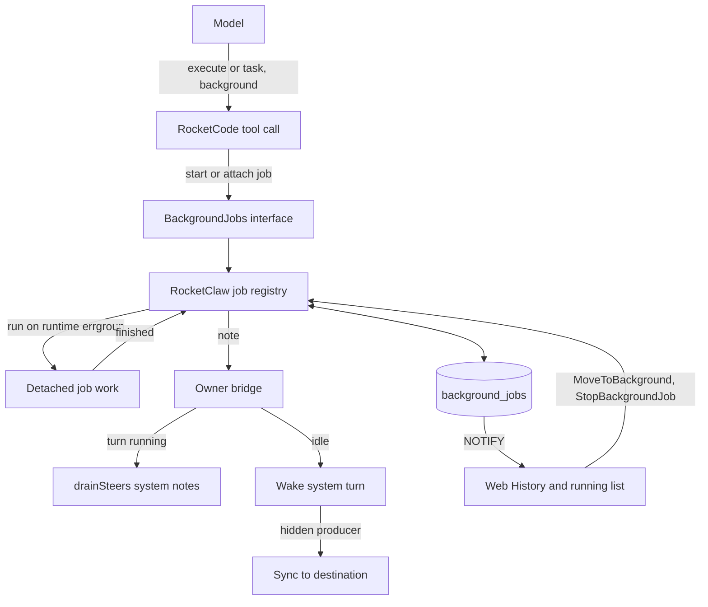
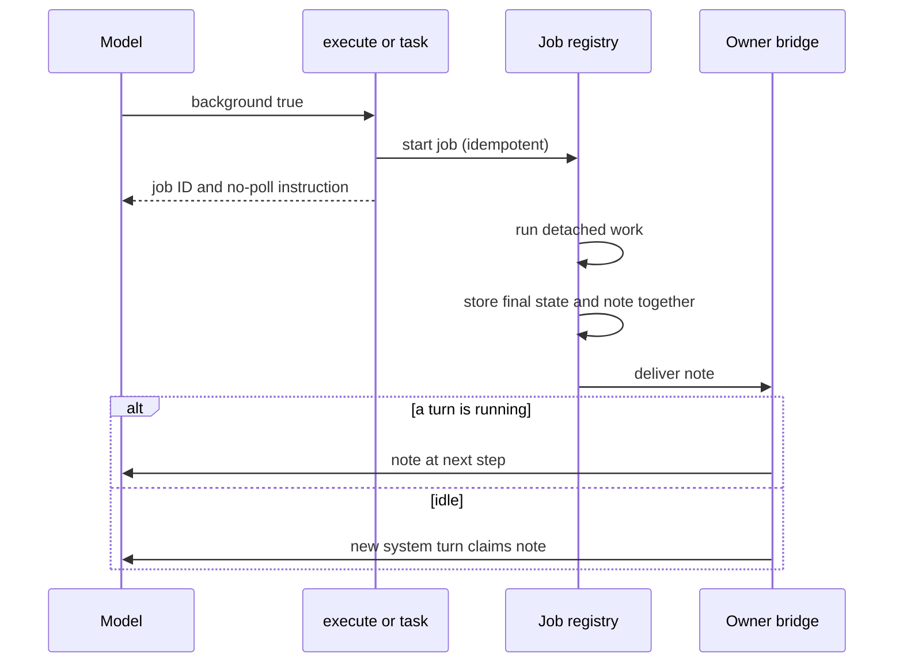

# Background Execute and Task - Plan

## Goal Capsule

- **Objective:** In RocketClaw conversations, agents permitted to do so can leave long Code Mode scripts and subagents running while the conversation moves on, and the right conversation learns each result when it finishes, without anyone waiting or polling.
- **Means:** OpenCode-style Background Jobs owned by the RocketClaw runtime, with durable job records and Completion Notes delivered into the running turn or a wake turn (KTD2, KTD4, KTD7).
- **Authority:** Product Contract Key Decisions and Requirements, then `AGENTS.md`, then this plan's KTDs, then existing code patterns. The R wins on product behavior; the KTD wins on mechanism.
- **Stop conditions:** Stop and ask when a source CLOC budget would still be exceeded after KTD1, when a settled decision proves infeasible, or when a fix needs `sync/atomic`, a linter suppression, or a Windows path.
- **Execution profile:** Deep. Go (RocketCode, RocketClaw backend, Web RPC), one PostgreSQL migration, TypeScript Web UI.
- **Who finishes:** `ce-work` implements and verifies every unit. Shipping happens only when the human partner asks.

---

## Product Contract

### Summary

Agents whose definition sets `permission.rocketclaw.allow_background: allow` get an optional `background` mode on `execute` and `task`. Background work returns at once and reports back through a Completion Note that is injected into whatever turn is running, or that wakes the owning conversation. Web gains a "Move to background" control, a list of running Background Jobs with stop, and completion notes. Agents gain a tool to stop their own jobs. Agents without the permission behave exactly as today.

### Problem Frame

Every `execute` script and `task` subagent blocks its turn until it finishes. A long build, test run, or research subagent holds the whole conversation, and the human can only wait or `$stop` and lose the work. OpenCode solves this with background shells and subagents that notify their session on completion. RocketClaw has no equivalent: no job registry, no way to deliver work that outlives its turn, and no "running" view beyond the turn itself.

The human partner wants per-agent control over which agents may use this, with a safe default of off, and parity with OpenCode where our architecture allows it.

### Key Decisions

- **Per-agent permission is the only gate.** (session-settled: user-directed — chosen over also hard-blocking sandboxed cron and External MCP turns: trusting one explicit, per-agent setting is simpler to reason about.) Governs R1, R2, R3.
- **Only an exact `allow_background` rule changes the setting; the default is deny.** (session-settled: user-directed — chosen over letting wildcard `rocketclaw` rules enable it: a broad allow must not turn background on by accident.) Governs R1.
- **Deny hides the option and blocks the Web move for that agent's work.** (session-settled: user-directed — chosen over still allowing a human-initiated move.) Governs R2, R14.
- **Background covers the whole `execute` script and `task`.** (session-settled: user-directed — chosen over bash-only backgrounding or a top-level bash tool.) Governs R4.
- **Subagents may background their own work.** (session-settled: user-directed — chosen over main-agent only.) Governs R7.
- **A subagent's late results wake that subagent; `task` can continue a previous subagent.** (session-settled: user-directed — chosen over storing only, waiting for jobs, or routing to the parent: matches OpenCode, whose parent can continue a child by session ID.) Governs R6, R9.
- **Delivery follows OpenCode: inject into any running turn, otherwise wake.** (session-settled: user-directed — chosen over keeping steers human-only and over appending without waking; unprompted Slack replies are accepted.) Governs R8.
- **Hidden cron and External MCP runs wake and copy to their destination.** (session-settled: user-directed — chosen over storing only.) Governs R10.
- **Large background output is retained privately for 7 days and read with `load_execute_result`.** (session-settled: user-directed — chosen over clipping only and over a readable OpenCode-style file: keeps storage private while surviving turn end.) Governs R11.
- **Turn-bound platform tools fail in background scripts; others work.** (session-settled: user-approved — chosen over refusing every platform tool.) Planning extends the same split to background subagents, which inherit the same per-turn tools. Governs R12.
- **Subagents never ask the user questions.** (session-settled: user-directed — chosen over OpenCode's per-agent permission: follows Codex, where only the root thread may ask.) Governs R13.
- **Moving a script waiting on a question withdraws the question.** (session-settled: user-directed — chosen over leaving it in the foreground.) Governs R15.
- **Manual control is Web only, and the agent gets a stop tool.** (session-settled: user-directed — chosen over Slack controls, and over OpenCode's lack of an agent stop tool: Slack users can ask the agent to stop work.) Governs R14, R16, R17.
- **`$stop` and the goal loop keep today's behavior.** (session-settled: user-directed — chosen over `$stop` cancelling background work and over pausing goals: matches OpenCode for stop and Codex for goals.) Governs R18.
- **Shutdown kills background work; foreground bash still waits.** (session-settled: user-directed — chosen over waiting for background bash: restarts must not hang on background work.) Governs R19.
- **After restart, subagents resume and scripts are reported killed.** (session-settled: user-directed — chosen over cancelling everything.) Governs R20.
- **A restart-killed note wakes hidden cron and External MCP runs.** (session-settled: user-directed — chosen over posting the note straight to the destination thread and over leaving it unreported: a hidden run never has a next turn, so its destination would never learn the work died.) Governs R20.
- **Jobs from hidden runs are visible and stoppable from their destination.** (session-settled: user-directed — chosen over leaving them invisible: otherwise a runaway background subagent from a cron or External MCP run could not be stopped at all.) Governs R16, R17.

### Requirements

**Gate and schema**

- R1. `permission.rocketclaw.allow_background` accepts only `allow` or `deny`, defaults to `deny`, changes only through an exact rule, and is evaluated on the agent making the call.
- R2. For a denied agent, tool schemas, tool behavior, and the Web are exactly as today, except for R13: no `background`, `description`, or `continue` properties, a `background: true` request is rejected, and manual move skips its work.
- R3. Background is available wherever the call has an owning conversation, including cron and External MCP runs. Workflow workers and the goal check, which have no owning conversation, never offer it.

**Starting background work**

- R4. `execute` and `task` accept `background`. A background call returns at once with a Background Job ID and an instruction not to poll.
- R5. For allowed agents, `execute` has a short `description` used as the job's label everywhere.
- R6. For allowed agents, `task` can continue a previous subagent of the same conversation by its job ID. Continuing a busy subagent or one that is not a direct child fails with a clear error.
- R7. A subagent may run its own work in the background according to its own agent's setting.

**Delivery**

- R8. Each finished Background Job produces exactly one Completion Note for its owner. If any turn of the owner is running, the note enters it at the next step; a note arriving during the final answer continues the turn. Otherwise the note wakes the owner with a new system turn.
- R9. A job started by a subagent belongs to that subagent. Its note wakes the subagent for a new turn whose output is stored in the subagent's history; the parent is not told.
- R10. A wake turn for a hidden cron or External MCP conversation copies its result to the same destination as the original run, with the original run's cron rules.
- R11. A background `execute` result larger than the preview limit shows the preview and an ID. The full output stays private for 7 days, and `load_execute_result` reads it from any turn of the owning conversation in that window.

**Restrictions inside background work**

- R12. In background work, scripts and subagents alike, `rocketclaw_attach_files_to_response`, `rocketclaw_i_want_human_partner_to_see_this`, `ask_user_question`, and `rocketclaw_restart` fail with an error naming the restriction. Every other tool works with the context of the turn that started the job.
- R13. Subagents never have `ask_user_question`, in the foreground or the background.

**Controls**

- R14. Web shows "Move to background" while eligible `execute` or `task` calls are running. It moves all eligible calls of the conversation at once, and the agent receives a system note that the user moved the work.
- R15. Moving a script that is waiting on `ask_user_question` withdraws the question, and the pending call returns an error to the script.
- R16. Web lists the conversation's running Background Jobs with open and stop per item, and shows a short finished, failed, stopped, or killed note in the transcript at every timeline detail level. The list also includes jobs started by hidden cron or External MCP runs whose destination is this conversation.
- R17. An allowed agent has a tool to stop Background Jobs of its own conversation by ID, including jobs from hidden runs whose destination is this conversation.
- R18. `$stop` stops only the running turn and the foreground work it waits on. The goal loop continues exactly as today.

**Lifecycle**

- R19. At shutdown, foreground bash still runs to completion, and every Background Job, including moved work and bash inside background subagents, is killed.
- R20. After restart, a killed background script is reported "killed because the server restarted" to its owner at the next turn without waking it. In a hidden cron or External MCP run, which never has a next turn, that note wakes the run instead, so its result reaches the destination (R10). A background subagent resumes and later delivers its note.
- R21. There is no limit on concurrent Background Jobs.

**Documentation**

- R22. The README, `cmd/rocketclaw/CHEATSHEET.md`, the agent-creation skill, `CONCEPTS.md`, and the Web and RPC READMEs describe the setting, the tool parameters, and the Web controls.

### Acceptance Examples

- AE1. **Covers R1, R2.** An agent with `rocketclaw: allow` and no `allow_background` rule sees `execute` and `task` schemas identical to today's, and a hand-crafted `background: true` call is rejected.
- AE2. **Covers R4, R8.** An allowed agent starts a 20-minute test script with `background: true` and ends its reply. When the script finishes the conversation is idle, so a system turn starts with the `<execute … state="completed">` note and the agent replies in the same Slack thread.
- AE3. **Covers R8.** A note arrives while a goal-continuation turn is running. The note is injected at that turn's next step; no extra turn starts for it.
- AE4. **Covers R9, R6.** Subagent `researcher` starts background tests and returns "tests started". When they finish, `researcher` gets a new turn and writes its analysis to its own history. Later the main agent calls `task` with `continue` set to that job ID and receives the analysis.
- AE5. **Covers R10.** A cron agent starts a background report and its run posts "Report started" as a new Slack root. The wake turn's result is posted as a reply in that thread, subject to the output decision.
- AE6. **Covers R14, R15.** The main agent's script waits on a question while a subagent runs. The human presses "Move to background": the question disappears, the script's call errors and continues in the background, and the subagent moves too.
- AE7. **Covers R19, R20.** The server restarts while a background script and a background subagent run. After startup the script is reported killed at the next turn without waking anyone, and the subagent continues and later delivers its note.
- AE8. **Covers R20, R10.** A nightly cron run posted "Report started" and its background script is killed by a restart. After startup the hidden cron run wakes with the killed note, and its follow-up is posted in the "Report started" thread.
- AE9. **Covers R16, R17.** A cron run's background subagent loops. In the `#reports` thread it posts to, Web lists the job with Stop, and asking the agent in that thread to stop it works.

### Scope Boundaries

- Slack controls for moving or stopping work are out of scope; Slack users can ask an allowed agent to stop work (R17).
- No sandboxed or canonical detection gates this feature.
- No caps, quotas, or timeouts on Background Jobs beyond those a script or bash call already sets.
- `$stop`, goal continuation, and cron or External MCP flows are unchanged except for note injection into their running turns (R8) and wake delivery (R10).
- Live updates in the Web delegation panel remain out of scope; it keeps its one-shot read.

#### Deferred to Follow-Up Work

- A Slack-native "N running" view.
- Exposing Background Jobs to the observer and telemetry signals beyond existing logs.

---

## Planning Contract

### Key Technical Decisions

- KTD1. **Raise the RocketCode source budget from 10500 to 11250.** `internal/rocketcode/Makefile` `GO_SOURCE_CLOC_BUDGET` changes by 750, the only budget edit in this work. (session-settled: user-directed — chosen over deleting existing RocketCode code or shrinking the feature: RocketCode had 58 lines left and needs roughly 300.) RocketClaw (about 2800 left) and Web (376 left) keep their budgets; Web work must stay lean.
- KTD2. **A Background Job is a durable row, created only when work becomes background.** Migration `026` adds `background_jobs`, written when a call starts with `background: true` or is moved, never for ordinary foreground calls. Rejected alternative: a row for every allowed call, which loses because it adds a write and a NOTIFY to every `execute` and makes restart confuse foreground reruns with killed jobs.
  - **Keys:** primary key `(conversation_id, job_id)`. `conversation_id` is the root conversation, which the transcript NOTIFY function in `019_transcript_changes.sql` reads by that exact name. `child_key` names the owning subagent, empty for the main agent. `job_id` is the turn-scoped tool call key, unique per owner even when providers reuse call IDs.
  - **Columns:** kind and status with CHECK constraints, agent, label, the tool call ID, `subagent_key` (KTD8), frozen origin snapshot (KTD9), `runner_id`, `note_state` (none, pending, consumed), `wake`, `claimed_turn_id`, `finished_at_unix_ns`, result or error, and the retained-output ID and expiry (KTD10).
  - **Indexes:** partial indexes on pending notes per owner and on running jobs. A partial unique index on (conversation, `subagent_key`) for running subagent-kind rows backs the R6 busy check (KTD8).
  - **Transitions:** every status change is a compare-and-set on `status = 'running'` and the current `runner_id`, so stop, finish, and move cannot both win, and a process that lost the run lock cannot write.
  - **Resume:** a resumed turn whose call key already has a row returns that job's background result instead of rerunning the work.
  - **Destination:** a `sync_destination` column copied from the origin snapshot, indexed, lets the destination conversation list and stop jobs from hidden runs (R16, R17).
  - **NOTIFY:** the trigger fires only on insert, delete, and updates of status, note state, or label, like `active_turns` in `023_durable_work.sql`. It notifies both `conversation_id` and a non-empty `sync_destination`, so the destination's Web list updates live. Rows never carry progress.
- KTD3. **RocketCode defines the job contract; RocketClaw owns the jobs.** RocketCode adds a small `BackgroundJobs` interface on `Config` with an explicit inert implementation. The inert value means background is unavailable, so its properties are absent (R3). The work is handed over as a named interface value, and the subagent note drain is a method on the same interface, so no new func-holder like `SteerDrain{Fn}` appears. RocketClaw implements it with a registry on a plain `errgroup.Group` beside `bridgeLoops`, where one job's error does not cancel others. Rejected alternative: a RocketCode-owned worker pool, which loses because the looper is rebuilt per turn (`bridge.go` `runTurn`) and shutdown order lives in `app.go`.
- KTD4. **Allowed agents run every `execute` and `task` call on a movable context.** A running inline call cannot be detached later, so R14 forces every allowed call to run on its own context: `context.WithoutCancel` of the call context, linked back by `context.AfterFunc` that cancels with `context.Cause` of the call context. The cause must be preserved so foreground bash still survives shutdown (`callContext` in `looper.go`, `TestShutdownKeepsRunLockAliveDuringBash`). The tool call waits for "finished or moved", like OpenCode's `Job.block`, and an attached call waits for its work, not merely for cancellation, so `bridgeLoops.Wait` still covers foreground bash.
  - **Moving:** stops the link, writes the KTD2 row, and returns the background result. `$stop` and interruption still cancel unmoved work.
  - **Per-job state:** an output sink that forwards to the turn only while attached, and a snapshot of the permission-review input, which changes per tool batch.
  - **Journal:** keys stay where they are today. `finishTurn` and `closeTurn` skip any prefix owned by a background row of that turn, and the job deletes its own prefix in its finish transaction. Rejected alternative: re-rooting journals under `job/`, which loses because recorded host calls would no longer replay on resume.
  - **Public progress:** every call that returns a background result, whether started in the background or moved, reports a "background" state instead of "completed", so Web does not show running work as done.
  - **Scope:** denied agents keep today's inline path untouched.
- KTD5. **`allow_background` is an exact-only RocketClaw setting with a deny default.** Split today's `exactRocketClawSetting` branch in `internal/rocketcode/permission.go` into "exact-only" and "default allow" parts, reject values other than `allow` and `deny` at parse time (following the `load_agents_md` precedent), and keep the setting out of the RocketClaw auto-allow list in `loadRocketCodeDefinitionsIn`.
- KTD6. **Properties are added only for allowed agents.** Strict schemas require every property, so allowed agents send `background: false`, an empty `description`, and an empty `continue` when unused. Call-time code rejects `background: true` from a denied agent explicitly, because `decodeToolParams` ignores unknown fields.
- KTD7. **Completion Notes are stored with the job's final state and consumed exactly once.** The final status and the pending note are written in one transaction. Rejected alternative: zero-delay scheduled messages, which cannot enter a running turn. Delivery goes through the owner's bridge:
  1. **Inject or wake:** chosen under the bridge mutex. If a turn is running, `drainSteers` claims pending notes in the database (`FOR UPDATE SKIP LOCKED`) at every step of every turn type, separately from the human-only steer admission (`bridge.go` `enqueue`). Each note's input ID is its job ID, so `appendSteers` deduplicates it on resume.
  2. **Wake:** when idle, the bridge starts a system turn whose inbound stores job IDs only. It claims the notes inside the `activateInbound` transaction, like scheduled messages, not through the Thread Queue, which waits behind active goals. Pending wakeable notes count as later work in `pickLaterWork`.
  3. **Consume or release:** `finishTurn` consumes notes claimed by a turn that saved entries, in the same transaction. A turn that saves nothing (`$stop`, shutdown) releases its notes and clears their `wake` flag. `pickLaterWork` and the startup wake then skip those notes, and the next turn's `drainSteers` delivers them, so a stopped turn is never re-woken (R18). A wake turn that fails after the model saw its notes consumes them, so a failing provider cannot loop.
  4. **Startup:** claims whose turn is not running are released.
  5. **Empty wake:** a wake turn whose notes were already consumed closes without calling the model.
- KTD8. **One RocketCode entry point continues a subagent from its stored history.** `task` `continue`, a note waking a subagent, and restart resume all use it. Rejected alternative: a hidden bridge conversation per subagent, which loses because bridges bring Slack, goal, queue, and prune behavior.
  - **Keys:** a subagent-kind row stores the child-session key of the subagent it runs in a `subagent_key` column, separate from the owner `child_key`. That key differs from the job ID: `tasks.go` builds `childKey + "/" + callID`, while the job ID is the turn call key.
  - **Continue ID:** for allowed agents, every `task` result reports the subagent's continue ID, foreground or background, following OpenCode's `task_id` line (KTD16). The continue ID is that child-session key, relative to the calling conversation. R6's "job ID" for a subagent is this ID. `continue` resolves it through child history in the calling conversation, never through a job row, so it works in forks, where rows are not copied (KTD17), and is unambiguous when providers reuse call IDs.
  - **History:** `ChildSessions` gains a read method, and guardrail and permission-review entries sharing the key are filtered out.
  - **One run per subagent:** every subagent run is started through the registry's single get-or-start, keyed by (conversation, subagent key): foreground `continue`, wake, and restart resume. Under the registry mutex it rejects a second run while one is active, attached or detached, and routes a note for a running subagent into its turn through the KTD3 drain method. A partial unique index on running subagent-kind rows guards background rows in the database.
  - **Waking:** a subagent wake delivers an existing note rather than creating a new one. It runs as a subagent-kind row on the registry, built with that turn's tool factory and serialized per subagent by the get-or-start above, never inside the bridge loop, so shutdown kills it like any detached job (R19). It can be listed, stopped, and resumed. It finishes with `note_state` none. Its output reaches only the subagent's history through `AppendChildEntry`, in the same transaction that consumes the note it delivered. It therefore never wakes the subagent again and never tells the parent (R9).
- KTD9. **Wake turns for hidden producers reuse the original run's routing.** The job's origin snapshot freezes `SyncDestination`, `RequireOutputDecision`, `Cronjob`, and `SlackReply` at job start. The wake inbound carries them, and for cron without a destination it replies in the thread the original run posted. It travels the existing producer path in `Runtime.RunTurn`.
- KTD10. **Background output retention is separate from turn spills.** Oversized background results are written under `.rocketcode/spill/retained/` with hashed file names, because job IDs contain `/`. That keeps them behind `isExecuteSpillPath`'s file-tool block and out of reach of turn cleanup. The row stores the output ID and `retained_until`, and `load_execute_result` refuses reads after it or from another conversation. Expired files are swept whenever a new result is retained and at startup, without a timer. Conversation deletion removes the files after its transaction commits. Foreground spills keep today's turn ownership (`CONCEPTS.md` Spill).
- KTD11. **Background work uses a snapshot of its originating turn.** The origin snapshot is captured when the job is created. Platform tools built per turn (`bridge.go` custom tools, `dynamic_workflow_tool.go`, schedule tools) read it instead of `b.activeReply`. R12's tools stay bound but check at call time whether their call's job is detached, and return the restriction error if so. Removing them would fail a Starlark script at compile time, and a start-time binding would miss work that was moved mid-run. A RocketCode `Tool` flag marks them, following the `Resumable` field. The same rule covers background and moved subagents, which inherit the per-turn base tools (`tools.go` `assembleTools`).
- KTD12. **Child loopers no longer inherit the question asker.** `task` stops copying `ask_user_question` into child tool sets for every agent, allowed or denied. This is the one deliberate exception to R2's "exactly as today", because R13 governs all subagents.
- KTD13. **Web controls are new RPCs, not text commands.** `MoveToBackground` and `StopBackgroundJob` RPCs. A `$background` text command was rejected because Slack routes the same text and the move is Web only. `HistoryResponse` gains:
  - a `movable` flag, true while the registry holds an attached call of an allowed agent in the conversation. Web cannot evaluate permissions, so this keeps the button away from denied agents (R2).
  - a Background Job list with label, kind, state, tool call ID, and subagent key, holding jobs that are running or whose note is still pending. It includes jobs whose `sync_destination` is this conversation (R16). Their open action is omitted, because their transcript lives in a hidden conversation.
  - job ID and final state on Completion Note transcript entries.
- KTD14. **The agent stop tool is `rocketclaw_stop_background_job`.** It is a RocketClaw platform tool, visible and callable only for allowed agents. It reaches jobs owned by the calling conversation or its subagents, and jobs whose `sync_destination` is the calling conversation (R17). `StopBackgroundJob` on Web uses the same scope.
- KTD15. **Shutdown and restart treat jobs by kind.** After `bridgeLoops.Wait`, the registry cancels detached jobs with a dedicated cause that is not `ErrShutdown`, so bash inside them is killed (R19). The job's finish path ignores that cause and writes no status or note, so rows stay `running` under the old `runner_id`. Attached foreground calls are never killed by the registry.
  - **Startup order:** a new step runs before `StartActiveTurns`. It loads running rows, releases stale note claims (KTD7), marks running scripts killed, and re-stamps subagent rows with the new `runner_id`. A killed note is no-wake, except when the origin snapshot names a sync destination or an output decision; then it wakes the hidden run through KTD9 (R20).
  - **Single resume path:** subagent rows resume through the KTD8 get-or-start. A resumed parent turn that re-attaches and the startup step can therefore never run the same subagent twice. A subagent that cannot resume finishes as failed with a note, so R8 still holds.
  - **Wake check:** the step then wakes every conversation with pending wakeable notes, following `docs/solutions/logic-errors/saved-queue-never-started-after-restart.md`.
- KTD16. **Model-facing text is fixed in one place.** The immediate result, the `task` continue-ID line (KTD8), the `<execute>` and `<subagent>` note wrappers with `id`, `state`, and `description`, the user-moved note, and the stopped, failed, and killed wording follow OpenCode's text (`packages/core/src/tool/plugin/shell.ts`, `subagent.ts`, `session.ts`). They distinguish "stopped by user", "stopped by agent", "killed because the server restarted", and "failed", so the model does not retry deliberately stopped work. Notes carry a system origin, never a human one.
- KTD17. **Jobs follow conversation lifecycle.**
  - **Deleting or clearing:** cancels the conversation's in-memory jobs first, then removes their rows, journal prefixes, and retained files. `RemoveExternalMCPConversation` does the same.
  - **Prune:** skips conversations with running jobs or pending wakeable notes, in all three prune paths of `store.go` (thread conversations, External MCP sessions, stale private conversations). Killed no-wake notes do not keep a conversation alive.
  - **Fork and Sync:** neither copies job rows, so a fork has no running jobs or retained outputs of its source.
  - **Cleanup:** consumed rows of finished jobs are deleted when their retention expires.

### High-Level Technical Design

Ownership across components:

Job lifecycle. Attached calls have no row; the row appears when work becomes background (KTD2).

```mermaid
stateDiagram-v2
  [*] --> attached: allowed foreground call, no row
  [*] --> background: background true, row written
  attached --> background: moved by user, row written
  attached --> [*]: finished or cancelled in the foreground
  background --> completed: success
  background --> failed: error
  background --> stopped: user or agent stop
  background --> background: shutdown kills the work, row stays running; subagent resumes at startup
  background --> killed: startup finds a running script
  completed --> noted
  failed --> noted
  stopped --> noted
  killed --> noted: next turn, no wake
  noted --> [*]: note consumed by the owner's turn
  noted --> subagent_wake: owner is a subagent
  subagent_wake --> [*]: output saved to the subagent's history, note consumed, no new note
```

A background call from start to note:

### Risks

| Risk | Mitigation |
|---|---|
| Work runs twice after a crash between job start and saving the call result | KTD2: a resumed call with an existing row returns the background result |
| A subagent is resumed twice, by its parent's resumed turn and by startup | KTD15 single get-or-start path, run before `StartActiveTurns` |
| Stop, finish, and move race, or a stale process writes after losing the run lock | KTD2 compare-and-set on status and `runner_id` |
| Moved work loses its saved steps when the parent turn finishes | KTD4 prefix exemption in `finishTurn` and `closeTurn` |
| Moving a call breaks foreground bash at shutdown | KTD4 cause-preserving link; KTD15 kills only detached jobs |
| Diagnostics sent after the turn closes its output channel panic | KTD4 job-owned output sink |
| `dynamic_workflow` reads a nil or wrong `activeReply` | KTD11 origin snapshot |
| A note is lost, delivered twice, re-wakes a stopped turn, or loops on a failing provider | KTD7 database claims, consume-or-release in `finishTurn`; a failed wake releases its notes without waking, and a hidden run's retries on a growing delay |
| Stored notes are stranded after a restart | KTD15 startup wake for pending notes |
| Hidden-producer wake output is dropped | KTD9 frozen routing snapshot |
| An allowed cron or External MCP agent finishes work after its result was already synced | Accepted by the Key Decision on the gate; R10 delivers it as a follow-up |
| Budgets: RocketCode raised to 11250 by KTD1; Web has 376 lines left | Keep Web UI to one panel, one button, and one note row; measure with `check-cloc-budget` after each unit |
| New migration rules out rollback by swapping only the binary | Operational Notes below |

### System-Wide Impact

- **Interfaces:** `rocketcode.Config` gains `BackgroundJobs` with an inert implementation. `ChildSessions` gains a read method. `frontend.Backend` gains move, stop, and list methods. All mocks are regenerated with mockery v3.
- **Entry points:** `runTurn`, `drainSteers`, `activateInbound`, `pickLaterWork`, `finishTurn`, `closeTurn`, `DeleteSession`, prune, External MCP cleanup, shutdown order in `lockedRun.Run`, a startup step before `StartActiveTurns`, and two Web RPCs.
- **Agent-facing tools:** for allowed agents only, `execute` and `task` gain `background`, `description`, and `continue`, and `rocketclaw_stop_background_job` appears. For every agent, subagents lose `ask_user_question` (KTD12).
- **Prompts:** KTD16 owns all model-facing wording. Notes always carry a system origin, so the permission auto-reviewer never treats them as human approval.
- **Data lifecycle:** migration `028`, retained output files, and exempted journal prefixes, each with an owner that deletes it (KTD2, KTD4, KTD10, KTD17).
- **Failure propagation:**
  - Shutdown flows through attached calls unchanged.
  - Only detached jobs get the kill cause.
  - Interruption cancels unmoved work.
  - Stopped turns never re-wake.
- **Parity:**
  - Slack gets wake replies in the original thread, and stopping through the agent tool.
  - Web gets move, list, stop, and live updates through NOTIFY.
  - Hidden producers sync to their destination.
  - Workflow workers and the goal check get the inert value.
- **`AGENTS.md` constraints:** inert values instead of nil dependencies, interface methods instead of func callbacks, errgroup for coordination, no `sync/atomic`.

### Operational Notes

- **Rollout:** migration `028` must be confirmed free against the live ledger and the deployed source before release, per `docs/solutions/runtime-errors/deployment-binary-missing-live-migrations.md`. Prefixes `017` and `019` are already duplicated, so check numbering with care.
- **Rollback:** an older binary refuses to start once `026` is applied. Rolling back means running its Down section and deleting its `pg_migrations` row by hand. That discards running jobs, pending notes, and retained outputs, so stop or drain Background Jobs first.

### Sequencing

U1 first. U2 and U3 can proceed in parallel. U4 and U5 depend on U3. U6 depends on U2 and U3. U7 depends on U5 and U6. U8, U9, and U10 depend on U7. U11 depends on U6 and U10. U12 depends on U11. U13 closes the work.

---

## Implementation Units

| U-ID | Title | Key files | Depends on |
|---|---|---|---|
| U1 | Budget and permission setting | `internal/rocketcode/Makefile`, `internal/rocketcode/permission.go` | none |
| U2 | Background Job store | `internal/rocketclaw/backend/migrations/028_background_jobs.sql`, `store.go`, `store_dao.go` | U1 |
| U3 | RocketCode background contract | `internal/rocketcode/background.go`, `tools.go`, `mcp_tools.go`, `tasks.go`, `rocketcode.go` | U1 |
| U4 | Background scripts | `internal/rocketcode/mcp_tools.go`, `custom_tools.go`, `execute_results.go` | U3 |
| U5 | Subagent continuation | `internal/rocketcode/tasks.go`, `rocketcode.go`, `looper.go` | U3 |
| U6 | Job registry | `internal/rocketclaw/backend/background.go`, `app.go`, `bridge.go` | U2, U3 |
| U7 | Note delivery | `internal/rocketclaw/backend/bridge.go`, `conversations.go`, `thread_bridges.go` | U5, U6 |
| U8 | Restart recovery | `internal/rocketclaw/backend/app.go`, `thread_bridges.go`, `background.go` | U5, U7 |
| U9 | Platform tools and stop tool | `internal/rocketclaw/backend/bridge.go`, `dynamic_workflow_tool.go`, `background.go` | U4, U7 |
| U10 | Manual move | `internal/rocketclaw/backend/conversations.go`, `background.go`, `frontend/slack/connector.go` | U7 |
| U11 | Web RPC | `internal/rocketclaw/web/proto/web.proto`, `frontend/rpc/server.go`, `transport.go`, `http.go` | U6, U10 |
| U12 | Web UI | `internal/rocketclaw/web/src/ui.tsx`, `api.ts`, `types.ts` | U11 |
| U13 | Documentation | `README.md`, `cmd/rocketclaw/CHEATSHEET.md`, skel skill, `CONCEPTS.md`, Web and RPC READMEs | U12 |

### U1. Budget and permission setting

- **Goal:** Make room in RocketCode and add the `allow_background` setting.
- **Requirements:** R1; KTD1, KTD5.
- **Dependencies:** none.
- **Files:** `internal/rocketcode/Makefile`, `internal/rocketcode/permission.go`, `internal/rocketcode/permission_test.go`, `internal/rocketclaw/backend/bridge.go`, `internal/rocketclaw/backend/definitions_test.go`.
- **Approach:**
  1. Change `GO_SOURCE_CLOC_BUDGET` to 11250, per KTD1.
  2. Add the `allow_background` subject with exact-only matching and a deny default, and update the `Evaluate` doc comment.
  3. Reject values other than `allow` and `deny` when parsing.
  4. Confirm the auto-allow list leaves the setting alone.
- **Patterns to follow:** `code_mode_approve` and `load_agents_md` handling in `permission.go`; `TestPermissionSetEvaluate` rows.
- **Test scenarios:**
  - No rule evaluates to deny.
  - `allow_background: allow` evaluates to allow.
  - `rocketclaw: allow` and `rocketclaw: {"*": allow}` still evaluate to deny.
  - `allow_background: auto` fails to load with a message naming the setting.
  - An agent definition with `rocketclaw: allow` keeps `allow_background` denied after `loadRocketCodeDefinitionsIn`.
- **Verification:** Permission and definition tests pass, and `check-cloc-budget` for RocketCode reports the new limit.

### U2. Background Job store

- **Goal:** Persist Background Jobs and their notes durably.
- **Requirements:** R8, R16, R20, R21; KTD2, KTD7, KTD17.
- **Dependencies:** U1.
- **Files:** `internal/rocketclaw/backend/migrations/028_background_jobs.sql`, `internal/rocketclaw/backend/store.go`, `internal/rocketclaw/backend/store_dao.go`, `internal/rocketclaw/backend/store_test.go`, `internal/rocketclaw/backend/store_schema_test.go`.
- **Approach:**
  1. Create the table, constraints, indexes, and the column-limited NOTIFY trigger from KTD2, with up and down sections.
  2. Add DAO methods for idempotent create, compare-and-set transitions, the transactional finish-with-note, database note claims, consume-or-release inside `finishTurn`, a listing per conversation, and the startup reads from KTD15.
  3. Make `finishTurn` and `closeTurn` skip journal prefixes owned by background rows (KTD4).
  4. Apply KTD17 to `DeleteSession`, `RemoveExternalMCPConversation`, and the three prune paths.
- **Patterns to follow:** `023_durable_work.sql`, `scheduled_messages` DAO, `thread_queue` prune exemption, `stateDAO` transaction style.
- **Test scenarios:**
  - Creating the same (conversation, job ID) twice returns the first row.
  - A stop and a finish racing on one job leave exactly one terminal status and one note.
  - A transition with a stale `runner_id` changes nothing.
  - Finishing a job stores status and note atomically.
  - Claiming a note from two connections succeeds once.
  - `finishTurn` consumes the claims of a turn that saved entries and releases those of a turn that saved none.
  - `finishTurn` keeps journal keys under a background job's prefix and deletes the rest of the turn's keys.
  - A second running subagent-kind row with the same `subagent_key` is rejected, while two background subagents of the main agent with different keys both run.
  - Prune keeps a conversation with only a running job and drops one with only a consumed or no-wake note.
  - Deleting a conversation removes its jobs and their journal prefixes.
  - Inserting or deleting a job, or changing its status, note state, or label, sends a change notice for its conversation and its sync destination; other updates do not.
  - The migration applies and rolls back cleanly.
- **Verification:** Store tests pass against `ROCKETCLAW_TEST_DATABASE_URL`.

### U3. RocketCode background contract

- **Goal:** Let allowed agents start, attach to, and move `execute` and `task` work as jobs.
- **Requirements:** R2, R3, R4, R5, R6, R7; KTD3, KTD4, KTD6, KTD16.
- **Dependencies:** U1.
- **Files:** `internal/rocketcode/background.go`, `internal/rocketcode/rocketcode.go`, `internal/rocketcode/tools.go`, `internal/rocketcode/mcp_tools.go`, `internal/rocketcode/tasks.go`, `internal/rocketcode/background_test.go`, `internal/rocketcode/mcp_tools_test.go`, `internal/rocketcode/tasks_test.go`, `internal/rocketcode/tools_test.go`.
- **Approach:**
  1. Define the `BackgroundJobs` interface and its inert implementation on `Config`, and pass inert values from workflow workers and the goal check.
  2. Build the extra properties in `mcpToolsFor` and `taskTool` only when the scoped agent allows background.
  3. Run allowed calls on a movable context per KTD4, waiting for "finished or moved".
  4. Return the KTD16 immediate result for background calls, and report the "background" public progress state for every call that returns a background result (KTD4).
  5. Reject `background: true` from denied agents.
- **Execution note:** Start with failing tests that compare a denied agent's `execute` and `task` definitions with today's, so R2 is proven before behavior changes.
- **Patterns to follow:** `ChildSessions` and `InertChildSessions`, `Journal` and `InertJournal`, `callContext` in `looper.go`, `TestFunctionToolStrictSchemasRequireAllProperties`.
- **Test scenarios:**
  - Covers AE1. A denied agent's schemas match today's.
  - An allowed agent's schemas include `background`, `description`, and `continue`.
  - A denied agent's `background: true` call returns a rejection.
  - With the inert implementation, an allowed agent's schemas omit the properties.
  - A background call returns the job ID and text at once while the work keeps running.
  - A foreground job that is moved returns the background result and keeps running.
  - Interrupting the turn cancels an unmoved foreground call.
  - At shutdown, bash inside an unmoved foreground script still finishes, because the shutdown cause reaches it unchanged.
  - A moved call's public progress reads "background", not "completed", and so does a call started with `background: true`.
  - Diagnostics emitted after the turn closes do not panic.
  - A resumed turn whose call already has a background row returns the background result and does not rerun the work.
- **Verification:** RocketCode tests pass with `-race`.

### U4. Background scripts

- **Goal:** Make detached `execute` scripts safe and their large output readable later.
- **Requirements:** R11, R12; KTD10, KTD11.
- **Dependencies:** U3.
- **Files:** `internal/rocketcode/mcp_tools.go`, `internal/rocketcode/custom_tools.go`, `internal/rocketcode/execute_results.go`, `internal/rocketcode/execute_results_test.go`, `internal/rocketcode/mcp_tools_test.go`.
- **Approach:**
  1. Add the turn-bound `Tool` flag. Flagged tools check at call time whether their job is detached and return the restriction error if so (KTD11).
  2. Write oversized background results to the retained area with 7-day expiry.
  3. Let `load_execute_result` resolve a retained result for the calling conversation.
- **Patterns to follow:** the `Resumable` field on `Tool`; `saveExecuteResult` and `clipExecuteHead`; `isExecuteSpillPath` privacy check.
- **Test scenarios:**
  - A background script calling `ask_user_question` gets the restriction error and the rest of the script continues.
  - A script moved mid-run gets the restriction error when it calls `rocketclaw_attach_files_to_response` after the move, and the normal result before it.
  - A foreground script still calls the same tool normally.
  - A large background result yields a preview plus an ID that `load_execute_result` reads from a later turn.
  - The ID is rejected from another conversation.
  - A retained result older than 7 days is swept and its ID reports expired.
  - File tools cannot read the retained area.
- **Verification:** Execute and spill tests pass, including `*os.Root` fixtures.

### U5. Subagent continuation

- **Goal:** Continue a previous subagent from its history, and keep subagents from asking questions.
- **Requirements:** R6, R9, R13; KTD8, KTD12.
- **Dependencies:** U3.
- **Files:** `internal/rocketcode/tasks.go`, `internal/rocketcode/rocketcode.go`, `internal/rocketcode/looper.go`, `internal/rocketcode/tasks_test.go`, `internal/rocketcode/main_test.go`, `internal/rocketclaw/backend/bridge.go`.
- **Approach:**
  1. Add a read method to `ChildSessions` and implement it over the session store.
  2. Add the continuation entry point that rebuilds a child looper and runs one input on its filtered history.
  3. Wire `task` `continue` to it with busy and direct-child checks, resolving the continue ID through child history in the calling conversation (KTD8).
  4. Report the continue ID in every allowed agent's `task` result (KTD8, KTD16).
  5. Give child loopers the KTD3 note drain method for their child key.
  6. Stop copying the question asker into child tool sets (KTD12).
- **Patterns to follow:** `runTask` child construction, `childSessionOut`, `TestTaskChildResumesFromItsJournal`.
- **Test scenarios:**
  - Covers AE4. `continue` with a finished child's job ID runs the child with its earlier history and returns its new answer.
  - `continue` on a busy child fails with a clear error.
  - `continue` with an ID from another conversation fails.
  - Guardrail and review entries under the same key are not replayed as child history.
  - A note addressed to a running child enters the child's turn, not the parent's.
  - `continue` in a fork finds the child history copied from the source conversation.
  - A foreground `task` result from an allowed agent includes a continue ID that a later `continue` accepts.
  - When a provider reused the same call ID in two turns, `continue` with each reported ID reaches the right child.
  - A foreground `continue` on a subagent whose wake job is running is rejected as busy.
  - A subagent's tool set never contains `ask_user_question`, for allowed and denied agents alike.
- **Verification:** Task and main tests pass.

### U6. Job registry

- **Goal:** Run and track Background Jobs in the RocketClaw runtime.
- **Requirements:** R4, R7, R19, R21; KTD3, KTD15.
- **Dependencies:** U2, U3.
- **Files:** `internal/rocketclaw/backend/background.go`, `internal/rocketclaw/backend/app.go`, `internal/rocketclaw/backend/bridge.go`, `internal/rocketclaw/backend/background_test.go`, `internal/rocketclaw/backend/app_test.go`.
- **Approach:**
  1. Implement `BackgroundJobs` on a plain errgroup owned by `lockedRun.Run`. Detached jobs are cancelled with the KTD15 cause after `bridgeLoops.Wait`.
  2. Capture the origin snapshot and `runner_id` when a job's row is created.
  3. Record jobs through U2, delete each finished job's journal prefix in its finish transaction, and hand final states to the owner bridge.
  4. Pass the registry in `rocketcodeConfig`, with the inert value in workflow and goal-check runs.
- **Patterns to follow:** `bridgeLoops` errgroup and shutdown order in `app.go`; `TestShutdownKeepsRunLockAliveDuringBash`.
- **Test scenarios:**
  - A started job is persisted and appears in the conversation's listing.
  - Stopping a running job marks it stopped and stores a note.
  - Shutdown kills a background job running bash and leaves its row running for the startup step.
  - Shutdown still waits for foreground bash.
  - Many concurrent jobs run without a limit.
- **Verification:** Backend tests pass, using synctest only for in-memory timing.

### U7. Note delivery

- **Goal:** Deliver each Completion Note exactly once to its owner.
- **Requirements:** R8, R9, R10, R18; KTD7, KTD9, KTD16.
- **Dependencies:** U5, U6.
- **Files:** `internal/rocketclaw/backend/bridge.go`, `internal/rocketclaw/backend/conversations.go`, `internal/rocketclaw/backend/thread_bridges.go`, `internal/rocketclaw/backend/bridge_test.go`, `internal/rocketclaw/backend/runtime_test.go`, `internal/rocketclaw/backend/active_turn_test.go`.
- **Approach:**
  1. Make `drainSteers` claim pending notes in the database at every step of every turn type, choosing inject or wake under the bridge mutex (KTD7).
  2. Add the wake request that claims notes in `activateInbound`, and count pending wakeable notes as later work.
  3. Consume or release claims in `finishTurn` through U2.
  4. Run subagent-owned notes as subagent wake jobs through U5 (KTD8).
  5. Build hidden-producer wake inbounds from the origin snapshot (KTD9).
- **Execution note:** Verify queue order, prompt framing, delivered versus silent turns, and outbound routing separately, per `AGENTS.md`.
- **Patterns to follow:** `submitDueScheduled`, `finishGoalTurn` reply-target copy, `TestSteerAcceptedBeforeRestartIsInjectedOnce`.
- **Test scenarios:**
  - Covers AE2. A note for an idle Slack conversation starts one system turn that replies in the same thread.
  - Covers AE3. A note during a goal-continuation turn is injected at its next step and starts no extra turn.
  - A note arriving during the final answer continues that turn.
  - A note arriving as a turn finishes is delivered by exactly one later turn.
  - A note injected into a turn that is then `$stop`ped is released and delivered by the next turn, and no wake starts for it.
  - A wake turn that fails after the model saw its note releases the note to the owner's next turn and does not wake again; a hidden run's failed wake retries after 1, 5, then every 30 minutes, posting only the first failure to its destination.
  - A resumed turn does not inject the same note twice.
  - Two notes at once are both delivered, in finish order.
  - Covers AE5. A cron wake replies in the original run's thread and honors the output decision.
  - An External MCP wake syncs to its managed thread.
  - A subagent-owned note runs the subagent and does not notify the parent.
  - A finished subagent wake creates no note and starts no further wake.
  - `$stop` leaves running jobs alone.
- **Verification:** Backend tests pass against the test database.

### U8. Restart recovery

- **Goal:** Report killed scripts and resume subagents after restart.
- **Requirements:** R20; KTD15.
- **Dependencies:** U5, U7.
- **Files:** `internal/rocketclaw/backend/app.go`, `internal/rocketclaw/backend/thread_bridges.go`, `internal/rocketclaw/backend/background.go`, `internal/rocketclaw/backend/active_turn_test.go`, `internal/rocketclaw/backend/app_test.go`.
- **Approach:**
  1. Add the KTD15 startup step before `StartActiveTurns`: load running rows and release stale note claims.
  2. Mark running scripts killed with a no-wake note.
  3. Resume subagent jobs through the registry's single get-or-start path, using U5 and their exempted journal prefixes.
  4. Wake conversations with pending wakeable notes.
- **Patterns to follow:** `StartPendingScheduledMessages`, `TestRunStartsPersistedQueueWithoutOtherWork`.
- **Test scenarios:**
  - Covers AE7. After restart a killed script's note appears in the next turn and no turn starts for it.
  - Covers AE8. After restart a killed script from a cron run wakes the hidden run, and its follow-up reaches the original thread.
  - A running subagent job resumes and later delivers its note.
  - A parent turn resumed by `StartActiveTurns` that re-attaches to the same subagent does not start a second run.
  - A note stored before the crash but never delivered wakes its conversation after startup.
  - A second start replays nothing.
  - A job whose conversation was deleted is dropped.
- **Verification:** Restart tests pass with a real store.

### U9. Platform tools and stop tool

- **Goal:** Keep background scripts' platform tools correct, and let agents stop their jobs.
- **Requirements:** R12, R17; KTD11, KTD14.
- **Dependencies:** U4, U7.
- **Files:** `internal/rocketclaw/backend/bridge.go`, `internal/rocketclaw/backend/dynamic_workflow_tool.go`, `internal/rocketclaw/backend/session_tools.go`, `internal/rocketclaw/backend/background.go`, `internal/rocketclaw/backend/bridge_test.go`, `internal/rocketclaw/backend/background_test.go`.
- **Approach:**
  1. Flag the four R12 tools as turn-bound.
  2. Make schedule, reset-schedule, and dynamic-workflow tools read the job's origin snapshot.
  3. Add `rocketclaw_stop_background_job` for allowed agents.
- **Patterns to follow:** `askUserQuestionTool`, `ScheduleMessage` privacy check, `agentExplicitlyAllowsRocketClawTool`.
- **Test scenarios:**
  - A background script started in a cron run schedules a private producer message, not a real schedule.
  - A background script runs a dynamic workflow without reading the live reply.
  - Attach, output decision, ask, and restart fail with the restriction message in a background script, in a background subagent, and in a subagent moved mid-run.
  - The stop tool stops the conversation's own job and its subagents' jobs.
  - Covers AE9. The stop tool called in a destination conversation stops a job started by a hidden cron run that reports there.
  - The stop tool rejects a job ID from an unrelated conversation.
  - The stop tool is absent for denied agents.
- **Verification:** Bridge and background tests pass.

### U10. Manual move

- **Goal:** Move eligible running work to the background on request.
- **Requirements:** R14, R15; KTD4, KTD16.
- **Dependencies:** U7.
- **Files:** `internal/rocketclaw/backend/conversations.go`, `internal/rocketclaw/backend/background.go`, `internal/rocketclaw/frontend/slack/connector.go`, `internal/rocketclaw/backend/runtime_test.go`.
- **Approach:**
  1. Add a `Runtime` method that moves every attached job of allowed agents in the conversation.
  2. Withdraw pending questions for moved scripts and return an error to their calls.
  3. Queue the user-moved system note into the running turn.
- **Patterns to follow:** `Runtime.PromoteQueueItem`, the question cleanup path in `connector.go`.
- **Test scenarios:**
  - Covers AE6. Moving withdraws the pending question, errors the script's call, and moves the subagent too.
  - Work of a denied agent stays in the foreground.
  - Moving with nothing eligible is a no-op.
  - Moving as a call finishes returns its real result rather than a background result.
- **Verification:** Runtime tests pass.

### U11. Web RPC

- **Goal:** Expose Background Jobs, move, and stop to the Web.
- **Requirements:** R14, R16; KTD13.
- **Dependencies:** U6, U10.
- **Files:** `internal/rocketclaw/web/proto/web.proto`, `internal/rocketclaw/frontend/rpc/server.go`, `internal/rocketclaw/frontend/rpc/transport.go`, `internal/rocketclaw/frontend/rpc/http.go`, `internal/rocketclaw/frontend/backend.go`, `internal/rocketclaw/frontend/rpc/server_test.go`, `internal/rocketclaw/frontend/rpc/http_test.go`.
- **Approach:**
  1. Add the messages and RPCs, then regenerate.
  2. Register them in both method lists and validate required fields.
  3. Add the KTD13 `movable` flag, job list, and note fields to the history response, and send a change notice when `movable` flips.
  4. Authorize with `visibleConversation`.
  5. Regenerate mockery mocks for the extended `frontend.Backend`.
- **Patterns to follow:** queue RPCs (`ListQueue`, `RemoveQueueItem`) end to end; `protocol.gen.go` hash.
- **Test scenarios:**
  - History lists running jobs and jobs with pending notes, with label, kind, state, tool call ID, and subagent key.
  - A job killed at restart stays listed as killed until its note is consumed.
  - Covers AE9. The destination conversation's history lists a hidden cron run's job, and `StopBackgroundJob` from the destination stops it.
  - `movable` is true while an allowed agent's call runs attached and false while only a denied agent's `execute` runs.
  - A Completion Note entry carries its job ID and final state.
  - Move and stop reach the runtime for a visible conversation.
  - Move and stop are refused for a private cron or MCP conversation.
  - Unknown fields are rejected over HTTP.
  - A job update triggers an SSE notice.
- **Verification:** RPC tests pass, including the protocol hash test.

### U12. Web UI

- **Goal:** Give people the move button, the running list, and completion notes.
- **Requirements:** R14, R16.
- **Dependencies:** U11.
- **Files:** `internal/rocketclaw/web/src/ui.tsx`, `internal/rocketclaw/web/src/api.ts`, `internal/rocketclaw/web/src/types.ts`, `internal/rocketclaw/web/src/transcript.test.ts`, `internal/rocketclaw/web/src/background.browser.test.ts`.
- **Approach:**
  1. Show "Move to background" beside the "Working…" status while `movable` is true.
  2. List Background Jobs above the composer with open and stop, showing the final state on finished rows.
     - Open uses `delegationHref` with the subagent key for subagents.
     - For scripts, open scrolls to the call, loading earlier pages when needed.
     - Keep calls in the "background" state visible at every detail level, as failed lines already are.
  3. Render each Completion Note as one row, "<label> · finished | failed | stopped by user | stopped by agent | killed (server restarted)", visible at every detail level, with the full note text collapsed beneath it.
  4. Add "background" to the tool-state union in `types.ts`.
- **Patterns to follow:** `QueuePanel`, origin `ButtonGroup`, `delegationHref`, shadcn variants without restyling.
- **Test scenarios:**
  - The button appears only while `movable` is true, and pressing it calls `MoveToBackground`.
  - The list shows each job with open and stop, and stop calls `StopBackgroundJob`.
  - Open on a script at "Messages only" scrolls to its call.
  - A killed job with a pending note stays listed with its final state.
  - A finished note stays visible at "Messages only".
  - The list updates live from the stream.
- **Verification:** Web unit and browser tests pass, and the TypeScript budget check stays under its limit.

### U13. Documentation

- **Goal:** Document the setting, parameters, and controls.
- **Requirements:** R22.
- **Dependencies:** U12.
- **Files:** `README.md`, `cmd/rocketclaw/CHEATSHEET.md`, `internal/rocketclaw/skel/.rocketclaw/skills/main-create-or-update-agent/SKILL.md`, `CONCEPTS.md`, `internal/rocketclaw/web/README.md`, `internal/rocketclaw/frontend/rpc/README.md`.
- **Approach:**
  1. Describe `allow_background` beside `code_mode_approve`.
  2. Describe the new parameters and the stop tool in the cheatsheet table.
  3. Describe the Web controls.
- **Test expectation:** none -- documentation only.
- **Verification:** Docs match the shipped schemas and Web labels.

---

## Verification Contract

| Gate | Command or check | Applies to |
|---|---|---|
| Formatting | `gofmt` on touched Go files | Every Go unit |
| Go tests | `go test ./...` with `ROCKETCLAW_TEST_DATABASE_URL` set | U1-U11 |
| Lint | `make lint` | All units |
| Full suite and budgets | `make test`, including race, coverage no-decrease, and `check-cloc-budget` | All units |
| Web | `make -C internal/rocketclaw/web test` after `bun run build`, with Chromium for browser tests | U11, U12 |
| Static review | `go run golang.org/x/tools/gopls@latest check` on touched packages | Go units |
| Standards pass | Touched-diff review against `AGENTS.md` Go standards | Every unit, before tests and before final response |

---

## Definition of Done

- Every requirement R1-R22 is implemented, and every acceptance example AE1-AE9 has a passing test.
- A denied agent's tool schemas and behavior match the pre-change baseline (R2).
- All Verification Contract gates pass, and no budget other than KTD1's was changed.
- No defensive nil guards, func callbacks for behavior, or `sync/atomic` were added, and injected dependencies use explicit inert values.
- Abandoned-attempt code and unused helpers are removed from the diff.
- Docs from U13 describe the shipped behavior.
