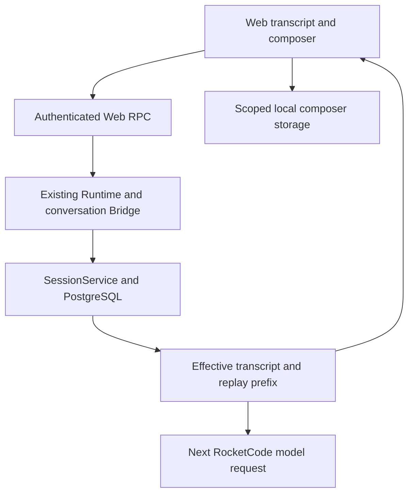
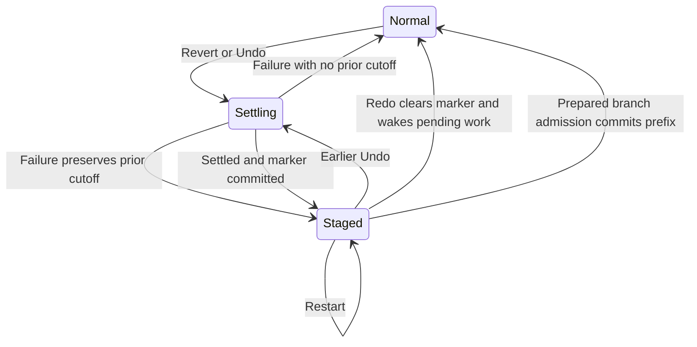
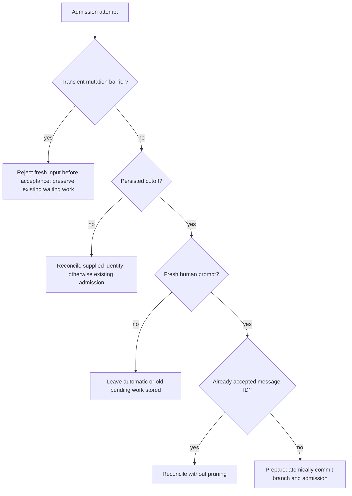
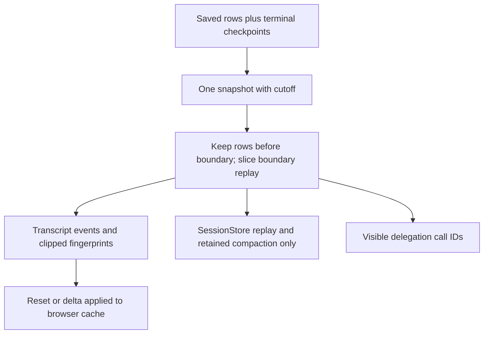

# Web Message Revert - Plan

## Goal Capsule

- **Objective:** People can return a Web conversation to an earlier request, edit that request, and continue from there without the abandoned conversation influencing the next answer.
- **Means:** A reversible message cutoff, committed when a replacement prompt is accepted (KTD2, KTD4).
- **Authority:** User-directed scope wins over upstream breadth; the Product Contract owns behavior, and the Planning Contract owns mechanisms. Repository instructions remain binding.
- **Execution profile:** Implement U1–U5 in dependency order in the existing `revert-message` workspace. This artifact does not authorize implementation or shipping by itself.
- **Finish and shipping:** The caller owns implementation, verification, review, and the eventual PR. No deployment is required by this plan.
- **Stop conditions:** Surface evidence that invalidates the pure-Web scope, requires filesystem rollback, or requires a new execution framework. Stop on failing coverage/CLOC budgets; do not raise them or hide production code.

---

## Product Contract

### Summary

Add a Revert action to recorded user messages and session Undo/Redo commands.
Revert restores the selected request into the composer and hides that request and the following conversation.
Redo restores the hidden conversation; submitting a replacement starts a new continuation in the same session.

### Problem Frame

Web currently supports copying, forking, and handing off conversation history, but not revising a previous request in place.
Hiding bubbles alone would leave abandoned messages in the model's history.

### Key Decisions

- **Phase one is pure Web only.** `(session-settled: user-directed — chosen over enabling External MCP and Cron now: keep the first implementation confined to pure Web sessions)` Governs R1.
- **Match visible behavior, not OpenCode's TypeScript structure.** Governs R2–R7; the local Go storage and execution model determine implementation.

### Requirements

**Eligibility and controls**

- R1. Enable revert only for recorded, top-level pure Web conversations; Slack, External MCP-bound/private conversations, Cron-origin chats and producer runs, and delegation histories are ineligible.
- R2. A recorded user-message Revert action stages an exclusive cutoff at that message; assistant/tool rows and pending inputs have no recorded-message Revert action.
- R3. Session Undo selects the latest recorded user message before the current cutoff, or the latest one when no cutoff exists; repeated Undo moves backward, and Undo at the beginning changes nothing.

**Composer and continuation**

- R4. Successful staging replaces the owning session's draft with the selected request's editable text and supported attachments, replacing rather than accumulating earlier draft attachments; it focuses the composer at the end without sending.
- R5. Redo restores the entire hidden suffix in one action and leaves the composer unchanged; a staged cutoff survives browser reload and daemon restart.
- R6. Accepting a new conversation prompt commits the cutoff in the same session, so Redo is no longer available and the abandoned suffix cannot influence that prompt or a later turn.
- R7. A preparation/admission failure leaves the staged cutoff and edited draft recoverable; retrying an already accepted message ID does not commit another cutoff or create another turn.

**Execution and side effects**

- R8. Staging interrupts and settles active work without allowing pending work to start in between; no queue, schedule, goal continuation, restart recovery, or other admission executes against a staged cutoff.
- R9. Pending human inputs after the boundary remain stored but hidden while staged, return in their existing order on Redo, and are dropped when the branch commits.
- R10. Revert changes conversation history, not files or external effects; previously executed tools, deliveries, scheduled-message registrations, and other external changes are not undone.
- R11. Other viewers converge on the same authoritative cutoff and history without having their own composer overwritten by a remote viewer's action.

### Acceptance Examples

| Example | Covers | Given / action / expected result |
|---|---|---|
| AE1. Basic rewind | R2, R4 | `U1 A1 U2 A2 U3 A3`; revert U2 → only `U1 A1` remains visible and the draft contains U2. |
| AE2. Undo and Redo | R3, R5 | Undo from AE1 selects U1 → empty visible history; Redo restores all six messages and leaves the U1 draft untouched. |
| AE3. Branch | R6, R7 | Revert U2, edit to U2′, send → next model request contains `U1 A1 U2′`, never U2/A2/U3/A3; Redo is unavailable. |
| AE4. Failure | R4, R7 | Upload/preparation or admission transaction fails → original hidden suffix remains recoverable by Redo, with the edited draft intact. |
| AE5. Pending work | R8, R9 | Revert while a turn runs and two follow-ups wait → interrupt settles, neither follow-up runs; Redo releases them in their prior order, while branch commit removes them. |
| AE6. Reload | R5, R11 | Reload or reconnect while staged → same cutoff and editable local draft; daemon restart does not resume hidden work. |
| AE7. Scope | R1, R2 | A Slack, External MCP, Cron-origin, or child transcript is opened → no revert controls; direct mutation RPC is also denied. |
| AE8. Irreversible tool | R10 | A hidden suffix sent an external message or wrote a file → the conversation is rewound, but that effect remains; UI/documentation do not promise rollback. |

### Scope Boundaries

**Deferred for later:** External MCP and Cron revert, including their producer/sync/delivery semantics.

**Not part of this change:** Slack revert, filesystem snapshots/rollback, arbitrary tool compensation, a new fork session on branch, generic event sourcing, or OpenCode client/API implementation parity.

### Sources

The caller's request and the local OpenCode V2 checkout define the contract.
Exact upstream references and local constraints are indexed in the Appendix.

---

## Planning Contract

### Key Technical Decisions

- KTD1. **Derive eligibility on the server from stored origin and routing facts.** Use the same facts behind `ChatOriginFacts`, `chatOrigin`, and `decideOrigin`, plus managed-root and Slack-target checks; an empty origin string or a conversation-ID prefix alone is insufficient. Expose the resulting capability in History and recheck it for mutations. This implements R1 without changing origin classification. `(session-settled: user-directed — chosen over enabling External MCP and Cron now: enforce the pure-Web boundary in storage/execution as well as the UI)`
- KTD2. **Persist one cutoff on the existing managed-conversation row.** Add `revert_message_id`, with empty meaning no cutoff. Resolve its opaque `entryID:replayIndex` against saved user replay, not lexicographic ID ordering or a turn-wide approximation. Staging changes only this marker; it does not delete or rewrite saved history. The original rows supply Redo and the restored prompt. No suffix backup table is needed. See upstream `session/revert.ts` and `session/projector.ts` in the Appendix; implements R2, R3, R5.
- KTD3. **Project the same exclusive prefix for transcript and replay.** Share backend cutoff/boundary logic between `ObserveEntries`, `ObserveTranscript`, page bounds, delegation discovery, and commit. Preserve earlier entries and `ReplayInput[:index]` of the boundary entry. For a partial entry, clear `ResponseID`, `OutputTrace`, and `TokenUsage`, and clip/drop `ReplayAttribution` ranges beyond the prefix. Clearing the trace avoids resurrecting hidden fallback text or tool observations. Discard later compaction records naturally with the suffix; do not retain a summary of abandoned context. Existing fork behavior provides the partial-entry precedent, not a reason to fork. Implements R6.
- KTD4. **Commit at prepared, durable admission, not click time or turn finish.** After command parsing, attachment access, and workflow/goal preparation succeed, serialize branch acceptance with the history lock. In one transaction, reconcile identity again, recheck the current cutoff, prune the suffix and discarded terminal journals, clear the marker, rebuild the session summary, and durably record the new request using the existing active-turn or Thread Queue representation. Wake execution only after commit. Reconcile before expensive preparation too, including when the cutoff is now empty after an earlier acceptance. Ordinary control commands such as `$stop`, `$agent`, `$undo`, and `$redo` do not commit; new STEER/QUEUE/STASH prompts and actual workflow/goal prompts do. This adapts upstream `Session.prompt` preparation/reconciliation order to R6–R9.
- KTD5. **Use the existing bridge lifecycle for a short history-mutation barrier.** Under `Bridge.mu`, close steer intake and draining, and prevent new activation/later-work selection before interruption; wait on existing turn completion outside the mutex. Once settled, stage under `lockSessionHistory`, then release the transient barrier. Automatic claim/start transactions must take that history lock and check the marker inside the transaction, not rely on an earlier read. A single feature-local barrier state under the existing mutex is justified if current fields cannot express ownership; no extra mutex, goroutine-to-hold-a-lock, channel protocol, or persistent execution state machine. The persisted cutoff becomes the restart-safe admission gate. Recovery, schedule claiming, queue promotion/pop, `activateInbound`, and goal continuation must obey it, not only the browser or `pickLaterWork`. Implements R8; `$stop` by itself is not this barrier.
- KTD6. **Keep pending work in existing durable representations.** After freezing drains, save uninjected steers and unstarted channel requests as Thread Queue rows using their current identities and order, before their in-memory owners can be lost. A drain already in flight must settle: classify those inputs by recorded `input_id`, not `steersRead` alone, and never give an injected input a second queue owner. Move completion ownership with each preserved request; teardown must not report an uninjected input as executed or complete it twice. Previously waiting human rows are the hidden pending suffix for R9. Admissions racing the transient barrier fail as busy before acceptance, rather than silently joining the wrong branch. While staged, a fresh prepared human prompt follows KTD4; explicit queue manipulation cannot release hidden inputs. Scheduled registrations remain unchanged under R10, but execution/recurrence advancement pauses until Redo or branch acceptance removes the gate. Stop an active goal through the existing StopGoal operation; Redo does not restart a goal stopped by the human's revert.
- KTD7. **Return a restored prompt through the existing transcript projection.** Use `inputEvent` and the existing attachment metadata/download path, as Fork already does. Strip the generated header and preserve exact editable text, direct-skill syntax, attachment-only requests, and recorded attachment ownership. Do not reconstruct content from DOM text or include provenance headers in the composer. Retain uploads referenced by the restored draft; do not garbage-collect attachment bytes as part of commit. Implements R4, R7.
- KTD8. **Persist composer content locally, separately from shared revert state.** Use browser IndexedDB's structured cloning for the existing text/files/agent content, scoped by origin, resolved principal, configured workspace, and session ID. Do not persist transcript cache, promises, sending/busy flags, revisions, or runtime objects. Hydrate before editing; save restored content and later edits, and clear only the dispatched content on send. Reuse the existing `edit`/`submission` ownership checks for failure restoration. This supports AE6 without exposing one person's draft to another or forcing server-side draft synchronization. Do not add a storage library.
- KTD9. **Make cutoff changes reset followed history.** Include the cutoff value in the stateless History inventory, and force a reset when it changes. Read cutoff, entry inventory, and page bounds from one database snapshot; emit notifications on marker changes through the existing PostgreSQL transcript-notification path. Reset both followed and previously loaded older-page content in the browser, and reject stale responses using request ownership across every mutation/reset, not cutoff equality alone: stage followed by Redo can return to the same marker. Keep physical-origin reads independent of the prefix, so first-message revert does not erase origin facts. Rebuild persisted preview/timestamp on commit; staging/Redo keep the saved sidebar summary unchanged. Implements R5, R11.

### High-Level Technical Design

These sketches fix ownership and sequencing, not exact signatures or helper layout.

**Component ownership (KTD1–KTD9):**



**Stage protocol and lock lifetime (KTD5):**

```mermaid
sequenceDiagram
  participant W as Web
  participant B as Runtime / Bridge
  participant D as PostgreSQL
  W->>B: Select recorded user target
  B->>B: Validate target and reserve mutation barrier
  B->>B: Freeze drains; preserve waiting inputs; stop goal; interrupt turn
  B->>B: Await execution and final delivery settlement without holding mutex
  B->>D: History lock; revalidate target and eligibility; persist cutoff
  D-->>B: Commit
  B-->>W: Authoritative cutoff and restored prompt
  B->>B: Release transient barrier
  W->>W: Replace captured session draft and refresh history
```

**State and recovery lifecycle (KTD2, KTD4–KTD6):**



Settling is process-local, not another durable mode.
A crash before the stage transaction is an incomplete action, not a successful revert; original history and preserved pending inputs remain valid.
A successful response implies execution has settled and the durable gate is installed.
On failure, keep the previous cutoff and draft; release the barrier and wake preserved work only when no cutoff remains.

**Admission decisions (KTD4–KTD6):**



**Cutoff data flow (KTD3, KTD9):**



**Directional RPC surface:**

| Surface | Input / output / purpose |
|---|---|
| StageRevert | Session plus optional recorded message ID; absence selects Undo's predecessor on the server. Returns actual cutoff and restored `TranscriptEvent`. |
| ClearRevert | Session; clears the whole staged cutoff and wakes preserved work. No composer payload. |
| History | Add capability, cutoff, and whether an Undo predecessor exists, including when history is paginated or empty. |
| Prompt | Keep the public prompt fields; use stable `message_id` for admission reconciliation and KTD4 commit. |
| Join | Existing wake-up hint; cutoff transactions notify the same conversation channel. |

No separate CommitRevert RPC is needed; only accepted prompt admission owns commit.
The new runtime operations must be carried through `frontend.Backend` because RPC cannot safely coordinate a live bridge using storage methods alone.

### Storage and Boundary Details

Validate message IDs at the RPC/storage trust boundary: strict numeric row ID and nonnegative replay index, same conversation, existing index, and user role.
`<id>:delivery`, stale rows, foreign IDs, tool/assistant indices, and malformed IDs cannot stage.
Select Undo's predecessor from the complete effective recorded replay, not the current page or the origin-filtered display.
Checkpoint-only events have no `message_id` today; preserve that contract and do not invent IDs for pending/live/terminal checkpoint rows in this change.

The partial boundary retains its row ID, timestamp, turn identity, and attribution for surviving replay items.
An empty boundary prefix contributes no visible event or replay entry; retain its raw row while staged, and delete it on commit.
Later terminal checkpoints are ordered by their existing `history_anchor_id` and checkpoint ordering, not wall-clock comparisons.
Resolve saved-turn supersession against physical saved rows before slicing/dropping the boundary; hiding that row must not expose its checkpoint. On commit, also remove the boundary turn's checkpoint and journal even when its anchor precedes the saved boundary ID. Preserve genuinely earlier unsaved terminal turns in transcript order.
Delete discarded terminal rows and all their exact turn journal keys, including subordinate keys, so no discarded record can reappear through `ObserveTranscript` or restart.
Do not delete a delivering row while a publisher still owns it: staging must first settle final delivery, and a delivery error leaves staging unsuccessful.

For successful pure-Web requests without a saved replay `input_id` (currently workflows and attachment fallbacks), retain their existing active-turn row at phase `done` for identity reconciliation instead of deleting it. Keep these completed ownership rows out of checkpoint projection and recovery; use their inbound payload to compare retries. Workflow summaries must populate the existing `TurnID` field so pruning can associate them with that owner. Regular saved inputs retain their existing replay identity. Prune completed ownership with its discarded request on branch commit, and clear it with existing session deletion. No new receipt table or public raw-history API is needed.

Delegation links follow retained function calls, including calls inside a partial boundary entry.
On commit, remove only child histories reachable exclusively from discarded calls, using existing producer/call-ID ownership; retain children belonging to prefix calls.
Direct child-history access must not reveal a child behind a staged parent cutoff.
Children are ordinary Delegation Histories, not rollback handles for their tool effects.

Use the existing SQL migration format and next unused migration identifier.
Add a marker-change trigger on `managed_conversations` using the existing `notify_transcript_change` function, rather than introducing another notification bus.
Existing rows default to no cutoff, with no history backfill or data rewrite.
Deploy migration and regenerated protocol/assets together.
Before downgrading, clear staged cutoffs through the new application; a schema rollback would otherwise expose hidden history and release pending work.

### Assumptions

- A normal locally managed Web session and a pure-Web fork are eligible under R1; copied origin or external binding facts still disqualify a conversation. Conversation IDs are not assumed to start with `web:`.
- Local controls use RocketClaw's existing dollar-command convention (`$undo`, `$redo`) and command palette, rather than adding OpenCode's slash-command parser.
- Revert restores content, not historical execution settings or the old human's identity. A replacement request uses the current allowed agent and authenticated submitting principal.
- Browser persistence covers the composer content RocketClaw supports, not OpenCode-only file/comment context-chip types.
- There is no new agent-facing history-destruction tool. Agents receive the effective prefix through the existing store; revert remains a human Web action.

### System-Wide Impact and Risks

- **Admission is the critical change.** `Prompt` currently waits for a whole turn, queue IDs can be freshly generated, and bridge channel admission is not itself durable. KTD4 must establish an acknowledged durable owner before deleting history; a storage-only commit followed by channel enqueue is unacceptable.
- **Queue order spans memory and SQL.** Save existing queue IDs/positions and preserve the order of previously admitted channel requests and uninjected steers under KTD6. Do not drop completions, replay a discarded request, or introduce a second owner on Redo.
- **Reuse admission identities, not another receipt ledger.** Reconcile IDs using active/completed inbound metadata, queue identities, and physical saved replay input identities, including hidden records. Match conversation, principal, and original input content; retain the accepted delivery, and reject conflicting reuse rather than treating it as a new request. Queue/STASH requests must use their supplied stable message ID for their durable row instead of an unrelated random ID. Concurrent copies must reconcile under KTD4's lock before either can prune or acquire a second owner.
- **Stop is not effect rollback.** Keep R10 explicit in the Web help and README. Scheduled registrations survive, so previously registered work can run after the gate clears; committing conversation history does not cancel those registrations.
- **History has several readers.** Search, Handoff, Fork, session-entry views, `sessionStore.in`, and delegation discovery must use KTD3; origin facts and internal stage/Redo validation may read retained physical history intentionally. Avoid a public raw-history escape hatch.
- **Local drafts contain private content.** Scope hydration to the resolved identity/workspace and avoid logging drafts or exposing persisted content before identity is known. Browser storage quota/access failures must show an error without falsely claiming reload persistence.
- **Budgets are real constraints.** Production changes stay in the existing RocketClaw backend/RPC/Web components, apart from the necessary frontend interface and generated outputs. A need to modify RocketCode replay semantics is a stop-and-reassess point, not permission for a wider rewrite.

---

## Implementation Units

### U1. Durable cutoff and exact prefix projection

- **Goal:** Represent a reversible cutoff without losing the original suffix.
- **Requirements:** R1–R3, R5, R6, R10; KTD1–KTD3, KTD9.
- **Dependencies:** None.
- **Files:** `internal/rocketclaw/backend/migrations/`, `store.go`, `transcript.go`, `store_summaries.go`, `fork.go` only if sharing its existing boundary logic; existing `transcript_test.go`, `fork_test.go`, `store_summaries_test.go`, and a focused `revert_test.go` if needed.
- **Approach:** Add the marker and notification trigger; implement shared boundary resolution/projection with existing `SessionEntry` types. Make effective entry, transcript, page, and delegation reads agree, including physical saved-turn supersession. Derive capability from recorded facts. Keep raw reads private for validation and restoration; add the transaction-local prune/summary operation needed by U2 without exposing a standalone destructive RPC.
- **Execution note:** First add the smallest failing prefix case to existing history tests, then implement the storage change.
- **Test scenarios:** An entry containing user/assistant/tool items and a second user at index 4 keeps exactly indices 0–3. Clip attribution crossing index 4; later trace/fallback/delivery/compaction data never appears. A checkpoint superseded by the boundary row stays hidden even when its anchor precedes that row; a genuinely earlier unsaved terminal turn survives. Stage first message, move cutoff earlier, restore, and reopen storage: original bytes and IDs remain until commit. Invalid/foreign/non-user targets leave state untouched. Inject transaction failure: no partial marker, prune, or summary update. Retained/discarded child-call links differ correctly. Existing rows and migration notification behavior remain compatible.
- **Verification:** Backend contract tests prove effective replay equals transcript prefix, while physical suffix remains recoverable. Existing fork coverage remains valid.

### U2. Serialized staging and atomic branch admission

- **Goal:** Stop and rewind safely across active work, queues, schedules, and restart.
- **Requirements:** R5–R10; KTD4–KTD6.
- **Dependencies:** U1.
- **Files:** `internal/rocketclaw/backend/bridge.go`, `conversations.go`, `thread_bridges.go`, `store_dao.go`, `store.go`; `internal/rocketclaw/frontend/`'s existing Backend interface; `active_turn_test.go`, `runtime_test.go`, `thread_bridges_test.go`, and existing queue-recovery coverage.
- **Approach:** Route stage/clear through Runtime's existing recorded bridge. Use KTD5 before interruption, preserve waiting ownership under KTD6, and keep completion waits outside mutex/transaction scopes. Gate automatic claim/start, timer recurrence advancement, and startup under the history lock. Move staged-branch acceptance to KTD4's transaction. Non-staged paths retain existing execution behavior, with supplied pure-Web identities reconciled for retries. Preserve completed ownership as specified above. Prepare workflow definitions/runner and goal checks before pruning; commit goal state with admission rather than calling a separately rejecting StartGoal afterward.
- **Test scenarios:** Run with one active turn, one uninjected steer, one channel request, and two durable queue rows: staging starts no successor, preserves order/IDs, settles delivery, and leaves no hanging request owner. Race staging with a drain already in flight: each ID belongs to recorded replay or one waiting row, never both or neither. Redo restores pending work exactly once; replacement admission drops the old human suffix before the replacement owns a turn. Restart while staged runs no hidden work. Due recurring schedules do not advance during the gate and resume without duplicate claims. A stopped goal does not continue automatically. Race stage/send/Redo/promote/pop: one serialized outcome, with busy failures before acceptance. Fail admission/prune commit or workflow/goal preparation: the previous cutoff remains and preserved inputs remain recoverable. Concurrent duplicate IDs, and retries before/after completion and restart, produce no duplicate or extra prune; include workflow and attachment-fallback completions with no saved replay ID. Outbound messages route only to the original pure-Web session, and no synthetic assistant reply is invented for hidden work.
- **Verification:** Backend lifecycle and provider-request capture prove R6 and R8 separately from queue order, prompt header/principal, silent-delivery behavior, and routing. Use existing real store/bridge abstractions; regenerate required interface mocks with mockery v3.

### U3. Web transport, capability, and coherent history resets

- **Goal:** Give all clients authoritative stage/restore results and invalidate stale views.
- **Requirements:** R1–R7, R11; KTD1, KTD7, KTD9.
- **Dependencies:** U1, U2.
- **Files:** `internal/rocketclaw/web/proto/web.proto`; generated RPC messages and schema hash; `internal/rocketclaw/frontend/rpc/server.go`, `session_commands.go`, transport dispatch sources; `session_commands_test.go`, `live_test.go`, and existing protocol/network tests; `internal/rocketclaw/web/src/types.ts`, `api.ts`, `api.test.ts`.
- **Approach:** Add the directional RPC surface above using existing unary transport/error conventions. Reuse `TranscriptEvent` for restored content and apply the existing visibility/auth checks before backend eligibility. Extend the opaque History inventory and reset handling without changing message identity. Return Undo availability from complete effective history even when the newest page is empty. Keep origin lookup on physical facts and generate committed wake-up notifications.
- **Test scenarios:** Stage returns exact text/attachment metadata and no generated prompt header. A paginated view whose cutoff removes every loaded entry resets to the retained prefix; first-message cutoff stays observable with capability and Redo. Another viewer receives a wake-up and reset. An older page or delta completing after stage/Redo cannot restore stale content, including a request started before stage and returned after Redo restores the original empty marker. Direct unauthorized, excluded-origin, child, malformed, and stale mutation requests fail without changing history. Protocol hash agrees with regenerated Go and TypeScript transport. Test saved int64 IDs above JavaScript's safe integer range as opaque strings.
- **Verification:** Existing real RPC/live tests prove storage→notification→History coherence; TS transport tests prove decoding and API names.

### U4. Message action, Undo/Redo, and owned composer restoration

- **Goal:** Deliver the Web interaction defined by AE1–AE7.
- **Requirements:** R1–R5, R7, R9, R11; KTD7–KTD9.
- **Dependencies:** U3.
- **Files:** `internal/rocketclaw/web/src/ui.tsx`, existing message/composer components, `types.ts`, `api.ts`; a small composer-persistence module only if reused by hydration/edit/send paths; `composer.test.ts`, `palette.test.ts`, `message-footer.test.tsx`, `transcript.test.ts`, and `session-commands.browser.test.ts` or one focused revert browser file.
- **Approach:** Reuse message-footer hover/touch/keyboard behavior and command palette/dollar dispatch. Stage captures the owning draft before awaiting RPC and applies the returned prompt only to that owner after success. Redo changes history only. Show a concise reverted-history indicator with Redo and the R10 limit. Hydrate/store only composer content through KTD8. Apply cutoff resets to older-page and followed caches, pending optimistic/parked inputs, queue displays, delegation links, and any open discarded-child panel; history refresh never restores composer text automatically in another viewer.
- **Test scenarios:** Revert replaces existing text and attachments, focuses the caret at the end, and sends nothing. Repeated Undo and whole-suffix Redo work with an empty view and hidden origin filters. QUEUE/STASH/default sends all follow KTD4, while `$agent`/`$stop` leave the cutoff alone. Failure restores only the dispatched draft, never newer edits. Navigating to another session during RPC completion updates only the captured owner. Reload preserves edited text and supported files; another principal/workspace cannot hydrate them. Pending input controls remain withdrawal controls, never recorded-message Revert. Browser checks at 1280px, 390px, and 320px cover hover/tap/focus, accessible labels, touch targets, no overflow, no console errors, and staged history refresh.
- **Verification:** Existing Bun test style proves draft ownership and delta application; real-browser interaction proves focus and message-action access. A mocked browser API alone does not prove backend cutoff semantics.

### U5. End-to-end regression proof and user documentation

- **Goal:** Prove the replacement prompt cannot inherit abandoned context and document the rollback limit.
- **Requirements:** R1–R11; AE1–AE8.
- **Dependencies:** U1–U4.
- **Files:** Extend `internal/rocketclaw/frontend/rpc/live_test.go` and the existing browser harness; update `internal/rocketclaw/web/README.md` and `internal/rocketclaw/frontend/rpc/README.md`; add concise shared vocabulary to `CONCEPTS.md` if needed when implementing.
- **Approach:** Add one real-backend integration path using existing provider/request capture: stage mid-entry, edit, send, inspect model input, restart, and assert suffix/checkpoint absence. Reuse existing narrower tests rather than duplicate their setup. Document controls, scope, same-session branching, local draft persistence, pending-input behavior, and R10.
- **Test scenarios:** AE3 with a hidden tool result and later compaction: the provider sees only the retained prefix and new human prompt with current framing/principal. AE5/AE6 through real storage and restart preserve queue order and gate execution. AE8 leaves a fixture tool side effect unchanged. Control paths in Slack/External MCP/Cron retain prior behavior and cannot install a cutoff.
- **Verification:** All Verification Contract gates pass, then inspect the final diff for scope, nil behavior dependencies, new error names, single-use helpers/wrappers, stale generated files, and honest production line counts.

---

## Verification Contract

These commands are execution gates, not results from planning.
Run in the existing workspace; place temporary files and browser artifacts only under its repository-local `.tmp/`, and set `TMPDIR`/`GOTMPDIR` there for commands that create temporary files.
Inspect each touched Go hunk against the repository's Go standards before editing, before tests, and after formatter/linter changes.

| Gate | Location / command | Passing signal |
|---|---|---|
| Format | Workspace: `gofmt` on touched Go files | No formatting drift. |
| Protocol generation | Workspace: `go generate ./internal/rocketclaw/frontend/rpc` | Messages and schema hash match `web.proto`; `protoc` and `protoc-gen-go` available. |
| Focused Go checks | Workspace: `go test ./internal/rocketclaw/backend ./internal/rocketclaw/frontend/rpc` | U1–U3/U5 scenarios pass with PostgreSQL configured. |
| Required full Go tests | Workspace: `go test ./...` | No regression; database tests are not skipped. |
| Required lint | Workspace: `make lint` | No unsuppressed finding; inspect auto-fix diff and dependency side effects. |
| Required test/metrics | Workspace: `make test` | Race/coverage/CLOC gates pass; coverage does not decrease below the 90.0% stability threshold. |
| Web lint/build | `internal/rocketclaw/web`: `make lint` and `bun run build` | Type checking, UI lint, and embedded assets pass. |
| Web tests | `internal/rocketclaw/web`: `make test` | Composer/transport/browser tests run, not skip for missing browser setup. |
| Global line budget | Workspace: `make check-cloc-budget` | Unchanged configured budgets pass, including Go source below 22350 and Web TS source below 5500. |
| Browser contract | Existing browser test harness with `ROCKETCLAW_PLAYWRIGHT_MODULE` and `ROCKETCLAW_CHROMIUM` | Desktop/mobile checks and real RPC/provider integration prove the relevant AEs. |

Use Docker or `ROCKETCLAW_TEST_DATABASE_URL` as the existing test Makefiles require.
Do not call a skipped PostgreSQL/browser run verification.
Use `testing/synctest` only for process-local timing; external PostgreSQL/browser waits follow the existing harness, with synchronization on actual lifecycle events rather than sleep-based race assertions.
No `release:validate` script or skill-evaluation artifact applies to this feature.

---

## Definition of Done

- U1: Stage/restore are durable and nondestructive; exact partial-prefix and migration/notification checks pass.
- U2: Staging and branch acceptance have a single durable owner; queue/order, framing, silent delivery, routing, failure, and restart cases each pass.
- U3: Authenticated capability/RPC and History resets agree across viewers, pagination, and the protocol hash.
- U4: Revert/Undo/Redo and owned composer restoration work at all specified viewport sizes, including reload and failures.
- U5: A real provider-request assertion excludes abandoned context; documentation states R1 and R10 without promising tool rollback.
- Every applicable Verification Contract gate passes; no budget increase, metric-excluded production code, or unapproved lint suppression is present.
- Remove abandoned attempts, unused helpers, temporary production instrumentation, and stale tests. Temporary verification artifacts remain under `.tmp/` only.
- README impact is considered: Web and RPC README updates are required during implementation; the repository-root README needs no change unless it currently enumerates these session controls.

---

## Appendix

### Upstream OpenCode Evidence

Paths below are relative to the caller-named OpenCode checkout, not this repository.
Observed checkout HEAD is `ed0e7acecdb770a13edd89da65fea1e941896e35` on `v2`, read from local ref files without running Git.
Working-tree source is the behavior authority for this plan; the ref alone does not prove it is unmodified.
Implementation comments and parity-sensitive tests must cite the exact upstream paths they match.

| Source | Observed behavior / local consequence |
|---|---|
| `packages/app/src/session/revert.ts:35-77` | Restore replaces prompt and context chips; recorded stage interrupts, waits, then stages. Failures stop the sequence. Pending input withdrawal is separate. |
| `packages/app/src/session/revert.ts:79-118` | Undo selects the prior user message relative to cutoff; Redo clears the entire cutoff and leaves composer alone. |
| `packages/session-ui/src/message/message-content.tsx:287-295,419-430` | Revert is a user-message action, absent for pending inputs, with an in-flight disabled state. |
| `packages/app/src/session/commands/use-session-commands.tsx:275-288` | Undo/Redo are session commands; Redo requires a cutoff. |
| `packages/app/src/session/timeline/controller-projection.ts:18-33` and `packages/app/src/session/session-domain.ts` | Timeline projection is strictly before the cutoff and excludes pending inputs; do not copy lexical comparison to local numeric composite IDs. |
| `packages/core/src/session/revert.ts:21-81` | Staging/clearing are reversible metadata operations; commit is distinct. Snapshot restoration can be disabled with `files: false`, so transcript-only semantics are a real upstream variant. |
| `packages/core/src/session/session.ts:145-175,319-345` | Reconcile before prepare; commit only after prepare succeeds. Stage/clear require idle execution, and clear wakes pending work. |
| `packages/core/src/session/projector.ts:717-773` | Stage persists marker; clear removes it; commit deletes messages and inbox rows at/after the boundary and resets instruction state. |
| `packages/app/src/composer/prompt.ts:62-180` | Restore uses original presentation plus attachments/context, not visible DOM text; map only RocketClaw-supported content. |
| `packages/app/src/composer/state.ts:63-64,180-195` and `packages/app/src/composer/persistence.tsx:44-62,105-142` | Drafts are persisted and scoped to server/workspace/session ownership, motivating KTD8. |
| `packages/app/src/composer/submit.ts` | Prompt submission captures draft ownership and preserves failure behavior; backend preparation precedes branch commit. |
| `packages/desktop/src/renderer/desktop-app.tsx` | Desktop uses the shared `@opencode/app/desktop` application rather than an independent revert implementation. |

### Local Evidence and Reuse

- `internal/rocketclaw/backend/fork.go:38-69`: existing exclusive user boundary, partial replay slice, and invalidation of trace/response/usage.
- `internal/rocketclaw/backend/store.go:828-871,1492-1512`: saved entry reads feed model replay; browser filtering cannot change that input. `ObserveEntries` itself reads saved entries, not live checkpoints.
- `internal/rocketclaw/backend/transcript.go:95-177`: transcript includes saved entries and checkpoint/terminal records, with producer-scoped fingerprints and saved-entry pagination.
- `internal/rocketclaw/backend/store_dao.go:392-525`: active-turn admission, finish, delivery, and journal ownership; stopped/failed rows remain as transcript history.
- `internal/rocketclaw/backend/store_dao.go:516-525`, `bridge.go:1079-1085,1337-1350`: successful close currently deletes inbound ownership; workflow replay has no input ID, and attachment fallback saves no replay. Completed-row retention closes that retry gap without a new ledger.
- `internal/rocketclaw/backend/conversations.go:403-424`, `bridge.go:1015-1029`, and `internal/rocketcode/looper.go:1034-1059`: drains advance an in-memory cursor before replay insertion, while teardown closes every steer completion; preservation must coordinate both lifetimes.
- `internal/rocketclaw/backend/transcript.go:119-126`: checkpoint anchors can precede the saved row that supersedes them; prefix clipping must not undo that supersession.
- `internal/rocketclaw/backend/bridge.go:449-507,637-845,848-977,1136-1199`: steer intake, channel admission, later-work claims, and final delivery. Existing `$stop` can be followed by later-work selection.
- `internal/rocketclaw/backend/conversations.go:258-344,362-425`: cancellation completion, goal preparation, queue mutations, and drain order.
- `internal/rocketclaw/backend/thread_bridges.go:186-224,587-664,703-725,816-852`: startup goal recovery, in-memory steers alongside SQL queue rows, promotion claiming before submit, and pure-Web bridges without an automatically installed pair gate.
- `internal/rocketclaw/backend/store_summaries.go:17-26,74-108`: history advisory lock and summary projection; reuse these rather than adding a new lock or summary format.
- `internal/rocketclaw/backend/migrations/019_transcript_changes.sql` and `023_durable_work.sql`: existing transaction notifications and current active-turn/journal schema.
- `internal/rocketclaw/frontend/rpc/server.go:253-397,472-503,1257-1373,1655-1729`: history inventory/reset rules, recorded `message_id`, projected input text, prompt parsing, and stored origin classification.
- `internal/rocketclaw/frontend/rpc/session_commands.go:16-67`: reuse Fork's prompt event/attachment projection, not its new-conversation behavior.
- `internal/rocketclaw/web/src/ui.tsx:575,688,2038-2132,2194-2240,2283-2387`: draft ownership, delta/page caches, and send-time edit/submission protection.
- `internal/rocketclaw/web/src/session-commands.browser.test.ts`: existing mock API/browser harness and 1280/390/320px coverage; pair it with real-backend proof.
- `internal/rocketcode/active_turn.go:7-32` and `looper.go:503-517,650-727`: existing replay attribution ranges and session input; no new RocketCode entry type is needed.
- `docs/solutions/logic-errors/saved-queue-never-started-after-restart.md`: startup and later-work recovery are affected entry points, not a secondary concern after the UI works.

### Deliberate Parity Limits

RocketClaw implements transcript-only revert, equivalent to upstream's `files: false` variant, not OpenCode's default filesystem snapshot restoration.
Its shared workspace and external tools make a general rollback promise unsafe.
Checkpoint-only rows remain untargetable until they have a saved `message_id`; pending cancellation keeps its existing separate controls.
RocketClaw goal cancellation and independent scheduled registrations retain their local semantics under KTD6/R10.
These limits must remain visible in documentation and tests, not be hidden behind the word “Undo.”
