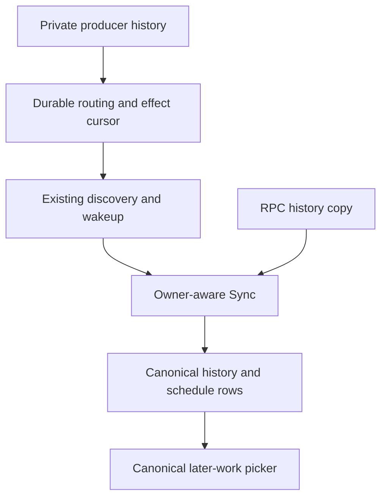
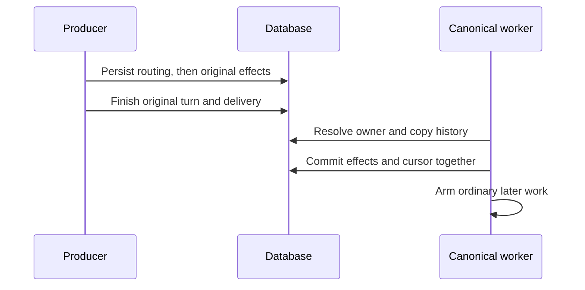
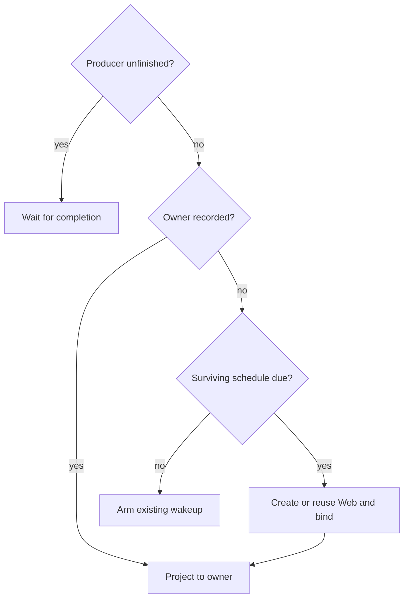
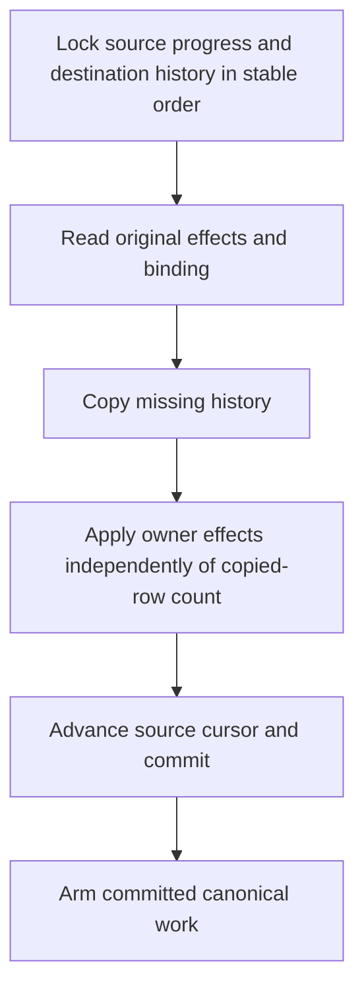

# Canonical Scheduled Messages - Plan

## Goal Capsule

- **Objective:** Scheduled follow-ups appear and continue in the conversation people can use, rather than disappearing into a private cron or MCP run.
- **Means:** Durable producer-to-canonical handoff through the existing Sync and later-work paths (KTD1-KTD5).
- **Authority:** Product requirements govern behavior; technical decisions govern implementation within those requirements. `AGENTS.md` governs repository practice.
- **Execution profile:** One focused change, implemented in dependency order U1 → U2 → U3 → U4. This document authorizes no implementation, commit, push, or PR by itself.
- **Stop conditions:** Stop if ownership cannot be established without guessing, if implementation needs a separate scheduler, or if required checks or source budgets fail.
- **Handoff:** An authorized implementer completes local verification; shipping requires separate authorization.

---

## Product Contract

### Summary

Run scheduled prompts in their producer's canonical conversation. Recover pending handoff after restart. For an originally silent cron with no destination, create a web-only conversation when its first surviving schedule becomes due.

### Problem Frame

Private cron scheduling can run in the hidden producer because `runTurn` drops `RequireOutputDecision`. Fixing that flag alone leaves schedules as history entries that startup never discovers after producer completion. Sync also treats each new history destination as permission to recreate scheduled effects.

### Key Decisions

- **Canonical execution, not redirected private output.** Governs R1, R4. The destination's history and selected agent must actually run the prompt.
- **Web-only fallback for silent cron.** Governs R2, R3. (session-settled: user-directed — chosen over creating a Slack thread: the user selected a web session with no Slack delivery.)
- **Silence applies to the original report, not future work.** Governs R2, R6. (session-settled: user-directed — chosen over suppressing schedules after a silent cron: future scheduled work must still run.)

### Requirements

**Ownership and destination**

- R1. A scheduled prompt created in a Private Producer Conversation executes in its canonical conversation, never in the producer.
- R2. An originally silent cron without a canonical destination creates or reuses a web-only canonical conversation when its first surviving schedule becomes due; it does not post to Slack.
- R3. Later schedules and recurring occurrences from that producer reuse the established canonical destination across restart.
- R4. Explicit destinations and previously delivered cron destinations retain their own history, selected agent, and connector routing.

**Durability and replay**

- R5. Pending handoff survives completion of the producer and restart before Sync, independently of a live caller or active-turn row.
- R6. Canonical creation waits until the producer finishes and delivery settles; silence does not cancel pending schedules.
- R7. Repeated or alternate-destination Sync copies history without reapplying consumed schedule/reset effects, including onward copies of already-synced history.

**Existing contracts**

- R8. Keep existing scheduled System prompt framing, due times, recurring cadence, mixed later-work ordering, and schedule/reset entry order.
- R9. Keep the producer's history separate; Sync does not replace canonical history or route subsequent canonical replies back into the producer.
- R10. Keep the existing scheduling/reset tools and their input/output contracts; no new public scheduling API is required.
- R11. If a completed producer's handoff fails temporarily, retry automatically through the existing timer while its worker runs; preserve pending work and stop retries when the worker stops. (Added during implementation with explicit user approval.)

### Acceptance Examples

| Example | Action | Expected outcome | Covers |
|---|---|---|---|
| AE1 | MCP producer X schedules for existing Y; shutdown precedes caller Sync | Restart discovers X; due work uses Y's history and current agent | R1, R4, R5, R9 |
| AE2 | Silent cron X schedules two follow-ups | No automatic canonical before due; first due work creates `web:X`; both execute there with zero Slack posts | R2, R3, R6 |
| AE3 | Cron publishes a report before its schedule is due | Follow-up runs in that report's established Slack conversation | R1, R3, R4 |
| AE4 | Web copies X's history before canonical ownership is resolved | The copy neither steals ownership nor prevents later effect application to the actual owner | R6, R7 |
| AE5 | X's one-shot finishes in Y; then X→Z or Y→Z Sync runs | Z receives history, but no schedule is rearmed and no reset is replayed | R7 |
| AE6 | Delay expires while X is still producing or delivering | Work waits for X to finish, then joins the canonical later-work order | R6, R8 |
| AE7 | The first completion or due-time handoff fails; the dependency recovers | Work runs canonically without restart or another manual attempt; retries stop with the worker | R11 |

### Scope Boundaries

This change covers ownership, canonical creation/reuse, handoff recovery, selected-agent preservation, and Sync effect replay. Ordinary non-private scheduling remains on its existing path.

#### Deferred to Follow-Up Work

- Concurrent claims executing the same one-shot or recurring occurrence.
- Recurring admission failure advancing due time without recording the occurrence.
- Failed reset unparking queued work while leaving schedules intact.
- Retention deleting a conversation while retaining its schedules.
- Repair of ambiguous, already-stranded pre-upgrade producer intents whose delivery/consumption facts no longer exist.

These remain known defects; this plan does not promise globally exactly-once scheduled execution.

---

## Planning Contract

### Key Technical Decisions

- KTD1. **Retain producer routing and effect progress in existing durable conversation state.** Add backend-private `producer_inbound_json` and `producer_effects_through_id` to `managed_conversations`. Reuse the existing inbound type for provenance and its `SyncDestination` for the binding; retain progress after one-shot rows disappear. Persist private routing alongside request activation. This adds two persisted values, not an effect ledger or parallel request type (R3, R5, R7).
- KTD2. **Bind only through authorized destination resolution.** The original explicit destination establishes ownership; successful original cron report delivery establishes its Slack destination; an unbound completed cron resolves to stable `web:<source>` at its first surviving due time. Arbitrary Sync cannot establish or replace ownership. Serialize binding with existing database locks, not a new process mutex (R1-R7).
- KTD3. **Separate history insertion from effect application.** Sync copies history to any requested destination, but applies only original, unapplied producer effects to the recorded owner. Apply effects even when history insertion adds zero rows. Commit schedule/reset effects and source progress together; arm timers after commit. Already-synced entries never become new effects through onward Sync (R5, R7-R9).
- KTD4. **Extend existing discovery and wakeup.** Discover original producer effects beyond the cursor after producer completion, apply resets in entry-ID order, and arm the earliest surviving schedule without an executable private schedule row. Restore that wakeup at startup and reevaluate it at completion. Once bound, project effects into the canonical's ordinary later-work pipeline (R1, R5, R6, R8).
- KTD5. **Reuse the existing Web creation policy.** Use the stable ID and insert-if-absent semantics of RPC cron-to-Web creation. A newly created session uses that path's loaded-agent selection policy; an existing session keeps its selected agent. Scheduled inbounds carry no producer `SyncDestination`, cron decision mode, or inherited channel reply target (R2-R4, R9). (session-settled: user-directed — chosen over lazy Slack creation: implement the web-only choice governing R2, R3.)
- KTD6. **Preserve recoverable work without replaying legacy history blindly.** Stop old writers before the schema/code cutover. Preserve existing executable schedules and recover routing from unfinished private requests. For those requests, use `history_anchor_id` and the known owner's synced-entry provenance to retain provably unapplied original effects and exclude effects already projected there. Set progress only through a proven handled prefix; never baseline past a pending effect. Other pre-upgrade history receives a non-replay baseline at its highest original effect ID. Ambiguous historical orphans require separate repair (R5, R7).
- KTD7. **Retry handoff without a new retry service.** Failed completion and due-time attempts use the existing timer with a one-second delay. Completion retains original request provenance so even a failed first routing read can retry; producer timers retry their own errors, without changing ordinary schedule-claim retries. Recoverable legacy schedules materialized in the private producer move transactionally to the owner after completion, keeping their IDs, due times, and cadence before resumed effects apply (R1, R5, R8, R11). (session-settled: user-directed — automatic live retries were approved after examples explaining the restart-only alternative.)

### High-Level Technical Design

These sketches show responsibilities and sequencing, not prescribed helpers or signatures.

**Components and data flow**

**Handoff protocol**

**Persisted lifecycle**

```mermaid
stateDiagram-v2
  [*] --> Producing
  Producing --> PendingHandoff: producer and delivery finish
  PendingHandoff --> Bound: explicit or delivered owner; otherwise due Web fallback
  Bound --> Projected: effects and progress commit
  Projected --> PendingHandoff: new original effects
  Projected --> Projected: restart or repeated Sync
```

**Resolution decisions**

**Execution and flag boundary**

| Path | Execution history | Output decision | Destination |
|---|---|---|---|
| Original explicit producer | Private | Existing caller contract | Explicit binding |
| Original destination-less cron | Private | Required | Original report may establish Slack |
| Silent fallback handoff | No model run | None | Stable Web binding |
| Due canonical schedule | Canonical | Ordinary scheduled contract | Canonical connector only |
| Alternate history Sync | No model run | None | History-only copy |

**Transaction layout**

### Risks and Implementation Constraints

- `beginStateTx` begins a transaction but does not serialize it. Use consistent source/destination lock ordering and read effect progress under that lock; do not load a stale effect list before locking.
- An early Web history copy must not reserve ownership while the original report is still delivering. Existing root journaling survives until `closeTurn`; persist the binding before that close, without new Slack keys or connector changes.
- Web agent selection currently consults the cron's current definition/channel, filters unloaded agents in configured order, and otherwise uses sorted loaded agents. Share that existing policy at a dependency-correct location if needed; do not silently substitute the producer agent. Failure to resolve/create/Sync leaves effects pending, without advancing progress.
- Startup must use the canonical conversation's persisted agent, not the stale agent stored with a schedule. Retention can still remove required history or ownership state; its independent repair is deferred.
- Reuse existing types, database serialization, timers, and workers. Add no polling service, callback injection, process mutex, context-bearing struct, or scheduling framework. Apply the Go standards in `AGENTS.md` to actual changed hunks throughout implementation.

### Source Anchors

- `internal/rocketclaw/backend/bridge.go`: live schedule/reset tools, `activeReply` construction, scheduled System prompts, `postCronRoot`, and later-work admission.
- `internal/rocketclaw/backend/conversations.go`: insert-if-absent creation and current destination-local history/effect deduplication.
- `internal/rocketclaw/backend/store_dao.go`, `internal/rocketclaw/backend/thread_bridges.go`, `internal/rocketclaw/backend/app.go`: turn close, startup discovery, and scheduled bridge selection.
- `internal/rocketclaw/frontend/rpc/server.go`: `agentChoices` and stable cron-to-Web creation; `cmd/rocketclaw/cron.go` and `cmd/rocketclaw/mcp.go`: separate RunTurn/Sync callers.
- `docs/solutions/logic-errors/saved-queue-never-started-after-restart.md`: durable work needs startup discovery through ordinary workers, not a competing replay runner.

---

## Implementation Units

### U1. Retain producer routing and durable handoff progress

- **Goal:** Make completed producer work discoverable without replaying legacy consumed effects.
- **Requirements:** R3, R5, R7; KTD1, KTD6.
- **Files:** `internal/rocketclaw/backend/store.go`, `internal/rocketclaw/backend/store_dao.go`, a migration after `internal/rocketclaw/backend/migrations/025_copy_producer_session_tags.sql`, and `internal/rocketclaw/backend/store_schema_test.go`.
- **Approach:** Save routing within private request activation, preserve established bindings on later turns, and expose pending original effects through existing storage operations. Scope added fields to producers. Apply KTD6's migration boundary using existing active-request history anchors and authoritative owner-copy provenance.
- **Execution note:** Add a narrow real-store regression before wiring consumers; use existing PostgreSQL fixtures.
- **Test scenarios:** A completed producer with no active row retains routing and new effects across reopen; a later private turn cannot replace its owner; migration preserves old scheduled rows and prevents legacy effect replay. Upgrade an unfinished explicit producer after a journaled scheduling call but before Sync: replay reuses the tool result, and the pending effect still projects once after completion. Already-projected effects are not recreated; new post-migration effects remain discoverable.
- **Verification:** Targeted store/schema tests and U1 diff review against the Go standards.

### U2. Give Sync one durable effect owner

- **Goal:** Make history copying safe across destinations while preserving pending effect application.
- **Requirements:** R4, R7-R10; KTD2, KTD3.
- **Files:** `internal/rocketclaw/backend/conversations.go`, `internal/rocketclaw/backend/bridge.go`, `internal/rocketclaw/backend/runtime_test.go`, and storage operations from U1.
- **Dependencies:** U1.
- **Approach:** Separate copied-history bookkeeping from original-effect progress. Bind explicit and delivered destinations through their existing activation/delivery paths. Project ordered schedule/reset effects transactionally under stable database locks.
- **Test scenarios:** Extend `TestRuntimeProducerKeepsDestinationUntilSync` for repeated Sync, early history-only copy followed by owner application, consumed X→Z, onward Y→Z, and schedule/reset/schedule ordering. A projection failure rolls back both effects and cursor. Existing history and selected agent survive owner binding.
- **Verification:** Targeted producer/Sync tests with `-race`; retain `TestRuntimeRecordsExplicitConversationsWithoutResettingSelection`.

### U3. Resolve due work into the canonical execution path

- **Goal:** Recover handoff and execute due work canonically, including the silent Web fallback.
- **Requirements:** R1-R6, R8, R9, R11; KTD2, KTD4, KTD5, KTD7.
- **Files:** `internal/rocketclaw/backend/bridge.go`, `internal/rocketclaw/backend/thread_bridges.go`, `internal/rocketclaw/backend/app.go`, relevant storage operations, `internal/rocketclaw/backend/active_turn_test.go`, `internal/rocketclaw/backend/thread_bridges_test.go`, and `internal/rocketclaw/backend/bridge_test.go`. Touch `internal/rocketclaw/frontend/rpc/server.go` only if sharing its existing agent-choice policy is necessary.
- **Dependencies:** U2.
- **Approach:** Preserve `RequireOutputDecision` in real request setup. Reevaluate pending producer effects after completion and at startup; defer unresolved creation until due. Create/reuse the Web canonical, bind, and Sync before its picker admits work. Ensure scheduled startup reads the persisted canonical selection.
- **Execution note:** Reproduce through a real model tool call, not manually seeded `activeReply`; existing scratch probes describe defects and must not be copied as desired-behavior assertions.
- **Test scenarios:** Add one narrow live-tool silent-cron regression: no automatic session before due, canonical history present before the scheduled model call, stable Web ID, correct agent, and zero Slack roots. Extend restart tests for producer-complete/before-Sync, due-but-producing, binding-before-projection, projection-before-arming, and consumed-one-shot restart. Two pending schedules and recurring work reuse the owner. Creation/Sync failure preserves pending progress. Extend `TestResumedCronRowPostsRootOnce` to assert binding survives close/restart without another root or selection reset.
- **Verification:** Targeted backend tests with `-race`; separately check canonical execution history, System prompt framing, mixed queue order, and Web/Slack outbound routing.

### U4. Verify public surfaces and document the behavior

- **Goal:** Prove the shared fix without widening scheduling or routing contracts.
- **Requirements:** R1-R10; KTD5.
- **Files:** `cmd/rocketclaw/mcp_test.go`, `cmd/rocketclaw/cron_test.go`, `internal/rocketclaw/frontend/rpc/server_test.go`, existing backend regression tests, and `README.md`.
- **Dependencies:** U3.
- **Approach:** Update any existing MCP test that expects delayed private execution. Retain Web stable-ID, default-agent, and reopening coverage. Clarify the cron/scheduling section in `README.md`, especially silent follow-ups creating Web rather than Slack.
- **Test scenarios:** External MCP delayed work uses the canonical's selected agent/history; visible cron follow-up retains its Slack thread; Web opening before handoff stays history-only until authorized binding; reopening does not rerun cron, reset selection, or rearm effects.
- **Verification:** Full Verification Contract below. No new API or connector test scaffolding is needed.

---

## Verification Contract

During authorized implementation, keep all scratch files and test temporary directories under repository `.tmp/`.

1. Extend existing targeted tests first; run affected backend, RPC, and command packages with `-race`.
2. Inspect actual changed Go hunks for the standards in `AGENTS.md`, then run `gofmt` on touched Go files.
3. Run `go test ./...`, `make lint`, and `make test` from repository root. Inspect changes made by lint/build tools; do not discard unrelated user work.
4. Run `make check-cloc-budget`; preserve all configured budgets and RocketClaw's coverage rule: coverage must not decrease below its 90.0% stability threshold, as enforced against the baseline by its Makefile. Do not hide production code in excluded paths.
5. Repeat the touched-diff standards pass after tools modify files. Verify queue order, prompt framing, delivery/silence, canonical agent/history, and outbound routing as separate assertions.

Existing targeted investigation results are not proof of this planned behavior; full repository verification has not run. If a required check is unavailable or fails, report it rather than declaring completion.

---

## Definition of Done

- U1-U4 pass their behavioral checks and the full Verification Contract.
- AE1-AE7 hold, including recovery with no active producer row and no live caller, plus automatic live handoff retries.
- History copies cannot grant new effect ownership or replay consumed one-shots/resets.
- Original silent cron output remains private; its due follow-up is visible in Web, with no Slack delivery.
- No abandoned implementation, defensive guards, alternate scheduler, or unnecessary public abstractions remain in the diff.
- README impact is addressed by the scheduling/cron clarification; deferred claim, reset-failure, legacy-repair, and retention defects remain explicitly outside this change.
