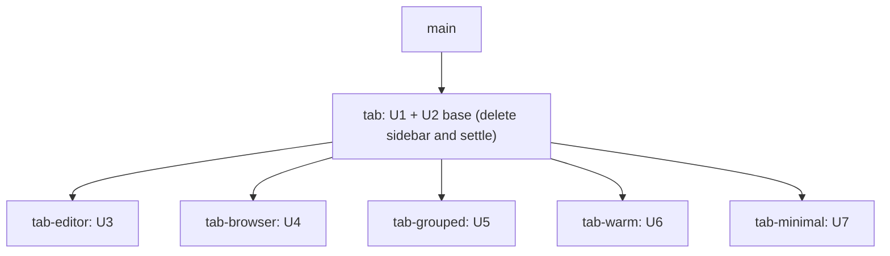
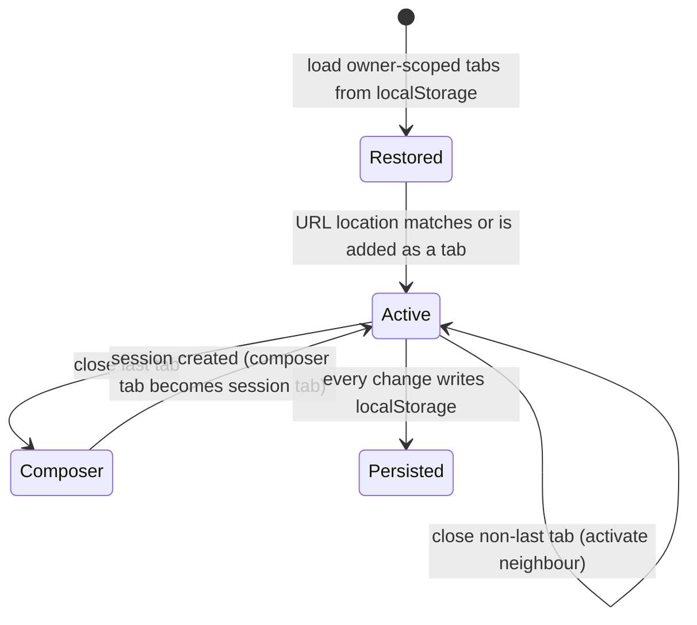

# Web Tabs Replace the Sidebar - Plan

## Goal Capsule

- **Objective:** RocketClaw web users move between sessions and pages (Search, Cron, Agents, Skills, Settings) through editor-style tabs that survive a browser reload and can sit on top or on the left, and the user can compare five competing tab designs side by side before choosing one.
- **Means:** one shared base change deletes the left sidebar and all settle, snooze, and auto-settle behavior (KTD1, KTD2); five sibling changes stacked on it each implement tabs around a different thesis (KTD9).
- **Authority:** the user's request, then this plan's Requirements, then KTDs, then unit Approach text. `AGENTS.md` coding, test, CLOC, and verification rules bind every unit.
- **Stop conditions:** stop and report if removing settle requires a destructive database migration, if a variant cannot meet R1-R8 without exceeding the TypeScript CLOC hazard line, or if the base breaks a retained capability in R11 that cannot be restored without reintroducing the sidebar.
- **Execution profile:** U1-U2 land first as the base change. U3-U7 are independent of each other and may run in parallel, each in its own JJ workspace parented on the base.
- **Finishing:** six pull requests. The base targets `main`. Each variant targets the base bookmark. Merging and choosing a winner stay with the user.

---

## Product Contract

### Summary

Delete the RocketClaw web left sidebar and the settle, snooze, and auto-settle feature end to end. Then build five competing tab implementations on the shared base so the user can run and compare them. Every variant shows sessions and pages as tabs, remembers tabs in browser storage, and lets the user place the strip on top or on the left.

### Problem Frame

The web client navigates through a left sidebar that lists every unsettled session. Settle, snooze, and a server-side auto-settle cutoff exist mainly to keep that list short. Pages such as Search and Cron open in the main pane and "close" back to the last chat through a return-to pointer, so only one session or page is reachable at a time. The user wants an editor-style working set instead: a few open tabs mixing sessions and pages, kept per browser, positioned like OpenCode v2's `tabs.layout` horizontal strip or vertical sidebar. The right tab model is not obvious, so the user asked for five competing implementations to judge in practice.

### Requirements

**Tabs (every variant)**

- R1. A tab strip lists open tabs of two kinds: session tabs, whose titles come live from the session list, and page tabs for Search, Cron, Agents, Skills, and Settings. The new-session composer at `/` is also a tab, and creating a session from it turns that tab into the new session's tab.
- R2. Opening a session or page from anywhere shows it in a tab. This covers the palette, search results, in-transcript links, footer buttons, cron links, fork and handoff results, and new chat. If the location is already open in a tab, that tab activates, so no location ever appears in two tabs. Otherwise a tab opens, or a variant whose thesis defines retargeting (KTD9 V1 preview tab, V2 in-tab navigation) shows it in the preview or active tab. The active tab always matches the URL.
- R3. Closing a tab removes it. When the active tab closes, an adjacent tab activates. Closing the last tab lands on the new-session composer. When the composer is the only tab, closing it does nothing.
- R4. The open tabs, their order, and the active tab live in browser `localStorage` scoped to the signed-in owner, and are restored after reload. A deep-link URL wins over the stored active tab and gets a tab.
- R5. Tab placement is `top` or `left`. The user switches it at runtime from the tab strip and from the command palette. The choice is kept in browser storage and applied on reload.
- R6. Tabs are operable by keyboard and screen reader. This means tablist and tab semantics, arrow-key movement, visible focus, and labelled close controls.
- R7. On narrow screens the strip stays usable. Top placement scrolls horizontally. Left placement falls back to top below the `md` breakpoint.
- R8. A session tab shows when that session's turn is running.

**Deletion (base)**

- R9. The left sidebar UI is gone. That includes the desktop session list and its resize handle, the stored `sidebar-width`, the show/hide button, `Cmd/Ctrl+B`, and the palette's Hide/Show Sidebar command. It also includes the mobile Sessions sheet, its swipe gestures, and the page-title Sessions trigger.
- R10. Settle, snooze, and auto-settle are gone end to end:
  - the UI actions, the Settled page and its `/settled` route, the `is:settled`/`is:unsettled` search filters, and the Snooze dialog and command
  - the `SettleSession` RPC and the settle/snooze wire fields
  - the reopen-on-new-entry writes and the auto-settle query
  - the `web.auto_settle_after` setting and its Config page row
  - their dedicated tests and docs
- R11. Everything else that reads the session list keeps working: palette session search, the Search page, session header Name and Pin actions, fork and handoff pickers, and cron links. "Open original conversation" for forked sessions stays reachable.
- R12. Existing config files that still set `web.auto_settle_after` load without error, and the value is ignored.

**Comparison**

- R13. Five independently reviewable variants each satisfy R1-R8 on the same base. Each is organized around a distinct thesis (KTD9), and each documents that thesis and its tradeoffs in the web README.

### Scope Boundaries

- Server-side pin stays. It still orders palette and Search results. A tab-local pin in a variant is a separate, browser-only concept.
- The Search page's own inner search tabs (`search-tabs:<owner>`) stay as they are. A variant may adapt them, but must not remove them.
- The delegation panel and its resizable aside stay.
- Slack behavior is untouched. Settle never reached Slack.
- No server-side storage for tabs. Tab memory is browser-only by request.

#### Deferred to Follow-Up Work

- Drop the `settled`, `reopened_at`, and `snoozed_until` columns with a new migration once a variant is chosen and deployed (KTD2).
- Rename the session-list data owner (`SidebarOwner`, `Sidebar` context, `SidebarSession`, `SidebarSessions`) to sidebar-free names once one tab design wins (KTD3).
- Delete the four losing variants and fold the winner's README section into the main web docs.

### Success Criteria

- The user can check out any of the five variant bookmarks, build it, and use tabs for sessions and pages in both placements, and the tabs survive a reload.
- Each of the six pull requests passes CI. That covers the root `make test` and `make -C internal/rocketclaw/web test`.
- No settle, snooze, or sidebar UI string or code path remains on any of the six bookmarks, apart from the deferred column and data-owner names.

---

## Planning Contract

### Key Technical Decisions

- KTD1. **Shared base plus five stacked variants.** The base change (bookmark `tab`) holds U1-U2. Each variant is a child change of the base with bookmark `tab-<slug>` and its own PR targeting `tab`. Deletion is identical across designs, so stacking makes each variant PR show only its tab mechanism. Five independent full PRs were rejected: they would repeat the deletion five times and conflict with each other.
- KTD2. **Keep the settle columns; add no migration.** The columns `settled`, `reopened_at`, and `snoozed_until` stay in `managed_conversations` and the code stops reading and writing them. Every column has a default or is nullable, so inserts that omit them still work. Keeping them lets `main` and all six bookmarks run against the same database while the user compares variants. A drop would be irreversible data deletion and would make rollback to `main` fail on the missing columns. The migration-ledger hazard is documented in `docs/solutions/runtime-errors/deployment-binary-missing-live-migrations.md`. Existing migration files `008`, `012`, and `017` stay unchanged.
- KTD3. **Keep the session-list data owner and delete only sidebar UI.** `SidebarOwner` and the `Sidebar` context are kept with their names, along with the IndexedDB snapshot (`session-list.ts`), the `ListSessions` stream, and the history-clear broadcast. They feed the palette, Search, header actions, pickers, and tab titles. Renaming is deferred to keep the base diff reviewable.
- KTD4. **Settle leaves the wire with reserved tags.** In `internal/rocketclaw/web/proto/web.proto`, the fields `Session.settled` (6), `Session.snoozed_until` (12), `ConfigView.web_auto_settle_after` (10), and `UpdateSessionRequest.snoozed_until` (5) become `reserved`, following the file's existing practice. `SettleSession` and its messages are deleted. Regenerate `web.pb.go` and the protocol SHA through the `go:generate` directive in `internal/rocketclaw/frontend/rpc/server.go`. The SHA change makes open clients reload, which is expected.
- KTD5. **`SidebarSessions` loses its cutoff parameter and the settle CTEs.** It keeps the existing filters: cron, one-off-cron, and private conversations are excluded, and conversations without history are omitted. Ordering stays pinned first, then most recent, then ID. `protocol.Conversation.Settled`, `ThreadState.Settled`, `SetConversationSettled`, `SidebarSession.SnoozedUntil`, the snooze argument of `UpdateConversationDetails`, the reopen writes in `appendSessionEntryDB` and `SyncConversation`, and `WebConfig.AutoSettleAfter` with `SettleAfter()` are all deleted. Config decoding uses `json.Unmarshal` without `DisallowUnknownFields`, so R12 needs no code.
- KTD6. **Header actions absorb the row menu's survivors.** The row-only "Open original conversation" action joins the session header actions next to Name and Pin. This keeps R11 true once rows disappear.
- KTD7. **Shared tab-storage contract.** Every variant stores tabs in `localStorage` under its own owner-scoped key, `tabs-<slug>:<owner>` (for example `tabs-editor:<owner>`), following the existing `search-tabs:<owner>` pattern. All five variants run on the same origin while the user compares them, and per-variant keys stop one variant from misreading another's stored shape. Stored entries are locations (session ID or page path), never transcript content. Titles and running state come live from the session list. If a stored session is missing from the list, its tab title falls back to `sessionLabel`. Stored JSON that fails to parse, or parses but does not match the variant's shape, resets to a single tab for the current URL. Placement is a per-browser preference under one global key, like `theme`, because every variant uses the same `top`/`left` values. Variants may extend the stored shape.
- KTD8. **Placement default is top.** Top matches OpenCode v2's default `tabs.layout: horizontal`. Left renders as a vertical strip in the slot the sidebar used, and each variant chooses its width behavior. Both placements share one tab model. Only the strip's orientation and position change.
- KTD9. **Five theses, one per variant.** Each variant must differ on its axis, not just in styling:

| Variant | Bookmark | Thesis axis | Defining mechanisms |
|---|---|---|---|
| V1 Faithful editor | `tab-editor` | Editor semantics | Preview tab replaced by the next opened item until promoted (double-click, sending a message, or pin). Pinned tabs stay sticky at the start. Context menu: close, close others, close to the right, close all, pin, move strip. Middle-click close, drag reorder, running dot. |
| V2 Browser workspace | `tab-browser` | Per-tab history | Each tab owns a back/forward stack. In-tab navigation replaces the tab's location unless the target is already open in another tab (R2). Modifier-click or middle-click opens a background tab. "+" opens the composer. A reopen-closed-tab stack is persisted. Tab lists sync across browser windows through the `storage` event, and each window keeps its own active tab. |
| V3 Grouped rich tabs | `tab-grouped` | Information density (OpenCode v2 parity) | Left placement is a grouped panel (Pinned, Sessions, Pages) with status, agent, age, and preview lines and collapsible groups. Top placement is compact. An indicator setting, `status` or `numbers`, mirrors OpenCode's `tabs.indicators`. Cmd/Ctrl+Alt+digit jumps to a tab. |
| V4 Warm tabs | `tab-warm` | State retention | Open tabs stay mounted. Each session tab keeps its own DOM, scroll, and composer state up to an LRU cap, and older ones unmount. Only the active session tab holds a live stream. Pages reuse the existing warm `TabPane` approach. Switching tabs never reloads full history or resets scroll. |
| V5 Minimal | `tab-minimal` | Simplicity | Every navigation implicitly opens or focuses a tab. Tabs offer only close and the placement toggle: no menus, drag, or previews. The smallest net TypeScript diff of the five. |

- KTD10. **Use stacked variants, not `ce-bakeoff`.** Bake-off produces non-executable artifacts and selects a winner. The user asked for runnable implementations to compare personally, so each variant is built and verified, and no winner is chosen.
- KTD11. **Page close semantics.** The base keeps today's Escape and close-button behavior for pages, which returns to the last chat through `tabReturnTo`, so the base stays usable on its own. In every variant, closing a page means closing its tab (R3), and the `tabReturnTo` pointer is deleted once nothing reads it.
- KTD12. **Narrow-screen navigation in the base.** With the mobile sheet gone, the base relies on the existing footer: New session, Search, and the palette. Variants add the strip on top of that (R7).

### Assumptions

- "All the auto-settle logic" covers manual settle, snooze, and auto-settle together. All three exist to hide rows from the sidebar, and snooze is a timed settle.
- Home (the new-session composer) counts as a page tab, the way a code editor treats an untitled file.
- A browser-only tab set may diverge across devices, which is acceptable because the user asked for browser memory.
- Keyboard shortcuts avoid combinations browsers or the OS reserve: `Ctrl+Tab`, `Cmd/Ctrl+W`, `Cmd/Ctrl+T`, `Ctrl+PageUp/PageDown`, `Cmd/Ctrl+digit`, and plain `Alt+digit` (Linux browsers switch tabs with it, and macOS types characters with Option+digit). Variants follow the app's existing `Cmd/Ctrl+Alt+<key>` pattern (used for new chat) when they need a modifier binding.
- The Settled page's purpose, finding hidden chats, is covered by Search, which lists every session.

### High-Level Technical Design

The change stack, as it lands in JJ:

The tab model every variant shares, with its own extensions on top:

Runtime ownership after the base: `App` provides the query client and `SidebarOwner` as today. `SessionApp` owns the route, the palette, drafts, and the main pane. Variants insert a tab provider between `SidebarOwner` and `SessionApp`, or inside `SessionApp`. That provider reads session rows for titles and running state, writes `localStorage`, and renders the strip in either the top slot or the left slot.

### Risks

- **Browser test churn.** `session-list.browser.test.ts` drives most retained data-owner behavior (snapshot restore, stale state, owner switch, history clear) through sidebar rows. U2 must move those assertions to the palette or the Search page rather than delete them. Only sidebar-UI and settle scenarios are deleted.
- **Function extraction by name.** `session-list.test.ts` extracts `slackSession`, `sessionLabel`, `typedPrefix`, `matchesSession`, `sessionSearchTerms`, `sessionMatchesSearch`, and `compareSessions` from `ui.tsx` by name. They must stay top-level declarations in `ui.tsx`, or the test must be updated.
- **V4 complexity.** V4 replaces the single re-keyed `Transcript` with several mounted ones. The likely breakage points are the new-chat creation handoff (`conversation.created`), draft persistence, and the delegation panel's dependence on the active ID. Two singletons also assume one transcript: the shared `SessionCommands.composer` handle and the `#transcript-scroll` lookup in `SelectionQuote`. The web server speaks HTTP/1.1, and each `Transcript` opens a long-lived `/stream` EventSource, so mounting several live streams would exhaust the browser's per-host connection limit (U6).
- **Going back to `main` after a variant.** The base stops writing the settle columns, including the reopen-on-new-entry writes. A session settled on `main` that gets new activity while a variant runs stays hidden in `main`'s sidebar if the user switches back. This is acceptable for comparison, and resolves once a variant merges.
- **Committed `dist`.** Every bookmark must rebuild and commit `internal/rocketclaw/internal/web/dist` (README "commit dist" rule), and `assets_test.go` checks the SPA paths.
- **CLOC.** TypeScript source is 5445 of a 7500 budget, with the hazard zone starting at 7250. The base should shrink it, and each variant must stay below the hazard line.

### Sources

- `internal/rocketclaw/web/src/ui.tsx`: `SessionApp` shell, `SidebarOwner`, `MobileSidebar`, `ResizableAside`, `SessionList`/`SessionRow`, `useSessionActions`, `sessionSearchTerms`, `SearchTabs` (existing owner-scoped tab storage and `tablist` keyboard pattern), `WarmTabs`/`TabPane`.
- `internal/rocketclaw/backend/store.go`: `SidebarSessions` settle CTEs, `SetConversationSettled`, `UpdateConversationDetails`, the reopen in `appendSessionEntryDB`. Also `backend/conversations.go` (`SyncConversation` reopen, `ListConversations`) and `backend/store_dao.go` (`Thread`).
- `internal/rocketclaw/frontend/rpc/server.go`, `transport.go`, `http.go`; `internal/rocketclaw/web/proto/web.proto`; `internal/rocketclaw/config/config.go`.
- OpenCode v2 settings: `tabs.layout` is `horizontal` or `vertical`, and `tabs.indicators` is `status` or `numbers` (https://opencode.ai/v2/docs/cli/config).
- Prior plans: `docs/plans/2026-09-24-1402-feat-settle-snooze-plan.md`, `docs/plans/2026-09-09-fast-conversation-sidebar.md`, `docs/plans/2026-09-29-1053-feat-web-search-page-plan.md`.

---

## Implementation Units

### U1. Remove settle, snooze, and auto-settle from backend, wire, and config

- **Goal:** No server code, RPC, wire field, or config setting for settle, snooze, or auto-settle remains, and the database schema is unchanged.
- **Requirements:** R10, R12. Governed by KTD2, KTD4, KTD5.
- **Dependencies:** none.
- **Files:**
  - `internal/rocketclaw/protocol/conversation.go`
  - `internal/rocketclaw/backend/store.go`, `backend/store_dao.go`, `backend/conversations.go`, `backend/thread_bridges.go`
  - `internal/rocketclaw/config/config.go`, `internal/rocketclaw/rocketclaw.example.json`
  - `internal/rocketclaw/frontend/rpc/server.go`, `frontend/rpc/transport.go`, `frontend/rpc/http.go`, the regenerated `frontend/rpc/web.pb.go`, and the protocol SHA file
  - `internal/rocketclaw/web/proto/web.proto`
  - Tests: `backend/store_summaries_test.go`, `backend/store_test.go`, `backend/runtime_test.go`, `backend/fork_test.go`, `config/config_test.go`, `frontend/rpc/server_test.go`, `frontend/rpc/http_test.go`, `frontend/rpc/sidebar_test.go`, and the Go-driven web transport tests `internal/rocketclaw/web/src/sidebar-transport.test.ts` and `internal/rocketclaw/web/src/entry-transport.test.ts`
- **Approach:**
  1. Delete the settle fields and functions listed in KTD5, then simplify the `SidebarSessions` SQL to the summarized-conversations projection.
  2. Delete `settleSession`, its route and registration, snooze parsing in `updateSession`, the cutoff computation in `listSessions`, and `WebAutoSettleAfter` in `listConfig`.
  3. Reserve the proto tags (KTD4), then regenerate.
  4. Keep migrations `008`, `012`, and `017`, and add no new migration.
  5. Delete the dedicated tests: `TestSidebarSessionsAutoSettleAndReopen`, `TestSidebarSessionsSnooze`, `TestSessionServiceSettledPersistence`, `TestLoadAutoSettleAfter`, and the settle and snooze sections of `TestRuntimeProducerKeepsDestinationUntilSync` and `TestSessionEntries`. In tests that remain, update the `SidebarSessions` call sites and drop the settled assertions.
- **Patterns to follow:** the `reserved` tags already present in `web.proto`, and the deletion discipline in `AGENTS.md` (remove the field, call sites, docs, and dedicated tests, with no rejection shim).
- **Test scenarios:**
  - `SidebarSessions` returns pinned rows first, then rows ordered by last update descending, then by ID. Cron, one-off-cron, and private conversations stay excluded. These assertions already exist in `TestSidebarSessionsOrderMembershipAndCompleteness` and are kept without the settled field.
  - A session last updated long ago still appears in `SidebarSessions` and carries no settled flag.
  - Appending an entry to a conversation writes no settle-related columns, and the stored row keeps its schema defaults.
  - `config.Load` accepts a config containing `"web": {"auto_settle_after": "1h"}` and returns no error. Covers R12.
  - The existing `ListConfig` and `ListSessions` transport assertions (`entry-transport`, `sidebar-transport`) are updated to the payloads without the removed fields.
  - `UpdateSession` with only a name still succeeds and stores the name.
- **Verification:** `rg -n -i 'settle|snooze' internal/rocketclaw --glob '*.go' --glob '*.proto' --glob '!vendor/**'` finds only the unrelated bridge, revert, and transcript "settlement" and "settled page" uses. Go tests and the transport tests pass.

### U2. Remove the sidebar shell and settle UI from the web client

- **Goal:** The web client has no left sidebar, no settle or snooze UI, and no `/settled` route, and every retained capability in R11 still works.
- **Requirements:** R9, R10, R11. Governed by KTD3, KTD6, KTD11, KTD12.
- **Dependencies:** U1.
- **Files:**
  - `internal/rocketclaw/web/src/ui.tsx`, `src/types.ts`, `src/api.ts`, `app/globals.css` (only sidebar-only rules; keep tokens still used by `FilterPill`, `SearchTabs`, and `SessionSearch`)
  - `internal/rocketclaw/internal/web/assets.go`, `internal/web/assets_test.go`, and the rebuilt `internal/rocketclaw/internal/web/dist/`
  - Tests: `src/session-list.test.ts`, `src/api.test.ts`, `src/session-list.browser.test.ts`, `src/session-commands.browser.test.ts`, `src/search-page.browser.test.ts`, `src/delegations.browser.test.ts` (drop the sidebar half of its resize loop). Every test that locates `#session-sidebar` or the mobile "Sessions" dialog moves to the palette or Search page.
  - Docs: `internal/rocketclaw/web/README.md`, `README.md`, `internal/rocketclaw/frontend/rpc/README.md`, `THEMES.md`
- **Approach:**
  1. Delete `MobileSidebar`, the sidebar branch of `ResizableAside`, the `SessionList`/`SessionRow`/`SessionRowActions` trio, `sidebarOpen` state, `Cmd/Ctrl+B`, the footer show/hide button, the palette Hide/Show Sidebar command and its props, the `PageTitle` Sessions trigger, and `data-sidebar-swipe`.
  2. Delete the settle and snooze items in `useSessionActions`, the snooze mode of `NameSessionDialog` and the `"snooze"` command mode, the Settled meta in `SessionRowContent` (which stays, because the palette uses it), the `is:settled`/`is:unsettled` tokens and suggestions, "Sessions: List Settled", the `/settled` route, and the `web.auto_settle_after` Config row.
  3. Add "Open original conversation" to the header actions (KTD6).
  4. Remove helpers and imports left unused.
- **Execution note:** Before deleting `session-list.browser.test.ts` scenarios, classify each one. Sidebar-UI and settle scenarios are deleted. Snapshot, stale, owner-switch, and history-clear scenarios are moved to observe rows through the palette (`Cmd+P`) or the Search page.
- **Patterns to follow:** `search-page.browser.test.ts` for mocked-API page tests, and the palette assertions in `session-commands.browser.test.ts`.
- **Test scenarios:** Deleted behavior gets no absence tests (AGENTS.md); the Verification grep proves the deletion. `assets.go` and `assets_test.go` drop `/settled` from the SPA path list.
  - The palette `Cmd+P` lists sessions restored from the IndexedDB snapshot before the stream completes, and refreshes when the stream completes. This is moved from the sidebar snapshot tests.
  - After an owner switch, sessions of the previous owner disappear from the palette. A history-clear broadcast removes that session's preview from palette rows. Both are moved from sidebar tests.
  - The session header shows Name and Pin. A forked session's header offers "Open original conversation", which navigates to the parent session.
  - The Search page still lists and filters sessions, and its inner search tabs still persist.
  - The page Close button and Escape on a page still return to the last chat (KTD11).
- **Verification:** `rg -n -i 'settle|snooze|sidebarOpen|MobileSidebar|session-sidebar' internal/rocketclaw --glob '!*.sql' --glob '!dist/**' --glob '!vendor/**' --glob '!docs/**'` finds only the deferred data-owner names (KTD3) and the unrelated bridge, revert, and transcript "settlement" and "settled page" uses. Web unit and browser tests pass, the TS CLOC count drops, `dist` is rebuilt, and the READMEs no longer describe the sidebar or settle.

### U3. V1 Faithful editor tabs

- **Goal:** Tabs behave like code-editor tabs (KTD9 V1) and satisfy R1-R8.
- **Requirements:** R1-R8, R13. Governed by KTD7, KTD8, KTD9, KTD11.
- **Dependencies:** U1, U2.
- **Files:** `internal/rocketclaw/web/src/ui.tsx` and a new tab module in `src/` if it keeps `ui.tsx` smaller, `src/tabs.browser.test.ts`, `internal/rocketclaw/web/README.md` (Tabs section), the rebuilt `dist`.
- **Approach:**
  - Opening a session from the palette or Search makes it the preview tab, shown in italics, and the next preview replaces it.
  - Double-clicking the tab, sending a message, or pinning promotes it.
  - Pinned tabs stay first. In top placement they render as icon only.
  - The context menu uses `@base-ui/react/menu` like the existing session menu. It also opens from a focused tab with Shift+F10 or the ContextMenu key and from an overflow button on the active tab for touch. Pin tab, Close others, Close to the right, and Close all are also palette commands.
  - Drag reorder uses pointer or HTML5 drag events, with a keyboard alternative.
  - A running session shows a dot in place of the close button, like an editor's unsaved-changes indicator. The close button replaces the dot on hover, on focus within the tab, on the active tab, and always under `(hover: none)`.
  - "Move tabs to left/top" lives in the context menu and the palette.
- **Test scenarios:**
  - Opening session A then session B from the palette leaves one preview tab showing B. Double-clicking B and then opening A yields two tabs.
  - Sending a message in a preview tab makes it permanent.
  - Pin A, then "Close others" on B keeps A and B and closes the rest. "Close to the right" closes only later tabs.
  - Middle-click on a tab closes it, and closing the active tab activates its right neighbour, or the left one at the end.
  - Dragging tab C before tab A reorders the tabs, and the order survives reload.
  - Reload restores tabs, pins, preview state, and the active tab. A deep link to a session that is not open adds a tab and activates it.
  - "Move tabs to left" from the context menu renders a vertical tablist with `aria-orientation="vertical"`, and the choice survives reload.
  - Arrow keys move focus between tabs, Enter activates, and the close control has an accessible name.
  - At 375px width, top placement scrolls horizontally, and stored left placement renders on top.
  - A running session's tab exposes a "Turn running" indicator, and its close control is reachable by keyboard focus and visible at 375px width.
  - Shift+F10 on a focused tab opens the context menu, and choosing Pin pins it.
  - Corrupt JSON under the tabs key loads a single tab for the current URL.
- **Verification:** All scenarios pass in `src/tabs.browser.test.ts`, the README section states the thesis and tradeoffs, and TS CLOC stays below the hazard line.

### U4. V2 Browser-workspace tabs

- **Goal:** Tabs behave like browser tabs with their own history (KTD9 V2) and satisfy R1-R8.
- **Requirements:** R1-R8, R13. Governed by KTD7, KTD8, KTD9, KTD11.
- **Dependencies:** U1, U2.
- **Files:** `internal/rocketclaw/web/src/ui.tsx`, `src/navigation.tsx` (when per-tab history needs a hook), an optional new tab module, `src/tabs.browser.test.ts`, the README Tabs section, the rebuilt `dist`.
- **Approach:**
  - Plain navigation replaces the active tab's location and pushes onto that tab's stack. If the target is already open in another tab, that tab activates instead (R2).
  - A modifier-click or middle-click on an in-app `Link` opens a background tab.
  - "+" opens a composer tab.
  - Per-tab back and forward controls sit beside the strip. The browser's own Back and Forward follow the URL history, and the location they reach is applied with the same R2 rule.
  - Closed tabs go on a persisted, bounded stack, and a palette command reopens the last one.
  - A `storage` event listener applies tab lists written by other windows of the same owner: members, order, and per-tab locations and history. Each window keeps its own active tab, which comes from its URL and is never taken from a `storage` event.
- **Test scenarios:**
  - In tab 1, opening session A and then Search, with Search not open elsewhere, keeps a single tab whose location is Search. Tab back returns it to A.
  - With Search open in tab 2, navigating to Search from tab 1 activates tab 2 and leaves tab 1 unchanged.
  - Ctrl or Cmd-clicking a search result opens a background tab and leaves the active tab unchanged.
  - "+" opens the composer tab, and sending creates a session in that same tab.
  - Closing a tab and running "Reopen closed tab" restores it with its history.
  - A second page of the same origin that writes a new tab list updates the first page's strip without reload. Activating a tab in one window does not change the other window's active tab or URL.
  - Reload restores tabs, each tab's current location, and the active tab. A deep link adds a tab.
  - The top/left toggle, keyboard semantics, narrow fallback, running indicator, and corrupt-storage reset behave as in U3's equivalents.
- **Verification:** As in U3.

### U5. V3 Grouped rich tabs (OpenCode v2 style)

- **Goal:** Tabs favor information density and OpenCode v2 parity (KTD9 V3) and satisfy R1-R8.
- **Requirements:** R1-R8, R13. Governed by KTD7, KTD8, KTD9, KTD11.
- **Dependencies:** U1, U2.
- **Files:** `internal/rocketclaw/web/src/ui.tsx`, an optional new tab module, `src/tabs.browser.test.ts`, the README Tabs section, the rebuilt `dist`.
- **Approach:**
  - Left placement renders groups: Pinned (tab-local pins), Sessions, and Pages.
  - Each session tab shows a title line plus a meta line with agent, relative age, and running state, reusing `SessionRowContent` where practical.
  - Groups collapse, and the collapsed state persists.
  - Top placement renders compact chips. An indicators setting (`status` or `numbers`) chooses between a status icon and a 1-9 number badge.
  - Cmd/Ctrl+Alt+digit activates the Nth tab in the current placement's visual order, skipping tabs in collapsed groups. Number badges follow that same order.
  - Placement and indicators are switchable from the strip and the palette.
- **Test scenarios:**
  - In left placement, opening two sessions and Cron shows two items under Sessions and one under Pages.
  - Collapsing Pages hides its items, and the collapse survives reload.
  - A session's meta line shows its agent and relative age, and running sessions show a spinner.
  - Switching indicators to `numbers` shows badges 1..N in top placement, and Cmd/Ctrl+Alt+2 activates the second tab.
  - Pinning a tab moves it to the Pinned group, and it persists.
  - Reload, deep link, close-neighbour, keyboard, narrow fallback, and corrupt-storage reset behave as in U3's equivalents.
- **Verification:** As in U3.

### U6. V4 Warm tabs

- **Goal:** Switching tabs preserves each tab's live state (KTD9 V4) while satisfying R1-R8.
- **Requirements:** R1-R8, R13. Governed by KTD7, KTD8, KTD9, KTD11.
- **Dependencies:** U1, U2.
- **Files:** `internal/rocketclaw/web/src/ui.tsx`, an optional new tab module, `src/tabs.browser.test.ts`, the README Tabs section, the rebuilt `dist`.
- **Approach:**
  - Replace the single re-keyed `Transcript` with one mounted `MessageScrollerProvider` and `Transcript` per open session tab, hidden through `TabPane` when inactive.
  - Only the active session tab holds a `/stream` EventSource. The server speaks HTTP/1.1, and browsers allow about six connections per host shared with polling and RPCs. Inactive warm tabs keep their DOM, scroll, and draft. They close their stream, and catch up through the existing history-delta refresh when they activate again. Background running state comes from the session list, the same source as R8.
  - Only the active tab's composer registers the shared `SessionCommands.composer` handle, and `SelectionQuote` uses a ref to its own transcript viewport instead of `#transcript-scroll`.
  - Cap mounted session views with an LRU and unmount the oldest past the cap.
  - Generalize the `conversation.created` handoff so a composer tab that creates a session keeps its mounted view.
  - Pages already stay warm through `WarmTabs`. Search gains a warm pane while its tab is open.
  - The delegation panel follows the active tab.
- **Execution note:** Start with a failing browser test that switches between two session tabs and asserts scroll position and composer draft are preserved without a full history reload.
- **Test scenarios:**
  - Scroll session A up, switch to B, then back to A. A's scroll offset is unchanged, and A's transcript was not reloaded from the beginning.
  - With three session tabs open, at most one `/stream` connection is open at a time.
  - With two session tabs mounted, a palette `$` command and the Quote action act on the active tab's transcript and composer.
  - Type an unsent draft in A, switch to B, then back. The draft text is intact.
  - With more open session tabs than the cap, the least recently used one's DOM is unmounted, and activating it again remounts and loads it.
  - Creating a session from the composer tab keeps the same mounted view and turns the tab into a session tab without remounting.
  - A background tab's running indicator updates from the session list. When it activates, its transcript catches up with the messages produced while it was hidden.
  - Reload, deep link, close-neighbour, top/left toggle, keyboard, narrow fallback, and corrupt-storage reset behave as in U3's equivalents.
- **Verification:** As in U3, plus `session-commands`, `long-chat`, `delegations`, and `revert` browser tests still pass with several transcripts mounted.

### U7. V5 Minimal implicit tabs

- **Goal:** Tabs that satisfy R1-R8 with the smallest net TypeScript diff (KTD9 V5).
- **Requirements:** R1-R8, R13. Governed by KTD7, KTD8, KTD9, KTD11.
- **Dependencies:** U1, U2.
- **Files:** `internal/rocketclaw/web/src/ui.tsx`, `src/tabs.browser.test.ts`, the README Tabs section, the rebuilt `dist`.
- **Approach:** One hook watches the pathname, adds the location as a tab if it is missing, and writes `localStorage`. One component renders the strip with close buttons and a placement toggle. A palette command also toggles placement. No preview, pin, menu, drag, or per-tab history.
- **Test scenarios:**
  - Visiting session A, Cron, then session B produces three tabs in visit order, and revisiting A focuses its existing tab.
  - Closing the active tab activates its neighbour, and closing all tabs lands on the composer tab.
  - Reload restores tabs and the active tab, and a deep link adds a tab.
  - The placement toggle switches between top and left and survives reload. Narrow width falls back to top.
  - Tabs have tablist semantics with arrow-key focus and labelled close buttons.
  - Running sessions show the indicator, and corrupt storage resets.
- **Verification:** As in U3. Report the variant's net TS CLOC delta next to the other four in its PR body.

---

## Verification Contract

| Scope | Command or gate | Applies to |
|---|---|---|
| Go formatting | `gofmt -l` on touched Go files is empty | U1, U2 |
| Proto regeneration | `go generate ./frontend/rpc` from `internal/rocketclaw`, then `jj diff --git` shows the expected `web.pb.go` and SHA changes only | U1 |
| Go tests | `go test ./...` at the repo root (needs the local PostgreSQL fixture the suite already uses) | U1, U2 |
| Repo lint | `make lint` at the repo root | all |
| Repo tests | `make test` at the repo root (Go CLOC and coverage gates included) | all |
| Web lint | `make -C internal/rocketclaw/web lint` (oxlint, `tsc --noEmit`, react-doctor) | U2-U7 |
| Web tests | `make -C internal/rocketclaw/web test` (build, bun unit tests, Go-driven browser tests, TS CLOC budget) | U2-U7 |
| Committed assets | `dist` rebuilt with `bun run build` and included in the change | U2-U7 |
| Diff review | the `AGENTS.md` touched-diff standards pass on `jj diff --git` for each bookmark | all |

## Definition of Done

- The base bookmark `tab` contains U1 and U2. Its verification rows pass, and no sidebar, settle, or snooze behavior remains beyond the deferred names in KTD2 and KTD3.
- The five bookmarks `tab-editor`, `tab-browser`, `tab-grouped`, `tab-warm`, and `tab-minimal` each sit directly on the base, implement their unit, and pass every applicable verification row.
- Each variant's README Tabs section states its thesis, its user-visible behavior, and its tradeoffs, so the five can be compared without reading code.
- Six pull requests are open, with the base targeting `main` and each variant targeting `tab`, and CI has decided on each.
- README impact is reviewed for every bookmark. The base updates the sidebar and settle docs, and each variant documents its tabs.
- Abandoned experiments and dead helpers are removed from every diff.
