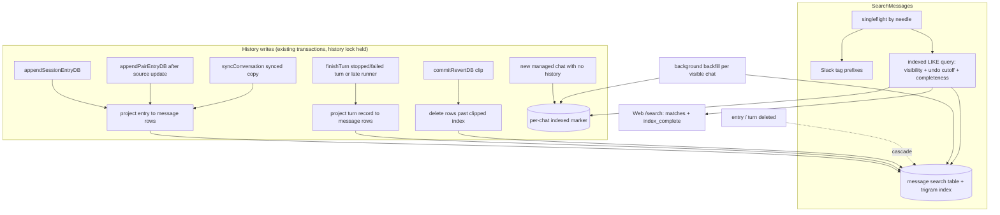

# Indexed Message Search - Plan

## Goal Capsule

- **Objective:** People searching messages on RocketClaw Web `/search` get message results in about a second instead of 35–63 seconds, with the same matches they get today.
- **Means:** a PostgreSQL `pg_trgm`-indexed table of each message's displayed text, kept current with history writes and filled for existing chats by a background job (KTD1, KTD2, KTD8).
- **Authority:** Product Contract Requirements win on behavior. Key Technical Decisions win on mechanism within those Requirements. Units override neither. `AGENTS.md` at the repo root governs code style, tests, and verification.
- **Stop conditions:** stop and ask if a Requirement cannot hold without a new user-visible behavior, if the Go source CLOC budget would enter its hazard zone, or if the pre-deploy check shows `pg_trgm` already installed outside schema `public`.
- **Execution profile:** Deep. One JJ change per unit; the whole plan ships as one PR after the separate `/search` page fix lands.
- **Finishing:** `ce-work` implements and verifies locally. Shipping goes through the normal PR flow.

---

## Product Contract

### Summary

Replace the per-chat history scan behind `SearchMessages` with one indexed query over a table of message text. The table follows history writes, undo, and deletes; a background job fills it for existing chats; `/search` says results may be incomplete until that job finishes. Matching stays case-insensitive "contains", exactly as today.

### Problem Frame

`/search` hides message results until `SearchMessages` returns. That RPC lists every visible chat and rebuilds each chat's full history (about eight database round trips per chat) before matching text in Go (`internal/rocketclaw/frontend/rpc/session_commands.go`, the `searchMessages` loop). Production has about 3,750 visible chats, and a search takes 35 seconds for a match and 63 seconds for a word that matches nothing. A local reproduction with 3,750 small chats took 15–17 seconds. The code already marks this ceiling ("Ponytail: scans recorded transcripts; add a message index if volume demands it"), and the earlier search plans deferred the index (`docs/plans/2026-10-05-1839-fix-web-search-links-tags-feedback-plan.md`).

Production runs Amazon RDS for PostgreSQL 18.4 with `rds.allowed_extensions = *`, and the app's database user has `CREATE` on the database and on schema `public`, so the trusted `pg_trgm` extension is installable without `rds_superuser`.

### Requirements

**Matching**

- R1. A message search returns the same message matches as today: case-insensitive substring match using Go lowercase rules, over user and assistant messages only, one hit per non-blank assistant output part, with prompt headers and existing attachment references excluded from the matched text.
- R2. A search also matches messages that tag a Slack user or user group whose name contains the search text, and reports the matched tag IDs, as today.
- R3. Only chats visible on Web today are searched: managed chats, excluding cron producer chats and External MCP private chats.
- R4. Messages hidden by a pending undo are not returned; after Redo they are returned again; a committed undo removes them for good.
- R5. Messages from a turn that was stopped or failed are searchable once the turn ends. Their result opens the chat without jumping to a message.
- R6. A turn's text becomes searchable when the turn is saved or ends, not while it is still running.
- R7. Assistant text that exists only in a turn's progress log, with no saved message behind it, is not searchable.

**Speed**

- R8. A search of three or more characters answers in under one second on production data. Shorter searches stay correct, even if slower.
- R9. Identical searches running at the same time share one server-side search; each caller can cancel without cancelling the others.

**Rollout and resilience**

- R10. After deploy, existing chats are indexed by a background job that does not delay startup; `/search` tells the user results may be incomplete until the job finishes.
- R11. A damaged entry found while filling the index, one whose stored history cannot be decoded, is logged and left out; searching other chats and finishing the fill keep working.

### Key Decisions

- **Build a real search index.** (session-settled: user-directed — chosen over a SQL pre-filter on raw stored JSON and over checking chats in parallel: the pre-filter had rare result differences and parallel checks stayed at 5–10 seconds.) Governs R8.
- **Trigram "contains" matching.** (session-settled: user-directed — chosen over PostgreSQL full-text search: full-text misses partial words, partial IDs, and URL paths that people type while searching.) Governs R1, R8.
- **Stopped and failed turns are indexed when they end.** (session-settled: user-directed — chosen over leaving them unsearchable: today's search finds them.) Governs R5.
- **Progress-log-only assistant text is not indexed.** (session-settled: user-directed — chosen over indexing it with a chat-only link: it is rare and today's link to it is broken.) Governs R7.
- **Running turns are indexed once saved or ended.** (session-settled: user-approved — chosen over also indexing in-flight text: little gain for extra write traffic.) Governs R6.
- **Background fill with an "incomplete" notice.** (session-settled: user-approved — chosen over keeping the slow scan until the fill finishes.) Governs R10.
- **Damaged chats are skipped and logged.** (session-settled: user-approved — chosen over failing every search when one chat is damaged; the existing "corrupt history fails search" test changes.) Governs R11.
- **Keep the server-wide shared search.** (session-settled: user-directed — chosen over deleting the singleflight now that search is fast.) Governs R9.

### Scope Boundaries

- Not in this plan: the `/search` page change that shows name and origin matches while message search runs. It is a separate change that ships first.
- No ranking, typo tolerance, full-text word search, result limits, or pagination. A one- or two-letter search still returns every match, as today.
- No change to Cmd+P, `SearchOrigins`, sidebar filtering, or `tag:`/`agent:`/`room:` operators, which stay client-side.
- Delegation Histories stay unsearchable, as today.

#### Deferred to Follow-Up Work

- A result limit or pagination for very short searches, if response size becomes a problem.
- Full-text word search on top of the trigram index.

---

## Planning Contract

### Key Technical Decisions

- KTD1. **One table of searchable message text, one row per searchable message part.** Each row carries the conversation, its source, the role, the displayed text, a Go-lowercased copy, and the position used for the undo cutoff. The source is either a saved entry (entry ID, replay index, part index) or an ended turn (turn ID, replay index, part index). Each source shape has a unique key, which also indexes the cascade columns. Rows reference `session_entries` and `active_turns` with `ON DELETE CASCADE`, so every existing delete path cleans them up without new code. Rows are written only for chats that can ever be visible: IDs with a cron prefix or a `/` (Delegation Histories) are skipped by shape. (session-settled: user-approved — chosen over a trigram index on raw `session_entries.entry_json`: the raw index is larger, includes tool output, and its build would block message saving at startup because migrations cannot build indexes concurrently.) Implements R1, R6.
- KTD2. **Match a Go-lowercased column with plain `LIKE`.** Store `strings.ToLower(text)` and query `LIKE '%' || needle || '%'` with the needle lowercased and escaped in Go (`\`, `%`, `_`, backslash as escape). Index that column with GIN `public.gin_trgm_ops`. Do not use `ILIKE` or SQL `lower()`: they follow the database collation, which differs from Go for some characters and between RDS and the test container (PostgreSQL 18 `functions-matching` and `pgtrgm` docs). Implements R1, R8.
- KTD3. **The migration creates the extension under a database-wide lock and bounded waits.** Set a short `lock_timeout`, take a fixed `pg_advisory_xact_lock`, then `CREATE EXTENSION IF NOT EXISTS pg_trgm WITH SCHEMA public`. The advisory lock stops parallel test packages, which migrate separate schemas in one database, from racing on `pg_extension`. `WITH SCHEMA public` keeps a test's schema cleanup from dropping the shared extension. The lock timeout matters because adding foreign keys briefly locks `session_entries` and `active_turns` while the previous binary may still be writing: a contended deploy fails startup and retries instead of queueing every writer. These are the schema's first foreign keys. The migration writes no index rows and no markers. Down drops only the new tables. Implements R8, R10.
- KTD4. **Index physical history; apply undo at query time.** Index rows mirror stored entries, not the undo-filtered view, so Redo needs no re-index. The query applies the same cutoff as `sessionHistorySQL` using `managed_conversations.revert_message_id`. Entry rows count when they sit before the marker entry, or in the marker entry before its replay index. Turn rows count only when the turn's history anchor is before the marker entry. A committed undo deletes or clips entries, and index rows follow: cascade on delete, explicit delete of rows past the clipped index. Implements R4.
- KTD5. **The projection lives in `backend`, and only the attachment strip moves.** `frontend/rpc` imports `backend`, not the reverse, so the indexer is a backend function next to `projectSessionSummary`. It reuses `ReplayInputMessageRoleText` (role, text, prompt-header strip) and copies the short `publicText` rule that splits an assistant item with an ID into non-blank `output_text` parts; the U5 parity test guards that copy. The lookup-and-strip half of `inputEvent` moves into one exported `SessionService` method used by rpc, with an inner function that takes the caller's transaction handle and the producer conversation. The handle matters because forks insert copied attachments in the same uncommitted transaction. NUL characters are removed before insert. Implements R1.
- KTD6. **Write hooks sit in the transactions that already write history, under the history lock.**
  - Entries: `appendSessionEntryDB` with the entry's own conversation as producer; the raw synced-copy insert in `syncConversation` with the source as producer; the clip update in `commitRevertDB`.
  - External MCP pairs: `appendPairEntryDB` writes both copies through `appendSessionEntryDB`, so the generic projection is skipped for both pair copies; `appendPairEntryDB` then projects only the managed copy, after its `sync_source_*` update, with the private conversation as producer.
  - Ended turns: `finishTurn` takes `lockSessionHistory` at the start of its transaction, before updating `active_turns`. That keeps lock order consistent with `commitRevertDB`. When it records a stopped or failed turn, it projects the turn record from `turn_steps` unless an entry hides it.
  - Late runners: the `moved == 0` branch, a runner arriving after the turn was already stopped, re-projects that turn's rows under the lock.
  - The hiding rule matches `observeTranscriptDB`: same conversation, entry `turn_id` equal to the turn ID, and the entry either not synced or synced from this chat. `appendSessionEntryDB` deletes a turn's rows when it saves an entry that hides the turn.
  - Synced entries whose producer cannot be resolved are skipped, matching history.

  Implements R1, R5, R6.
- KTD7. **Entry projection errors fail the save; turn records and the backfill skip.** Saves already fail on replay that `projectSessionSummary` cannot decode, and a failed SQL statement aborts the transaction, so entry write paths return projection errors exactly as the summary projection does. No savepoints. A stopped or failed turn's record is different: `finishTurn` never decoded it before, and failing there would leave the turn running. Its record is decoded in Go before any index SQL runs, so a decode error is logged and the turn gets no rows while the finish still commits; SQL errors still fail. The backfill reads rows that raw SQL or older code may have damaged, so it logs and skips per entry (KTD8). Implements R11.
- KTD8. **Backfill and completeness markers.**
  - The backfill runs in one background goroutine started beside the summary backfill in `internal/rocketclaw/backend/app.go`, after the run lock.
  - It discovers visible managed chats without a marker, using the KTD9 predicate, in batches.
  - Each step is one transaction under `lockSessionHistory`. It re-checks the marker, deletes the chat's rows, re-projects every physical entry and ended turn, logs and skips damaged entries, and writes the marker even when some entries were skipped.
  - Only two places write markers: the backfill, and creation paths that just inserted a new managed row with no history, inside the same locked transaction. Those paths are `createConversation` (only when its insert affected a row), `UpsertThread`, `RegisterExternalMCPConversation`, and `ForkConversation`.
  - Summary rebuilds never write markers, and neither does the migration. That way writes from the previous binary, after the migration commits, are still picked up by the backfill.
  - The pending GIN list is cleaned when the backfill finishes.

  Implements R10, R11.
- KTD9. **Visibility is evaluated at query time.** The query joins `managed_conversations` and excludes cron producer IDs and `external_mcp_sessions.private_conversation_id`, the same rule as `humanConversation` and the `visible` CTE in `ChatOriginFacts`. Visibility is not stored on rows, so it cannot go stale. Implements R3.
- KTD10. **Force custom query plans for search.** A bind parameter makes the planner assume the trigram index is selective for any needle, including one- and two-letter needles that need a full scan, and pgx's cached statements can switch to that generic plan. Run the search as an unnamed statement (pgx `QueryExecModeExec`), which PostgreSQL plans with the actual patterns, rather than a cached prepared statement; `plan_cache_mode = force_custom_plan` would serve the same purpose. Implements R8.
- KTD11. **Keep the singleflight around the indexed query.** `searchMessages` keeps its needle-keyed `singleflight.DoChan`, detached context, waiter counting, and cancel-when-last-waiter-leaves behavior; only the work inside the flight changes from the scan to the Slack tag lookup plus one backend query. The detached context no longer needs to carry principal metadata, because the query does not re-check it. (session-settled: user-directed — chosen over deleting the singleflight.) Implements R9.
- KTD12. **Report completeness on the response.** `SearchMessagesResponse` gains `bool index_complete = 3`, mirroring `ListSessionsResponse.summaries_complete`. The search query returns it as one selected flag, not a separate helper. The web treats only an explicit `false` as incomplete, so older mocks and responses without the field stay complete. Implements R10.

### High-Level Technical Design

Lifecycle of a searchable message:

| Event | Index effect |
|---|---|
| Entry saved, forked, synced, or paired | Rows inserted in the same transaction |
| Turn stopped or failed with no hiding entry | Turn rows inserted when the turn ends |
| Late runner rewrites an ended turn's record | Turn rows re-projected |
| Entry hiding that turn saved later | Turn rows removed, entry rows inserted |
| Undo staged / Redo | No change; query-time cutoff hides or shows rows |
| Undo committed | Deleted entries cascade; clipped entry loses rows past the cut |
| Chat deleted, pruned, or External MCP removed | Cascade from entries and turns |

### Assumptions

- Production message volume keeps a sequential scan of the text table, for one- and two-letter searches, within a few seconds. Verify by measuring table and index size after backfill.
- Web uploads commit before the prompt that references them is saved (`internal/rocketclaw/frontend/rpc/attachments.go`); forks copy attachments in the same transaction, which KTD5's transaction handle covers.

### System-Wide Impact

- **Write path:** every history-writing transaction also inserts index rows, updates the GIN index, and may look up attachments, all under `lockSessionHistory`. `finishTurn` newly takes that lock at its start.
- **Schema:** the first foreign keys in the schema, both `ON DELETE CASCADE`, onto `session_entries` and `active_turns`. Any future `TRUNCATE` or table rewrite of those tables must account for them.
- **Deploy and rollback:** migration `030` is one-way; older binaries refuse to start after it. The migration briefly locks the two referenced tables, bounded by `lock_timeout`.
- **Backfill load:** one chat per transaction, holding that chat's history lock while it projects; saves to that chat wait. A second background job runs beside the summary backfill under the run lock.
- **Derived-state ownership:** the index is rebuildable and never authoritative. Any future change to the projection rules, or any SQL that rewrites `entry_json`, ships with a migration that clears markers so the backfill rebuilds.
- **Shared format:** the attachment-reference text is written in `internal/rocketclaw/frontend/rpc/attachments.go` and parsed in `backend`; a format change must update both, and the U5 parity test catches drift.
- **Web protocol:** the proto hash changes, so open tabs reload once after deploy. No other RPC changes.

### Risks

| Risk | Mitigation |
|---|---|
| The migration is a one-way door; a rollback binary without it fails startup (`docs/solutions/runtime-errors/deployment-binary-missing-live-migrations.md`) | Deploy on the current baseline; keep the previous binary only for pre-migration rollback |
| `pg_trgm` already exists in another schema, so `public.gin_trgm_ops` fails | Pre-deploy check of the extension's schema; stop condition in the Goal Capsule |
| A wrongly set marker hides unindexed history while reporting complete | Only the backfill and empty-chat creation paths write markers (KTD8); tests cover each creation path and undo commit on an unbackfilled chat |
| A projection bug writes wrong rows | Rebuild by clearing markers in a new migration; each backfill step replaces a chat's rows atomically, so search keeps working and shows the incomplete notice |
| Index text drifts from history if one projection rule changes and the other does not | U5 parity test compares indexed text against the History RPC for the same fixtures |
| Legacy synced entries without `sync_source_conversation_id` stay searchable after their producer is pruned, while history hides them | Accept; rare legacy rows. Note it in the PR |
| GIN pending list grows during backfill and slows searches | Clean the pending list when the backfill finishes |
| Short searches return very large responses | Unchanged from today; follow-up deferred |

### Operational Notes

- **Pre-deploy (read-only, as the app user):** confirm `pg_trgm` is not already installed outside `public`.
- **Post-backfill checks, all expected zero:**
  - visible chats without a marker;
  - index rows whose conversation differs from their entry's or turn's conversation;
  - backfill errors in the log.
- **Size check:** record the table and GIN index sizes.

### Sources & Research

- Session-summary derived table and backfill: `internal/rocketclaw/backend/store_summaries.go`, `docs/plans/2026-09-09-fast-conversation-sidebar.md`, `internal/rocketclaw/backend/migrations/011_last_message_summaries.sql` (rebuild precedent).
- History projection: `internal/rocketclaw/frontend/rpc/server.go` (`history`, `transcriptEntry`, `publicText`, `inputEvent`), `internal/rocketclaw/backend/bridge.go` (`ReplayInputMessageRoleText`), `internal/rocketclaw/backend/revert.go` (`sessionHistorySQL`, `clipRevertEntry`, `commitRevertDB`), `internal/rocketclaw/backend/transcript.go` (`observeTranscriptDB`).
- Turn lifecycle: `internal/rocketclaw/backend/store_dao.go` (`finishTurn`, `closeTurn`, `SaveTurnStep`), `internal/rocketclaw/backend/bridge.go` (`stopIdleTurn`, `InterruptActiveTurn`).
- Write paths: `internal/rocketclaw/backend/store.go` (`appendSessionEntryDB`, `appendPairEntryDB`), `internal/rocketclaw/backend/conversations.go` (`syncConversation`), `internal/rocketclaw/backend/fork.go`.
- Migration runner and test schemas: `internal/rocketclaw/backend/store_schema.go`, `internal/rocketclaw/backend/harnessbridgetest/database.go`.
- Prior search decisions: `docs/plans/2026-09-29-1053-feat-web-search-page-plan.md` (KTD4 singleflight; its "not a new server-side search index" note is superseded here).
- PostgreSQL 18 `pg_trgm` docs (index support for `LIKE`, trigram extraction, trusted extension) and the AWS RDS trusted-extension list.
- Go source CLOC: 21,859 of 23,500 at planning time (1,141 lines before the hazard zone). Web: 5,584 of 7,500.

---

## Implementation Units

Order: U7, U1, U2, U8, U3, U4, U5, U6.

### U7. Move the attachment-reference strip into backend

- **Goal:** Give the History RPC and the indexer one owner for stripping attachment references.
- **Requirements:** R1.
- **Dependencies:** none.
- **Files:**
  - `internal/rocketclaw/backend/attachments.go`
  - `internal/rocketclaw/frontend/rpc/server.go` (`inputEvent`)
- **Approach:** move the lookup-and-strip half of `inputEvent` into backend per KTD5; `inputEvent` keeps mapping the returned attachments to its RPC type. No behavior change.
- **Patterns to follow:** `ObserveTranscript` delegating to `observeTranscriptDB` in `internal/rocketclaw/backend/transcript.go`.
- **Test scenarios:**
  - Existing History tests for attachment-reference stripping and attachment lists pass unchanged.
- **Verification:** `go test` for `internal/rocketclaw/frontend/rpc` and `internal/rocketclaw/backend` passes with no test edits.

### U1. Migration: extension, message table, marker table, trigram index

- **Goal:** Create the storage the rest of the plan writes and queries.
- **Requirements:** R1, R8, R10.
- **Dependencies:** none.
- **Files:**
  - `internal/rocketclaw/backend/migrations/030_message_search.sql` (new)
  - `internal/rocketclaw/backend/store_schema_test.go`
- **Approach:**
  1. Lock timeout, advisory lock, then create `pg_trgm` in `public` (KTD3).
  2. Create the message table with its two unique keys and cascading references (KTD1), the per-chat marker table (KTD8), and the GIN index on the lowercased column with `public.gin_trgm_ops` (KTD2).
  3. Down drops the new tables, never the extension.
- **Patterns to follow:** `021_session_sync_source_index.sql` and `029_reverted_parent_index.sql` for index migrations; `011_last_message_summaries.sql` for a derived table.
- **Test scenarios:**
  - Two isolated schemas migrate concurrently against a fresh database without error.
  - A third schema migrates after the extension exists and reuses it.
  - Deleting a session entry deletes its message rows; deleting an `active_turns` row deletes its turn rows.
  - Inserting the same entry part twice violates the unique key.
  - With a few thousand rows and a custom plan, `EXPLAIN` for a three-letter needle uses the trigram index.
- **Verification:** the full migration sequence applies twice on isolated PostgreSQL with no ledger or schema drift.

### U2. Backend projection and entry write hooks

- **Goal:** Keep message rows current on every entry write.
- **Requirements:** R1, R2, R4, R6.
- **Dependencies:** U7, U1.
- **Files:**
  - `internal/rocketclaw/backend/message_search.go` (new)
  - `internal/rocketclaw/backend/store.go` (`appendSessionEntryDB`, `appendPairEntryDB`)
  - `internal/rocketclaw/backend/conversations.go` (`syncConversation`)
  - `internal/rocketclaw/backend/revert.go` (`commitRevertDB`)
  - `internal/rocketclaw/backend/message_search_test.go` (new)
- **Approach:**
  1. Write the entry projection (KTD5), skipping unsearchable chat IDs by shape (KTD1).
  2. Call it from the entry write paths with the producer each path needs, skipping the generic projection for both External MCP pair copies (KTD6).
  3. On a clip in `commitRevertDB`, delete the clipped entry's rows at or past the cut index (KTD4).
  4. Return entry projection errors (KTD7).
- **Patterns to follow:** `projectSessionSummary` and its calls in `appendSessionEntryDB`; `removeSessionEntryNUL`.
- **Test scenarios:**
  - A saved turn with a user prompt and an assistant reply produces two rows with the original text and Go-lowercased copies.
  - An assistant item with an ID and three `output_text` parts, one blank, produces two rows sharing a message position.
  - A user prompt with a saved prompt header indexes only the text after the header.
  - A user prompt ending with an existing attachment reference indexes the text without it; a non-reference `attachment:` word stays.
  - A forked chat's prompt that references a copied attachment indexes the stripped text.
  - An External MCP pair indexes the managed copy once, with the private chat's attachments stripped, and does not index the private copy; the save succeeds.
  - Tool calls, tool outputs, reasoning, developer, and compaction items produce no rows.
  - Text containing NUL is stored without it.
  - A synced cron copy gets rows in the destination; the cron producer chat and a Delegation History get none.
  - A synced entry whose producer cannot be resolved gets no rows.
  - Committing an undo inside an entry removes rows past the cut and keeps rows before it.
  - An assistant item whose content parts cannot be decoded fails the save, as the summary projection does.
- **Verification:** backend tests pass against real PostgreSQL; no entry write path saves history without the matching index change.

### U8. Index stopped and failed turns

- **Goal:** Keep stopped and failed turn text searchable, as history shows it.
- **Requirements:** R5, R6, R7.
- **Dependencies:** U2.
- **Files:**
  - `internal/rocketclaw/backend/store_dao.go` (`finishTurn`)
  - `internal/rocketclaw/backend/store.go` (`appendSessionEntryDB` turn-row removal)
  - `internal/rocketclaw/backend/message_search.go`
  - `internal/rocketclaw/backend/message_search_test.go`
- **Approach:**
  1. Take the history lock at the start of `finishTurn` (KTD6).
  2. When a turn ends stopped or failed, project its `turn_steps` record unless an entry hides it; re-project in the late-runner branch.
  3. Remove a turn's rows when an entry that hides it is saved.
- **Patterns to follow:** `finishTurn` helpers used in `internal/rocketclaw/backend/store_test.go` and `internal/rocketclaw/backend/transcript_test.go`; the turn branch of `observeTranscriptDB`.
- **Test scenarios:**
  - A stopped turn with no saved entry gets rows from its record.
  - Saving an entry for the same turn ID later replaces the turn's rows with entry rows.
  - A runner arriving after the turn was stopped rewrites the record, and the turn's rows match the new record.
  - Deleting the chat removes the turn's rows by cascade.
  - A running turn's text gets no rows until the turn is saved or ends.
  - Assistant text present only in a turn's progress log, with no saved entry or turn-record item behind it, gets no rows.
  - A failed turn whose record cannot be decoded still finishes; it gets no rows and one log line (KTD7).
- **Verification:** for each fixture, turn rows equal what `observeTranscriptDB` shows for that turn.

### U3. Background backfill and completeness markers

- **Goal:** Index existing chats after deploy and record which chats are done.
- **Requirements:** R10, R11.
- **Dependencies:** U2, U8.
- **Files:**
  - `internal/rocketclaw/backend/message_search.go`
  - `internal/rocketclaw/backend/app.go`
  - `internal/rocketclaw/backend/store_dao.go` (`createConversation` marker)
  - `internal/rocketclaw/backend/store.go` (`UpsertThread`, `RegisterExternalMCPConversation` markers)
  - `internal/rocketclaw/backend/fork.go` (marker)
  - `internal/rocketclaw/backend/message_search_test.go`
- **Approach:**
  1. Discover visible chats without a marker in batches.
  2. Process each in one locked transaction: re-check, delete rows, re-project, log and skip damaged entries, write the marker (KTD8).
  3. Start it in the run's `errgroup` beside the summary backfill; log one error on failure unless cancelled; clean the GIN pending list when done.
  4. Write markers in the four creation paths only when they inserted a new chat with no history.
- **Patterns to follow:** `backfillSessionSummaries` and `backfillSessionSummary` in `store_summaries.go`; `TestSessionSummaryBackfill*` in `store_summaries_test.go`.
- **Test scenarios:**
  - Chats saved before the migration get rows and markers.
  - A chat with a damaged entry, written by raw SQL, gets rows for its other entries and a marker; one error is logged.
  - A chat with no user or assistant text gets a marker and no rows.
  - Cancelling mid-run and restarting finishes the remaining chats without duplicate rows.
  - The backfill racing an append, an undo commit, a delete, and a stopped turn's finish on the same chat leaves rows equal to a fresh projection of that chat.
  - Each creation path marks a new empty chat; re-registering an existing chat does not mark it.
  - Committing an undo on an unbackfilled chat does not mark it.
  - Cron producer chats, External MCP private chats, and Delegation Histories are never discovered.
- **Verification:** every visible chat in a mixed fixture has a marker after one backfill run; startup is not delayed.

### U4. Backend search query

- **Goal:** Answer a message search from the index in one query.
- **Requirements:** R1, R2, R3, R4, R8, R10.
- **Dependencies:** U1, U2, U8, U3.
- **Files:**
  - `internal/rocketclaw/backend/message_search.go`
  - `internal/rocketclaw/backend/message_search_test.go`
- **Approach:**
  1. Take the lowercased needle and the Slack tag prefixes. Match the needle or any prefix with escaped `LIKE` patterns (KTD2).
  2. Join visibility (KTD9) and the undo cutoff (KTD4).
  3. Run with custom plans (KTD10).
  4. Return rows in chat order, then history order, with the completeness flag (KTD12).
- **Patterns to follow:** `ChatOriginFacts` in `internal/rocketclaw/backend/store.go` for a single visibility-aware query returning an iterator; `queryRows`.
- **Test scenarios:**
  - `alan` matches both "Alan" and "alanine": substring, not whole-word, semantics.
  - A needle containing `%`, `_`, or `\` matches only literal occurrences.
  - A one-letter and a two-letter needle return the same rows as a substring check in Go over the fixture.
  - A needle matching only a Slack tag prefix returns that message.
  - A cron producer chat and an External MCP private chat are never returned.
  - A staged undo hides messages after the marker; clearing it returns them.
  - A stopped turn's rows are hidden when the undo marker precedes its anchor.
  - The Kelvin sign and Turkish dotted capital I match the same needles that Go's `strings.ToLower` produces.
  - Completeness is false while a visible chat lacks a marker and true once all have one.
- **Verification:** query results equal a Go reference matcher over a randomized fixture of several hundred messages.

### U5. RPC: indexed search inside the singleflight

- **Goal:** Serve `SearchMessages` from the index, keeping its sharing and cancellation behavior.
- **Requirements:** R1–R4, R8, R9, R10, R11.
- **Dependencies:** U4.
- **Files:**
  - `internal/rocketclaw/frontend/rpc/session_commands.go`
  - `internal/rocketclaw/web/proto/web.proto`
  - `internal/rocketclaw/frontend/rpc/web.pb.go`, `internal/rocketclaw/frontend/rpc/protocol.gen.go` (regenerated)
  - `internal/rocketclaw/frontend/rpc/server_test.go`
- **Approach:**
  1. Inside the existing flight, replace the `ListConversations` and per-chat `history` loop with the Slack tag lookup plus the backend query; compute `tag_ids` from the prefixes that matched (KTD11).
  2. Add `index_complete` (KTD12) and regenerate with `go generate ./internal/rocketclaw/frontend/rpc`, pinning the `protoc-gen-go` and `protoc` versions named in the generated file header.
  3. Return `MessageMatch` with role, text, and message ID; leave the message ID empty for turn rows.
  4. Delete the scan, its ponytail comment, the principal-metadata comment, and imports they leave unused.
- **Execution note:** Rewrite the two singleflight tests to block inside the `SlackTagsMatching` mock first, so they pin sharing and cancellation before the implementation changes.
- **Patterns to follow:** the existing flight code in `searchMessages`; `ChatOriginFacts` use in `searchOrigins`.
- **Test scenarios:**
  - `TestSearchMessagesSharedFlightCancellation` blocks in the `SlackTagsMatching` mock and keeps its assertions: equal normalized needles share one flight, one waiter cancelling leaves the search running, all waiters cancelling cancels it, a retry starts a new search, blank needles and missing principals return as today. Drop the principal-metadata assertion.
  - The "shared message search" case in `TestSessionEntries` blocks in the tag mock instead of `ListConversations`.
  - `TestSearchMessagesMatchesSlackTagNames` keeps its intent: tag-only matches, order within a chat, `TagIds`.
  - The corrupt-history case changes: a raw `UPDATE` to `entry_json` no longer reaches search, and `SearchMessages` succeeds with the indexed text.
  - The unavailable-table loop expects an error when the message table or `external_mcp_sessions` is renamed.
  - Parity: for a fixture chat with headers, attachments, multi-part replies, a forked copy, a synced copy, and a stopped turn, every user and assistant message the History RPC returns from a saved entry or an ended turn with text `t` is found by searching `t`, with the same text and message ID. Running-turn text and progress-log-only text are excluded (R6, R7).
  - Search still errors with "database is closed" after the store stops.
- **Verification:** `SearchMessages` makes no `History` or `ListConversations` call; the local timing check meets the Success Criteria.

### U6. Web: incomplete notice and chat-only links

- **Goal:** Tell users when results may be incomplete, and link turn hits safely.
- **Requirements:** R5, R10.
- **Dependencies:** U5.
- **Files:**
  - `internal/rocketclaw/web/src/types.ts`
  - `internal/rocketclaw/web/src/ui.tsx` (`SearchResults`, `SearchStatus`, `SearchResultGroup`)
  - `internal/rocketclaw/web/src/search-page.browser.test.ts`
  - `internal/rocketclaw/web/README.md`
- **Approach:**
  1. Add `indexComplete` to the response type (KTD12).
  2. In `SearchStatus`, when it is explicitly `false`, show one new `role="status"` line above the results: "Message results may be incomplete while chats are still being indexed." It is separate from the existing "Session search is still loading." line; when both conditions hold, both lines show. When the index is incomplete and nothing matched, "No matches" is not shown.
  3. Link a message hit with `?message=` only when it has a message ID; otherwise link to the chat.
- **Patterns to follow:** `searchIsAuthoritative` and the existing "Session search is still loading." status.
- **Test scenarios:**
  - A response with `indexComplete: false` and matches shows the notice next to results.
  - A response with `indexComplete: false` and no matches shows the notice and no "No matches".
  - With the sidebar still loading and the index incomplete, both status lines show.
  - A response without the field, or with `true`, shows no notice.
  - A hit without a message ID links to the chat path with no `message` parameter.
  - Existing `/search` browser tests keep passing.
- **Verification:** web build, lint, and browser tests pass; web CLOC stays within budget.

---

## Verification Contract

| Gate | Command or check | Applies to |
|---|---|---|
| Format | `gofmt` on touched Go files | U7, U1–U5, U8 |
| Go tests | `go test ./...` with `ROCKETCLAW_TEST_DATABASE_URL` pointing at a disposable `postgres:18` | U7, U1–U5, U8 |
| Lint | `make lint` | all |
| Full suite, coverage, Go CLOC | `make test` | all |
| Web | `make -C internal/rocketclaw/web test` with `ROCKETCLAW_PLAYWRIGHT_MODULE` and `ROCKETCLAW_CHROMIUM` set | U6 |
| Proto parity | `api.test.ts` protocol hash check passes after regeneration | U5, U6 |
| Speed | Seed 3,750 chats locally (the timing test from the investigation), run one matching and one non-matching search | U5 |
| Index use | `EXPLAIN` for a three-letter needle under a custom plan shows the trigram index | U1, U4 |

## Success Criteria

- Local: with 3,750 seeded chats, a three-letter or longer search returns in under 200 ms, down from 15–17 seconds.
- Production: `/search` message results for a three-letter or longer needle arrive in under one second once the backfill finishes, down from 35–63 seconds.

## Definition of Done

- All Requirements hold, each covered by a test named in its unit.
- Every Verification Contract gate passes, including the Go and web CLOC budgets.
- The per-chat scan, its ponytail comment, and any helper only it used are deleted; no experimental or abandoned code remains in the diff.
- `internal/rocketclaw/web/README.md` describes the incomplete notice; README impact is stated in the PR.
- The PR notes the one-way migration, the pre-deploy extension check, the post-backfill checks, and the rollback constraint.
