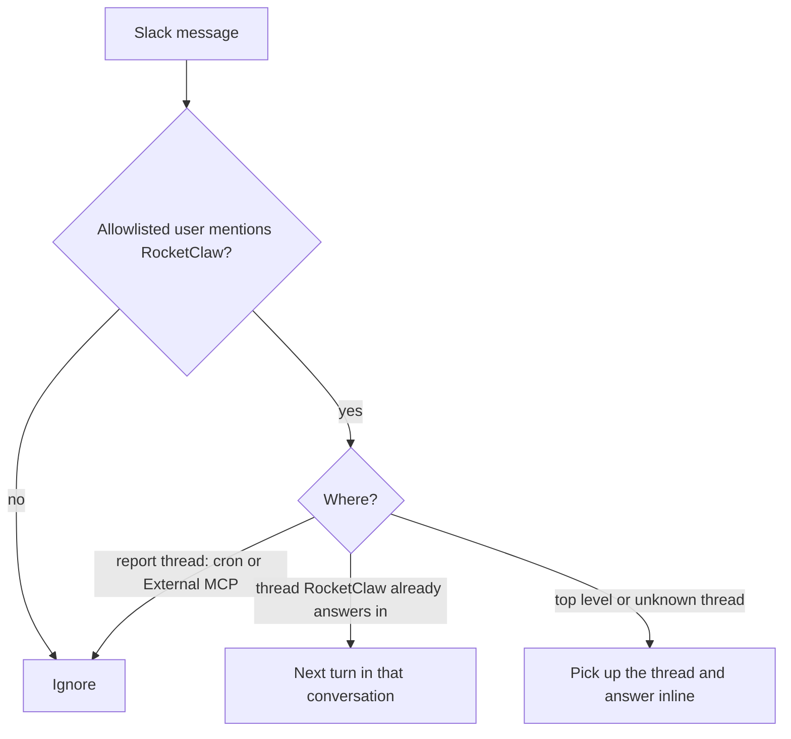
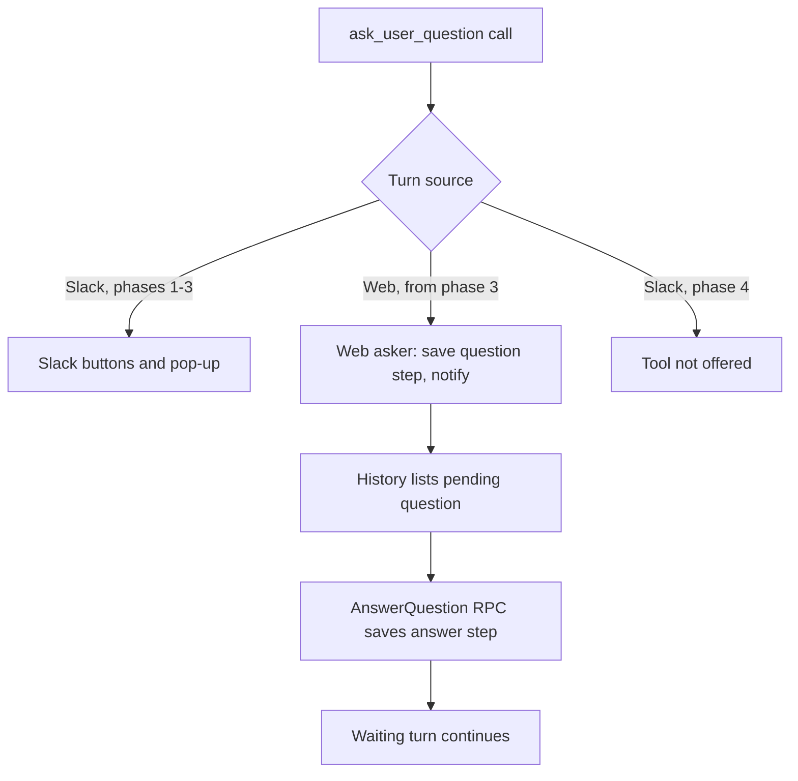

# Slack as a Convenience Surface - Plan

## Goal Capsule

- **Objective:** The team does its deep work with RocketClaw in the Web Interface. Slack keeps three convenience jobs: showing cron reports, showing External MCP sessions, and answering when someone @mentions RocketClaw. Nothing else in Slack drives an agent.
- **Means:** Slack starts work only from `app_mention` events and routes each mention through the Thread Queue (KTD1, KTD2). Report threads are recognized in the backend and ignored (KTD3). A shared footer carries the final state and a Web link (KTD5–KTD7). Slack's native agent-session Stop is the only control (KTD8). `ask_user_question` gains a Web asker before Slack's buttons are deleted (KTD9–KTD11).
- **Product authority:** The RocketClaw owner, deciding for the whole team. The decisions marked `session-settled` below are binding. Authority order: Product Contract R-IDs, then Key Technical Decisions, then Implementation Units.
- **Open blockers:** None.
- **Stop conditions:** Stop and report instead of improvising when:
  - a unit would change how cron or External MCP sessions, Sync, or Web-to-Slack mirroring behave, beyond the read-only threads and footers R2 and R3 require (R1)
  - the Go source CLOC budget would be exceeded
  - a settled decision proves unworkable
- **Execution profile:** Four phases in the order given in Delivery Order. Phase 1 lands before any additions (KTD13). Implemented and shipped autonomously through `lfg`.

---

## Product Contract

### Summary

Slack shrinks to three jobs. Cron and External MCP threads stay as they are, but become read-only, and their root message links to the session in Web. @mentions get quick inline answers and a native Stop button. Every other Slack-driven feature is removed. The question tool moves to Web before Slack's question buttons are deleted.

### Problem Frame

For a long time Slack was the main way to use RocketClaw, so it gained a full control surface: `$` commands, an agent selector, steering by reply, queue cards, reaction controls, goals, and question buttons. The Web Interface is now the main way to work, and the team is moving there on purpose. Slack's extra surface still accepts input that changes sessions, though, and it has to be maintained alongside Web. Two examples: a casual reply in a cron thread steers the cron session, and `AGENTS.md` still tells every coding session that "Slack is RocketClaw's primary text connector." Slack should be for "help me quickly"; Web is for "work with me deeply."

### Actors

- A1. Team member: an allowlisted Slack user who reads reports and @mentions RocketClaw for quick help.
- A2. Cron run: posts a report into its configured channel.
- A3. External MCP client: drives a session through `session_prompt`, mirrored into a Slack thread.
- A4. Answering agent: the agent configured for the channel row, or the `@` row for unlisted channels.

### Key Decisions

- **Slack is a convenience surface; Web is primary.** (session-settled: user-directed — chosen over keeping Slack as a full interface: the whole team is deliberately moving to Web.) Governs R12, R13, R17.
- **Report sessions and their Slack mirroring stay exactly as they work today.** (session-settled: user-directed — chosen over moving cron sessions to a Web-only chat, merging External MCP's private and Slack-thread sessions, or limiting the thread to the run's own output: the existing producer and destination model works and must not change.) Governs R1.
- **Read-only means RocketClaw ignores input, not a Slack lock.** Slack offers apps no way to lock a thread. Governs R2.
- **Mentions inside report threads are ignored.** (session-settled: user-directed — chosen over continuing the session from Slack or answering in a separate thread: report threads stay strictly read-only.) Governs R2.
- **Keep the per-channel allowlist.** (session-settled: user-directed — chosen over letting anyone in the channel summon RocketClaw, and over one global list.) Governs R5.
- **`@rocketclaw` answers with the configured agent; there is no per-agent routing in Slack.** (session-settled: user-directed — chosen over first-word agent names, per-agent display names, or Slack user groups: the `@` entry already gives the intended agent.) Governs R5.
- **A mention sent mid-turn waits for the next turn.** (session-settled: user-directed — chosen over steering the running turn: steering stays a Web feature.) Governs R8.
- **Mentions keep their attachments and forwarded threads.** (session-settled: user-directed — chosen over dropping them: quick help often needs a screenshot or a forwarded thread.) Governs R9.
- **Slack's native Stop button is the only Slack control.** (session-settled: user-directed — chosen over the 🛑 reaction, `$stop`, or Web-only stopping.) Governs R10.
- **The question tool moves to Web before Slack's question buttons go.** (session-settled: user-directed — chosen over removing the tool everywhere or keeping Slack's buttons for mention replies.) Governs R15, R16.
- **One plan covers all phases.** (session-settled: user-directed — chosen over planning the deletion phase alone.)

### Requirements

**Report threads (cron and External MCP)**

- R1. Cron reports and External MCP sessions keep everything they do today. That includes their private producer sessions, the Slack-thread conversation each one syncs to, cron delivery, and posting later activity into the thread: follow-ups, background-job results, and turns taken in Web.
- R2. A report thread is read-only: no human reply or @mention in it starts a turn or gets a response.
- R3. The root message of every report thread, and every mention reply, ends with a footer. It shows the agent, the final state (done, failed, or stopped), and a link that opens that conversation in Web.

**Mentions**

- R4. RocketClaw replies only when @mentioned. An un-mentioned message, including a reply in a thread RocketClaw is already part of, starts no turn.
- R5. In any channel RocketClaw is in, an @mention from an allowlisted user gets an inline reply in the thread, from the channel row's first agent, or from the `@` row's agent for unlisted channels.
- R6. A mention inside a thread RocketClaw already answers in continues that thread's conversation.
- R7. A mention inside a thread RocketClaw does not know picks the thread up together with its earlier messages, as it does today.
- R8. A mention that arrives while that thread's agent is still working runs as the next turn; it never steers the running turn.
- R9. A mention keeps carrying its file attachments and the contents of natively forwarded Slack threads.
- R10. While a mention turn runs, Slack shows its native working state with a Stop button, and Stop ends the running turn. Report threads have no Slack stop control.
- R11. The agent answering mentions can hand a deep request to a new Web session with `rocketclaw_start_new_thread` and reply with the link. Use it when the answer doesn't fit in one message.

**Removed from Slack**

- R12. Every other Slack-driven feature is removed:
  - `$` commands and command help, including `$agent` and the agent selector
  - steering by reply
  - the enqueue flow and queue cards
  - ⏫ and 🛑 reaction controls, and any reaction read back as state
  - Slack goals

  Text that used to be a command reaches the agent as ordinary text.
- R13. Removed behavior gets no compatibility code, rejection replies, or migration. Existing threads simply follow the new rules, and a release note tells the team.
- R14. Removing Slack entry points keeps the backend capabilities that Web, External MCP, or restart recovery rely on. These include the Thread Queue, `rocketclaw_start_new_thread`, durable pending questions, and Sync.

**Question tool**

- R15. A turn started in Web can call `ask_user_question`. The question appears in the Web session, a person answers it there, and the waiting turn continues. A pending question still survives a restart.
- R16. Slack's question buttons are removed only after R15 works. From then on, Slack mention turns do not offer the tool.

**Project rules and docs**

- R17. The "Slack is RocketClaw's primary text connector" rule in `AGENTS.md` is rewritten to say Web is primary and Slack has three jobs. The Slack sections of `README.md`, `CONCEPTS.md`, and `cmd/rocketclaw/CHEATSHEET.md` are rewritten to match.

How RocketClaw treats an incoming Slack message (covers R2, R4, R5, R6, R7):



### Key Flows

- F1. Cron report
  - **Trigger:** A cron run produces a non-empty reply.
  - **Actors:** A2, A1
  - **Steps:** The report posts as a new thread root with its footer. A team member reads it in Slack and opens the footer link to keep working in Web. Their Web turns and any follow-ups from the run also appear in the thread. Replies and mentions in the thread are ignored.
  - **Covered by:** R1, R2, R3
- F2. Quick help by mention
  - **Trigger:** A team member @mentions RocketClaw.
  - **Actors:** A1, A4
  - **Steps:** The agent shows the native working state with Stop and answers inline in the thread, with the footer. Any follow-up needs a new mention. A mention sent mid-turn waits for the next turn.
  - **Covered by:** R3, R4, R5, R6, R8, R10
- F3. Quick help turns into deep work
  - **Trigger:** A mention asks for something that needs more than one message.
  - **Actors:** A1, A4
  - **Steps:** The agent starts a Web session with a self-contained first prompt and replies with its link. The work continues in Web.
  - **Covered by:** R11

### Acceptance Examples

- AE1. **Covers R2.**
  - **Given:** a cron report thread
  - **When:** an allowlisted user replies "why did this fail?", with or without @mentioning RocketClaw
  - **Then:** no turn starts and RocketClaw posts nothing
- AE2. **Covers R2, R3.**
  - **Given:** an External MCP thread
  - **When:** a team member opens the footer link
  - **Then:** Web opens the conversation it already lists for that thread, and a Slack mention there is still ignored
- AE3. **Covers R4.**
  - **Given:** a thread RocketClaw answered earlier
  - **When:** someone replies without a mention
  - **Then:** no turn starts
- AE4. **Covers R8.**
  - **Given:** the agent is mid-turn in a mention thread
  - **When:** someone @mentions RocketClaw with a correction
  - **Then:** the running turn is not steered, and the correction runs as the next turn
- AE5. **Covers R10.**
  - **Given:** a running mention turn
  - **When:** someone presses Slack's Stop
  - **Then:** the turn ends, and the reply's footer shows "stopped"
- AE6. **Covers R12.**
  - **Given:** a mention thread
  - **When:** someone sends "@rocketclaw $stop"
  - **Then:** the agent receives "$stop" as ordinary text, and no command runs
- AE7. **Covers R3.**
  - **Given:** an External MCP root posted when the request arrived
  - **When:** its turn finishes
  - **Then:** the root's footer shows the final state
- AE8. **Covers R15, R16.**
  - **Given:** the Web question tool is not yet working
  - **When:** the Slack deletion ships
  - **Then:** Slack's question buttons still work for mention turns

### Scope Boundaries

- No change to how cron or External MCP sessions work, apart from read-only threads and footers (per R1, R2, R3).
- No locking of Slack threads, and no "this thread is read-only" message (per R2, R13).
- No per-agent names, display names, or user groups in Slack. No opening mentions to people outside the allowlist.
- No Slack stop control in report threads, and no other Slack control besides native Stop.
- No new Slack features beyond the footer and native Stop.

### Delivery Order

The phases are an ordering inside this one plan:

1. Delete and simplify: R2, R4–R9, R12–R14, and R17. Slack's question buttons stay.
2. Footer, Web link, and native Stop: R3, R10. R11 can land in any phase.
3. Web question tool: R15.
4. Remove Slack's question buttons: R16.

### Dependencies / Assumptions

- Native Stop depends on Slack's agent-session feature. Where a workspace doesn't offer it, there is no Slack stop, and the footer link is the way to stop a turn in Web. Enabling it may need new app permissions and a reinstall.
- Web links use this machine's Tailscale address and the Web port, as `rocketclaw_start_new_thread` already does. There is no public URL setting, and team members must be on the tailnet to open links.
- `rocketclaw_start_new_thread` is off by default per agent, so R11 needs that permission granted to the answering agent.

### Sources / Research

- `internal/rocketclaw/frontend/slack/connector.go`: mention handling (root-only guard at 2113-2116), managed-thread steering (1875-1904), interactive handler for the queue card, agent selector and question UI (1581-1668), attachment and forward handling on the mention path (2178-2182).
- `internal/rocketclaw/frontend/slack/events.go:24-74`: Web input mirrored into Slack threads, and Slack delivery of every `slack-thread:` reply.
- `internal/rocketclaw/backend/bridge.go:1621-1675`: `postCronRoot` posts, records the thread, binds the producer, and redirects background jobs. `bridge.go:2865-2866`: question tool offered only on human Slack turns.
- `cmd/rocketclaw/mcp.go`: External MCP relay is posted before the turn runs; private producer and Slack-thread destination.
- `CONCEPTS.md:137-139`: Private Producer Conversation.
- `internal/rocketclaw/backend/thread_bridges.go:365-414`: the only absolute Web URL builder.
- `cmd/rocketclaw/CHEATSHEET.md:169-180`: platform-tool defaults and `ask_user_question` exposure.
- `docs/ideation/2026-10-08-slack-surface-reduction-ideation.html`: the ideation this plan grew from.
- `docs/solutions/logic-errors/slack-thread-parent-message-redelivery-enqueued-second-turn.md`: Slack delivers a root mention twice, so a redelivered mention must not start two turns.
- Slack: `agents.sessions.setStatus` (https://docs.slack.dev/reference/methods/agents.sessions.setStatus); the vendored slack-go v0.30.1 exposes `SetAgentSessionStatus` and the `agent_session_stopped` event.
- Claude Tag (https://www.claude.com/docs/claude-tag/concepts/how-it-works): inspiration for the reply footer, native working state, and quick-help versus deep-work split.

**Product Contract preservation:** restructured, no scope change. The Product Contract's Outstanding Questions were all answered by planning (KTD1, KTD3, KTD6, KTD7, KTD10, KTD8), so the section was removed. The Goal Capsule gained Means, authority order, stop conditions, and execution profile. R1–R17, A1–A4, F1–F3, and AE1–AE8 are unchanged.

---

## Planning Contract

### Key Technical Decisions

- KTD1. **Slack delivers mentions only as `app_mention`; the connector stops handling `message` events.** The top-level-only guard in `handleAppMentionEvent` is removed so mentions inside threads are handled. Edited `app_mention` events (`Edited` set) start no turn, matching how Slack edits behave elsewhere. Dropping `message` handling also removes the known double-delivery source (root mention arriving as both `app_mention` and `message`). The `message.*` subscriptions are dropped from the documented app setup. Governs R2, R4, R7.
- KTD2. **Every non-report mention becomes a Thread Queue item, accepted at most once.** This replaces the separate `StartThread`, `SubmitThreadReply`, and adoption entry points from Slack with one path. It is the same path Web's Send uses (`backend/conversations.go` `StashQueueItem`, `backend/thread_bridges.go` `stashQueueItem` → `submitEnqueuedItem`).
  - **Order:** the connector first builds the full content: text, downloaded attachments, any forward, and, for a mention in a thread RocketClaw does not know, up to 50 earlier messages, as `startAdhocSocialThread` does today. Only then does it ensure the conversation exists (a root mention starts a new one) and stash the item. The conversation must be recorded before the stash, because `stashQueueItem` silently skips unrecorded conversations.
  - **Payload:** the queue item carries the complete Slack inbound in `item.Inbound` (Kind Prompt, never Steer), not text rebuilt from `Content`. That keeps the allowed-agents metadata `rocketclaw_start_new_thread` reads, and the thread timestamp Slack questions post into.
  - **Item ID:** `slack:<channel>:<message ts>`.
  - **Once only:** the router accepts that ID at most once per conversation. It refuses it if a waiting row, the active turn, or the conversation's history already carries it. The item ID is written to `inbound.Metadata["web_message_id"]`, the input-ID key that active turns and history already record, so it survives the claim. The check and the insert-if-absent stash run in one transaction under `lockSessionHistory`, reusing the lookup Web already does in `admitWeb`/`reconcileWebDB` (`backend/revert.go`), and match on the ID alone. A redelivery can therefore neither start a second turn after the row was claimed nor reorder the queue.
  - **Failure:** if building, creating, or stashing fails, the connector posts a short error reply in the thread, because Slack has already acknowledged the event.
  - **Running:** the item runs at once when the thread is idle and after the running turn otherwise; it never steers. An active goal holds queued items until the goal ends, as it already does for Web.
  - **Bare mentions:** a bare mention with no text stays ignored at a channel's top level and is accepted inside a thread, where the adopted history is the request.

  Governs R5, R6, R7, R8, R9.
- KTD3. **The backend decides whether a thread is a report thread, behind the router.** The Slack package must not import the backend. `threadBridgeManager`, the only router implementation, answers whether a Slack thread is read-only:
  - a `slack-thread:` conversation whose recorded creator is cron
  - or a conversation that `ExternalMCPSessionByConversationID` resolves

  The `slack-thread:` prefix check matters because cron also marks its `web:` chats as created by cron.

  Records alone are not enough:
  - startup retention deletes thread records older than 30 days
  - cron and External MCP post their root before recording the thread

  So the connector's unknown-thread path also treats a thread whose root RocketClaw's own bot posted as a report thread. Mention threads always start from a human message. A mention in a report thread gets no reaction, no placeholder, and no turn. Governs R2.
- KTD4. **`protocol.PrimaryTextRouter` shrinks to what Slack still calls, and `backend.SlackFrontend` loses `DrainSteers` and `ActivateEnqueue`.** Slack-only wrappers in `threadBridgeManager` go: `StartGoalInThread`, `SkillDescriptions`, `SwitchThreadAgent`, `RegisterThread`, the queue wrappers, and `ThreadBusy`. The surface-agnostic helpers that Web, External MCP, and recovery use stay. These include `stashQueueItem`, `queueItems`, `promoteQueueItem`, `deleteQueueItem`, `StartNewThread`, the interrupt methods, Sync, and `rocketcode.SteerDrain`. Mocks are regenerated with mockery v3 (`go generate ./cmd/rocketclaw`), and new test doubles use mockery-generated mocks. Governs R12, R14.
- KTD5. **Every final outbound carries its terminal state and its turn's source.** `OutboundMessage.WorkflowTerminal` becomes a general terminal field. It is set from the terminal argument `finish` already receives in `backend/bridge.go`: done, failed, or stopped. The outbound also carries the source of the inbound that started the turn. Without it, the connector cannot tell a Slack mention turn from a Web turn, because `events.go` gives Web turns a synthesized Slack target that looks like a root mention. Goal continuations and background wakes inherit a mention's Slack target, so the connector cannot infer the source from that either. Existing workflow consumers are updated. Governs R3, R10.
- KTD6. **One footer renderer, used by mention replies and report roots.** The footer is a trailing Block Kit context block: agent · state · "Open in Web" link. The body chunk budgets drop by one block so every message stays within Slack's 50-block limit. The placeholder carries the same footer with a "working" state from the moment the turn starts. The Web link is therefore there while the turn runs, which is when someone without Slack Stop needs it. The final reply or footer-only edit replaces it with the terminal state. Every final reply posted into a mention thread gets the footer, whichever surface started the turn. A final with no text from a real turn (`TurnID` set) no longer deletes the placeholder. It edits the placeholder into a footer-only message, journaled through `postOnce` so a retry cannot post it twice, and every accepted mention ends visibly. An empty final with no `TurnID`, such as Web `$stop` when nothing ran, posts nothing. The link comes from a router method backed by the URL builder extracted from `StartNewThread`. That builder runs `tailscale ip -4` each call, keeping the 2026-10-06 decision of no startup state or cache. If the link cannot be built, the footer omits it and logs a warning. Footer and link problems never fail delivery or its acknowledgement. Governs R3.
- KTD7. **Report-root footers are edited in after the fact.** A cron root's footer is edited by the backend after `bindProducer`, through the existing cron-root sender seam. Its link names the destination `bindProducer` returns, which can differ from the newly posted thread's ID. The edit sits inside the retried `postCronRoot` path and is keyed to the turn, so a crash between post and edit still yields one root and one footer. It is log-only and never blocks closing the turn. "Final state" on a report root means the report run's own state; later Web turns in the thread don't change it. An External MCP relay root is posted with a "working" footer, then edited when each MCP turn ends to show that turn's state. Because `chat.update` replaces every block, the root's current blocks are fetched first. A failed footer edit is logged and never causes a re-post. Governs R1, R3.
- KTD8. **Native Stop uses Slack agent sessions, for Slack-started mention turns only.**
  - **Which turns:** only turns whose outbound source is Slack (KTD5). Report threads, Web-started turns, goal continuations, and background wakes get no session calls.
  - **Start:** when such a turn starts, the connector sets the thread's session to `processing`, including when a restarted turn resumes its journaled placeholder. It journals the turn ID and the time it set `processing`. The status stays `processing` while a Slack question waits, so Stop remains available.
  - **End:** the status returns to `active` when the turn ends for any reason.
  - **Stop event:** an `agent_session_stopped` event from an allowlisted user of that channel row stops the turn only when two checks pass. The thread's active turn must be the journaled one. It must also have set `processing` before the event's timestamp, so a late Stop cannot hit a newer mention turn in the same thread. The stop goes through the non-blocking `InterruptThread`, which also stops an active goal, as Web's `$stop` does. It never calls the blocking `RunTurn` cancel, because all Slack events run on one goroutine. Queued mentions stay queued.
  - **Status after Stop:** the connector sets `active` after it interrupts the turn, or when no Slack-started turn is running. An ignored press (non-allowlisted user, or a late Stop) on a still-running Slack-started turn re-sends `processing`, so that turn keeps its working state and Stop.
  - **Unavailable workspace:** `feature_disabled` and `not_authorized` are logged and the turn runs normally.
  - **Acknowledgement:** the existing 🤖 reaction stays as the admission receipt, including for mentions queued behind another turn.

  (session-settled: user-directed — chosen over the 🛑 reaction, `$stop`, or Web-only stopping.) **Conflict call-out:** research found that Slack only lets apps "declared as agents" create sessions. That requires turning on `agent_view` in the Slack app settings, which cannot be undone, plus subscribing to `agent_session_stopped`. This is workable but is a one-way operator step, documented in U12. Slack also ends the working state after one hour; the connector does not refresh it. Governs R10.
- KTD9. **`ask_user_question` dispatches by turn source through a small interface.** `protocol.UserQuestionAsker` becomes an interface with an explicit inert implementation, following the AGENTS.md rule against behavior callbacks. One asker per conversation routes each request by its `Source`: Slack requests go to the connector until phase 4, Web requests go to a new backend Web asker. The tool is exposed on human Slack turns, as today, and on human Web turns, including Web turns inside Slack-thread conversations. It is never exposed to cron, External MCP, workflow, or automation turns. Governs R15.
- KTD10. **The Web asker reuses the durable step mechanism under its own key.** It saves the question as the `<id>/web-question` turn step, with an explicit change notification, because steps whose key contains `/` don't trigger one. The Slack asker already uses `<id>/question` for its posted-message journal, so the separate key keeps Slack questions out of the Web card. `<id>/answer` stays the shared answer step; question IDs are unique per tool call. It then waits in process for the answer. `History` returns pending questions, the same way it returns background jobs. A reshaped `AnswerQuestion` RPC saves the `<id>/answer` step and wakes the waiting turn. The RPC request carries the conversation ID, the question ID, the selected values, and custom text, replacing the current single-string shape. The first answer wins: the RPC saves an answer only when the Web question step exists, no answer exists yet, and the turn is still waiting. Otherwise it returns a typed "no longer pending" error.

The RPC also checks who may answer and which question:
- **Access:** it first applies the same `visibleConversation` check as `queueItem` and `stopBackgroundJob`: a Tailscale-identified caller, on a conversation that isn't a private producer.
- **Lookup:** it finds the question step, the answer step, and the waiting turn by the request's conversation ID and question ID together.

`History` lists, and `AnswerQuestion` accepts, only questions asked by the Web asker. Slack questions stay answerable only in Slack until phase 4. Pending questions are read from the durable Web question steps, so the card survives a closed tab or a restart. While a Web question waits in the conversation, the composer's Send submits its text as that question's custom answer instead of queueing it behind the blocked turn. After a restart, the resumable tool asks again with the same ID, and an already-saved answer returns at once. The Web card sits above the composer, mirroring the background-jobs card, and supports multi-select. Governs R15.
- KTD11. **Phase 4 removes Slack's question path whole:**
  - the question blocks and pop-up
  - the interactive handler's remaining branches
  - `SlackFrontend.AskUserQuestion`
  - the Slack asker wiring

  The tool description stops saying "native Slack question". Governs R16.
- KTD12. **What deliberately stays:**
  - `events.go`'s Web-input mirror and its delivery of every Slack-thread reply
  - the goal header for Web goal turns mirrored into Slack threads
  - the goal Slack-recipient columns
  - the backend's direct `$<skill>` triggers for Web turns; Slack-source turns skip them, so `$<skill>` text from a mention reaches the agent as ordinary text, like every other former Slack command
  - every migration file

  Removing columns or migrations would need migration code, which R13 rules out. Governs R1, R12, R13.
- KTD13. **Deletion lands first.** Phase 1 is a net deletion and must merge before phases 2–3 add code. That keeps Go source CLOC (21,859 of 23,500, hazard zone from 23,000) clear of the budget. Governs R12.

### High-Level Technical Design

How a Slack mention is handled after this change (KTD1–KTD3, KTD8):

```mermaid
sequenceDiagram
  participant U as Allowlisted user
  participant S as Slack
  participant C as Slack connector
  participant R as Router (threadBridgeManager)
  participant Q as Thread Queue / bridge
  U->>S: @rocketclaw message
  S->>C: app_mention (message events not handled)
  C->>R: is this a report thread? (plus bot-authored root check)
  R-->>C: yes -> stop (no reaction, no turn)
  R-->>C: no
  C->>S: fetch thread root and earlier messages; build content
  C->>R: ensure conversation exists
  C->>Q: stash item slack:<channel>:<ts> once (refused if seen)
  Q-->>C: turn starts (non-complete outbound)
  C->>S: placeholder with working footer + agent session processing
  Q-->>C: final outbound with terminal state
  C->>S: reply + footer (agent · state · Web link), session active
```

Footer state per message kind (KTD5–KTD7):

| Message | Footer written | State source | Link target |
|---|---|---|---|
| Mention reply | "working" on the placeholder, then the final reply or the footer-only edit of the placeholder | terminal field on the final outbound | the mention thread's conversation |
| Cron root | edited after `bindProducer` | always done; failed and stopped runs post no report | destination returned by `bindProducer` |
| External MCP root | "working" when posted, then edited when each MCP turn ends | terminal field of that turn's outbound | the managed Slack-thread conversation |

Question tool flow across phases (KTD9–KTD11):



### Assumptions

These defaults were chosen in pipeline mode, without a user to ask; each is reversible:
- Turns started from Web inside a mention thread do not show Slack's working state or Stop, but their replies do get the footer.
- Any allowlisted user of the channel row can press Stop, matching who can start turns. A press from anyone else is ignored and the running turn keeps its working state and Stop.
- An External MCP root's footer shows the state of the most recent MCP turn in that thread.
- Edited messages that add a mention start no turn.
- A bare mention inside a thread is accepted; at a channel's top level it stays ignored.
- Mentions wait behind an active goal in their conversation, as Web prompts do.
- A Web user may delete or promote a queued Slack mention from the Web queue panel; Web stays authoritative and Slack is not told.
- Existing workspaces must grant `rocketclaw_start_new_thread` to their own answering agent; the skeleton only changes new workspaces.
- Pending Slack questions are answered or abandoned before the phase-4 deploy (release note). A question still waiting then errors when its turn resumes.
- A mention in a thread RocketClaw already answers in carries only its own text. Teammates' un-mentioned replies posted since the last turn are not passed to the agent. Today they arrive as steers. Including them as context would change R6, so it is left for the owner to decide.

### Deferred to Implementation

- Exact names and shapes of the shrunk router methods (thread role, mention stash, Web URL).
- Whether the footer re-fetch for External MCP roots uses `conversations.replies` (as `findPosted` does) or a journaled copy of the root blocks.
- Where the per-turn "this turn opened an agent session" fact lives, most likely in the journaled reply state.

### Risks

| Risk | Mitigation |
|---|---|
| Deleting the steer path drops today's duplicate-mention guard | KTD1 removes the message-event duplicate; KTD2 accepts a mention ID once, across waiting, active, and past turns; U1 and U2 test redelivery while waiting, mid-turn, and after restart |
| Old (pruned) or just-posted report threads get adopted as mention threads | KTD3's bot-authored-root fallback; U2 tests a pruned cron thread, a pruned MCP thread, and the post-before-record race |
| A late Stop interrupts a different turn | KTD8's journaled turn identity; U7 tests Stop arriving after the next turn started |
| A failed footer edit or session call is counted as a failed delivery, stalling the queue | KTD6, KTD7, KTD8 make every footer and session call best-effort and outside delivery acknowledgement; U5, U6, U7 test it |
| The `agent_view` switch is irreversible and session behavior in public-channel threads is only documented, not observed | U12 documents the operator step; KTD8 tolerates `feature_disabled` and `not_authorized` |
| Turning on `agent_view` may add an agent-chat surface in the app's Messages tab that RocketClaw never answers | Owner decision before enabling, recorded in U12's docs: accept it, or keep the app's Messages tab disabled if Slack still allows channel-thread sessions that way |
| The proto change for `AnswerQuestion` breaks the Web protocol hash check | U10 regenerates `web.pb.go` and `protocol.gen.go` and updates the hash tests |
| Large test deletion lowers coverage below the 90% gate | Phase 1 deletes the tests of deleted code along with it and rewrites mention tests for the new path; `make test` checks coverage |

### System-Wide Impact

- **Team members (A1):** lose Slack commands, steering, reactions, and agent switching. A release note announces the change (R13).
- **Operators:** the Slack app needs `agent_view` turned on, an `agent_session_stopped` subscription, and no longer needs `message.*` subscriptions (U12).
- **Agents:** Web turns gain `ask_user_question`; Slack mention turns lose it in phase 4. Agent instructions in existing workspaces that mention Slack commands become stale.
- **Shared backend:** the Thread Queue, Sync, cron delivery, and restart recovery keep their behavior (R14).

---

## Implementation Units

### Phase 1: Delete and simplify

### U1. Report-thread check and mention entry in the router

- **Goal:** The backend can tell Slack whether a thread is read-only and can accept a mention as a queue item for a conversation it ensures exists.
- **Requirements:** R2, R5, R6, R7, R8, R9; KTD2, KTD3.
- **Dependencies:** none.
- **Files:**
  - `internal/rocketclaw/protocol/conversation.go`
  - `internal/rocketclaw/backend/thread_bridges.go`
  - `internal/rocketclaw/backend/store_dao.go`
  - `internal/rocketclaw/backend/thread_bridges_test.go`
  - `.mockery.yml`
  - `internal/rocketclaw/frontend/slack/primarytextrouter_mocks_test.go` (regenerated)
- **Approach:**
  1. Add a read-only check to the router per KTD3, using `SessionService.Thread` and `ExternalMCPSessionByConversationID`.
  2. Add one mention entry that takes the complete Slack inbound per KTD2.
  3. In that entry, set the item ID as the inbound's `web_message_id`, then refuse an ID already seen in a waiting row, the active turn, or the conversation's history.
  4. Ensure the conversation is recorded, then store the item insert-if-absent with the full inbound, in the same transaction as the check, under `lockSessionHistory`.
  5. Keep `InterruptThread` on the router for U7.
- **Patterns to follow:** `stashQueueItem` and `ensureStartedThread` in `backend/thread_bridges.go`; `admitWeb` and `reconcileWebDB` in `backend/revert.go` for the once-only input check; `decideOrigin` in `frontend/rpc/server.go` for the same cron and External MCP rules.
- **Test scenarios:**
  - A cron `slack-thread:` conversation with creator cron is reported read-only.
  - A `web:cron:` chat created by cron is not treated as a Slack report thread.
  - An External MCP managed thread is reported read-only.
  - A mention thread created by a mention is not read-only.
  - A mention for an unknown thread creates the conversation and stashes one item with ID `slack:<channel>:<ts>`.
  - Submitting the same mention ID again while it waits leaves one queue row, in its original position.
  - Submitting it again after its turn claimed the row, mid-turn, starts no second turn.
  - Submitting it again after a restart, while the active-turn row waits to resume, starts no second turn.
  - A mention while the conversation's turn is running is stored and runs after that turn, not as a steer.
  - A queued mention keeps its allowed-agents metadata and its thread timestamp when it runs.
- **Verification:** backend tests show report threads are recognized and that mentions queue rather than steer.

### U2. Mention-only Slack intake

- **Goal:** Slack starts work only from allowlisted `app_mention` events outside report threads.
- **Requirements:** R2, R4, R5, R6, R7, R8, R9; KTD1, KTD2, KTD3; realizes F2; covers AE1, AE3, AE4.
- **Dependencies:** U1.
- **Files:**
  - `internal/rocketclaw/frontend/slack/connector.go`
  - `internal/rocketclaw/frontend/slack/connector_test.go`
  - `internal/rocketclaw/frontend/slack/adhoc_callout_test.go`
- **Approach:**
  1. In `handleEventsAPI`, stop dispatching `MessageEvent` and `ReactionAddedEvent`.
  2. In `handleAppMentionEvent`, remove the top-level-only guard and ignore edited events.
  3. Ask the router about report threads before any reaction or placeholder. In an unknown thread, also ignore the mention when the fetched thread root was posted by RocketClaw's bot (KTD3).
  4. Move the adoption body of `startAdhocSocialThread` onto the mention path, building all content before submitting (KTD2).
  5. Submit through U1's mention entry instead of `StartThread`, and post a short error reply in the thread if it fails.
  6. Delete `handleMessageEvent` and the helpers only it used: `ignoreSlackMessage`, `postDollarHelpOrWarn`, `slackSocialThreadReplyPingsAway`, `slackMessageMentionsBot`, `inboundContentForMessageEvent`, `slackMessageEventText`, `slackMessageEventFiles`.
  7. Keep attachment download, forward expansion, the allowlist, and agent selection unchanged.
- **Execution note:** Rewrite the existing redelivery tests (`TestHandleMessageEventIgnoresThreadParentRedelivery`, `TestHandleMessageEventIgnoresReplyRedelivery`) as mention-path tests before deleting the message handler.
- **Patterns to follow:** existing `newSlackAppMentionEvent` and `newSlackEventsAPIEvent` test helpers; the `httptest` Slack server helpers in `connector_test.go`.
- **Test scenarios:**
  - Covers AE1. A mention in a cron report thread produces no reaction, no placeholder, and no router submit.
  - An External MCP thread mention is ignored the same way.
  - Covers AE3. A message event in a thread RocketClaw answered earlier is ignored.
  - A root mention from an allowlisted user stashes one item and adds the 🤖 reaction.
  - A mention from a non-allowlisted user is ignored.
  - A mention in a thread RocketClaw already answers in reaches the existing conversation.
  - A mention in an unknown thread adopts earlier messages.
  - Covers AE4. A mention while a turn runs is stashed, not steered.
  - A mention with an image attachment and a native forward carries both.
  - An edited `app_mention` starts nothing.
  - The same `app_mention` delivered twice yields one queue item.
  - A mention in a cron thread whose record was pruned, or that arrives before the cron record exists, is ignored because the bot posted the root.
  - The same holds for a pruned or not-yet-recorded External MCP thread.
  - A bare mention in an unknown thread adopts the history and is accepted.
  - A bare root mention is still ignored.
  - When creating or stashing fails, a short error reply is posted in the thread.
- **Verification:** connector tests pass with `handleMessageEvent` gone; mentions in report threads produce no Slack API calls.

### U3. Delete the remaining Slack-only features

- **Goal:** No Slack command, selector, queue card, reaction control, or Slack-started goal remains, and the backend hooks that only served them are gone.
- **Requirements:** R12, R13, R14; KTD4, KTD12, KTD13; covers AE6.
- **Dependencies:** U2.
- **Files:**
  - `internal/rocketclaw/frontend/slack/connector.go`
  - `internal/rocketclaw/frontend/slack/text.go`
  - `internal/rocketclaw/frontend/slack/slack_emoji.go`
  - `internal/rocketclaw/frontend/slack/connector_test.go`
  - `internal/rocketclaw/frontend/slack/inert_test.go`
  - `internal/rocketclaw/protocol/conversation.go`
  - `internal/rocketclaw/backend/runtime.go`
  - `internal/rocketclaw/backend/app.go`
  - `internal/rocketclaw/backend/bridge.go`
  - `internal/rocketclaw/backend/conversations.go`
  - `internal/rocketclaw/backend/thread_bridges.go`
  - their `_test.go` files
  - regenerated mocks
- **Approach:**
  1. Delete from the connector:
     - `$` command parsing and help, `$agent` and the agent selector
     - `$goal` and `startSlackGoal`, `$enqueue` and `$queue`
     - queue cards and Jump
     - `ActivateEnqueue`, `DrainSteers`, the steer stacks
     - reaction handling and `resolveManagedThreadTS`
     - `stopSlackThread`
     - the interactive branches for the queue and the selector (the question branches stay until U11)
  2. Delete from the backend: the Slack-only router wrappers named in KTD4, `SlackFrontend.DrainSteers` and `ActivateEnqueue`, `EnqueueActivation`, `Config.SteerDrain`, and the `slackSink` nil guard in `app.go`.
  3. Keep the goal header rendering and every migration (KTD12). Make the backend direct-skill parser skip Slack-source turns.
  4. Let the compiler find the rest of the dead code.
- **Patterns to follow:** delete whole features rather than guarding them (AGENTS.md change discipline); regenerate mocks with `go generate ./cmd/rocketclaw`.
- **Test scenarios:**
  - Covers AE6. A mention whose text is `$stop` reaches the router as an ordinary queued prompt with text `$stop`.
  - A mention whose text is `$agent factory hi` is queued as ordinary text for the channel's configured agent.
  - A mention whose text is `$review` reaches the agent as ordinary text and invokes no skill, while a Web prompt `$review` still invokes the skill.
  - Web's queue, promote, and delete RPCs still work against a conversation after the Slack wrappers are gone (existing `frontend/rpc` tests).
  - A Web goal turn in a Slack-thread conversation still posts to Slack with its goal header (existing goal rendering test kept).
  - Background-job completion notices still reach the running turn through `rocketcode.SteerDrain` (existing backend test kept).
  - Covers AE8. A queued mention turn's `ask_user_question` still posts Slack question buttons into its thread, and the chosen answer reaches the waiting turn.
- **Verification:** `go build ./...` and the full suite pass; source CLOC drops; no `slackSink == nil` or callback guard remains for the removed hooks.

### U4. Phase-1 docs and rules

- **Goal:** Project rules and user docs describe Web as primary and Slack's three jobs.
- **Requirements:** R13, R17.
- **Dependencies:** U3.
- **Files:**
  - `AGENTS.md`
  - `README.md`
  - `CONCEPTS.md`
  - `cmd/rocketclaw/CHEATSHEET.md`
  - `internal/rocketclaw/web/README.md`
  - `internal/rocketclaw/frontend/rpc/README.md`
  - `internal/rocketclaw/skel/agents/main.md`
  - `internal/rocketclaw/skel/.rocketclaw/skills/main-create-or-update-agent/SKILL.md`
  - `docs/solutions/logic-errors/slack-thread-parent-message-redelivery-enqueued-second-turn.md`
  - `docs/solutions/logic-errors/slack-root-app-mention-redelivery-cleared-buffered-follow-ups.md`
- **Approach:**
  1. Rewrite the AGENTS.md Slack bullet and the README Slack paragraphs (mention contract, `$agent`, steering, `$stop`, `$enqueue`, queue references).
  2. In `CONCEPTS.md`, rewrite the Slack Conversations section: Managed Slack Thread, Root Slack Mention, Adhoc Callout, Slack Steer, Enqueued Slack Message, Buffered Follow-Up. Add "Report Thread" with its read-only rule.
  3. Rewrite the CHEATSHEET control, scenario, and reaction tables.
  4. Remove Slack-command instructions from the skeleton agent.
  5. Mark the redelivery learnings as superseded by KTD1 and point their paths at current code.
  6. Update the documented Slack app setup: `message.*` event subscriptions are no longer needed (KTD1).
  7. Add release note text to the README's Slack section covering these changes:
     - Slack is now mention-only, and report threads are read-only.
     - Edited messages don't start work.
     - Mentions wait behind goals.
     - Old queue cards and selector buttons do nothing.
     - Until phase 2 ships, a running mention turn can only be stopped from Web.
     - Pending Slack questions must be answered before phase 4.
- **Test scenarios:** Test expectation: none -- documentation only; `internal/rocketclaw/skel/skel_test.go` must still pass.
- **Verification:** no doc still tells users to use `$` commands, steering, reactions, or the agent selector in Slack.

### Phase 2: Footer, Web link, and native Stop

### U5. Terminal state and the shared footer on mention replies

- **Goal:** Every mention reply ends with agent, final state, and a Web link, including stopped turns.
- **Requirements:** R3; KTD5, KTD6; covers AE5 (state part).
- **Dependencies:** U3.
- **Files:**
  - `internal/rocketclaw/protocol/types.go`
  - `internal/rocketclaw/protocol/clockwork.go`
  - `internal/rocketclaw/backend/bridge.go`
  - `internal/rocketclaw/backend/thread_bridges.go`
  - `internal/rocketclaw/frontend/slack/connector.go`
  - their `_test.go` files
- **Approach:**
  1. Generalize the terminal field on `OutboundMessage` and set it in `finish` and `stopIdleTurn`.
  2. Extract the URL builder from `StartNewThread` into one backend function and expose it through the router.
  3. Add the footer context block in `titledMessageLayout`'s callers and on the placeholder (state "working"), and lower the body chunk caps by one.
  4. Replace the placeholder delete on empty finals with a footer-only edit.
- **Patterns to follow:** `titledMessageLayout` and `sendTitledResponse` in `connector.go`; `StartNewThread` URL code in `backend/thread_bridges.go`.
- **Test scenarios:**
  - A running mention turn's placeholder ends with a footer showing "working" and the Web link.
  - A completed mention reply's last block is a context block with the agent, "done", and a `/s/<base64url(id)>` link.
  - A failed turn's footer says "failed".
  - A stopped turn with empty text edits the placeholder into a footer-only message saying "stopped" instead of deleting it.
  - A turn that finishes "done" with empty text also ends with a footer-only message.
  - Web `$stop` with nothing running (no `TurnID`) posts nothing in Slack.
  - A Web turn's reply mirrored into a mention thread carries the footer.
  - A retried delivery after a restart does not post the footer-only message twice.
  - A body long enough to hit the chunk cap still fits within 50 blocks with the footer.
  - When the URL builder fails, the footer has no link, a warning is logged, and delivery is still acknowledged.
  - A workflow run still reports its terminal state where it did before.
- **Verification:** connector and backend tests pass; delivery acknowledgement is unchanged when the link fails.

### U6. Report-root footers for cron and External MCP

- **Goal:** Cron and External MCP roots carry the footer and link to the conversation Web lists.
- **Requirements:** R1, R3; KTD7; realizes F1; covers AE2, AE7.
- **Dependencies:** U5.
- **Files:**
  - `internal/rocketclaw/backend/bridge.go`
  - `internal/rocketclaw/backend/runtime.go`
  - `internal/rocketclaw/frontend/slack/connector.go`
  - `cmd/rocketclaw/mcp.go`
  - their `_test.go` files
- **Approach:**
  1. After `bindProducer` in `postCronRoot`, edit the posted root's footer with the returned destination through the cron-root sender.
  2. Post the External MCP relay root with a "working" footer once its thread ID is known. In the response path, edit the root's footer when the turn ends, after fetching its current blocks.
  3. Treat both edits as best-effort, logged on failure, never retried by re-posting.
- **Patterns to follow:** `postOnce` and `findPosted` in `connector.go` for journaled posts and re-fetching; `cronRootSender` and `noCronRoots` in `backend/thread_bridges.go`.
- **Test scenarios:**
  - A cron report root is edited once after binding, with a footer linking the destination.
  - When `bindProducer` returns an existing destination, the cron root's link names that destination.
  - A failed cron footer edit does not post a second root and does not fail cron delivery.
  - A crash between the cron root post and its footer edit, followed by the delivery retry, yields one root with one footer.
  - Covers AE7. An External MCP root's footer changes from "working" to the finished turn's state.
  - Covers AE2. An External MCP root's link opens the managed Slack-thread conversation.
  - A second MCP call in the same thread updates the root footer to the newer turn's state.
- **Verification:** cron and External MCP tests pass with Sync and mirroring behavior unchanged (R1).

### U7. Native Stop through Slack agent sessions

- **Goal:** A running mention turn shows Slack's working state with Stop, and Stop ends it.
- **Requirements:** R10; KTD8; covers AE5.
- **Dependencies:** U5.
- **Files:**
  - `internal/rocketclaw/frontend/slack/connector.go`
  - `internal/rocketclaw/frontend/slack/connector_test.go`
- **Approach:**
  1. On the non-complete outbound of a Slack-source turn, in both the new-placeholder and resumed-placeholder branches, call `SetAgentSessionStatusContext` with `processing`. Journal the turn ID and the time.
  2. Set `active` on every final outbound for that turn.
  3. Add a `*slackevents.AgentSessionStoppedEvent` case to `handleEventsAPI`. For an allowlisted user, call the router's `InterruptThread` when the thread's active turn is the journaled one and set `processing` before the event's timestamp, then set `active`. When nothing Slack-started is running, set `active`. When the press is ignored on a running Slack-started turn, re-send `processing`.
  4. Log and ignore `feature_disabled` and `not_authorized`.
- **Patterns to follow:** journaled reply state in `SendResponse`; vendored `vendor/github.com/slack-go/slack/agents.go`.
- **Test scenarios:**
  - A mention turn's start calls `agents.sessions.setStatus` with `processing` and the thread timestamp.
  - Its end, whether done, failed, or stopped, calls it with `active`.
  - Covers AE5. A stop event from an allowlisted user interrupts the conversation, and the footer then says "stopped".
  - A stop event from a non-allowlisted user does not interrupt, and the running turn's status stays `processing`.
  - A stop event when nothing is running sets `active` and nothing else.
  - A stop event that arrives after the mention turn ended and a newer mention turn started in the same thread interrupts nothing, and the newer turn stays `processing`.
  - A stop event that arrives after the mention turn ended and a Web turn started interrupts nothing and sets `active`.
  - A stop event on a thread with an active goal stops the goal, so no continuation turn starts.
  - A stop event while a Slack question waits ends the turn and removes the question message.
  - A turn resumed after a restart sets `processing` again.
  - Goal continuations and background wakes in a mention thread make no session calls.
  - A `feature_disabled` response is logged and the turn completes normally.
  - Cron, External MCP, and Web-started turns make no session calls.
  - The stop handler never blocks the event loop waiting for the turn to finish.
- **Verification:** connector tests pass using the fake Slack server with an `agents.sessions.setStatus` route.

### U8. Quick-to-deep handoff for new workspaces

- **Goal:** The default answering agent can hand deep requests to a new Web session.
- **Requirements:** R11; realizes F3.
- **Dependencies:** U4.
- **Files:**
  - `internal/rocketclaw/skel/agents/main.md`
  - `internal/rocketclaw/skel/skel_test.go`
- **Approach:**
  1. Allow `rocketclaw_start_new_thread` in the skeleton agent's permissions.
  2. Add one instruction: answer in place when one message is enough; otherwise start a Web session with a self-contained first prompt and reply with its link.
- **Test scenarios:**
  - The skeleton's agent definition parses and grants `rocketclaw_start_new_thread` (extend the existing skeleton test if it checks agent permissions; otherwise Test expectation: none -- prompt and permission text only).
- **Verification:** a new workspace's main agent lists `rocketclaw_start_new_thread` as allowed.

### U12. Operator setup docs for sessions and events

- **Goal:** Operators know how to configure the Slack app for native Stop when it ships.
- **Requirements:** R10, R17; KTD8.
- **Dependencies:** U7.
- **Files:** `cmd/rocketclaw/CHEATSHEET.md`, `README.md`.
- **Approach:**
  1. Document turning on `agent_view`, which can't be undone, and subscribing to `agent_session_stopped`.
  2. Note the one-hour working-state limit.
  3. Warn that `agent_view` may add an agent-chat surface in the app's Messages tab that RocketClaw does not answer, and how to keep that tab disabled if Slack allows it.
- **Test scenarios:** Test expectation: none -- documentation only.
- **Verification:** README and CHEATSHEET Slack setup lists match KTD8.

### Phase 3: Web question tool

### U9. Source-routed asker and the Web asker

- **Goal:** Human Web turns can call `ask_user_question`, and the answer survives restart.
- **Requirements:** R15; KTD9, KTD10.
- **Dependencies:** U3.
- **Files:**
  - `internal/rocketclaw/protocol/types.go`
  - `internal/rocketclaw/backend/bridge.go`
  - `internal/rocketclaw/backend/app.go`
  - `internal/rocketclaw/backend/runtime.go`
  - a new `internal/rocketclaw/backend/web_question.go` with its test
  - `internal/rocketclaw/backend/active_turn_test.go`
  - `internal/rocketclaw/backend/bridge_test.go`
- **Approach:**
  1. Turn `UserQuestionAsker` into an interface with an inert type.
  2. Build one asker that dispatches by `req.Source`.
  3. Widen the exposure gate to human Web turns.
  4. Implement the Web asker over `SaveTurnStep` and `LoadTurnStep` with the `<id>/web-question` key, an explicit change notification, and an in-process wait keyed by conversation ID and question ID.
  5. Expose pending questions and answering through `frontend.Backend`.
- **Patterns to follow:** the Slack asker in `connector.go`: answer replay, post-once, and the pending map; the manual notify in `backend/background.go`.
- **Test scenarios:**
  - A human Web turn's tool list includes `ask_user_question`.
  - Cron, External MCP, workflow, and automation turns do not get it.
  - A Web question is saved as a turn step and listed as pending.
  - Answering with two selected values and custom text returns both to the tool.
  - Restarting while a Web question waits re-registers it, and answering afterwards continues the turn.
  - An answer saved before the restart is returned at once without asking again.
  - Moving the script to the background withdraws the question.
  - A Slack-source question still reaches the Slack asker.
- **Verification:** backend tests pass, including the restart scenario against PostgreSQL.

### U10. AnswerQuestion RPC and the Web question card

- **Goal:** The Web Interface shows a pending question and sends the answer.
- **Requirements:** R15; KTD10.
- **Dependencies:** U9.
- **Files:**
  - `internal/rocketclaw/web/proto/web.proto`
  - `internal/rocketclaw/frontend/rpc/web.pb.go` (regenerated)
  - `internal/rocketclaw/frontend/rpc/protocol.gen.go`
  - `internal/rocketclaw/frontend/rpc/transport.go`
  - `internal/rocketclaw/frontend/rpc/http.go`
  - `internal/rocketclaw/frontend/rpc/server.go`
  - `internal/rocketclaw/frontend/rpc/http_test.go`
  - `internal/rocketclaw/frontend/rpc/server_test.go`
  - `internal/rocketclaw/web/src/api.ts`
  - `internal/rocketclaw/web/src/types.ts`
  - `internal/rocketclaw/web/src/ui.tsx`
  - a new browser test such as `internal/rocketclaw/web/src/question.browser.test.ts`
  - `internal/rocketclaw/web/src/api.test.ts`
  - the rebuilt `internal/rocketclaw/internal/web/dist`
- **Approach:**
  1. Reshape `AnswerQuestionRequest`.
  2. Add pending questions to `HistoryResponse`.
  3. Register the method in the three lists.
  4. Gate the RPC with `visibleConversation`.
  5. Add the client mutation and a card above the composer with options and multi-select. While the card shows, the composer's Send sends its text as the custom answer.
  6. Regenerate the proto and update the protocol hash.
- **Patterns to follow:** `background_jobs` in `HistoryResponse` and the `BackgroundJobs` card in `ui.tsx`; the `invoke` helper in `server_test.go`.
- **Test scenarios:**
  - `AnswerQuestion` over HTTP no longer returns 404; it saves the answer and returns success.
  - Answering an unknown or already-answered question returns the typed "no longer pending" error and changes nothing.
  - Two answers racing for one question: the first is saved and wakes the turn, and the second gets the error.
  - An answer after the turn was stopped or moved to the background gets the error and saves nothing.
  - A pending question still appears in History after the browser tab is closed and reopened.
  - `History` for a conversation with a waiting Web question includes it; after answering it disappears.
  - Browser: a pending single-choice question renders as a card, and clicking an option sends `AnswerQuestion` with that value.
  - Browser: a multi-select question sends every checked value.
  - Browser: text typed into the composer while the card shows is sent as the custom answer, not queued.
  - A request with no valid Tailscale principal returns Unauthenticated and saves nothing.
  - A request naming a private producer conversation returns PermissionDenied.
  - A valid question ID paired with a different visible conversation ID returns "no longer pending" and wakes nothing.
  - A conversation with a pending Slack question shows no Web card, and `AnswerQuestion` for it returns "no longer pending".
  - The protocol hash test matches the regenerated proto.
- **Verification:** rpc, Web unit, and browser tests pass; `dist/` is rebuilt.

### Phase 4: Remove Slack's question buttons

### U11. Delete Slack's question path

- **Goal:** Slack no longer renders questions, and Slack mention turns do not offer the tool.
- **Requirements:** R16; KTD11; AE8 is enforced in U3 and preserved here by ordering.
- **Dependencies:** U10.
- **Files:**
  - `internal/rocketclaw/frontend/slack/connector.go`
  - `internal/rocketclaw/frontend/slack/connector_test.go`
  - `internal/rocketclaw/backend/runtime.go`
  - `internal/rocketclaw/backend/app.go`
  - `internal/rocketclaw/backend/bridge.go`
  - `internal/rocketclaw/backend/app_test.go`
  - regenerated `SlackFrontend` mocks
  - `cmd/rocketclaw/CHEATSHEET.md`
  - `README.md`
- **Approach:**
  1. Delete `AskUserQuestion`, `completeQuestion`, `takeQuestion`, `deleteQuestionMessage`, the question constants, the interactive handler and its socket dispatch, and the Slack asker wiring.
  2. Narrow the exposure gate to human Web turns.
  3. Reword the tool description and the CHEATSHEET row, and document that the Slack app no longer needs interactivity.
  4. Replace the source-dispatching asker with the Web asker directly, and delete the Slack-source routing test from U9.
- **Test scenarios:**
  - A human Slack mention turn's tool list no longer includes `ask_user_question`.
  - A human Web turn's tool list still includes it.
  - Interactive socket events are ignored without error.
- **Verification:** suite passes with no Slack question code left.

---

## Verification Contract

| Gate | Command | Applies to |
|---|---|---|
| Format | `gofmt -l` on touched Go files reports nothing | every Go unit |
| Go tests | `go test ./...` from the repo root | every unit |
| Lint | `make lint` from the repo root | every unit |
| Full suite with generation, coverage (90%), and CLOC budgets | `make test` from the repo root | every phase before merge |
| Web | `make -C internal/rocketclaw/web lint test` | U10 |
| Mocks | `go generate ./cmd/rocketclaw` leaves no diff after regeneration | U1, U3, U9, U11 |
| Web assets | rebuilt `internal/rocketclaw/internal/web/dist` committed | U10 |

Backend tests that need PostgreSQL use `ROCKETCLAW_TEST_DATABASE_URL`, as the existing backend tests do.

---

## Definition of Done

- Every R1–R17 has a unit that delivers it, and every AE1–AE8 has a test that enforces it.
- Phase 1 (U1–U4) merges with a net reduction in Go source CLOC; later phases stay under the 23,500 budget without editing it.
- No `handleMessageEvent`, `$` command parsing, agent selector, queue card, reaction control, or steer stack remains in `internal/rocketclaw/frontend/slack`.
- Cron and External MCP behavior is unchanged apart from read-only threads and footers (R1).
- The verification gates above pass on the final change.
- Code from abandoned approaches is removed from the diff, and no new `//nolint`, nil-as-disabled guard, or behavior callback was introduced.
