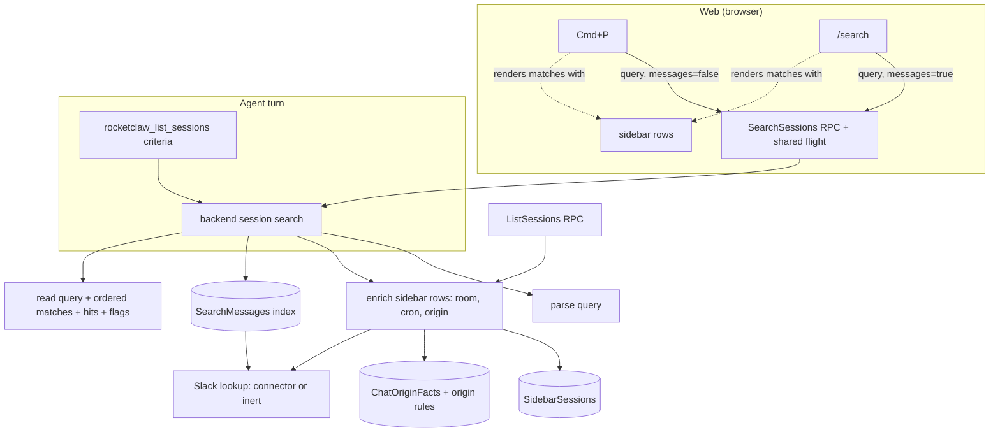

# Unified Session Search - Plan

## Goal Capsule

- **Objective:** An agent can use any query a person types into Cmd+P or `/search`, and gets back the chats `/search` would show for it.
- **Means:** one Go session search in `backend` that parses the Web search language and evaluates it; Cmd+P, `/search` and `rocketclaw_list_sessions` all call it, and the browser's matching code is deleted (KTD1, KTD2).
- **Authority:** Product Contract Requirements win on behavior. Key Technical Decisions win on mechanism within those Requirements. Units override neither. `AGENTS.md` at the repo root governs code style, tests and verification.
- **Stop conditions:** stop and ask if the Go source CLOC count would enter its hazard zone (above 23,000 of 23,500), if a Requirement cannot hold without a new user-visible behavior not named here, or if a Web behavior listed in R14–R19 has to be dropped.
- **Execution profile:** Deep. One JJ change per unit, shipped as one PR.
- **Finishing:** `ce-work` implements and verifies locally. Shipping goes through the normal PR flow.

---

## Product Contract

### Summary

`rocketclaw_list_sessions` gains a required `criteria` string that takes the Web session search language. The backend gets the only parser and matcher for that language. Cmd+P and `/search` send the typed query to a new `SearchSessions` RPC and render what it returns, including the filter pills. `agent:` and `room:` become real operators in the query text.

### Problem Frame

People find chats on RocketClaw Web with Cmd+P and `/search`, using free text plus `tag:`, `cron:`, `is:`, `sort:` and the agent/room pickers. All of that matching runs in the browser (`internal/rocketclaw/web/src/ui.tsx`: `sessionSearchTerms`, `sessionMatchesSearch`, `compareSessions`). Agents only have `rocketclaw_list_sessions`, which lists chats by time and has no filter. An agent asked to "find the customer chats tagged billing from last week" cannot do what a person does in one query. A second, Go copy of the browser grammar would drift from the first, so the language moves to the server and the browser keeps none of it.

### Requirements

**Query language**

- R1. One grammar serves all three surfaces: free text, `tag:V`, `cron:V`, `agent:V`, `room:V`, `is:pinned`, `is:forked`, `is:cron`, `sort:newest`, `sort:oldest`. Operator keys are case-insensitive. A term must stand alone between whitespace.
- R2. `tag:`, `cron:`, `agent:` and `room:` values match exactly and case-sensitively. A value may be a JSON-quoted string. Repeated terms of the same key must all match.
- R3. A malformed or unknown term (`tag:""`, an unclosed quote, `is:foo`, `status:open`) is searched as free text, as Web does today.
- R4. Free text is one case-insensitive substring, using Go lowercase rules, matched against name, room, last-message preview, agent, session label and chat origin text. When message search is on, it also matches message text.
- R5. `room:` matches only Slack thread chats, against the room name Web shows, including the channel-ID fallback for unresolved rooms.
- R6. Only Web-visible chats are searched: managed chats with history, excluding cron producer chats and External MCP private chats.

**Results**

- R7. Without `sort:`, Cmd+P orders pinned chats first, then by last activity, as the sidebar does. `/search` additionally puts chats with message hits first. With `sort:`, order is by last activity, newest or oldest, missing times last, ties by ID; the last `sort:` term wins.
- R8. Each matched chat reports which field matched (Name, Room, Agent, Session, Origin, or Preview) and that field's text, so the browser keeps no field logic.
- R9. Message hits are kept only for chats that pass every filter term, and report the Slack user/group IDs whose names matched.
- R10. Every result says whether the message index and the session summaries were complete when it ran.

**Agent tool**

- R11. `rocketclaw_list_sessions` takes a required `criteria` string. Empty or whitespace-only criteria keeps today's output exactly: every stored conversation, by latest entry.
- R12. Non-empty criteria returns only the chats `/search` would return for the same query, within `since`/`until`, at most `limit` of them, newest first unless the criteria has `sort:`. Filtering happens before the cap.
- R13. With criteria, each row adds name, agent, room, tags and matched field. A block of matched messages follows, each with the `before_entry_id` value that makes `rocketclaw_get_session` show that message. The output ends with a line showing how the criteria was read, and notices when the cap cut results or the index or summaries were incomplete. The tool description explains the grammar.

**Web**

- R14. Cmd+P and `/search` show the server's results while typing. The previous list stays visible, dimmed, until the new one arrives. Enter opens the first row of the results for the text currently typed.
- R15. Filter pills come from the server's reading of the query. A term becomes a pill only when a response for a query containing it arrives; typed characters are never lost or moved under the caret.
- R16. Autocomplete for `tag:`, `cron:`, `is:`, `sort:`, `agent:` and `room:` still works. While the user is typing, an unfinished operator word at the end of the input is not sent: a bare key (`tag:`, `agent:`), a strict prefix of an `is:`/`sort:` keyword, or an unclosed quote. A complete term is always sent. Pressing Enter, opening a saved search, and following a link send the full query, so Web and the agent see the same chats for the same submitted text. Picking an `agent:` or `room:` value replaces any existing term of the same key.
- R17. Existing saved searches and links that carry `agent=`/`room=` keep working: they are folded into the query text once, in one canonical form.
- R18. Results refresh when the set of sidebar chats changes, as origin matching does today. A chat the server returns that the sidebar has not loaded yet does not cause a false "No matches".
- R19. A failed search shows an error. `/search` keeps its Retry; Cmd+P retries on the next keystroke.

### Key Decisions

- **Matching lives only in the backend; Cmd+P asks the server as you type.** (session-settled: user-directed — chosen over keeping browser matching with a Go/TypeScript parity test: one implementation, and the per-keystroke cost is an optimization for later.) Governs R1, R14.
- **The server returns the pills.** (session-settled: user-directed — chosen over dropping pills or keeping a small browser tokenizer: one grammar, at the cost of pills appearing one round trip late.) Governs R15, R16.
- **Criteria searches only Web-visible chats.** (session-settled: user-approved — chosen over store-wide search including private External MCP and cron producer chats: results match what a person can find.) Governs R6, R11, R12.
- **Free text in criteria also matches message text, as `/search` does.** (session-settled: user-approved — chosen over Cmd+P semantics without messages.) Governs R4, R13.
- **`since` and the 200-row cap stay required; criteria filters before the cap.** (session-settled: user-approved — chosen over unbounded criteria searches.) Governs R12.

### Scope Boundaries

- No fuzzy or subsequence matching, ranking, or new operators. Matching stays "contains".
- The command and cron modes of the palette keep their own label filters.
- The Handoff dialog's message picker keeps calling `SearchMessages` unchanged.
- No new database index or migration.

#### Deferred to Follow-Up Work

- Making Cmd+P fast again: client caching, a cheaper sessions-only path, or pills drawn before the response.
- A way to read messages after a hit (`rocketclaw_get_session` only pages backwards).
- Surfacing hits from stopped turns, which have no message ID, through `rocketclaw_get_session`.

---

## Planning Contract

### Key Technical Decisions

- KTD1. **The parser and matcher are private to `backend`; `SessionService` exposes one search method.** `frontend/rpc` imports `backend`, never the reverse, so `backend` is the lowest layer both callers reach. The method takes the query, a message-search flag and a Slack lookup, and returns the read query, ordered chat matches, message hits, tag IDs and completeness flags. Keeping the parser private means no parse error crosses a package boundary (`docs/solutions/best-practices/wrapcheck-cross-package-helper-error.md`). Implements R1–R10.
- KTD2. **A hand-written tokenizer, not a regexp.** Go's `regexp` has no lookahead for the `(?=\s|$)` boundary, and Go's `\s` is ASCII-only where the browser's is Unicode. Split on `unicode.IsSpace`, keep quoted values intact, decode them with `encoding/json`, and rebuild the leftover text by removing each term with its leading whitespace, as the browser regex did. The cases in `internal/rocketclaw/web/src/session-list.test.ts` become the Go test table. Implements R1–R3.
- KTD3. **Search walks the sidebar rows, enriched once per call.** It iterates `SidebarSessions` (the Web-visible set with name, tags, pinned, fork, agent, summary preview and time), adds the room name through the Slack lookup cached per channel, and adds cron name and origin text from `ChatOriginFacts`. Matching runs in Go. The `ListSessions` RPC switches to the same enrichment for `Title`, `Cron` and `CronName`, so the room and cron values people see are the ones matched; it keeps reading origins after the row snapshot, as its comment requires. Ponytail: a full scan per keystroke over every visible chat, about 3,750 in production; the upgrade path is pushing filter terms into SQL. Implements R4–R7.
- KTD4. **Chat-origin rules move from `frontend/rpc` to `backend`.** `decideOrigin`, `creatingCronLocator`, `parseCronRun` and their origin types move unchanged; `frontend/rpc` calls the backend versions for History origin JSON and its two other `parseCronRun` callers. This is a move, not new logic, so Go CLOC stays roughly flat. Implements R4, R6.
- KTD5. **The Slack lookup is a backend interface the connector already satisfies.** It carries the two existing connector methods `SidebarChannelAgentChoices` and `SlackTagsMatching`, with an explicit inert type that returns no names and no tags. `SlackFrontend` includes it. The RPC passes its `channels`. Bridges are built before Slack attaches, so the tool reads it from `threadBridgeManager`, which starts inert and is set in `AttachSlack` under `threads.mu`, exactly like `cronRoots`. No nil checks. Implements R5, R9.
- KTD6. **Message hits reuse `SearchMessages` unchanged.** The search calls `SessionService.SearchMessages` with the needle and the Slack tag prefixes, then drops hits whose chat failed a filter term. Its unnamed-statement plan and `index_complete` stay as they are (indexed message search plan KTD10, KTD12). Implements R4, R9, R10.
- KTD7. **One `SearchSessions` RPC; `SearchOrigins` is deleted.** Request: query text and a message-search flag. Response: the read query (each filter term's key, exact text, and start/end offsets in UTF-16 code units of the submitted query; the leftover text; the lowercased needle), ordered matches (conversation ID, field label, field text), message hits, tag IDs, `index_complete`, `summaries_complete`. The field label is a Go string enum: the first of Name, Room, Agent, Session, Origin whose value contains the needle; otherwise Preview with the preview (or session label) when the chat has no message hits; otherwise empty, because only message text matched. Identical concurrent searches share one run: the existing `searchMessages` singleflight becomes one helper used by both RPCs, keyed by the exact trimmed query plus the flag, because filter values are case-sensitive. `SearchMessages` keeps its needle key. Implements R8–R10.
- KTD8. **Last activity means the session summary's `last_updated` whenever criteria is set.** Web already orders by it. The tool applies `since`/`until`, ordering and the cap to it and prints it in `last_updated`, so a row never shows a time outside the agent's window. Chats with no summary yet cannot match; the summaries notice says so. Empty criteria keeps the old `MAX(entry_timestamp)` path untouched. Implements R11, R12.
- KTD9. **Tool output stays TSV with fixed extra columns and a second block.**
  - Session rows gain `name`, `agent`, `room`, `tags` and `matched` when criteria is set. The existing `turns` and preview columns keep coming from the per-chat scan.
  - `matched` prints the field label, `messages` when only message text matched, and nothing when the criteria has no free text.
  - A `messages` block lists up to 3 hits per listed chat (`conversation_id`, `message_id`, `before_entry_id`, `role`, `text` truncated to 300 runes).
  - `before_entry_id` is the hit's entry ID plus one, because `rocketclaw_get_session` reads entries strictly before it. Hits without a message ID (stopped turns) are left out of the block, so every printed hit can be opened.
  - Trailing lines: `[criteria: …]` with the recognized terms and needle, then `[truncated: N more matching sessions]`, `[message index incomplete]`, `[session summaries incomplete]` when they apply.
  - `criteria` joins the required list, since tool schemas are strict, and the description documents the grammar and that free text is one phrase, not keywords.
  Implements R11–R13.
- KTD10. **The browser keeps only a last-word check and pill bookkeeping.** It does not parse the grammar. It decides whether the last word is an unfinished operator (R16) to drive autocomplete and, only while typing, to leave that word out of the sent query. Pills are taken from the latest response whose query equals the sent text. A term moves from the input into a pill only when it is followed by whitespace and that response lists it; the word being typed stays in the input, and the caret keeps its place in the remaining text. Removing a pill deletes the text at that term's server-returned offsets. An `agent:`/`room:` pick removes earlier terms of the same key, by their offsets, using the term list of the response for the current sent text; if that response has not arrived, the pick sends the current text at once and applies the replacement when the response arrives. Responses for older queries are ignored by sequence, and the previous request is aborted (`docs/solutions/architecture-patterns/web-keep-alive-views-connection-budget.md`). Implements R14–R16.
- KTD11. **Request timing reuses the `/search` pattern for both surfaces.** 250 ms pause, a 1 s deadline on `/search` only, Enter submits at once, and a newer query aborts the older one. Cmd+P with an empty query shows the sidebar rows without a call. The query key includes the sorted sidebar ID set, so results refresh when chats appear (R18). Implements R14, R18.
- KTD12. **Legacy `agentFilter`/`roomFilter` fold into the query text once.** The canonical form is `agent:<v> room:<v> <query>`, values JSON-quoted when they contain whitespace or start with `"`. Saved tabs are rewritten once on load, URLs stop writing `agent=`/`room=`, and an incoming link with them is folded the same way so tab de-duplication still matches. Implements R17.

### High-Level Technical Design



The grammar, as directional guidance:

```text
query  := token*                      ; tokens split on Unicode whitespace
token  := term | text
term   := key ":" value               ; key case-insensitive
key    := "tag" | "cron" | "agent" | "room"
value  := json-string | non-space+    ; empty or undecodable -> token is text
term   := "is:" ("pinned"|"forked"|"cron") | "sort:" ("newest"|"oldest")
text   := the query with each term removed along with its leading whitespace, then trimmed
needle := Go-lowercase(text)
```

Who decides what, per surface:

| Concern | Cmd+P | `/search` | Tool |
|---|---|---|---|
| Message hits | off | on | on |
| Default order | pinned, then activity | hits first, then pinned, then activity | newest first |
| Time window | none | none | `since`/`until` on summary time (KTD8) |
| Cap | none | none | `limit`, filtered first |

### System-Wide Impact

- **Web latency:** Cmd+P goes from in-browser filtering to one round trip per pause in typing, plus a full scan per call (KTD3). Accepted for now.
- **Connection budget:** one in-flight search per input, aborted on the next query; no new stream.
- **Agent scope:** with criteria, the tool no longer sees private External MCP or cron producer chats. Without criteria it is unchanged.
- **Web protocol:** the proto hash changes, so open tabs reload once after deploy.
- **Slack:** `SlackTagsMatching` may refresh the user directory when it is 8 hours old, so the first search after that can be slow. Tool turns that run before Slack attaches see no room names and no mention matches.

### Risks

| Risk | Mitigation |
|---|---|
| Go grammar drifts from what the browser accepted | The `session-list.test.ts` cases are ported as the Go table before the browser code is deleted |
| Per-keystroke scans load the database | One flight per identical query; abort on newer input; measure Cmd+P latency on 3,750 seeded chats and record it in the PR |
| Pills arrive late and the input jumps | Only whitespace-terminated terms listed by the response for the exact sent text become pills; the caret keeps its place (KTD10) |
| Folded saved searches create duplicate tabs | One canonical fold used for both stored tabs and incoming links (KTD12), with a test |
| `protoc-gen-go` v1.36.12 is not on PATH | Install that exact version before regenerating; the generated header pins it |
| Lint rewrites parser test strings with repeated words | Interleave tokens in fixtures; check the diff after `make lint` (`docs/solutions/best-practices/dupword-fix-rewrites-repeated-test-strings.md`) |

### Sources & Research

- Browser search today: `internal/rocketclaw/web/src/ui.tsx` (`sessionSearchTerms`, `matchesSession`, `sessionMatchesSearch`, `compareSessions`, `useSessionOrigins`, `paletteRows`, `SearchResults`, `SearchMatches`, `searchInput`, `SessionSearch`, `SearchTabs`).
- Server pieces: `internal/rocketclaw/frontend/rpc/server.go` (`listSessions`, `decideOrigin`, `creatingCronLocator`, `parseCronRun`), `internal/rocketclaw/frontend/rpc/session_commands.go` (`searchMessages`, `searchOrigins`), `internal/rocketclaw/backend/store.go` (`SidebarSessions`, `ChatOriginFacts`), `internal/rocketclaw/backend/message_search.go` (`SearchMessages`, `visibleChatsSQL`).
- Slack late binding: `internal/rocketclaw/backend/runtime.go` (`SlackFrontend`, `AttachSlack`), `internal/rocketclaw/backend/thread_bridges.go` (`cronRootSender`, `noCronRoots`), `internal/rocketclaw/frontend/slack/connector.go`.
- Visibility by query, never by ID shape: `docs/solutions/logic-errors/slash-in-conversation-id-is-not-a-delegation-history.md`.
- Prior search decisions still in force: `docs/plans/2026-10-02-1252-feat-session-tags-plan.md` (exact tags, quoting), `docs/plans/2026-10-05-1839-fix-web-search-links-tags-feedback-plan.md` (`sort:` semantics, deep links; its "operators stay client-side" note is superseded here), `docs/plans/2026-09-29-1053-feat-web-search-page-plan.md` (timing, shared flight), `docs/plans/2026-10-08-1107-feat-indexed-message-search-plan.md` (Go lowercase, unnamed statement, `index_complete`).
- CLOC at planning time: Go 22,236 of 23,500 (hazard above 23,000); web 5,615 of 7,500.

---

## Implementation Units

Order: U1, U2, U3, U4, U6, U5.

### U1. Move chat-origin rules into backend

- **Goal:** Let the backend decide a chat's origin, cron name and origin text.
- **Requirements:** R4, R6.
- **Dependencies:** none.
- **Files:**
  - `internal/rocketclaw/backend/origin.go` (new)
  - `internal/rocketclaw/backend/origin_test.go` (moved from `internal/rocketclaw/frontend/rpc/origin_test.go`)
  - `internal/rocketclaw/frontend/rpc/server.go`
- **Approach:**
  1. Move `decideOrigin`, `creatingCronLocator`, `parseCronRun` and the origin types per KTD4, exporting only what `frontend/rpc` still calls.
  2. Point `listSessions`, History origin JSON and the other `parseCronRun` callers at the backend versions.
- **Patterns to follow:** the move of the attachment strip into backend in the indexed message search plan (U7 there).
- **Test scenarios:**
  - The moved `TestParseCronRun`, `TestCreatingCronLocator` and `TestOriginJSON` cases pass unchanged in `backend`.
  - `TestChatOriginFactsMatchHistory` still passes in `frontend/rpc`.
- **Verification:** no behavior change; `frontend/rpc` and `backend` tests pass with only the moved tests edited.

### U2. Slack lookup interface and late binding

- **Goal:** Give the backend search room names and Slack tag matches from the connector, with an inert default.
- **Requirements:** R5, R9.
- **Dependencies:** none.
- **Files:**
  - `internal/rocketclaw/backend/runtime.go`
  - `internal/rocketclaw/backend/thread_bridges.go`
  - `.mockery.yml`
  - regenerated `*_mocks_test.go` for `SlackFrontend` in `internal/rocketclaw/backend` and `cmd/rocketclaw`
  - `internal/rocketclaw/backend/runtime_test.go`
- **Approach:**
  1. Add the interface and its inert type per KTD5, and include it in `SlackFrontend`.
  2. Add a field on `threadBridgeManager`, initialized inert, set in `AttachSlack` under `threads.mu`.
  3. Regenerate mocks with mockery v3.
- **Patterns to follow:** `cronRootSender` / `noCronRoots` and their assignment in `AttachSlack`.
- **Test scenarios:**
  - Before `AttachSlack`, the bridge's lookup returns no room name and no tag IDs.
  - After `AttachSlack` with a mock frontend, the bridge's lookup calls the mock.
- **Verification:** `*slackconnector.Connector` still satisfies `SlackFrontend` (compile check in `cmd/rocketclaw`); no new nil checks on the lookup.

### U3. Backend session search

- **Goal:** Parse and evaluate the Web search language over Web-visible chats in one backend method.
- **Requirements:** R1–R10.
- **Dependencies:** U1, U2.
- **Files:**
  - `internal/rocketclaw/backend/session_search.go` (new)
  - `internal/rocketclaw/backend/session_search_test.go` (new)
  - `internal/rocketclaw/frontend/rpc/server.go` (`listSessions` uses the shared enrichment)
  - `internal/rocketclaw/frontend/rpc/server_test.go`
- **Approach:**
  1. Write the tokenizer and term rules (KTD2).
  2. Enrich sidebar rows with room, cron name and origin text (KTD3), reusing it in `listSessions`.
  3. Evaluate terms and free text (R2–R6), compute the field label and text (R8), and order per R7.
  4. With message search on and a non-empty needle, fetch hits with Slack tag prefixes and keep only hits for chats that passed the filters (KTD6).
  5. Return the read query, matches, hits, tag IDs and both completeness flags.
- **Execution note:** Port the grammar and matching cases of `session-list.test.ts` to Go first and make them fail, then implement. Its unfinished-word cases (`is:`, `is:pin`, `sort:ne`, bare `cron:`, `outage is:pin`) are browser typing behavior: in Go they are read as free text per R3, and in the browser they stay as tests of the last-word check (R16).
- **Patterns to follow:** `SidebarSessions` iteration; `searchMessages` tag-prefix construction in `session_commands.go`; `newTestSessionService` fixtures.
- **Test scenarios:**
  - Ported table: tags match exactly and AND together; JSON-quoted values such as `tag:"say \"hello\""` and `tag:"is:pinned"` decode; `tag:Customer` does not match `customer`; `prefix-tag:x`, bare `tag:`, an unclosed quote, a bad escape and `tag:""` stay text.
  - Ported table: `IS:PINNED SORT:OLDEST` works; the last `sort:` wins; oldest, newest and default orders match the fixtures `[b,a,e,c,d]`, `[a,e,b,c,d]`, `[b,c,e,d,a]`.
  - Ported table: `is:cron` uses the recorded cron origin, not text; `cron:daily` and `CRON:daily` match; `cron:dai` and `cron:Daily` do not; `cron:"Weekly report"` matches; `cron:daily report` searches `report`.
  - `agent:main` matches only agent `main`; `agent:main agent:other` matches nothing; `agent:"two words"` decodes.
  - `room:support` matches a Slack thread whose room is `support` and never a Web chat; an unresolved room matches its channel ID.
  - Free text matches each of name, room, preview, agent, session label and origin text, and the field label is the first that contains it, falling back to Preview only when the chat has no message hits; a chat matched only by message text has an empty label.
  - A cron producer chat, an External MCP private chat and a `web:cron:…` handoff chat behave per R6 (the first two never appear).
  - With message search on, a message hit in a chat excluded by `tag:` is dropped; tag IDs come from a mention match.
  - With message search off, message text never causes a match.
  - `summaries_complete` is false while a visible chat has no summary; `index_complete` mirrors `SearchMessages`.
  - Duplicate-word fixtures are interleaved so lint does not rewrite them.
- **Verification:** the Go table covers every grammar and matching case in `session-list.test.ts`, with unfinished words read as text; `ListSessions` returns the same titles and cron flags as before.

### U4. SearchSessions RPC

- **Goal:** Serve the backend search to Web and remove `SearchOrigins`.
- **Requirements:** R7–R10.
- **Dependencies:** U3.
- **Files:**
  - `internal/rocketclaw/web/proto/web.proto`
  - `internal/rocketclaw/frontend/rpc/web.pb.go`, `internal/rocketclaw/frontend/rpc/protocol.gen.go` (regenerated)
  - `internal/rocketclaw/frontend/rpc/session_commands.go`
  - `internal/rocketclaw/frontend/rpc/transport.go`, `internal/rocketclaw/frontend/rpc/http.go`
  - `internal/rocketclaw/frontend/rpc/server_test.go`
  - `internal/rocketclaw/web/src/entry-transport.test.ts`
- **Approach:**
  1. Add the messages and RPC per KTD7, and delete `SearchOrigins` messages, handler, registration and tests.
  2. Extract the shared-flight code from `searchMessages` into one helper used by both RPCs with their own keys.
  3. Register the method in every table and list `transport.go` and `http.go` keep, and require `query`.
- **Patterns to follow:** `searchMessages` flight and its tests; `ListSessions` principal check.
- **Test scenarios:**
  - An unauthenticated call is rejected before any search runs.
  - Two concurrent identical calls run the backend search once; one caller cancelling leaves the other's result intact; all cancelling stops the run.
  - `tag:A` and `tag:a` do not share a flight.
  - The response carries terms with their exact text, leftover text, needle, ordered matches with labels, hits, tag IDs and both flags.
  - `SearchMessages` still behaves as before (existing tests unchanged).
  - `/api/SearchOrigins` is no longer routed.
- **Verification:** the proto hash check in `api.test.ts` passes after regeneration; the method table test lists `SearchSessions` and not `SearchOrigins`.

### U6. `criteria` on rocketclaw_list_sessions

- **Goal:** Let agents search chats with the Web search language.
- **Requirements:** R11–R13.
- **Dependencies:** U2, U3, U4 (the parity test calls `SearchSessions`).
- **Files:**
  - `internal/rocketclaw/backend/session_tools.go`
  - `internal/rocketclaw/backend/bridge.go` (pass the bridge's Slack lookup to the tool)
  - `internal/rocketclaw/backend/session_tools_test.go`
  - `README.md`
- **Approach:**
  1. Add `criteria` to the parameters, required list and description (KTD9).
  2. Trim it; empty keeps the current path byte for byte (R11).
  3. Otherwise run the backend search with message search on, filter by `since`/`until` on summary time, order, cap, then reuse the per-chat scan for `turns` and previews (KTD8).
  4. Print the extra columns, the messages block and the trailing lines (KTD9).
  5. Update the tool line in `README.md`.
- **Patterns to follow:** existing `listSessionsTool` TSV escaping and exact-output tests.
- **Test scenarios:**
  - `criteria: ""` and `criteria: "   "` produce the same output as today in `TestSessionToolsStoredContract`, including cron, private MCP and `exec:` IDs.
  - `criteria: "tag:billing"` lists only visible chats with that tag, newest first, with name, agent, room and tags filled and `matched` empty.
  - A private External MCP chat and a cron producer chat never appear with criteria, even when their text matches.
  - Three matching chats with `limit: 2` print two rows and `[truncated: 1 more matching sessions]`.
  - `sort:oldest` with a cap returns the oldest chats inside the window.
  - A chat whose summary time is outside `since` is excluded even if a later entry exists without a summary update; its `last_updated` column shows the summary time.
  - Free text matching only a message prints the chat with `matched` set to `messages` and up to three message rows, leaving out stopped-turn hits that have no message ID; passing a row's `before_entry_id` to `rocketclaw_get_session` returns a page whose last entry contains that message.
  - An incomplete message index and a chat without a summary each add their notice line.
  - The `[criteria: …]` line shows `status:open` read as text.
  - The Code Mode call strings in `TestSessionToolsBridgePermissions` include `criteria`; a call without it fails the strict schema.
  - Parity: for a fixture with tags, agents, rooms, pinned, forked and cron chats, the same query through `SearchSessions` (messages on) and through the tool with an epoch `since` and `limit: 200` returns the same chat set; `outage tag:` is one of the parity queries.
- **Verification:** exact-output tests pass; the parity test passes; README tool line describes `criteria`.

### U5. Web uses SearchSessions

- **Goal:** Cmd+P and `/search` render server results and pills, and the browser matching code is gone.
- **Requirements:** R14–R19.
- **Dependencies:** U4.
- **Files:**
  - `internal/rocketclaw/web/src/ui.tsx`
  - `internal/rocketclaw/web/src/types.ts`
  - `internal/rocketclaw/web/src/session-list.test.ts`
  - `internal/rocketclaw/web/src/session-list.browser.test.ts`
  - `internal/rocketclaw/web/src/search-page.browser.test.ts`
  - `internal/rocketclaw/web/src/tabs.browser.test.ts`
  - `internal/rocketclaw/web/README.md`
- **Approach:**
  1. Delete `sessionSearchTerms`, `matchesSession`, `sessionMatchesSearch`, `compareSessions`, `useSessionOrigins`, the session branch filtering in `paletteRows`, and the matching, visible-set and field logic in `SearchResults` and `SearchMatches`.
  2. Add one search hook used by both surfaces with the timing and refresh rules of KTD11 and the pill and stale-response rules of KTD10.
  3. Map returned IDs to sidebar rows in server order; an unmapped ID keeps the list in its pending state rather than reporting "No matches" (R18).
  4. Keep autocomplete driven by the last-word check (R16); `agent:`/`room:` picks write terms into the query instead of separate state.
  5. Fold legacy saved tabs and URLs per KTD12 and stop writing `agent=`/`room=`.
  6. Use the server's needle and tag IDs for highlighting, and its flags for the incomplete notices and the Cmd+P error line (R19).
  7. Update the search section of `internal/rocketclaw/web/README.md`, including that `agent:`/`room:` are now operators.
- **Patterns to follow:** the `SearchResults` request code (pause, deadline, abort, version guard); `FilterPill`.
- **Execution note:** Rewrite the browser test mocks to answer `SearchSessions` from fixed fixtures; semantic coverage now lives in the Go tests from U3, so mocks must not re-implement matching.
- **Test scenarios:**
  - Typing `foo` in Cmd+P sends one `SearchSessions` call with messages off and renders the returned IDs in returned order.
  - Typing fast then Enter opens the first row of the response for the final text, not the previous list; if that response is empty or fails, Enter does nothing.
  - A stale response arriving after a newer one changes nothing; the older request was aborted.
  - Typing `tag:bug` sends `tag:bug` and shows a pill only after the response; typing `tag:` or `is:pi` sends nothing new and opens autocomplete.
  - A saved tab whose query ends in `is:pinned` reopens with that filter applied.
  - Removing a pill deletes that term's text and sends a new query; in `prefix-agent:main agent:main`, removing the `agent:main` pill leaves `prefix-agent:main` intact.
  - Pressing Enter on `outage tag:` sends the full text; a saved tab with that query reopens sending the full text.
  - Picking `agent:main` then `agent:other` leaves only `agent:other` in the query, including when the second pick happens before the response to the first arrives.
  - Typing `tag:bug ` turns `tag:bug` into a pill once the response arrives, with the caret still after the remaining text; typing `tag:bu` shows no pill.
  - A legacy tab `{query:"outage", agentFilter:"main"}` loads as `agent:main outage`; opening `?q=outage&agent=main` reuses that tab.
  - A server match not yet in the sidebar shows the pending state, then the row after the sidebar loads it.
  - `/search` renders hit groups first, field labels and text from the response, and the incomplete-index and incomplete-summaries notices from its flags.
  - A failed call shows Retry on `/search` and an error line in Cmd+P.
  - Empty Cmd+P shows sidebar rows without a request.
  - No request goes to `/api/SearchOrigins`.
- **Verification:** web unit and browser tests pass; web CLOC goes down; no browser code evaluates filter terms.

---

## Verification Contract

| Gate | Command or check | Applies to |
|---|---|---|
| Format | `gofmt` on touched Go files | U1–U4, U6 |
| Go tests | `go test ./...` with `ROCKETCLAW_TEST_DATABASE_URL` pointing at a disposable `postgres:18` (or `make -C internal/rocketclaw test`, which starts one) | U1–U4, U6 |
| Lint | `make lint`, then check `jj diff --git` for rewritten test strings | all |
| Full suite, coverage, Go CLOC | `make test`, coverage compared against the real base commit | all |
| Web | `make -C internal/rocketclaw/web test lint check-cloc-budget` with `ROCKETCLAW_PLAYWRIGHT_MODULE` and `ROCKETCLAW_CHROMIUM` set | U4, U5 |
| Proto parity | `go generate ./internal/rocketclaw/frontend/rpc` with `protoc-gen-go` v1.36.12, then `api.test.ts` hash check | U4 |
| Mocks | `go generate ./cmd/rocketclaw` | U2 |
| Latency | Seed 3,750 chats locally, time Cmd+P `SearchSessions` for a three-letter query, and record it in the PR | U4 |

## Definition of Done

- Every Requirement holds and is covered by a test named in its unit.
- Every Verification Contract gate passes, including both CLOC budgets; Go stays at or below 23,000.
- No browser code parses or evaluates filter terms beyond the last-word check; `SearchOrigins` is gone from proto, server, web and tests.
- `README.md` and `internal/rocketclaw/web/README.md` describe `criteria` and the new `agent:`/`room:` operators; README impact is stated in the PR.
- No experimental or abandoned code remains in the diff.
