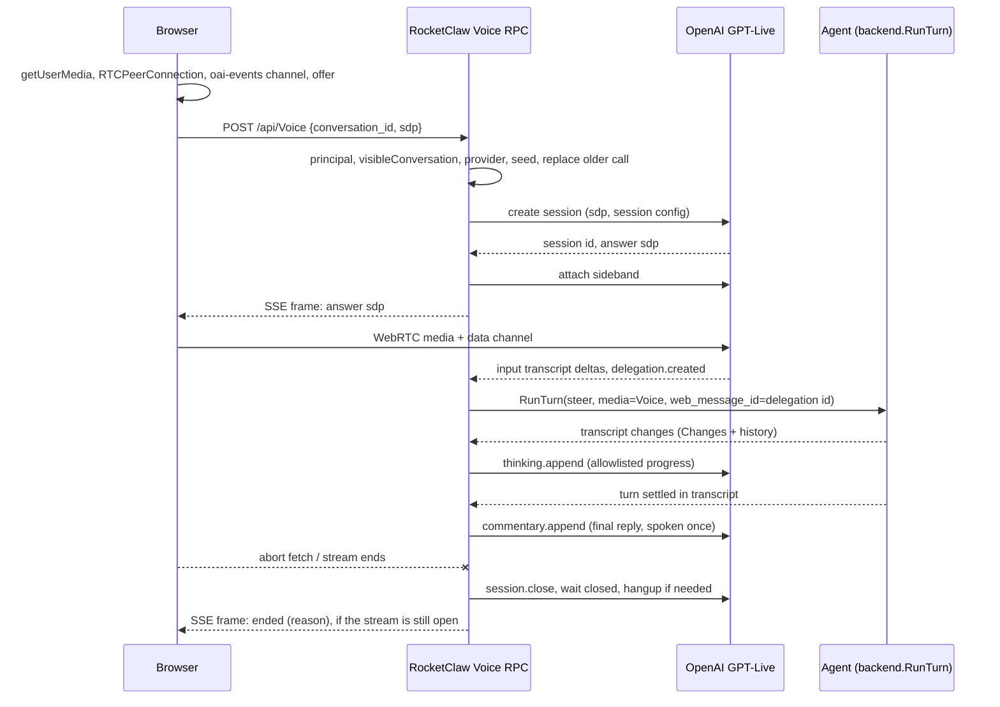
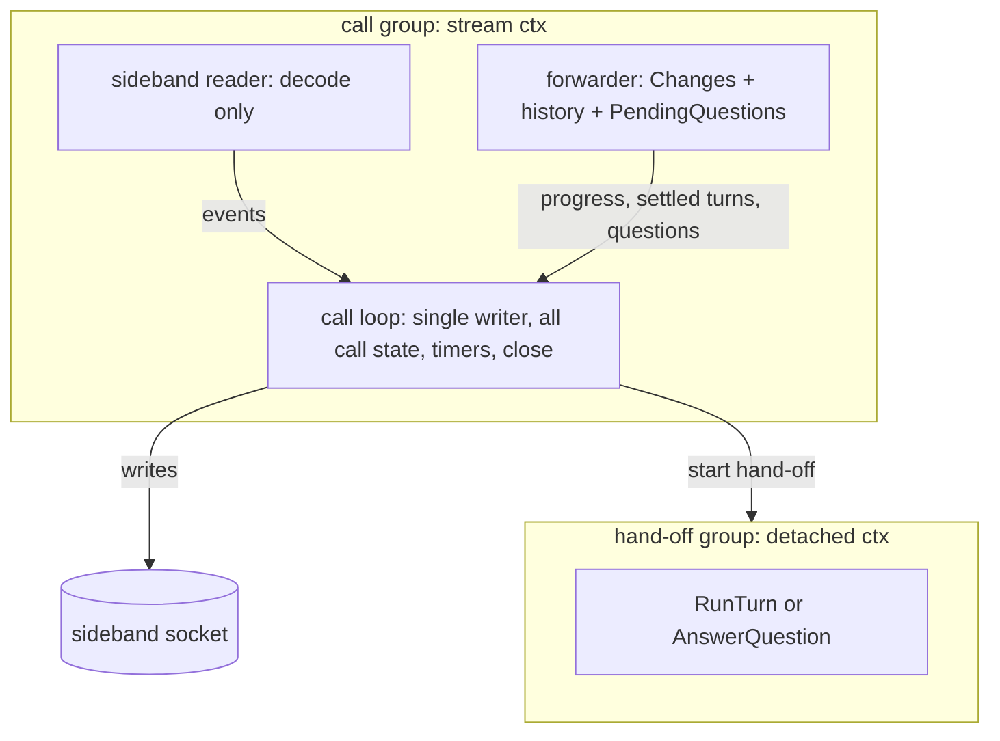
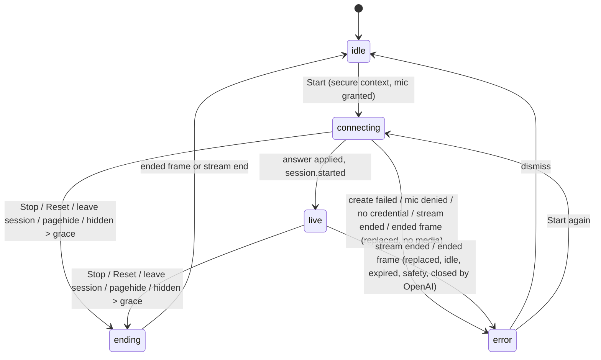
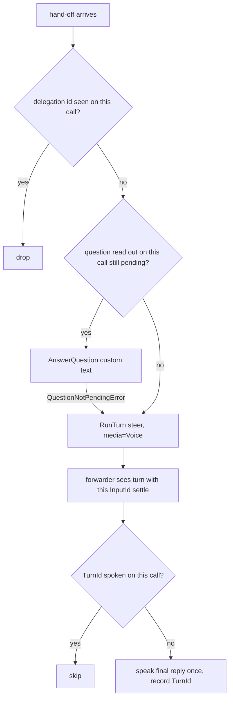

# Web Voice Mode - Plan

## Goal Capsule

- **Objective:** A person can talk to a RocketClaw agent out loud and hear it answer. On the phone that happens in a dedicated Voice page with one long-running conversation. At the desk it happens in any open session, without typing.
- **Means:** the browser streams audio over WebRTC straight to OpenAI's GPT-Live voice model. RocketClaw creates each call with the agent's provider credentials and holds a server-side control socket. Through that socket, every task the voice model hands off becomes a normal Web turn for the agent, and the agent's progress and reply are fed back to be spoken (KTD1, KTD2, KTD5).
- **Authority:** Product Contract Requirements win on behavior. Key Technical Decisions win on mechanism within those Requirements. Units override neither. `AGENTS.md` at the repo root governs code style, tests and verification.
- **Stop conditions:** stop and report if any of these happens:
  - U1's live probe shows a wire fact this plan relies on is false. Examples: the public sideband never receives input transcript deltas, or the ChatGPT route cannot complete a call. Update the plan before building on it.
  - The Go source CLOC count would enter its hazard zone (above 23,000 of 23,500).
  - The TS count would pass 7,250 of 7,500.
  - A Requirement cannot hold without a database migration.
- **Execution profile:** Deep. One JJ change per unit, shipped as one PR. U1 runs first and gates the rest.
- **Finishing:** `ce-work` implements and verifies locally. Shipping goes through the normal PR flow.

---

## Product Contract

### Summary

RocketClaw gains voice mode on the Web, in two places:

- A new Voice page, a sibling of Cron and Search, holds one long-running voice conversation per person. It has an agent picker and a Reset button that starts a fresh conversation.
- Every session's composer gets a voice toggle that turns that conversation into a live voice call.

In both places the person speaks with OpenAI's voice model. The voice model hands real work to the conversation's agent as ordinary turns. The agent's progress and final reply come back as speech. Requests and replies land in the conversation's normal transcript.

### Problem Frame

RocketClaw is used mostly through the Web page, and today that means typing. Away from the desk, on a phone, typing to an agent is slow. The person wants to just talk, the way the ChatGPT and Codex apps allow. At the desk, the person sometimes wants to talk through a task in an open session instead of typing.

Plain dictation (speech to text into the composer) would not give the conversational experience the person asked for. The voice model must listen, answer, acknowledge, and relay agent progress on its own while the agent works.

### Requirements

**Voice page**

- R1. The Web app has a `/voice` page, reachable from the tab strip, the command palette and the phone bottom navigation.
- R2. The Voice page keeps one current voice conversation per person per device and reuses it across visits until Reset.
- R3. The Voice page has an agent picker. The picked agent is used for a new voice conversation. Picking a different agent while idle switches the current conversation's agent the same way the composer does.
- R4. Reset ends any live call and forgets the current conversation. The next Start creates a fresh conversation with the picked agent. The old conversation stays in the session list and in search. A turn already running in the old conversation keeps running there.
- R5. The Voice page shows the call state (idle, connecting, live, ending, error) and elapsed time. It shows live captions from the call, which are not stored, and a link that opens the conversation.

**Composer voice**

- R6. Every session composer on screens at least 640px wide has a voice toggle that starts and ends a live voice call on that session's conversation. It is not dictation: nothing is typed into the composer. Narrower screens use the Voice page, because the composer row has no room for another button there.
- R7. The voice toggle is unavailable on the new-chat composer until the conversation exists. Leaving the session ends its call.

**Conversation behavior during a call**

- R8. Each task the voice model hands off becomes a Web user message in the conversation, marked as voice (`media=Voice`) with the person as principal. It is delivered as a steer, matching the Web default. Its text is stored as plain text: `$` prefixes in it never run commands, skills or workflows.
- R9. Each hand-off is stored as one message, shaped like Codex's: the request, plus the back-and-forth between the person and the voice model since the previous hand-off as quoted context. That way the agent understands "sure". Talk after the last hand-off of a call is not stored.
- R10. While the agent works on a handed-off request, its public progress reaches the voice model as silent context. Public progress means tool names with their state, and partial assistant text. When the turn finishes, its final reply is spoken. This matches the ChatGPT and Codex apps.
- R11. A turn's final reply is spoken at most once per call, and only on the call that handed off a request in that turn. Replies to turns this call did not start reach the voice model as silent context only.
- R12. When the agent asks a question (`ask_user_question`) during a call, the voice model reads it out. The person's next spoken answer goes to that pending question instead of becoming a new message. Only questions this call has read out can be answered this way.
- R13. A new call starts with the conversation's recent completed messages, so the voice model knows what was being discussed.
- R14. Long replies are spoken as a short summary. Code blocks and tables are not read aloud. The full reply stays in the transcript.
- R19. The voice model never receives tool arguments, tool results, reasoning, developer messages or attachments. It receives only the R10 progress, replies, questions, and the R13 seed text.

**Credentials, lifetime, errors**

- R15. A call uses the credentials of the provider behind the conversation agent's model, whether that provider uses an API key or a ChatGPT login. Credentials never reach the browser.
- R16. A call ends in any of these cases, so no OpenAI voice session is left running unattended:
  - the person stops it;
  - the page's connection to RocketClaw ends;
  - the page is hidden for more than a short grace period;
  - no audio starts shortly after connecting;
  - a long idle stretch passes;
  - OpenAI ends the session.
- R17. Ending a call never stops agent turns. Replies to turns that finish after the call ended land in the transcript only.
- R18. Failures show a clear message and are never retried automatically. Failures include a missing or rejected credential, an unsupported route, no microphone permission, a page without a secure context, and OpenAI ending the session.
- R20. A conversation has at most one live call. Starting a call on a conversation that already has one ends the older call, so moving from phone to desk just works.

### Key Decisions

- **Credentials follow the agent's provider, both auth modes.** (session-settled: user-directed — chosen over supporting only API keys: the person wants voice to work with whatever provider an agent already uses, accepting that the ChatGPT route is unofficial.) Governs R15.
- **HTTPS for the phone comes from `tailscale serve`; RocketClaw gets no TLS code.** (session-settled: user-approved — chosen over RocketClaw serving TLS itself: keep the server unchanged and use the Tailscale tooling already in place.) Governs R18.
  - Conflict call-out: identity is a known cost. RocketClaw identifies browsers by connection IP, and behind `tailscale serve` every request arrives from `127.0.0.1`. The supported setup maps `127.0.0.1` to the owner in `web_users`. That makes every process on the host, and every tailnet peer the ACL lets reach the `serve` port, act as the owner (KTD9).
- **The person hears live progress plus the final reply.** (session-settled: user-directed — chosen over speaking only the final reply: match the ChatGPT and Codex app experience.) Governs R10, R11.
- **The Voice page picks its agent with the existing picker.** (session-settled: user-directed — chosen over always using the default agent.) Governs R3.
- **RocketClaw's server, not the browser, handles hand-offs.** (session-settled: user-approved — chosen over relaying hand-offs through the browser: the work keeps flowing if the tab stalls.) Governs R8, R10. On the public route, data-channel restrictions also stop the browser from injecting fake results (KTD7). On the Codex route the browser could send any client event, which is acceptable because the browser is already the authenticated owner.
- **Hand-offs are stored the way Codex stores them: the request plus the back-and-forth since the previous hand-off; Reset keeps the old conversation; calls start seeded with recent messages.** (session-settled: user-directed — chosen over storing only the person's bare words, which leaves the agent with "sure" and no context; also chosen over wiping on reset and starting cold.) Governs R4, R9, R13.

### Scope Boundaries

- No TLS listener, certificates, or HTTP/2 configuration in RocketClaw.
- No dictation mode and no speech-to-text into the composer.
- No voice in Slack, cron reports, or External MCP.
- No stored audio recordings (`store` stays false). Voice talk is saved only as context inside a hand-off message (R9).
- No database migration. The Voice page's current conversation is remembered per device in browser storage, so it does not follow the person from phone to desktop.
- No automatic call retries and no sideband reconnect loop beyond what U1 proves necessary.

#### Deferred to Follow-Up Work

- A Stop-turn button on the Voice page (today `$stop` from the session view covers it).
- Choosing a voice per agent or per person. This plan uses one fixed voice per route (KTD7).
- Keeping a Voice page call alive across in-app tab switches (warm mounting). The page tears the call down when it unmounts.
- Showing the pending-question card on the Voice page. Questions are spoken and answered by voice. The card stays in the session view.

---

## Planning Contract

### Key Technical Decisions

- KTD1. **Two wire dialects as data on one private struct, with a switch at three places.** (session-settled: user-directed — chosen over API-key only: inherits the credentials Key Decision; governs R15.)
  - The public GPT-Live API serves `api_key` providers: `POST {base}/live/sessions` with JSON `{session, transport:{type:"webrtc", sdp}}`, which returns JSON with `session.id` and `transport.sdp`. The sideband is `wss://…/v1/live/sessions/{id}/attach`, with model `gpt-live-1`.
  - Codex's internal route serves `chatgpt` providers: `POST https://chatgpt.com/backend-api/codex/realtime/calls?intent=quicksilver&architecture=avas` with JSON `{sdp, session}`. It returns raw SDP with the call ID in `Location`. The sideband is `wss://api.openai.com/v1/live/{call_id}` with `openai-alpha: quicksilver=v2`, bearer, and `chatgpt-account-id`, with model `gpt-live-1-codex`.
  - Most differences are data: URLs, headers, model, voice, event-name table, chunk limit, seed field name. Those live in one private dialect struct filled from the provider's `RocketCodeAuth`.
  - A `switch` covers the only three behavioral differences: parsing the create response, the source of hand-off text (KTD4), and the outbound payload shape. The internal event kind is a Go enum type.
  - Chosen over a private interface with two implementations: same behavior, fewer lines and concepts, and nothing is injected.
  - The ChatGPT route's base URLs are unexported package variables, which is the test seam. They are never a config field and never reuse `APIBaseURL`, so configuration can never send a ChatGPT token to another host.
  - Conflict call-out: OpenAI's docs say Sign in with ChatGPT does not cover audio or `backend-api`. Codex also sends a device-attestation header RocketClaw cannot produce. Codex issue #35094 reports this route failing for third parties with `call_id_not_found`. U1 proves or disproves it before U3 builds it.
- KTD2. **One POST server-streaming `Voice` RPC owns a call for exactly as long as the request lives.**
  - The browser POSTs `{conversation_id, sdp}` to `/api/Voice` and reads SSE. The route is POST-only, so `CrossOriginProtection` blocks cross-site starts. It never joins the GET stream route list.
  - The handler creates the call and attaches the sideband *before* sending the first frame, which carries the answer SDP and the dialect name, so the browser knows which data-channel event names to expect. Later frames carry call state only.
  - Failures before the answer are ordinary gRPC status errors, which the HTTP bridge already returns as JSON errors. After the answer, the call ends with one terminal `ended` state frame. It carries a fixed reason: stopped, replaced, idle, no media, expired, safety, or closed by OpenAI. The browser treats that frame, or the stream ending, as the end of the call.
  - Upstream credential failures map to `FailedPrecondition` with a fixed message and the upstream status. `Unauthenticated` and `PermissionDenied` already mean browser identity and conversation visibility.
  - Aborting the fetch cancels the handler's context, which starts the KTD8 close.
  - Rationale: no stop RPC, no lifecycle hook, and shutdown is already covered because `grpc.Server.Stop` cancels handler contexts without waiting for them. Do not enable `WaitForHandlers`.
- KTD3. **Goroutine layout: a call loop owns every socket write and all call state.**
  - Call group, an `errgroup.WithContext` on the stream context:
    - The sideband reader only decodes server messages and pushes events onto a channel. It selects on a channel closed when the socket closes, not on the call context, so `session.closed` still reaches the loop after cancellation.
    - The call loop is the single gorilla writer. It owns the spoken and seen sets, the transcript accumulator, the quiet-window, idle and no-media timers, and the close sequence.
    - The forwarder (KTD5) sends work to the loop with `select` on the call context.
  - Hand-off group, a plain `errgroup.Group`: one goroutine per hand-off runs `RunTurn` with `context.WithoutCancel`, because `RunTurn` blocks until the turn completes. Each returns nil. A failure becomes a silent note or a state frame, never a call cancel (R17).
  - Order on exit:
    1. When the call context ends or a terminal event arrives, the call loop runs the KTD8 close sequence while the reader is still alive. Its last step closes the socket, which ends the reader.
    2. The handler waits for the call group, then sends the terminal `ended` frame (KTD2).
    3. Only then does it wait for the hand-off group. Keeping the handler alive until turns finish matches `Prompt`, which already blocks for a whole turn. The browser has already ended the call on the `ended` frame, so it does not wait on the open stream.
  - No mutex and no atomics inside a call.
- KTD4. **A hand-off becomes a turn through `backend.RunTurn` directly, not through `Server.prompt`.**
  - Build the inbound with `protocol.NewInboundMessageFromContent(protocol.SourceWeb, protocol.InboundKindSteer, …)`. Set the principal metadata, `InboundMediaMetadataKey = "Voice"`, and `web_message_id = <delegation id>`.
  - Skipping `Server.prompt` avoids `$stop`, `$agent`, `$goal` and the delivery prefixes. But `inboundDirectSkill` and `inboundWorkflow` in `backend/bridge.go` still act on any human Web inbound's raw text. They must return nothing for `media=Voice`, and `provenanceFromInbound` must accept `"Voice"` (U2, R8).
  - The call loop keeps a set of seen delegation IDs and drops repeats before calling `RunTurn`. A re-delivered ID makes `RunTurn` return early while the turn still runs.
  - Hand-off text source:
    - Message shape (R9), matching Codex's `RealtimeDelegation` in `codex-rs/core/src/context/realtime_delegation.rs`: a request part plus a transcript part. The transcript part is `user: …` and `assistant: …` lines for the person and the voice model since the previous hand-off. Each part is capped at 4 KB: the request keeps its start, and the transcript keeps its end.
    - Public: `session.delegation.created` carries metadata only. The request part is the person's latest utterance before the hand-off. That is the last unbroken run of `session.input_transcript.delta` items, ordered by `start_ms`, that starts before the delegation's `offset_ms` with no voice-model output transcript between it and the hand-off. Wait until a delta with `end_ms` at or past `offset_ms` arrives, with a 2 s cap as the fallback. The transcript part comes from input and output transcript deltas.
    - Codex: `delegation.created` carries `item.content[].input_text`, the request as the voice model wrote it, which is the request part. The transcript part comes from the Codex transcript events, as Codex itself does.
  - Pending questions: list them with `backend.PendingQuestions`. If one exists that this call has read out, call `backend.AnswerQuestion` with the text as a custom answer. On `*QuestionNotPendingError` (via `errors.AsType`), fall through to `RunTurn`. A question that appears after the check leaves the hand-off parked as a steer until the next hand-off answers it, which is acceptable.
  - Only the person's words may answer a question (R12). A hand-off whose text is the voice model's paraphrase never calls `AnswerQuestion`; it steers as a normal message, and the question stays for the session card. That applies to Codex unless U1 shows person input transcripts on its sideband.
- KTD5. **Speaking a reply is driven by the transcript, not by `RunTurn` returning.**
  - The forwarder loops over `SessionService.Changes(ctx, id)`. It reads `SessionService.ObserveHistory` for each entry's `Active` flag and `TurnID`, and uses `transcriptEntry` output only for the allowlisted text. It lists questions with `backend.PendingQuestions`.
  - A turn is settled when no entry with its `TurnID` is active. When a turn whose user entries include one of this call's `InputId`s settles, the call loop speaks that turn's last assistant text once. The spoken `TurnId` set enforces R11. This also covers several hand-offs folded into one running turn, and a queued typed message starting right after the voice turn.
  - Questions already pending when a call starts are read out first and count as read out on that call, so a question asked while no call was live can still be answered by voice (R12).
  - Rejected: speaking when `RunTurn` returns. Every replayed assistant item is `Complete`, and a duplicate ID returns before the turn ends, so the reply would be early or skipped.
  - Rejected: `EnableResponseWait`, which never gets text for a steer that joins a running turn. Also rejected: `Runtime.Subscribe`, which blocks every conversation's delivery on slow subscribers and carries no progress.
- KTD6. **Only allowlisted fields leave the server (R19).**
  - Silent progress allows tool name plus its fixed public state, and partial assistant text from `PublicProgress`. It is deduplicated by entry fingerprint, throttled to about one update every 5 s, and trimmed to one chunk (below), keeping the newest text. The public route sends `session.thinking.append`. The Codex route sends `delegation.context.append` with channel `commentary`.
  - A rejected append (a sideband `error` event) is logged without its text and ignored. It never ends the call.
  - Spoken text allows final assistant text and question text with its options. The public route sends `session.commentary.append`. The Codex route sends channel `speakable`.
  - Seed text allows completed user and assistant text with stored provenance headers stripped.
  - Never sent: tool arguments or results, reasoning, developer messages, attachments.
  - Spoken copy is shaped and chunked:
    - Fenced code and tables are replaced with a short "the code is on screen" note.
    - At most about three chunks are sent: about 1,500 characters each on public (limit 500 tokens), 500 bytes each on Codex, split on rune boundaries.
    - If text was cut, a final silent note says the full reply is in the transcript.
- KTD7. **Session config is fixed and server-side.**
  - Instructions are a short private template:
    - It names the agent and requires handing off every task.
    - It forbids inventing results and asks for brief spoken summaries.
    - It treats silent context as data, not requests.
    - It hands off only what the person said, and says how to treat questions.
  - Seed: the last up to 40 completed user and assistant messages from `history`, newest kept. Each one goes through the KTD6 shaper, so code and tables become a short note, and is cut to about 600 characters. The total stays under about 12,000 characters, which leaves headroom under the 8,192-token startup history limit for dense text. On public this goes in `input`. On Codex it goes in `initial_items`.
  - Voice: `marin` on public, `cove` on Codex.
  - On public, `client.data_channel.allowed_client_events` is limited to `session.close`, `session.input_audio.mute` and `session.input_audio.unmute`.
- KTD8. **Leak guards on both sides (R16).**
  - Browser: hang up whenever the `/api/Voice` stream ends. Also hang up on `pagehide`, and on `visibilitychange` to hidden after about 30 s.
  - Server, in the call loop:
    - No-media timeout: 60 s without any input transcript. `session.started` arrives before media flows, so it does not count.
    - Idle timeout: 5 minutes with no input transcript and no hand-off in flight, as a `time.Timer` reset on activity.
    - Session expiry needs no timer: OpenAI closes the session with reason `expired`, which arrives as a terminal event.
  - Close sequence, run by the call loop with a detached context and a 3 s budget:
    1. Send `session.close`.
    2. Wait for `session.closed` from the reader channel.
    3. On public, call `POST live/sessions/{id}/hangup` if it did not arrive.
    4. Close the socket, which unblocks the reader.
  - Do not use `context.AfterFunc(ctx, conn.Close)`: closing at cancel would prevent sending `session.close`.
  - A process shutdown cannot promise `session.close`. The browser's hang-up when the stream ends covers that case. No automatic retries (R18).
- KTD9. **HTTPS and identity through `tailscale serve`.** (session-settled: user-approved — chosen over TLS in RocketClaw: inherits the HTTPS Key Decision; governs R18.)
  - No server code changes. The docs tell the owner to:
    - run `tailscale serve` against `http://127.0.0.1:<port>`, not `localhost`, which may resolve to `::1`;
    - map `"127.0.0.1"` to themselves in `web_users`;
    - never use `tailscale funnel`;
    - limit who can reach the `serve` port with tailnet ACLs.
  - Optionally, `listen_address: 127.0.0.1:3000` closes the direct path. It also breaks the Tailscale-IP links RocketClaw hands out, so it is not the default.
  - Desktop voice also needs a secure context: the `serve` URL or `localhost`.
- KTD10. **ChatGPT credentials through one new `oai` export that owns the refresh logic.**
  - The existing refresh lives in the unexported `(*transport).token`. Move that logic into an exported function that returns a fresh `Token`, and have the transport call it. This avoids adding a one-line wrapper. Voice code reads only `Access` and `AccountID`.
  - The voice code sets headers itself on a plain `net/http` POST and a `gorilla/websocket` dial. That mirrors `internal/rocketcode/responses_websocket.go` for headers and scheme swapping, but not for close (KTD8).
  - API-key providers use `APIKey` and honor `APIBaseURL`, which is the public route's test seam.
- KTD11. **One live call per conversation, newest wins (R20).**
  - The `rpc.Server` keeps a `conversationID → cancel` map under one mutex. The stored cancel ends the older call's call group with a "replaced" cause, so that handler still sends its `ended` frame with reason replaced. Starting a call cancels and replaces any existing entry. A call removes its own entry on exit only if the entry is still its own.
  - This is the only state shared across calls. It adds shared state that KTD2's "no stop RPC, no lifecycle hook" design otherwise avoids, on purpose, to bound cost and duplicate progress. The alternative was rejecting the second call, which would strand a phone call when the person sits down at the desk.

### High-Level Technical Design

Call sequence (public dialect shown; the Codex dialect differs only in URLs, headers and event names per KTD1 and KTD4):

Goroutines inside one call (KTD3):

Call states shared by the Voice page and the composer toggle:

Hand-off routing inside one call:

### System-Wide Impact

- **Prompt provenance:** `media=Voice` becomes a real provenance value in the agent-visible prompt header. The Web header parser already handles `media=`. Voice inbounds no longer trigger direct skills or workflows.
- **Identity boundary:** with `tailscale serve`, every request is attributed to the `web_users` mapping for `127.0.0.1` (KTD9). That includes every local process on the host, such as agent `execute` tools and MCP servers, and every tailnet peer allowed to reach the `serve` port. U8 checks whether a local process calling the host's own Tailscale IP already passes WhoIs as the owner, and states how much the mapping actually adds. The direct Tailscale-IP path keeps per-user WhoIs identity, so two identity rules coexist.
- **Data sent to OpenAI per call:**
  - microphone audio;
  - up to about 12,000 characters of seed transcript;
  - allowlisted progress text;
  - replies and questions (R19).

  On the ChatGPT route this falls under the ChatGPT account's data settings, not the API's.
- **Protocol hash:** adding the `Voice` RPC changes `protoSHA256`. Open browsers reload once through `ProtocolGuard`.
- **Connections:**
  - A composer call adds one long-lived browser stream next to `/stream`. Behind `tailscale serve` the browser likely speaks HTTP/2, but direct HTTP/1.1 still has the roughly 6-connection limit (`docs/solutions/architecture-patterns/web-keep-alive-views-connection-budget.md`).
  - Server side, each call holds one dedicated Postgres LISTEN connection. No pool limit is set, so this is fine for a single owner.
- **Cost:** GPT-Live bills about $0.05 per minute, including silence. Creating a session pre-bills 15 s. KTD8 and KTD11 bound it.
- **Bandwidth:** a public sideband receives reflected audio, about 128 KB/s per call. The reader discards audio events.

### Risks

| Risk | Mitigation |
|---|---|
| ChatGPT route rejects third-party calls (attestation, `call_id_not_found`) | U1 proves it first. If it fails, the plan stops and asks. At runtime, show the R18 message telling the person to use an API-key provider. |
| Public sideband does not receive input transcript deltas, or the hand-off arrives before the last words | U1 checks both. KTD4's quiet window covers late deltas. If the sideband gets no deltas, stop and re-plan. |
| Local processes or broad tailnet ACLs act as the owner through the `127.0.0.1` mapping | U8 docs per KTD9. Agent tools that already run as the owner gain no new authority, but the docs must say so plainly. |
| Spoken text or model paraphrase triggers skills or workflows, or answers a confirmation question | U2 disables `$` parsing for voice. KTD4 answers only questions read out on this call. KTD7 instructions say to hand off only what the person said. |
| Secrets in tool output leak to OpenAI through progress | KTD6 field allowlist and a canary test in U5. |
| Duplicate or missing spoken replies | KTD5 speaks from settled transcript turns, keyed by `TurnId` per call, plus KTD4's seen-ID set. |
| A frozen phone tab, a never-connecting peer, or a server restart leaves a billed session open | KTD8 guards on both sides, plus KTD11. |
| Voice lists and model names drift (public docs, SDK and Codex disagree) | Fixed voice per dialect (KTD7). Model names are constants in one place. |
| CLOC budgets (about 1,450 Go and 1,650 TS lines before hazard zones) | One dialect struct (KTD1). No new packages. Stop condition in the Goal Capsule. |

### Sources & Research

- Codex internal protocol:
  - `codex-rs/codex-api/src/endpoint/realtime_call.rs` (create call, ChatGPT JSON shape, Location parsing)
  - `realtime_websocket/{methods.rs,methods_frameless_bidi.rs,protocol_frameless_bidi.rs}` (sideband URL, events, 500-byte chunks)
  - `core/src/realtime_conversation.rs` (`DEFAULT_FRAMELESS_REALTIME_MODEL`, `realtime_request_headers`, `v3_output_writer` channel mapping)
  - `core/src/client.rs` (`create_realtime_call_with_headers`, sideband auth headers)
  - All paths are in the local Codex checkout, commit `1badea29`.
- Public GPT-Live API:
  - developers.openai.com guides `voice-webrtc`, `voice-server-controls`, `live-delegation`, `live-conversations`, and reference `live/primary-websocket` and `live/sideband-websocket`
  - vendored `vendor/github.com/openai/openai-go/v3/live/` (v3.76.0; REST only, no sideband client)
- Repo anchors:
  - `internal/rocketclaw/frontend/rpc/server.go`: `prompt`, `history`, `transcriptEntry`, `join`, `principal`
  - `internal/rocketclaw/frontend/rpc/http.go`: stream routes, `httpInput`, `httpEvents`, `httpRPCError`
  - `internal/rocketclaw/frontend/rpc/transport.go`: method lists, `Join` stream desc, `historyRPC`
  - `internal/rocketclaw/backend/conversations.go`: `RunTurn` blocks until completion
  - `internal/rocketclaw/backend/revert.go`: `admitWeb`, `reconcileWebDB` idempotency
  - `internal/rocketclaw/backend/bridge.go`: `provenanceFromInbound`, `inboundDirectSkill`, `inboundWorkflow`
  - `internal/rocketclaw/backend/web_question.go`: `AnswerQuestion`, `QuestionNotPendingError`
  - `internal/rocketclaw/backend/transcript.go`: `Changes`
  - `internal/rocketclaw/oai/oauth.go`: `transport.token`, `setCodexHeaders`
  - `internal/rocketcode/responses_websocket.go`: websocket dial with copied auth
  - `cmd/rocketclaw/mcp.go`: External MCP turn submission
  - `internal/rocketclaw/frontend/rpc/live_test.go`: fake OpenAI `httptest` server with gorilla upgrader
- Learnings and docs:
  - `docs/solutions/architecture-patterns/web-keep-alive-views-connection-budget.md`
  - `internal/rocketclaw/frontend/rpc/README.md` "Identity boundary"

---

## Implementation Units

### U1. Live wire probe for both credential routes

- **Goal:** prove, against real OpenAI, the wire facts the rest of the plan depends on, before any production code exists.
- **Requirements:** R8, R10, R15, R16
- **Dependencies:** none
- **Files:** `docs/investigations/2026-10-10-gpt-live-wire-probe.md` (findings). The throwaway probe program lives under `.tmp/` and is not committed.
- **Approach:**
  1. With an API key, create a public session through the vendored `client.Live.New`. Use a browser offer captured from a minimal local page served on `localhost`. Attach the sideband before applying the answer in the browser.
  2. On the public sideband, record:
     - whether attach-before-media works;
     - whether it receives `session.input_transcript.delta`, and in what order relative to `session.delegation.created`;
     - the `start_ms` and `end_ms` of input and output deltas and the delegation's `offset_ms`, for three cases: small talk followed by a request, filler spoken before the hand-off, and a confirm-style hand-off where the model proposes and the person says "yes";
     - the text KTD4 would build for each of those cases;
     - the `thinking.append` and `commentary.append` acks;
     - `expires_at`;
     - the error returned when `input` exceeds 8,192 tokens;
     - the `session.closed` reason after `session.close` and after `hangup`.
  3. With a ChatGPT login, create a call on the Codex route with a fresh token from `auth.json`. Attach `wss://api.openai.com/v1/live/{call_id}` with `openai-alpha: quicksilver=v2` and the account ID.
  4. On the Codex route, record:
     - success or the exact status codes;
     - whether input transcripts arrive on the sideband;
     - which server events reach the browser's `oai-events` channel (start, transcripts, close) and under which names;
     - whether client events on the browser data channel are accepted;
     - the `initial_items` size limit.
  5. Write the findings: confirmed facts, contradictions of KTD1 and KTD4, and the exact headers that worked. Never record tokens or full SDP.
- **Execution note:** this is a spike. The deliverable is the findings doc, not code. Trigger the plan's stop condition if a KTD-level fact fails.
- **Test expectation:** none. This is a runtime probe whose output is documentation.
- **Verification:** the findings doc answers each item in steps 2 and 4 with observed values. The plan is updated or the run is stopped where they contradict it.

### U2. Backend and credential prerequisites

- **Goal:** let a Web turn carry `media=Voice` as plain text, and let voice code get a fresh ChatGPT token.
- **Requirements:** R8, R15
- **Dependencies:** none
- **Files:**
  - `internal/rocketclaw/backend/bridge.go`
  - `internal/rocketclaw/backend/bridge_test.go`
  - `internal/rocketclaw/oai/oauth.go`
  - `internal/rocketclaw/oai/oauth_test.go`
- **Approach:**
  1. Add `"Voice"` to the media `canonicalOverride` list in `provenanceFromInbound`.
  2. Make `inboundDirectSkill` and `inboundWorkflow` return nothing when the inbound's media is `Voice` (KTD4). Do not blank the raw-text metadata: it feeds `ConsumedRawText`, which Slack uses.
  3. Per KTD10, move the refresh-and-persist logic of `(*transport).token` into an exported function that returns a fresh `Token`. Keep its file lock and its 120 s reuse window, and have `transport` call it.
- **Patterns to follow:** existing provenance and direct-skill tests in `backend/bridge_test.go`. The `oai` tests that swap `http.DefaultClient.Transport`.
- **Test scenarios:**
  - An inbound with `InboundMediaMetadataKey = "Voice"` renders a `[Web media=Voice principal="…"]` provenance header.
  - An inbound with an unknown media value still renders `media=Text`.
  - A voice inbound whose text is `$workflow deploy` or `$<allowed skill> do it` gets no workflow and no direct skill. The same text without voice media still triggers them.
  - The fresh-token function returns the stored token unchanged when it expires more than 120 s out, and makes no network call.
  - The fresh-token function refreshes, persists, and returns the new access token and account ID when the stored one is near expiry.
  - The fresh-token function returns a typed error when no token is stored for the provider.
- **Verification:** all behaviors are covered by passing tests, and the existing `oai` and `bridge` tests stay green.

### U3. Wire dialects: create call, sideband, events, outbound text

- **Goal:** implement KTD1, KTD6 and KTD7 as private code in `frontend/rpc`: one dialect struct, one internal event type, and the text shaping and seed helpers.
- **Requirements:** R13, R14, R15, R19
- **Dependencies:** U1, U2
- **Files:**
  - `internal/rocketclaw/frontend/rpc/voice_wire.go`
  - `internal/rocketclaw/frontend/rpc/voice_wire_test.go`
- **Approach:**
  1. Define the private dialect struct, filled from the provider's `RocketCodeAuth`: URLs, headers, model, voice, event-name table, chunk limit, seed field. Switch on dialect only where KTD1 names the three behavioral differences.
  2. The ChatGPT route's base URLs are unexported package variables that tests override. The public route uses `APIBaseURL`.
  3. Implement:
     - create the call over plain `net/http`, returning the answer SDP and the session or call ID;
     - dial the sideband with gorilla;
     - decode one server message into the event enum: started, input transcript delta with timing, output transcript delta with timing, hand-off with offset and optional text, closed with reason, error;
     - encode silent text, spoken text and close.
  4. Public create may build its body with the vendored `live` param types where they fit. Codex create parses the call ID from `Location` (`rtc_` or UUID segment, as in Codex's `decode_call_id_from_location`).
  5. Shared helpers: the spoken-copy shaper and chunker (KTD6), and the seed builder from history entries (KTD7), which keeps only allowlisted fields.
  6. Upstream HTTP failures use a typed error with `Unwrap` that carries the status, never the raw body.
- **Patterns to follow:** `internal/rocketcode/responses_websocket.go` for the gorilla dial, header copy and http↔ws scheme swap. Error naming per `AGENTS.md`.
- **Test scenarios:**
  - Public create: a fake server asserts the POST path `/live/sessions`, the bearer, and a JSON body with the model, voice, client delegation, `input` seed, data-channel allowlist and SDP. A 201 JSON reply yields the answer SDP and the session ID.
  - Codex create, with package base URLs pointed at a fake: asserts the path `/realtime/calls`, the query `intent=quicksilver&architecture=avas`, `{sdp, session}`, `initial_items` and the account-ID header. A raw SDP body plus `Location: /v1/live/rtc_abc` yields the call ID `rtc_abc`.
  - Codex create with a `Location` that holds no call ID returns an error.
  - A 401 or 403 from create returns the typed error carrying the status, and the error string omits the upstream body.
  - Decode public `session.delegation.created` gives a hand-off with no text. Decode Codex `delegation.created` gives a hand-off with the joined `input_text`.
  - Decode `session.closed` with reason `expired` gives that reason. Decode transcript deltas keeps `start_ms` and `end_ms`, and decode a public hand-off keeps `offset_ms`. Audio and unknown event types are ignored.
  - Encode spoken text over the size limit gives at most three chunks. They split on rune boundaries (multibyte input), and a silent "full reply is in the transcript" note follows.
  - A reply with a fenced code block is spoken with the code replaced by the on-screen note.
  - The seed builder:
    - keeps the newest completed user and assistant messages within the count and character caps;
    - cuts each long message;
    - strips provenance headers and replaces code blocks with the on-screen note;
    - stays under the total character cap for a code-heavy history;
    - skips incomplete entries, and tool, developer and reasoning entries.
- **Verification:** both dialects round-trip against fake servers, and the new file's coverage meets the package gate.

### U4. `Voice` RPC, call loop and lifecycle

- **Goal:** expose KTD2, KTD3, KTD8 and KTD11: a POST server-streaming RPC that authorizes the caller, replaces any older call, creates and attaches the call, runs the call loop, and closes cleanly.
- **Requirements:** R6, R15, R16, R17, R18, R20
- **Dependencies:** U3
- **Files:**
  - `internal/rocketclaw/web/proto/web.proto`
  - `internal/rocketclaw/frontend/rpc/web.pb.go` (generated)
  - `internal/rocketclaw/frontend/rpc/protocol.gen.go` (generated)
  - `internal/rocketclaw/frontend/rpc/transport.go`
  - `internal/rocketclaw/frontend/rpc/http.go`
  - `internal/rocketclaw/frontend/rpc/server.go` (call map field)
  - `internal/rocketclaw/frontend/rpc/voice.go`
  - `internal/rocketclaw/frontend/rpc/voice_test.go`
  - `internal/rocketclaw/frontend/rpc/voice_loop_test.go`
- **Approach:**
  1. Proto: `rpc Voice(VoiceRequest) returns (stream VoiceEvent)`. The request is a conversation ID and an SDP offer. An event carries the answer SDP with the dialect name, a state, or the terminal `ended` reason. Errors before the answer are gRPC statuses (KTD2).
  2. Register a stream desc next to `Join`. Add a POST-only `/api/Voice` route that reads the body with `MaxBytesReader` and `httpInput`, with required `conversationId` and `sdp`, and writes SSE through `httpEvents`.
  3. Handler:
     - Resolve `principal`, then `visibleConversation`.
     - Get the agent's model from the thread and runtime definitions, and the provider from `cfg.Provider`.
     - Replace any older call on the conversation (KTD11).
     - Build the seed, create the call, and attach the sideband.
     - Send the answer frame, then run the KTD3 groups.
  4. The call loop owns timers and the close sequence (KTD8).
  5. Regenerate with `go generate ./frontend/rpc` using `protoc-gen-go` v1.36.12.
- **Patterns to follow:** `Server.join` for stream handlers and `stream.Context()` metadata. `http.go`'s stream route block for the SSE bridge. The `fmt.Errorf("web …: %w", status.Error(...))` error style.
- **Test scenarios:**
  - Covers R6. A visible conversation whose agent uses an `api_key` provider pointed at the fake server: the fake sees a sideband attach before the browser receives the first SSE frame, which carries the fake answer SDP.
  - A conversation that is not visible to the caller is rejected with the same code `History` uses. No OpenAI request is made.
  - A cross-site POST to `/api/Voice` is rejected with 403 before any OpenAI request. A GET to `/api/Voice` is not routed.
  - Covers R18. A provider with no key, or a ChatGPT provider with no stored token, returns a `FailedPrecondition` JSON error. No call is created.
  - Covers R18. An upstream 401 on create returns `FailedPrecondition` with the status and a fixed message, and no upstream body.
  - Covers R20. A second `Voice` call starts on the same conversation while the first call still has a hand-off turn running. The first stream receives an `ended` frame with reason replaced, and the fake receives `session.close` for the first session.
  - Covers R16. Cancelling the request context makes the fake receive `session.close`. When the fake replies `session.closed`, no `hangup` is sent. If `session.closed` never arrives within the budget, the fake receives `hangup`.
  - Covers R16. A `session.closed` with reason `expired` from the fake produces an `ended` frame with reason expired.
  - Covers R15. No SSE frame and no log line contains the bearer, the account ID or the SDP offer.
  - Covers R16, in `voice_loop_test.go`. The call loop runs inside `testing/synctest` over a `net.Pipe` sideband dialed through gorilla's `Dialer.NetDialContext`, with no Postgres. It checks four things:
    - no `session.started` within about 30 s ends with cause "no media";
    - 5 minutes without input or hand-off ends with cause "idle";
    - every close writes `session.close` before the socket closes;
    - with a quiet peer that sends nothing until it receives `session.close`, cancelling the call still finishes the close sequence and the call group's wait returns.
- **Verification:**
  - The RPC appears in both method lists, and the protocol hash changes.
  - The stream tests pass against the in-process gRPC server with real Postgres (`live_test.go` harness).
  - The timer tests pass under synctest with real time never advancing.

### U5. Hand-off routing, progress forwarding, spoken replies

- **Goal:** implement KTD4, KTD5 and KTD6 inside a call: hand-offs become turns or answers, allowlisted progress goes silent, and each final reply is spoken once.
- **Requirements:** R8, R9, R10, R11, R12, R17, R19
- **Dependencies:** U2, U4
- **Files:**
  - `internal/rocketclaw/frontend/rpc/voice.go`
  - `internal/rocketclaw/frontend/rpc/voice_test.go`
- **Approach:**
  1. In the call loop, on a hand-off:
     - drop seen delegation IDs;
     - resolve the text (KTD4);
     - answer a question this call read out, or else start a hand-off goroutine with `RunTurn`.
  2. The forwarder loops over `Changes`, `ObserveHistory`, `history` and `backend.PendingQuestions`. It sends the loop throttled allowlisted progress, pending questions (all of them at call start, then new ones), and turns that settled with one of this call's `InputId`s.
  3. The loop speaks each settled turn's final reply once (KTD5) and reads out each question with its options.
  4. After the call ends, do no voice sends. Turns still finish in the backend (R17).
- **Patterns to follow:**
  - `cmd/rocketclaw/mcp.go` for building the inbound and calling `RunTurn`.
  - `Server.history` and `transcriptEntry` for `InputId`, `TurnId`, `Role`, `Complete` and `State`.
  - `backend/web_question.go` for the pending-question semantics.
- **Test scenarios:**
  - Covers R8 and R10. A fake sideband sends one hand-off with text, and the scripted agent turn runs. The fake receives at least one silent progress append naming the tool, then exactly one spoken append with the final reply. The transcript holds a user entry with `media=Voice`, the person's principal, and `InputId` equal to the delegation ID.
  - Covers R11. Two hand-offs arrive while one turn is running and both steer into it. The final reply is spoken once, after the turn settles, not when the first `RunTurn` returns.
  - A re-delivered hand-off with the same delegation ID creates no second user message and speaks nothing early. The real final reply is still spoken once.
  - Covers R11. A turn started by a typed message during the call reaches the fake as silent context only.
  - Covers R12. The agent calls `ask_user_question`, and the fake receives the question as spoken text. The next hand-off answers it: the question is no longer pending, and no new user message exists.
  - Covers R12. A question that was answered from the browser card before the next hand-off: the hand-off falls back to `RunTurn` as a normal steer.
  - Covers R12. A question already pending before the call starts is read out first and answered by the first hand-off.
  - Covers R12. On the Codex route without person input transcripts, a paraphrase-only hand-off steers as a normal message, and the read-out question stays pending.
  - Covers R9. On the public route, the voice model proposes "run the tests?" and the person says "sure". The stored message has "sure" as the request and both lines in the transcript part. Talk after the last hand-off of a call produces no message.
  - Covers R11. A queued typed message starts a new turn right after the voice turn finishes. The voice turn's reply is still spoken when that turn settles.
  - Covers R19. A tool result containing a canary string never appears in any append to the fake or in the seed.
  - Covers R9. Transcript deltas after the call's last hand-off produce no conversation messages.
  - Covers R17. The call is cancelled while a hand-off turn runs. The turn completes and its reply is in history, and the fake receives no append after close.
  - Covers R8. Hand-off text `$workflow deploy` is stored as plain text, and no workflow starts.
- **Verification:** each scenario passes against the real backend harness with a scripted fake model and a fake sideband. No spoken append is ever sent twice for one `TurnId`.

### U6. Browser voice client and API plumbing

- **Goal:** one shared TS module that runs a call: mic, peer connection, data channel, the `/api/Voice` stream, the state machine, captions, and leak guards.
- **Requirements:** R5, R6, R16, R18, R20
- **Dependencies:** U4
- **Files:**
  - `internal/rocketclaw/web/src/voice.ts`
  - `internal/rocketclaw/web/src/voice.test.ts`
  - `internal/rocketclaw/web/src/api.ts`
  - `internal/rocketclaw/web/src/types.ts`
- **Approach:**
  1. Check `window.isSecureContext` before `getUserMedia`. Get the mic, add its track, play the remote track, open `oai-events` before the offer, and wait for ICE gathering.
  2. POST the offer. Handle both failure shapes: a JSON error before the answer, and `event: error` frames after it.
  3. Apply the answer from the first frame, and pick the data-channel event-name table for its dialect: public `session.*` names, or the Codex names U1 records.
  4. Map later frames and data-channel events to the call-state diagram in High-Level Technical Design, and to captions (input and output transcript deltas). An `ended` frame ends the call with its reason.
  5. Keep at most one active call per browser tab: starting any call hangs up the current one first.
  6. Wire the guards: hang up when the stream ends, on `pagehide`, and when the page stays hidden past the grace period. Stop sends `session.close` on the data channel, then aborts the fetch.
  7. Hold a screen wake lock (`navigator.wakeLock.request("screen")`) so the phone does not go to sleep. Hold it while the Voice page is open, and while a composer call is live. Request it again when the page becomes visible. Pressing the power button or switching apps still hides the page, and the hidden-page guard then ends the call.
  8. Generalize the SSE reader in `api.ts` so it accepts a POST body.
- **Patterns to follow:** `listSessions` in `api.ts` for fetch-based SSE parsing. Hand-written types in `types.ts`.
- **Test scenarios:**
  - The state machine goes idle → connecting → live on an answer frame plus `session.started`, and live → ending → idle on Stop.
  - The stream ending while live moves to error with a "connection to RocketClaw ended" message and closes the peer connection.
  - A pre-answer JSON error and a post-answer error frame each map to the right R18 message: rejected credential, ChatGPT route unavailable, expired, safety close.
  - An `ended` frame with reason replaced shows "voice moved to another device or tab" and closes the peer connection.
  - Stop during connecting reaches idle and closes the peer connection. The stream ending during connecting moves to error.
  - Starting a second call in the same tab hangs up the first.
  - A missing secure context or a denied `getUserMedia` moves to error before any request is sent.
  - Captions accumulate input and output deltas and reset on a new call, for both dialects' event names.
  - The wake lock is held while the Voice page is open and during a composer call, and is released otherwise.
- **Verification:** bun tests pass. A `localhost` manual check connects and shows captions.

### U7. Voice page and composer toggle

- **Goal:** the user-facing surfaces: `/voice` with picker, Start/Stop, Reset and captions, plus the composer toggle.
- **Requirements:** R1, R2, R3, R4, R5, R6, R7
- **Dependencies:** U6
- **Files:**
  - `internal/rocketclaw/web/src/ui.tsx`
  - `internal/rocketclaw/internal/web/assets.go`
  - `internal/rocketclaw/internal/web/assets_test.go`
  - `internal/rocketclaw/web/src/voice-page.browser.test.ts`
- **Approach:**
  1. Add `/voice` to the server SPA route list, `useRoute`, `pageTabs` (Mic icon), `showChat`, the command palette and `BottomNavigation`.
  2. Mount `VoicePage` only while the route is active, like `SearchPage`.
  3. Store the current conversation ID in `localStorage` under `voice:${owner}`. Create it lazily on Start with the picked agent through `CreateSession`.
  4. Reuse `AgentPicker`. When idle, picking an agent for an existing conversation sends `$agent` the way the composer does. The picker is disabled while live.
  5. Reset hangs up, clears the stored ID and stays idle. It asks for confirmation when the conversation's turn is running.
  6. Add the composer toggle in the right-hand button group before Send. It is disabled when `sessionId` is empty. The session pane stays mounted but hidden on page routes, so unmounting cannot be relied on: the composer ends its call whenever the current route is not its session.
- **Patterns to follow:** `CronPage` and `SearchPage` layout and per-owner `localStorage` keys. The Send button's `Tooltip` plus icon `Button` pattern. `newChat` and `sendComposer` for session creation.
- **Test scenarios:**
  - Covers R1. `/voice` serves the SPA (assets test) and renders the Voice page with the tab and the command palette entry.
  - Covers R2. With a stored conversation ID, Start reuses it. Without one, Start calls `CreateSession` with the picked agent and stores the result.
  - Covers R4. Reset during a live call ends the call and clears the stored ID. The next Start creates a new conversation, and the old one still appears in the session list stub.
  - Covers R3. While idle with an existing conversation, picking another agent sends `$agent <name>`. While live, the picker is disabled.
  - Covers R7. The composer toggle is disabled on the new-chat composer. Navigating from a session with a live call to another session, or to `/voice`, ends the call.
  - Covers R5. Captions and the state chip reflect stubbed stream frames and data-channel events.
- **Verification:**
  - Browser tests pass with stubbed `/api/*` and Chromium fake-media flags.
  - A phone check through `tailscale serve` completes one spoken hand-off end to end. The phone is left untouched past its auto-lock time while the turn runs, and the reply is still spoken.
  - Starting voice on the desk for the same conversation ends the phone call with the "moved" message.

### U8. Documentation

- **Goal:** owners can set voice up safely and know what it costs and what leaves the server.
- **Requirements:** R15, R18, R19
- **Dependencies:** U4, U7
- **Files:**
  - `README.md`
  - `cmd/rocketclaw/CHEATSHEET.md`
  - `internal/rocketclaw/web/README.md`
  - `internal/rocketclaw/frontend/rpc/README.md`
  - `CONCEPTS.md`
- **Approach:**
  1. Document the `tailscale serve` setup from KTD9: target `127.0.0.1`, the `web_users` mapping, no funnel, tailnet ACLs, and the optional loopback listen address with its link trade-off. Say plainly that local processes and allowed peers act as the owner. Check whether a local process calling the host's Tailscale IP already passes WhoIs as the owner, and say how much the mapping adds.
  2. Update the rpc README "Identity boundary" section, which today says never to put a proxy in front. Describe the `serve` exception and add the POST-only `Voice` stream route to the transport section.
  3. Document which provider modes voice uses, the unofficial status of the ChatGPT route, the per-minute cost, and what data leaves per call (R19).
  4. Keep the `CONCEPTS.md` entries for Voice Session and Voice Hand-off in line with the shipped behavior. "Delegation History" already means something else, so code and docs say "hand-off" for this concept.
- **Test expectation:** none. Documentation only.
- **Verification:** the README sections name the setup steps and risks, and CONCEPTS terms match the plan and code names.

---

## Verification Contract

| Gate | Command | Applies to |
|---|---|---|
| Format | `gofmt` on touched Go files | U2–U5, U7 |
| Go tests | `go test ./...` from the repo root | U2–U5, U7 |
| Lint | `make lint` from the repo root (golangci-lint, oxlint, `tsc --noEmit`, react-doctor) | all code units |
| Full test | `make test` from the repo root (race tests on Docker Postgres, coverage ≥ 85.2%, Go and TS CLOC budgets) | all code units |
| Web | `make test` in `internal/rocketclaw/web` (bun tests, browser tests, TS CLOC) | U6, U7 |
| Proto | `go generate ./frontend/rpc` from `internal/rocketclaw` with `protoc-gen-go` v1.36.12. The regenerated files are committed. | U4 |
| Live | U1 findings doc. A manual phone call through `tailscale serve` with one API-key agent and one ChatGPT agent. | U1, U7 |

---

## Definition of Done

- Every Requirement R1–R20 is met and covered by a named test scenario or by the U1 and U7 manual checks.
- U1's findings doc exists and no KTD contradicts it.
- All Verification Contract gates pass. Go source CLOC stays at or below 23,000, and TS stays at or below 7,250.
- No defensive nil guards, no func-callback injection, no new exported symbol beyond U2's token function, and error variables follow the `err…` naming. All of this is checked on the final diff.
- Nothing logs or sends to Sentry any bearer token, refresh token, `chatgpt-account-id`, SDP, transcript, hand-off text or raw upstream error body. SSE frames carry only the answer SDP, state and fixed error messages.
- No probe code, debug logging or abandoned dialect experiments are left in the diff. The probe under `.tmp/` is not committed.
- README impact is considered and the U8 docs are updated.
