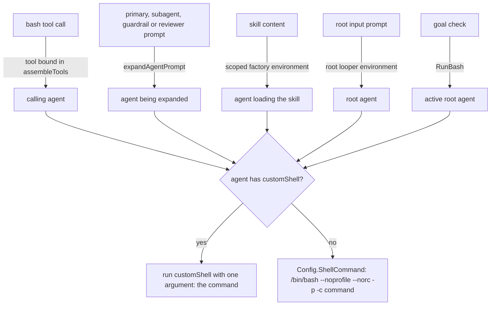

# Per-Agent Custom Shell - Plan

## Goal Capsule

- **Objective:** An agent author can route one agent's shell commands through a program of their choosing, such as a sandbox entrypoint, by adding one line to that agent's file, while agents without that line behave exactly as before.
- **Means:** an optional `customShell` frontmatter path that RocketCode runs as `<customShell> <command>` for every shell command made on that agent's behalf (KTD1, KTD2).
- **Authority:** Product Contract requirements win on behavior. KTDs win on mechanism within those requirements. The repository `AGENTS.md` coding rules override any unit's Approach text.
- **Execution profile:** Go changes in `internal/rocketcode`, one call site in `internal/rocketclaw/backend`, and documentation. Test-backed, no data migration.
- **Stop conditions:** stop and ask if an agent without `customShell` would change any existing test's observed output, if a shell surface turns up that does not pass through the per-agent selection, if the source CLOC budget would be exceeded, or if the change needs an exported symbol beyond `Agent.CustomShell` and the new `RunBash` parameter.
- **Who finishes:** `ce-work` implements and verifies locally. Shipping follows the normal PR flow.

---

## Product Contract

### Summary

Add an optional `customShell` field to agent frontmatter. When it is set, every shell command run on that agent's behalf runs through that program instead of `/bin/bash`. That covers the `bash` tool, `` !`…` `` interpolation in its prompts and skills, and the goal-completion check. Agents without the field keep today's behavior.

### Problem Frame

RocketCode runs every agent's shell commands on the host as `/bin/bash --noprofile --norc -p -c <command>`. The only hook, `Config.ShellCommand`, is one runtime-wide value, and every embedder sets it to the default. There is no way to send one agent's commands through a sandbox.

The bash permission check is a policy gate, not containment; the README already says it "is not a shell sandbox". Sandbox systems are usually entered through an entrypoint or shim program. Principals who want containment for a specific agent need a way to put such a program in front of each of that agent's commands.

### Requirements

**Declaring the shell**

- R1. An agent file may declare `customShell` in its frontmatter. When present, it must be a YAML string holding an absolute path. Any other value makes that agent fail to load with an error naming the file and `customShell`.
- R2. An agent without `customShell` runs every shell command exactly as today.
- R3. `customShell` names one program; the field holds no extra arguments.

**Running commands**

- R4. Every shell command run on an agent's behalf executes as `<customShell> <command>`, with the full command string as the only argument and no `-c`.
- R5. "On an agent's behalf" means the agent whose turn it is. That covers its own `bash` calls, the `` !`…` `` lines in its own prompt, the skills it loads, and, for the root agent, input-prompt expansion. A subagent, guardrail, or permission reviewer uses its own `customShell`, or default bash when it has none.
- R6. The goal-completion check and dynamic-workflow workers run as the conversation's active root agent, so they use that agent's `customShell`.
- R7. When `customShell` cannot be started, the `bash` tool reports the start error to the agent and never falls back to default bash.
- R8. The program receives the same working directory, environment, `TMPDIR`, timeout, and termination signals that bash receives today.
- R9. Permission checks keep parsing the command as bash, unchanged.

**Documentation**

- R10. Agent authors can find the field, its contract, and what a wrapper program must do in the cheatsheet, the agent-authoring skill, and the README.

### Key Decisions

- **Single-argument call form.** Governs R3, R4. (session-settled: user-directed — chosen over wrapping as `<customShell> /bin/bash --noprofile --norc -p -c <cmd>` and over `<customShell> -c <cmd>`: a sandbox entrypoint may not accept `-c`.)
- **Field name `customShell`.** Governs R1. (session-settled: user-approved — chosen over `custom_shell`: matches the camelCase of every existing frontmatter field.)
- **Absent means unchanged.** Governs R2. (session-settled: user-directed — chosen over reshaping the code-level default: the field is optional and existing agents must not notice it.)
- **Each agent uses its own shell.** Governs R5. (session-settled: user-directed — chosen over inheriting the parent's `customShell`: delegation topology is the principal's architectural responsibility.)
- **Goal check uses the active agent's shell.** Governs R6. (session-settled: user-approved — chosen over always using default bash: keeps goal checks inside the conversation's sandbox.)
- **General-purpose interface.** Governs R3, R10. (session-settled: user-directed — chosen over adapters or docs for specific sandbox products: any program at an absolute path qualifies.)
- **Bash version mismatch handled separately.** Governs R2. (session-settled: user-directed — chosen over documenting it here or looking up bash on PATH: macOS `/bin/bash` 3.2 versus the bash-5 permission parser is its own task.)

### Success Criteria

- A wrapper fixture that records its arguments shows exactly one argument, the command string, for the `bash` tool, primary-prompt expansion, a subagent's tool and prompt, a skill, and the goal check.
- The existing test suite passes unchanged apart from call sites of signatures this plan changes.

### Scope Boundaries

- File tools (`read`, `apply_patch`, `glob`, `grep` and their `rg` calls), MCP stdio servers, and other host processes keep running on the host. `customShell` covers shell commands only.
- No new permission or approval for editing `customShell`. An agent that can edit `agents/**` can already rewrite its permissions.
- No lint rule for a sandboxed agent delegating to an unsandboxed one (see the "each agent uses its own shell" decision).
- No check at load time that the program exists.

#### Deferred to Follow-Up Work

- macOS `/bin/bash` 3.2 versus the bash-5 permission parser.
- Setting `cmd.WaitDelay`, so a wrapper's descendant that keeps the output pipe open cannot hang a call past its timeout. The risk exists for plain bash today.
- agentlint treating the `customShell` path as an executed path, so RC001 and RC004 flag an agent that can write its own wrapper.
- Showing `customShell` in `rocketclaw agent-graph` labels and on the Web Agents page.
- `RunBash` never setting `spillRel`, so goal checks lack spill-folder denial. This predates the feature.

---

## Planning Contract

### Key Technical Decisions

- KTD1. **Select the shell where each process starts.** A small method on `ShellCommandFunc` returns `customShell` with the command as its only argument when set, and otherwise returns `Config.ShellCommand(command)` exactly as today. The two launch sites, `sandboxedShellSystem.Bash` and `promptExpansionEnvironment.expandShellCommands`, both call it. This puts the R2/R4 rule in one place and leaves `Config.ShellCommand` and every embedder config untouched.
- KTD2. **Rebind the `bash` tool per agent in `toolFactory.assembleTools`.** It is the only code shared by the root runtime, task subagents (new, continued, resumed and background-woken), guardrails, and permission reviews. Rebinding in `subagent` would miss guardrails and reviews, because those never copy `baseTools`. An agent without `customShell` keeps the shared tool untouched. The rebound tool goes only into the local tool map, never into `baseTools`, so one agent's shell cannot leak to another.
- KTD3. **Keep one shell system per runtime and pass the shell per call.** `sandboxedShellSystem.Bash` takes the agent's `customShell` as a parameter, and the factory keeps a reference to the runtime's shell system so `assembleTools` can bind a tool to it. A per-agent copy would copy the mutex that makes all bash calls in a runtime run one at a time. It would also drop `spillRel` and silently lose spill-folder denial. This costs one new `toolFactory` field. Building a fresh shell system per sandboxed agent would avoid the field but change how that agent's calls are serialized.
- KTD4. **Carry the shell on the prompt-expansion environment.** `promptExpansionEnvironment` gains the `customShell` of the agent being expanded, and `expandShellCommands` uses KTD1. The field is set in three places:
  - `expandAgentPrompt`, from the agent it expands. This covers primary, subagent, guardrail and reviewer prompts, including the three subagent-side sites that expand before the child's tools exist.
  - `assembleTools`, on the scoped factory's copy. This covers skill content, including direct `$skill` input. It also avoids reading `f.agent` in the skill path, where existing tests pass a nil agent.
  - `New`, on the root looper's copy, for input prompts.

  Expansion otherwise keeps its current behavior: no timeout, stdout only, and errors produce empty text. (session-settled: user-directed — chosen over routing expansion through the bash tool's launcher with its timeout and process-group kill: expansion stays as it is and only gains `customShell`.)
- KTD5. **Validate on load like `model`, and fail closed.** Read the field from the YAML node and require a `!!str` scalar that passes `filepath.IsAbs`. Reject anything else with a plain error, `<file>: customShell: must be an absolute path`. Do not use `frontmatterString`: it turns a number or list into `""`, which means default host bash. An absolute path rules out PATH lookup and resolution against the per-call `workdir`. There is no existence check, because the loader reads only the agents folder. As with a bad `maxRecursion`, a bad value is fatal at runtime start and rejected by reload. A plain error is used instead of a new typed error, because no caller inspects it.
- KTD6. **Surface start failures in the `bash` tool.** When the process never started, return the start error text (for example `fork/exec <path>: no such file or directory`) as the failure output, instead of `(no output)` with code `error`. Default bash output changes only when `/bin/bash` itself cannot start. The goal check inherits this through `RunBash`, so its "did not pass" message names the cause.
- KTD7. **`RunBash` takes the shell as a parameter.** Its only production caller, `runGoalCheck`, already loads the active agent and passes `agent.CustomShell`. `BashCommand` stays field-identical to `bashParams`, so the existing type conversion still compiles.
- KTD8. **Fix the stale comments.** The `ShellCommandFunc` example shows `-lc`, a login shell, which is the opposite of the default. The `Config.ShellCommand` note that implementations must preserve bash semantics should also say that an agent's `customShell` overrides it for that agent.

### High-Level Technical Design

Every shell surface resolves to one agent, then to one selection rule, then to one process start.

### Sequencing

U1 first. U2 next, because U3, U4 and U5 build on its selection rule. U3, U4 and U5 are independent of each other. U6 needs only U1.

---

## Implementation Units

### U1. Load and validate `customShell`

- **Goal:** agents carry a validated `CustomShell`.
- **Requirements:** R1, R2, R3; KTD5.
- **Dependencies:** none.
- **Files:** `internal/rocketcode/agents.go`, `internal/rocketcode/agents_test.go`, `internal/rocketclaw/backend/definitions_test.go`.
- **Approach:**
  1. Add `CustomShell string` to `Agent`.
  2. Parse and validate it in `loadAgent` next to the `model` check, per KTD5.
  3. Existing whole-struct copies (`interpolateAllAgentPermissions`, `Skills.withReadPermissions`, `raw_run.go`, `handoff.go`) carry the field without changes.
- **Patterns to follow:** the `model` check in `loadAgent`, the "rejects invalid max recursion values" table in `agents_test.go`, and `TestLoadRocketCodeDefinitionsReportsInvalidMaxRecursion`.
- **Test scenarios:**
  - `customShell: /opt/sandbox/enter` loads, and `CustomShell` equals that path.
  - Field absent: `CustomShell` is empty and there is no error.
  - Each of `sandbox/enter`, `enter`, `""`, `null`, `123`, `[/a]` and `{a: b}` produces exactly one load error containing `main.md: customShell:`, and the agent is not loaded.
  - An agent file whose `description` needs the frontmatter sanitizer fallback (an unquoted value containing `: `) still loads its absolute `customShell`.
  - RocketClaw definition loading reports the invalid-`customShell` error (definitions test).
- **Verification:** loader tests pass, and no existing agent fixture changes.

### U2. Shell selection and the `bash` tool

- **Goal:** the `bash` tool runs `<customShell> <command>` for an agent that declares one, and reports start failures.
- **Requirements:** R4, R7, R8; KTD1, KTD3, KTD6, KTD8.
- **Dependencies:** U1.
- **Files:** `internal/rocketcode/rocketcode.go`, `internal/rocketcode/shell.go`, `internal/rocketcode/tools.go`, `internal/rocketcode/shell_test.go`.
- **Approach:**
  1. Add the selection method on `ShellCommandFunc` (KTD1) and fix both comments (KTD8).
  2. Give `sandboxedShellSystem.Bash` the agent's `customShell` as a parameter, and have it call the selection method.
  3. Move the `bash` tool definition out of the `makeSandboxedTools` literal into a constructor that takes the shell system and a `customShell`. The base map uses an empty `customShell`.
  4. When the process never started, return the start error through `bashFailure` (KTD6).
  5. Update the existing `Bash` call sites in tests for the new parameter.
- **Patterns to follow:** the `shell_test.go` subtests sharing one `sandboxedShellSystem`. Create fixtures through `*os.Root` (`root.WriteFile` with mode `0o755`, as `bridge_test.go` does for scripts).
- **Test scenarios:**
  - A `#!/bin/sh` wrapper that prints its argument count and first argument receives exactly one argument equal to the full command string, for a command containing spaces, quotes and a pipe.
  - The same wrapper called with a nested `workdir` runs in that directory, with `TMPDIR` set to the session temp folder.
  - A wrapper that exits 7 produces `ErrorCode` `7` and `Success` false.
  - A wrapper that sleeps past `timeout_ms` produces `ErrorCode` `timeout`.
  - A `customShell` pointing at a missing path returns failure output containing `no such file or directory`. A sentinel command (creating a file) does not run under default bash: the file stays absent.
  - With an empty `customShell`, every existing subtest passes unchanged, including "shell environment cannot reinterpret checked commands".
- **Verification:** `shell_test.go` passes with the default-path assertions unchanged. Fixture strings contain no word repeated back to back (see Risks).

### U3. Bind the `bash` tool per agent

- **Goal:** every looper's `bash` uses its own agent's `customShell`.
- **Requirements:** R5; KTD2, KTD3.
- **Dependencies:** U2.
- **Files:** `internal/rocketcode/tools.go`, `internal/rocketcode/rocketcode.go`, `internal/rocketcode/main_test.go`, `internal/rocketcode/tools_test.go`, `internal/rocketcode/execute_results_test.go`.
- **Approach:**
  1. `newSandboxedTools` also returns its shell system, and `New` stores it on the factory (KTD3).
  2. In `assembleTools`, when the agent declares `customShell` and the local tool map contains `bash`, replace that local entry with a tool bound to the shared shell system and the agent's `customShell` (KTD2).
  3. Update the `newSandboxedTools` call sites in tests.
- **Patterns to follow:** `TestNewCopiesShellEnv` (end to end through `New` and `CodeModeHosts["bash"].Call`). Reach the factory through `loop.PermissionReviewer.(*toolFactory)`, as `main_test.go` already does, to assemble a subagent or guardrail.
- **Test scenarios:**
  - A root agent with `customShell`: `CodeModeHosts["bash"]` runs the wrapper.
  - A sandboxed root with a task subagent that has no `customShell`: the subagent's `bash` runs default bash.
  - An unsandboxed root with a sandboxed subagent: the subagent's `bash` runs the subagent's wrapper.
  - A guardrail agent with its own `customShell`: its `bash` runs its wrapper.
  - After assembling a sandboxed agent, the factory's `baseTools["bash"]` still runs default bash.
  - Existing `assembleTools` tests that build a factory without a shell system pass unchanged.
- **Verification:** tests pass, and model-facing tool lists and descriptions are unchanged.

### U4. Prompt expansion per agent

- **Goal:** `` !`…` `` lines expand through the shell of the agent whose prompt or skill it is.
- **Requirements:** R4, R5; KTD4.
- **Dependencies:** U2.
- **Files:** `internal/rocketcode/prompts.go`, `internal/rocketcode/tools.go`, `internal/rocketcode/rocketcode.go`, `internal/rocketcode/prompts_test.go`, `internal/rocketcode/tasks_test.go`, `internal/rocketcode/skills_test.go`.
- **Approach:**
  1. Add the agent's `customShell` to `promptExpansionEnvironment`, and route `expandShellCommands` through the selection method.
  2. `expandAgentPrompt` expands with a copy carrying the expanded agent's `customShell`.
  3. `assembleTools` sets it on the scoped factory's copy when the agent is non-nil. `New` sets it on the root looper's copy.
  4. Keep `root` on every copy, because it is also the spill and retained-results root.
- **Patterns to follow:** `TestExpandAgentPrompt`, `TestNewShellEnvAppliesToPromptExpansion`, the subagent expansion test through `runTask` in `tasks_test.go`, and the skill expansion test in `skills_test.go`.
- **Test scenarios:**
  - `expandAgentPrompt` on an agent with the wrapper turns `` !`echo hi` `` into the wrapper's output, showing one argument, `echo hi`.
  - A subagent prompt with `` !`…` ``, delegated from an unsandboxed parent, expands through the child's wrapper.
  - A skill with `` !`…` `` expands through the wrapper of a sandboxed agent that loads it. Loaded by an agent without `customShell`, it expands with default bash.
  - A missing wrapper makes the expansion produce empty text, which matches today's error behavior.
  - Existing expansion tests pass unchanged for agents without `customShell`.
- **Verification:** tests pass.

### U5. Goal check uses the active agent's shell

- **Goal:** `update_goal` checks run through the active root agent's `customShell`.
- **Requirements:** R6; KTD7.
- **Dependencies:** U2.
- **Files:** `internal/rocketcode/shell.go`, `internal/rocketclaw/backend/bridge.go`, `internal/rocketclaw/backend/bridge_test.go`.
- **Approach:**
  1. Add the shell parameter to `RunBash`.
  2. `runGoalCheck` passes the active agent's `CustomShell`. `validateGoalCheckScript` stays as it is.
- **Patterns to follow:** `TestUpdateGoalToolRunsSuccessfulCheckBeforeComplete` and the `newGoalCheckTestBridge` helper. That helper creates its own workspace, so the wrapper lives in a separate temp directory. Add the short comment `AGENTS.md` requires for that host write.
- **Test scenarios:**
  - A root agent with a recording wrapper: an allowed check passes the check command to the wrapper as its only argument, and the goal completes when the wrapper exits 0.
  - The same setup with a wrapper that exits non-zero: the goal stays incomplete with the "did not pass" message.
  - Existing goal-check tests without `customShell` pass unchanged.
- **Verification:** backend tests pass, and the `internal/rocketclaw` coverage gate holds.

### U6. Document the field

- **Goal:** people and agents who author agent files know the field and the wrapper contract.
- **Requirements:** R10.
- **Dependencies:** U1.
- **Files:** `cmd/rocketclaw/CHEATSHEET.md`, `internal/rocketclaw/skel/.rocketclaw/skills/main-create-or-update-agent/SKILL.md`, `README.md`.
- **Approach:**
  1. In `CHEATSHEET.md`, add `customShell` to the YAML example and the "Known frontmatter fields" table. The full wrapper contract lives here:
     - the wrapper receives the command as one argument;
     - it should run that string with bash, for example `bash --noprofile --norc -p -c "$1"`, so permission checks keep their meaning;
     - a wrapper that is itself a bash script should start with `#!/bin/bash -p`, so an inherited `BASH_ENV` or exported functions cannot change it before it hands off the command;
     - the working directory and `TMPDIR` are set on the wrapper process and must be carried into the sandbox;
     - the environment is the full RocketClaw process environment, which can include provider credentials, so the wrapper should forward only the variables commands need;
     - goal checks, background subagent wakes and workflow workers get no RocketClaw extra env such as `ROCKETCLAW_CONVERSATION_ID`, so the wrapper must not depend on it;
     - keep the wrapper, and any file it reads to configure the sandbox, outside the workspace and outside every path the agent can write, because an agent that can modify its wrapper can turn it into plain host bash;
     - the workspace should be at the same path inside the sandbox;
     - a timeout stops only the local wrapper;
     - `` !`…` `` expansion has no timeout and ignores errors, so a missing wrapper produces empty text and a hung wrapper blocks the turn;
     - the field applies only to the agent that declares it, while workflow workers and goal checks use the root agent's;
     - file tools and MCP servers still run on the host.
  2. In the agent-authoring skill, add an optional-field paragraph next to `maxRecursion`:
     - set, change, or remove `customShell` only when a human explicitly asks, using the exact value they give;
     - never create or edit a `customShell` program inside the workspace;
     - carry it over unchanged on updates and renames;
     - `` !`…` `` lines also go through it;
     - point to the cheatsheet for the full contract.
  3. In the README's "Agents and permissions" section, next to "not a shell sandbox", point to `customShell` as the way to put a sandbox in front of an agent's shell commands.
- **Test expectation:** none — documentation only. No Go test reads these files.
- **Verification:**
  - Read back each file. All three agree with R1–R9 and with each other.
  - Agent check in a RocketClaw Web session: ask the main agent to create an agent with a given `customShell`. It should write the value verbatim, run `rocketclaw lint`, and reload once. Then ask it to change that agent's description, and confirm `customShell` is still there.

---

## System-Wide Impact

- **Concurrency:** unchanged. All bash calls in a runtime still take one lock in turn, including a sandboxed agent's (KTD3).
- **Security posture:** a sandboxed agent's file tools and MCP servers still run on the host. Delegation to an unsandboxed subagent is intentional (R5), and so is the root identity of workflow workers and goal checks (R6).
- **Agent self-editing:** an agent with `edit` on `agents/**` can add or remove `customShell` and reload. That is the same level of trust as editing `permission` today. The skill guidance in U6 tells agents to treat such changes as human-requested only.
- **Startup:** an invalid `customShell` blocks RocketClaw startup like any other agent load error. Reload rejects it and keeps the live definitions.
- **Standalone `rocketcode`:** honors the field, because the routing lives inside rocketcode.

---

## Risks & Dependencies

| Risk | Mitigation |
| --- | --- |
| A wrapper that runs the string with something other than bash makes permission checks describe a different command than the one that runs. | Documented contract (U6). Accepted under the single-argument decision. |
| A wrapper's descendant holds the output pipe open, so a call hangs past its timeout. | Same risk as plain bash today. Deferred `WaitDelay` follow-up. |
| A timeout kills only the local wrapper, so work inside the sandbox may keep running. | Documented (U6). Stopping sandboxed work is the wrapper's job. |
| A missing wrapper makes `` !`…` `` expansion silently produce empty text, and a hung wrapper blocks the turn. | Accepted with KTD4. Documented. |
| Wrapper environment varies by surface: goal checks, background subagent wakes and workflow workers get no RocketClaw extra env such as `ROCKETCLAW_CONVERSATION_ID`. | Documented (U6). Wrappers must not depend on it. |
| `make lint`/`make test` run `golangci-lint --fix` with `dupword`, which silently deletes a word repeated back to back inside test strings (`docs/solutions/best-practices/dupword-fix-rewrites-repeated-test-strings.md`). | Keep fixture command strings free of repeated adjacent words, and check `jj diff --git` after lint for edits nobody made. |
| The source CLOC budget for rocketcode is 10,805 of 12,500. | The expected net addition is small. Stop if it approaches the budget. |

---

## Verification Contract

| Gate | Command | Applies to |
| --- | --- | --- |
| Formatting | `gofmt -l` on touched Go files | U1–U5 |
| RocketCode tests | `go test ./internal/rocketcode/...` | U1–U5 |
| RocketClaw tests | `go test ./internal/rocketclaw/...` | U1, U5 |
| Full suite | `go test ./...` | before done |
| Lint | `make lint` | before done |
| Repo gates, including CLOC and coverage budgets | `make test` | before done |

---

## Definition of Done

- R1–R10 hold, and each unit's test scenarios exist and pass.
- Every gate in the Verification Contract passes. `SOURCE_CLOC_BUDGET` is untouched.
- No existing test changes except for new call-site arguments.
- The diff passes the `AGENTS.md` review: no new defensive nil guards, error variables named `errX`, no single-use one-line helpers, and no new exported symbols beyond `Agent.CustomShell` and the `RunBash` parameter.
- No leftover code from abandoned approaches remains in the diff.
- The final report states that the README was updated (U6).

---

## Sources & Research

- `internal/rocketcode/tools.go` `assembleTools`: the one code path every agent's tools pass through (KTD2).
- `internal/rocketcode/shell.go` `sandboxedShellSystem.Bash`: the runtime-wide lock, `spillRel`, and the process-group cancel (KTD3, R8).
- `internal/rocketcode/agents.go` `loadAgent`: the `model` validation pattern and `frontmatterString`'s silent coercion (KTD5).
- `internal/rocketcode/prompts.go`, `tasks.go`, `permission_review.go`: the prompt-expansion sites that run before a child's tools are built (KTD4).
- `internal/rocketclaw/backend/bridge.go` `runGoalCheck`: already resolves the active agent (KTD7).
- `docs/solutions/architecture-patterns/per-provider-autocompaction-threshold.md`: a per-agent setting takes effect only if every looper builder applies it.
- `docs/solutions/runtime-errors/execute-uncapped-results-exceeded-model-context.md`: bash host tool, shell temp and spill-folder contracts to preserve.
- Go `os/exec` (Go 1.27.2): a file that cannot be executed fails `Start` with a path error before any exit status exists, which is why KTD6 is needed.
- Claude Code `CLAUDE_CODE_SHELL_PREFIX` (https://code.claude.com/docs/en/env-vars): the same program-plus-command-string contract, with the wrapper expected to re-run the string with a shell.
