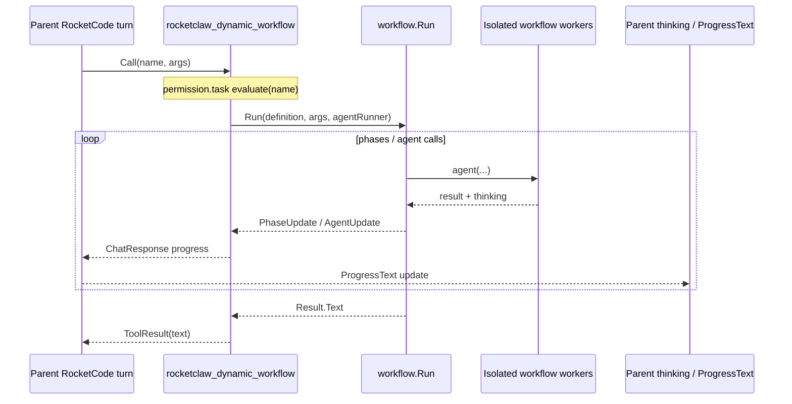

# rocketclaw_dynamic_workflow tool

## Goal Capsule

- **Objective:** Let a RocketClaw agent start a saved Starlark workflow as a nested tool call (`rocketclaw_dynamic_workflow`), with workflow names gated by the existing `task` permission bucket (same model as subagents), final workflow text returned as the tool result, and live progress surfaced through the parent turn’s thinking stream.
- **Authority:** This plan > existing workflow design (`internal/rocketclaw/docs/specs/2026-07-24-starlark-workflows-design.md`) for *agent* invocation only; human `$workflow` stays a foreground managed turn.
- **Stop when:** An agent with YAML `task: "<workflow>": allow` (or a matching pattern) can invoke the tool mid-turn, see thinking progress, receive the workflow result as tool output, and denied/missing workflows fail cleanly; CHEATSHEET/skills document the tool, shared `task` namespace, and wildcard blast radius.
- **Out of scope for stop:** Changing Starlark DSL, human `$workflow` UX, workflow worker tool policy, durable resume, or making RocketCode workflow-aware.

---

## Product Contract

### Summary

Agents need a first-class way to run checked-in Starlark workflows without going through Slack `$workflow`. The tool runs the workflow **inside the current RocketCode tool call** (like `task` nests a subagent), not as a second managed conversation turn. Permissions treat each workflow name as a `task` subject.

### Problem Frame

Today only humans start workflows (`$workflow` / ⏩). Agents can spawn subagents via `task` under the `task` bucket, but cannot trigger workflows. Mid-turn `StartWorkflowInThread` is rejected while a turn is active, so agent launch must nest rather than submit a competing managed turn.

### Requirements

- R1. Expose tool `rocketclaw_dynamic_workflow` on RocketClaw managed agent turns (same surfaces as other RocketClaw-injected custom tools that belong on persistent agent turns).
- R2. Tool parameters: `name` and `args` are both schema properties (RocketCode custom tools put every property in `required` under strict mode). Callers pass `args: ""` when unused. Semantics match human `$workflow <name> [args]` → `main(args)`.
- R3. Permission bucket is **`task`** (singular). Call-time subjects are the workflow name(s). Visibility lists only workflows the agent may start under `permission.task`.
- R4. Do **not** RocketClaw auto-allow this tool in the `rocketclaw` bucket. Access is only via explicit `task` allows (plus normal deny-by-default).
- R5. On call: load the named workflow definition; run it to completion (or cancellation/failure) inside the tool `Call`; return the rendered workflow result text as the tool result (silent complete → clear fixed message).
- R6. While running, publish phase/agent activity into the parent tool output channel so the parent bridge maps it into thinking/`ProgressText` (user-visible progress in the thinking message path).
- R7. Nested run must not steal or replace the parent managed turn’s active-cancel/reply ownership used by ordinary RocketCode turns and human `$workflow` runs.
- R8. Missing workflow, permission deny, and run failure produce clear tool errors/results; parent turn cancellation cancels the nested workflow.
- R9. Document the tool and that workflow names are `task` subjects in CHEATSHEET and the agent-authoring skill.

### Actors

- A1. Managed RocketClaw agent (caller of the tool)
- A2. Human partner (sees thinking progress; may `$stop` the parent turn)
- A3. Workflow workers (unchanged isolated RocketCode workers; still no `task` / RocketClaw behavior tools)

### Key Flows

- F1. Allowed nested run
  - **Trigger:** Agent calls `rocketclaw_dynamic_workflow` with allowed `name` and optional `args`.
  - **Steps:** Permission check on `task`/`name` → load definition → nested `workflow.Run` with parent-agent snapshot → progress → thinking → tool result with final text.
  - **Outcome:** Parent agent continues with tool result; human saw thinking updates during the run.
- F2. Denied or unknown workflow
  - **Trigger:** Missing allow rule, deny rule, or unknown name.
  - **Outcome:** Tool not visible and/or call denied / clear error; no workflow side effects.

### Acceptance Examples

- AE1. Covers R3, R5, F1. Agent has `task: "audit-routes": allow`. Tool description lists `audit-routes`. Call with that name returns the workflow’s final text as tool output.
- AE2. Covers R3, F2. Agent lacks allow for `secret-flow`. Tool is absent or call denied; workflow does not run.
- AE3. Covers R6, R8. During a long phase, parent thinking stream receives progress; `$stop` on the parent turn cancels the nested run.

### Scope Boundaries

**In scope**

- RocketClaw custom tool + nested execution path
- `task`-bucket permission/visibility parity with subagent naming
- Thinking-stream progress for nested runs
- Tests and operator/agent docs

**Out of scope**

- Changing human `$workflow` foreground-turn behavior or Slack phase-card protocol for human runs
- Giving workflow workers `task` or RocketClaw tools
- Durable/resumable workflow state
- Auto-discovering workflows into agentlint delegation graphs (defer unless trivial)
- Cron/raw-only surfaces unless the same persistent-turn injection path already covers them without extra design

### Deferred to Follow-Up Work

- agentlint treating workflow names as `task` edges in the delegation graph
- Optional dual progress (nested thinking **and** Slack workflow phase cards) if product wants parity with human `$workflow` chrome

---

## Planning Contract

### Assumptions

- Product intent for “report content in the thinking message” means map nested progress onto the existing parent-turn thinking path (`ChatResponse` → `rocketcodeThinkingText` → `ProgressText`), not a new Slack surface.
- Bucket name in user language “tasks” maps to the existing singular bucket `task`.
- Nested tool runs inherit the **current managed agent** snapshot for worker permission/tool narrowing (same as human-invoked workflows on that thread’s agent).
- Nested runs leave **no** human-style session workflow summary entry; tool-call history + tool result text are the audit trail (Silent completes use a fixed non-empty result string).
- Progress delivery is best-effort: nested progress callbacks must never fail the engine; a full parent output channel may drop ticks (phase start/end still attempted first).

### Key Technical Decisions

- KTD1. **Nested tool call, not `StartWorkflowInThread`.** Submitting a workflow inbound on the same conversation races the active turn. Mirror `task`: execute inside `Call`, block until terminal, return text result.
- KTD2. **Reuse `workflow.Run` + `newWorkflowAgentRunner`; do not call `Bridge.runWorkflow`.** `runWorkflow` owns managed-turn active-cancel, session workflow summary entries, and outbound `WorkflowPhase`/`WorkflowAgent` cards for human foreground runs. Nested path needs a thinner runner that only drives the engine and parent tool output.
- KTD3. **`Permission: "task"` with `Subjects` → `[workflowName]` (product requirement).** Shared namespace with subagents is intentional parity: a `task` allow that string-matches a workflow name authorizes launch. **Blast radius:** existing `task: "*"` / broad patterns become workflow launch grants on upgrade; name collisions (subagent stem == workflow stem) couple the two. Rejected alternatives: new `workflow` bucket (breaks stated parity); rocketclaw-name allow only (does not gate per workflow). Document the shared namespace loudly in U5.
- KTD4. **Override both Subjects and VisibilitySubjects; never use custom-tool defaults.** `customLooperTool` defaults both to the tool name when empty. Always set `Subjects` from params (`[name]`) and `VisibilitySubjects` to allowed workflow names. **Mandatory omit:** if no loaded workflow name evaluates `task` allow, do not append the tool to `CustomTools` (empty `VisibilitySubjects` would rewrite to the tool name and break gating).
- KTD5. **Progress mapping (harnessbridge-local).** Emit only small fixed lines (phase name/status; agent label/activity) as `rocketcode.ChatResponse{Kind: ChatResponseAssistantCommentary, Text: line}` via non-blocking send (`select`/`default` drop). Do **not** call unexported `emitDiagnosticChatResponse`. Progress/`AgentProgress` callbacks **always return nil** so a full channel never cancels `workflow.Run`. Do not forward full worker transcripts or tool payloads into thinking.
- KTD6. **Final tool result.** On complete: `workflow.Result.Text`, or `"Workflow completed silently."` when `Silent` (match human `runWorkflow` copy). On fail/stop: error or explicit failure text visible to the parent model.
- KTD7. **Registration.** Build the tool in `harnessbridge`; append only on **persistent parent** managed-turn `CustomTools` assembly. Never register on `toolModeWorkflow` workers. Skip RocketClaw default-allow list. Assert constructed `Permission == "task"`.
- KTD8. **Turn construction must be non-fatal.** Listing/loading workflows while building the tool must not fail the parent turn: on load error, log and omit the tool (empty allow). Hard errors stay on Call for unknown name after a successful load. Close over `runTurn`’s `turnID` (and agent name/runtime) when constructing the tool — custom `Call` does not receive turn metadata.

### High-Level Technical Design

Nested execution sits under the parent turn context: cancel of the parent `Call` ctx cancels `workflow.Run`. No second `Bridge.Submit`.

### Patterns to Follow

- Permission + subjects: `internal/rocketcode/tasks.go` (`task` tool)
- Custom tool shape / injection: `internal/rocketcode/custom_tools.go`, `startNewThreadTool` in `internal/rocketclaw/harnessbridge/bridge.go`
- Workflow engine + runner: `internal/rocketclaw/workflow/engine.go`, `newWorkflowAgentRunner` in `internal/rocketclaw/harnessbridge/raw_run.go`
- Human start API (list/load only): `WorkflowDescriptions` / `workflow.Load` in `internal/rocketclaw/app/thread_bridges.go`
- Thinking extraction: `rocketcodeThinkingText` in `bridge.go`

### Implementation Constraints

- RocketCode stays workflow-unaware (design invariant).
- Workflow workers still reject `task` and RocketClaw behavior tools.
- Temp/scratch only under repo `.tmp/` in tests if needed; prefer existing harnessbridge test fixtures.
- Go standards from root `AGENTS.md` apply (no defensive nil guards, error names `errX`, etc.).

### Sequencing

U1 → U2 → U3 (tool + nested run + wire-up), then U4 tests, then U5 docs. Tests may land with U1–U3 if preferred, but U4 is the coverage gate.

---

## Implementation Units

### U1. Tool definition: schema, task permission, visibility

**Goal:** Define `rocketclaw_dynamic_workflow` as a `rocketcode.Tool` with `task` permission, workflow-name subjects, and a description that lists allowed workflows.

**Requirements:** R1–R4

**Dependencies:** none (nested runner may be a stub until U2)

**Files:**

- `internal/rocketclaw/harnessbridge/bridge.go` (or a focused new file in the same package if bridge.go size warrants a split only when necessary)
- `internal/rocketclaw/harnessbridge/bridge_test.go` or new `dynamic_workflow_tool_test.go`

**Approach:**

- Constant tool name `rocketclaw_dynamic_workflow`.
- Params: `name` and `args` strings, both in schema `required`; empty args = `""`.
- `Permission: "task"` (assert in tests; never default bucket).
- `Subjects` always set: unmarshals params → `[]string{name}` (never rely on tool-name default).
- Constructor takes: agent permissions (or evaluate func), workflow list/load func, closed-over turnID/agent/runtime, and nested runner from U2 (stub ok).
- `VisibilitySubjects` = loaded names where evaluate(`task`, name) is allow.
- Description enumerates allowed name + short description (mirror task’s available-agents style at a smaller scale).
- Empty allow set or list/load failure → **omit tool** from `CustomTools` (mandatory; never empty `VisibilitySubjects`).

**Test scenarios:**

- Happy: agent allows `audit-routes` only → visibility/description contains that name, not others.
- Edge: no workflows on disk → tool omitted, no panic, parent turn still builds.
- Edge: workflow list/load error during construction → tool omitted, parent turn still builds.
- Error: `Subjects` with bad JSON → error.
- Permission: deny pattern wins over earlier allow for a name → not visible / not callable.
- Regression: constructed tool has `Permission == "task"` and non-default `Subjects`/`VisibilitySubjects`.

**Verification:** Unit tests for construction/subjects/visibility without full engine.

---

### U2. Nested workflow execution inside Call

**Goal:** Implement Call body: load definition, run engine with parent-agent worker runner, stream progress to parent output, return final text; honor cancel.

**Requirements:** R5–R8

**Dependencies:** U1

**Files:**

- `internal/rocketclaw/harnessbridge/` (nested run helper next to tool)
- `internal/rocketclaw/harnessbridge/raw_run.go` (reuse `newWorkflowAgentRunner`; extract shared bits only if required)
- Tests under `internal/rocketclaw/harnessbridge/`

**Approach:**

- Load via existing `workflow.Load` / definition map keyed by name; unknown name → clear error.
- `newWorkflowAgentRunner(runtime, parentAgentName, log)` with `toolModeWorkflow` unchanged.
- `workflow.Run(ctx, def, RunRequest{RunID, Args, Definition}, agentRun, progress, agentProgress)`.
- `RunID`: closed-over parent `turnID` from tool construction (not available inside bare `Call` otherwise).
- Progress: non-blocking `ChatResponseAssistantCommentary` lines only; callbacks always `return nil` (full channel drops ticks; never cancel engine).
- Do **not** set `Bridge.activeReply` / `activeTurnCancel` for the nested path.
- Join runner close errors with run errors.
- Map terminals: complete → text result; silent → `"Workflow completed silently."`; failed/stopped → error or explicit failure tool result text.

**Test scenarios:**

- Happy: stub agent runner + tiny `.star` fixture → tool result equals rendered main return.
- Happy: progress callbacks produce at least one parent ChatResponse before completion under a buffered consumer.
- Happy: full/unconsumed output channel does not fail the nested run (progress still returns nil).
- Error: missing workflow name → error, runner not started.
- Error: agent runner failure → failed tool outcome.
- Integration: parent ctx cancel ends nested run promptly.
- Edge: silent workflow complete → `"Workflow completed silently."`.
- Regression: nested Call does not set or clear parent `activeReply` / `activeTurnCancel`.

**Verification:** Harnessbridge tests with fixtures under package test roots; no live Slack.

**Execution note:** Prefer one integration-style test that runs a minimal Starlark workflow through the real engine with a stub `AgentRunFunc` before wiring full bridge injection.

---

### U3. Bridge turn injection (no rocketclaw auto-allow)

**Goal:** Attach the tool on managed persistent turns; ensure definition loading does not inject a `rocketclaw` bucket allow for this tool name.

**Requirements:** R1, R4

**Dependencies:** U1, U2

**Files:**

- `internal/rocketclaw/harnessbridge/bridge.go` (customTools assembly ~turn path)
- `internal/rocketclaw/harnessbridge/definitions_test.go` / `bridge_test.go`

**Approach:**

- Hard invariant: register only on persistent **parent** `CustomTools` assembly when ≥1 loaded workflow name is `task`-allowed; close over turnID, agent, runtime.
- Confirm `loadRocketCodeDefinitionsIn` auto-allow list does **not** include this tool name; constructed `Permission == "task"`.
- `newWorkflowAgentRunner` / `prepareRocketCode(toolModeWorkflow)` must never receive this tool (not only “strips RocketClaw behavior tools” by accident).

**Test scenarios:**

- Happy: prepared agent with `task` allow for a workflow includes the tool in the runtime tool map.
- Permission: agent with only `rocketclaw` allows and no `task` workflow allow does not expose the tool.
- Permission: `task: "*"` exposes all loaded workflow names (documents blast radius).
- Regression: auto-allow injector does not add `rocketclaw`/`rocketclaw_dynamic_workflow: allow`; `Permission == "task"`.
- Edge: worker runtime after `RestrictTools` does not include `rocketclaw_dynamic_workflow` or `task`.

**Verification:** Definition/bridge tests aligned with `TestLoadRocketCodeDefinitionsPreparesRocketClawRuntimeToolPermissions` style.

---

### U4. End-to-end permission and nested-run regression suite

**Goal:** Consolidate behavioral coverage for AE1–AE3 style contracts.

**Requirements:** R3–R8, AE1–AE3

**Dependencies:** U1–U3

**Files:**

- `internal/rocketclaw/harnessbridge/*_test.go` (primary)
- Optionally thin tests if app-level list API is used for descriptions

**Approach:**

- Table-driven permission cases (allow, deny, wildcard `audit-*`, later-rule-wins).
- Nested run with stubbed agent function proving args string reaches `main` / RunRequest.Args.
- Thinking/progress emission assertions on collected ChatResponses.
- No requirement to drive full Slack connector for v1.

**Test scenarios:**

- Covers AE1: allow + successful nested result text.
- Covers AE2: deny → looper-level denied tool call message (or tool absent).
- Covers AE3: under a buffered consumer, at least one progress item before complete; parent cancel ends nested run (U2).
- Args: `args` forwarded unchanged (including empty string).
- Unknown name after allow pattern that doesn’t match loaded set → clear error.
- Wildcard: `task: "*"` / `audit-*` exposes and can execute matching loaded workflows.

**Verification:** `go test` for harnessbridge (and rocketcode only if a tiny visibility helper moves there — prefer keep all in harnessbridge).

---

### U5. Docs: CHEATSHEET and agent skill

**Goal:** Operators and agent authors know the tool exists and that workflow names use the `task` bucket.

**Requirements:** R9

**Dependencies:** U1–U3 (behavior stable)

**Files:**

- `cmd/rocketclaw/CHEATSHEET.md` (RocketClaw Tools table + `task` bucket row note)
- `internal/rocketclaw/skel/.rocketclaw/skills/main-create-or-update-agent/SKILL.md` (`task` examples mentioning workflow names)
- Optionally one line in `main-create-or-update-workflow/SKILL.md` that agents may invoke via the tool when permitted

**Approach:**

- Document default-deny via `task` allows (not rocketclaw auto-allow); rocketclaw allows never suffice.
- **Shared namespace warning:** `task` subjects cover subagents **and** workflow stems; `task: "*"` / broad patterns authorize matching workflows on upgrade without a new grant; checking in a workflow whose stem collides with an existing task allow expands capability without editing agent YAML.
- Example YAML: `task: "audit-routes": allow` enables that name for both consumers when both exist.
- Clarify nested tool vs human `$workflow` (nested Call, thinking progress, no session workflow summary entry).

**Test expectation:** none — docs only.

**Verification:** Manual read-through of CHEATSHEET tools + permissions sections for consistency.

---

## Verification Contract

- `gofmt` on all touched Go files
- `go test` for `./internal/rocketclaw/harnessbridge/...` and any other touched packages
- `go test ./...` before final
- `make lint`
- `make test`
- Manual doc skim of CHEATSHEET tools + `task` bucket rows

## Definition of Done

- All units U1–U5 complete
- AE1–AE3 behaviors covered by automated tests where code-backed
- Nested path does not regress human `$workflow` tests (`StartWorkflowInThread`, bridge managed workflow tests still pass)
- No RocketClaw auto-allow for the new tool
- Workflow workers still cannot call the new tool or `task`
- Abandoned experimental helpers removed from the diff
- README impact considered: root README only if it lists tools; default is CHEATSHEET/skills only (no root README change unless it already enumerates RocketClaw tools)

---

## Risks & Dependencies

| Risk | Mitigation |
| --- | --- |
| Progress emission deadlocks or cancels engine | Non-blocking commentary emit; progress callbacks always return nil; full-channel test |
| Nested run accidentally reuses `runWorkflow` and corrupts active turn state | Explicit thinner helper; tests that parent active-cancel ownership is untouched |
| Long workflows block parent turn (by design) | Document; `$stop` cancels; no fake async API in v1 |
| Existing `task` wildcards enable all matching workflows | Document blast radius; U3/U4 wildcard tests; operator audit note |
| Subagent/workflow name collision | Document shared namespace; deferred agentlint edges |
| CLOC budget | Keep implementation small; reuse runner/engine; avoid parallel types |

## System-Wide Impact

- **Permissions:** `task` subjects gain a second consumer (subagents + workflows). Authors may allow a name that is only a workflow or only a subagent; evaluate is name-string based either way.
- **Agent surface:** New high-value tool; description must stay accurate to allowed set.
- **Slack:** Thinking stream only for nested runs; human workflow phase cards unchanged.

## Documentation / Operational Notes

- **Privilege-surface expansion on upgrade:** any existing `task` rule that already matches a loaded workflow stem (including wildcards) enables nested workflow launch without a new grant. Operators should audit `permission.task` before deploy.
- Grant workflow stems only where the agent is trusted to run that multi-phase program under its own worker snapshot (same bar as trusting a subagent of that name, by product choice).
- Nested runs do not write human `$workflow` session summary entries; rely on tool history + result text.

## Sources & Research

- `internal/rocketcode/tasks.go` — `task` permission/subjects/call nesting
- `internal/rocketcode/custom_tools.go` — public Tool → looperTool, visibility defaults
- `internal/rocketclaw/harnessbridge/bridge.go` — custom tool injection, `runWorkflow`, thinking path
- `internal/rocketclaw/harnessbridge/raw_run.go` — `newWorkflowAgentRunner`
- `internal/rocketclaw/workflow/engine.go` — `Run`, progress callbacks, `Result`
- `internal/rocketclaw/app/thread_bridges.go` — list/start APIs (list/load only for this feature)
- `internal/rocketclaw/docs/specs/2026-07-24-starlark-workflows-design.md` — worker policy, RocketCode-unaware invariant
- `cmd/rocketclaw/CHEATSHEET.md` — tools + permission buckets

**Product Contract preservation:** plan-bootstrap (no prior brainstorm file); contract defined here from the user request plus design-fork answer (nested tool + thinking progress).

**External research:** skipped — strong local patterns for tools, permissions, and workflow execution.
