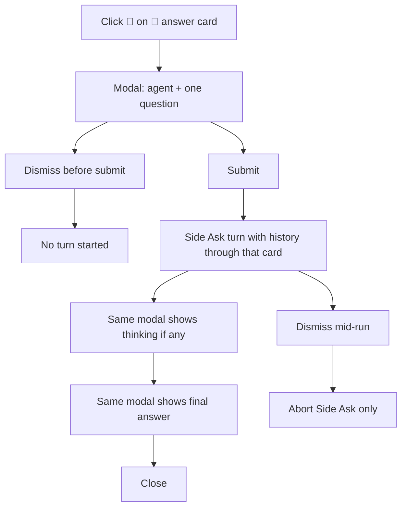

# Slack Side Ask - Plan

## Goal Capsule

- **Objective:** An authorized human in a Managed Slack Thread can privately ask one question of a channel agent, see thinking and the answer in a modal, and leave the thread unchanged.
- **Means:** Footer 💭 on completed 💬 cards; isolated one-shot RocketCode run; `views.update` in the same modal (KTD1, KTD3).
- **Authority:** Slack-only. Product Contract R-IDs win on behavior. KTDs win on mechanism.
- **Stop:** If the Side Ask would take the thread turn slot, write `session_entries` on `slack-thread:…`, or post to the thread, stop and restate.
- **Execution profile:** Test-first on Slack connector contracts, then the isolated host.
- **Tail:** Implementer owns CHEATSHEET. No repository README change.

## Product Contract

**Preservation:** Product Contract unchanged.

### Summary

Completed agent answer cards in Managed Slack Threads gain a reusable footer actions bar. 💭 opens a modal where the human picks a channel agent, asks one question, watches thinking if the turn produces any, then reads the final answer. The Side Ask never posts to the thread and never takes the thread's active-turn slot. Dismissing the modal aborts that Side Ask.

This plan covers the full brainstorm. Tests cover the private ask, a Side Ask during a live thread turn, and dismiss-abort.

### Problem Frame

A Managed Slack Thread has one owner agent and one active turn. Follow-ups go into that thread. There is no private way to ask a channel agent a one-off question against thread history without occupying the thread or publishing the answer.

### Key Decisions

- Footer actions bar on completed 💬 answer cards, 💭 first. (session-settled: user-directed — chosen over a header accessory or latest-reply-only button: Slack header blocks cannot hold a button, and the bar is meant to grow.) Governs R1, R2.
- Modal-only private Side Ask. (session-settled: user-directed — chosen over posting the answer to the thread or making it the thread's next turn: the thread must stay unchanged.) Governs R7, R8, R9.
- History is the Managed Slack Thread up to the clicked answer card. (session-settled: user-directed — chosen over the clicked card only or a cold one-shot.) Governs R10.
- Side Ask may run while the thread has an active turn. (session-settled: user-directed — chosen over refusing until the thread is idle.) Governs R8.
- Slack reaction 💭 does not open the modal. Slack cannot open a modal from `reaction_added` because it has no `trigger_id`. Governs R3.

### Actors

- A1. Authorized human (channel allowlist).
- A2. Channel agent chosen in the modal.
- A3. Thread owner agent (unchanged; may differ from A2).

### Requirements

**Entry**

- R1. Every completed titled agent reply (`💬 {agent}`) in a Managed Slack Thread shows a footer actions bar.
- R2. The first footer button is 💭. Later buttons may be added to the same bar without changing 💭 behavior.
- R3. Clicking 💭 opens a Block Kit modal. Slack reactions and other events without a `trigger_id` do not open it.
- R4. Only allowlisted humans for that channel can use the button. Unauthorized clicks do nothing visible.
- R5. 1:1 DMs do not get the footer or the Side Ask. Goal, cron, and External MCP cards do not get this footer in this work.

**Modal**

- R6. The open modal has a channel-agent chooser, one question field, Submit, and Dismiss. The chooser lists that channel's agents and may preselect the thread's current agent.
- R7. The human may ask exactly one question per Side Ask. After the answer, the modal is read-only except Close.
- R8. A Side Ask does not take the Managed Slack Thread's active-turn slot and may run while that thread has an active turn.
- R9. A Side Ask never posts thinking, the question, or the answer to the Slack thread.

**Context and run**

- R10. The chosen agent sees Managed Slack Thread history up to and including the clicked answer card, then the one question.
- R11. While the Side Ask turn is running, the same modal shows thinking when the turn produces any. If there is no thinking, the modal does not show an empty thinking region.
- R12. When the turn completes, the same modal shows the final response.
- R13. Dismiss or close before submit starts no turn. Dismiss or close after submit aborts the Side Ask turn. The thread turn is not aborted.

### Key Flows

- F1. Open and ask
  - **Trigger:** A1 clicks 💭 on a completed 💬 answer card.
  - **Actors:** A1, A2
  - **Steps:** Modal opens with agent chooser and question field. A1 picks an agent, types one question, submits. A2 runs against history up to that card. The modal shows thinking if any, then the answer. A1 closes.
  - **Covered by:** R1, R3, R6, R7, R10, R11, R12
- F2. Dismiss mid-run
  - **Trigger:** A1 dismisses the modal after submit while A2 is still running.
  - **Actors:** A1, A2
  - **Steps:** The Side Ask turn aborts. The Managed Slack Thread is unchanged and its active turn, if any, continues.
  - **Covered by:** R8, R9, R13
- F3. Side Ask during a thread turn
  - **Trigger:** A1 opens 💭 while the Managed Slack Thread already has an active turn.
  - **Actors:** A1, A2, A3
  - **Steps:** The modal run proceeds independently. A3's thread turn is not paused, queued behind, or replaced.
  - **Covered by:** R8, R9

### Acceptance Examples

- AE1. Private one-shot
  - **Covers:** R7, R9, R10
  - **Given:** A Managed Slack Thread with two completed 💬 replies and an allowlisted human.
  - **When:** They click 💭 on the first reply, pick a channel agent, ask one question, and wait for the answer.
  - **Then:** The chosen agent answered from history through that first reply. The thread has no new message.
- AE2. Abort does not touch the thread
  - **Covers:** R8, R13
  - **Given:** A Side Ask is running and the thread may also have an active turn.
  - **When:** The human dismisses the modal.
  - **Then:** The Side Ask stops. The thread turn, if any, continues. The thread has no new message.
- AE3. Reaction is not an entry
  - **Covers:** R3
  - **Given:** An allowlisted human adds a 💭 reaction to a 💬 answer card.
  - **When:** Slack delivers `reaction_added`.
  - **Then:** No modal opens.

### Scope Boundaries

- In: Slack Managed Slack Threads in mapped channels and Adhoc Callouts that have channel agents (including `@` Channel Entry).
- Out: 1:1 DMs, other connectors, posting Side Ask output to the thread, follow-up questions in the same modal, reacting with 💭 to open the modal, footer buttons beyond 💭, goal/cron/MCP cards.

### Outstanding Questions

- Deferred: Slack `views.update` rate. Coalesce thinking updates (KTD3). Not launch-blocking.

### Assumptions

- Channel allowlist is the same gate as other Slack interactive controls.
- Preselecting the thread's current agent is allowed when that agent is in the channel list.
- `@` Channel Entry supplies the agent list for unmapped Adhoc Callout threads.

---

## Planning Contract

### Key Technical Decisions

- KTD1. Isolated one-shot RocketCode loop, not a Managed Slack Thread turn and not a new `managed_conversations` row. (session-settled: user-approved — chosen over a hidden conversation record: Side Ask must not take the thread slot or leave session rows on `slack-thread:…`.) Governs R8, R9. Do not call `StartThread`, `SubmitThreadReply`, `beginSlackStack`, `Bridge.Submit`, `InterruptConversation`, or `RunRawWithProgress` as-is.
- KTD2. History is `session_entries` for the thread conversation ID with `id <=` the stamped card entry. (session-settled: user-approved — chosen over Slack `conversations.replies`: the agent must see stored tool work, not only Slack text.) Governs R10. Project through `sessionEntriesForProvider`. Do not persist Side Ask output with `AppendEntryID` on the thread ID.
- KTD3. Modal progress uses `views.update` only. Do not use `chat.startStream`, task cards, or thread thinking placeholders. Empty thinking is omitted (R11). Coalesce updates if Slack rate-limits.
- KTD4. Stamp the cutoff on the 💬 card. Put `SessionEntryID` on the completing `OutboundMessage` and encode `{conversationID, sessionEntryID, channelID, threadTS}` in the 💭 button value. Cards without a stamp get an ephemeral refusal, not a Slack-history fallback.
- KTD5. One live Side Ask per user. A second 💭 while one is open is ignored. `view_closed` cancels only that user's Side Ask context. Required in U2.
- KTD6. Tool set is that agent's persistent Slack-turn tools minus thread-mutating ones: no `schedule` / `reset`, `update_goal`, `ask_user_question`, `start_new_thread`, or restart-on-thread-id. No cron mandatory decision tool. Own shell temp dir. `InertCheckpointSink`.
- KTD7. Reuse AskUserQuestion only for `OpenViewContext` / `handleInteractive` / allowlist patterns. Do not extend `slackPendingQuestion`.

### Technical Design

Slack connector owns the footer, modal, and `view_closed`. On 💬 complete, the 💬 reply path appends one trailing actions block after the body and drops the last body chunk if needed (50-block ceiling). Do not add that block inside shared `titledMessageLayout` (goal/cron reuse it).

`handleInteractive` on 💭 opens the input modal (`notify_on_close`). Agent chooser is a modal input `static_select` (not the `$agent` message select). Question is a multiline input with `min_length` 1. Three views: input (Submit + Dismiss), running (Close only, frozen agent/question, thinking only if non-empty), answer or error (Close only).

`runSocketLoop` empty-ACKs interactive events before enqueue. Side Ask `view_submission` must not use that empty ACK. ACK that envelope with `slack.NewUpdateViewSubmissionResponse` to the running view, then start the isolated loop. Later thinking, answer, and errors use `views.update`. `view_closed` after `not_found` is success.

Parse Side Ask private metadata, including `channelID`, before the `socialModeChannel` allowlist check for both `view_submission` and `view_closed`. Slack modal payloads often have no `Channel.ID`.

`harnessbridge` exports one Side Ask runner. It loads `ObserveEntries(threadID, 0)`, keeps `id <= sessionEntryID`, runs `prepareRocketCode` + persistent tools per KTD6, and writes session only in memory. Callbacks are thinking/text only. No `OutputTargetSlack`. No `active_turns` row.

Thread `$stop` does not cancel Side Asks. Side Ask dismiss does not call `InterruptActiveTurn`.

### Implementation Constraints

- No new package. No new conversation kind.
- Error locals start with `err`. No `//nolint` without approval.
- Do not touch `SOURCE_CLOC_BUDGET`. Keep first-party additions small.
- Unix-only. Use `jj`, never `git`.
- Injected behavior uses real or inert implementations, not nil.

### Sequencing

U1 footer stamp → U2 modal lifecycle → U3 isolated run with history and abort. U2 can open/submit/close without a real model by injecting a fake runner.

### Risks

- Footer pushes 💬 cards over Slack's 50-block limit if `rootBodyCount` stays 48.
- `Submit` or `InterruptConversation` on the thread ID violates R8/R13.
- `RunRawWithProgress` would persist to the thread if given the thread conversation ID and would require the cron decision tool.
- Missing `SessionEntryID` on old cards. Refuse per KTD4.
- `c.stacks` must stay untouched. See `docs/solutions/logic-errors/slack-root-app-mention-redelivery-cleared-buffered-follow-ups.md`.

---

## Implementation Units

### U1. 💬 footer and cutoff stamp

- **Goal:** Completed 💬 cards show 💭 and carry the session cutoff.
- **Requirements:** R1, R2, R4, R5
- **Files:** `internal/rocketclaw/events/types.go`, `internal/rocketclaw/harnessbridge/bridge.go`, `internal/rocketclaw/slackconnector/connector.go`, `internal/rocketclaw/slackconnector/connector_test.go`, `internal/rocketclaw/harnessbridge/bridge_test.go`
- **Approach:** Set `SessionEntryID` on the completing outbound 💬 message. After body sections on the 💬 reply path only, append one trailing actions block. Cap body chunks at 47. Visible button text is 💭. Set `AccessibilityLabel` to Side Ask. Omit the footer on DMs, goal, cron, and MCP.
- **Dependencies:** none
- **Test scenarios:**
  - Completed 💬 card's last block is the 💭 actions bar, after all body sections.
  - Goal, cron, and MCP cards have no 💭 footer.
  - Long 💬 body still posts; block count stays at or under 50.
  - Completing outbound 💬 carries a non-zero `SessionEntryID`.
  - 1:1 DM replies have no footer.
- **Verification:** `go test ./internal/rocketclaw/slackconnector ./internal/rocketclaw/harnessbridge ./internal/rocketclaw/events`

### U2. Modal open, submit, and close

- **Goal:** 💭 opens the chooser+question modal. Submit and dismiss behave before any model run.
- **Requirements:** R3, R4, R6, R7, R13
- **Files:** `internal/rocketclaw/slackconnector/connector.go`, `internal/rocketclaw/slackconnector/connector_test.go`
- **Approach:** Handle 💭 `block_actions` with `OpenViewContext`. `notify_on_close: true`. Agent chooser is a modal input `static_select` from `socialModeAgents`; preselect `ThreadAgent` when listed. Unauthorized clicks do nothing visible (R4). A card without a stamp posts an ephemeral refusal and does not open (KTD4). One live Side Ask per user (KTD5). Parse Side Ask metadata, including channel ID, before the allowlist check. Side Ask `view_submission` ACKs with `NewUpdateViewSubmissionResponse`, not the empty socket ACK. Distinct callback ID from AskUserQuestion.
- **Dependencies:** U1
- **Test scenarios:**
  - 💭 with `trigger_id` opens a modal whose private metadata has conversation ID and session entry ID.
  - Chooser lists channel agents and preselects the thread agent.
  - Reaction 💭 does not call `views.open` (AE3).
  - Unauthorized user does not open a modal and gets no ephemeral.
  - Dismiss before submit starts no runner.
  - Card without a stamp posts ephemeral refusal and does not open.
  - A second 💭 while one Side Ask is live is ignored.
- **Verification:** `go test ./internal/rocketclaw/slackconnector`

### U3. Isolated run, history cutoff, modal progress, abort

- **Goal:** Submit runs the chosen agent privately. History stops at the clicked card. Dismiss aborts only the Side Ask.
- **Requirements:** R7, R8, R9, R10, R11, R12, R13
- **Files:** `internal/rocketclaw/harnessbridge/` (new Side Ask runner next to `raw_run.go`), `internal/rocketclaw/harnessbridge/raw_run.go` (do not reuse as-is), `internal/rocketclaw/slackconnector/connector.go`, `internal/rocketclaw/slackconnector/connector_test.go`, `internal/rocketclaw/harnessbridge/*_test.go`, `cmd/rocketclaw/CHEATSHEET.md`
- **Approach:** Export a small runner: prefix session, persistent tools minus KTD6, memory session out, unique shell temp (not the thread path), thinking/text callbacks, caller cancel. Inject the runner on `Connector` the way `oneOffCronjobs` is injected. Connector updates the modal on those callbacks and cancels on `view_closed`. Render thinking with the quoted thread thinking treatment; omit it when empty. Chunk the answer at `slackBlockTextLimit`; never overflow to the thread; stop if the modal would exceed 100 blocks. On runner or `views.update` failure, update the same modal to a Close-only error view. Never set `OutputTargetSlack` or `SlackReply` on Side Ask output. Never touch `c.stacks`.
- **Dependencies:** U2
- **Test scenarios:**
  - Two 💬 cards; Side Ask from the first. Model input includes card 1's session entry and excludes card 2 (AE1).
  - Thread `ObserveEntries` is unchanged after a completed Side Ask.
  - Side Ask during an active thread turn does not call `beginSlackStack` / `promoteSlackStack` and posts no thread message (F3).
  - Buffered follow-up on the thread still promotes after the thread turn, not when the Side Ask ends.
  - `view_closed` mid-run cancels the Side Ask context and does not call `InterruptActiveTurn`.
  - Thread `$stop` does not cancel the Side Ask.
  - Other channel agent uses that agent's identity; thread owner is unchanged.
  - No thinking: modal has no empty thinking block; answer still appears.
  - Thinking callback updates the modal; no `/chat.startStream` or `/chat.postMessage` for the Side Ask.
  - Empty question does not start a runner.
  - Runner error updates the modal to a Close-only error view and does not post to the thread.
  - `RecoverableActiveTurns` has no new `slack-thread:` row for the Side Ask.
- **Verification:** `go test ./internal/rocketclaw/slackconnector ./internal/rocketclaw/harnessbridge`

---

## Verification Contract

- Targeted: `go test ./internal/rocketclaw/slackconnector ./internal/rocketclaw/harnessbridge ./internal/rocketclaw/events`
- Before finalize: `gofmt` on touched files, `go test ./...`, `make lint`, `make test`
- Prove AE1–AE3 and F1–F3. Also prove thread session purity and stack/follow-up preservation.
- CHEATSHEET gains a 💭 Side Ask row. Repository README does not.

---

## Definition of Done

- R1–R13 hold under the tests in U1–U3.
- Product Contract Key Decisions are not reimplemented as a second mechanism.
- No Side Ask path writes `session_entries` or `active_turns` for `slack-thread:…`.
- No Side Ask path posts to the Slack thread.
- Abandoned experiments are deleted from the diff.
- `CONCEPTS.md` Slack Side Ask entry still matches shipped behavior.
- README impact considered: CHEATSHEET only.
