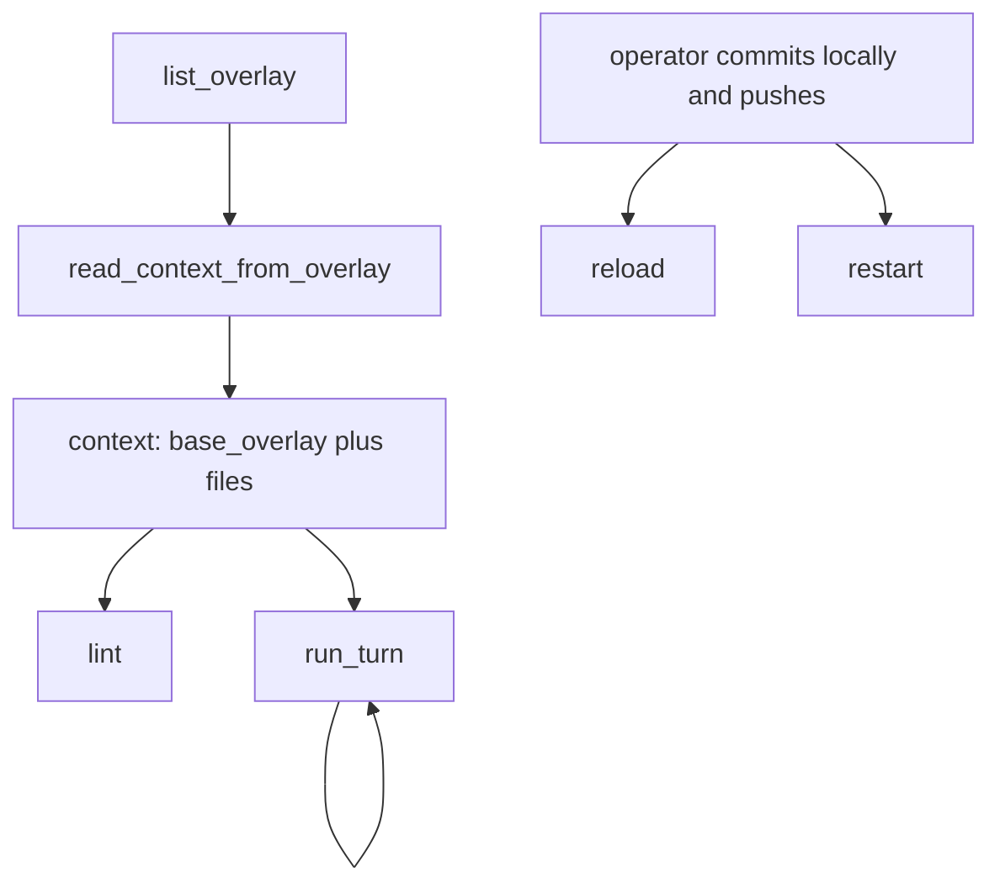
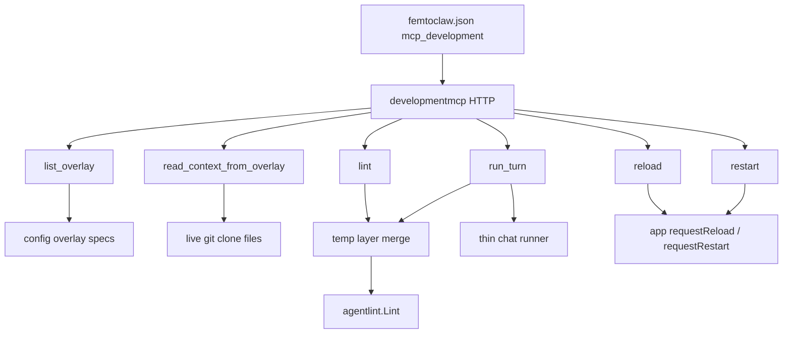

# RocketClaw Development MCP - Plan

## Goal Capsule

- **Objective:** An operator can try overlay changes from a coding agent against a live RocketClaw without writing those files onto the server, then publish through git and tell the server to pick them up.
- **Means:** A second inbound MCP door that copies External MCP transport, a temp overlay-layer merge, and a thin chat runner. (KTD1, KTD3, KTD5)
- **Product authority:** Product Contract is WHAT. Planning Contract is HOW.
- **Product Contract preservation:** unchanged
- **Open blockers:** None.
- **Execution profile:** One subagent per unit. Run every unit that is unblocked. Adversarial checks use both `claude -p` and `codex exec --skip-git-repo-check`. Councils use both `claude -p` and `codex exec --skip-git-repo-check`. The implementer owns the merge.
- **Stop conditions:** AE1–AE5 plus the unit tests below. `gofmt` on touched files. `go test` on touched packages. `make lint` and `make test` pass. Do not edit `GO_SOURCE_CLOC_BUDGET`.

---

## Product Contract

### Summary

A Development MCP, distinct from External MCP, that a coding agent calls.
It is off until an operator turns it on and uses its own credential.
Operators list overlays, read one into context, lint and run turns against that context, then reload or restart after they push.

### Problem Frame

Overlay iteration today means editing generated runtime files, trying the change, then copying it back into the overlay repo to commit and push.
That loop is slow and writes the wrong tree.
External MCP is the production caller door and is the wrong surface for this.

### Key Decisions

- **Separate Development MCP.** Governs R1.
  (session-settled: user-directed — chosen over External MCP: External MCP is for production callers)
- **Request-carried context.** Governs R3, R6, R11.
  (session-settled: user-directed — chosen over a server-side sticky overlay: every call carries what it needs; conversation_id is only chat)
- **Named base overlay plus file deltas.** Governs R3, R4, R5.
  (session-settled: user-directed — chosen over sending a full snapshot on every call: smaller lint/run requests)
- **Full call set in v1.** Governs R2, R12.
  (session-settled: user-directed — chosen over a smaller first slice: list, read, lint, run_turn, reload, and restart)
- **Any operator with the credential.** Governs R1.
  (session-settled: user-directed — chosen over localhost-only: off by default, shared among operators who have the creds)
- **On/off in femtoclaw.json.** Governs R1.
- **Try uses the live overlay stack.** Governs R3, R9.
  (session-settled: user-approved — chosen over named-overlay-only: a try should match what reload will serve)
- **run_turn is live tools, Development MCP chat.** Governs R10.
  (session-settled: user-directed — chosen over a full production turn: Q&A stays on this door; no Slack thread and no External MCP session)
- **list_overlay names configured git overlays only.** Governs R7.

### Actors

- A1. Operator — human with a local overlay checkout and a coding agent.
- A2. Coding agent — MCP client (VSCode / OpenCode / Codex / Claude Code).
- A3. Development MCP — the live RocketClaw development door.

### Requirements

**Access**

- R1. Development MCP is a separate door from External MCP. It is off until enabled in `femtoclaw.json`. It uses its own credential. Any operator who has that credential may connect.
- R2. The door exposes six calls: `rocketclaw_development_list_overlay`, `rocketclaw_development_read_context_from_overlay`, `rocketclaw_development_lint`, `rocketclaw_development_run_turn`, `rocketclaw_development_reload`, `rocketclaw_development_restart`.

**Context**

- R3. `lint` and `run_turn` require a `context`. `context` is an optional `base_overlay` name from `list_overlay` plus a `files` list of `{path, content}`. Those calls evaluate the live overlay stack. `context` replaces only the named `base_overlay` layer. If `base_overlay` is unset, sent files sit on top of the remaining live stack.
- R4. Each sent `files` path replaces that path in the overlay for this call only.
- R5. If `base_overlay` is set, an omitted path comes from that overlay's current published files at call time. A prior `read_context_from_overlay` snapshot is not reused. If `base_overlay` is unset, an omitted path is not in this overlay.
- R6. The server does not remember `context` after the call returns. It does not echo `context` on lint, run_turn, reload, or restart.
- R7. `list_overlay` returns names of configured git overlays only. Those names are the only valid `base_overlay` values.
- R8. `read_context_from_overlay` takes an overlay name and returns a `context` with that `base_overlay` and that overlay's files.

**Runs and publish**

- R9. `lint` reports whether the overlay represented by `context` is well-formed, including cyclic agent calls.
- R10. `run_turn` takes `agent`, `prompt`, and `conversation_id`. Empty `conversation_id` starts a new conversation. It returns `conversation_id`, thinking, and the final answer. The turn uses live tools. The conversation stays on the Development MCP. It does not open a Slack thread or an External MCP session.
- R11. `conversation_id` carries only chat history. A follow-up turn must send `context` again. Omitted paths in that `context` resolve per R5 at this call, not from the previous turn's files.
- R12. `reload` and `restart` take a reason and no `context`. They pick up what the operator already pushed. `reload` applies overlay file changes the live daemon can hot-load. `restart` is required for overlay-list or runtime-config changes.
- R13. lint and run_turn do not write overlay files onto the server.

### Key Flows

- F1. Load an existing overlay
  - **Trigger:** The coding agent needs a base to edit against.
  - **Actors:** A2, A3
  - **Steps:** Call `list_overlay`. Call `read_context_from_overlay` with a name to print that overlay. Nothing is written on the caller. Send `context` with that `base_overlay` and the files the caller wants to try.
  - **Covered by:** R7, R8, R3, R4, R5
- F2. Quick loop
  - **Trigger:** The operator wants to try an overlay change before publishing.
  - **Actors:** A1, A2, A3
  - **Steps:** Call `lint` with `context`. Call `run_turn` with `context`, agent, and prompt. Read thinking and the answer. The Q&A stays on this door. Repeat.
  - **Covered by:** R9, R10, R13
- F3. Follow-up turn
  - **Trigger:** The coding agent wants another turn in the same conversation.
  - **Actors:** A2, A3
  - **Steps:** Call `run_turn` with the same `conversation_id`, a new prompt, and a full `context` again.
  - **Covered by:** R10, R11
- F4. Publish
  - **Trigger:** The operator is done with the quick loop.
  - **Actors:** A1, A2, A3
  - **Steps:** Commit and push locally. Call `reload` or `restart` with a reason.
  - **Covered by:** R12

### Acceptance Examples

- AE1. Delta on a named overlay
  - **Covers R5, R4.**
  - **Given:** Overlay `skills` has `agents/a.md` and `agents/b.md`.
  - **When:** `lint` is called with `base_overlay: "skills"` and `files` containing only a new `agents/a.md`.
  - **Then:** This call uses the new `a.md` and the overlay's `b.md`.
- AE2. Snapshot with no base
  - **Covers R5.**
  - **Given:** A deployed overlay has `agents/b.md`.
  - **When:** `lint` is called with no `base_overlay` and `files` containing only `agents/a.md`.
  - **Then:** The extra layer for this call has `a.md` and does not contribute `b.md`. Other live overlays still apply.
- AE3. Context is not sticky
  - **Covers R6, R11.**
  - **Given:** A `run_turn` returned `conversation_id` C.
  - **When:** The next `run_turn` sends C and a different `context`.
  - **Then:** Chat history under C continues. This turn uses the new `context`, not the previous one.
- AE4. Reload ignores local context
  - **Covers R12.**
  - **Given:** The operator has unpushed local overlay edits.
  - **When:** They call `reload` without pushing.
  - **Then:** Live assets stay on what is already published. The unpushed files are not installed.
- AE5. Follow-up drops unsent deltas
  - **Covers R5, R11.**
  - **Given:** A `run_turn` used `base_overlay: "skills"` and sent a new `agents/a.md`.
  - **When:** The next `run_turn` uses the same `conversation_id` and `base_overlay` with empty `files`.
  - **Then:** Chat history continues. This turn uses the current published overlay, not the previous turn's `a.md`.

### Scope Boundaries

- Not External MCP, `session_prompt`, or that door's credential.
- Not a preview-branch fetch or a second runtime beside the live daemon.
- Not writing overlay files onto the server as the way to try a change.
- Not workspace-only overlay iteration. Leftover local `agents/` / `skills/` on the server is not a `base_overlay`.

### Dependencies / Assumptions

- The live daemon already merges overlays, lints runtime assets, and can reload or restart.
- The operator's source of truth for publish is a local commit and push.

### Outstanding Questions

**Deferred (non-blocking)**

- Exact listen default if unset when enabled (fail closed like External MCP).

### Sources / Research

- Overlay merge and reload: `internal/rocketclaw/skel/skel.go`, `internal/rocketclaw/app/app.go`.
- Inbound External MCP today: `internal/rocketclaw/externalmcp/server.go`.
- `rocketclaw lint next`: `cmd/rocketclaw/lint.go`.
- `rocketclaw exec` cannot reload or restart: `cmd/rocketclaw/exec.go`.

---

## Planning Contract

### Key Technical Decisions

- KTD1. **New `developmentmcp` package, not External MCP tools.** Copy `internal/rocketclaw/externalmcp` transport (stateless streamable HTTP, Basic Auth wrapper, own listen). Do not add tools to `session_prompt`. Do not create External MCP sessions or Slack threads.
- KTD2. **`base_overlay` is the overlay spec string** from `overlays` in config. `list_overlay` returns those specs in config order. Unknown spec is rejected. (Plan-time; chosen over clone-basename slugs.)
- KTD3. **Temp layer-aware merge.** Build a try tree in `os.MkdirTemp(workspace, ".rocketclaw-devmcp-*")`. Replay embedded → git overlays in order → workspace. At the matching git overlay, use the live clone files with request `files` overlaid. If `base_overlay` is unset, apply the full live stack then request `files` as a top extra layer. Never call `applyGitOverlay` on a try. Never write the live runtime or live clone.
- KTD4. **Own credential file.** Sibling of `rocketclaw.users.json` with a different filename. Never reuse External MCP users. Auth required when the door is enabled. Off until `Enabled` is true. Same `Config` type serves `femtoclaw.json` and `rocketclaw.json`.
- KTD5. **Thin chat `run_turn`.** Namespace conversation IDs (`devmcp-…`). Live tools. Hide or inert in-turn `rocketclaw_reload` / `rocketclaw_restart`. Do not use `RunRawWithProgress` as the chat door (cron provenance and mandatory decision tool). Do not call `startExternalMCPServer`.
- KTD6. **Reuse live reload/restart closures** in `internal/rocketclaw/app/app.go`. MCP `reload`/`restart` take a reason only.
- KTD7. **One unit, one subagent.** Dispatch every unblocked unit in parallel. After a unit lands, adversarial-check with both `claude -p` and `codex exec --skip-git-repo-check`. If they disagree, council with both `claude -p` and `codex exec --skip-git-repo-check`. Do not batch two units into one agent. This is execution direction, not product scope.

### High-Level Technical Design

### Assumptions

- Change `mynrwzrk` already raised `GO_SOURCE_CLOC_BUDGET` from 19250 to 20250 (`internal/rocketclaw/Makefile`). This work does not edit the budget again. Stay inside 20250.
- Live clone contents match the last successful reload. Try reads do not fetch git.
- Leftover workspace `agents/` is still the last live merge layer. Tests must not plant workspace files that hide AE1 unless that is the case under test.

### Implementation Constraints

- Do not touch External MCP session tables or `session_prompt`.
- Do not raise or edit CLOC budget fields.
- Unix only. No Windows paths.
- Injected behavior stays real or inert. No nil-means-disabled.

### Sequencing

Wave A, all at once: U1, U2, U4, U5, U6, U19.
Wave B, all at once: U3, U7, U8, U9, U10, U11.
Wave C, all at once: U12, U13, U14, U16, U17.
Wave D, all at once: U15, U18, U20.
Wave E, all at once: U21, U22, U23, U24.
Wave F, all at once: U25, U26, U27.

Every unit is one subagent. After each unit: KTD7.

---

## Implementation Units

| U-ID | Title | Files | Depends on |
|------|-------|-------|------------|
| U1 | Config fields | `internal/rocketclaw/config/config.go` | — |
| U2 | Users file | `internal/rocketclaw/config/config.go` | — |
| U3 | Example JSON | `internal/rocketclaw/rocketclaw.example.json` | U1 |
| U4 | List specs | `internal/rocketclaw/skel/skel.go` | — |
| U5 | Read live clone | `internal/rocketclaw/skel/skel.go` | — |
| U6 | Temp full-stack merge | `internal/rocketclaw/skel/skel.go` | — |
| U7 | Named-layer replace | `internal/rocketclaw/skel/skel.go` | U6 |
| U8 | Extra top layer | `internal/rocketclaw/skel/skel.go` | U6 |
| U9 | Live tree unchanged | `internal/rocketclaw/skel/skel_test.go` | U6 |
| U10 | Unknown base error | `internal/rocketclaw/skel/skel.go` | U7 |
| U11 | Server + auth | `internal/rocketclaw/developmentmcp/server.go` | U1, U2 |
| U12 | list tool | `internal/rocketclaw/developmentmcp/` | U4, U11 |
| U13 | read tool | `internal/rocketclaw/developmentmcp/` | U5, U11 |
| U14 | lint helper | `internal/rocketclaw/developmentmcp/` | U7, U8 |
| U15 | lint tool | `internal/rocketclaw/developmentmcp/` | U11, U14 |
| U16 | reload tool | `internal/rocketclaw/developmentmcp/` | U11 |
| U17 | restart tool | `internal/rocketclaw/developmentmcp/` | U11 |
| U18 | reject context on reload/restart | `internal/rocketclaw/developmentmcp/` | U16, U17 |
| U19 | thin chat runner | `internal/rocketclaw/harnessbridge/` | — |
| U20 | run_turn tool | `internal/rocketclaw/developmentmcp/` | U7, U11, U19 |
| U21 | conversation follow-up | `internal/rocketclaw/developmentmcp/` | U20 |
| U22 | inert in-turn reload/restart | `internal/rocketclaw/developmentmcp/` | U20 |
| U23 | no Slack / External MCP session | `internal/rocketclaw/developmentmcp/` | U20 |
| U24 | app.Run wiring | `internal/rocketclaw/app/app.go` | U11, U20 |
| U25 | doctor | `cmd/rocketclaw/doctor.go` | U24 |
| U26 | CHEATSHEET | `cmd/rocketclaw/CHEATSHEET.md` | U12–U17, U20 |
| U27 | README | `README.md` | U24 |

Each unit below: one subagent, then KTD7. Do not combine units.

### U1. Config fields

- **Goal:** `MCPDevelopment` `{enabled, listen_addr}` loads. Enabled without listen addr fails. Default off.
- **Requirements:** R1
- **Dependencies:** none
- **Files:** `internal/rocketclaw/config/config.go`, `internal/rocketclaw/config/config_test.go`
- **Approach:** Sibling of `MCPExternal`. Same `Config` for `femtoclaw.json` and `rocketclaw.json`.
- **Test scenarios:** enabled missing listen addr fails; disabled loads.
- **Verification:** `go test ./internal/rocketclaw/config`

### U2. Users file

- **Goal:** A distinct 0600 users file, not `rocketclaw.users.json`.
- **Requirements:** R1
- **Dependencies:** none
- **Files:** `internal/rocketclaw/config/config.go`, `internal/rocketclaw/config/config_test.go`
- **Approach:** Copy External MCP users load with a new filename. Enabled requires this file.
- **Test scenarios:** External MCP users cannot authenticate here; missing file is ok when disabled.
- **Verification:** `go test ./internal/rocketclaw/config`

### U3. Example JSON

- **Goal:** Example config shows the new block off.
- **Requirements:** R1
- **Dependencies:** U1
- **Files:** `internal/rocketclaw/rocketclaw.example.json`
- **Approach:** Mirror the `mcp_external` example shape.
- **Test scenarios:** example decodes with `Enabled: false`.
- **Verification:** `go test ./internal/rocketclaw/config`

### U4. List overlay specs

- **Goal:** Return configured overlay spec strings in config order.
- **Requirements:** R7
- **Dependencies:** none
- **Files:** `internal/rocketclaw/skel/skel.go`, `internal/rocketclaw/skel/skel_test.go`
- **Approach:** Thin wrapper over `OverlayInfos` / config `overlays`. Spec string is the name.
- **Test scenarios:** order matches config; empty list when none configured.
- **Verification:** `go test ./internal/rocketclaw/skel`

### U5. Read live clone files

- **Goal:** Print one live clone as `{base_overlay, files}`.
- **Requirements:** R8, F1
- **Dependencies:** none
- **Files:** `internal/rocketclaw/skel/skel.go`, `internal/rocketclaw/skel/skel_test.go`
- **Approach:** Walk that clone's five overlay roots. No fetch. No write.
- **Test scenarios:** known spec returns files; unknown spec errors; result is valid merge input.
- **Verification:** `go test ./internal/rocketclaw/skel`

### U6. Temp full-stack merge

- **Goal:** Copy the live stack into `os.MkdirTemp(workspace, ".rocketclaw-devmcp-*")`.
- **Requirements:** R13
- **Dependencies:** none
- **Files:** `internal/rocketclaw/skel/skel.go`, `internal/rocketclaw/skel/skel_test.go`
- **Approach:** Replay embedded → git overlays → workspace into the temp dir. Do not call `applyGitOverlay`.
- **Test scenarios:** temp tree has the live merge; live runtime is untouched.
- **Verification:** `go test ./internal/rocketclaw/skel`

### U7. Named-layer replace

- **Goal:** Request files replace only the named git overlay layer (AE1).
- **Requirements:** R3, R4, R5, AE1
- **Dependencies:** U6
- **Files:** `internal/rocketclaw/skel/skel.go`, `internal/rocketclaw/skel/skel_test.go`
- **Approach:** At the matching `OverlayInfo`, use live clone files plus request overlays, then continue later layers.
- **Test scenarios:** AE1. Omitted path comes from that live clone.
- **Verification:** `go test ./internal/rocketclaw/skel`

### U8. Extra top layer

- **Goal:** Unset `base_overlay` adds request files on top of the live stack (AE2).
- **Requirements:** R3, R5, AE2
- **Dependencies:** U6
- **Files:** `internal/rocketclaw/skel/skel.go`, `internal/rocketclaw/skel/skel_test.go`
- **Approach:** Full live stack, then request files as a final extra layer.
- **Test scenarios:** AE2. Other live overlays still apply.
- **Verification:** `go test ./internal/rocketclaw/skel`

### U9. Live tree unchanged

- **Goal:** Prove try merge does not write live clones or live runtime.
- **Requirements:** R13
- **Dependencies:** U6
- **Files:** `internal/rocketclaw/skel/skel_test.go`
- **Approach:** Snapshot live `overlays/` and runtime dir before/after U6–U8 calls.
- **Test scenarios:** bit-identical live trees after merge.
- **Verification:** `go test ./internal/rocketclaw/skel`

### U10. Unknown base error

- **Goal:** Unknown `base_overlay` fails closed.
- **Requirements:** R7
- **Dependencies:** U7
- **Files:** `internal/rocketclaw/skel/skel.go`, `internal/rocketclaw/skel/skel_test.go`
- **Approach:** Reject a spec that is not in the configured list.
- **Test scenarios:** unknown spec errors; live tree unchanged.
- **Verification:** `go test ./internal/rocketclaw/skel`

### U11. Server and auth

- **Goal:** Stateless HTTP MCP listens with required Basic Auth.
- **Requirements:** R1
- **Dependencies:** U1, U2
- **Files:** `internal/rocketclaw/developmentmcp/server.go`, `internal/rocketclaw/developmentmcp/server_test.go`
- **Approach:** Copy External MCP transport only. Name `rocketclaw-development-mcp`. No tools yet.
- **Test scenarios:** missing/wrong auth rejected; External MCP users rejected.
- **Verification:** `go test ./internal/rocketclaw/developmentmcp`

### U12. list_overlay tool

- **Goal:** MCP tool returns U4 specs.
- **Requirements:** R2, R7
- **Dependencies:** U4, U11
- **Files:** `internal/rocketclaw/developmentmcp/`
- **Approach:** One tool. No `context`.
- **Test scenarios:** tool output matches U4 order.
- **Verification:** `go test ./internal/rocketclaw/developmentmcp`

### U13. read_context_from_overlay tool

- **Goal:** MCP tool returns U5 printout.
- **Requirements:** R2, R8, F1
- **Dependencies:** U5, U11
- **Files:** `internal/rocketclaw/developmentmcp/`
- **Approach:** One tool. Nothing written on disk.
- **Test scenarios:** known spec returns context; unknown spec errors.
- **Verification:** `go test ./internal/rocketclaw/developmentmcp`

### U14. Lint helper

- **Goal:** `agentlint.Lint` on a U7/U8 try tree.
- **Requirements:** R9
- **Dependencies:** U7, U8
- **Files:** `internal/rocketclaw/developmentmcp/`
- **Approach:** Merge then lint. Do not call `rocketclaw lint next`.
- **Test scenarios:** clean tree ok; cyclic pair reports `RC003`.
- **Verification:** `go test ./internal/rocketclaw/developmentmcp`

### U15. lint tool

- **Goal:** MCP `lint` calls U14.
- **Requirements:** R2, R6, R9
- **Dependencies:** U11, U14
- **Files:** `internal/rocketclaw/developmentmcp/`
- **Approach:** Require `context`. Do not remember it.
- **Test scenarios:** AE1/AE2 via the tool.
- **Verification:** `go test ./internal/rocketclaw/developmentmcp`

### U16. reload tool

- **Goal:** MCP `reload` calls the injected reload closure.
- **Requirements:** R2, R12, AE4
- **Dependencies:** U11
- **Files:** `internal/rocketclaw/developmentmcp/`
- **Approach:** Reason only. No `context`.
- **Test scenarios:** AE4. Injected closure is called with the reason.
- **Verification:** `go test ./internal/rocketclaw/developmentmcp`

### U17. restart tool

- **Goal:** MCP `restart` calls the injected restart closure.
- **Requirements:** R2, R12
- **Dependencies:** U11
- **Files:** `internal/rocketclaw/developmentmcp/`
- **Approach:** Reason only. No `context`.
- **Test scenarios:** injected closure is called with the reason.
- **Verification:** `go test ./internal/rocketclaw/developmentmcp`

### U18. Reject context on reload/restart

- **Goal:** reload/restart reject a `context` field.
- **Requirements:** R6, R12
- **Dependencies:** U16, U17
- **Files:** `internal/rocketclaw/developmentmcp/`
- **Approach:** Fail the tool call if `context` is present.
- **Test scenarios:** both tools error when `context` is sent.
- **Verification:** `go test ./internal/rocketclaw/developmentmcp`

### U19. Thin chat runner

- **Goal:** A harness hook runs one chat turn against a try tree.
- **Requirements:** R10
- **Dependencies:** none
- **Files:** `internal/rocketclaw/harnessbridge/` (smallest hook)
- **Approach:** Not `RunRawWithProgress`. Not External MCP. `Workspace` stays the real workspace. Runtime/WorkDir points at the try tree.
- **Test scenarios:** one prompt returns thinking plus a final answer.
- **Verification:** `go test ./internal/rocketclaw/harnessbridge`

### U20. run_turn tool

- **Goal:** MCP `run_turn` merges, then calls U19.
- **Requirements:** R2, R10, F2
- **Dependencies:** U7, U11, U19
- **Files:** `internal/rocketclaw/developmentmcp/`
- **Approach:** Empty `conversation_id` starts `devmcp-…`.
- **Test scenarios:** new id returned; thinking and answer present.
- **Verification:** `go test ./internal/rocketclaw/developmentmcp`

### U21. Conversation follow-up

- **Goal:** Same id keeps chat. New `context` applies now (AE3, AE5).
- **Requirements:** R11, AE3, AE5, F3
- **Dependencies:** U20
- **Files:** `internal/rocketclaw/developmentmcp/`
- **Approach:** `conversation_id` is chat only. Overlay resolves per R5 this call.
- **Test scenarios:** AE3. AE5.
- **Verification:** `go test ./internal/rocketclaw/developmentmcp`

### U22. Inert in-turn reload/restart

- **Goal:** A try agent cannot mutate live assets via those tools.
- **Requirements:** R13
- **Dependencies:** U20
- **Files:** `internal/rocketclaw/developmentmcp/`, harnessbridge if needed
- **Approach:** Hide or inert `rocketclaw_reload` / `rocketclaw_restart` on try turns.
- **Test scenarios:** in-turn reload/restart does not change live assets.
- **Verification:** `go test ./internal/rocketclaw/developmentmcp`

### U23. No Slack or External MCP session

- **Goal:** `run_turn` does not open a Slack thread or External MCP binding.
- **Requirements:** R10
- **Dependencies:** U20
- **Files:** `internal/rocketclaw/developmentmcp/`
- **Approach:** Do not call External MCP session insert or Slack thread create.
- **Test scenarios:** no new External MCP session row; no Slack thread id.
- **Verification:** `go test ./internal/rocketclaw/developmentmcp`

### U24. app.Run wiring

- **Goal:** Enabled config starts the door with live reload/restart closures.
- **Requirements:** R1, F4
- **Dependencies:** U11, U20
- **Files:** `internal/rocketclaw/app/app.go`, `internal/rocketclaw/app/app_test.go`
- **Approach:** Start beside External MCP. Disabled does not listen.
- **Test scenarios:** enabled starts; disabled does not.
- **Verification:** `go test ./internal/rocketclaw/app`

### U25. doctor

- **Goal:** Doctor prints Development MCP enabled/listen.
- **Requirements:** R1
- **Dependencies:** U24
- **Files:** `cmd/rocketclaw/doctor.go`, `cmd/rocketclaw/doctor_test.go`
- **Approach:** Sibling of the External MCP doctor line.
- **Test scenarios:** doctor output includes the flag.
- **Verification:** `go test ./cmd/rocketclaw`

### U26. CHEATSHEET

- **Goal:** CHEATSHEET names the six tools and that they are not External MCP.
- **Requirements:** R2
- **Dependencies:** U12, U13, U15, U16, U17, U20
- **Files:** `cmd/rocketclaw/CHEATSHEET.md`
- **Approach:** Short section. Do not describe `session_prompt`.
- **Test scenarios:** none. Review the paragraph.
- **Verification:** file mentions all six tool names

### U27. README

- **Goal:** README has a short Development MCP paragraph.
- **Requirements:** R1
- **Dependencies:** U24
- **Files:** `README.md`
- **Approach:** Distinct from External MCP.
- **Test scenarios:** none. Review the paragraph.
- **Verification:** README names the door and that it is off until enabled

---

## Verification Contract

- Per unit: the `go test` line on that unit.
- After merge: `gofmt` on touched files, `go test ./internal/rocketclaw/developmentmcp ./internal/rocketclaw/skel ./internal/rocketclaw/config ./internal/rocketclaw/app ./internal/rocketclaw/agentlint`, then `go test ./...`, `make lint`, `make test`.
- Adversarial check: for each unit diff, run both `claude -p` and `codex exec --skip-git-repo-check` with a read-only review prompt.
- Council: if those two disagree, run both `claude -p` and `codex exec --skip-git-repo-check` again as a council on the disagreement. Merge only after the council.
- Do not treat CLOC overage as a reason to edit the budget.

---

## Definition of Done

- R1–R13 and AE1–AE5 have tests or are covered by a named unit scenario.
- A coding agent can complete F1–F4 using only the six tools.
- Try trees never mutate live runtime or live clones.
- `run_turn` creates no Slack thread and no External MCP session.
- In-turn reload/restart cannot change live assets.
- README mentions the Development MCP door.
- Abandoned experiment code is deleted from the diff.
- `gofmt`, unit tests, `make lint`, and `make test` pass.
