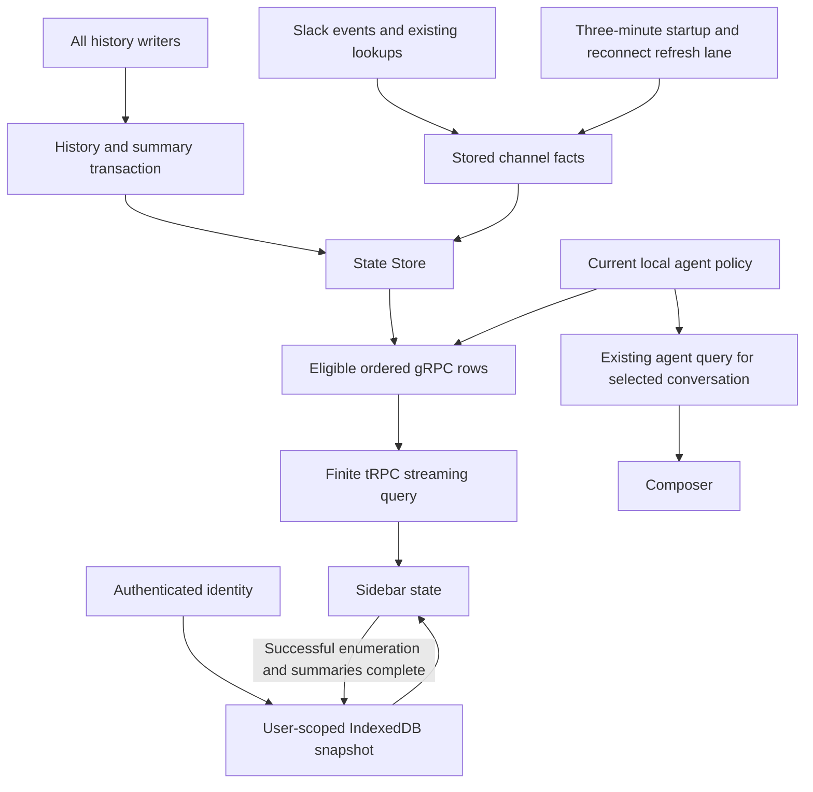

# Fast conversation sidebar

## Goal Capsule

- **Objective:** Ulderico can open or return to the Web sidebar and find a conversation without waiting for the entire conversation list to reload.
- **Owner:** Ulderico, who requested this improvement and selected its scope in the planning conversation.
- **Scope:** Stored summaries, background Slack metadata refresh, progressive delivery, and a saved browser list. Five implementation units follow the requirements below.
- **Stop conditions:** Stop if exact preview/visibility semantics cannot be preserved, identity isolation fails, or the source-size/coverage gates cannot be met honestly.
- **Delivery ownership:** Implementation includes local verification and documentation. Production rollout requires a coordinated backend/Web deployment after active turns finish. This document does not authorize a merge or deploy.

---

## Product Contract

### Problem Frame

PR #47 reduced the production-clone list from roughly 35 seconds to 3.831 seconds for 445 conversations and a 17 MB HTTP response.
It preserves the 4 MiB gRPC message limit by streaming individual entries, but the backend still reconstructs summaries from history and the Web proxy collects the entire stream.
The browser therefore waits for the complete enumeration and requests another refresh every two seconds.
The measurement is historical evidence, not a measurement of this proposed design.

### Requirements

**Summary correctness**

- R1. Persist each history's full last meaningful user message and last-updated timestamp using the existing Go replay/display interpretation.
- R2. Maintain those values atomically with every history mutation, including synchronized copies, paired MCP writes, deletion and retention.
- R3. Start backfilling missing summaries in the background when the runtime starts, without delaying readiness or the acceptance of work. Commit progress incrementally and resume unfinished work after restart. Do not modify replay data or create conversation records. While summaries are missing, serve available list data promptly and explicitly mark ordering/search as incomplete; stream completion alone does not establish summary completeness.
- R4. Preserve existing recorded-conversation inclusion, private-producer/Cron exclusions, settled grouping and ordering, with timestamps aligned to the user-selected microsecond precision. A conversation whose history is deleted remains listed when its conversation record remains eligible.

**Slack freshness**

- R5. Persist Slack channel facts by stable channel identity and serve list metadata without waiting for a Slack API request, including a cold metadata cache.
- R6. Refresh known channels every three minutes and opportunistically from rename events, successful existing lookups, startup and successful reconnect. Outages and rate limits may extend staleness; failed refreshes retain the last known value.
- R7. Derive displayed agent choices from current local configuration and loaded agent definitions, not persisted permission lists. Cached labels or choices must not authorize actions or alter conversation routing.

**Progressive and saved display**

- R8. Deliver recent conversations to the browser before enumeration completes, retaining full previews and the default 4 MiB per-message gRPC limit.
- R9. Show the last complete list for the server-confirmed user immediately on return, and restore it from browser storage on reload while refreshing.
- R10. Mark initial results as incomplete and saved results as refreshing/stale until successful completion. Search continues over full available previews; an incomplete list must not claim authoritative “no matches.”
- R11. Merge incoming rows by conversation ID while refreshing, and remove absent rows only after successful enumeration. Failed or cancelled streams must not replace the saved complete snapshot.
- R12. Scope memory, storage and in-flight refreshes to the authenticated Web identity. Identity rejection/change clears the previous user's visible state and prevents late results from restoring it.
- R13. Successful local history deletion removes its preview from displayed and persisted search data and invalidates older in-flight results. Session selection and entered filters survive normal progressive refresh.

### Key Decisions

- **Keep full previews and the receive limit.** Governs R1, R8. (session-settled: user-directed — chosen over preview truncation or unlimited messages: preserve the existing content contract.)
- **Three-minute Slack refresh plus opportunistic updates.** Governs R5–R7. (session-settled: user-directed — chosen over five-minute refreshes and blocking list-time lookups: names should update sooner without slowing the sidebar.)
- **Saved display with visible freshness.** Governs R9–R12. (session-settled: user-approved — chosen over waiting for a fresh complete list: briefly stale display is acceptable when refreshing.)

### Success Criteria

Measure first useful display, fresh first-screen delivery, full transfer and startup time separately against the same fixed dataset. The previously discussed 100 ms saved-display and 300 ms fresh-first-screen figures are directional targets, not measured promises or newly imposed release gates. Ulderico owns the user requirements; do not invent tighter numerical requirements while implementing them.

- Same-user return and reload display saved rows without waiting for a fresh enumeration, after identity confirmation where needed.
- Fresh recent rows reach the browser before the full response completes.
- Full enumeration preserves conversation IDs, full previews, microsecond-normalized timestamps and current policy results under unchanged inputs.
- Background backfill does not gate startup readiness; measure contention while it runs rather than assuming a goroutine makes its resource cost disappear.
- Separately measure navigation-to-first-rows over Tailscale, including identity and document loading; report it without treating loopback results as remote-user latency.
- There are zero Slack network calls and zero replay-history reads attributable to a steady-state list request.

### Scope Boundaries

This is a sidebar data/read-path improvement. Existing prompt, queue, delivery, permissions and model replay contracts remain requirements.
The plan does not introduce new agent tools, server-side search, preview truncation or a general cache framework.
Fully offline identity selection is excluded: persisted rows are shown only after live identity confirmation on reload.

Keep finite refreshes; remove duplicate/overlapping enumeration. Delta feeds and list virtualization are outside this change.

---

## Planning Contract

### Key Technical Decisions

- KTD1. **Store summaries once, read them directly.** Covers R1–R4. Reuse `protocol.SessionSummary` in a table keyed by conversation ID, separate from managed records and replay entries. Store previews as `BYTEA` to preserve decoded NUL characters; use native PostgreSQL timestamps with Go aligned to microseconds. Preserve the final valid timestamp in entry-ID order, not `MAX(timestamp)`. (session-settled: user-directed — persist summaries instead of rebuilding on reads; microseconds are sufficient.)

- KTD2. **Backfill in the background; maintain summaries with history writes.** Covers R2–R3. Start one runtime-owned goroutine after acquiring the existing run lock, without delaying readiness. Reuse the Go decoder, commit progress incrementally, and resume missing histories after restart. Cancel and join it before releasing the runtime lock/database, including startup failures. Database/decoding errors stop only backfill, log the failure and leave completeness false; retry on the next restart. (session-settled: user-directed — short startup; user-approved — backfill failure does not stop conversations.)
  Update history and summary in the same transaction. Keep valid empty summaries after history deletion; derive paired histories separately and leave duplicate syncs unchanged. Reuse existing serialization; add coordination only for demonstrated overlaps, including background backfill versus live writes/deletion. Never overwrite a newer summary or resurrect deleted history. No runtime-wide scan lock. Report missing-summary completeness separately from transport completion.

- KTD3. **Reuse the connector lifecycle and State Store for Slack facts.** Covers R5–R7. Wire a narrow storage interface at assembly; Slack owns API access. Store names by workspace/channel ID, never `@` or derived agent lists. Refresh known recorded IDs, including group DMs, through one cancellable background loop with R6's triggers. Reuse successful lookups and rename events; avoid overlapping refreshes, event-loop blocking and network calls under connector locks. Honor `Retry-After`; keep prior facts on failure. An old in-flight lookup must not overwrite a newer observation; delayed events converge on the next refresh rather than requiring a general event-ordering system.
  Unknown names display the stable ID without guessing mapped policy through `@`. Derive choices from current configuration and stored facts. Keep live action authorization independent of sidebar caching.

- KTD4. **Carry the finite stream through tRPC's existing query integration.** Covers R4, R8, R10–R12. Use stable `httpBatchStreamLink` for the sessions query, isolated from unrelated operations so cancellation can reach its request. Return an async iterable instead of an Effect that collects the entire list. Consume grpc-js's readable iterator directly, with abort/finalization cancelling the RPC and releasing database rows.
  Use one ordered summary query, including eligible conversations with no history. Sort timestamps descending and conversation IDs ascending (bytewise collation, matching Go); preserve zero-time/missing-summary behavior. Send the existing one-conversation-per-message responses as rows are read. An individually oversized session retains the existing explicit failure; it is never truncated.
  Translate errors during iteration, not only iterable creation. Send an authenticated owner with the enumeration and a terminal completion value only after upstream success. Browser promotion requires that completion value and successful HTTP-stream exhaustion; cancellation restoring a query's old success state is insufficient.

- KTD5. **Keep one last-complete snapshot beside the progressive query data.** Covers R9–R13. tRPC 11.18.0 resets its progressive cache before the first item and leaves a prefix after failure; `isSuccess` cannot authorize persistence. Keep one active sidebar enumeration; scheduled refreshes wait for it to finish. Composer choices use the separate existing agent-query surface below.
  Preserve the existing identity-independent protocol version probe used by Web startup and periodic compatibility checks. Add a separate browser identity operation that returns the username Go resolves from connection metadata. Key memory and native IndexedDB storage by origin, confirmed username and protocol/list format. Revalidate at reload and reject enumeration-owner mismatches before showing or saving rows. Browser-supplied scope is never authentication.
  Save one complete structured snapshot per scope in a single IndexedDB transaction only after KTD4 transport completion and confirmed summary completeness from KTD2. Successful enumeration with missing summaries remains visibly incomplete and does not replace the last complete saved snapshot. Do not hold that transaction during networking. Storage failure leaves live loading functional and the last committed snapshot intact. In-app history deletion patches the snapshot transactionally and cancels/invalidates pre-deletion enumeration.
  Remove the composer's dependency on the full conversation enumeration for agent choices. Resolve the selected conversation's choices from current local configuration and stored channel facts through the existing agent-query surface. Do not add a special wait-for-sidebar state or disable sending because sidebar refresh/backfill is unfinished. Preserve server-side action authorization.

### High-Level Technical Design

### System-Wide Impact and Rollout

The shared history paths include model turns, workflow metadata, restart notifications, private/managed MCP pairs and synchronized producer output.
Summary updates must preserve when producer output reaches its managed destination; they must not alter prompts, queue order or outbound routing.

PR #47 is still open at `cd5aead87993aef1e3e9253a167d343824dd1e7f` as checked during planning. Its latest optimization/streaming deployment remains pending.
This plan builds on that source contract; the implementer must reconcile any later changes before editing.

Use the existing local production-data clone for local validation. Gene and Wallace are two users on the same server. The user explicitly authorized copying both production databases onto that shared server for validation, using Docker, with deletion of the validation volumes afterward. This supersedes the earlier RDS-only restriction. Test the datasets sequentially in isolated PostgreSQL containers; run the candidate in Docker with model calls, scheduled work and outbound delivery disabled. Stream each source dump directly into the test database without retaining a dump file. Keep database copies in explicitly named validation volumes, not host bind mounts. Return only counts, timings and pass/fail results to this workstation, not conversation payloads, previews, identifiers or data-bearing error output. (session-settled: user-directed — shared-server Docker copies allowed; validation volumes must be deleted afterward.)
Delete the validation containers and their volumes after validation, including failure/cancellation cleanup, and verify the named volumes no longer exist. Record only aggregate results and cleanup confirmation. Scope deletion to the resources created for this validation; do not use broad Docker pruning. Keep any non-data scratch files under repository `.tmp/` and remove data-bearing test artifacts before declaring validation complete.
Before production deployment, measure startup readiness independently from background backfill completion and coordinate one active writer version. Wait for active turns to finish using the established 90-second checks. Keep durable production backups separate from disposable validation copies; local production backups and non-sensitive build artifacts belong under repository `.tmp/`. Deploy matching backend and Web versions together through each environment's existing runner. Never run a candidate with production model-refresh credentials.
The user explicitly selected forward-migration hardening against all three production environments instead of adding a rollback rehearsal. Preserve applied migration IDs and test the actual upgrade paths; do not mask migration errors with blanket unknown-migration skipping or production ledger deletion.

### Production Migration Inspection — 2026-09-09

Read-only inspection covered the configured databases on `ssh gene`, `ssh wallace`, and local RocketClaw production. No production migrations, restarts or data changes were performed. Captured schema inventories and aggregate counts are under `.tmp/`; they contain no credentials or conversation payloads.

| Environment | PostgreSQL | Applied migrations | History entries / distinct histories | Recorded conversations | History table including indexes/TOAST |
|---|---|---|---|---|---|
| Gene | 18.4 | 001–005 | 336 / 74 | 75 | 28,499,968 bytes |
| Wallace | 18.4 | 001–005 | 33,105 / 17,581 | 7,360 | 946,135,040 bytes |
| Local | 18.6 | 001–008 | 6,115 / 5,303 | 759 | 1,151,918,080 bytes |

Counts are observations of live databases, not a frozen shared snapshot. Gene and Wallace's readable running binaries both identify as module version `v0.0.50` with sql-migrate `v1.8.1`. Local configured database is the inspected loopback PostgreSQL instance.

**Concrete migration inputs and constraints:**

- All three have `public.pg_migrations`, no public `gorp_migrations`, and no unknown IDs relative to this revision's embedded migration set. The prior local obsolete ledger IDs are absent. There is no current evidence requiring ledger repair.
- Gene and Wallace lack the columns introduced by 006–008. Upgrade proof must include those migrations before this feature's new migrations. Their application users own the existing tables and have public-schema CREATE/USAGE privileges, so the inspected permissions do not indicate a DDL blocker.
- Local contains extra `managed_conversations.settled_override` and `bumped_at_unix_ns` columns. Preserve these unrelated columns. Local `thread_queue.kind` has default `''`, whereas migration 006 declares `'enqueue'`: `ADD COLUMN IF NOT EXISTS` does not reconcile an existing column's definition. Preserve this observed starting shape in the migration fixture and evaluate its effect on the upgrade; do not assume ledger equality proves schema equality or silently change unrelated queue behavior.
- No existing public summary/channel tables were found under those names. New-table migrations should create only derived structures and their indexes; they must not scan, rewrite or cast existing replay history as part of blocking startup DDL.
- Histories without managed records exist in every environment: 38 Gene entries, 21,961 Wallace entries and 4,556 local entries. Do not add a summary foreign key requiring a managed-conversation row, or create managed rows to satisfy it. Existing discovery rules still govern sidebar eligibility.
- The timestamp validity aggregate found zero values rejected by PostgreSQL's timestamp-with-time-zone parser in each environment. This is not proof that Go and PostgreSQL interpret every format identically; use the existing Go decoder and normalize to agreed microsecond precision before writing derived timestamps.
- Full replay JSON was not fetched or decoded in this production inspection. Existing escaped-NUL evidence still requires BYTEA previews and Go decoding. Backfill correctness and interruption behavior must be demonstrated on isolated copies, not inferred from schema inspection.
- Schema initialization currently runs before `holdRunLock` in `backend/app.go`; that runtime lock does not protect schema migration execution. Keep blocking migrations small and transactional, and explicitly verify migration-runner serialization for concurrent startup. Start history backfill only within the owned runtime lifecycle, without gating readiness.

**Required forward-upgrade proof:** reproduce each observed schema and ledger with synthetic data in isolated PostgreSQL, apply the full candidate migration sequence, repeat startup without schema changes, and interrupt a migration to verify transactional recovery. Preserve unrelated columns, permissions and history. Validate real Gene/Wallace data in shared-server Docker under the boundary above, preserving migration records and identity-sequence state during restore. Run background backfill while test frontend requests and ordinary test writes proceed, measuring readiness and contention on the larger Wallace/local shapes. These are implementation checks, not checks already executed during planning.

**Shared-server readiness:** previous inspection found about 56 GiB available RAM, 368 GiB free disk and low load. Docker was not on either user's PATH at that time; verify current installation and daemon access before validation. RDS database-creation privileges and server-side copying extensions are no longer prerequisites for this approach. Recheck shared-host resources before starting and account for both production applications when measuring load.

---

## Implementation Units

### U1. Maintain durable history summaries

**Goal:** Maintain correct stored summaries and fill missing ones in the background while readers remain available.
**Requirements:** R1–R4; KTD1–KTD2.
**Dependencies:** Existing PR #47 source contract.
**Files:** `internal/rocketclaw/backend/store.go`, `internal/rocketclaw/backend/store_schema.go`, `internal/rocketclaw/backend/app.go`, `internal/rocketclaw/backend/conversations.go`, new `internal/rocketclaw/backend/migrations/009_session_summaries.sql` (use the next free number if history advances), `internal/rocketclaw/backend/store_test.go`, `internal/rocketclaw/backend/runtime_test.go`.
**Approach:** Extend the shared append path and the direct synchronization insert. Include `appendExternalMCPEntry`, `ApplyPendingRestartNotifications`, `DeleteSession`, `RemoveExternalMCPConversation` and retention deletion. Keep the existing projection as the backfill/comparison source, then replace history-scanning list reads with summary reads.
**Execution note:** Extend existing projection tests before changing the reader; use real isolated PostgreSQL to expose transaction-order defects.
**Test scenarios:**
1. Last meaningful user text survives later blank/developer/assistant entries, with multipart content, one Web envelope removed and NUL bytes preserved. Go and PostgreSQL timestamps agree at microsecond precision; equal timestamps use the existing ID tie-breaker.
2. A copied entry with a newer ID but older timestamp determines the destination's timestamp. Repeated sync changes nothing; deleting the source leaves the copied destination intact.
3. Paired MCP writes produce different correct summaries for private and managed histories; failed transactions update neither side.
4. History-only deletion clears summary data; retention and failed-binding cleanup remove associated data without resurrecting entries.
5. Concurrent append/delete, append/append and paired updates match serialized history order without deadlocks or stale overwrite.
6. Backfill starts without a browser request and does not gate runtime readiness. It includes empty/nonempty/private/orphan histories without changing discovery, preserves committed progress after interruption, and cannot overwrite concurrent updated history or resurrect deleted entries. Missing summaries keep browser search/ordering visibly incomplete even after enumeration ends.
7. A database/decoding failure stops backfill but leaves normal conversations available and completion false. Restart resumes unfinished work. Shutdown and startup-error exits cancel and join backfill before releasing the runtime lock or closing the database.

### U2. Refresh stored Slack channel facts

**Goal:** Remove Slack network latency from sidebar reads while honoring freshness and current policy.
**Requirements:** R5–R7; KTD3.
**Dependencies:** U1's schema foundation; may otherwise develop independently of browser work.
**Files:** `internal/rocketclaw/frontend/slack/connector.go`, `internal/rocketclaw/frontend/slack/connector_test.go`, `internal/rocketclaw/backend/store.go`, a new next-numbered Slack metadata migration, `internal/rocketclaw/backend/store_test.go`, `cmd/rocketclaw/assemble.go`, `internal/rocketclaw/frontend/rpc/server.go`, associated generated interface mocks.
**Approach:** Wire a small storage consumer interface at assembly. Seed known IDs from recorded managed conversations. Route rename events and successful `conversations.info`/existing paginated-list observations through KTD3's update path. Integrate the refresh lane into connector startup/reconnect/shutdown and switch sidebar choice lookup to stored names plus current local policy.
**Test scenarios:**
1. Cold/warm sidebar reads complete while Slack is unavailable; missing names retain stable IDs and no guessed choices.
2. Both public/private rename events update facts; group-DM and archived/inaccessible known IDs retain correct identity handling.
3. Three-minute refresh, startup, reconnect and shutdown behave deterministically; multiple triggers do not launch overlapping refresh lanes.
4. Rename during an in-flight lookup is not overwritten by that older result; delayed events converge on a subsequent refresh.
5. HTTP 429 honors `Retry-After`; transient errors preserve names and never delay sidebar reads.
6. Local policy changes apply to displayed choices without waiting for metadata TTL; cached choices cannot change backend authorization or routing.

### U3. Stream ordered lists through the Web proxy

**Goal:** Make fresh rows available to the browser before full enumeration, with explicit identity/completion and cancellation semantics.
**Requirements:** R4, R7–R8, R10–R12; KTD4–KTD5.
**Dependencies:** U1, U2.
**Files:** `internal/rocketclaw/frontend/rpc/server.go`, `internal/rocketclaw/frontend/rpc/transport.go`, `internal/rocketclaw/backend/store.go`, `web/proto/web.proto`, generated `web.pb.go` and `protocol.gen.go` under `internal/rocketclaw/frontend/rpc/`, `web/src/grpc.ts`, `web/src/router.ts`, `web/src/ui.tsx`, `web/src/server.ts`, `internal/rocketclaw/frontend/rpc/server_test.go`, `web/src/protoc.test.ts`, `web/src/router.test.ts`, `web/src/entry-transport.test.ts`.
**Approach:** Add KTD5's browser identity operation while preserving the version probe. Extend the existing agent query for selected-conversation choices independent of the sidebar. Replace buffered assembly with KTD4's ordered row stream and finite tRPC iterable; translate errors during iteration and propagate abort to gRPC/database cleanup. Regenerate the protocol fingerprint/descriptors.
**Test scenarios:**
1. Hold the tail of enumeration and prove the first ordered row reaches the browser-facing query beforehand using the real HTTP-to-Go integration.
2. Check hidden Cron/private producer exclusion, eligible empty conversations and deterministic timestamp/ID ties in streamed output.
3. Transfer aggregate data above 4 MiB under the default cap; retain the existing individual-oversize failure.
4. Empty success emits successful completion; errors after a prefix do not; cancellation while waiting for a message releases the RPC and database cursor.
5. Unmapped connections and forged metadata fail identity checks; owner changes cannot emit a previous owner's rows into the new cache scope.
6. With an authorized browser IP but no loopback user mapping, Web startup and periodic version checks still succeed; browser identity confirmation remains authenticated.

### U4. Restore and reconcile the browser list

**Goal:** Make same-user returns immediate while preserving truthful progressive/search states.
**Requirements:** R9–R13; KTD5.
**Dependencies:** U3.
**Files:** `web/src/ui.tsx`, new `web/src/session-list.ts`, new `web/src/session-list.test.ts`, new `web/src/session-list.browser.test.ts`, `web/src/router.test.ts`.
**Approach:** Put the list state and native IndexedDB snapshot behavior in the feature-local module. Remove the composer's full-list query dependency for agent choices; reuse the agent-query surface for the selected conversation. Distinguish initial loading, saved refresh, progressive results, complete-empty and stale/error states. Tie promotion to both KTD4 transport completion and KTD2 summary completeness, and connect history-deletion/create/settle invalidation to the same owner.
**Test scenarios:**
1. Same-user memory restoration precedes network completion; real IndexedDB reload restores the last complete list after identity confirmation.
2. Failure after ten rows or cancellation retains prior rows and does not commit a partial snapshot; complete empty success clears it.
3. User B never sees user A's saved rows, including late storage reads/streams and failed identity lookup.
4. Deletion during refresh removes preview/search text immediately, persists the correction, and blocks old refresh resurrection while retaining the eligible row.
5. Search/filter input and selected conversation survive partial loads; incomplete/stale zero matches are labelled accordingly.
6. IndexedDB unavailable/quota failure leaves live display functional; commit is recognized only after transaction completion.
7. A delayed or failed sidebar enumeration does not delay the selected conversation's locally derived agent choices or introduce a send restriction. Current configuration governs the choices and the server continues enforcing authorization.
8. A successfully exhausted enumeration with missing summaries keeps search results explicitly incomplete, including zero matches, and does not replace the saved complete snapshot. A later fully backfilled refresh clears that notice and permits promotion.

### U5. Prove speed and document operation

**Goal:** Demonstrate the requested improvement on representative data and document the new lifecycle.
**Requirements:** R1–R13 and Success Criteria.
**Dependencies:** U1–U4.
**Files:** `internal/rocketclaw/frontend/rpc/README.md`, `internal/rocketclaw/frontend/slack/README.md` if it owns app subscriptions (otherwise the existing owning setup document), `web/README.md`, existing test files from U1–U4, measurement artifacts under repository `.tmp/`.
**Approach:** Use the existing local clone and shared-server Docker validation above, with model execution and delivery disabled. Compare baseline fields at microsecond precision separately from newly populated Slack titles. Measure startup readiness, background backfill, first streamed row, first visible rows and full enumeration. Exercise delayed Slack and browser reload/cancellation. Update setup documentation for rename subscriptions and saved display.
**Verification:** Execute the forward-upgrade proof and data-boundary requirements above, U1–U4's scenarios and the Success Criteria. Record timings and equality results for each environment and confirm deletion of validation containers/volumes. Production inspection is not a substitute for candidate validation.

---

## Verification Contract

Planning does not run these checks. Implementation must use the repository `.tmp/` for temporary databases' artifacts, tool scratch, test directories and build output.

| Check | Applies to | Required evidence |
|---|---|---|
| `gofmt` on touched Go files and actual-diff standards review | U1–U3 | No error-name, dependency-injection, wrapper, context, lock-lifecycle or defensive-code violations |
| `go test ./...` | All Go changes | Passing suite with isolated PostgreSQL configured |
| `make lint` | All Go changes | Passing unsuppressed lint checks |
| `make test` | All Go changes | Passing race/coverage/source-size gates; no budget changes or metric exclusions |
| `bun test` from `web/`, including real HTTP integration invoked by Go tests | U3–U4 | Stream order, errors, owner isolation and completion semantics |
| `bun run build` from `web/` | U3–U4 | Production build and TypeScript checks |
| Real-browser storage/stream checks and fixed-clone measurements | U4–U5 | Success Criteria and U1–U4 behavioral outcomes |

Do not reuse an old measured coverage baseline for a different parent revision. Existing 88.7% evidence applies to PR #47's recorded checks, not automatically to this follow-up.
Review every writer named in U1 again after generation/lint changes. Verify queue order, prompt framing, delivery behavior and outbound routing separately through their existing targeted tests where a touched path crosses those contracts.

---

## Definition of Done

- U1–U5 meet their verification outcomes and all R-IDs have passing behavioral evidence.
- The Success Criteria are measured and met; no historical measurement is presented as a new result.
- README/setup documentation explains progressive completeness, user-scoped saved display and Slack refresh/subscription behavior.
- Delivery reports state separately what was verified locally, published, independently reviewed and deployed.
- Shared-server validation containers and volumes have been deleted, with cleanup verified and no Gene/Wallace data exported to this workstation.

---

## Sources

- `internal/rocketclaw/backend/store.go`, `backend/conversations.go` within that component, and `internal/rocketclaw/backend/bridge.go`: current projection, mutation inventory and canonical display interpretation.
- `internal/rocketclaw/docs/plans/2026-07-26-durable-workflow-run-summaries.md`: workflow records participate in replay; sidebar summaries must remain outside replay.
- `CONCEPTS.md`: Managed Slack Thread, `@` Channel Entry, Principal and State Store vocabulary.
- [PR #47](https://github.com/Rocketable/platform/pull/47): baseline scope and measurement provenance.
- [Slack rename events](https://docs.slack.dev/reference/events/channel_rename), [private-channel rename events](https://docs.slack.dev/reference/events/group_rename), [Socket Mode lifecycle](https://docs.slack.dev/apis/events-api/using-socket-mode), [rate limits](https://docs.slack.dev/apis/web-api/rate-limits): KTD3's event and refresh constraints. Rename subscriptions need `channels:read`/`groups:read`; verify installation scopes before rollout.
- [tRPC 11.18.0 progressive aggregation](https://unpkg.com/@trpc/react-query@11.18.0/src/internals/trpcResult.ts), [streaming HTTP link](https://unpkg.com/@trpc/client@11.18.0/src/links/httpBatchStreamLink.ts): KTD4–KTD5. Classic `useQuery` aggregates yielded values and resets the progressive cache before completion.
- [grpc-js 1.14.4 readable calls](https://unpkg.com/@grpc/grpc-js@1.14.4/build/src/call.js): cancelling the iterator alone does not guarantee RPC cancellation.
- [IndexedDB transactions](https://developer.mozilla.org/en-US/docs/Web/API/IndexedDB_API/Using_IndexedDB), [browser storage limits](https://developer.mozilla.org/en-US/docs/Web/API/Storage_API/Storage_quotas_and_eviction_criteria): KTD5. The 17 MB list is unsuitable for portable localStorage persistence.
