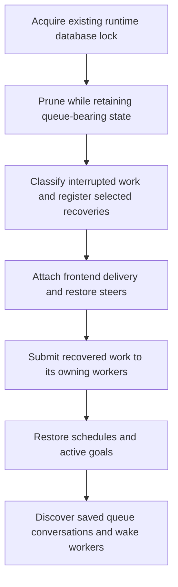
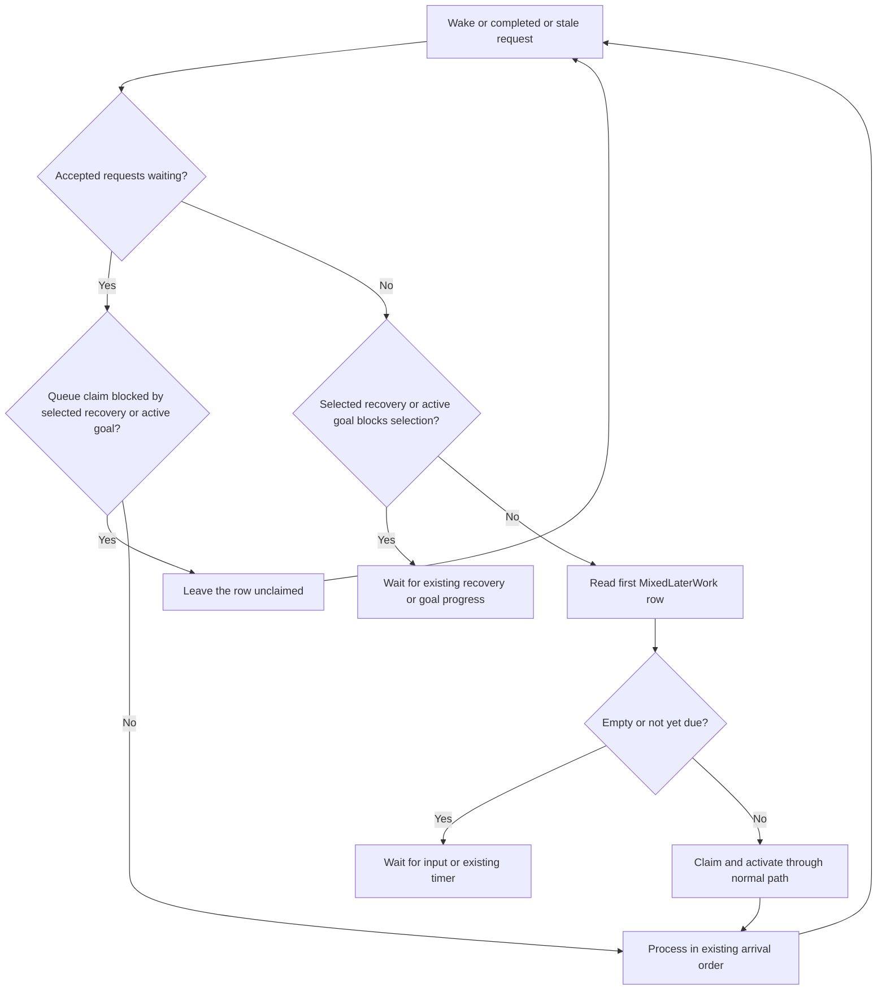
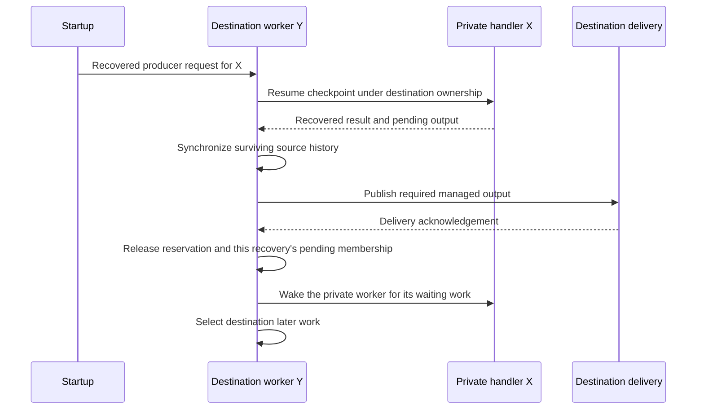

# RocketClaw startup queue recovery

## Goal Capsule

- **Objective:** A person whose queued message was saved before RocketClaw stopped gets that message processed after restart without having to send another message.
- **Means:** Discover saved queues at startup and resume them through their conversation's existing worker, as specified in KTD1–KTD6.
- **Authority:** The approved behavior is recorded in the Product Contract. Requirements govern behavior; technical decisions govern implementation within those requirements. Repository instructions apply to all edits.
- **Execution profile:** Backend implementation, targeted regression coverage, full repository checks, and documentation. The September 20 approval authorized this specification; it did not start implementation.
- **Stop conditions:** Stop if the implementation needs different queue priorities, loses saved payload or routing, launches competing work, or cannot meet the repository's source-size and coverage limits.
- **Delivery ownership:** Production cleanup, release approval, deployment, and rollback rehearsal remain operator work under the rollout notes below.

---

## Product Contract

### Summary

On every startup, RocketClaw finds conversations with saved waiting messages and starts the work that is ready.
Messages still waiting for interrupted work, an active goal, or a scheduled message keep their normal place.
Startup cleanup preserves the data needed to process them.

### Problem Frame

Slack and Web enqueue paths save a message before handing it to an in-memory worker.
A stop between those operations leaves a durable row with no active turn to recover.
The audited startup discovers checkpoints, goals, and schedules, but misses conversations whose only work is a saved queue.
The person who sent the message can receive no answer until another event starts that conversation.

The investigation reproduced that startup state at `549038341ed3da3c91e338bf6270e3c7b84720c6`.
It also established that the older MCP queue-owner mismatch is absent from that revision.
See `internal/rocketclaw/docs/investigations/2026-09-20-wallace-stranded-mcp-queue.md` for the evidence and its limits.

### Key Decisions

- **Recover on startup.** Governs R1, R2, R6. (session-settled: user-approved — chosen over deleting the old backlog and waiting for new activity: deletion alone does not prevent newly saved messages from being stranded.)
- **Use ordinary processing and waiting rules.** Governs R3–R5. (session-settled: user-approved — chosen over a separate replay path: recovered messages must retain their ordering, content, and reply destination.)
- **Keep progress and order after failures.** Governs R3, R5. (session-settled: user-approved — approved after concrete examples: one failed live message must not strand later messages; finishing interrupted work must release its waiting messages; a failed schedule cancellation must not let waiting messages jump ahead.)

### Requirements

**Discovery and preservation**

- R1. Every startup must discover saved, unclaimed queue work and start eligible messages without new input, including conversations with no checkpoint, goal, or schedule.
- R2. A saved queue must survive startup retention together with its required conversation, history, and routing records, including a new conversation with no history and an old conversation with waiting work.

**Execution and delivery**

- R3. Saved work must wait for interrupted work belonging to its conversation or paired destination to be resolved, then follow existing active-goal and mixed queue/schedule priorities.
- R4. Recovery must preserve each item's identity, saved ordering, text, attachments, source, sender provenance, prompt framing, and reply destination, using the normal activation and silent/delivery behavior for that item.
- R5. Overlapping startup, timer, and live handoff requests must not execute a saved item twice or strand the next eligible item after a stale request is discarded.
- R6. Restarting again after successful completion must not replay the completed queue items.

### Acceptance Examples

- AE1. **Covers R1, R4–R6.** Two saved messages belong to an otherwise idle conversation. Restart with no new input. Both finish in saved order at the correct destination. Restart again; neither runs again.
- AE2. **Covers R1, R2.** The first Web message is saved as queued work, then the process stops before any history exists. Startup retains the conversation and processes the message.
- AE3. **Covers R3.** A saved message is parked after a future scheduled message. Startup leaves it waiting. When that schedule runs or is canceled, ordinary processing advances the queue.
- AE4. **Covers R1, R3–R5.** Private MCP conversation X has interrupted work whose destination is managed conversation Y. Both conversations have saved waiting messages. Their queues remain blocked through recovery and required destination delivery, then each continues under its normal priorities without new input.
- AE5. **Covers R5.** Startup and a live handoff both request the first saved message while a second message waits. The first runs once; the stale request does not prevent the second from running.
- AE6. **Covers R3, R5.** After startup recovery finishes, an ordinary live request fails and leaves a checkpoint. Later saved messages still run under the existing failure policy; that checkpoint does not introduce a new waiting condition.
- AE7. **Covers R3, R5.** A message waits behind a scheduled message. Removing that schedule fails. The schedule and the waiting relationship remain intact, including after another worker wake or restart.

### Scope Boundaries

This fixes the durable-save-before-start gap, including retention and execution-order conditions needed to close it.
It does not establish exactly-once tool calls or external effects after an arbitrary mid-turn crash.
The existing queue-claim-to-checkpoint interval is a separate durability boundary.
An old in-memory MCP response waiter cannot be recreated after restart.

The change uses existing persisted state and requires no database migration, configuration switch, queue poller, connector-event replay, or new queue service.
It does not promise checkpoint priority over every fresh live request accepted during frontend assembly; R3 applies to the saved work recovered here.

**Deferred to follow-up work:** Wallace's production-copy migration rehearsal through migration 014 and the disposition of its six historical rows belong to release preparation.
Neither is implementation authority to mutate production.

---

## Planning Contract

### Key Technical Decisions

- KTD1. **Retain pending work at the pruning layer.** Implement R2 in `SessionService.PruneStateBefore` and its existing predicates in `internal/rocketclaw/backend/store.go`. Queue presence protects a conversation regardless of history age. For an external-MCP pair, queue presence on either side protects the binding and both sides' required state. Once the queue is empty, normal retention applies again.
- KTD2. **Discover conversation IDs once per startup.** Use the existing database/query helpers to enumerate distinct `thread_queue.conversation_id` values in stable order. Load each recorded conversation's agent and reuse the manager's bridge lookup. Perform this pass after frontend delivery is attached and recovery requests are submitted. Do not bulk-submit every row; eligibility remains with the worker. Implements R1 through the existing processing required by R3–R5. (session-settled: user-approved — chosen over waiting for another message: a queue-only conversation otherwise has no startup trigger.)
- KTD3. **Select later work inside the owning worker.** Make startup, timer, and external picker calls request reconsideration through the existing `bridgeRequest` channel. An otherwise empty request can represent this wake operation. Only `Bridge.loop` selects later work, using the existing goal check and `protocol.MixedLaterWork`. Execute a selected request locally rather than sending it back to the same channel. This prevents concurrent selectors from preselecting the same one-shot schedule and implements R3 and R5 without another mutex or goroutine.
- KTD4. **Block only for selected startup recovery.** Reuse the recovery selection already built in `app.go`, relocating its pending membership to `SessionService` under the existing `turnGatesMu`. Register selected recoveries and their source/destination ownership before frontend assembly. Gate later-work selection and direct queue claims on this pending set, including recovery on a private conversation's managed destination. Keep each selected recovery distinct: completing one must not release work still blocked by another. Remove its membership only after required completion, synchronization, and delivery, or successful permanent abandonment; cancellation preserves it until shutdown. New live turns do not join this startup's set. Implements R3 and R5 without changing ordinary failure behavior or adding persisted recovery state.
- KTD5. **Recover paired producers on the destination worker.** Route private recovery with the existing `bridgeRequest.producer` and `activeTurn` fields to its managed destination. That worker runs the private checkpoint, then calls its existing `syncConversation` directly and retains ownership through delivery. Restore `SyncDestination` on the recovered inbound so normal private output handling is used. Reserve the pair when this request starts, replacing advance startup reservations that could block an earlier producer ahead of recovery. Implements R3 and R4 using the live producer ownership pattern in `internal/rocketclaw/backend/conversations.go`.
- KTD6. **Keep claiming and payload reconstruction in the normal path.** Reuse `submitEnqueuedItem`'s reconstruction and `activateInbound`'s atomic queue claim and activation restoration. A lost claim must reach the worker's next-work decision. An activation error restores the row and ends that drain. Make `DeleteScheduledMessage` clear park links and delete the schedule in one transaction, for both consumption and cancellation. A one-shot schedule executes only after that transaction succeeds; otherwise return the error with the schedule and park links intact. No automatic retry loop is added. Implements R3–R6.

### Startup and Worker Flow

The startup sequence is:

Schedule startup must not bypass KTD4, even when bridge creation arms a due timer.
An ordinary recovered turn owns continuation of its own goal.
Recovery of private X must also allow an active goal on destination Y to continue afterward: enqueue Y's continuation after X's recovery request rather than skipping Y permanently.
Unresumable recovery uses the existing checkpoint-clear and goal-stop policy, then removes that recovery's pending membership and wakes the affected source and destination.

Checkpoint existence alone does not mean recovery is pending: ordinary live failures can retain checkpoints while the current worker continues later work.
The startup selection is therefore the authority for this waiting condition.
Its membership lasts through required delivery, even if the original checkpoint has already been cleared.

The worker's idle selection boundary is:

Accepted live producer/enqueue requests retain their tested arrival order; wakes do not create turns or gain message priority.
Loop-local later work must not block sending to its own full channel.
The same applies to generated goal continuations: preserve their position after already accepted requests using existing request values, rather than introducing a goroutine to send them.
Repeated wakes may coalesce only when accepted pending work guarantees a later selection boundary.
An activation or selection error ends that drain; it must not become a tight retry loop.

Paired recovery uses this ownership sequence:

Calling public `Runtime.SyncConversation` from inside Y's worker can enqueue back onto Y and deadlock; use the existing direct operation in KTD5.
Recovery must use the checkpoint's agent and then restore the persisted selection, including when assembly already created the bridge.
Both success and permanent abandonment must replace any private-worker wake consumed while recovery was pending.
Use the existing wake-admission path after releasing the pending membership; no second discovery scan is needed.

### Error and Cancellation Contract

| Boundary | Required result |
|---|---|
| Startup enumeration, conversation lookup, or worker creation fails | Return the startup error; leave unclaimed rows intact. |
| Picker wake admission fails | Return cancellation/stopped error to the caller. A successful admission acknowledges the wake, not message completion. |
| Background selection or database claim fails | Surface the error through existing worker error reporting and end that drain. |
| Queue activation fails | Restore the claimed item through the existing restoration path and end that drain. Surface restoration errors too. |
| Queue request loses its claim | Run no activation or response for that request; reconsider remaining work. |
| Schedule deletion or cancellation fails | Roll back both deletion and park-link changes. Run no scheduled turn from that failed attempt; a later wake still observes the waiting relationship. |
| An ordinary live turn fails | Keep the existing failure and checkpoint policy. Do not register it as startup recovery or introduce a new block on later work. |
| Recovery is canceled or stopped | Preserve its checkpoint and pending membership under the existing recovery policy; do not release blocked saved work as if recovery succeeded. |
| Recovery is permanently unresumable | Complete the existing abandonment policy, remove only that recovery's pending membership, and wake both affected source and destination. |
| Producer sync or required delivery fails | Retain pending output, pending recovery membership, and destination ownership as required by the live sync contract. Wait for an existing explicit sync attempt to succeed or for shutdown; do not drain either affected queue or add automatic retries. |

The picker now reports admission errors synchronously and selection errors in the worker.
Audit all `PickLaterWork` callers, including scheduled-message cancellation and startup steer recovery, for this error-timing change.
Reservation waits must observe worker shutdown as well as context cancellation.

### Implementation Constraints

The production change should stay within `internal/rocketclaw/backend`.
Use its existing store, bridge, request, and pairing concepts; keep discovery private and avoid exported convenience wrappers.
There is no need for a new dependency, timer, polling loop, callback, or recovery counter.
Apply the repository's Go rules to every touched hunk, including inert injected dependencies, context lifetimes, error names, and existing mutex ownership.
Use current standard-library helpers where they reduce code.

Research established the control-flow risks above by source inspection.
The restart diagnostic proved missing queue discovery, not these additional interleavings; U2 and U3 must establish them with behavioral tests before changing their paths.

---

## Implementation Units

### U1. Preserve queued conversations through retention

**Goal:** Saved messages and their execution context survive startup cleanup.

**Requirements:** R2; KTD1. **Dependencies:** None.

**Files:** `internal/rocketclaw/backend/store.go`; `internal/rocketclaw/backend/store_test.go`.

**Approach:** Extend the existing pruning predicates for ordinary conversations and external-MCP pairs. Keep the change in the pruning transaction so no repair pass is needed.

**Patterns to follow:** `PruneStateBefore`, `shouldPruneThreadConversation`, and `shouldPruneExternalMCPSession`.

**Test scenarios:**
1. Covers AE2. A historyless recorded Web conversation with a saved queue row survives pruning with its payload and agent record.
2. An expired Slack conversation with a saved item survives; an equally expired conversation without queued work still follows existing retention.
3. A stale external-MCP pair with work queued on either side retains the binding, both conversation records, and recovery state needed by that work. After the last row is removed, existing retention can prune the stale pair.

**Verification:** Extend the existing pruning tests using the real store. Compare row identity and required records, not only pruning counts.

### U2. Serialize later-work selection and preserve progress

**Goal:** Additional startup wakes cannot double-start work or stop the queue behind a stale request.

**Requirements:** R3–R6; KTD3, KTD4, KTD6. **Dependencies:** None.

**Files:** `internal/rocketclaw/backend/app.go`; `internal/rocketclaw/backend/bridge.go`; `internal/rocketclaw/backend/store.go`; `internal/rocketclaw/backend/store_dao.go`; `internal/rocketclaw/backend/bridge_test.go`; `internal/rocketclaw/backend/store_test.go`; `internal/rocketclaw/backend/runtime_test.go`.

**Approach:**
1. Route picker and timer triggers to the existing worker and move selection to its idle boundary.
2. Keep reconstruction and claims shared with live enqueues. Move the existing startup recovery selection into the shared execution state under KTD4; check it before direct queue activation as well as selection.
3. Make stale requests reach the drain decision, while activation failures end it under the error contract. Make schedule deletion and park-link clearing transactional in their shared store operation.
4. Handle loop-local selected work and goal continuations without self-send blocking or changing accepted request order.

**Patterns to follow:** `Bridge.loop`, `activateInbound`, `submitEnqueuedItem`, `MixedLaterWork`, and `TestRuntimePersistedEnqueueAndProducerArrivalOrder`.

**Execution note:** First reproduce stale-first-request starvation and overlapping picker/timer selection using the real worker.

**Test scenarios:**
1. Covers AE5. Duplicate first-row handoffs activate it once and allow a second durable row to finish.
2. Covers AE3. Startup-style wakes plus a due timer execute one scheduled occurrence once; future parked work waits and then advances after the schedule runs or is canceled. Retain recurring-schedule advance coverage.
3. An active goal or selected pending recovery leaves a directly submitted queue row unclaimed. Resolving the blocker lets ordinary processing advance it. Covers AE6: after recovery finishes, a new live request's provider error can retain a checkpoint without preventing the next eligible saved message from completing.
4. An activation error restores the item, produces no model turn, and does not repeatedly retry without another trigger. Covers AE7: fail schedule deletion after park-link clearing would otherwise succeed, then wake the worker again; the schedule and links remain, the failed attempt executes no scheduled turn, and the queued message cannot run ahead. Exercise the shared cancellation path too.
5. A full request channel at turn completion does not deadlock generated continuation work; accepted producer/enqueue order remains the same in all existing arrival-order cases.
6. When two selected recoveries share a destination, finishing one leaves that destination's saved work blocked until the other resolves. Required delivery still blocks the source queue after its original checkpoint is cleared.

**Verification:** Behavioral worker tests pass under the race detector. Assertions separately cover activation count, order, remaining rows, and progress.

### U3. Give paired recovery its destination's execution slot

**Goal:** Saved source and destination messages wait for their interrupted work and become runnable after it resolves.

**Requirements:** R1, R3–R5; KTD4, KTD5. **Dependencies:** U2.

**Files:** `internal/rocketclaw/backend/thread_bridges.go`; `internal/rocketclaw/backend/bridge.go`; `internal/rocketclaw/backend/app.go`; `internal/rocketclaw/backend/startup_recovery.go`; `internal/rocketclaw/backend/store.go`; `internal/rocketclaw/backend/thread_bridges_test.go`; `internal/rocketclaw/backend/runtime_test.go`.

**Approach:**
1. Resolve the recovered checkpoint's existing private/managed binding and submit it to the owning destination loop.
2. Move startup reservation timing to execution and reuse direct synchronization under KTD5. Remove obsolete recovery-only reservation helpers and their dedicated tests if this makes them unused.
3. On success or completed abandonment, remove that recovery's pending membership, wake the private source's worker, and reconsider the destination. Preserve membership and ownership on cancellation or failed synchronization/delivery.
4. Preserve checkpoint-agent selection, later agent selection, and goal continuation when bridges already exist.

**Patterns to follow:** `Runtime.RunTurn`, `Bridge.syncConversation`, `RecoverActiveTurn`, and `TestRuntimeProducerKeepsDestinationUntilSync`.

**Execution note:** Prove ownership with held delivery acknowledgements, not a mock assertion that recovery was submitted.

**Test scenarios:**
1. Covers AE4. Seed queues on private X and destination Y. Consume X's startup wake while recovery is pending, then hold managed delivery; neither queue starts. Acknowledge delivery; each eligible queue progresses once without new input, using its original routing.
2. A live producer accepted before recovery completes before recovery's execution-time reservation; there is no reservation cycle. Saved queue work stays behind the selected pending recovery.
3. An unresumable private checkpoint releases and wakes both affected queues under existing policy. Cancellation preserves the checkpoint and pending membership. A sync/delivery failure retains ownership, membership, and pending output, and shutdown still terminates the worker.
4. Recovery plus an active goal on Y neither skips the goal forever nor starts two continuations. A pre-created bridge uses the checkpoint agent for recovery and the persisted selection afterward.
5. Existing private-output decision behavior, including silent output, survives recovery and synchronization.

**Verification:** Real-store runtime tests establish private execution, destination synchronization, acknowledgement ordering, and subsequent queued execution as separate observations.

### U4. Discover queues at startup and prove restart behavior

**Goal:** Actual backend startup completes eligible saved work without another incoming message.

**Requirements:** R1–R6; KTD2. **Dependencies:** U1–U3.

**Files:** `internal/rocketclaw/backend/app.go`; `internal/rocketclaw/backend/thread_bridges.go`; `internal/rocketclaw/backend/app_test.go`; `internal/rocketclaw/backend/thread_bridges_test.go`; `README.md`.

**Approach:**
1. Add one distinct-conversation discovery pass with existing query helpers and the startup placement shown above.
2. Reuse recorded agent selection and existing worker ownership. Treat database or discovery failures as startup failures under the error contract.
3. Add the restart guarantee beside `README.md`'s Runtime Flow description, with its save-before-start scope.

**Patterns to follow:** Existing scheduled/goal startup discovery, `queryStrings`, and `TestRunInitializesRuntimeAndCleansUpOnCancellation`.

**Execution note:** Upgrade the investigation's temporary diagnostic into a completion-level regression. Keep the backend running until the expected output is acknowledged; a pre-closed frontend completion channel would end the test before it proves processing.

**Test scenarios:**
1. Covers AE1. Seed two ordered rows through the store, close it before any execution, and run real backend startup against the same isolated database. With no input or manual picker, observe both normal completions, correct replies, and an empty queue. Start again and verify no replay.
2. Covers AE2. Repeat startup with a first Web enqueue and no history, so retention remains part of the proof. Include a retained Slack queue-only conversation in the startup coverage.
3. Saved content includes attachments, source, principal, and an explicit Slack target. Verify those values in prompt/activation and outbound observations independently. A legacy row with blank optional metadata remains eligible and routes through its managed conversation.
4. Empty queues create no work. Multiple rows for one conversation wake its existing worker without creating competing workers. A discovery error returns an error and leaves rows intact.

**Verification:** The real-startup regression fails on the audited baseline and passes after the implementation. Payload and framing checks use a deterministic model fixture when needed; attachment fallback alone does not prove framing.

---

## Verification Contract

Use the existing PostgreSQL-backed test setup and an isolated local database.
All temporary files, test directories, database files, and logs must stay under the repository's `.tmp/`; set temporary-directory variables there before running tools.
Generate any needed interface mocks with mockery v3 and use real store/worker paths for integration assertions.
Use observable completion and delivery acknowledgements for database-backed tests; use `testing/synctest` only for isolated timing cases without real network or database I/O.

| Check | Required evidence |
|---|---|
| Focused regression tests with `-race` | U1–U4 scenarios prove retention, processing order, framing, delivery, and repeat-start behavior. |
| Existing producer and queue tests | `TestRuntimeProducerKeepsDestinationUntilSync`, `TestRuntimePersistedEnqueueAndProducerArrivalOrder`, and affected recovery, goal, schedule, and payload tests still pass. |
| `gofmt` and touched-diff standards review | Touched Go files meet `AGENTS.md`, including errors, dependency injection, synchronization, contexts, and necessary changed lines. |
| `go doc` and `gopls check` | Confirm actual API contracts and no diagnostics in changed Go files. |
| `go test ./...` | Full module tests pass. |
| `make lint` | Repository lint and generated-asset checks pass; inspect any tool-generated diff. |
| `make test` | Repository tests, current coverage gates, and source-CLOC budgets pass without changing budgets or hiding code. |

These are implementation gates, not claims that this specification has passed them.
If a required check cannot run, report the blocker and do not declare the implementation complete.

---

## Rollout Notes

The six Wallace rows in the investigation are historical observations, not a current inventory.
Any still-queued rows become eligible under R1; the fix has no cutoff that silently excludes old work.
Before Wallace's first startup with the fix, obtain the operator's decision about those exact rows and recheck their current state.
If the operator chooses deletion, complete that separately authorized cleanup before starting the fixed build.

Release approval also requires a fresh, consistent Wallace database-copy rehearsal with the pinned candidate through migrations 006–014, including repeat initialization, data comparison, and a verified recovery/rollback path.
Earlier 005–010 rehearsals and synthetic migration tests do not establish this release's production safety.
Binary-only rollback to v0.0.52 after newer migrations is not a verified rollback procedure.

---

## Definition of Done

- U1 preserves the state required by queued work while retaining ordinary cleanup for empty queues.
- U2 proves one activation per queued item, continued progress after ordinary live failures, and preserved waiting order after schedule-removal failures.
- U3 proves destination ownership through recovery, synchronization, and required delivery, followed by progress on both affected queues.
- U4 proves real restart processing and no replay after successful completion.
- All Verification Contract checks pass, and the README describes the implemented guarantee.
- The final diff contains only the necessary implementation, regression coverage, and documentation; abandoned experimental code is removed.
- Implementation completion is distinct from release approval under the Rollout Notes.
