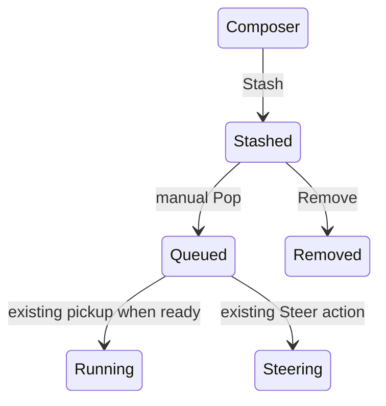
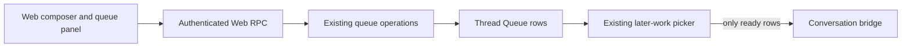

# Web message stashing

## Goal Capsule

**Objective:** A person can save a message in a chat without sending it, then manually release it when ready.
**Means:** Extend the existing persisted Thread Queue and Web queue panel (KTD1).
**Authority:** User requirements below, repository instructions, then implementation details.
**Execution:** Implement locally, verify backend and browser behavior, simplify, review, and open a PR; merging belongs to the user.
**Stop conditions:** A violated manual-release guarantee, failed required checks, or a source/coverage budget conflict prevents shipping.

## Product Contract

### Summary

Add Web controls to stash composer messages and pop individual stashed messages into the normal queue.

### Problem Frame

The current queue automatically runs later work. It cannot hold a message until the person explicitly decides to release it.

### Requirements

- R1. Stashing and popping are Web-only capabilities in a chat session.
- R2. Stashed messages use the existing enqueued-message storage and panel.
- R3. A stash remains held until a manual Pop action; idle time, turn completion, timers, goals, restart, and reconnect must not release it.
- R4. Pop moves the selected message to the normal queue. It does not directly steer. The normal queue-to-steer action remains available afterward.
- R5. Existing queued work continues to run in order without a stashed row blocking it.

### Scope Boundaries

No Slack stash commands, MCP stash tools, automatic release, or separate stash storage.

## Planning Contract

### Key Technical Decisions

- KTD1. Use a new held value in the existing persisted queue kind, rather than a table, new column, browser-only storage, or independent collection. Existing queue rows already persist text, attachments, principal, source, and order. No schema migration is needed.
- KTD2. Exclude held rows at the shared later-work selection boundary and at executable row claims; creation persists without submitting to a bridge. Removal still accepts held rows. This protects R3 across runtime and restart paths.
- KTD3. Release by a conversation-scoped, conditional database update from held to enqueue, preserving identity/content and appending to ready queue order. Only a successful transition wakes existing later-work processing. Concurrent or repeated pops must not duplicate work.
- KTD4. Extend the protobuf delivery enum and add a Pop queue-item RPC with the same visibility checks as other queue mutations. Generated artifacts follow the existing generator. No alternate transport is introduced.

### High-Level Technical Design

### Assumptions

- Stash applies to the current composer draft, including attachments; Pop is per selected row, consistent with the existing per-row queue controls.
- Released work joins the end of ordinary queued work. When idle it can run immediately through normal queue processing; while busy it remains queued and can be promoted to steer.
- Stashes survive browser reload and daemon restart, matching the existing durable queue.
- Stashing literal command-looking text stores it without running Web command handlers.

### Grounding

- `internal/rocketclaw/backend/thread_bridges.go`: `stashQueueItem` currently persists then submits immediately; `promoteQueueItem` claims then steers.
- `internal/rocketclaw/backend/bridge.go`: `pickLaterWork`, `submitEnqueuedItem`, and `activateInbound` govern automatic pickup and claims.
- `internal/rocketclaw/backend/store_dao.go`: queue kind and content already persist; claims delete a conversation-scoped row atomically.
- `internal/rocketclaw/protocol/later_work.go`: `MixedLaterWork` owns mixed queue/scheduled order.
- `internal/rocketclaw/frontend/rpc/server.go`: Prompt and queue operations already enforce visible conversations and support attachments.
- `internal/rocketclaw/web/src/ui.tsx`: QueuePanel and submitComposer own existing pending-message UI.

Local patterns establish the mechanism; no external design or new dependency is needed.

## Implementation Units

### U1. Durable held queue state and manual release

**Goal:** Enforce R2–R5 in existing queue storage and execution.
**Dependencies:** None.
**Files:** `internal/rocketclaw/protocol/types.go`, `internal/rocketclaw/frontend/backend.go`, `internal/rocketclaw/protocol/later_work.go`, `internal/rocketclaw/backend/conversations.go`, `internal/rocketclaw/backend/thread_bridges.go`, `internal/rocketclaw/backend/store_dao.go`, `internal/rocketclaw/backend/bridge.go`; existing generated mocks as required by the backend interface; `internal/rocketclaw/protocol/later_work_test.go`, `internal/rocketclaw/backend/runtime_test.go`, `internal/rocketclaw/backend/store_test.go`, `internal/rocketclaw/backend/bridge_test.go`.
**Approach:** Apply KTD1–KTD3 at existing queue boundaries; do not add a parallel dispatcher, goroutine, timer, or mutex.
**Test scenarios:**
1. A held row before ready rows is skipped without blocking ordinary or due scheduled work.
2. Stashing while idle/busy and picking after completion/restart leaves held content intact.
3. Pop preserves ID, principal, attachments, and routing and appends to queued work; a second/concurrent Pop cannot produce duplicate work.
4. Direct promotion cannot claim a held row; removal can remove it.
5. Popped work uses the existing enqueue framing and outbound routing, and can subsequently steer during an active turn.
**Verification:** Focused database/runtime tests and shared ordering tests prove the state transitions and exclusion paths.

### U2. Web stash and pop controls

**Goal:** Expose R1–R4 through the existing composer and queue panel.
**Dependencies:** U1.
**Files:** `internal/rocketclaw/web/proto/web.proto`, generated Go/TypeScript protocol outputs, `internal/rocketclaw/frontend/rpc/server.go`, `internal/rocketclaw/frontend/rpc/server_test.go`, `internal/rocketclaw/web/src/api.ts`, `internal/rocketclaw/web/src/api.test.ts`, `internal/rocketclaw/web/src/ui.tsx`, existing composer/UI tests under `internal/rocketclaw/web/src/`, `internal/rocketclaw/web/README.md`.
**Approach:** Apply KTD4. Add a clearly labeled Stash composer action. Label held rows and offer Pop instead of Send/Steer; retain Remove and existing queue reorder. Treat stash success as a queue mutation, not optimistic transcript or active work. Preserve draft/files on failure. Reuse current attachment and query-invalidation paths.
**Test scenarios:**
1. Stash from idle/busy composer creates a held row, clears the accepted draft, and adds no transcript or busy indication.
2. Failed stash retains text and attachments; failed Pop leaves a recoverable row and visible error.
3. Held rows show Pop but not Steer; Pop changes to normal queue controls and queue promotion still steers.
4. Reload preserves held rows and attachments; queues and pending steers remain distinct.
5. RPC mutations require conversation visibility and preserve command-looking stash text without executing it.
6. A real browser exercises stash, reload, Pop, and queue-to-steer, including keyboard-accessible controls.
**Verification:** RPC, composer/API, build/type-check and browser tests; update Web README with manual release and idle behavior.

## Verification Contract

Run gofmt on touched Go files and inspect actual changed hunks against repository Go standards before tests and after formatter/lint changes.
Run `go test ./...`, `make lint`, and `make test` using the isolated PostgreSQL database and repository-local temporary directory.
Run the Web test, lint/type-check, and build tasks, including its source CLOC gate.
Run targeted real-browser checks for the stated flow; record exact results and any blocker.
Verify independent queue order, prompt framing, silent stash behavior, and outbound routing. Do not infer one from another.

## Definition of Done

Every requirement has direct code/test/runtime evidence, all required checks and budgets pass, and no abandoned approach remains in the diff.
The Web README describes the controls. Simplification and code review are complete with actionable findings resolved or durably recorded.
A PR is open with verification evidence and CI decided; no merge is performed.
