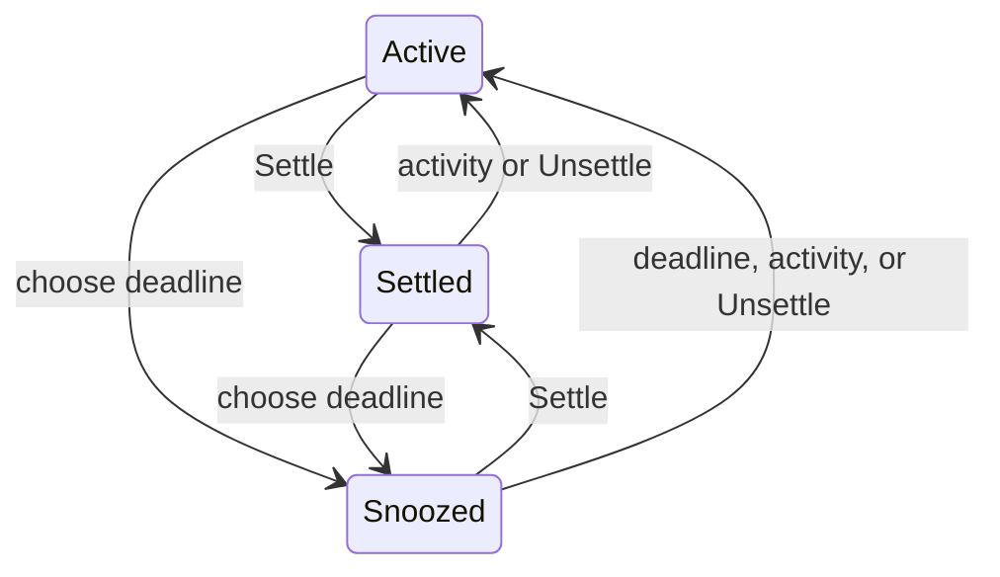
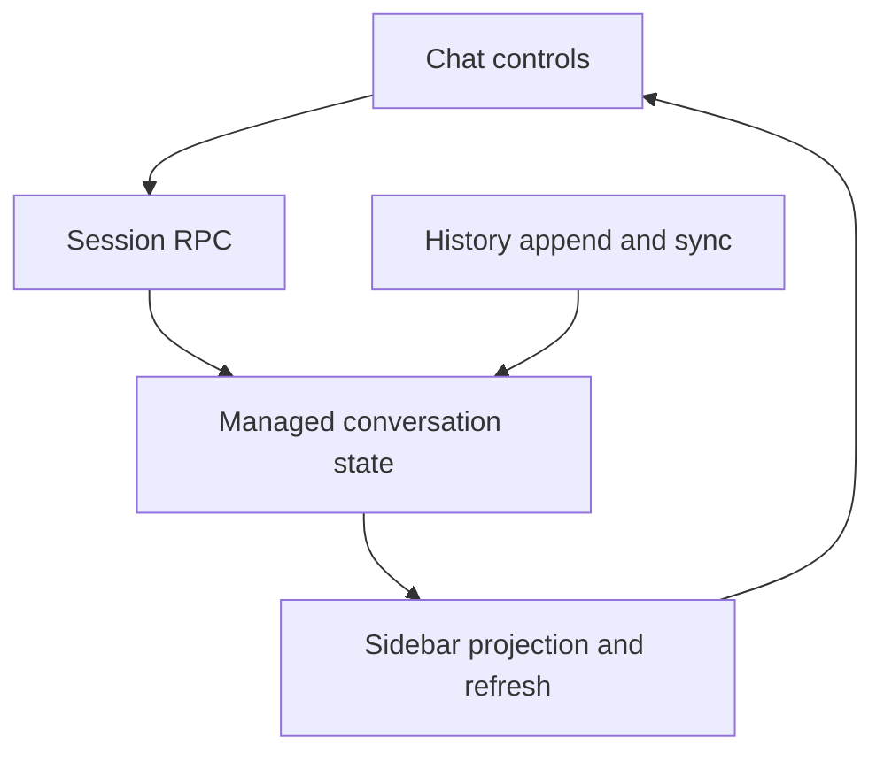

# Settle and Snooze Chats - Plan

## Goal Capsule

- Objective: People can hide chats until they need attention again, with an optional return time.
- Means: Extend the existing settlement and sidebar refresh mechanisms (KTD1).
- Authority: User requirements below govern behavior; repository instructions govern implementation.
- Execution: Implement and verify locally, review, open a PR, and watch CI. Do not merge.
- Stop if a settled requirement cannot be met or required verification cannot run.

---
## Product Contract

### Summary

Remove read tracking and add timed snooze alongside Settle.

### Problem Frame

Read state and settlement overlap as attention-management actions. The requested distinction is between hiding a chat indefinitely and hiding it until a chosen time.

### Requirements

**Read tracking**
- R1. Remove read/unread state, indicators, actions, filters, active documentation, and dedicated tests.

**Chat visibility**
- R2. Settle hides a chat from the default sidebar until new activity or manual Unsettle.
- R3. Snooze hides a chat until a user-chosen clock time; new messages end snooze early.
- R4. Manual Unsettle ends snooze and restores the chat.
- R5. Use minimal existing mechanisms and retain existing pinning, naming, and auto-settlement behavior except where necessary to honor timed return.

### Key Decisions

- **Remove read tracking** (session-settled: user-directed — chosen over retaining a separate read flag: the user requested its complete removal). Governs R1.
- **Activity wakes snoozed chats** (session-settled: user-directed — chosen over ignoring messages until the deadline: the user explicitly corrected that behavior). Governs R3.
- **Settlement remains reversible** (session-settled: user-directed — chosen over permanent archive: new activity or Unsettle must restore visibility). Governs R2, R4.

### Acceptance Examples

- AE1. Covers R2: settling a chat removes it from the default sidebar, and a new stored entry brings it back.
- AE2. Covers R3: a snoozed chat stays hidden before its deadline and returns on the first refresh at or after that deadline, even when its previous message is old enough to auto-settle.
- AE3. Covers R3, R4: either new activity or manual Unsettle before the deadline makes the chat visible immediately on refresh.

---
## Planning Contract

### Key Technical Decisions

- KTD1. Store one optional snooze deadline on managed conversations and evaluate it through `SidebarSessions`; use the existing refresh loop rather than a scheduler. `SetConversationSettled`, `appendSessionEntry`, and external-history synchronization already own the related state transitions.
- KTD2. Evolve the existing session-update RPC for snooze and remove its unread field. Reserve removed protobuf tags, regenerate bindings, and add a forward database migration that drops the obsolete column/index. Preserve applied migration identities: `internal/rocketclaw/docs/solutions/runtime-errors/deployment-binary-missing-live-migrations.md` documents why removing old migration files breaks deployed databases.
- KTD3. Use the deadline as the inactivity baseline after expiry so an old chat receives a fresh auto-settlement window. Explicit settlement cancels snooze; snooze clears explicit settlement. New activity and manual Unsettle clear the deadline in the same database update as settlement.

### Assumptions

- A native date/time input in a small existing-style dialog is sufficient for choosing local clock time.
- Snoozed chats are accessible on the existing Settled page with a visible return time and Unsettle action.
- The established sidebar refresh cadence is sufficient for timed return.

### High-Level Technical Design

---
## Implementation Units

### U1. Replace read tracking with timed visibility

**Goal:** Deliver R1-R5 end to end in one coherent change.
**Dependencies:** None.
**Files:** `internal/rocketclaw/backend/store.go`, `internal/rocketclaw/backend/conversations.go`, `internal/rocketclaw/backend/migrations/`, `internal/rocketclaw/backend/store_summaries_test.go`, `internal/rocketclaw/backend/store_test.go`, `internal/rocketclaw/backend/runtime_test.go`, `internal/rocketclaw/frontend/rpc/server.go`, `internal/rocketclaw/frontend/rpc/server_test.go`, `internal/rocketclaw/web/proto/web.proto`, generated RPC bindings, `internal/rocketclaw/web/src/ui.tsx`, `internal/rocketclaw/web/src/api.ts`, existing web tests, and `internal/rocketclaw/web/README.md`.
**Approach:** Apply KTD1-KTD3 at the existing store/RPC/UI boundaries. Delete read-only branches and tests rather than retaining compatibility behavior. Trace all callers and both activity-write paths. Reuse dialog, input, mutation, and refresh patterns.
**Patterns:** `SidebarSessions` derives auto-settlement; `UpdateConversationDetails` applies shared session metadata; `SessionRow` and composer controls share chat actions.
**Test scenarios:**
1. Covers AE1: retain settlement reopening tests after deleting unread assertions.
2. Covers AE2: verify pre-deadline hiding and deadline-boundary return for old, pinned, and ordinary chats.
3. Covers AE3: verify append and external-history sync clear snooze; unchanged sync leaves snooze intact.
4. Verify Unsettle clears snooze and grants a fresh inactivity window.
5. Verify RPC accepts a valid future deadline and rejects malformed or non-future input at the external boundary.
6. Verify pin/name updates preserve visibility state, while Settle and Snooze replace one another.
7. Verify schema upgrades preserve chat/history/pin/name data while removing read state.
8. Browser-check snooze dialog, hidden-chat discovery, Unsettle, message wakeup, and keyboard/mobile usability.
**Verification:** Existing backend/RPC tests and web checks pass; meaningful snooze coverage uses the production database abstraction without sleeps.

---
## Verification Contract

### Test environment

Use the approved short repository-root scratch directory `.tmp/st` as `TMPDIR` for macOS socket tests.
The long workspace-local scratch path exceeds the Unix-socket path limit; `TestPrivateSocket` passes with the short path.

### Required checks

- Format touched Go files with `gofmt`.
- Run `go test ./...`, `make lint`, and `make test`; satisfy the unchanged CLOC and coverage budgets.
- Run web lint, tests, and build from `internal/rocketclaw/web`.
- Browser-check the changed controls and sidebar visibility.
- Search the repository for obsolete active read/unread behavior; historical migration identities remain for upgrade correctness.

---
## Definition of Done

R1-R5 and the acceptance examples hold, required checks pass, and the README explains snooze and early wakeup. The final diff contains no abandoned implementation or new scheduler. Review findings are applied or durably recorded, and the open PR has a reported CI outcome.
