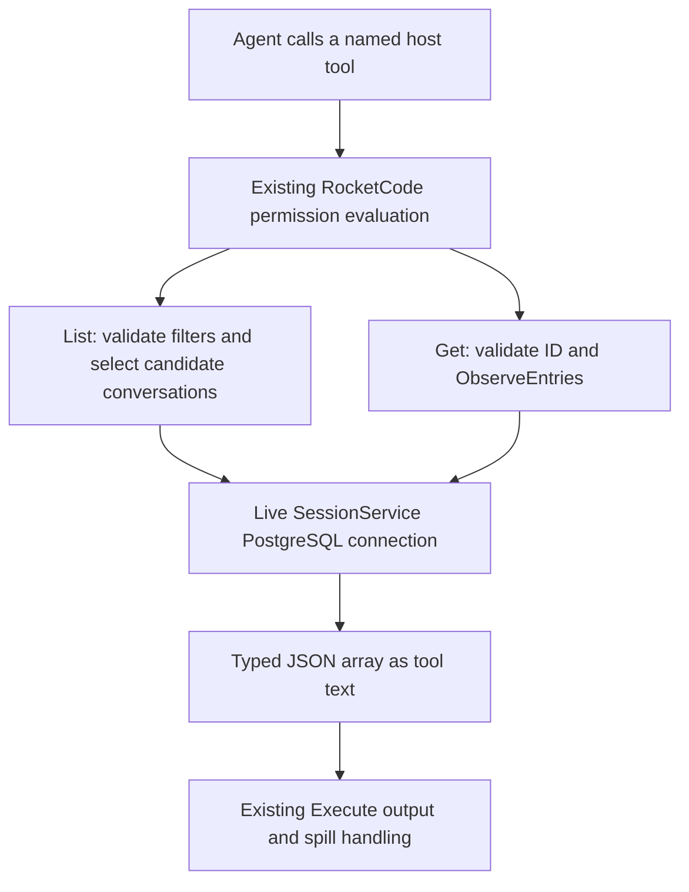

# Agent Session Inspection Tools - Plan

## Goal Capsule

- **Objective:** Agents can find stored RocketClaw conversations and read their recorded history without asking a human to run an inspection command.
- **Means:** Three native RocketCode custom tools using the owning bridge's conversation ID and running RocketClaw SessionService (KTD1).
- **Authority:** The user's requested tool names and historical behavior govern the feature; repository AGENTS.md governs implementation. Requirements below own behavior and KTDs own mechanism.
- **Execution profile:** One bounded backend feature, with PostgreSQL contract tests and agent permission tests.
- **Stop conditions:** Report any required departure from R1–R8, a failing repository gate, or a source-line budget conflict rather than silently weakening the contract.
- **Ownership:** This document authorizes planning only. The invoking session chooses when implementation and shipping begin.

---

## Product Contract

### Summary

Expose `rocketclaw_list_sessions`, `rocketclaw_get_session`, and `rocketclaw_current_session_id` as agent tools. Preserve the former session inspector's list filters, summaries, and raw-history snapshot behavior using today's backend. Let agents recover their own stored history from before compaction.

### Problem Frame

The former `fc` commands provided durable-session discovery and inspection. Their replacement Development MCP surface was subsequently removed, leaving agents without equivalent native tool calls.

### Key Decisions

- **Agent tools are the delivery surface.** (session-settled: user-directed — chosen over restoring the fc CLI: the user specifically requested tool calls for agents.) Governs R1, R7.
- **Keep strict provider mode and require every list field.** (session-settled: user-directed — the explicit correction "Restore strict mode" supersedes the earlier optional-input and non-strict-schema decisions.) Empty bounds and zero limit express an unbounded search; previews are an explicit boolean. Governs R2.
- **Expose the current stored conversation ID.** (session-settled: user-directed — user requested `rocketclaw_current_session_id` so agents can look back past compaction points.) Use the owning bridge's durable history ID, with existing explicit permissions. Governs R8.

### Requirements

**Discovery**

- R1. Register the exact tool names `rocketclaw_list_sessions`, `rocketclaw_get_session`, and `rocketclaw_current_session_id` in RocketClaw's agent tool surface.
- R2. List requires `since`, `until`, `limit`, and `include_message_preview`. Empty `since`/`until` strings mean no time bound, zero limit means unlimited, and previews are an explicit boolean.
  - `since` accepts a Go duration relative to one captured current UTC time, or RFC3339Nano; `until` accepts RFC3339Nano. Trim surrounding whitespace and treat empty time strings as absent, matching the historical parser.
  - Use the existing strict provider schema and Execute schema validation for required, non-null field types. Reject negative limits and malformed times in the tool body. Preserve historical duration semantics, including zero and negative durations. An inverted time window returns no matches.
  - Filter each conversation by maximum stored entry timestamp: inclusive `since`, exclusive `until`. With any effective time bound or positive limit, order by that maximum descending, then bytewise conversation ID; otherwise order by bytewise conversation ID. Apply the limit to conversations before reading their entry bodies.
- R3. List returns a JSON array of summaries with `conversation_id`, `turns`, `last_updated`, and optional `last_user_message` / `last_assistant_message`.
  - Preserve the old meaning of `turns`: stored entry count, not user-turn count. For compatibility, `last_updated` is the last entry's timestamp in entry-ID order, formatted as RFC3339; filtering and bounded ordering still use the maximum timestamp per R2.
  - Derive each preview from the last matching role encountered in replay inputs in entry-ID order. Preserve text in JSON, without the old CLI table's whitespace folding. Omit empty previews and omit both preview fields when explicitly disabled. No matches returns `[]`.

**Inspection and access**

- R4. Get requires a nonblank `conversation_id`, trimmed before lookup, and returns one JSON array of stored session entry objects in ascending entry-ID order; an unknown ID returns `[]`.
  - Return entry payloads, including metadata, reasoning, tools, and replay data, rather than the UI's human-readable history or the backend's observation wrappers. This is a one-shot read, with no follow mode or polling.
- R5. List and get inspect the selected State Store's durable sessions, including Slack, exec, cron, and private External MCP sessions with stored entries; they do not apply sidebar visibility filters or restrict results to the invoking conversation.
  - The tools do not mutate stored history, summaries, unread state, conversation routing, active turns, goals, or queues. Store and decoding errors remain tool errors, not successful empty results.
- R6. Access uses the existing `rocketclaw` permission bucket with each tool's exact name as subject. Allow enables access, auto uses the existing approval flow, and absent permission or a matching deny prevents access. Wildcard permission rules retain their existing meaning.
- R7. Do not restore the CLI or Development MCP, add an External MCP endpoint, add deletion, introduce pagination, or create new persistence/configuration mechanisms.
- R8. `rocketclaw_current_session_id` accepts no arguments under a strict empty-object schema and returns JSON text `{"conversation_id":"<ID>"}`. The ID is the owning bridge's stored conversation key, accepted unchanged by get. It is not a public External MCP ID, managed destination override, display ID, or child-run trace ID. Inheriting children report their owning bridge's ID under their own permissions. The tool is read-only, has no implicit grant, and enables retrieval of durable entries preceding compaction.

### Acceptance Examples

- AE1. Covers R2, R3. A conversation updated exactly at `since` appears; one updated exactly at `until` does not. A limit of one selects the newest qualifying conversation, even if another conversation sorts first by ID.
- AE2. Covers R4, R5. Reading a private External MCP conversation returns its stored entries, including replay-only entries, while reading an unknown ID returns an empty array. Neither operation marks a web conversation read.
- AE3. Covers R1, R6. An agent permitted to list but denied get can discover summaries but cannot invoke the history tool, including through Code Mode.
- AE4. Covers R4, R8. After replay is pruned at a persisted compaction item, current-session-ID followed by get returns the original pre-compaction entry, compaction entry, and later entry in stored order.

---

## Assumptions

- “Sessions get” means the historical `fc observe` snapshot, not the current UI `History` projection. The inspected CLI revision names the commands `list`, `observe`, and `delete`.
- Store-wide visibility follows the old inspector. R6 deliberately requires configured permission rather than adding these cross-conversation tools to the automatic default-allow list.
- Blank get input follows the old CLI and current `ObserveEntries` validation. The intermediate Development MCP surface returned `[]` for blank input; that permissive behavior is not retained.

---

## Planning Contract

### Key Technical Decisions

- KTD1. **Use native backend custom tools and the live SessionService.** Add registrations through `Bridge.rocketcodeConfig`, following existing `rocketcode.Tool` construction and JSON text results. Existing custom-tool propagation exposes them both as direct model tools and as Code Mode host tools callable inside Execute. This implements R1 and R7 without a frontend, transport, database connection per call, or injected callback layer.
- KTD2. **Keep the historical list projection private to backend.** Today's `protocol.SessionSummary` has only `ConversationID`, `LastMessage`, and `LastUpdated`; `ListSessions` also requires an explicit ID list. Neither represents R2–R3. Add a private typed input/result and a private SessionService query for this feature, using `queryRows`, existing replay parsing, and the existing connection. Do not change the sidebar summary model or schema.
- KTD3. **Use the existing observation reader for get.** Call `SessionService.ObserveEntries` with the tool context and serialize only each observation's `Entry`. Use the existing entry type; no parallel transcript model, runtime bridge lookup, or conversation creation is needed.
- KTD4. **Use normal permission filtering, with no new default grant.** Supply `Permission`, `VisibilitySubjects`, and `Subjects` like existing RocketClaw tools, but do not add these names to `loadRocketCodeDefinitionsIn`'s default-allow list. This preserves R6 across primary agents, children, cron, and workflow execution wherever the existing custom-tool propagation exposes them.
- KTD5. **Keep full host results and existing Execute clipping.** R3–R4 impose no new cap. Code Mode already clips oversized Execute output and manages spills; the session tools should not introduce a second truncation protocol. Tool descriptions should encourage bounded list searches and explain that get can return large histories.
- KTD6. **Restore unchanged shared strict schemas.** (session-settled: user-directed — supersedes the earlier optional-schema implementation.) Restore `internal/rocketcode/custom_tools.go` and its tests exactly to pre-feature revision `286a84f1`. Declare all four list properties required, use normal scalar decoding, and remove optional defaults and their dedicated null-validation logic/tests. Add no shared validation system or compatibility branch. Provider strict mode remains true for all three session tools.
- KTD7. **Capture `b.config.ConversationID` in the current-ID tool.** Keep the constructor in `session_tools.go` and register it in `rocketcodeConfig`. `sessionStore.in` and `outID` use this key; managed External MCP mirroring does not replace it. RocketCode's child factory copies these custom tools, so the ID remains that of the owning bridge. Compaction prunes model replay in `pruneHistoryBeforeLatestCompaction`, not the durable entries returned by `ObserveEntries`. No new interface, persistence, or child-tool propagation is needed.

### High-Level Technical Design

The request/output shape is owned by R2–R4 and R8. U1 supplies the list query and list/get bodies; U2 attaches them to the runtime and proves permissions. U3 adds the current-ID lookup and verifies access to pre-compaction history.

### Historical and Current Evidence

- Commit `0e57ccb5a591` introduced bounded list options in `cmd/rocketclaw/fc.go` and `internal/rocketclaw/harnessbridge/store.go`.
- Parent of commit `86a9b0bd9aa5`: `cmd/rocketclaw/fc.go` parses the historical options and implements JSONL `observe`; `internal/rocketclaw/backend/store.go`, `ListSessionsInOptions`, contains the candidate query, row-count semantics, and per-role replay projection.
- Commit `86a9b0bd9aa5` removed `fc` and added `rocketclaw_development_list_session`, `rocketclaw_development_observe_session`, and deletion in `internal/rocketclaw/frontend/developmentmcp/server.go`. Its observe response is a one-shot JSON array rather than JSONL.
- Commit `0c738a774728` removed that Development MCP file while composing Slack, MCP, and Cron around one backend. Historical inspector code is evidence, not a current reusable module.
- Current `internal/rocketclaw/backend/store.go`: `ObserveEntries` orders by destination entry ID and preserves raw entry payloads; `ListSessions` reads the reduced summary projection; `SidebarSessions` intentionally excludes private External MCP and cron sessions, so it cannot implement R5.
- Current `internal/rocketclaw/backend/bridge.go`: `rocketcodeConfig` assembles custom tools, `loadRocketCodeDefinitionsIn` adds default grants, and `replayInputMessages` decodes previews. `dynamic_workflow_tool.go` is a nearby custom-tool schema/result example.
- `docs/solutions/runtime-errors/execute-uncapped-results-exceeded-model-context.md` records why full host results and model-facing Execute output have different limits.

### Constraints and Risks

R5 exposes data beyond the current conversation, so permission behavior and documentation must be verified together. This is the old operator-wide inspection scope granted to selected agents, not the browser's identity-based visibility scope.

Historical list aggregation reads all entries of selected conversations. Keep that known cost rather than adding another maintained projection; document the full-history scan ceiling beside the query and identify a dedicated summary projection as the upgrade path if measured cost later warrants one.

Apply the repository's Go standards to changed hunks before editing, before tests, and after tool-driven formatting. Keep errors `err`-prefixed, feature types private, contexts call-scoped, and behavior dependencies real. This read-only feature requires no goroutines, locks, timers, callbacks beyond the library Tool API, filesystem access, cleanup hooks, weak references, or new iterator abstraction.

---

## Implementation Units

### U1. Implement session inspection tools against the existing store

- **Goal:** Implement R2–R5 with the exact schemas and JSON results above.
- **Requirements:** R1–R5, R7; KTD1–KTD3, KTD5.
- **Dependencies:** None.
- **Files:** Add `internal/rocketclaw/backend/session_tools.go` and `internal/rocketclaw/backend/session_tools_test.go`; reuse `internal/rocketclaw/backend/store.go` and `internal/rocketclaw/backend/bridge.go` without unrelated refactoring.
- **Approach:** Keep tool constructors, parameter parsing, and the private list query together. Use candidate selection before entry expansion, fold entries with existing replay parsing, and serialize typed results through `rocketcode.TextToolResult`. Get projects existing observations to entry payloads. Make empty arrays explicit at the output boundary.
- **Patterns to follow:** Existing `queryRows` use in `store.go`, JSON-returning tools in `bridge.go`, and real PostgreSQL fixtures in `store_test.go`.
- **Execution note:** Start with a compact behavioral contract test using persisted entries, so ordering and scope are proven against PostgreSQL rather than mocked query results.
- **Test scenarios:**
  1. Covers AE1. Empty time bounds with zero limit order by ID; bounded filters and positive limits order by maximum timestamp, with deterministic ID ties and conversation-level limits.
  2. Covers AE1. Verify inclusive/exclusive boundaries, RFC3339 offsets and fractions, relative duration, zero limit, negative duration, and an inverted window.
  3. Verify entry count, distinct user/assistant previews, preserved whitespace, explicit true/false preview selection, absent roles, and `[]` for an empty store.
  4. Use non-monotonic entry timestamps to distinguish maximum-timestamp selection from the last-entry timestamp returned in R3.
  5. Covers AE2. Get returns ordered entry payloads with metadata/tool/replay data intact, no observation wrapper fields, and `[]` for an unknown ID.
  6. List and get include stored private MCP, cron, exec, and unrecorded-but-persisted conversation IDs; managed conversations with no stored entries do not appear in list.
  7. Invalid JSON types, malformed timestamps, negative limits, and blank get IDs produce errors. Query cancellation and malformed stored entries produce errors rather than empty success.
  8. Compare durable state before and after inspection: no new entries, summary changes, read-status changes, routing changes, or queue changes.
- **Verification:** Exact decoded JSON contracts and real-store ordering pass without new schema or protocol types.

### U2. Register, permission-test, and document the agent surface

- **Goal:** Agents can discover and call the tools only under R6.
- **Requirements:** R1, R5–R7; KTD1, KTD4, KTD5.
- **Dependencies:** U1.
- **Files:** `internal/rocketclaw/backend/bridge.go`, `internal/rocketclaw/backend/bridge_test.go`, `internal/rocketclaw/backend/definitions_test.go`, `internal/rocketclaw/backend/session_tools_test.go`, `internal/rocketcode/custom_tools.go`, `internal/rocketcode/custom_tools_test.go`, and `README.md`.
- **Approach:** Add both tools to runtime custom-tool assembly using the existing SessionService. Extend existing bridge/agent permission tests rather than adding a second permission harness. Document required inputs, neutral values, store-wide visibility, permission examples, and the list-then-get flow in README's RocketClaw section.
- **Shared-schema scope:** Restore the shared files under KTD6 with no net change from `286a84f1`. Prove all four required list arguments through direct calls and Execute, and assert strict mode remains true. Do not change built-in defaults or add configuration switches.
- **Patterns to follow:** `rocketcodeConfig`, `loadRocketCodeDefinitionsIn`, existing bridge tool tests, and existing Code Mode custom-tool propagation.
- **Test scenarios:**
  1. Covers AE3. Exact allow for list plus deny for get exposes only list and rejects get execution.
  2. Absent permission exposes neither tool; wildcard allow and explicit deny follow existing permission precedence. Auto exposes the tool but still goes through the existing approval flow.
  3. A tool call through the bridge's actual custom-tool configuration returns persisted results, proving registration and store wiring together.
  4. Verify primary, child, cron, and workflow agents use their existing permission evaluation and custom-tool propagation; no mode receives a new implicit grant.
  5. Inspect a running conversation through the tool path without acquiring its active-turn slot or starting another turn. Existing Execute spill tests remain green for large tool output.
- **Verification:** Exact names, discovery, execution permission, and list-to-get ID round-trip are proven. README examples match the implemented schema.

### U3. Locate the owning conversation across compaction

- **Goal:** Implement R8 using KTD7 without changing the strict schema restoration or historical list/get behavior.
- **Requirements:** R1, R4, R6–R8; KTD1, KTD4, KTD6, KTD7.
- **Dependencies:** U1, U2.
- **Files:** `session_tools.go`, `session_tools_test.go`, `bridge.go`, `bridge_test.go`, and `definitions_test.go` under `internal/rocketclaw/backend`, plus `README.md`.
- **Approach:** Add one no-argument tool returning the captured conversation ID as typed JSON text. Extend the existing permission/integration test and documentation.
- **Test scenarios:** Direct and Execute calls return the same ID; outgoing provider schema is strict with empty properties and required arrays; exact, absent, wildcard, deny, and auto permissions apply without defaults. Seed PostgreSQL through `sessionStore` with entries before and after a compaction item, verify the pre-compaction content is absent from the initial model replay, and pass the returned ID to get to recover every stored entry. Set different managed/public IDs to catch the wrong key.
- **Verification:** AE4 passes with real PostgreSQL. Child inheritance is traced through the existing copied tool factory and documented truthfully; standalone workers gain no new propagation path.

---

## Verification Contract

- Run focused backend tests for U1–U3 with `ROCKETCLAW_TEST_DATABASE_URL` pointing to a test PostgreSQL instance. Tests that skip for lack of a database do not prove this contract.
- Before publishing, verify the strict tool schema against the real `api.openai.com` API. This live verification belongs to the parent session; mocked HTTP tests and Codex `backend-api` responses do not satisfy it.
- Run `gofmt` on touched Go files and inspect the actual diff for repository standards, scope, and accidental default permission grants.
- Required repository gates: `go test ./...`, `make lint`, and `make test` from the workspace root. `make test` includes generated assets, lint, race-enabled coverage, and source CLOC checks through component Makefiles.
- Keep the RocketClaw source count below the existing 22,350-line failure threshold and satisfy its existing coverage comparison policy. Never raise a budget or hide production code in excluded paths.
- Required tooling prerequisites include Go, Bun, PostgreSQL or Docker, and the metric tools used by Makefiles. Report an unavailable gate rather than declaring success. All temporary files belong under the repository's `.tmp/`.
- Inspect any files changed by generation or lint before finalizing; unrelated generated churn is not part of the feature. No browser UI behavior is changed, so browser-specific feature tests are not required.

---

## Definition of Done

- U1's schemas, ordering, historical summary semantics, raw-entry output, and read-only behavior satisfy R2–R5 with real-store tests.
- U2 registers both requested names and proves R6 without modifying default grants or adding another transport.
- U3 registers the current-ID tool with strict empty-object input and proves recovery of pre-compaction entries under R8.
- README documents how to permit and call the tools, including the store-wide access they provide.
- All Verification Contract gates pass and changed hunks satisfy AGENTS.md. Remove abandoned experiments and incidental changes before handoff.
- No CLI restoration, Development MCP restoration, new persistence projection, or other R7 expansion appears in the final diff.
