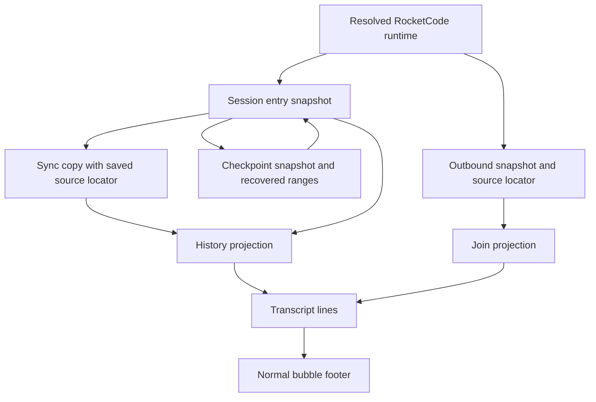
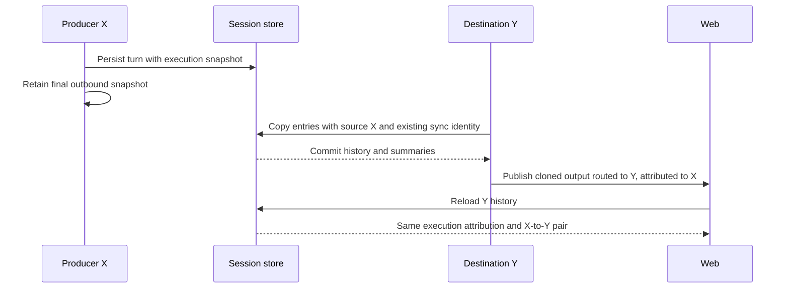

# Web Message Attribution - Plan

## Goal Capsule

- **Objective:** People reading Web conversations can tell which agent and model handled each message, its reasoning setting, and whether it came from an internal producer or an interactive session.
- **Means:** Carry execution-time attribution through existing turn records, outbound messages, and transcript events into a muted footer (KTD1–KTD5).
- **Authority:** Product requirements below govern behavior; repository instructions govern implementation. The upstream reference establishes visual behavior, not an API to copy.
- **Execution profile:** Five dependency-ordered units, with targeted regression coverage at persistence and projection boundaries.
- **Stop conditions:** Stop if correct attribution requires changing scheduling, prompt framing, delivery semantics, authorization, or the configured CLOC budgets. Report a conflict rather than relabeling historical messages.
- **Completion owner:** The calling implementation workflow owns implementation, verification, review, and its authorized shipping work. This document does not authorize deployment.

---

## Product Contract

### Summary

Add a small, muted attribution footer beneath normal user and assistant bubbles. Keep that attribution consistent between live updates and saved history, including messages copied from an internal producer into an interactive conversation.

### Problem Frame

The current transcript shows message content without enough information to identify the runtime that handled it. Current session settings cannot answer that question after an agent switch, model configuration change, or producer-to-interactive synchronization.

### Requirements

**Footer**

- R1. Normal user and assistant bubbles expose four attribution fields: agent, model, resolved reasoning effort, and internal-producer versus interactive-session origin.
- R2. Present attribution as a small muted footer in the style of OpenCode v2, preserving current bubble alignment and trace grouping.
- R3. Expose the exact source and destination conversation IDs unobtrusively, including both IDs when an internal producer's message is displayed in an interactive conversation.

**Historical accuracy**

- R4. Attribute messages to the execution-time agent, resolved display model, and resolved reasoning setting; never substitute the current session configuration for historical values.
- R5. Preserve known attribution through live updates, completion, persistence, reload, and `SyncConversation` from source to destination.
- R6. Missing historical values remain explicitly unknown; do not backfill or infer an agent, model, or reasoning level from today's configuration.
- R7. Preserve source identity independently of the routing destination when copying or publishing a synchronized message.

**Existing behavior**

- R8. Preserve queue ordering, prompt framing, silent/output-decision behavior, outbound routing, acknowledgement handling, and current conversation-access checks.
- R9. Footer work applies to normal bubbles; tool, developer, and reasoning traces retain their existing grouped presentation.

### Key Decisions

- **Behavior/output parity only.** Governs R2, R9. The directive was checked against the upstream agent/model/time and agent/model/duration footers: the requested reasoning and origin fields are intentional local additions, not evidence for copying upstream API or storage structures.
- **Four fields are required.** Governs R1, R4, R6. A footer based on the currently selected agent would be smaller but would be wrong after configuration changes; runtime snapshots are necessary.
- **No broad provenance redesign or historical backfill.** Governs R5–R7. Extend existing JSON records and transport fields only as needed for accurate message attribution.

### Acceptance Examples

- AE1. **Covers R1, R4, R5.** A turn uses agent `planner`, display model `work/model-a`, and reasoning `high`. Changing the session to `reviewer` and another model does not change that turn's footer after reload.
- AE2. **Covers R3, R5, R7.** A producer in conversation X completes a turn and synchronizes it into Y. Y shows internal origin, the producer's execution settings, and the exact X-to-Y pair in details.
- AE3. **Covers R6.** An old entry contains only its stored model. Its footer exposes that model and marks unavailable agent/reasoning values unknown; it does not consult current agent definitions.
- AE4. **Covers R4, R5.** An interrupted turn resumes under changed settings. Messages already produced retain their prior attribution, while newly produced messages use the resumed execution's settings.

### Scope Boundaries

No additional footer for grouped traces, new provenance explorer, provider failover, historical data repair, or changes to model selection. No timestamp, duration, token-count, or cost requirement is imported from OpenCode.

---

## Planning Contract

### Key Technical Decisions

- KTD1. **Snapshot at the resolved runtime.** Populate `SessionEntry` with the active agent name and resolved reasoning alongside its existing `Model`, using the values already available in `looper.runTurn`. `rocketcode.go` resolves agent/config reasoning precedence and provider-qualified `DisplayModel`. Carry the same snapshot into `ActiveTurnCheckpoint`. A present empty reasoning value means the request leaves effort to the provider; an absent value means unknown. Use optional data presence rather than treating those states as equivalent. This implements R4 and R6 without new resolution rules.
- KTD2. **Keep metadata outside provider replay, with bounded recovery overrides.** A normal entry has one snapshot. Recovery currently prepends previous replay items to a new entry and can combine different execution settings. Add optional attribution ranges for that recovered prefix, using one small typed data record with half-open replay-item bounds and the three snapshot values. Store those ranges on session entries and checkpoints; retain and offset them across repeated recovery. An explicitly unknown range overrides the surrounding new-turn snapshot. Existing replay transformations must remap bounds when they remove or prepend items. Do not change checkpoint sequencing, split history transactions, pin recovery to an old model, or insert metadata into model messages. This is the limited exception needed for AE4, not a lineage framework. Separate history rows would change persistence and recovery lifecycle; embedding metadata in SDK replay would couple display data to provider conversion. Neither is needed for the requested footer.
- KTD3. **Persist the source locator at the copy boundary.** Extend the existing sync JSON metadata with the source conversation ID in both `syncConversation` and `appendExternalMCPEntry`; keep `sync_source_entry_id` for idempotence. `ObserveEntries` uses the saved locator first and the existing source-row join for older entries. The destination remains the owning conversation row. A copied entry with a saved source locator remains attributable after source-row retention; an old orphan lacking one keeps the existing omission behavior. No SQL migration or backfill is needed for additive JSON keys. Covers R5–R7.
- KTD4. **Carry an immutable snapshot through outbound delivery.** Extend existing `runResult` and `OutboundMessage` data, and update the explicit field list in `CloneOutboundMessage`. Capture values from the constructed looper before its first message, rather than looking up mutable bridge configuration during publication. Keep destination routing in `ConversationID` and source identity in a separate field. Use the same snapshot for progress-associated responses, final output, and pending output republished after sync. A non-model command or workflow must not be given a fabricated model. Covers R4–R8.
- KTD5. **Project the same data in History and Join.** Add additive fields to `TranscriptEvent` and the TypeScript transport and line types. Apply history metadata after `inputEvent` replaces user events, and to the synthetic delivery-text assistant event. Resolve recovered-message overrides before the entry default. Join preserves outbound attribution rather than rebuilding it from the destination's selected agent. The internal/interactive label follows the actual producer/destination relationship, not the conversation-level origin card. Covers R1, R3–R7.

### Assumptions

These are unconfirmed presentation choices for this non-interactive plan:

- User-bubble agent/model/effort describe the turn that consumed the input, not a claim that an AI authored the user's text.
- Display unavailable values as `Unknown`; display a captured empty effort as `Provider default`, without inventing the provider's internal effort level.
- Use a compact native disclosure or the existing accessible tooltip component for the ID pair. Exact IDs must be available by keyboard and touch, not solely a mouse-only `title`.
- Optimistic inputs and inputs announced before runtime preparation may temporarily show unknown execution settings. Enrich them only through a message-ID-bound event from the resolved turn; do not match by text or borrow another turn's footer.
- For a direct interactive message, source and destination are the same conversation. For a synchronized message, source is the internal producer and destination is the viewed interactive conversation.

### High-Level Technical Design

### System-Wide Impact and Risks

- The display spans RocketCode, backend persistence, protocol, RPC, and Web. The smallest literal implementation is metadata capture and transport across these existing boundaries; no additional service is needed.
- Recovery and provider/managed replay conversion can remove or prepend replay items. KTD2 requires metadata boundaries to change with those items, or old messages could inherit a new model. Target these transformations with behavioral tests before relying on the UI.
- Synced delivery has separate history and publication paths. Metadata must survive both, including `CloneOutboundMessage`'s explicit copy. Keep the existing transaction and reservation-release order.
- Consumed user events currently arrive independently of runtime construction. Preserve their stable message IDs, and update attribution on duplicate-ID enrichment instead of dropping the event or creating a second user bubble.
- Additive JSON and protobuf fields permit old rows and callers to remain readable. Old binaries may discard new metadata on writes; rollback does not promise preservation by code that predates these fields.
- Attribution is display-only and must not alter model input, agent-accessible tools, principal framing, or authorization. The existing access check for the viewed destination remains the boundary for details.

### Sources and Existing Patterns

- Upstream reference supplied by the calling research: OpenCode commit `048a47e89e859f9928f5f04a56eebf013063152a`, `packages/session-ui/src/message/message-content.tsx`, `CurrentUserMessageDisplay` and `AssistantTextContent`. Cite this exact reference in parity-sensitive implementation comments and tests.
- `internal/rocketcode/rocketcode.go`: resolved model and reasoning construction. `internal/rocketcode/looper.go`: turn creation and checkpoint capture.
- `internal/rocketclaw/backend/bridge.go`: `runTurn`, `withRecoveredReplay`, `processResponse`, `publishFinal`, and `newOutboundMessage` define the lifetime of attribution.
- `internal/rocketclaw/backend/store.go`: `ObserveEntries`, `appendExternalMCPEntry`, and `externalMCPManagedEntry` define persisted copy and history behavior.
- `internal/rocketclaw/frontend/rpc/server.go`: History replaces user events and synthesizes delivery text; Join separately constructs outbound transcript events.
- `internal/rocketclaw/web/src/transcript.test.ts`: exercises actual private transcript functions, including the stale-history/live-stream guard. Extend this pattern.
- `internal/rocketclaw/docs/investigations/2026-09-20-wallace-stranded-mcp-queue.md`: paired delivery and later-work ordering must be verified separately from persisted history.

---

## Implementation Units

### U1. Persist execution-time attribution

**Goal:** Record truthful turn and checkpoint snapshots.

**Requirements:** R4, R6; AE1, AE3. **Dependencies:** None.

**Files:** `internal/rocketcode/looper.go`, `internal/rocketcode/active_turn.go`, `internal/rocketcode/looper_test.go`, `internal/rocketcode/models_test.go`.

**Approach:** Apply KTD1 at turn initialization and checkpoint capture. Reuse existing resolved runtime fields and keep existing `Model` semantics. Add only optional data needed to distinguish unavailable reasoning from captured provider-default behavior.

**Patterns to follow:** Existing `SessionEntry.Model`, `ActiveTurnCheckpoint.DisplayModel`, and the model-resolution test cases.

**Test scenarios:**
1. Agent-specific reasoning overrides runtime configuration and is identical in the persisted entry and checkpoint.
2. Config-derived reasoning and provider-qualified display model survive JSON round-trip.
3. Missing old fields remain unavailable, while captured empty effort remains distinguishable.

**Verification:** Existing model/replay behavior remains intact and snapshot assertions establish AE1/AE3 at the producer boundary.

### U2. Preserve attribution across recovery and replay projection

**Goal:** Prevent recovered messages from inheriting the resumed runtime's settings.

**Requirements:** R4–R6, R8; AE4. **Dependencies:** U1.

**Files:** `internal/rocketcode/looper.go`, `internal/rocketcode/active_turn.go`, `internal/rocketcode/looper_test.go`, `internal/rocketclaw/backend/bridge.go`, `internal/rocketclaw/backend/provider_replay.go`, `internal/rocketclaw/backend/store.go`, `internal/rocketclaw/backend/bridge_test.go`, `internal/rocketclaw/backend/provider_replay_test.go`.

**Approach:** Apply KTD2 where recovery prefixes are merged into checkpoints and completed entries. Extend the existing replay transformation loops to preserve corresponding attribution ranges. Keep runtime replay and stored attribution separate.

**Execution note:** Start with a recovery regression containing old and resumed messages with different model and reasoning settings; a single whole-entry snapshot must fail it.

**Test scenarios:**
1. Covers AE4. Recover model A/high into model B/low and verify distinct attribution for the old prefix and new messages.
2. Recover twice and verify the earliest prefix remains attributed to A rather than the intermediate or latest runtime.
3. Recover a legacy checkpoint lacking reasoning; its old messages stay unknown while new messages have captured values.
4. Remove compaction/reasoning items through managed or cross-provider projection and verify the remaining visible messages retain the correct snapshot.
5. Verify provider request payloads and recovered message ordering are unchanged by metadata.

**Verification:** Recovery snapshots remain correct across repeated restart and replay filtering, without changing checkpoint lifecycle or provider selection.

### U3. Carry source and execution metadata through synchronization and delivery

**Goal:** Make both persisted copies and published messages retain producer attribution.

**Requirements:** R3–R8; AE2. **Dependencies:** U1, U2.

**Files:** `internal/rocketclaw/backend/bridge.go`, `internal/rocketclaw/backend/conversations.go`, `internal/rocketclaw/backend/store.go`, `internal/rocketclaw/protocol/types.go`, `internal/rocketclaw/protocol/clockwork.go`, `internal/rocketclaw/backend/bridge_test.go`, `internal/rocketclaw/backend/conversations_test.go`, `internal/rocketclaw/backend/store_test.go`, `internal/rocketclaw/protocol/clockwork_test.go`.

**Approach:**
1. Apply KTD3 to both copy paths and `ObserveEntries`, retaining existing sync idempotence.
2. Apply KTD4 to resolved bridge model runs, including internal producer turns and final output-decision messages. Workflow-worker execution in `internal/rocketclaw/backend/raw_run.go` does not publish normal bubbles and needs no separate footer path.
3. Preserve source and destination when cloning and republishing pending output.
4. Attach resolved attribution to consumed user-message IDs at the turn that actually consumes them; handle steers using the active runtime snapshot.

**Patterns to follow:** Existing `runResult`, explicit outbound clone, source-row join, and sync transaction.

**Test scenarios:**
1. Covers AE2. Synchronize X into Y with different selected agents, assert X's settings and exact X/Y IDs in stored and live output, then repeat sync without duplicate history.
2. Delete X's source entry after copying a new-format entry and verify Y retains the saved source locator; an old orphan still follows existing behavior.
3. Force sync transaction failure and verify no metadata-only publication or early later-work release occurs.
4. Verify output-decision silence remains silent, and delivered text and attachments retain the producer snapshot.
5. Verify queue order, prompt/principal framing, delivery acknowledgements, and routing separately with existing relevant tests.
6. A queued input consumed after an agent switch and a steer consumed during a turn each receive the settings of their actual consuming runtime.

**Verification:** Both copy paths and the outbound clone preserve metadata, while paired scheduling and delivery contracts remain unchanged.

### U4. Expose attribution consistently through Web transport

**Goal:** History and live events carry the same truthful footer data.

**Requirements:** R1, R3–R7; AE1–AE4. **Dependencies:** U1–U3.

**Files:** `internal/rocketclaw/web/proto/web.proto`, `internal/rocketclaw/frontend/rpc/web.pb.go`, `internal/rocketclaw/frontend/rpc/protocol.gen.go`, `internal/rocketclaw/frontend/rpc/server.go`, `internal/rocketclaw/frontend/rpc/server_test.go`, `internal/rocketclaw/frontend/rpc/README.md`, `internal/rocketclaw/web/src/types.ts`, `internal/rocketclaw/web/src/live-transport.test.ts`.

**Approach:** Apply KTD5 with additive protobuf field numbers and the repository's existing generator, including its protocol hash output. Preserve optional reasoning presence through protobuf JSON. Add history attribution after user-event replacement and to delivery-text fallbacks. Include consumed-input enrichment and assistant snapshots in Join.

**Patterns to follow:** Existing protobuf generation, `historyEvent`, `inputEvent`, Join event construction, and transport tests.

**Test scenarios:**
1. Identical completed turns projected through History and Join expose equal agent/model/effort/origin/source/destination values.
2. User events with attachment projection and synthetic delivery-text events retain attribution.
3. A conversation containing producer output followed by an interactive reply displays distinct origins for the two turns despite one conversation-level origin card.
4. Legacy partial metadata remains partial, including captured-default versus unknown effort.
5. Unauthorized/private conversation requests retain existing results; exposing a source locator does not grant access to its contents.

**Verification:** Generated bindings, RPC history, and the actual HTTP/SSE transport agree on the additive contract.

### U5. Render and preserve the footer in Web

**Goal:** Show the requested footer without changing transcript identity, content, or grouping.

**Requirements:** R1–R9; AE1–AE4. **Dependencies:** U4.

**Files:** `internal/rocketclaw/web/src/ui.tsx`, `internal/rocketclaw/web/src/transcript.test.ts`, `internal/rocketclaw/web/src/message-footer.test.tsx` (new focused render test), `internal/rocketclaw/web/README.md`.

**Approach:**
1. Extend `Line`, `appendLine`, `nextLines`, and history mapping to retain event attribution.
2. Merge attribution enrichment into an existing user line by message ID, and preserve known attribution during cumulative assistant snapshot replacement.
3. Render the footer only in the normal-bubble branch of `TranscriptLine`, using the presentation assumptions above and existing component styles.
4. Document the four fields, ID disclosure, and honest treatment of old messages in the Web README.

**Patterns to follow:** Existing muted text, native disclosures, bubble alignment, and transcript tests that execute private UI functions. Keep the stale-history guard intact.

**Test scenarios:**
1. Covers AE1–AE3. Render fresh interactive, copied internal, and old partial-metadata messages with exact expected labels and details.
2. Cumulative answer snapshots update one bubble and retain metadata through completion, including attachment-only replies.
3. Message-ID enrichment updates an optimistic/consumed user line without creating a duplicate or changing its position.
4. A delayed history response cannot overwrite newer streamed content or metadata; a clean reload restores saved attribution.
5. Tool/reasoning/developer traces keep their grouping and do not acquire normal-bubble footers.
6. In a browser at desktop and narrow widths, verify muted legible text, long model names, bubble alignment, and keyboard/touch access to exact IDs.

**Verification:** Transcript tests prove update semantics; focused rendering and browser inspection prove the visible footer and disclosure.

---

## Verification Contract

All verification belongs to implementation, not this planning run. Temporary files, tool scratch, and browser artifacts must stay under the active workspace's `.tmp/`.

| Gate | Scope | Required result |
|---|---|---|
| `gofmt` | Touched Go files | No outstanding formatting changes |
| `go test ./...` | Repository root | All applicable tests pass |
| `make lint` | Repository root | Required Go lint and generated/build prerequisites pass |
| `make test` | Repository root | Component tests, coverage checks, and CLOC budgets pass |
| `make lint` and `make test` | `internal/rocketclaw/web` | Frontend lint, type checks, tests, and source budget pass |
| `bun run build` | `internal/rocketclaw/web` | Web assets build with updated transport types |
| RPC/HTTP integration | Existing isolated PostgreSQL and HTTP harness in `internal/rocketclaw/frontend/rpc/README.md` | History and actual SSE events match; required integration cases are not merely skipped |
| Browser verification | Normal and synchronized messages, reload, narrow viewport | Four footer fields and accessible exact ID pair are visible and correct |

Do not change budgets, suppress linters, add speculative guards, or hide first-party code in excluded paths. Recheck the touched Go diff against repository standards before tests and after formatting/lint changes. Extend existing behavioral tests rather than building parallel scaffolding.

---

## Definition of Done

- U1–U5 satisfy their test scenarios and referenced requirements.
- Live and historical attribution agree for interactive, synchronized, recovered, and legacy-partial messages.
- No historical metadata comes from the current session configuration, and no unknown provider effort is presented as a resolved level.
- Source and destination IDs survive sync without changing outbound routing or existing authorization.
- Queue order, prompt framing, silence/delivery decisions, and acknowledgement behavior are separately verified.
- Required verification gates pass, generated code is current, and abandoned implementation attempts are removed.
- README impact is addressed with concise updates to the Web and transport READMEs; no repository-root README change is needed.
