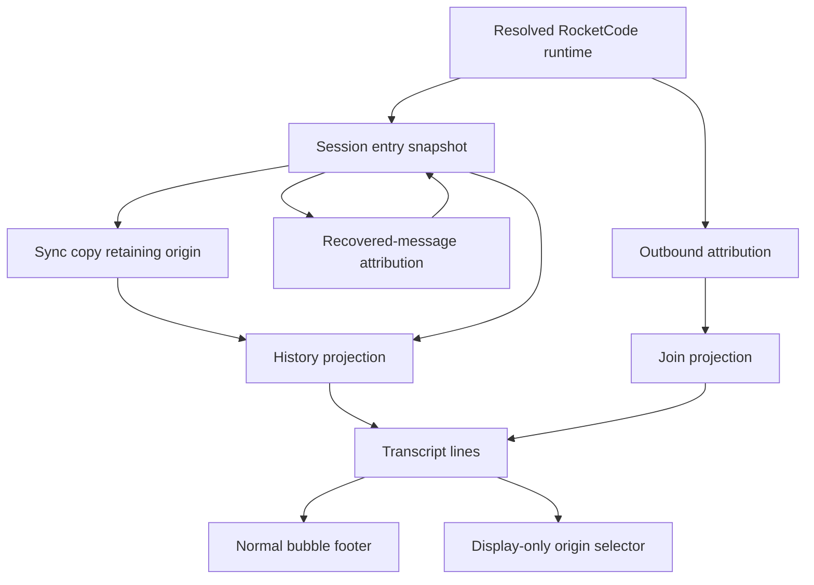
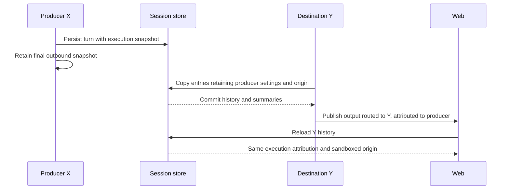

# Web Message Attribution - Plan

## Goal Capsule

- **Objective:** People reading Web conversations can see each message's known execution-time agent, provider/model, reasoning effort, and `sandboxed` or `canonical` origin, then show either origin, both, or neither.
- **Means:** Preserve only the attribution needed for a compact muted footer and a display-only origin selector across live and saved messages.
- **Authority:** Product requirements below govern behavior; repository instructions govern implementation. The upstream reference establishes visual behavior, not an API to copy.
- **Execution profile:** Reassess the smallest end-to-end implementation before changing code; preserve the existing plan and feature tests while verifying the whole-PR diff, not just selected files or production lines.
- **Stop conditions:** Stop if correct attribution requires changing scheduling, prompt framing, delivery semantics, authorization, or the configured CLOC budgets, or if a proposed simplification changes approved UI behavior. Report a conflict rather than relabeling historical messages.
- **Completion owner:** The calling implementation workflow owns implementation, verification, review, and its authorized shipping work. This document does not authorize deployment.

---

## Product Contract

### Summary

Add a small, muted attribution footer beneath normal assistant bubbles and a slim origin selector above the composer. Keep attribution consistent between live updates and saved history, including messages copied from an internal producer into an interactive conversation. The selector changes only what is displayed.

### Problem Frame

The current transcript shows message content without enough information to identify the runtime that handled it. Current session settings cannot answer that question after an agent switch, model configuration change, or producer-to-interactive synchronization.

### Requirements

**Footer**

- R1. Normal assistant bubbles show a compact, muted footer with known `agent (provider/model#effort)` details; user bubbles have no footer. Append ` - origin` only in sessions with sandboxed messages. Do not use `agent:`, `model:`, or other field labels. Keep the provider when it is known. Omit `#effort` when absent; show only recorded details and omit missing segments cleanly, without inventing a provider, agent, or reasoning level. No footer fold/unfold or ID disclosure.
- R2. Match OpenCode v2's understated footer appearance, keeping bubble alignment correct at desktop and mobile widths and leaving trace grouping intact; do not copy its API or add its timestamp/duration fields.
- R3. Origin labels are `sandboxed` for messages produced by an internal/other conversation and `canonical` for messages produced in the interactive conversation. Never show source or destination conversation IDs in the footer, a disclosure, or a tooltip.

**Historical accuracy**

- R4. Attribute each new message to the agent, provider-qualified display model, and reasoning setting actually used when it was generated or its input was consumed. Once recorded, these values do not change when session settings change.
- R5. Preserve that snapshot through streaming, completion, persistence, reload, interruption/recovery, and copying into another conversation. Copied messages keep their producer's attribution and origin; subsequent interactive messages have their own.
- R6. Older entries need no backfill. When a field was not recorded, show only fields actually known; do not infer missing agent, provider, model, effort, or origin from today's configuration or silently relabel old messages.
- R7. Keep message origin distinct from outbound routing: copying or publishing to the interactive conversation must not make a sandboxed message canonical.

**Origin selector**

- R8. Only sessions with sandboxed messages show a slim, connected shadcn Button Group centered immediately above the message composer, with `sandboxed` and `canonical` buttons. Keep the visible controls thin while providing larger, usable touch targets. Both start highlighted.
- R9. Each button toggles only itself. Both on shows all messages (including unknown-origin entries); only one on shows only that origin; both off shows no messages. Unknown-origin messages are shown only when both are on. No three-radio or exclusive-switch behavior.
- R10. Filtering is display-only: it does not delete or change history, reorder messages, alter delivery, or change outbound routing. The same controls work with mouse, keyboard, and touch.

**Existing behavior**

- R11. Preserve queue ordering, prompt framing, silent/output-decision behavior, outbound routing, acknowledgement handling, and current conversation-access checks.
- R12. Footer work applies to normal bubbles; tool, developer, and reasoning traces retain their existing grouped presentation.

### Key Decisions

- **Behavior/output parity only.** Governs R1–R2 and R12. OpenCode's footer is a visual reference, not a reason to copy its API or storage; the requested effort and origin are local additions.
- **No ID disclosure or footer expansion.** Governs R1, R3. The earlier request for source/destination IDs was superseded. Do not add a fold/unfold, details panel, or hover-only IDs to the message footer.
- **Execution-time values, not current settings.** Governs R4–R7. A footer based on the currently selected agent would be smaller but wrong after changes and recovery. Older entries need no backfill.
- **Four independent filter states.** Governs R8–R10. The initial three-state switch and thick/exclusive versions were replaced by two slim connected buttons; do not revive the alternation behavior.
- **Meaningfully smaller whole PR.** Preserve this plan and existing feature tests. Measure the whole change against PR #95, including tests, docs, generated files, and assets. Do not claim a minor line-count difference or test deletion is a simplification; reduce actual implementation complexity without sacrificing the requirements.

### Acceptance Examples

- AE1. **Covers R1, R4, R5.** A turn uses agent `planner`, display model `work/model-a`, and reasoning `high`. Its footer says `planner (work/model-a#high)` in a canonical-only session, or `planner (work/model-a#high) - canonical` when the session also has sandboxed messages. Changing the session to `reviewer` and another model does not change its recorded settings after reload.
- AE2. **Covers R3, R5, R7.** A producer in conversation X completes a turn and synchronizes it into Y. Y shows `sandboxed` and the producer's execution settings, not X or Y's ID; a later turn produced in Y shows `canonical` and its own settings.
- AE3. **Covers R1, R6.** An old entry contains only its stored model. Its footer uses that model without inventing a provider, agent, effort, or origin from current settings.
- AE4. **Covers R4, R5.** An interrupted turn resumes under changed settings. Messages already produced retain their prior attribution, while newly produced messages use the resumed execution's settings.
- AE5. **Covers R8–R10.** A canonical-only session has no selector. In a session with sandboxed messages, both buttons start on and all messages show. Turning off `sandboxed` leaves only canonical messages; turning off `canonical` as well shows none. Turning `sandboxed` back on shows only sandboxed messages. Unknown-origin messages appear only when both are on. Restoring both returns every message in its original order.

### Scope Boundaries

No additional footer for grouped traces, source/destination ID disclosure, new provenance explorer, provider failover, historical data repair, or changes to model selection. No timestamp, duration, token-count, or cost requirement is imported from OpenCode. The existing conversation-level origin card is separate from the message footer.

---

## Planning Contract

### Key Technical Decisions

- KTD1. **Snapshot at the resolved runtime.** Use the active agent and resolved provider-qualified display model and reasoning setting available when a turn runs. Preserve the values needed to render new messages after completion and reload, without introducing a second resolution policy. An empty or absent effort never becomes a made-up `#effort`. Covers R4–R6.
- KTD2. **Keep recovery attribution accurate without a lineage framework.** Recovery can combine older replay items with new messages under changed settings. Preserve each visible message's recorded attribution through recovery and any replay projection that removes or prepends items. Choose the smallest representation that fits the existing records; do not assume new range types or a broad replay rewrite are necessary. Do not change checkpoint sequencing, provider input, or history transactions. Covers AE4.
- KTD3. **Classify origin at the production/copy boundary.** Reuse existing synchronization identity where possible; persist only what is necessary for a copied message to remain `sandboxed` on reload. Retain sync idempotence and destination ownership. Source conversation IDs may remain internal where needed for copying/routing, but do not add transport or presentation fields solely to expose an ID pair. Covers R3, R5–R7.
- KTD4. **Carry the resolved values through outbound delivery.** Keep an execution-time snapshot on the existing live-message path through cloning, progress, final output, and pending output republished after sync; do not look up mutable selected settings during publication. Preserve destination routing independently of displayed origin. Do not invent a model for non-model work. Covers R4–R7, R11.
- KTD5. **Project only footer data in History and Join.** Carry agent, display model, effort, and origin into transcript events and Web lines from both saved entries and live outbound messages; do not expose source/destination IDs as attribution fields. Apply history metadata after user-event replacement and to synthetic delivery text. Use per-message recovery attribution, not a whole-entry fallback that overwrites older values. Covers R1, R3–R7.

### Assumptions

The footer and selector behavior above supersede the earlier presentation assumptions. The implementation still needs to respect these input/lifetime details:

- User-message agent/model/effort still describe the turn that consumed the input, not a claim that an AI authored the user's text; user bubbles do not display a footer.
- Do not synthesize a provider for a legacy bare model name or show `Provider default`/`Unknown` as if they were recorded effort values. Render whatever details are known without a fold/unfold control.
- Optimistic inputs and inputs announced before runtime preparation may temporarily show unknown execution settings. Enrich them only through a message-ID-bound event from the resolved turn; do not match by text or borrow another turn's footer.
- For a direct interactive message, origin is `canonical`; for a copied producer message it stays `sandboxed` even though the viewed and routed conversation is interactive. Unknown-origin entries stay visible in the default both-on state.

### High-Level Technical Design

```mermaid
flowchart TB
  Runtime[Resolved RocketCode runtime] --> Entry[Session entry snapshot]
  Runtime --> Live[Outbound attribution]
  Entry --> Checkpoint[Recovered-message attribution]
  Checkpoint --> Entry
  Entry --> Copy[Sync copy retaining origin]
  Copy --> History[History projection]
  Entry --> History
  Live --> Join[Join projection]
  History --> Lines[Transcript lines]
  Join --> Lines
  Lines --> Footer[Normal bubble footer]
  Lines --> Filter[Display-only origin selector]
```

```mermaid
sequenceDiagram
  participant P as Producer X
  participant S as Session store
  participant D as Destination Y
  participant W as Web
  P->>S: Persist turn with execution snapshot
  P->>P: Retain final outbound snapshot
  D->>S: Copy entries retaining producer settings and origin
  S-->>D: Commit history and summaries
  D->>W: Publish output routed to Y, attributed to producer
  W->>S: Reload Y history
  S-->>W: Same execution attribution and sandboxed origin
```

### System-Wide Impact and Risks

- Trace the existing producer, persistence, live, and history paths before adding fields at each boundary. The previous approach touched too many files and was not meaningfully smaller when rebuilt. Compare the whole PR to #95 before treating any redesign as simpler.
- Recovery and provider/managed replay conversion can remove or prepend replay items. Keep attribution aligned with the visible messages or old messages could inherit a new model. Target this behavior with existing tests before relying on the UI.
- Synced delivery has separate history and publication paths. Metadata must survive both, including `CloneOutboundMessage`'s explicit copy. Keep the existing transaction and reservation-release order.
- Consumed user events currently arrive independently of runtime construction. Preserve their stable message IDs, and update attribution on duplicate-ID enrichment instead of dropping the event or creating a second user bubble.
- Additive JSON and protobuf fields permit old rows and callers to remain readable. Old binaries may discard new metadata on writes; rollback does not promise preservation by code that predates these fields.
- Attribution and filtering must not alter model input, agent-accessible tools, principal framing, authorization, queue order, or delivery. The existing access check for the viewed conversation remains unchanged.

### Sources and Existing Patterns

- Upstream reference supplied by the calling research: OpenCode commit `048a47e89e859f9928f5f04a56eebf013063152a`, `packages/session-ui/src/message/message-content.tsx`, `CurrentUserMessageDisplay` and `AssistantTextContent`. Cite this exact reference in parity-sensitive implementation comments and tests.
- `internal/rocketcode/rocketcode.go`: resolved model and reasoning construction. `internal/rocketcode/looper.go`: turn creation and checkpoint capture.
- `internal/rocketclaw/backend/bridge.go`: `runTurn`, `withRecoveredReplay`, `processResponse`, `publishFinal`, and `newOutboundMessage` define the lifetime of attribution.
- `internal/rocketclaw/backend/store.go`: `ObserveEntries`, `appendExternalMCPEntry`, and `externalMCPManagedEntry` define persisted copy and history behavior.
- `internal/rocketclaw/frontend/rpc/server.go`: History replaces user events and synthesizes delivery text; Join separately constructs outbound transcript events.
- `internal/rocketclaw/web/src/transcript.test.ts`: exercises actual private transcript functions, including the stale-history/live-stream guard. Extend this pattern.
- `internal/rocketclaw/docs/investigations/2026-09-20-wallace-stranded-mcp-queue.md`: paired delivery and later-work ordering must be verified separately from persisted history.

---

## Implementation Units

### U1. Persist execution-time attribution

**Goal:** Record truthful turn and checkpoint snapshots.

**Requirements:** R4, R6; AE1, AE3. **Dependencies:** None.

**Files:** `internal/rocketcode/looper.go`, `internal/rocketcode/active_turn.go`, `internal/rocketcode/looper_test.go`, `internal/rocketcode/models_test.go`.

**Approach:** Apply KTD1 at the actual execution boundary. Reuse the resolved provider-qualified display model; preserve optional data only when its presence matters to accurate attribution, not to display a placeholder effort.

**Patterns to follow:** Existing `SessionEntry.Model`, `ActiveTurnCheckpoint.DisplayModel`, and the model-resolution test cases.

**Test scenarios:**
1. Agent-specific reasoning overrides runtime configuration and is identical in the persisted entry and checkpoint.
2. Config-derived reasoning and provider-qualified display model survive JSON round-trip.
3. Missing old fields remain unavailable, and a new message without explicit effort has no `#effort` suffix.

**Verification:** Existing model/replay behavior remains intact and snapshot assertions establish AE1/AE3 at the producer boundary.

### U2. Preserve attribution across recovery and replay projection

**Goal:** Prevent recovered messages from inheriting the resumed runtime's settings.

**Requirements:** R4–R6, R11; AE4. **Dependencies:** U1.

**Files:** `internal/rocketcode/looper.go`, `internal/rocketcode/active_turn.go`, `internal/rocketcode/looper_test.go`, `internal/rocketclaw/backend/bridge.go`, `internal/rocketclaw/backend/provider_replay.go`, `internal/rocketclaw/backend/store.go`, `internal/rocketclaw/backend/bridge_test.go`, `internal/rocketclaw/backend/provider_replay_test.go`.

**Approach:** Apply KTD2 where recovered messages enter completed entries and where replay transformations change visible message order. Reuse existing records and transformation paths before introducing any new type or state.

**Execution note:** Start with a recovery regression containing old and resumed messages with different model and reasoning settings; a single whole-entry snapshot must fail it.

**Test scenarios:**
1. Covers AE4. Recover model A/high into model B/low and verify distinct attribution for the old prefix and new messages.
2. Recover twice and verify the earliest prefix remains attributed to A rather than the intermediate or latest runtime.
3. Recover a legacy checkpoint lacking reasoning; its old messages gain no invented effort while new messages have their recorded values.
4. Remove compaction/reasoning items through managed or cross-provider projection and verify the remaining visible messages retain the correct snapshot.
5. Verify provider request payloads and recovered message ordering are unchanged by metadata.

**Verification:** Recovery snapshots remain correct across repeated restart and replay filtering, without changing checkpoint lifecycle or provider selection.

### U3. Carry source and execution metadata through synchronization and delivery

**Goal:** Make both persisted copies and published messages retain producer attribution and `sandboxed` origin without exposing IDs.

**Requirements:** R3–R7, R11; AE2. **Dependencies:** U1, U2.

**Files:** `internal/rocketclaw/backend/bridge.go`, `internal/rocketclaw/backend/conversations.go`, `internal/rocketclaw/backend/store.go`, `internal/rocketclaw/protocol/types.go`, `internal/rocketclaw/protocol/clockwork.go`, `internal/rocketclaw/backend/bridge_test.go`, `internal/rocketclaw/backend/store_test.go`, `internal/rocketclaw/protocol/clockwork_test.go`.

**Approach:**
1. Apply KTD3 only where the copy paths need to preserve origin after reload, retaining existing sync idempotence. Do not persist extra source locators solely for an ID disclosure.
2. Apply KTD4 to resolved bridge model runs, including internal producer turns and final output-decision messages. Workflow-worker execution in `internal/rocketclaw/backend/raw_run.go` does not publish normal bubbles and needs no separate footer path.
3. Preserve producer attribution and displayed origin when cloning and republishing pending output, without changing destination routing.
4. Attach resolved attribution to consumed user-message IDs at the turn that actually consumes them; handle steers using the active runtime snapshot.

**Patterns to follow:** Existing `runResult`, explicit outbound clone, source-row join, and sync transaction.

**Test scenarios:**
1. Covers AE2. Synchronize X into Y with different selected agents, assert X's settings and `sandboxed` origin in saved and live output without displaying IDs, then repeat sync without duplicate history.
2. Reload Y after copying and verify its producer messages remain `sandboxed` while Y's later interactive replies are `canonical`.
3. Force sync transaction failure and verify no metadata-only publication or early later-work release occurs.
4. Verify output-decision silence remains silent, and delivered text and attachments retain the producer snapshot.
5. Verify queue order, prompt/principal framing, delivery acknowledgements, and routing separately with existing relevant tests.
6. A queued input consumed after an agent switch and a steer consumed during a turn each receive the settings of their actual consuming runtime.

**Verification:** Both copy paths and outbound delivery preserve producer metadata and origin, while paired scheduling and delivery contracts remain unchanged.

### U4. Expose attribution consistently through Web transport

**Goal:** History and live events carry the same truthful footer data.

**Requirements:** R1, R3–R7; AE1–AE4. **Dependencies:** U1–U3.

**Files:** `internal/rocketclaw/web/proto/web.proto`, `internal/rocketclaw/frontend/rpc/web.pb.go`, `internal/rocketclaw/frontend/rpc/protocol.gen.go`, `internal/rocketclaw/frontend/rpc/server.go`, `internal/rocketclaw/frontend/rpc/server_test.go`, `internal/rocketclaw/frontend/rpc/README.md`, `internal/rocketclaw/web/src/types.ts`, `internal/rocketclaw/web/src/live-transport.test.ts`.

**Approach:** Apply KTD5 with only the fields the footer and selector need, using the repository's existing generator and protocol hash output if protobuf changes are necessary. Preserve optional reasoning and unknown origin through transport. Add history attribution after user-event replacement and to delivery-text fallbacks. Include consumed-input enrichment and assistant snapshots in Join.

**Patterns to follow:** Existing protobuf generation, `historyEvent`, `inputEvent`, Join event construction, and transport tests.

**Test scenarios:**
1. Identical completed turns projected through History and Join expose equal recorded agent/model/effort/origin values, without new source/destination fields for display.
2. User events with attachment projection and synthetic delivery-text events retain attribution.
3. A conversation containing producer output followed by an interactive reply displays distinct origins for the two turns despite one conversation-level origin card.
4. Legacy partial metadata remains partial; absent and empty effort never produce a fabricated level.
5. Unauthorized/private conversation requests retain existing results; the selector grants no access to hidden conversations.

**Verification:** Generated bindings, RPC history, and the actual HTTP/SSE transport agree on the additive contract.

### U5. Render the footer and display-only origin selector in Web

**Goal:** Show the compact footer and independently toggle the two origins without changing transcript identity, content, order, or grouping.

**Requirements:** R1–R12; AE1–AE5. **Dependencies:** U4.

**Files:** `internal/rocketclaw/web/src/ui.tsx`, `internal/rocketclaw/web/src/components/ui/button-group.tsx`, `internal/rocketclaw/web/src/transcript.test.ts`, `internal/rocketclaw/web/src/message-footer.test.tsx`, `internal/rocketclaw/web/src/entry-transport.test.ts`, `internal/rocketclaw/web/README.md`.

**Approach:**
1. Extend `Line`, `appendLine`, `nextLines`, and history mapping to retain event attribution.
2. Merge attribution enrichment into an existing user line by message ID, and preserve known attribution during cumulative assistant snapshot replacement.
3. Render the compact, muted footer only on assistant bubbles in `TranscriptLine`; show origin only when saved or live messages include a sandboxed origin. Omit missing values and never show source/destination IDs or a footer disclosure.
4. Show the existing shadcn Button Group only when saved or live messages include a sandboxed origin. Keep its two connected, slim, independently pressed buttons centered above the composer with a larger touch area than their visual height. Filter the displayed transcript only; unknown-origin entries appear only with both pressed.
5. Document the footer, lack of ID disclosure, honest treatment of old messages, and four filter states in the Web README.

**Patterns to follow:** Existing muted text, bubble alignment, shadcn button styles, and transcript tests that execute private UI functions. Keep the stale-history guard intact.

**Test scenarios:**
1. Covers AE1–AE3. Render fresh interactive, copied producer, and old partial-metadata messages with exact compact footers, including known provider, omitted missing effort, origin suffix only in sessions with sandboxed messages, and no IDs or disclosure.
2. Cumulative answer snapshots update one bubble and retain metadata through completion, including attachment-only replies.
3. Message-ID enrichment updates an optimistic/consumed user line without creating a duplicate or changing its position.
4. A delayed history response cannot overwrite newer streamed content or metadata; a clean reload restores saved attribution.
5. User bubbles and tool/reasoning/developer traces do not acquire footers; traces keep their grouping.
6. Covers AE5. Assert both/either/neither filtering, unknown-origin behavior, stable turn order, and no mutation of history or outbound routing.
7. In a browser at desktop and narrow widths, verify muted legible text, long model names, bubble alignment, no selector in canonical-only sessions, and a slim connected group above the composer when sandboxed messages exist, with independent `aria-pressed` states and keyboard/touch access to adequately sized targets. Actually run the browser-gated assertions; a skipped browser test is not verification.

**Verification:** Transcript tests prove update and filtering semantics; focused rendering and a run of the browser-gated checks prove the visible footer and selector.

---

## Verification Contract

All verification belongs to implementation, not this planning run. Temporary files, tool scratch, and browser artifacts must stay under the active workspace's `.tmp/`.

| Gate | Scope | Required result |
|---|---|---|
| `gofmt` | Touched Go files | No outstanding formatting changes |
| `go test ./...` | Repository root | All applicable tests pass |
| `make lint` | Repository root | Required Go lint and generated/build prerequisites pass |
| `make test` | Repository root | Component tests, coverage checks, and CLOC budgets pass |
| `make lint` and `make test` | `internal/rocketclaw/web` | Frontend lint, type checks, tests, and source budget pass |
| `bun run build` | `internal/rocketclaw/web` | Web assets build with updated transport types |
| RPC/HTTP integration | Existing isolated PostgreSQL and HTTP harness in `internal/rocketclaw/frontend/rpc/README.md` | History and actual SSE events match; required integration cases are not merely skipped |
| Browser verification | Normal and copied messages, reload, desktop and narrow viewports, explicit browser-test environment | Compact footer has no IDs; the connected selector has four working states and usable touch targets; assertions actually run |
| Whole-PR size review | Compare the complete replacement against PR #95 | Meaningful reduction in real implementation complexity and whole-diff size without removing this plan, existing feature tests, or required behavior |

Do not change budgets, suppress linters, add speculative guards, or hide first-party code in excluded paths. Recheck the touched Go diff against repository standards before tests and after formatting/lint changes. Extend existing behavioral tests rather than building parallel scaffolding.

---

## Definition of Done

- U1–U5 satisfy their test scenarios and referenced requirements.
- Live and historical attribution agree for new interactive, copied, and recovered messages; older entries show only their known details without backfill.
- No historical metadata comes from the current session configuration, and no unknown provider effort is presented as a resolved level.
- Footer is compact and aligned, retains any known provider, omits absent effort, and never reveals source/destination IDs or adds a fold/unfold control.
- The centered slim shadcn Button Group supports both/either/neither; unknown origin appears only with both selected; filtering does not change storage, order, or delivery.
- Queue order, prompt framing, silence/delivery decisions, and acknowledgement behavior are separately verified.
- Required verification gates pass, including browser assertions rather than skips; generated code is current, the plan and existing feature tests remain, and the complete PR is substantially smaller for an honest implementation reason.
- README impact is addressed with concise updates to the Web and transport READMEs; no repository-root README change is needed.
