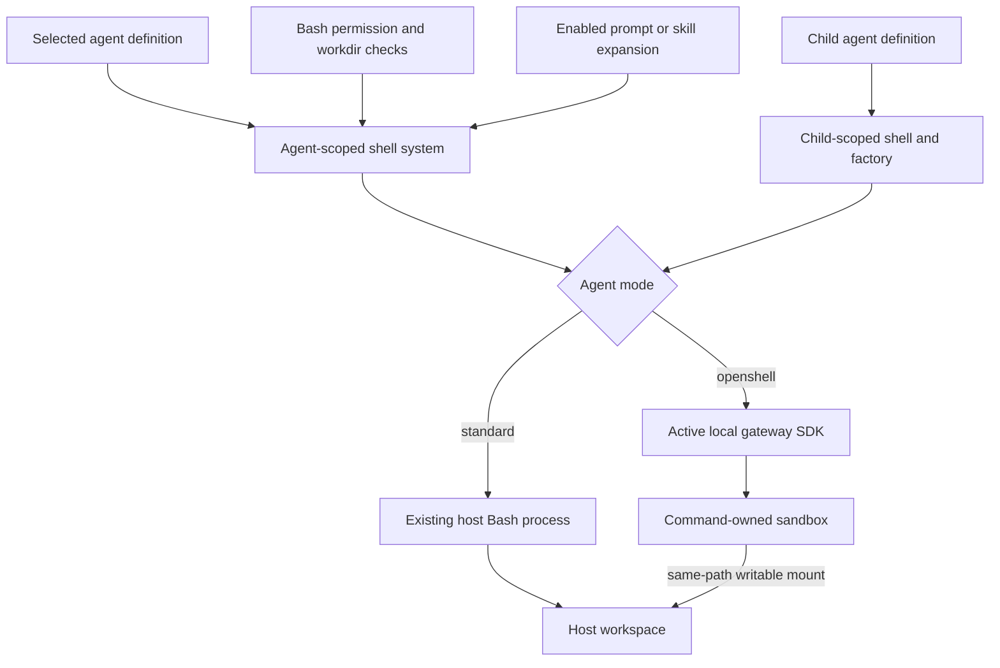
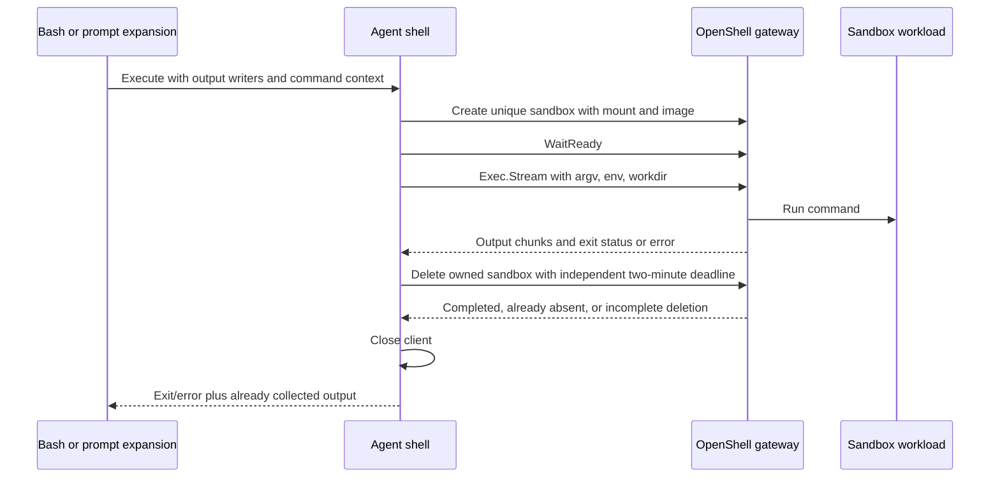
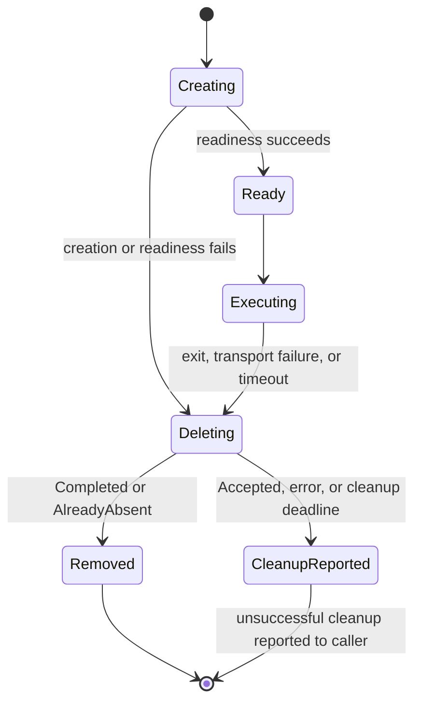
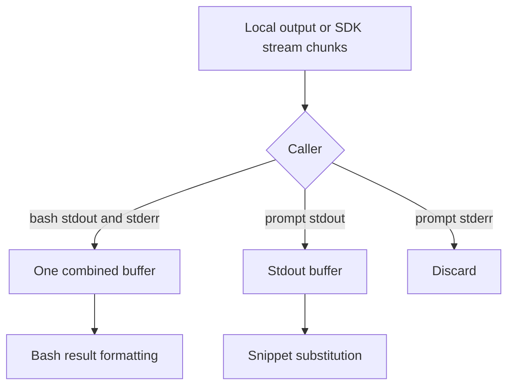

# Optional OpenShell Bash Backend - Plan

## Goal Capsule

- **Objective:** Operators can choose isolated shell execution for an individual agent and see its commands operate on the same workspace as RocketClaw.
- **Means:** An agent-selected OpenShell Go SDK execution branch in RocketCode's existing shell system (KTD1, KTD2).
- **Authority:** Product requirements govern behavior; KTDs govern implementation within those requirements; units and examples override neither. Repository instructions and explicit human decisions take precedence.
- **Execution profile:** Four dependency-ordered units, local verification, then the calling pipeline's shipping flow. This document does not authorize deployment or gateway reconfiguration.
- **Stop conditions:** Stop if the local gateway cannot support the required mount, cleanup cannot terminate timed-out work, or an existing behavior must change beyond the documented container environment and policy distinctions. Report any CLOC or coverage conflict rather than weakening a gate.
- **Finish owner:** The implementation stage completes the units and verification; the calling LFG pipeline owns review and shipping.

---

## Product Contract

### Summary

Add an optional OpenShell backend for agent shell commands.
Each agent selects its mode and container image in YAML frontmatter.
The ordinary shell remains available without OpenShell setup.

### Problem Frame

RocketClaw currently runs agent shell commands on its own host.
Operators need a way to isolate selected agents' shell work without moving RocketClaw or the agent loop into a container.

### Key Decisions

- **Keep configuration with the agent.** Governs R1, R2. (session-settled: user-directed — chosen over global image and gateway settings: each agent owns its execution choice.)
- **Use the existing local OpenShell gateway.** Governs R3, R4. (session-settled: user-directed — chosen over a remote worker protocol: the gateway and RocketClaw run on the same computer.)
- **Cover the agent's shell surfaces, not the whole daemon.** Governs R5, R6. (session-settled: user-directed — chosen over whole-agent migration: only shell execution moves.)

### Requirements

**Selection and configuration**

- R1. Missing `rocketclaw.bash_mode`, or the explicit value `standard`, selects the existing host shell without consulting OpenShell.
- R2. `rocketclaw.bash_mode: openshell` requires a non-empty `rocketclaw.openshell.image` on that agent; no global image, gateway, or additional `rocketclaw.json` settings are introduced.
- R3. OpenShell mode uses OpenShell's configured active gateway on the same computer as RocketClaw, rather than starting or selecting a gateway itself.

**Execution scope**

- R4. OpenShell commands share the host workspace through a writable bind mount at the same absolute path, with workdir and authoritative `TMPDIR` resolving inside that mount.
- R5. An agent's selected mode applies to its bash tool and every enabled primary, input, subagent, or skill prompt shell expansion belonging to that agent.
- R6. Task children, guardrails, and custom permission reviewers select their own agent definitions' mode and image, rather than inheriting the parent's choice.

**Results and authority**

- R7. Bash retains `BashResult` semantics: combined output, `(no output)` for an empty result, decimal nonzero exit codes, `timeout` for its deadline, and unsuccessful `error` results for backend failures.
- R8. Prompt expansion keeps its existing enable flags, stdout-only substitution, partial stdout on failure, and empty substitution when execution produces no stdout.
- R9. Existing bash visibility, approval decisions, command/path checks, and workdir validation remain outside backend selection; permission denial prevents any sandbox creation.
- R10. Missing OpenShell gateway configuration, an unavailable gateway, image/startup failure, or rejected mount produces a bash error and never executes the command locally.
- R11. Shell work owns its sandbox cleanup, including failure and timeout paths; the implementation must not silently claim cleanup succeeded when it could not complete.

### Acceptance Examples

- AE1. **Covers R1, R10:** With no OpenShell installation and a standard agent, `printf ok` succeeds locally; the same command under an OpenShell agent fails without creating a local marker file.
- AE2. **Covers R4, R7:** A permitted command writes a file in a workspace subdirectory and prints `pwd`; the host read tool sees the file and the output contains the same absolute workspace path.
- AE3. **Covers R5, R6, R8:** An OpenShell parent delegates to a standard child; the child's enabled prompt snippet and bash tool run locally, while the parent's enabled skill snippet runs in its configured image.
- AE4. **Covers R7, R11:** A command prints a prefix and then exceeds its timeout; bash returns the prefix with `ErrorCode: timeout`, and the owned sandbox is stopped and deleted.
- AE5. **Covers R9:** A denied bash command never contacts the gateway, even when its agent selects OpenShell.

### Scope Boundaries

- Only agent-owned shell execution changes. Filesystem tools, the model loop, MCP, Slack routing, and daemon administration stay on the host.
- Daemon-owned goal completion checks currently using `RunBash` are not agent tool calls; that entry point remains standard.
- No sandbox pool, conversation cache, worker protocol, gateway bootstrap, arbitrary policy editor, credential provider migration, or automatic host-environment import.
- No persistent container-only state guarantee. KTD3 defines the lifecycle and its workspace persistence tradeoff.

---

## Planning Contract

### Key Technical Decisions

- KTD1. **Extend `sandboxedShellSystem`, not a backend framework.** Give its command execution a shared private boundary accepting the selected workdir and ordinary stdout/stderr writers. Bash owns validation, timeout, and result formatting; prompt expansion owns stdout-only substitution. Store the selected shell on `promptExpansionEnvironment` so the two callers cannot diverge. Keep the existing `ShellCommand` customization as the argv builder for standard execution; add no behavior-injection callback or new exported runner API. This isolates the necessary transport fork without duplicating the bash contract (R5, R7, R8, R9).
- KTD2. **Pin the SDK and reuse the active gateway's authentication.** Use module `github.com/NVIDIA/OpenShell/sdk/go` at `v0.0.0-20260928030816-6648bd0c290e`, corresponding to release commit `6648bd0c290efbc41ba131ee9831ee45cd431f94`. The root tag `v0.1.2` is not a Go submodule tag. Load the active selection once with `gateway.LoadConfig("")`, start with an empty `[]gateway.ClientOption`, and pass the resolved `cfg.Name` to `gateway.NewClient`. Only for `gateway.AuthModeMTLS`, append `gateway.WithAuth(v1.NoAuth())` and `gateway.WithTLS` using the existing `v1.TLSConfig` alias: `CertFile`, `KeyFile`, and `CAFile` are `filepath.Join(cfg.Dir, "mtls", "tls.crt")`, `tls.key`, and `ca.crt` respectively. Leave `Insecure` false. `NoAuth` suppresses token-based per-RPC credentials and the SDK's unsupported-mTLS resolver; authentication is still mutual TLS, with trusted-server verification and the client certificate. Every other mode uses native SDK resolution with no overrides. Missing/invalid bundle or connection failure returns an error without plaintext downgrade or host execution. Keep the SDK's default workspace scope, distinct from the mounted host directory, and close the command-owned client after cleanup. Add no settings, environment-based auth, new types, or helper wrapper. Stock local-package registration already selects mTLS and stores this bundle ([registration](https://github.com/NVIDIA/OpenShell/blob/6648bd0c290efbc41ba131ee9831ee45cd431f94/crates/openshell-cli/src/commands/gateway.rs#L1085-L1125), [bundle layout](https://github.com/NVIDIA/OpenShell/blob/6648bd0c290efbc41ba131ee9831ee45cd431f94/crates/openshell-bootstrap/src/mtls.rs#L15-L38), [bundle directory](https://github.com/NVIDIA/OpenShell/blob/6648bd0c290efbc41ba131ee9831ee45cd431f94/crates/openshell-bootstrap/src/mtls.rs#L80-L82)); supporting it enforces R3 and R10, not a new gateway topology.
- KTD3. **Create one uniquely named sandbox per command.** Create, await readiness, execute, delete, and close the client in the same blocking call. Use a persistent inert sandbox workload so the image entrypoint cannot finish before exec starts. Mounted files persist; installations or background services outside the mount do not. Reuse would require runtime-close ownership, child identity rules, and timeout invalidation across turns that the present runtime does not provide. Immediately before deletion, derive a finite cleanup context from `context.WithoutCancel` with the existing `defaultShellTimeout` budget (`120000` ms / two minutes), and cancel it on return. This budget starts at cleanup, independently of the command timeout; the SDK supplies no deadline itself. The supported drivers remove the container on delete; accept only `Completed` or `AlreadyAbsent` as completed cleanup and report `Accepted` as incomplete. Attempt owned-name deletion after an ambiguous create failure with the SDK's allow-missing option. Record the primary execution classification before cleanup; retain its output, timeout, or numeric exit code. Cleanup-only deadline expiry is an unsuccessful backend `error`, not an execution `timeout`, and reports the owned name and unconfirmed deletion. Add no cleanup constant/configuration, goroutine, wrapper, stop/wait layer, retry, janitor, or resource cache (R4, R7, R11).
- KTD4. **Consume `Exec.Stream` synchronously.** Forward chunks to the appropriate supplied writer in received order, require the SDK's final exit status, and close the stream before sandbox cleanup. Unlike `Exec.Run`, this retains output when the stream fails partway through. Do not concatenate separate final stdout/stderr buffers or treat EOF without an exit event as success (R7, R8).
- KTD5. **Bind only the validated workspace.** Resolve an absolute workspace path through the existing `*os.Root` contract and request an explicitly writable same-path Docker/Podman bind mount in `SandboxSpec.Template.DriverConfig`. Use SDK policy types for filesystem and process access; `map[string]any` stays confined to the SDK's dynamic driver-config boundary. Keep runtime paths read-only and grant workspace/temp write access, without mounting the host home or weakening the host temp directory's `0700` mode (R4, R9).
- KTD6. **Select before expansion and tool construction.** Parse the namespaced frontmatter into a small private typed value on the existing `Agent`, with a Go enum for mode. Build the active agent's shell before primary expansion. For every child path, replace the copied factory's prompt environment and bash binding before expanding its prompt, assembling tools, or configuring spills. Clone the tool map before replacing bash, retaining all other host/custom tools. An omitted child mode means standard, not parent inheritance (R1, R2, R5, R6).
- KTD7. **Delegate remote environment defaults to OpenShell's native runtime.** Standard execution retains host environment plus `ShellEnv` and authoritative `TMPDIR`. OpenShell execution sends only existing explicitly configured `ShellEnv` variables plus authoritative mounted-workspace `TMPDIR`. The stock v0.1.2 boundary executor sanitizes its environment, restores runtime `PATH`, and derives `HOME` from its boundary effective/base workdir or process identity; SDK `WorkDir` becomes a shell `cd`, not a guarantee of `HOME`. The Docker driver does not merge image-only `ENV` into its child environment, so values such as image-only `JAVA_HOME` are absent unless explicitly supplied. Podman has different native image-environment handling; promise neither full image-environment retention nor image `HOME` retention across drivers. This corrects an unapproved planning assumption, not a user-directed requirement. Use the normal privileged non-startup Bash argv with `NoLoginShell` enabled. Do not inspect Docker image metadata, fork the upstream runtime, add configuration, or import host environment, inherited shell functions, gateway tokens, or incidental daemon credentials (R4, R7, R8).
- KTD8. **Keep the two existing cancellation contracts.** Bash detaches caller cancellation and applies its requested/default `120000` ms timeout with the existing `100` ms grace to provisioning and execution. Prompt snippets detach caller cancellation and receive no new timeout. For OpenShell, RPC cancellation is not proof that descendants stopped; KTD3's completed deletion provides that ownership. Standard execution keeps its current process-group termination behavior (R7, R8, R11).

### High-Level Technical Design

Agent selection and execution boundaries (KTD1, KTD6):



Command lifecycle and protocol ownership (KTD2, KTD3, KTD4, KTD8):



Mode/flag combinations (R1, R5, R6, R8):

| Agent mode | Source | Expansion flag | Execution |
|---|---|---|---|
| Missing / standard | Bash | Not applicable | Existing host shell |
| OpenShell | Bash | Not applicable | Agent image |
| Either | Primary/input/skill prompt | Disabled | Literal snippet; no execution |
| Standard | Enabled prompt | Enabled | Host stdout substitution |
| OpenShell | Enabled prompt | Enabled | Image stdout substitution |
| Either parent | Child bash/enabled prompt | Existing source flag and child definition | Child-selected backend |

Sandbox state ownership (KTD3):



Output data flow (KTD1, KTD4; R7, R8):



Agent configuration shape (R1, R2):

```yaml
rocketclaw:
  bash_mode: openshell
  openshell:
    image: YOUR_IMAGE
```

Omit this namespace or set `rocketclaw.bash_mode: standard` to use the existing shell (R1).

### Assumptions and External Prerequisites

- The supported topology is an operator-configured local Docker or Podman gateway whose container engine can see the workspace path. A loopback endpoint alone cannot prove the engine is local; remote gateway and remote Docker-context support are not claimed.
- Gateway driver-config passthrough must allow the requested mount: `allow_driver_config = true`, driver `enable_bind_mounts = true`, and resource admission explicitly disabled as required by the pinned release. These are OpenShell deployment prerequisites, not new RocketClaw settings; do not change them automatically.
- The chosen Linux image supplies Bash, the inert workload's basic utilities, and an OpenShell-compatible non-root process identity. Its numeric UID/GID or the engine's user mapping must permit traversal and writes to the mounted workspace and host-owned `0700` temp directory. Do not fix this by host `chown`, broader permissions, or root execution.
- OpenShell filesystem and network policy enforcement adds container restrictions without replacing RocketCode approval rules. Do not generate broad outbound network allowances or a new approval flow. The initial policy has no outbound allowances; document this difference from standard execution.
- Fresh sandbox creation adds startup cost and discards container-only state. This is an explicit planning assumption, not a promise of conversation/agent reuse.

### System-Wide Impact and Risks

- **Shared workspace:** Host filesystem tools and the sandbox observe the same files. Existing parallel agent races remain; this change introduces no transaction, copy-back stage, or extra workspace lock.
- **Permission boundary:** Bash authorization remains host-side. Prompt expansion currently does not use the bash permission path; preserve that behavior and its enable flags rather than quietly adding approval or command filtering to prompts.
- **Environment:** Explicit conversation/metadata variables continue through `ShellEnv`. Native OpenShell environment handling governs all other defaults; Docker image-only `ENV` and image `HOME` are not retained as previously assumed (KTD7). Tools needing those values, host-installed executables, host credentials, or outbound networking may fail through the existing result surfaces.
- **Child routing:** `runTask`, `runGuardrail`, and `reviewPermission` currently copy the parent factory and expand using the parent environment. Updating only root tool construction would leave all three paths incorrect.
- **Cleanup:** The gateway distinguishes completed deletion from accepted asynchronous deletion; inspect the outcome per KTD3. A stalled deletion returns failure when the independent two-minute cleanup budget expires; report the owned name without claiming removal or descendant termination. The gateway may still finish deletion after that deadline. A daemon crash can also leave an orphan. An ambiguous create can finish after an allow-missing delete saw no record, so retain that uncertainty in the primary error. Do not claim crash or lost-response recovery guarantees without a persistent owner.
- **Timeout:** Provisioning consumes the bash timeout. A cold image may time out before the command starts. Cleanup can add up to two minutes beyond execution. Preserve output collected before a stream deadline and make cleanup errors secondary to the execution classification; expiration during cleanup alone must not become a command timeout.

### Deferred to Implementation

- Verify the exact minimal Linux filesystem policy and inert workload against the selected image; use pinned upstream policy examples rather than inventing a cross-image policy framework.
- Verify deletion outcomes for ready, failed-provisioning, and already-completed sandboxes on the supported driver. An asynchronous-only driver is unsupported by this lifecycle, not a reason to add a polling framework.
- Verify same-path mounts and temp ownership on Linux and macOS. If the local engine cannot expose the workspace safely, stop rather than switching to copying or remote execution.

---

## Implementation Units

### U1. Share command execution without changing standard behavior

**Goal:** Bash and prompt expansion can call the same existing shell system while keeping their separate contracts.

**Requirements:** R1, R5, R7, R8, R9; KTD1, KTD7, KTD8.

**Dependencies:** None.

**Files:** `internal/rocketcode/shell.go`, `internal/rocketcode/prompts.go`, `internal/rocketcode/rocketcode.go`, `internal/rocketcode/tools.go`, `internal/rocketcode/shell_test.go`, `internal/rocketcode/prompts_test.go`.

**Approach:**
1. Move only local process execution into the shared private boundary; keep bash validation and formatting in their current layer.
2. Give prompt expansion a selected shell reference and ordinary output writers; discard stderr rather than routing snippets through `runBash`.
3. Preserve the existing standard shell builder and process-group machinery. Do not add a public interface, callback adapter, or runtime-close API.

**Patterns to follow:** Existing `BashResult`, `shellEnvList`, `shellTempConfig`, and custom-shell tests.

**Execution note:** Extend existing characterization tests before changing the local path.

**Test scenarios:**
- A standard command with stdout, stderr, and exit `7` keeps combined output and decimal error code.
- Empty successful output remains `(no output)` for bash but empty for a prompt snippet.
- A prompt snippet emits stdout and stderr then fails; only its stdout is substituted.
- Configured environment overrides host values while the workspace `TMPDIR` remains authoritative.
- Existing invalid workdir, external-path denial, caller-cancellation detachment, timeout, and custom-shell cases still pass without OpenShell setup.

**Verification:** Existing local public behavior is unchanged, and both callers use the shared execution boundary without introducing a second formatting contract.

### U2. Add command-owned OpenShell execution

**Goal:** The private shell execution branch can run and clean up a command through the active local gateway.

**Requirements:** R3, R4, R7, R8, R10, R11; KTD2, KTD3, KTD4, KTD5, KTD7, KTD8.

**Dependencies:** U1.

**Files:** `internal/rocketcode/shell.go`, new `internal/rocketcode/openshell.go`, new `internal/rocketcode/openshell_test.go`, `.mockery.yml`, generated `internal/rocketcode/sandboxinterface_mocks_test.go`, `internal/rocketcode/execinterface_mocks_test.go`, `internal/rocketcode/execstream_mocks_test.go`, `go.mod`, `go.sum`, dependency-generated `vendor/` updates.

**Approach:**
1. Add the exact SDK pin and construct a command-owned client using KTD2's single active-selection load, resolved gateway name, and mTLS-only `WithAuth`/`WithTLS` options. Reuse the existing local bundle; preserve native SDK auth for every other mode, without fallback, downgrade, schema change, or helper wrapper.
2. Build the sandbox spec at the SDK boundary and implement the KTD3 lifecycle with synchronous stream consumption.
3. Map execution and cleanup outcomes into the existing bash/prompt caller contracts. Preserve partial output, and make backend diagnostics visible in bash errors without converting transport failure into a process exit code.
4. Separate gateway connection setup from the dense command lifecycle only as needed to test with the SDK's existing sandbox/exec interfaces. Generate mocks with mockery v3 using `.mockery.yml`'s test-file convention; add no callback factory or production interface hierarchy. The SDK fake may prove lifecycle/spec behavior but its exec implementation returns `Unimplemented` and cannot prove successful streaming.

**Patterns to follow:** `*os.Root` workdir validation, existing shell result tests, pinned SDK `SandboxInterface`, `ExecInterface`, and `ExecStream`; `vendor/github.com/NVIDIA/OpenShell/sdk/go/openshell/v1/gateway/options.go`, `gateway/gateway.go`, `types.go`, and `internal/grpc/conn.go` under that same SDK directory establish the auth override, `v1.TLSConfig` alias, and certificate-verifying connection behavior.

**Test scenarios:**
- A requested spec contains exactly the agent image and writable same-path workspace mount; execution receives the resolved subdirectory and exactly configured `ShellEnv` plus authoritative temp path, without incidental host variables or image metadata inspection.
- Ordered stdout/stderr chunks and exit `7` produce the same bash result shape as U1; prompt execution sees stdout only.
- EOF without final exit status and a transport error after a prefix both fail while retaining collected output.
- Gateway/config/image/admission/readiness failures execute no host command; an ambiguous create failure attempts only owned-name deletion.
- Extend the real-SDK gateway coverage with a local TLS loopback gRPC server, using standard `crypto/tls` and `crypto/x509` certificates and `RequireAndVerifyClientCert`, not a deployed gateway. Provide active `auth_mode: mtls` metadata and the normal bundle under repository `.tmp/`. Exercise the actual adapter connection/RPC and observe the server's verified peer certificate matching the configured client certificate; client construction alone does not prove presentation. Verify the configured CA authenticates the server and an untrusted server is rejected, with no insecure verification or token credentials. Create fixtures through `*os.Root`; real socket I/O is outside synctest. Keep this check narrow; do not add a production wrapper or fake SDK layer.
- Extend `TestOpenShellUnavailableDoesNotRunLocally` rather than duplicating its missing-config/closed-endpoint coverage: a missing or invalid mTLS bundle returns a backend error and creates no host marker, while standard mode still works. A valid mTLS bundle with a closed endpoint must reach the transport failure, not `ErrUnsupportedAuthMode`; retain the configured non-mTLS native path. Neither failure triggers downgrade or local execution.
- A deadline during readiness or exec yields timeout and runs cleanup with a non-expired context.
- Extend the cleanup deadline coverage with a targeted `testing/synctest` case whose generated SDK mock blocks `Delete` until its supplied context finishes. Verify the deadline is two minutes from cleanup entry, not execution start, and the blocking call returns with the owned-name failure. Cover successful execution (`error`, never `timeout`), exit `7` (still `7`), and an actual execution timeout (still `timeout`), retaining collected output in each case. No real network, wall-clock wait, production goroutine, retry, or wrapper is needed.
- Deletion returning `Accepted`, deletion failure, or client-close failure does not erase a primary timeout or command result; successful execution with failed cleanup is not reported as success.
- Two commands use distinct names and cannot stop or delete each other's sandboxes.

**Verification:** Mocked SDK boundaries establish the result and ownership contract; real SDK TLS loopback evidence proves trusted-server verification and presentation of the existing client bundle. Real gateway process termination and mount visibility remain U4 integration gates, not loopback or mock claims.

### U3. Select shell mode independently for every agent

**Goal:** Root and child shell surfaces use the mode and image belonging to the agent whose work they execute.

**Requirements:** R1, R2, R5, R6, R9, R10; KTD6.

**Dependencies:** U2.

**Files:** `internal/rocketcode/agents.go`, `internal/rocketcode/agents_test.go`, `internal/rocketcode/rocketcode.go`, `internal/rocketcode/tools.go`, `internal/rocketcode/tasks.go`, `internal/rocketcode/permission_review.go`, `internal/rocketcode/main_test.go`, `internal/rocketcode/tasks_test.go`, `internal/rocketcode/permission_review_test.go`, `internal/rocketcode/skills_test.go`, `internal/rocketcode/looper_test.go`.

**Approach:**
1. Decode the `rocketclaw` namespace from the existing YAML node into private typed agent settings, preserving raw `Frontmatter` for other consumers.
2. Reject malformed mode/image types, unknown mode values, and missing/blank images for OpenShell at the agent-loading trust boundary. Parsing and backend binding do not contact the gateway; actual enabled snippet execution may do so during runtime construction.
3. Initialize the root shell early enough for primary prompt expansion, and bind the same selection into bash and the runtime's input/skill environment.
4. Set up a child's own environment and cloned bash binding before expansion in all three child entry points. Ensure `configureSpill` carries the child environment rather than restoring the parent's.

**Patterns to follow:** `frontmatterField`, existing YAML node validation, scoped `toolFactory` copies, permission filtering in `assembleTools`.

**Test scenarios:**
- Missing/standard mode loads without an image; OpenShell mode loads its own image; unknown mode, wrong types, and empty OpenShell image yield agent-load errors.
- Covers AE3. Extend `TestChildShellSelection` so the mock child model first issues an `execute` call invoking bash, then returns its existing final response. Initialize the parent factory with its real shell-backed tools and exercise `runTask`, `runGuardrail`, and `reviewPermission`; assert prompt expansion and bash results/marker files after those actual loops return, not by invoking a separately rebound child factory. Cover standard-to-OpenShell and OpenShell-to-standard with a configured SDK loopback endpoint that captures the requested image and rejects creation to discriminate local execution from backend failure/no fallback; assert both prompt and bash requests use each child's exact image.
- Guardrail and custom permission-review agents with explicit modes execute bash through their actual child loops using their own environment; the embedded reviewer has no override and stays standard.
- Enabled primary/input/skill snippets use the active agent's shell; disabled flags preserve literal snippets and cause no execution.
- Covers AE5. A denied bash call or invisible bash tool performs no sandbox creation; approved calls still pass through the existing permission machinery.
- A child switching backend leaves the parent's bash binding and prompt environment unchanged: execute the original parent bash binding afterward and check its result and a separate marker. Verify nested delegation and spill setup on the production child-loop path, not a manually configured substitute looper.

**Verification:** No agent-owned shell surface inherits backend selection accidentally, and normal approval, skill framing, child output delivery, and routing tests remain unchanged.

### U4. Document deployment prerequisites and prove the integration

**Goal:** Operators can configure an image correctly, and verification distinguishes mocked behavior from actual gateway support.

**Requirements:** R1-R11; KTD2, KTD3, KTD5, KTD7, KTD8.

**Dependencies:** U3.

**Files:** `README.md`, `internal/rocketcode/openshell_test.go`, existing agent configuration documentation linked from `README.md` if applicable.

**Approach:**
1. Update the default-runner description and agent YAML example, image requirements, gateway admission prerequisites, ephemeral lifecycle, network restriction, and no-fallback behavior. Replace the image-environment retention promise with KTD7's native-runtime caveat: only explicit existing `ShellEnv` and workspace `TMPDIR` are sent; stock v0.1.2 Docker drops image-only `ENV`, and OpenShell derives `HOME`. Document the independent two-minute cleanup wait and owned-name failure on expiry, distinct from command timeout. Add no new settings or upstream-runtime prerequisite.
   Document automatic reuse of the active local gateway's existing `mtls/tls.crt`, `mtls/tls.key`, and `mtls/ca.crt` bundle from its resolved config directory, with server verification and no token import. Missing bundle is a visible backend error, not a reason to select plaintext, disable TLS verification, or exclude stock local installations. Pinned installer evidence: [local HTTPS endpoint](https://github.com/NVIDIA/OpenShell/blob/6648bd0c290efbc41ba131ee9831ee45cd431f94/install.sh#L650-L658), [`--local` registration](https://github.com/NVIDIA/OpenShell/blob/6648bd0c290efbc41ba131ee9831ee45cd431f94/install.sh#L1100-L1106), and [macOS package registration](https://github.com/NVIDIA/OpenShell/blob/6648bd0c290efbc41ba131ee9831ee45cd431f94/install.sh#L1430-L1433).
2. Add a narrowly gated real-gateway test using fixtures created through `*os.Root`, with all fixture and scratch paths under the repository's `.tmp/`. Do not download or launch a gateway during normal unit tests.
3. Record the tested OpenShell release, OS, engine, image, and observed cleanup/mount results. If the gateway is absent, report the integration gate as not run rather than passed.

**Patterns to follow:** Existing README configuration examples and shell fixture setup through `*os.Root`.

**Test scenarios:**
- Covers AE1, AE2. Standard mode works without the gateway; OpenShell writes are immediately visible to host tools at the same path.
- On an already configured stock local mTLS gateway, use the existing active bundle without gateway deployment/reconfiguration and record the auth mode with the release/OS/engine/image evidence. If no live gateway is available, this remains **NOT RUN** even when U2's SDK TLS loopback check passes.
- The image's process identity can write the existing `0700` workspace temp directory without modifying its host permissions.
- Bash and enabled snippets receive explicit `ShellEnv` and authoritative `TMPDIR` without importing a host-only marker variable. Record native runtime `PATH`/`HOME`; do not assert image `HOME` retention. With a Docker test image containing an image-only marker `ENV` absent from `ShellEnv`, verify it is absent from bash and snippet execution; record Podman's native behavior separately rather than imposing Docker's result on it.
- Covers AE4. A timed-out command and descendant stop writing a workspace marker before cleanup returns; the sandbox is deleted and the next command succeeds independently.
- A command succeeds, a command exits nonzero, and a command loses its transport after partial output; each removes its owned sandbox or reports a concrete cleanup failure.
- A container-only file disappears across commands while a workspace file persists, proving the documented lifecycle.
- A gateway without mount admission fails visibly and creates no local marker. A stopped gateway yields a backend error and no local execution.

**Verification:** The Verification Contract gates pass, and the real-gateway cases have explicit pass/not-run evidence on supported Linux/macOS topologies.

---

## Verification Contract

Implementation, not planning, runs these gates.
Keep build/test temporary files under repository `.tmp/`, including the Go toolchain's temporary directory.

| Gate | Scope | Required evidence |
|---|---|---|
| `gofmt` | Touched Go files | No remaining formatting changes |
| `go test ./...` | Repository root | Full Go suite passes |
| `make lint` | Repository root | All component linters pass; inspect any automatic edits |
| `make test` | Repository root | Race, generation, coverage, and CLOC gates pass |
| `make check-cloc-budget` | Repository root | Budgets unchanged, including RocketCode source `<10500` and RocketClaw source `<22350` |
| Real active-gateway checks | U4, Linux and macOS engine topologies | Same-path read/write, private temp ownership, output/exit parity, independent agent selection, timeout descendant termination, and cleanup |

Root lint/test recurse through RocketClaw, RocketCode, and Funneld.
RocketClaw verification regenerates web assets and vendor content, requires Bun and coverage tooling, and needs PostgreSQL through `ROCKETCLAW_TEST_DATABASE_URL` or Docker.
Coverage must not decrease while below the existing `90.0%` stability threshold.
Do not edit metric budgets, exclude first-party code, disable linters, or call an unrun gate successful.

Review changed hunks against `AGENTS.md` before edits, before tests, and after tooling: use modern Go idioms, `err`-prefixed error locals, `Error`-suffixed error types, `errors.AsType`, explicit context lifetimes, named fields, and existing synchronization.
Use `go doc` and gopls for the touched API usage.
Do not add function-injected behavior, nil-as-disabled dependencies, one-line adapters, speculative retries, stored contexts, or goroutines to make SDK calls appear blocking.
Fixtures for sandbox filesystem behavior use `*os.Root`; SDK dynamic protocol maps must not spread into internal request/result helpers.

---

## Definition of Done

- U1 retains the standard bash and prompt contracts, including custom-shell behavior.
- U2 proves SDK spec construction, output retention, failure mapping, and command-owned cleanup.
- U3 proves independent backend choice across root, task, guardrail, reviewer, skill, and enabled input surfaces.
- U4 documents the actual deployment prerequisites and completes or explicitly reports the unavailable real-gateway checks.
- All Verification Contract code gates pass, and no metric budget or suppression has changed.
- No speculative backend framework, unused experiment, abandoned helper, fallback path, or gateway configuration change remains in the diff.
- Release claims distinguish real-gateway evidence from mocked SDK tests. An unavailable gateway blocks a claim that the OpenShell integration is fully verified, not preparation of the implementation.

---

## Appendix

### Local Evidence

- `internal/rocketcode/shell.go`: bash validation, result formatting, workdir checks, timeout, and process-group control.
- `internal/rocketcode/prompts.go`: stdout-only snippets, separate execution, and cancellation detachment.
- `internal/rocketcode/rocketcode.go`: active-agent selection, shell temp ownership, primary expansion before base tools, and runtime input expansion wiring.
- `internal/rocketcode/tools.go`: shared base tools, agent scoping, skill expansion, and `configureSpill`.
- `internal/rocketcode/tasks.go` and `internal/rocketcode/permission_review.go`: parent factory copies and the three child expansion paths.
- `internal/rocketcode/agents.go`: raw frontmatter preservation and existing YAML node validation.
- `internal/rocketclaw/backend/bridge.go`: per-turn runtime creation, explicit shell variables, and separate daemon-owned goal checks.
- `go.mod`: the existing Go version already exceeds `1.26.2`; gRPC/protobuf are already dependencies.
- `internal/rocketcode/Makefile` and `internal/rocketclaw/Makefile`: verification and metric gates.

### Pinned Upstream Evidence

All OpenShell source links below identify the `v0.1.2` release commit used by KTD2.

- [Gateway discovery and client construction](https://github.com/NVIDIA/OpenShell/blob/6648bd0c290efbc41ba131ee9831ee45cd431f94/sdk/go/openshell/v1/gateway/gateway.go).
- [Sandbox template and driver-config types](https://github.com/NVIDIA/OpenShell/blob/6648bd0c290efbc41ba131ee9831ee45cd431f94/sdk/go/openshell/v1/types/sandbox.go) and [typed filesystem/process/network policy](https://github.com/NVIDIA/OpenShell/blob/6648bd0c290efbc41ba131ee9831ee45cd431f94/sdk/go/openshell/v1/types/policy.go).
- [Create, delete, and readiness waits](https://github.com/NVIDIA/OpenShell/blob/6648bd0c290efbc41ba131ee9831ee45cd431f94/sdk/go/openshell/v1/sandbox_client.go) and [gateway completed-versus-accepted deletion semantics](https://github.com/NVIDIA/OpenShell/blob/6648bd0c290efbc41ba131ee9831ee45cd431f94/crates/openshell-server/src/compute/mod.rs).
- [Exec streaming, exit-event requirements, and partial-output limitation in Run](https://github.com/NVIDIA/OpenShell/blob/6648bd0c290efbc41ba131ee9831ee45cd431f94/sdk/go/openshell/v1/exec_client.go).
- [SDK execution fake returning Unimplemented](https://github.com/NVIDIA/OpenShell/blob/6648bd0c290efbc41ba131ee9831ee45cd431f94/sdk/go/openshell/v1/fake/exec.go).
- [Driver-config gateway admission](https://github.com/NVIDIA/OpenShell/blob/6648bd0c290efbc41ba131ee9831ee45cd431f94/crates/openshell-server/src/compute/driver_config.rs), [Docker mounts and forced deletion](https://github.com/NVIDIA/OpenShell/blob/6648bd0c290efbc41ba131ee9831ee45cd431f94/crates/openshell-driver-docker/src/lib.rs), [Podman driver configuration](https://github.com/NVIDIA/OpenShell/blob/6648bd0c290efbc41ba131ee9831ee45cd431f94/crates/openshell-driver-podman/src/config.rs), and [Podman deletion](https://github.com/NVIDIA/OpenShell/blob/6648bd0c290efbc41ba131ee9831ee45cd431f94/crates/openshell-driver-podman/src/driver.rs).
- [Sanitized boundary execution environment](https://github.com/NVIDIA/OpenShell/blob/6648bd0c290efbc41ba131ee9831ee45cd431f94/crates/openshell-sandbox/src/boundary_exec.rs#L156-L189), [derived session HOME](https://github.com/NVIDIA/OpenShell/blob/6648bd0c290efbc41ba131ee9831ee45cd431f94/crates/openshell-sandbox/src/process.rs#L217-L240), [Docker child environment without image ENV merging](https://github.com/NVIDIA/OpenShell/blob/6648bd0c290efbc41ba131ee9831ee45cd431f94/crates/openshell-driver-docker/src/lib.rs#L5494-L5523), and [SDK exec environment assignments and workdir cd](https://github.com/NVIDIA/OpenShell/blob/6648bd0c290efbc41ba131ee9831ee45cd431f94/crates/openshell-server/src/grpc/sandbox.rs#L3234-L3249) support KTD7's corrected native-runtime assumption.
