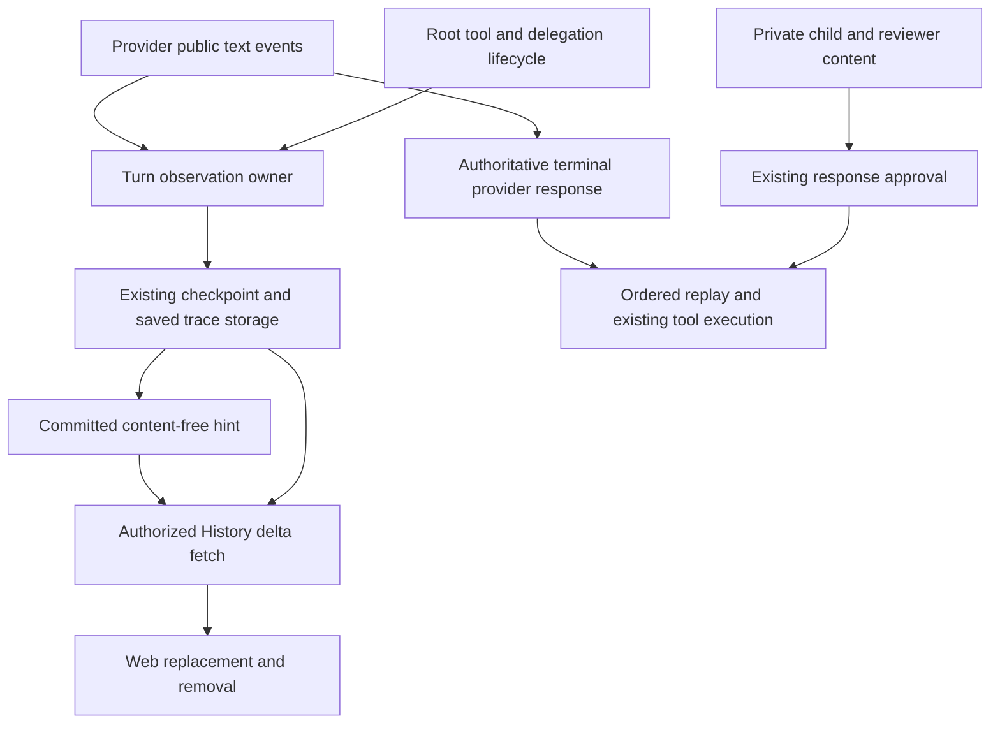
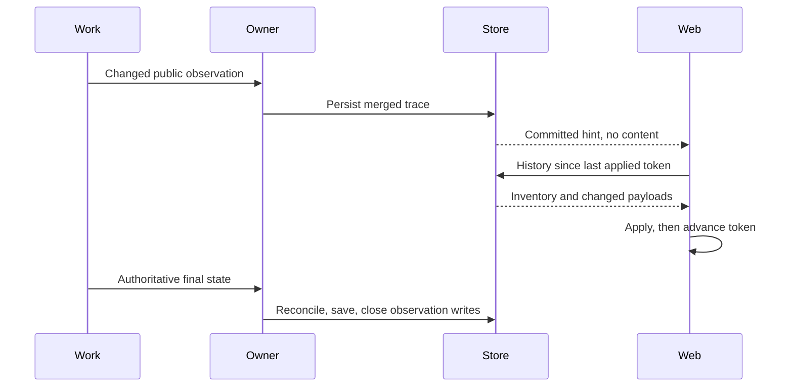
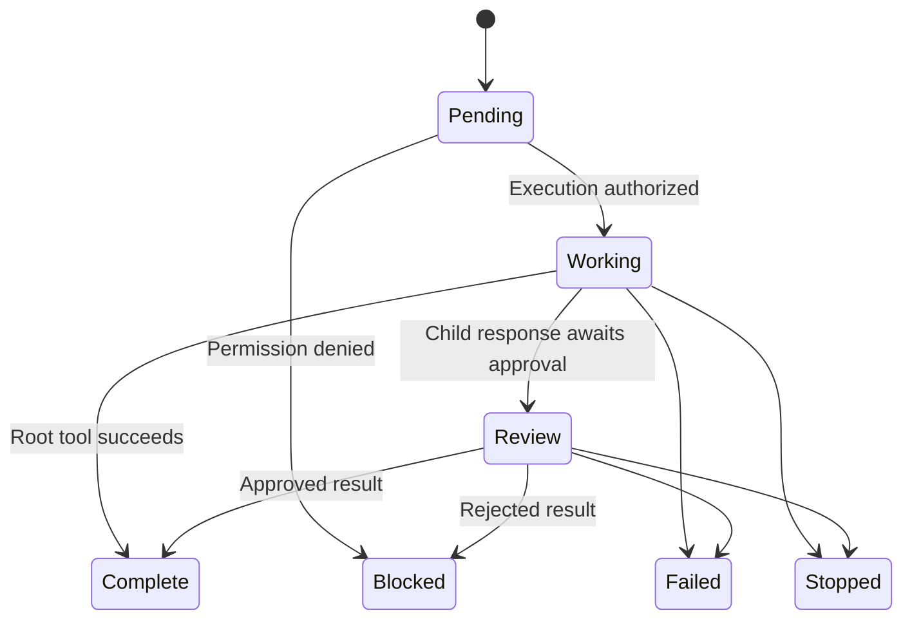

# Public Transcript Progress - Plan

## Goal Capsule

- **Objective:** Web users see real progress while an assistant and its delegations are working, instead of waiting for a sudden batch at the end.
- **Means:** Earlier durable public observations through the existing signal-and-fetch path (KTD1–KTD4).
- **Authority:** Repository instructions and the user's limits govern execution; R-IDs govern behavior, KTD-IDs govern implementation, and units override neither.
- **Execution profile:** Implement and verify locally only after authorization. Prefer native agent tools over shell-based cross-model orchestration.
- **Stop conditions:** Stop for a privacy/replay conflict, a required schema redesign, unexplained ordering changes, or a failing coverage/CLOC gate that cannot be fixed within scope.
- **Finish/ship boundary:** Return verified local changes for human review. No push, replacement PR, publication, merge, restart, or deployment is authorized.

---

## Product Contract

### Summary

Show public assistant text before its provider request finishes, delegation lifecycle status while children work, and each completed root tool before its slowest sibling finishes.
Live, refreshed, and reopened Web views use the same persisted observations.

### Problem Frame

The reported run showed “Thinking...” followed by all three delegations together.
Source inspection found three batching boundaries: intermediate provider events are discarded, child diagnostics wait for guardrail approval, and root tool-result checkpoints wait for the batch join.
The precise boundary responsible for that historical run has not been verified.

### Key Decisions

- **Public progress, not raw diagnostics.** Governs R1–R3, R6. Earlier visibility must not expose rejected or private child content (session-settled: user-approved — chosen over forwarding child diagnostics: response review currently protects their release).
- **Web is authoritative; Slack stays quiet until final delivery.** Governs R4, R9 (session-settled: user-directed — chosen over intermediate Slack streaming: retain one placeholder and the final answer/attachments).

### Requirements

**Earlier visibility**

- R1. Persist public root assistant text as supported provider text events arrive, without waiting for the request's terminal response.
- R2. Persist each delegation's safe start, working/review, and outcome status independently of its siblings.
- R3. Persist individual root tool completions before the batch joins; do not mistake a pre-permission observation for execution.

**Durable consistency and privacy**

- R4. Signals carry no content; Web fetches persisted replacements, removals, status, and reconnect catch-up since its last applied token.
- R5. Live and refreshed views agree, with stable identity, original call order, producer attribution, and existing authorization/origin filtering.
- R6. Exclude private child diagnostics, reviewer text, reasoning/encrypted payloads, prompts, and provisional tool arguments from the new public path; approved task results already returned to the parent retain existing visibility.
- R7. Display-only partials never become provider replay or recovery inputs and never authorize tool execution.
- R8. Retain failed/stopped progress with its terminal state; reconcile superseded attempts and final-save overlap without duplicates or false completion.

**Unchanged surrounding behavior**

- R9. Preserve Slack's single in-progress placeholder and final answer/attachments, delivery acknowledgement, outbound routing, and Web-input mirroring.
- R10. Preserve queue order, steer injection boundaries, stored command IDs, input consumption identity, permissions, compaction behavior, and main's prompt framing.
- R11. Finish meaningful coverage without lowering gates, hiding production code, changing CLOC budgets, or adding unrelated tests for percentage gains.

### Acceptance Examples

- AE1. Covers R1, R4, R7. A provider emits public text and then pauses before completion. Web and a newly opened view show that text while the request remains held; no provisional tool runs.
- AE2. Covers R2, R3, R5, R10. Three calls are emitted in A/B/C order and finish B/C/A. B and C visibly finish while A remains pending, rows keep A/B/C order, and a waiting steer stays parked until the established batch boundary.
- AE3. Covers R5, R8. Final output is shorter, different, or empty compared with a partial. The final representation replaces it exactly; refresh shows no stale suffix or duplicate bubble.
- AE4. Covers R4, R5. While disconnected, persisted rows change and disappear. Reopening catches up while the provider is still paused, without requiring a later signal.
- AE5. Covers R6–R8. A child emits distinctive private text and its response is rejected. Web shows a safe blocked outcome, never the private text or review reason; stopping the parent retains an incomplete terminal view that startup will not resume.

### Scope Boundaries

- Observe existing root/model-emitted tools and delegation lifecycle. A delegated child's Execute can remain represented as safe child activity; a new per-host-call tracing system is not required.
- Do not add task-inside-Execute, change tool availability, add agent-access endpoints, or edit generated host-tool prompt listings.
- No reasoning changes, decryption, fabricated progress, unrelated customer-thread inspection, or new polling/retry framework.
- Operational actions remain outside the finish boundary in Goal Capsule.

---

## Planning Contract

### Key Technical Decisions

- KTD1. **Reuse persisted deltas and content-free committed hints** (R4, R5). Keep `ObserveTranscript`, History, and metadata-only Join as the transport (session-settled: user-directed — chosen over content-bearing snapshot streams: refreshed and live views must share authority).
- KTD2. **Use explicitly typed public records within existing `OutputTrace` storage** (R1–R8). Checkpoints and saved `SessionEntry` already carry this replay-neutral JSON; project only recognized public records, never arbitrary trace JSON. Preserve existing provider/domain trace records without rendering them. This avoids a new storage column or migration and does not require developing a competing storage architecture.
- KTD3. **Give one turn-local owner all observation aggregation and persistence** (R5, R8, R10). Serialize merging of public state, progress-only writes, full-checkpoint writes, and final closure through that owner. Its lifetime includes final session append, checkpoint clear, and stopped/failed closure, not just `runTurn`. Workers submit immutable observations and never mutate replay or a full checkpoint. A SQL-write lock alone is insufficient because a stale full snapshot can still overwrite newer observations.
- KTD4. **Consume supported text events, preserve authoritative provider response objects** (R1, R6, R7, R10). Keep the existing WebSocket/auth/retry/error boundaries; expose intermediate events through a small named interface with an explicit inert implementation. Use installed SDK event types and its accumulator only where needed; do not build a raw-event mirror or reconstruct replay from deltas. HTTP compaction remains unchanged.
- KTD5. **Write changed public state synchronously, without a timer or extra queue** (R1–R4). Use a narrow trace-only update for intermediate events rather than rewriting replay per text delta. Persistence failures are fatal local errors, excluded from SDK/provider retries and ordinary tool-result error conversion; discard an unread socket before reuse. The throughput ceiling is synchronous database writes per changed public event; coalescing requires measured evidence and a separate decision, not speculative machinery.
- KTD6. **Separate execution outcomes from content approval** (R2, R6). Parent-owned lifecycle metadata uses canonical agent/model identity and fixed status labels, not free-form child descriptions or error/reviewer text. Child and guardrail content sinks remain inert. Response approval precedes publication of any task result under the existing result contract.
- KTD7. **Keep observation and command identities distinct** (R5, R10). Use producer-qualified turn identity plus response/item or call ID for public rows. Parent-qualified child IDs distinguish repeated/concurrent calls; names and diagnostic paths are not identities. Do not fabricate command-capable `message_id` values for progress, or repurpose `input_id`.
- KTD8. **Reconcile at authoritative boundaries** (R7, R8). Done/final text replaces partial text, including empty output. Successful provider replay replaces overlapping provisional rows; saved records retain completed activity metadata. Retry removes superseded provisional rows before publishing the next attempt, whereas stop/failure retains the last public observation under the terminal turn state. Recovery marks interrupted activity as such and starts new activity identities without injecting display records into replay.
  - Seed the owner from recognized records in the original recovered checkpoint before provider projection or its first upsert; preserve producer identities. Retain reconciled public records independently of current replay membership so compaction cannot erase their display fallback.
  - Recognized blocked-delegation metadata remains Web authority for that call, including after canonical replay is appended. Suppress its reviewer-bearing result in Web projection while preserving canonical provider replay and approved-result visibility.

### High-Level Technical Design

The architecture, ordered protocol, and lifecycle sketches describe KTD1–KTD8; the final turn state also governs unfinished rows.

### System-Wide Impact and Risks

- Full active-turn upserts currently replace `output_trace_json`. Route every participating write through KTD3; prove no late worker can overwrite terminal state or resurrect a cleared checkpoint.
- Compaction and cross-provider history projection currently discard trace. Preserve only recognized public records for observation where already authorized; do not copy arbitrary trace into another conversation or provider input.
- Every item in an active RPC entry currently appears incomplete. Public row state must not be confused with parent running state or command eligibility.
- The installed OpenAI SDK is v3.69.0. Intermediate events may contain sensitive arguments and unknown fields; KTD4's allowlist is essential. Empty final text and receive failure must not be treated as missing data and successful completion respectively.
- SDK middleware errors can trigger SDK retries, and ordinary tool errors become result text. Apply KTD5 before those retry/conversion boundaries; reconcile attempts at SDK and compaction retries as well as explicit looper retries.
- Existing notifications may fire without readable changes. Preserve no-op History behavior and avoid writes for identical public state.
- The unchanged RocketClaw coverage gate currently fails at 88.7% against a 89.3% baseline. Passing focused tests will not establish completion (R11).

### Sources and Deferred Execution Details

- `internal/rocketcode/active_turn.go`, `checkpoint.go`, `looper.go`, `responses_websocket.go`, `tasks.go`: checkpoint ownership, provider wait, ordered batch replay, and diagnostic privacy.
- `internal/rocketclaw/backend/store_dao.go`, `transcript.go`, `provider_replay.go`, `bridge.go`: full-row persistence, source-qualified observation, recovery, and final-only delivery.
- `CONCEPTS.md` and `docs/solutions/logic-errors/saved-queue-never-started-after-restart.md`: preserve ordinary later-work selection and producer/destination recovery routing.
- `internal/rocketclaw/docs/solutions/runtime-errors/deployment-binary-missing-live-migrations.md`: leave applied migrations intact; test-schema success is not deployment compatibility.
- [OpenAI Go v3.69.0 README](https://github.com/openai/openai-go/blob/v3.69.0/README.md) and installed Responses event/accumulator documentation support KTD4; current SDK documentation is guidance, not evidence to upgrade dependencies.
- Deferred to execution: establish the delaying boundary in the user-selected run or owned reproduction; choose exact public-record/interface names and status representation from existing RPC types. These are not permissions to expand scope or defer the privacy/ownership decisions above.

---

## Implementation Units

### U1. Establish durable public observation ownership

**Goal:** Persist replay-neutral observations safely alongside existing checkpoint data.
**Requirements:** R4–R8, R10; KTD1–KTD3, KTD5, KTD7–KTD8.
**Dependencies:** None.
**Files:** `internal/rocketcode/active_turn.go`, `checkpoint.go`, `looper.go`, `active_turn_test.go`; `internal/rocketclaw/backend/store_dao.go`, `transcript.go`, `bridge.go`, `transcript_test.go`.
**Approach:** Define the smallest typed public trace record and its recognized encoding, then connect the observation owner to existing sinks and trace-only persistence. Preserve arbitrary legacy trace as data, not public content; full checkpoints and final saves merge the owner's latest public state.
**Execution note:** Start with an owned held-work reproduction and a regression that fails when a later full checkpoint overwrites newer public progress. Investigate only the selected historical run if that evidence is needed; do not read unrelated threads.
**Test scenarios:**
- A progress write commits while work is held; transcript inventory includes it and notification contains only metadata.
- A full checkpoint follows progress from two siblings; both observations survive without changing replay.
- Identical observations yield no changed readable payload; unrecognized/private trace records remain absent from public projection.
- Storage failure propagates; completion/clear followed by a late worker cannot recreate the checkpoint.
**Verification:** Real-store observation and owner race tests establish durability, write ordering, and closure without new migrations.

### U2. Persist provider text before terminal response

**Goal:** Expose actual public root text while its provider request is still running.
**Requirements:** R1, R6–R8, R10; KTD4–KTD5, KTD7–KTD8.
**Dependencies:** U1.
**Files:** `internal/rocketcode/responses_websocket.go`, `responses_websocket_test.go`, `looper.go`, `looper_test.go`, `active_turn_test.go`; affected generated mocks only if their existing interfaces change.
**Approach:** Add intermediate public-event observation at the current transport/response boundary. Preserve terminal JSON, provider response phase/identity, headers, response errors, cancellation, retry, and HTTP compaction behavior.
**Test scenarios:**
- Covers AE1. Text arrives, then the provider remains held; persistence contains that text before terminal release, with diagnostics disabled.
- Covers AE3. Done/final text replaces partials with shorter, different, and empty text.
- Reasoning, encrypted content, and partial function arguments do not enter public records; provisional function calls never dispatch.
- Disconnect/EOF, failed/incomplete response, retry, and compaction reconcile observations without changing authoritative replay.
- A public-observation storage error terminates locally without a second provider create; a later request cannot consume unread events from the abandoned socket.
**Verification:** Existing WebSocket fixtures prove earlier persistence and unchanged terminal/error contracts without replacing the transport wholesale.

### U3. Persist independent tool and delegation outcomes

**Goal:** A fast call or delegation becomes visibly complete while siblings remain active.
**Requirements:** R2, R3, R5–R7, R9–R10; KTD3, KTD5–KTD7.
**Dependencies:** U1.
**Files:** `internal/rocketcode/looper.go`, `looper_test.go`, `tasks.go`, `tasks_test.go`, `tools.go` only for existing metadata wiring.
**Approach:** Submit safe call lifecycle observations at permission/execution and child-review boundaries. Keep root replay appending after the group join and retain child diagnostic buffering; attach parent-qualified identities through existing call metadata.
**Test scenarios:**
- Covers AE2. Three held calls finish B/C/A; B/C states persist before A releases, replay stays A/B/C, and steer injection stays after the join.
- Covers AE5. A child's private sentinel and reviewer reason remain hidden for approval, rejection, failure, and cancellation; lifecycle outcomes remain observable.
- Two same-named concurrent delegations retain separate identities and attribution; permission denial never appears as running/successful work.
- Persistence failure cancels/joins work through existing lifecycle handling rather than leaving workers or silent missing observations.
**Verification:** Existing tool-order, steer, guardrail, and task tests cover the new timing without new execution capabilities or private-content forwarding.

### U4. Project and render public rows through History

**Goal:** Reused delta fetching displays public progress with correct per-item state.
**Requirements:** R4–R6, R8–R10; KTD1–KTD2, KTD7–KTD8.
**Dependencies:** U1–U3.
**Files:** `internal/rocketclaw/frontend/rpc/server.go`, `live_test.go`, `server_test.go`; `internal/rocketclaw/web/proto/web.proto` only if existing item metadata cannot express the state; `internal/rocketclaw/web/src/types.ts`, `transcript.test.ts`, `ui.tsx` as needed.
**Approach:** Project only recognized public records, reconcile overlap with authoritative replay, and reuse existing tool disclosures and serialized reads. Add only metadata required for individual lifecycle/parent identity; keep Join content-free and command addressing unchanged.
**Test scenarios:**
- Covers AE3. Partial/final and active/saved replacement produce one correct row without stale content or fabricated command IDs.
- Covers AE5. A blocked task's canonical result contains a reviewer sentinel; History shows only the safe blocked outcome before join, after join, after save, and on reopen, while provider replay retains its existing result.
- A tool completes while its parent remains running; pending siblings, Stop, queue controls, footers, and source filtering remain correct.
- Covers AE4. Reopen fetches missed replacements/removals before any further signal; duplicate hints create no duplicate rows.
- Failed History reads retain content/token and show existing error behavior; explicit reopen/refetch recovers every missed change.
**Verification:** Exact History output and existing frontend tests establish live/refreshed equivalence and per-item completion without another content stream.

### U5. Verify recovery, privacy, routing, and browser timing

**Goal:** Prove the change end to end, including interrupted work and unchanged delivery.
**Requirements:** R4–R10; KTD1, KTD6–KTD8.
**Dependencies:** U2–U4.
**Files:** `internal/rocketclaw/backend/provider_replay.go`, `provider_replay_test.go`, `bridge.go`, `transcript_test.go`, `startup_recovery_test.go`; `internal/rocketclaw/frontend/rpc/live_test.go`; `internal/rocketclaw/web/src/session-list.browser.test.ts`, `live-transport.test.ts`; `internal/rocketclaw/frontend/slack/connector_test.go`.
**Approach:** Preserve recognized observation records through recovery/final save within existing visibility boundaries, then exercise owned provider and delegation fixtures through the real local Web path. Do not restart the deployed service for verification.
**Test scenarios:**
- Covers AE1–AE5. Browser shows committed text and independently finished children while provider/siblings remain held; refresh/reopen agrees at each stage.
- Stop/failure leaves terminal progress visible but nonrecoverable; restart recovery of eligible owned checkpoints preserves attribution without replaying display-only partials.
- Compaction and provider changes preserve authorized public observation while replay contains only its existing canonical inputs.
- Same-provider recovery seeds observations before the first full upsert; compaction that removes overlapping replay still leaves the correct public display fallback.
- Web observation never acknowledges Slack delivery; Slack retains one placeholder and only final text/attachments.
- Web-origin input mirroring, private-command chronology, destination routing, and stored message command targets retain their existing contracts.
**Verification:** Real-store, RPC, browser, recovery, and Slack tests separately prove timing, privacy, replay, queue semantics, and outbound behavior.

### U6. Close coverage and documentation gates

**Goal:** Return a fully checked local change rather than a deployed-but-failing result.
**Requirements:** R11.
**Dependencies:** U1–U5.
**Files:** Existing affected regression tests; `internal/rocketclaw/web/README.md`, relevant RPC documentation, and embedded Web assets generated from the changed source.
**Approach:** Extend uncovered relevant storage, provider, lifecycle, and failure cases until the existing gate passes. Apply repository Go standards to actual hunks before edits, during edits, before verification, and after tool fixes. Clarify the public-progress/private-replay boundary in the owning README.
**Test scenarios:** The existing affected suites and the Verification Contract are the proof; no parallel coverage-only scaffolding or unrelated tests.
**Verification:** Every required gate passes, source growth is measured honestly, and all temporary artifacts remain under repository `.tmp/`.

---

## Verification Contract

Use the current Go module toolchain (currently Go 1.27.1), installed dependencies, existing generated mocks, and isolated owned database/browser fixtures.
Use `testing/synctest` for in-memory ordering and timing where applicable; database/socket integration must use explicit held-operation barriers rather than real-time sleeps or assumptions about synctest I/O.
Use named interfaces with real/inert dependencies, per-call contexts, one synchronization owner, and modern standard-library helpers; no defensive guards, speculative abstractions, new dependencies, or unrelated modernization.

| Check | Required outcome |
| --- | --- |
| Targeted affected tests with race detection | Assert early progress before releasing held work, and reconciliation/terminal behavior after the corresponding boundaries. AE1–AE5 pass without races or worker leaks. |
| `gofmt` on touched Go files | No formatting drift. |
| `go doc` and gopls checks on touched APIs/files | Correct SDK usage and no changed-file diagnostics. |
| `go test ./...` | All repository packages pass. |
| `make lint` | All lint/build checks pass without suppressions; review any automatic fixes. |
| `make test` | Race, coverage, and CLOC gates pass unchanged. |
| `make check-cloc-budget` | Production code remains within every unchanged component budget. |
| `bun test` and `bun run build` in `internal/rocketclaw/web` | Frontend unit/browser checks and generated assets pass against the owned local test server. |

For database integration, use `ROCKETCLAW_TEST_DATABASE_URL` targeting the owned transcript test database; browser tests use `ROCKETCLAW_TEST_HTTP_URL` targeting an owned local server, not a replacement deployed daemon.
Set temporary paths, including `TMPDIR`, inside repository `.tmp/`; never use system temporary directories.
The RocketClaw coverage gate must pass its computed baseline comparison, currently 89.3% versus 88.7%; the Makefile's stable threshold remains 90.0%.
If any required check cannot run or a gate remains failing, report the exact blocker instead of calling the implementation complete.

---

## Definition of Done

- U1–U5 satisfy their cited R-IDs and acceptance examples with observable early progress and no privacy, replay, ordering, or delivery regression.
- U6 passes every Verification Contract gate, including the unchanged coverage comparison and CLOC budgets.
- Review the final actual diff for stale checkpoint writes, private-data projection, recovery contamination, defensive code, accidental exported API growth, and abandoned-attempt code; remove only newly introduced leftovers.
- README impact is addressed in the owning Web/RPC documentation, and embedded assets match their source.
- All implementation changes remain local; the already deployed daemon is untouched.
